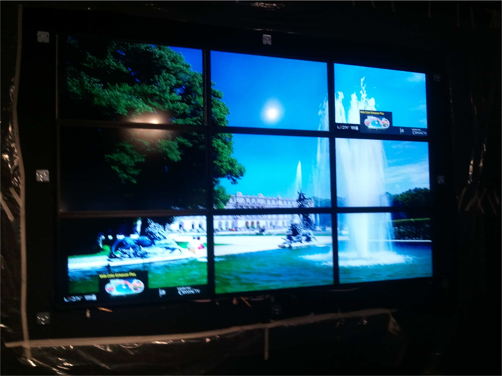
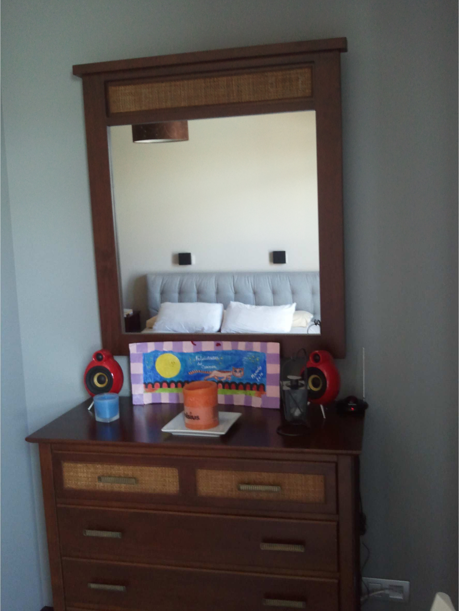
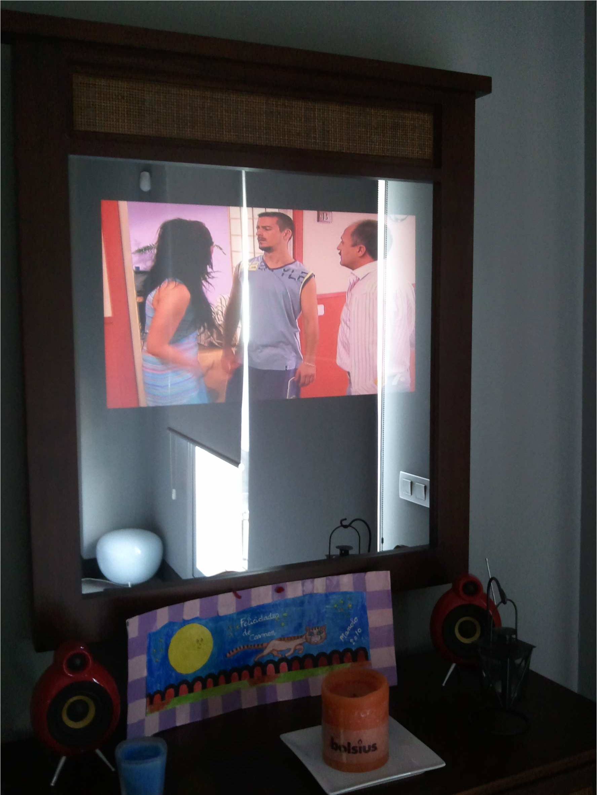

Ingeniería, Empresa y Sociedad
=========================================
1º Grado en Ingeniería Informática 2010/2011
--------------------------------------------

# Plan de empresa: LIMBO S.L.
### Jose Antonio Jiménez Salinas
### Rafael Marañón Mederer
### Germán Martínez Maldonado

## 1. INTRODUCCIÓN AL CONCEPTO DE EMPRESA

Nuestra empresa se registrará con el nombre Limbo s.l., Granada, Polígono Industrial Armilla. Su objetivo será el montaje, venta e instalación de pantallas de LEDs. 

### Subsistema de aprovisionamiento 

* **Pantallas**. Nuestro producto se va a almacenar en una nave industrial, que dividiremos en partes: una parte para el almacenamiento y otra parte para la venta tanto al por mayor como al por menor. Se tendrá una reposición de 160 pantallas. Los pedidos superiores a 100 pantallas deberán ser bajo pedido. Los pagos correspondientes a pedidos superiores a 10 pantallas se realizarán bajo transferencia bancaria. 

* **Inputs**: Los inputs necesarios para el montaje de pantallas serán adquiridos a empresas específicas. Esta opción resulta más rentable que comprar la maquinaria necesaria para fabricarlos, pues cuando los inputs necesarios para construir las pantallas se fabrican a mayor escala salen mejor de precio, un ejemplo de los inputs serían los LEDs, cables, circuitos... Todos los inputs recibidos deberán pasar bajo un control de calidad que asegure su correcto funcionamiento para de este modo facilitar la obtención de los mínimos aparatos defectuosos posibles. 

* **Proveedores**: La selección de proveedores se hará atendiendo a la relación calidad-precio de los componentes que vamos a adquirir, a la cercanía de la situación de las empresas proveedoras así como la mayor conveniencia de los medios de transporte a utilizar, de cara a evitar un incremento excesivo de los costes por transporte. 

### Subsistema de Recursos Humanos 

Para nuestra empresa necesitaremos empleados que cubran una amplia variedad de servicios: 
* Técnicos de montaje.
* Comerciales.
* Vendedores.
* Investigadores para el departamento I+D.
* Personal de Administración.
* Directivos. 

Los empleados contratados para las tareas de montaje y venta deberán contar con una 
titulación en informática, ya sea proveniente de un módulo específico o titulado en ingeniería informática, telecomunicaciones o industrial. Las tareas de investigación y desarrollo de nuevos productos deberán ser realizadas por ingenieros especializados. 

Ya sea desde su inicio o con formación posterior una vez introducidos en la empresa, se requerirá al menos un empleado que esté formado en riesgos laborales. Así mismo, y entre los directivos, sería conveniente que alguno dispusiera de formación específica para la captación de personal. Para las tareas de administración, será necesaria una titulación proveniente de empresariales y/o secretariado de dirección. Se contempla la posibilidad de contactar con la Universidad para facilitar trabajo en concepto de formación en prácticas. 

**Introducción en la empresa**: Para introducir a los empleados de la empresa se facilitará un cursillo informativo que les dé a conocer la información básica necesaria sobre la empresa así como datos más específicos relacionados con la labor concreta a desempeñar dentro de la misma. 

**Incentivos**: Como medida incentiva se contempla complementar el suelo con comisiones en función del número de ventas, en el caso de este tipo de personal, así como un complemento extraordinario en el caso de un número elevado de ventas. Asimismo, se concederá un complemento extraordinario en el caso de un número elevado de montajes correctos. Este dato se podrá controlar con el uso de códigos para las pantallas y asignando un código a cada empleado, de este modo al introducir el empleado el código de la pantalla, se sabrá quien ha montado las pantallas que resulten defectuosas e, igualmente, quienes han ensamblado un mayor número de pantallas en óptimas condiciones. 

### Subsistema financiero

Será necesaria una inversión inicial de 200.000€. Los cálculos se han realizado teniendo en cuenta el importe aproximado de los materiales requeridos por pantalla y ensamblado, y que se pretende obtener una remesa inicial de 160 pantallas. 

### Subsistemas de I+D+i 

En la actualidad se está investigando como disminuir aún más el consumo de energía eléctrica, si bien hemos llegado a reducir en un 80% el consumo de energía. También se está investigando como reducir el tamaño de la tecnología de los pantallas, para así poder construir pantallas para móviles, GPSs manteniendo todas las prestaciones que tienen las que vendemos ahora. Está previsto que el departamento de I+D indague en esta línea de investigación. 

### Subsistema Comercial 

Los monitores se enviaran a través de una empresa de transportes. O, si es necesario, por el mensajero de la empresa que también instalara la pantalla. Se creara una página web en la que se pueda ver el catálogo de pantallas, comprar las pantallas y ver los avances de éstas, así como consultar dudas y contratiempos sencillos y que no requieran de una atención mayor. 

Para la publicidad de la empresa se crearán anuncios para que emisión en televisión y en internet, así como en otras páginas web. Contrataremos un seguro tanto para pequeños como grandes envíos, seguro por robo en el almacén, incendio, etc. 

### Subsistema de Producción 

Nuestro producto son monitores de LEDs de 21 pulgadas que consumen mucha menos energía que los monitores normales. Los monitores son ultra-delgados, muy ecológicos, reducen la emisión de gases de carbono, tienen una resolución Full HD (1920x1080). Las imágenes son más nítidas. Consumen un 80% menos de energía que las televisiones normales. 

El montaje de las pantallas será manual, dado que el ensamblaje supone tan sólo la interconexión de todos los componentes de las pantallas. Se proporcionara una garantía de 2 años. El servicio atención al cliente post-venta llevará las reparaciones de los productos tanto en periodo de garantía como fuera de ella. En principio, el funcionamiento rutinario productos en garantía prevé enviar automáticamente una pantalla nueva al cliente que informe de alguna avería. Con el mismo transporte que lleve dicha pantalla se recogerá la pantalla original defectuosa. De este modo el cliente no deja de disponer de su producto. En caso contrario, se recogerá la pantalla y se arreglará. 

### Subsistema de Dirección 

Los propietarios de la empresa también estarán implicados en la empresa tanto en la producción del producto como en desarrollo de la tecnología usada en el mismo (I+D) o en la tarea de las relaciones comerciales de la empresa. Por lo tanto los propietarios son empresarios. Estos empresarios también actuarán como supervisores o directivos intermedios para con el resto de empleados de la empresa. 

## 2. PROPIEDAD, DIRECCIÓN Y GOBIERNO DE LA EMPRESA

### ¿Cómo ha cambiado el concepto de propietario/directivo/empresario desde el inicio de la empresa?

Al comienzo, cuando creamos la empresa, los 3 fundamos y éramos copropietarios de la empresa. Y nos encargábamos de las tareas de dirección, gestión y producción, es decir, poseíamos la empresa y la dirigíamos, éramos empresarios. 

Al lograr una venta estable de nuestro producto, aumentó la demanda de este. Contratamos varios empleados, empezando a pasar nuestra labor del trabajo directo en la producción a tareas administrativas, de dirección y gestión de las finanzas; nos convertimos en directivos progresivamente. 

Cuando la empresa se volvió lo suficientemente grande, sufrimos cambios en la empresa quedando como directivos únicamente, encargados de la alta dirección. 

### ¿Cómo ha cambiado el rol que desempeñabais a lo largo de la transformación de la empresa? 

Al principio los 3 éramos empresarios, nos encargábamos de todo en la empresa, tanto la dirección, gestión económica, gestión de materiales, etc. Y también de la producción. 

Pero a medida que iba aumentando el número de empleados en plantilla y la empresa iba creciendo, cada vez nos encargábamos menos de las labores de producción y más de dirección y gestión de la empresa. Hasta que finalmente, tras varios cambios en la empresa, quedamos únicamente como directivos de alta dirección. 

### ¿Cómo ha ido cambiado la empresa desde su inicio? Elabore la secuencia de organigramas

Al comienzo de la empresa se daba un organigrama lineal, con la dirección ejercida por los 3 miembros del grupo (también nos encargábamos de las finanzas, recursos humanos, marketing etc.), y la producción, la realizaban nuestros empleados. 

Cuando la empresa creció, y tras varios cambios en esta, el organigrama pasó a una estructura divisional, con nosotros en la dirección general, pero ahora, las labores de Recursos humanos, eran llevadas por personal específico de un departamento independiente, al igual que las finanzas, marketing, etc. 

## 3. INTRODUCCIÓN AL PROYECTO EMPRESARIAL

### Descripción General del plan de negocio 

Nuestra empresa se va a llamar LIMBO S.L., y se va a dedicar al sector de la tecnología, más concretamente a la informática. Somos una empresa que de inicio, se va a dedicar a la fabricación, y posterior venta, de pantallas con tecnología LED de bajo consumo eléctrico, con un ámbito de actuación nacional, con mostradas intenciones de expandirse internacionalmente según vaya aumentando el volumen de negocio, y un público objetivo de personas preocupadas con el impacto medioambiental que produce el malgasto de energía eléctrica, intentando llamar la atención de nuestros posibles clientes a través de intensas campañas de publicidad, en todo tipo de medios, además de a través nuestra página web, que usaríamos también como principal medio de venta. 

Como tenemos la idea de empezar con un negocio de tamaño medio que fuera creciendo poco a poco según se fueran produciendo buenos resultados, inicialmente necesitaríamos 8 empleados para realizar las labores de montaje de las pantallas y, otros 3 empleados, que se encargarían de realizar las labores de ventas y servicios de atención al cliente. Según nuestras estimaciones, el capital inicial necesario sería de 70.000€, para poder realizar la adquisición de la maquinaria y los materiales necesarios para comenzar con la actividad; de este capital inicial, cada uno de los promotores aportaríamos inicialmente 10.000€, y los 40.000€ restantes lo conseguiríamos de una línea de crédito para jóvenes emprendedores que facilitan las diversas entidades bancarias. 

Cada día hay más estudios que demuestran que el malgasto energético produce un gran daño al medio ambiente, y conocedores de que cada día más gente está concienciada sobre tal problema, daremos la facilidad a nuestros clientes de poder adquirir pantallas que les ayuden a cuidar del medio ambiente, pero además sin tener que pagar un precio extra para tal fin, como sucede con muchos otros productos, un hecho que aunque difícil, intentaremos conseguir para que nuestros clientes cada día 
confíen más en nosotros. 

Aunque el mercado de los monitores es un mercado ampliamente explotado, el hecho de que vayamos a trabajar con una tecnología relativamente nueva, puede hacer que entremos en mejores condiciones para competir, claramente no estamos en disposición de competir con grandes fabricantes reconocidos del sector como LG, Philips, Samsung, ni tan siquiera con otros de menor nombre en este campo como pueden ser Hacer, Asus o BenQ, sería un gran error intentar competir de inicio a su nivel, por lo que intentaremos establecernos en el uso de esta tecnología nueva, y así, poco a poco, estar mejor preparados para poder ser considerados un gran alternativa. 

Los resultados esperados, es que con nuestro planteamiento y conjeturamos 
que vamos a tener un buen nivel de ventas, podríamos cerrar el primer año de la empresa con cierto margen de beneficio, y una vez vaya aumentando el volumen de negocio, poco a poco podríamos establecernos en el mercado, aumentando el número de personal contratado, lo que nos permitiría fabricar más productos, lo que a la vez nos reportaría mayores beneficios. 

### Los promotores del proyecto 

Somos tres los promotores de este proyecto: Rafael Marañón Mederer, 19 años, de Granada; José Antonio Jiménez Salinas, 19 años, de Lanjarón (Granada) y; Germán Martínez Maldonado, 23 años, de El Ejido (Almería). Rafael y José Antonio, ambos con títulos de Bachillerato, y Germán con título de Técnico Superior en Administración de Sistemas Informáticos, todos estudiantes de Grado en Ingeniería Informática. 

Germán cuenta con una amplia experiencia en el sector informático, por el que se interesó primero como afición, y posteriormente, tras cursar estudios específicos relacionados, a nivel profesional, habiendo trabajado en una empresa de reparación y venta directa al público de material informático, y también en una empresa encargada de realizar instalaciones y reparaciones de servicios de telefonía fija e internet. 

En cuanto a José Antonio, durante los años previos a su matriculación en el Grado de Ingeniería informática, ya se encontraba ampliamente relacionado con el mundo de la informática, trabajando de técnico informático de forma esporádica para sus familiares o conocidos de su pueblo natal. 

Con respecto a Rafael, también empezó como afición, ha estado trabajando como técnico de informática para amigos y familiares. Además ha trabajado instalando pantallas, de las dos formas que se describirán más adelante: instalaciones básicas e instalaciones especializadas. 

Cada uno de los promotores del proyecto tendría un papel importante y específico en el funcionamiento de la empresa. Rafael se encargaría del departamento de ventas, José Antonio se encargaría del departamento de I+D+i y Germán se encargaría de la gestión general de la empresa; el resto de puesta de trabajo más adelante descritos, serán llevados desde el principio por personal que contratemos para tal fin. 

Todos aportamos nuestros conocimientos y ganas de innovar en un mercado que está en continua evolución, y al encontrarse en un momento en el que es difícil para los jóvenes irrumpir con fuerza en el mercado, porque cada vez son menos las oportunidades que se presentan, a través de nuestro esfuerzo crear dichas oportunidades, para nosotros y el resto de personas en nuestra misma situación. 

### La idea de negocio: el producto/servicio 

Nos vamos a dedicar a producir pantallas con tecnología LED de diversos tamaños, con Zeus como nombre para la gama de monitores. Nuestros dispositivos tendrán características técnicas de gran calidad como contar con un único chip de alto rendimiento, estructura modular de fácil mantenimiento, una larga vida útil, pantallas con indicaciones según el tipo de imagen a mostrar, control remoto, información meteorológica (tiempo, temperatura y humedad) 

Las características aquí descritas son solo una pequeña parte de lo que ofrecen nuestros monitores, con lo que esperamos poder satisfacer las necesidades de un mayor espacio de clientes. 

## 4. ANÁLISIS DEL ENTORNO DE LA EMPRESA

### Análisis del entorno específico de la empresa

#### Amenaza de nuevos entrantes: 

En la empresa Limbo nos dedicamos a la fabricación de pantallas/monitores, este tipo de producto tecnológico es algo que producen muchas empresas y que debido al avance de la tecnología, es seguro que más empresas, tanto nuevas como ya veteranas en otros ámbitos de la tecnología, producirán un producto igual al nuestro (en cuanto a las necesidades que cubre). 

La reacción de los competidores del sector ante nuestra llegada fue prácticamente nula, una empresa nueva en este sector no llama demasiado la atención y en un primer momento no implicó ninguna reacción en la política de ninguna de las empresas grandes del sector. 

En cuanto a las barreras de entradas, sí existen varias y la principal es la enorme inversión inicial que debe hacerse. Empezando por el crédito pedido para fundar la empresa, la obtención del local para la fabricación, los componentes son caros en este tipo de dispositivos tecnológicos, las patentes de nuestra tecnología, etc. 

Otra barrera inicial muy a tener en cuenta fue la gran dificultad para captar clientes, debido a la existencia de productos que cubren los mismos servicios que el nuestro pero que se encuentran altamente diferenciados y también que los clientes son, quizás no fieles completamente a una marca concreta, pero sí lo son a las marcas más grandes y poderosas del mercado. 

También nos encontramos que en las empresas ya instaladas disfrutan del 
efecto experiencia, al menos a la hora de desarrollar un nuevo producto, ya que poseen en plantilla especialistas con mayor experiencia en la creación de componentes electrónicos. 

#### El poder de negociación de los proveedores 

En nuestra empresa disponemos de 4 empresas proveedoras. Una empresa se encarga de suministrarnos de cables, y conectores de componentes electrónicos. Otra empresa nos provee de los circuitos integrados de la pantalla, que fabricarán siguiendo los planos de nuestra patente. Una tercera empresa nos aporta los LEDs, las pequeñas partes que componen la pantalla propiamente dicha (el "cristal"). Y nuestro último proveedor nos entrega el material de plástico en el cual se realiza el montado final de las pantallas y hace de "carcasa" de nuestro producto. 

Todos los proveedores se encuentran en España, pero la empresa que nos provee de LEDs lo hace adquiriendo estos a una tercera empresa extranjera, haciendo que el coste de este componente sea el más caro de nuestro producto, pero no podemos prescindir de esta empresa ya que los LEDs no son fabricados en España y buscar un proveedor extranjero nos resultaría aún más caro. Por lo tanto este proveedor tiene un gran poder de negociación sobre nosotros, ya que sin esta empresa nos veríamos obligados a parar la producción, y pasaría algún tiempo hasta conseguir que una empresa extranjera nos aporte los LEDs, además del aumento del costo del producto. Aunque a pesar de esto, nuestra empresa no parece ser de gran importancia para este proveedor ya que posee como clientes a empresas bastante más grandes y veteranas en el sector. 

Respecto a los otros proveedores son empresas nacionales, y en este caso hemos escogido las más próximas a nuestras instalaciones. En el caso de las empresas de cables y conexiones eléctricas y de material plástico para el montaje, son empresas de la misma comunidad autónoma (se encuentran a una distancia menor a 300 km de nuestras instalaciones), lo que hace que el coste de estos componentes no aumente demasiado de su costo real. Estos 2 proveedores no tienen demasiado poder de negociación sobre nosotros ya que existen varias empresas con gran rivalidad entre ellas respecto al tema del cobre y elementos plásticos, así que no sería un gran problema encontrar otra distribuidora en el caso de sufrir algún percance o aumento de precio por parte de estas 2 empresas. 

Y en el caso de la empresa de circuitos integrados, existen pocas empresas que puedan fabricar los componentes que requerimos según el modelo de nuestra patente y todas se encuentran en Cataluña. Así pues de ahí es nuestro proveedor. Este proveedor tampoco tiene un gran poder de negociación sobre nosotros, ya que, digamos que nos presta un servicio más que ejercer de proveedor. Esta empresa fabrica nuestro producto, según nuestro modelo, y nos lo envía, por tanto es una empresa que nos valora como cliente y tenemos cierto peso en ella. 

Nuestra empresa no parece resultar de gran importancia para ninguno de estos distribuidores, ya que al ser una empresa pequeña, nuestros pedidos no son demasiado grandes, por lo que tampoco somos una gran fuente de ingresos para ellos. 

Respecto al proveedor de materiales plásticos, existen otras empresas que podrían proveernos de esos mismos materiales y hay otras empresas que fabrican productos que podríamos usar en lugar del plástico. De hecho una opción muy real sería cambiar el plástico de las carcasas de nuestro producto por otros materiales como fibra de carbono, más ligera y resistente, por ejemplo. 

Respecto al peligro de una posible integración vertical hacia delante de alguno de nuestros proveedores, eso es algo que no nos preocupa ya que nuestros proveedores por si solos, no serían una amenaza a nuestra empresa y en caso de que se diera esa integración vertical hacia delante, seriamos clientes a gran escala de esa empresa, pero nunca rivales. 

#### El poder de negociación de los clientes 

En nuestra empresa el cliente no tendrá un gran poder de negociación ya que dispondremos de una lista de precios establecidos, tanto para los monitores como para los servicios de instalación que ofrecemos con una pequeña rebaja para clientes empresariales (grandes superficies, tiendas de electrodomésticos) cuando realicen un pedido considerable. 

Respecto a los diferentes productos que ofrecemos, son todos del mismo tipo (cubren las mismas necesidades), con la única variación del tamaño (las pulgadas de los monitores), siendo más baratos y de peor calidad de imagen los de menos pulgadas y los más caros y con calidad de imagen superior, los de más pulgadas. Así los clientes podrán escoger de entre nuestros productos, el que mejor se adapte a su necesidad. En este mercado tecnológico existen gran cantidad de productos que cubren las mismas necesidades que los nuestros. Hay gran cantidad de empresas, tanto europeas, como americanas como japonesas que gozan de renombre en el sector y que ofrecen productos sustitutos al nuestro. 

En cuanto al cliente industrial, aún no hemos abierto esa posibilidad, pero sin duda cuando la empresa crezca lo suficiente y la producción sea la adecuada ofreceremos a distintas empresas la posibilidad de que sus ordenadores se vendan acompañados de nuestros monitores. Aunque siempre existe el riesgo de la integración vertical hacia atrás del cliente industrial y comience a fabricar sus propios monitores. 

A los clientes les dispondremos de amplia información de nuestros productos, las pulgadas, contraste, resolución máxima, conexiones disponibles, y consumo de energía (nuestra principal baza para atraer al cliente). 

#### Amenaza de sustitutos 

En el mercado en el que se encuentra nuestro producto existe un alto grado de amenaza de sustitutos, ya que hay otras empresas que ofertan productos que cubren las mismas necesidades con los nuestros, y que con quizás menor calidad, los venden a un precio bajo, en respecto al resto de empresas, haciendo que si queremos ofrecer un producto atractivo a los clientes, pongamos un precio en proporción respecto a ese producto sustituto. 

#### Rivalidad entre competidores existentes 

Existe una gran rivalidad en este mercado ya que hay una gran cantidad de empresas en él, ofertando productos que cubren las mismas necesidades. El sector industrial de nuestra empresa crece a gran ritmo y se dan grandes innovaciones a nivel tecnológico base, que en un principio hace que los productos nuevos con esa tecnología innovadora tengan un gran coste y un alto precio en el mercado, pero a medida que las distintas empresas que compiten en el sector van desarrollando esa tecnología, el coste y el precio de los productos se van reduciendo lo que genera una rivalidad atroz entre las empresas del sector, ya que ofertan productos muy similares, con apenas unas pequeñas diferenciaciones, con precios muy similares. 

## 5. DIAGNÓSTICO INTERNO DE LA EMPRESA Y ANÁLISIS DE LA ESTRATEGIA

### Análisis interno de la empresa: Matriz DAFO 

Una vez planteada la empresa a desarrollar, es necesario conocer los factores que de inicio podrán condicionar el mejor o peor funcionamiento de la misma, para esto realizaremos un análisis DAFO, se basará en realizar por un lado un análisis de factores internos (Debilidades y Fortalezas) y por otro sobre los factores externos (Amenazas y Oportunidades). 

Al ser una empresa joven y adentrarnos en un mercado tan explotado como el de los pantallas, contaremos con numerosas dificultades, por lo que deberemos siempre buscar la innovación para destacar, por eso el hecho de centrarnos sólo en la producción de pantallas LED, mucho más ecológicas y con un mercado todavía por explotar. 

#### Debilidades 

Son muchas las debilidades que a simple vista podemos encontrar para desarrollar la actividad de nuestra empresa. Uno de las primeros y principales obstáculos, es que aunque la amortización de la inversión en nuestros productos, se produciría en muy poco tiempo, el gran capital necesario inicialmente, es un problema que habría que solucionar antes de poder empezar a realizar la actividad, por lo que necesitaríamos un gran inversor que aunque pudiéramos asegurarle que su inversión estaría garantizada a corto plazo, tuviera la suficiente confianza para proporcionarnos los recursos necesarios. 

Como ya hemos dicho, aunque en nuestra actividad usaríamos una tecnología que lleva tiempo siendo usada, está todavía en continuo desarrollo para ser mejorada, lo que unido que a nuestra empresa es nueva en el sector, le costará competir con otros fabricantes que aunque también son nuevos en el uso de esta tecnología, tienen más experiencia en investigación y desarrollo de tecnologías previas con conocimientos que podrían aplicar para el desarrollo de esta. Relacionado también con este último hecho descrito, se encuentra el factor de que nuestros costes serían más altos y rentabilidad sería inferior en relación con los competidores, aun así tenemos la expectativa de que esto cambiase en un corto espacio de tiempo en función de que el negocio empezase a funcionar. 

Aunque desde principio, y dado que no estaríamos aliados con ninguna gran empresa conocida del sector, contásemos con un débil imagen de mercado, una vez que los clientes comenzaran a ver por si mismos la calidad de nuestros productos y la profesionalidad que siempre nos caracterizaría en nuestros trabajos, en poco tiempo podríamos convertirnos en un referente en el sector, factor que también iríamos mejorando a la par que aumentasen nuestras habilidades de marketing y de talento gerencial. 

#### Fortalezas 

El hecho de que considerásemos realizar una empresa relacionada con el ámbito tecnológico e informático no es ninguna casualidad, esto es debido a que como todos los fundadores provenimos de realizar diversos estudios sobre el campo de la informática, consideramos que tenemos unas adecuadas capacidades clave para desarrollar nuestro producto, por eso a la hora de buscar personal, buscaríamos personas con nuestro mismo perfil como base, a la que especializaríamos en realizar las determinadas tareas que considerásemos necesarias. 

Como nuestra principal actividad será la fabricación, mediante la economía de escalas podríamos, a largo plazo, reducir el coste medio de la fabricación mediante nuevas técnicas de fabricación, algo especialmente importante, teniendo en cuenta que vamos a buscar hacer nuestros productos lo más económicos posible. 

Nos consideremos ante todo innovadores, por eso desde un principio apostados por esta tecnología, pero no simplemente nos cerramos a desarrollar pantallas LED, según nos fuéramos estableciendo en el mercado, buscaríamos nuevas áreas dentro de nuestro campo, que es la informática, en las que seguir innovando, aunque esto es algo inherente a la propia informática, ya que los avances en la misma nunca dejar de aparecer. 

#### Amenazas 

Fundamentar toda la actividad de nuestra empresa en tecnologías de nuevo desarrollo no es una casualidad, esto es así porque consideramos que cuanto más nuevo es algo y menos explotado este, aunque más costoso al principio, pero habrá un menor número de amenazas contra nuestro negocio, dependemos para destacar más de lo bien que lo podamos hacer nosotros, que de lo mal que lo hagan los demás, pero claro está, nunca confiándose, porque si no se está debidamente preparado, siempre ante la aparición de nuevos competidores pueden hacer que desaparezcamos, haciendo un producto con mejor calidad o dando un servicio más atractivo de cara al cliente. 

#### Oportunidades 

A nadie se le puede escapar a la vista, que la población mundial cada día está más concienciada con el medio ambiente, por eso para nosotros es, a parte de una buena oportunidad de negocio, prácticamente una obligación moral contribuir en la mayor medida posible a ayudar a esa concienciación global, por eso creemos en nuestra idea de negocio, con la que esperamos introducirnos ampliamente en este nuevo mercado, la tecnología que busca ser lo más ecológica posible, en un principio sólo con las pantallas, pero en un futuro hasta donde nos llevasen de los nuevos límites tecnológicos. 

Otra oportunidad de esta empresa, es la meterse en un negocio que según estudios recientes cuenta con rápido crecimiento, en 2009, la penetración de las pantallas LED en proporción a otro tipo de tecnologías era de apenas el 3%, hoy en día es de sobre el 15%, pero es que según estimaciones, estos porcentajes serían del 40% para 2013, lo que deja ver que es un negocio perfectamente viable, siempre que la empresa sepa cómo ir adaptándose a las diferentes etapas por las que pase el mercado. 

### Estrategia corporativa 

En un principio, las actividades que desarrollaría nuestra empresa son muy concretas, fabricación y venta de monitores LED, pero sobretodo centrándose en la fabricación, ya que si el producto que se vende es de buena calidad, será más fácil que sea vendido. Para que nuestros productos siempre sean de una calidad óptima, es importante que tantos nuestros proveedores como nuestros trabajadores sean también grandes profesionales, y un mercado que cambia a un ritmo tan alto como el tecnológico, esto no es siempre fácil, por lo cual no se puede dejar de trabajar siempre al máximo ritmo. Como nos centraremos en llamar la atención de clientes preocupados por el medio ambiente, para poder mantener una posición competitiva, este es un mercado muy difícil por su gran novedad, por lo que es necesario 
siempre estar investigando para obtener los últimos avances tecnológicos. 

### Estrategia de negocio 

#### Estrategia competitivas de Porter 

Una de las principales desventajas de nuestro negocio, es que la tecnología que usamos, todavía no tiene la suficiente viveza en el mercado para poder ser realmente asequible en comparación con otras tecnologías, por eso queremos centrarnos en hacer que nuestros productos sean lo más económicos posible, algo que a la larga será mucho más factible gracias a las economías de escalas, haciendo que a través de las nuevas tecnologías cada vez sea más simple la fabricación de nuestros productos, y por lo tanto, más baratos. 

Un problema de esta estrategia, es que siempre deberemos estar estudiando que movimientos hacen los competidores, porque si adoptasen nuestra misma estrategia, podría llegar el momento en el que tuviéramos que cambiar la fórmula del negocio, porque este podría dejar de ser rentable, y en tal caso, habría que tener estrategia alternativa preparada. En caso de que llegase a producirse esta situación, nos centraríamos en buscar que los consumidores quisieran comprar nuestro producto por su particularidad, intentando conseguir una lealtad hacia nuestro producto. 

#### Ciclo de vida actual 

Podemos considerar que nuestro producto está finalizando la etapa de introducción para introducirse en la etapa de crecimiento, pensamos que esto es así, porque aunque el producto todavía es poco conocido, además de que solo los principales fabricantes del sector se han introducido de lleno en la fabricación del mismo, poco a poco, va aumentando considerablemente la demanda. Como hemos dicho, sólo los principales fabricantes se han introducido en el mercado, pero más por obligación de mantener su nombre, que por interés, por eso consideramos que es el momento oportuno para intentar destacar en ese sector, pero claro está, todavía será necesario que la tecnología se defina algo más, y sobretodo, que llegue al gran público, no sólo a la gente especializada en el sector o movida por fines ecológicos, para la cual será necesaria realizar grandes campañas de publicidad y hacer que el producto se lo más llamativo posible. 

## 6. PLAN DE PRODUCCIÓN DE LA EMPRESA 

### La Dirección de la producción

Nuestro objetivo es conseguir minimizar los costes de producción de tal forma que los precios de venta al público puedan ser adecuados. El producto resultante es de alta calidad, pues las prestaciones que ofrece, entendidas en el marco de desarrollo de las nuevas tecnologías, incluyen innovación y elegancia, características con las que queremos definir y dar consistencia a nuestro producto de cara al cliente. Es por ello por lo que el precio final ha de responder a una relación calidad/precio adecuada y capaz de convencer al cliente que busca un buen producto. Para ello, será indispensable contar con elementos de ensamblaje a un buen precio así como un personal dinámico y eficaz que permitan como resultado, un producto rentable. 

El compromiso con el cliente es un valor preferente: servir el producto con prontitud, cumplir los plazos con él convenidos, así como responder eficaz y velozmente ante cualquier imprevisto, defecto o daño que pudiera acontecer, han de ser consideradas como una prioridad. Dado el continuo avance de las nuevas tecnologías, estar al día en las más actuales investigaciones y contribuir a ellas ofertando un producto reciente e innovador, se convierte en otro aspecto de obvia importancia y necesidad para la aceptación del producto. Desde nuestro departamento de I+D confiamos saber responder a esta demanda del mercado, no sólo incorporando nuevas ideas concebidas, sino contribuir a ellas enfocando nuestra línea de investigación a la adaptación de las nuevas tecnologías existentes a espacios cada vez más reducidos, contribuyendo de este modo a la mayor comodidad del cliente y al ahorro del espacio en su entorno. 

### Decisiones estratégicas sobre la producción

#### Sobre el producto/servicio

Los bienes o productos físicos que ofrecemos son monitores o pantallas de leds de 22, 32, 37, 42, 47, 51 y 60 pulgadas de tamaño; de características similares y sin variaciones en color u otros aspectos físicos. 

Los servicios o productos intangibles con los que complementamos nuestra oferta son, además de la instalación y puesta en marcha inicial de nuestro producto, el continuo servicio de atención al cliente tanto en el momento de resolución de dudas relativas a la configuración o uso del mismo, como en relación a su reparación o restitución en caso de defecto o daño. 

Por otro lado, ofrecemos instalaciones denominadas como ordinarias o especiales. Las instalaciones ordinarias son aquellas que no incluyen más prestación que su debida colocación en pared o elemento mobiliario determinado por el cliente. Las instalaciones especiales son las que hacen referencia a la integración de la pantalla dentro del mueble o inmueble del cliente, haciendo o no uso de cristales o espejos que la disimulen o resalten su efecto, en función de la demanda del cliente (ver fotos en anexo). 

#### Sobre el proceso 

Cuestión básica en relación al proceso de producción es la disyuntiva entre la fabricación o adquisición de los inputs necesarios para la elaboración del producto final. A este respecto, se opta por la adquisición de los mismos, dado que resulta considerablemente más económico comprarlos a gran escala a otras empresas que la obtención de la maquinaria necesaria para su fabricación. Por otro lado, ha de tenerse en cuenta la especificación de la actividad de la empresa, y en este sentido, el personal de la empresa va a estar especializado 
en el ensamblado de las pantallas y no en la construcción de cada uno de sus componentes. 

La selección de las empresas proveedoras se realiza atendiendo a la relación calidad/precio de los componentes ofrecidos; a la disponibilidad del producto y capacidad de entrega a gran escala en caso necesario, así como a la ubicación de las mismas y la facilidad de transporte y coste de los inputs. 

#### Tipo de procesos productivo

El tipo de proceso productivo pertinente es el proceso en serie o en masa, ya que se trata de la fabricación de grandes volúmenes de un único producto y sin esperar la demanda. Se tendrá una disponibilidad de ciento sesenta pantallas. Los lotes, determinados en función de los distintos tamaños de las pantallas, requerirán la misma secuencia de montaje. Esto conlleva una alta especialización de los trabajadores y permite prever un buen nivel de eficacia. Y, por otro lado, la diferencia en cuanto al coste de producción de los lotes no resulta muy significativa en lo referente a su montaje. 

Esto no repercute negativamente en la flexibilidad necesaria para responder a los requerimientos específicos del cliente. Son factibles cambios en la terminación del producto en caso de lotes específicos y previo convenio en el plazo de entrega de los mismos. Asimismo y en casos tanto de venta de un único producto como de lote o lotes, la presentación final del producto en cuanto a su instalación es perfectamente adaptable a la demanda específica del cliente. 

Es por ello por lo que en relación a la posterior instalación del producto, la variación del coste dependerá del tipo de instalación, ordinaria o especial y, dentro de esta última, de la demanda del cliente. La participación del cliente en este sentido será muy alta, pues será él quien decida cómo desea la presentación final de producto adquirido en función de sus necesidades y preferencias particulares. 

#### Sobre la distribución en planta

La nave seleccionada es objeto de las reformas necesarias que garantizan una adecuada gestión del espacio, de tal forma que se destina un espacio suficiente para el almacenaje del producto así como ámbitos de trabajo suficientemente amplios y cómodos, atendiendo también a los requisitos legalmente establecidos en materia de prevención de riesgos laborales. 

La distribución en planta oportuna es de posición fija. Los trabajadores e inputs serán traídos a la nave donde se lleva a cabo el montaje del producto. Dado que no se requiere maquinaria para el ensamblaje de las pantallas, sino tan sólo diversidad de herramientas, los trabajadores dispondrán de un área específica de trabajo dentro de la zona de ensamblaje, y tendrán a su alcance tanto los diferentes inputs como las herramientas y útiles necesarios para la terminación del producto. Se designa un cierto espacio dentro de esta misma zona de montaje, para el almacenamiento de las cajas recibidas con los componentes y chasis necesarios para el montaje. 

Para minimizar el recorrido de las personas y materiales, la nave necesita distribuirse de tal forma que los puestos de trabajo de los empresarios estén en la zona destinada a ventas, que deberá ser la zona más próxima a la puerta de entrada para clientes. La siguiente zona será destinada al montaje de las pantallas, ubicando a continuación la zona de almacenaje, que contará con una puerta para el abastecimiento de componentes y salida de mercancías. Atendiendo a esta disposición, la recogida de la mercancía se realizará en la puerta trasera y de forma tal, que se cogerán progresivamente los productos más cercanos. Conforme se vayan montando más pantallas, éstas se irán colocando detrás de las anteriores, cada vez más cerca de la zona de ensamblaje, lo que permitirá su recogida realizando un movimiento mínimo entre ellas; las que se construyeron antes serán las que estén más cerca de la puerta de salida de mercancías. Esto minimizará a su vez el riesgo que conlleva una excesiva manipulación de las mismas, de cara no sólo a posibles daños en las mismas, sino a accidentes en los que se vean involucrados los trabajadores. 

#### Sobre la capacidad y la localización de las instalaciones

La nave industrial necesita capacidad suficiente para albergar las tres zonas designadas, una para almacenar las pantallas, otra para su montaje y otra para las ventas. Una nave de 700 m2 de superficie permite una distribución del espacio adecuada y no restringe, a medio plazo, decisiones sobre la cantidad de producción. 

La localización de la nave se sitúa en un polígono tecnológico del área metropolitana de Granada, donde el precio de alquiler de la nave, en comparación con otras zonas, resulta más asequible. Se han tenido en cuenta diversos aspectos que hubieran podido repercutir 
negativamente en esta decisión. A saber: 

**a)** La existencia de empresas de transporte en las cercanías. Si bien en otras zonas de Granada existen empresas de transporte, lo que constituiría una ventaja para la empresa por su mayor comodidad y conveniencia, consultados los costes de sus servicios, nos decantamos por una empresa que nos ofrece un coste del transporte de productos en función del número de bultos, no por peso de carga, y con posibilidad de descuento en función del número de bultos, por lo que pese a esta ubicada lejos de nuestra nave, el coste estimado resulta más económico y rentable que otras empresas. 

**b)** Cercanía a los proveedores. Los inputs que requieren ser adquiridos a gran escala, una vez analizados los diferentes aspectos implicados en su selección, serán importados de dos empresas ubicadas en el extranjero (Taiwan). El menor coste de los mismos hace rentable el transporte. 

Para la adquisición de otros materiales, herramientas y utensilios varios a menor escala, sí se encuentran en esta zona empresas de electrónica y ferretería que ofrecen buenas condiciones de venta a empresas del sector. 

También se han localizado empresas proveedoras de cristales y espejos, y de carpintería, con capacidad de respuesta ante nuestras exigencias y con precios económicos en sus productos. Ya que el uso de estos materiales es independiente del ensamblaje de las pantallas en la nave y son sólo necesarias para su instalación posterior, y dado que nuestro producto es servido a domicilio por nuestro instalador, estas materias pueden ser recogidas y transportadas por éste. La localización de la nave con respecto a ellas no resulta por ello especialmente determinante, basta con su situación en las cercanías de la ciudad donde se prevé un mayor número de clientela. 

### Decisiones tácticas sobre la producción

#### Identificación y descripción del producto/servicio

Una pantalla LED es un dispositivo de vídeo que utiliza leds dispuestos en forma de matriz y utilizando diodos de distintos colores RGB para formar el píxel. Existen dos tipos de pantallas led: Indoor son las diseñadas para uso interior; poseen mayor nitidez y menor brillo. Outdoor son las que están diseñadas para uso exclusivo de exteriores; son las más brillantes y se leen perfectamente bajo la luz del sol. Nuestro producto lo constituyen monitores o pantallas leds Indoor de 22, 32, 37, 42, 47, 51 y 60 pulgadas de tamaño. 

**Características técnicas**: 
* Sistema de visualización: controlado por un único chip de alto rendimiento. 
* Pantalla: estructura modular, mantenimiento fácil. 
* Componentes: ratio bajo de fallas, vida útil larga > 100.000 horas. Tecnología de tratamiento de vídeo digital. 
* Conducción de corriente constante estático, ajuste automático de brillo. 
* Píxeles: super brillante, color sólido; Fotograma: claro, sin doble imagen, con efecto bueno. 
* Pantalla con indicación: vídeos, dibujos animados, cuadros, letras, dibujos, etc. Control remoto. 

**Características funcionales**: 
* Estructura simple, instalación fácil, fotograma claro.
* Información ingresada por control remoto. 
* Letras, dibujos enviados por SMS, GPRS, etc. 
* Único chip de rendimiento estable: tiene la función de protección de potencia. 
* Capacidad de almacenamiento mayor. 
* Pantalla con indicación: calendario, tiempo, temperatura y humedad. 
* Una amplia variedad de especificaciones. 
* Tamaño de las letras: 64X64mm~160X160mm (necesidades especiales pueden ser personalizadas). 
* Modo de visualización múltiple: movimiento izquierda, derecha, hacia arriba, o abajo, o giratoria, brillante, etc. 

**Aplicaciones de las pantallas LED**: 
* En la industria del transporte, por ejemplo: estaciones, aeropuertos, puertos, etc. 
* En las industrias de bancos, propiedades inmuebles, bolsas de valores, etc.
* En las industrias de bazares, gimnasios, hoteles, etc. 
* En instituciones públicas, oficinas de correos, museos, etc. 
* A particulares, como monitor de TV de altas prestaciones. 

El cliente al que están destinadas son, por tanto, particulares, empresas privadas o públicas. La especialidad de nuestro producto no radica en el bien en sí mismo, dado que la comercialización de pantallas de leds está ampliamente extendida y a precios competitivos. Son los servicios que prestamos los que elevan la calidad final del producto que ofrecemos. Las pantallas son instaladas en el domicilio a determinar por el cliente y atendiendo a sus necesidades y exigencias. Se ofertan dos tipos de instalaciones: ordinaria o especial. 

La instalación ordinaria consiste en la colocación de la pantalla en la pared o en el mueble previamente determinado por el cliente, sin más accesorios ni complementos que un posible soporte. La instalación especial supone la integración de la pantalla dentro del mueble o inmueble del cliente. Para ello se ofrecen las distintas posibilidades, lo que requiere, en ocasiones, conocer previamente dónde va a ser instalada la pantalla. La integración del mismo suele requerir el uso de espejos o cristales, según demanda. Con frecuencia supone también completar la instalación con la creación/modificación del mueble haciendo uso del mismo tipo de espejos o cristales, iluminación específica con tiras o focos de LEDs, etc., sobre todo en el caso de venta a particulares. 

Tras la instalación de la pantalla se lleva a cabo la puesta en marcha de la misma, lo que supone el acoplamiento de la misma al sistema informático del cliente. 

### Política de aprovisionamiento. 

Para la construcción de los monitores son necesarios una serie de componentes. La selección de los proveedores se realizará atendiendo a las prestaciones que nos ofrezcan: la calidad del producto ofertado, su precio y posibles descuentos, las condiciones de pago, los plazos de entrega e, incluso, el servicio postventa. 

Dado que se parte de la decisión de tener una remesa inicial de ciento sesenta pantallas, es conveniente contar desde un primer momento con todos los componentes requeridos para ello. Los plazos de entrega son cortos, por lo que la solicitud de reposición de componentes se realizará cuando la mitad de los mismos hayan sido consumidos, con la intención de que no se hayan agotado más de las dos terceras partes de los mismos antes de que se reciba el pedido de reposición. De esta forma se previene que, aún en caso de retraso u otro tipo de imprevistos, se tenga que llegar a parar la producción por falta de materiales. 

Se acuerda con los proveedores el pago de los componentes mediante transferencia bancaria y en dos plazos: en el caso del proveedor de chasis, un quince por ciento al realizar el pedido; el ochenta y cinco por ciento restantes, tras la recepción del mismo. En el caso del proveedor de placas y pantallas, un veinte por ciento al realizar el pedido y el ochenta por ciento restante tras la recepción del mismo. 

El pago de otros elementos adquiridos en menor número y a proveedores de la zona se realiza al contado. Se abre ficha de cliente que da acceso a un descuento del 40% sobre PVP.

Cristales y espejos, dado que son específicos en función de las necesidades particulares de cada cliente, no serán objeto de compra previa y, por tanto, no se contempla la necesidad de su aprovisionamiento. 

### Procesos de producción y tecnologías empleadas. 

Procesos de producción y tecnologías empleadas: En un futuro es posible la apertura de algún punto de venta aunque su punto de abastecimiento será nuestra nave industrial. Para el transporte de las pantallas utilizaremos una empresa de transporte. Para la construcción de las pantallas necesitaremos gente capaz de interconectar todos los componentes y aplicar la tecnología para reducir el consumo de energía eléctrica. Necesitaran una formación como una Ingeniería informática, industrial, o un tipo de módulo de electrónica o similares. La construcción del producto se podrá dividir en varias partes: la construcción del sistema de reducción de energía eléctrica, la construcción de la pantalla, y la unión de ambas. 

#### Recursos materiales necesarios para el proceso. 

Para el montaje de cada pantalla se requiere: 

**Componentes**: 
* 1 Placa inverter, modelo y precio según tamaño de la pantalla: 
 * 26" -> 210€ 
 * 32" -> 240€ 
 * 42" -> 400€ 
* 1 Placa fuente, modelo y precio según tamaño de la pantalla: 
 * 22"-26" -> 80€ 
 * 32"-37" -> 120€
 * 42"-60" -> 180€
* 1 Placa de conexiones -> 25€ 
* 1 chasis o carcasa, modelo y precio según tamaño: 2'5€/pulgada (incluye la realización del molde y la parte proporcional de policarbonatos inyectados para la fabricación del mismo). 
* Economizador -> 30€ 
* 1 pantalla (según tamaño determinado)
 * 22" -> 150€ 
 * 26" -> 220€ 
 * 32" -> 240€
 * 37" -> 280€
 * 42" -> 380€
 * 47" -> 450€
 * 51" -> 700€ 
 * 60" -> 1000€ 

**Herramientas**: 
* 2 x juego de destornilladores electrónicos completo -> 33€/unidad
* 2 x Tijera y pelacables -> 5€/unidad
* 2 x Central de soldadura de soldadura -> 198'67€/unidad
* 2 x Osciloscopio -> 234€/unidad
* 2 x Tenazas para terminales -> 6€/unidad
* 2 x Peana giratoria -> 21'12€/unidad

**Materiales**: 
* 2 x Cinta de cobre adhesiva, rollo de 5m -> 3€/unidad
* 2 x Cinta Kapton adhesiva, rollo de 5m -> 2€/unidad
* 640 x Disipador de aluminio -> 0'85€/unidad (precio variable según precio del aluminio en el mercado) 
* 10 x Pasta térmica Plaster, 150g -> 1'80/unidad
* 80 x Rollo de estaño -> 2'15€/unidad 
* 1 x cable monopolar de 0'05mm, rollo de 100m -> 4'36€
* 1 x cable bipolar de 0'05mm, rollo de 100m -> 7'48€
* 1 x cable paralelo de 6 hilos, de 0'02mm de sección, rollo de 100m -> 6'28€ 
* 1 x cable de informática paralelo, rollo de 100m -> 9'45€ 

**Equipo**: 
* 2 x Mesas de trabajo con diferencial, magnetotérmico, regulador de voltaje/intensidad, y un espejo en el frontal -> 976€/unidad 
* 2 x taburete ergonómico -> 60€/unidad 
* 2 x Ordenador portátil -> 350€/unidad
* 2 x caja con gavetas organizadoras -> 20€/unidad
* Software de control específico para test, puesta a punto y control de fallos (diseñado por equipo I+D de la empresa)

Para la instalación básica de cada pantalla se requiere: 

**Materiales y herramientas**: 
* Maleta de herramientas -> 30€ 
* Taladro -> 23€ 
* Tornillería variada, tacos y arandelas -> 50€ 
* Soportes, cableado, espejos o cristales, iluminación LED, es específica de cada instalación y correrá a cargo del cliente. 

**Desplazamiento**: 
* Furgoneta 1,9 mC Skoda 1,4 TDI 70 cv 	13.100€ 
* Coste del desplazamiento con el vehículo de la empresa: 0'10€/km. 

Para el servicio de administración, gestión y ventas: 

**Materiales**: 
* Mobiliario de oficina: 648€ 
* Productos varios de papelería: 179'38€ 

**Equipo**: 
* Equipo informático compuesto por ordenador y periféricos -> 400€
* Software: Paquete OpenOffice (gratuito). 

**Local**: 
* Alquiler de una nave de 700m2 de superficie -> 2.100€ mensuales. 

La nave no presenta posibilidades de expansión a corto plazo. 

#### Recursos humanos necesarios para el proceso. 

* **Equipo directivo**: está formado por los socios fundadores de la empresa, ingenieros informáticos titulados, y que llevarán a cabo las siguientes funciones complementarias respectivamente.
 * Gestión administrativa y servicio de ventas (Dpto. de Administración y ventas) -> 14.400€/año
 * Comercial (Dpto. de marketing) -> 14.400€/año
 * Investigación, mejora y desarrollo del producto (Dpto. I+D) -> 14.400€/año

* **Empleados por cuenta ajena**: con una titulación mínima de Formación Profesional Grado Superior.
 * 2 Montadores -> 2 x 7.200€/año
 * 1 Instalador -> 7.200€/año

### Etapas del proceso de elaboración del producto

#### Recepción de la mercancía

El proceso de elaboración del producto comienza tras la recepción de los componentes y elementos necesarios para el mismo. Tras la comprobación del pedido y su correcta recepción, se procede a su debido almacenaje o reposición dentro las cajas con gavetas organizadoras. 

#### Montaje de las pantallas

El montaje de las pantallas requiere en un primer momento del ensamblamiento del economizador, incorporando los ajustes desarrollados para minimizar el consumo energético. En un segundo momento, montaje de la pantalla propiamente dicha y acoplamiento al economizador. 

Los montadores podrán hacerse cargo de forma individual del montaje de las pantallas de menor tamaño, en tanto que las mayores necesitarán ser ensambladas por ambos a la vez, para de esta forma facilitar su manipulación. Una vez construidas, serán transportadas a la zona de almacenaje para su posterior venta. 

#### Venta del producto

* Venta directa: en la propia nave y a clientes particulares o empresas que así lo deseen. 

* Venta a través del Dpto. de marketing: el comercial tiene competencia para efectuar contratos de venta tanto al por mayor como a menor, a clientes particulares o empresas, tanto públicas como privadas. 

* Venta por catálogo: la página web creada por el Dpto. de Marketing incorpora la opción de venta on-line. 

#### Instalación del producto

Finalmente, se procede a la instalación del producto por parte del instalador de la empresa, atendiendo a las necesidades específicas de cada cliente y acordadas previamente con él. 

### Instalaciones

El local es una nave que presenta las siguientes características esenciales: 
* Localización: Ogíjares (Granada) 
* Superficie útil: 700 m2 
* Acceso furgoneta: Si
* Acceso minusválidos: No (disponibilidad casi inicial)
* Acceso tráiler: No 
* Aire acondicionado: No 
* Alarma: No
* Alta de suministros: n/d (disponibilidad casi inicial)
* Aseos: Si 
* Cable óptico: n/d
* Calefacción: No
* Duchas: Sí 
* Grupo electrógeno: n/d
* Hilo musical: No
* Montacargas: No
* Muelles carga: 1
* Parking: n/d
* Patio con maniobras: No
* Plazas de parking: n/d
* Puente con grua: No
* Red contra incendios: No (disponibilidad casi inicial)
* Salida emergencia: n/d 

### Externalización

El elevado coste tanto de la maquinaria como de la mano de obra necesarias para la elaboración propia de los componentes electrónicos y de las carcasas, hacen recomendable la externalización de la empresa y la búsqueda, por tanto, de otros fabricantes-proveedores que, tanto por la ubicación de la empresa como por la elevada cuantía de los materiales a producir, consiguen reducir a un más bajo costo, el importe del producto final. Es por ello, por lo que la parte de la producción correspondiente a la elaboración de los componentes electrónicos y las carcasas queda delegada en las dos empresas proveedoras con sede en Taiwan, y previa firma del oportuno convenio. 

Por otro lado, se subcontrata la gestión contable y fiscal de la empresa, a un coste de 18€/h, ya que la cantidad de trabajo a realizar no supera un número de horas tal, que compense la contratación de un empleado, ni a media ni completa jornada. 

Para el transporte de un mayor volumen de mercancías (componentes y carcasas) desde el puerto de atraque hasta la nave, se subcontrata a una agencia de transportes, previo acuerdo por ambas partes, con costes variables en función del volumen de la mercancía, a calcular en base a 30€ por palé a transportar. 

### Política de almacenamiento

El responsable de la recepción y supervisión de los pedidos será el Dpto. de Administración y ventas. Él mismo será el encargado de llevar un meticuloso seguimiento de todos los materiales recibidos, a la vez que el cálculo de los consumidos. Al finalizar cada año, se llevará a cabo un inventario de todo el material excedente y se comprobará con los datos introducidos y tratados informáticamente. Todos los materiales, comprobada su corrección, serán debidamente almacenados o distribuidos. 

El producto final será igualmente almacenado en la parte trasera de la nave, dispuesto para su recogida e instalación. En principio y dada la necesidad de instalación posterior, la recogida será llevada a cabo normalmente por el instalador, tanto en casos de venta al por mayor como al por menor. Sólo para casos esporádicos se prevé la recogida directa por parte del cliente. 

El tiempo óptimo de almacenaje del producto final será aquel que se sitúe siempre en una franja temporal que no arriesgue su desfase en términos de tecnología punta. Para evitar esta situación y llegado el caso, se procedería a su venta a un precio más ventajoso. 

### Servicio Post-venta

Lo que distingue esta empresa frente a sus competidores, es la alta calidad del producto y su presentación final. Objetivo de la empresa no es la venta simple de las pantallas, sino su posterior instalación, procurando responder siempre a las más exigentes demandas del cliente. La instalación incluye la conexión al equipo informático del cliente y su configuración. 

Por otro lado, el servicio post-venta facilita, a través de la página web de la empresa, resolución de dudas relativas con tanto a la configuración como al uso de la pantalla. En caso de no quedar convenientemente resueltas, se puede acudir directamente a la empresa y, en caso necesario, acudirá nuevamente el instalador para solventar el problema existente. 

Si bien tras la instalación de las pantallas se realiza la puesta en marcha y comprobación de su correcto funcionamiento, éstas disponen de una garantía de cuatro años. 

El servicio de atención al cliente post-venta será el encargado de efectuar las reparaciones de los productos tanto en periodo de garantía como fuera de ella. En principio, el funcionamiento rutinario de los productos en garantía prevé enviar automáticamente una pantalla nueva al cliente que informe de alguna avería. Con el mismo transporte con el que se entregue dicha pantalla se recogerá la pantalla original defectuosa. De este modo el cliente no deja de disponer de su producto. Una vez finalizado el periodo de garantía, se recogerá la pantalla y se procederá a su reparación. 

## 7. El Plan de Marketing 

### Análisis de mercado y clientes objetivo. 

Vamos a realizar un análisis de mercado para comprobar que demanda potencial hay de nuestro de producto en la sociedad española. 

#### Proceso de investigación de mercados 

Como queremos conocer cómo sería la acogida de nuestro producto en el mercado, primero realizaremos un análisis de mercado estudiando los problemas y como los tendrían en cuenta los posibles compradores. 

* **Definición del problema**
En nuestro caso de empresa, queremos investigar hasta qué grado al consumidor le importaría pagar un poco más por usar productor tecnológicos comprometidos con el medio ambiente. 

* **Selección del método de investigación adecuado**

Como nuestro problema está totalmente definido, realizaríamos una investigación  concluyente, gracias a la cual podremos contrastar nuestras hipótesis sobre que el consumidor compraría igualmente nuestro producto aunque sea más caro. 

* **Diseño de la muestra**
Por nuestro tipo de producto, los elementos de la muestra serían tanto hombres como mujeres, con edades comprendidas entre los 20 y los 40 años, de clase media, porque comprendemos que son nuestros clientes potenciales, y se obtendría muestras en diferentes capitales de España. 

* **Recogida de los datos**
La recogida de datos se haría a través de unos formularios anónimos, en los que los encuestados rellenarían sus datos personales, como sexo, edad e ingresos, y se le haría una serie de preguntas para conocer su interés y conocimiento por la tecnología en general, y además, también más concretamente preguntas sobre el problema que estamos investigando. 

* **Análisis e interpretación de los datos: Informe.**
Una vez con todos los datos, se diferenciarían dos grupos, las personas con interés por la tecnología y las personas con escaso interés en la misma, presentando un informe sobre la opinión del grupo de personas con mayor interés, porque consideremos que las respuestas sobre el primer grupo nos serían más representativas a la hora de tomar nuestras decisiones. 

#### Proceso de decisión de compra del consumidor 

Una vez que hemos realizado la investigación del mercado y estudiado los resultados de dicho análisis, debemos de analizar los factores que pueden llevar a que el consumidor se decante finalmente o no por nuestros productos. Dicho análisis consta de los siguientes puntos: 

* **Reconocimiento del problema.**
Cuando el consumidor se plantee adquirir un producto del tipo que nosotros ponemos a la venta, tendrá en cuenta varios factores como son el precio, la durabilidad, la facilidad de uso o manejo, el tamaño, la presentación o la novedad entre otros posibles. 

* **Búsqueda de información.**
El consumidor buscará información sobre los tipos de productos que existen en el mercado que satisfagan su necesidad. En el caso de los monitores, lo más común es que el consumidor obtenga información a través de publicidad en televisión, prensa o internet. 

* **Evaluación de alternativas.**
Una vez que el consumidor haya obtenido la suficiente información, comparará las diferentes alternativas, además de nuestro productor, que se le presentan, pudiendo verse influenciado por percepciones negativas para nosotros, como que nuestra empresa es nueva, en comparación con otras con mucha más tradición y renombre. 

* **Decisión de compra.**
Esta es la fase más importante, porque aquí es cuando el consumidor finalmente se decidirá por adquirir nuestro producto o no, tenemos que hacer que la presentación de nuestro producto sea lo más vistosa y profesional posible, por eso una de las cosas que haremos será poner bien claro y a la vista las ventajas de comprar nuestro producto, para intentar convencer definitivamente a un consumidor indeciso. 

* **Sensaciones posteriores: Satisfacción/Insatisfacción.**
Una vez que la venta del producto está hecha, no significa que se haya resuelto totalmente la situación, porque tenemos que provocar un elevado grado de satisfacción en el cliente por el articulo adquirido, para que así, piense volver a confiar en nosotros para adquirir nuevos artículos, por este motivo, siempre haremos que nuestros productos sean del más alto nivel, además de proporcionar un gran servicio post-venta para resolver todos los problemas que surgieran con nuestros productos. 

### Diseño de las acciones de marketing 

Ya con las conclusiones sacadas de la investigación de mercados y el comportamiento que va tener nuestro consumidor objetivo, vamos a exponer las acciones de marketing que vamos a tomar en nuestra empresa. 

#### Decisiones relativas al producto servicio 

Cuando desarrollemos nuestro producto, debemos pensar que debe cumplir una serie de objetivos para que sea interesante a ojos del consumir cuando este lo vea. Como vamos a desarrollar monitores, el beneficio básico es que se pueda mostrar una señal de video, ya sean fotos, videos, etc.; para ello el consumidor buscará un producto genérico, que en nuestro caso será un monitor. 

Hoy en día, cualquier monitor del mercado está disponible en tamaños de hasta un mínimo de 21'' además con formato panorámico (acabando en un total de 21.5'') y además soportando reproducción de imágenes en alta definición, por eso estas dos características serán básicas en nuestros monitores, y además con la particularidad de que nuestros monitores utilizan tecnología LED, más ecológica por su bajo consumo, además, confiamos tanto en la calidad de nuestros monitores, que ampliamos su garantía contra malfuncionamiento hasta los 3 años. Para que nuestro producto no se quede desfasado, y poder seguir atrayendo compradores, según vaya desarrollándose la tecnología, no dejaremos de mejorar las capacidades técnicas más importantes de nuestros monitores como son la resolución, la tasa de refresco de imagen o el radio de contraste, además de buscar nuevas funcionalidades para nuestros monitores, como puede ser, aumentar la conectividad con otros dispositivos para mejorar la experiencia de uso del producto. 

La longitud de nuestro producto, se va a presentar inicialmente, como un surtido de un único producto, pero potenciando al máximo la profundidad del surtido, con monitores con diferentes características: resoluciones, brillo, radio de contraste, tamaño, tipo de señales admitidas, con o sin altavoces integrados; son algunas de las características que puede hacer especial a cualquiera de nuestros productos. 

#### Decisiones relativas al precio 

Tenemos claro que somos una empresa nueva, pequeño e inexperta en un mercado en el que hay gran competencia, sobre todo por parte de grandes empresas multinacionales, así que un punto muy importante son las decisiones a llevar a cabo sobre el precio final de nuestro producto, ya que esto puede condicionar en gran medida la decisión final del consumidor a la hora de adquirir nuestro producto. 

Después de muchas consideraciones, hemos optado por utilizar una estrategia de penetración, porque nos presenta a nuestra consideración muchas ventajas: rápida entrada en un mercado masivo, posibilidad de generar un elevado volumen de ventas, atraer nuevos clientes que son sensibles al precio de producto a adquirir. Además, hemos de tener en cuenta, que en el mercado tecnológico constantemente se están haciendo desarrollos que mejoran las tecnologías y permiten que la fabricación de productos sea más barato, lo que poco a poco iría aumentando nuestro margen de beneficio. 

#### Decisiones relativas a la distribución 

De partida, solo nos hemos planteada la venta directa al consumidor final, pues así también podremos dar una atención al cliente más dedicada, algo que nos ayudará a crearnos a una buena imagen, detalle a tener en cuenta porque somos una empresa nueva y totalmente desconocida. 

La entrega de los productos se realizará a través de una empresa de transportes externa todavía por decidir, con la que intentaríamos llegar a un acuerdo para tener unas condiciones inmejorables del servicio, además de contratar bajo nuestra cuenta, un seguro que cubriera todos los posibles desperfectos que se produjeran durante el transporte, y de los cuales por diversos motivos, la empresa transportista no quisiera hacerse cargo. 

Como no entra en nuestros planes a corto plazo la distribución a través de intermediarios, ya sean estos mayoristas o minoristas, no consideramos ninguna estrategia de distribución según el número de minoristas o según objetivos de la estrategia comercial, además que al hacer las ventas de forma directa, no tenemos que establecernos en un tipo de establecimiento convencional, ya que toda la gestión de ventas y distribución, se llevará a cabo desde nuestra fábrica. 

#### Decisiones relativas a la comunicación 

Ya con todos los detalles de nuestro producto concretados, solo nos queda exponer los diferentes medios que emplearemos para dar a conocer nuestro producto. Siendo como somos una empresa relacionada con la tecnología, la primera opción que tenemos que considerar es la de la publicidad a través de internet, que consideramos la más práctica y accesible, para ello además de posicionar publicidad en diferentes páginas webs (tanto directamente como a través del servicio AdWords de Google, utilidad que nos facilitará enormemente esta labor), desarrollaremos nuestra propia página web, con todos los artículos disponibles, a través de la cual, también en el mismo momento podrán ser realizadas las compras. Pero no solo consideraremos la publicidad a través de internet, será nuestro campo de actuación, pero también tendremos presencia a través de los medios convencionales como son anunciándose en televisión, radio y prensa. 

Nuestra intención es de hacer promoción de ventas, a través de un continuo cambio en las ofertas de nuestros productos, realizando con bastante asiduidad ofertas temporales, fijando un tiempo máximo o a los primeros número concreto de clientes que compren dicho artículo, la oportunidad de obtener los productos con descuentos que pueden producirse desde en el precio final del producto, como puede ser el envío gratis de los productos comprados independientemente del importe del mismo. Un objetivo que si tenemos claro, y consideramos prioritario, es que queremos que el trato con los clientes sean lo más directos posibles. 

## 8. RECURSOS HUMANOS

### Estimación de necesidad de personal 

| Código | Definición del puesto de trabajo                                                                                                                                                                 | Nº de personas |
|--------|--------------------------------------------------------------------------------------------------------------------------------------------------------------------------------------------------|----------------|
| 01     | Este empleado se encargará de realizar la conexión/soldadura de los circuitos en la placa del monitor y el cableado entre estos.                                                                 | 2              |
| 02     | Este empleado realizará la instalación del monitor para el cliente que lo solicite.                                                                                                              | 1              |
| 03     | Este empleado se encargará de la parte administrativa de la empresa. Llevará la parte tanto financiera como de recursos humanos, siempre en colaboración con los altos directivos de la empresa. | 1              |
| 04     | Este empleado realizará las funciones de un comercial.                                                                                                                                           | 1              |
| 05     | Este trabajador se encargara de continuar la labor de I+D sobre nuestro producto para desarrollar nuestra tecnología de bajo consumo.                                                            | 1              |
| 06     |                                                                                                                                                                                                  | 1              |
|        | Total plantilla                                                                                                                                                                                  | 7              |

| Nº | Puesto |     Jornada    | Sueldos y salarios (anual) | Seguridad Social (anual) |
|:--:|:------:|:--------------:|:--------------------------:|:------------------------:|
| 2  | 01     | 8:00h - 17:00h | 6.619'25€                  | 488'75€                  |
| 1  | 02     | 8:00h - 17:00h | 6.619'25€                  | 488'75€                  |
| 1  | 03     | 8:00h - 17:00h | 12.384'00€                 | 914'40€                  |
| 1  | 04     | 8:00h - 17:00h | 10.320'00€                 | 762'00€                  |
| 1  | 05     | 8:00h - 17:00h | 12.384'00€                 | 914'40€                  |
| 1  | 06     | 8:00h - 17:00h | 12.384'00€                 | 914'40€                  |

### Perfil profesiográfico del puesto 

* **Aspectos físicos**: edad, sexo, apariencia física, estado civil, hijos.
* **Aptitudes psicotécnicas**: inteligencia, comprensión verbal, fluidez verbal, aptitud para el cálculo numérico, memoria, habilidad manual,  paciencia, capacidad de escuchar, tenacidad, empatía.
* **Capacidades**: mando, trabajo en equipo, organización, concentración, atención, corrección en el trato, diligencia.
* **Aspectos emotivos**: entusiasmo, fiabilidad, seguridad, estabilidad, madurez, extroversión.
* **Conocimientos**: titulación necesaria, conocimientos técnicos, conocimientos del mercado, experiencia anterior.

| Perfil profesiográfico del puesto: 01 | 1 | 2 | 3 | 4 | 5 |
|:-------------------------------------:|:-:|:-:|:-:|:-:|:-:|
| Aspectos físicos                      |   | X |   |   |   |
| Aptitudes psicotécnicas               |   |   |   | X |   |
| Capacidades                           |   |   | X |   |   |
| Aspectos emotivos                     |   | X |   |   |   |
| Conocimientos                         |   |   |   |   |   |

| Perfil profesiográfico del puesto: 02 | 1 | 2 | 3 | 4 | 5 |
|:-------------------------------------:|:-:|:-:|:-:|:-:|:-:|
| Aspectos físicos                      |   |   |   | X |   |
| Aptitudes psicotécnicas               |   |   | X |   |   |
| Capacidades                           |   |   | X |   |   |
| Aspectos emotivos                     |   |   | X |   |   |
| Conocimientos                         |   |   |   |   |   |

| Perfil profesiográfico del puesto: 03 | 1 | 2 | 3 | 4 | 5 |
|:-------------------------------------:|:-:|:-:|:-:|:-:|:-:|
| Aspectos físicos                      |   |   | X |   |   |
| Aptitudes psicotécnicas               |   |   |   | X |   |
| Capacidades                           |   |   | X |   |   |
| Aspectos emotivos                     |   |   | X |   |   |
| Conocimientos                         |   |   |   |   |   |

| Perfil profesiográfico del puesto: 04 | 1 | 2 | 3 | 4 | 5 |
|:-------------------------------------:|:-:|:-:|:-:|:-:|:-:|
| Aspectos físicos                      |   |   |   | X |   |
| Aptitudes psicotécnicas               |   |   |   | X |   |
| Capacidades                           |   |   | X |   |   |
| Aspectos emotivos                     |   |   | X |   |   |
| Conocimientos                         |   |   |   |   |   |

| Perfil profesiográfico del puesto: 05 | 1 | 2 | 3 | 4 | 5 |
|:-------------------------------------:|:-:|:-:|:-:|:-:|:-:|
| Aspectos físicos                      |   | X |   |   |   |
| Aptitudes psicotécnicas               |   |   |   | X |   |
| Capacidades                           |   |   |   | X |   |
| Aspectos emotivos                     |   | X |   |   |   |
| Conocimientos                         |   |   |   |   |   |

| Perfil profesiográfico del puesto: 06 | 1 | 2 | 3 | 4 | 5 |
|:-------------------------------------:|:-:|:-:|:-:|:-:|:-:|
| Aspectos físicos                      |   |   |   |   | X |
| Aptitudes psicotécnicas               |   |   |   | X |   |
| Capacidades                           |   |   | X |   |   |
| Aspectos emotivos                     |   |   | X |   |   |
| Conocimientos                         |   |   |   |   |   |

### Retribuciones a los trabajadores: 

Existirán retribuciones monetarias, en forma de complementos salariales. La cantidad de estos será un porcentaje del sueldo base, que los trabajadores obtendrán en caso de superar las ventas previstas en ese mes. Concretamente ese porcentaje extra en el sueldo será igual a ½ del porcentaje extra de ventas realizadas. También podrán obtener complementos salariales los trabajadores en producción si estos fabrican menos de un 5% de monitores defectuosos al mes. Obteniendo una bonificación proporcional a los beneficios de ese mes. 

Los empleados de nueva contratación recibirán un pequeño curso de orientación, para que conozcan que labor realizaran en la producción y como deben hacerla. Cada vez que se actualice nuestra tecnología (el sistema de conexión de los LEDs), se impartirá un cursillo a todos los empleados en la producción para que sepan cómo continuar trabajando tras la actualización del sistema LED. 

## 9. ANÁLISIS ECONÓMICO/FINANCIERO DE LA EMPRESA 

### Inversión

#### Activo no corriente o inmovilizado

* **Inversión en Inmovilizado Material**: 

| MOBILIARIO                                                                                                 | CANTIDAD | PRECIO UNITARIO | TOTAL  |
|------------------------------------------------------------------------------------------------------------|----------|-----------------|--------|
| Mesa de trabajo con diferencial, magnetotérmico, regulador de voltaje/intensidad y un espejo en el frontal | 2        | 976€            | 1.952€ |
| Taburete ergonómico                                                                                        | 2        | 60€             | 120€   |
| Caja con gavetas organizadoras                                                                             | 2        | 20€             | 40€    |
| Mobiliario de oficina                                                                                      |          | 648€            | 648€   |
|                                                                                                            |          |                 | 2.760€ |

|                     UTILLAJE                     | CANTIDAD | PRECIO UNITARIO |  TOTAL |
|:------------------------------------------------:|:--------:|:---------------:|:------:|
| Juego de destornilladores electrónicos completos | 2        | 33€             | 66€    |
| Tijera y pelacable                               | 2        | 5€              | 10€    |
| Central de soldadura-desoldadura                 | 2        | 198'67€         | 397€   |
| Osciloscopio                                     | 2        | 234€            | 468€   |
| Tenazas para terminales                          | 2        | 6€              | 12€    |
| Peana giratoria                                  | 2        | 21'12€          | 42€    |
| Maleta de herramientas completa                  | 1        | 30€             | 30€    |
| Taladro                                          | 1        | 23€             | 23€    |
|                                                  |          |                 | 1.049€ |

|   EQUIPOS INFORMÁTICOS  | CANTIDAD | PRECIO UNITARIO |  TOTAL |
|:-----------------------:|:--------:|:---------------:|:------:|
| Ordenador portátil      | 2        | 350€            | 700€   |
| Ordenador y periféricos | 1        | 400€            | 400€   |
|                         |          |                 | 1.100€ |

| ELEMENTOS DE TRANSPORTE | CANTIDAD | PRECIO UNITARIO |  TOTAL  |
|:-----------------------:|:--------:|:---------------:|:-------:|
| Furgoneta Skoda         | 1        | 13.100€         | 13.100€ |
|                         |          |                 | 13.100€ |

* **Inversión en Inmovilizado Intangible o Inmaterial**:

|                                              APLICACIONES INFORMÁTICAS                                              | CANTIDAD | VALORACIÓN TOTAL |  TOTAL |
|:-------------------------------------------------------------------------------------------------------------------:|:--------:|:----------------:|:------:|
| Software de control específico para test, puesta a punto y control de fallos (diseñadopor equipo I+D de la empresa) | 1        | 5.000€           | 5.000€ |
|                                                                                                                     |          |                  | 5.000€ |

#### Depreciación del activo fijo

Se prevé una depreciación del 10% anual del activo fijo, por lo que se imputa un valor de 18.009€ de depreciación que, para su amortización como coste de producción del mismo, requerirá de una recuperación en forma de activo de producción de 1.801€ anuales, de cara a su renovación como tal activo fijo tras diez años de uso continuado del mismo. 

#### Activo corriente

|                           MATERIALES                           | CANTIDAD | PRECIO UNITARIO |  TOTAL   |
|:--------------------------------------------------------------:|:--------:|:---------------:|:--------:|
| Cinta Kapton adhesiva (rollo de 5m)                            | 2        | 2€              | 4€       |
| Disipador de aluminio                                          | 640      | 0'85€           | 544€     |
| Pasta térmica Plaster (150g)                                   | 10       | 1'80€           | 18€      |
| Rollo de estaño                                                | 80       | 2'15€           | 172€     |
| Cable monopolar de 0'05mm (rollo de 100m)                      | 1        | 4'36€           | 4€       |
| Cable bipolar de 0'05mm (rollo de 100m)                        | 1        | 7'48€           | 7€       |
| Cable paralelo de 6 hilos de 0'02mm de sección (rollo de 100m) | 1        | 6'28€           | 6€       |
| Cable de informática paralelo (rollo de 100m)                  | 1        | 9'45€           | 9€       |
| Lote de tornillería variada, tacos y arandelas                 | 1        | 10€             | 10€      |
| Productos varios de papelería                                  | 1        | 179'38€         | 179'38€  |
|                                                                |          |                 | 953'38€  |

#### Productos en fabricación

|      COMPONENTES     | CANTIDAD | PRECIO UNITARIO |   TOTAL  |
|:--------------------:|:--------:|:---------------:|:--------:|
| Placa inverter 26"   | 55       | 210€            | 11.550€  |
| Placa inverter 32"   | 55       | 240€            | 13.200€  |
| Placa inverter 42"   | 55       | 400€            | 22.000€  |
| Placa fuente 22"-26" | 55       | 80€             | 4.400€   |
| Placa fuente 32"-37" | 55       | 120€            | 6.600€   |
| Placa fuente 42"-60" | 55       | 180€            | 9.900€   |
| Placa de conexiones  | 160      | 25€             | 4.000€   |
| Chasis               |          |                 |          |
| 22"                  | 20       | 55€             | 1.100€   |
| 26"                  | 20       | 65€             | 1.300€   |
| 32"                  | 20       | 80€             | 1.600€   |
| 37"                  | 20       | 92'5€           | 1.850€   |
| 42"                  | 20       | 105€            | 2.100€   |
| 47"                  | 20       | 117'5€          | 2.350€   |
| 51"                  | 20       | 127'5€          | 2.550€   |
| 60"                  | 20       | 150€            | 3.000€   |
| Pantallas:           |          |                 |          |
| 22"                  | 20       | 150€            | 3.000€   |
| 26"                  | 20       | 220€            | 4.400€   |
| 32"                  | 20       | 240€            | 4.800€   |
| 37"                  | 20       | 280€            | 5.600€   |
| 42"                  | 20       | 380€            | 7.600€   |
| 47"                  | 20       | 450€            | 9.000€   |
| 51"                  | 20       | 700€            | 14.000€  |
| 60"                  | 20       | 1.000€          | 20.000€  |
|                      |          |                 | 155.900€ |

Contabilidad de tesorería, productos terminados y saldos de clientes se calcularán a partir del 2º año.

### Financiación

#### Fuentes de financiación

**Financiación por recursos propios**:
Para la creación de la empresa cada uno de los socios-fundadores realiza una inversión inicial de 10.000€, lo que supone un activo de 30.000€, que permite el comienzo de la financiación de la actividad económica. 

**Financiación por Ayudas Públicas y Subvenciones**: 
* Se concede la ayuda en convocatoria publicada el 11 de mayo de 2010 y siguiendo la Orden de 15 de marzo de 2007, por la que se establecen las bases reguladoras de la concesión de ayudas y su convocatoria al amparo de lo 
establecido en el Decreto 175/2006, de 10 de octubre, por el que se aprueba el Plan de Fomento y Consolidación del Trabajo Autónomo en Andalucía. Cuantía total de la ayuda = 9.000€.

* Se concede también una subvención desde el programa Financiación y Apoyo a Emprendedores Tecnológicas, de la Fundación Wayra de Telefónica, de 21.000€ durante los seis primeros meses de actividad económica. Esta ayuda incluye también soporte tecnológico, de tal manera que los emprendedores cuentan con el apoyo de Telefónica I+D, lo que permite el apoyo al Know-how tecnológico en áreas clave para el desarrollo de su idea en el campo de las nuevas tecnologías de vídeo, virtualización y movilidad. Complementariamente, ofrece también apoyo legal para la tramitación de la documentación requerida para la creación de la empresa. 

* La Fundación Empresa de la Universidad de Granada ofrece asesoría fiscal y laboral para jóvenes emprendedores recién titulados que desean crear una empresa. 

**Financiación por endeudamiento**: 
Concesión de un préstamo en una entidad bancaria por valor de 140.000€, al 3'45% TAE, plazo de amortización previsto: 40 meses. Cuota mensual de devolución del préstamo: 249'67€. 

### Principales documentos del Plan económico/Financiero

#### Previsión de Ventas y Consumos

Previsión de ventas e instalación de las 160 unidades fabricadas. Para esta primera aproximación, se han tenido en cuenta sólo instalaciones ordinarias. 

| Total coste |   P.V.P.  |     |        |         |
|:-----------:|:---------:|:---:|:------:|---------|
| 719€        | 736'47€   | 18€ | 359€   |         |
| 799€        | 818'47€   | 20€ | 399€   |         |
| 904€        | 926'09€   | 23€ | 452€   |         |
| 956€        | 979'91€   | 24€ | 478€   |         |
| 1.289€      | 1.320'72€ | 32€ | 644€   |         |
| 1.371€      | 1.405'28€ | 34€ | 686€   |         |
| 1.631€      | 1.671'78€ | 41€ | 816€   |         |
| 1.954€      | 2.002'34€ | 49€ | 977€   |         |
|             | 9.861€    |     | 4.810€ | 11.721€ |
|             | 197.221€  |     |        |         |

#### Coste de las ventas

| Materias primas | 175.331€ |
|:---------------:|:--------:|
| Transporte      | 800€     |
|                 | 176.131€ |

#### Gastos de explotación

|       Alquiler nave       |   2.100€   |
|:-------------------------:|:----------:|
| Suministros               | 1.500€     |
| Salarios                  | 7.800€     |
| Amortización financiación | 249'67€    |
| Seguros                   | 655'25€    |
| Otros                     | 500€       |
|                           | 12.804'92€ |

#### Ingresos por las ventas

* Ingresos por ventas: 197.221€

#### Cuenta de pérdidas y ganancias (mensual)

|  Ingresos por ventas  |  197.221€  |
|:---------------------:|:----------:|
| Coste de ventas       | 176.131€   |
| Gastos de explotación | 12.804'92€ |
|                       | 8.285€     |

### Principales indicadores de la gestión empresarial. 

En el primer año tendremos 7 empleados: los 3 directivos que a su vez son investigador, comercial y gerente. Además tendremos dos montadores, un instalador y un gestor externo. Contamos que tenemos que pagar los componentes, los sueldos, el alquiler del almacén, los gastos en el almacén, una furgoneta para el transporte, el seguro del almacén y la furgoneta, y un dinero que contamos para gasolina del transporte y otras cosas como aumentos, regalos de navidadetc Proveemos que haremos unas 45 instalaciones básicas, y estas consisten en la instalación de la pantalla en un soporte, colocación de cables, etc. estas instalaciones costaran 90€ a los que habrá que añadir los materiales necesariosTambién proveemos que tendremos que hacer unas 15 instalaciones especiales como las que podemos ver en las fotos. Estas instalaciones costaran 400€ a los que habrá que añadir los materiales. Al hacer las cuentas tenemos unos gastos anuales de 1.539.564€ y un cobro de 1.524.120€, por lo que tendremos unos beneficios negativos. 

En el segundo año contrataremos 2 empleados más, un montador y un instalador. Esto es debido a que tenemos intención de aumentar las ventas, unas 10 pantallas más de cada tipo. Además preveamos que pedirán unas 90 instalaciones básicas y 30 instalaciones especiales, de aquí que contratemos a un instalador más. 

### Contabilidad Año 1

|                        FINANCIÓN                       |                     | PAGOS                         | IMPORTE    |            |          |
|:------------------------------------------------------:|:-------------------:|-------------------------------|------------|------------|----------|
| Propia                                                 | 30.000€             | Alquiler nave                 | 2.100€     |            |          |
| Wayra                                                  | 21.000€             | Reformas                      | 3.200€     |            |          |
| Junta de Andalucía                                     | 9.000€              | Mobiliario                    | 2.760€     |            |          |
| Préstamo                                               | 140.000€            | Equipos informáticos          | 1.100€     |            |          |
|                                                        |                     | Productos varios de papelería | 179'38€    |            |          |
|                                                        |                     | Utillaje                      | 1.049€     |            |          |
|                                                        |                     | Plazo 1º Seguros              | 327'62€    |            |          |
|                                                        |                     | Altas en suministros          | 350'00€    |            |          |
| Total al inicio                                        | 200.000€            | Total €                       | 11.066€    |            |          |
|                                                        |                     |                               |            |            |          |
| Estado de cuentas al inicio de la actividad: mayo 2011 |                     |                               | 188.934€   |            |          |
|                                                        |                     |                               |            |            |          |
|                                                        | PAGOS               |                               | COBROS     |            | HABER    |
| Mayo                                                   |                     |                               |            |            | 188.934€ |
|                                                        | Materiales          | 14.631€                       |            |            |          |
|                                                        | Componentes         | 160.700€                      |            |            |          |
|                                                        |                     |                               | Ventas     | 3.706€     | 192.640€ |
|                                                        | Servicio Transporte | 300€                          | Básicas    | 90€        |          |
|                                                        | Salarios            | 5.432'77€                     | Especiales | 800€       |          |
|                                                        | Suministros         | 1.533€                        |            |            |          |
|                                                        | Varios              | 122€                          |            |            |          |
|                                                        | Amortización        | 249'67€                       |            |            |          |
| TOTAL                                                  |                     | 182.968€                      |            | 4.596€     | 193.530€ |
|                                                        |                     |                               |            |            | 10.561€  |
| Junio                                                  | Alquiler            | 2.100€                        |            |            |          |
|                                                        | Salarios            | 5432'77€                      | Ventas     | 2300'62€   |          |
|                                                        | Suministros         | 1.865€                        | Básicas    | 180€       |          |
|                                                        | Varios              | 345€                          | Ventas     | 4.631'99€  |          |
|                                                        | Amortización        | 249'67€                       | Especiales | 1.600€     |          |
| TOTAL                                                  |                     | 9.992€                        |            | 8.713€     | 19.274€  |
|                                                        |                     |                               |            |            | 9.282€   |
| Julio                                                  | Alquiler            | 2.100€                        |            |            |          |
|                                                        | Salarios            | 5.432'77€                     | Ventas     | 3.226'71€  |          |
|                                                        | Suministros         | 1.298€                        | Básicas    | 180€       |          |
|                                                        | Varios              | 153€                          | Ventas     | 13.207€    |          |
|                                                        | Amortización        | 249'67€                       | Especiales | 4.000€     |          |
| TOTAL                                                  |                     | 9.233€                        |            | 20.614€    | 29.895€  |
|                                                        |                     |                               |            |            | 20.662€  |
| Agosto                                                 | Alquiler            | 2.100€                        |            |            |          |
|                                                        | Salarios            | 5.432'77€                     | Ventas     | 5.450'46€  |          |
|                                                        | Suministros         | 1.098€                        | Básicas    | 450€       |          |
|                                                        | Transporte          | 243€                          |            |            |          |
|                                                        | Varios              | 254€                          | Ventas     | 11.242€    |          |
|                                                        | Amortización        | 249'67€                       | Especiales | 3.200€     |          |
| TOTAL                                                  |                     | 9.377€                        |            | 20.342'70€ | 41.005€  |
|                                                        |                     |                               |            |            | 31.627€  |
| Septiembre                                             | Alquiler            | 2.100€                        |            |            |          |
|                                                        | Salarios            | 5.432'77€                     | Ventas     | 9.202€     |          |
|                                                        | Suministros         | 1.184€                        | Ventas     | 4.215€     |          |
|                                                        | Varios              | 176€                          | Especiales | 4.400€     |          |
|                                                        | Transporte          | 103€                          | Ventas     | 2.455€     |          |
|                                                        | Amortización        | 249'67€                       | Especiales | 1.200€     |          |
| TOTAL                                                  |                     | 9.246€                        |            | 21.473€    | 53.100€  |
|                                                        |                     |                               |            |            | 43.854€  |
| Octubre                                                | Alquiler            | 2.100€                        |            |            |          |
|                                                        | Salarios            | 5.432'77€                     | Ventas     | 9.799€     |          |
|                                                        | Suministros         | 1.379€                        | Básicas    | 900€       |          |
|                                                        | Varios              | 202€                          | Ventas     | 6.006'53€  |          |
|                                                        | Transporte          | 254€                          | Especiales | 1.200€     |          |
|                                                        | Amortización        | 249'67€                       |            |            |          |
| TOTAL                                                  |                     | 9.617€                        |            | 17.906€    | 61.760€  |
|                                                        |                     |                               |            |            | 52.143€  |
| Noviembre                                              | Alquiler            | 2.100€                        |            |            |          |
|                                                        | Plazo 2o Seguros    | 327'62€                       | Ventas     | 12.373'83€ |          |
|                                                        | Salarios            | 5.432'77€                     | Especiales | 4.800€     |          |
|                                                        | Suministros         | 1.184€                        | Ventas     | 10.900'92€ |          |
|                                                        | Varios              | 176€                          | Especiales | 4.000€     |          |
|                                                        | Transporte          | 476€                          | Venta      | 818'46€    |          |
|                                                        | Amortización        | 249'67€                       | Básica     | 90€        |          |
| TOTAL                                                  |                     | 9.946€                        |            | 32.983'21€ | 85.126€  |
|                                                        |                     |                               |            |            | 75.180€  |
| Diciembre                                              | Alquiler            | 2.100€                        | Ventas     | 10.584'71€ |          |
|                                                        | Salarios            | 5.432'77€                     | Especiales | 1.600€     |          |
|                                                        | Suministros         | 1.354€                        | Ventas     | 6.186'93€  |          |
|                                                        | Varios              | 435€                          | Básicas    | 450€       |          |
|                                                        | Transporte          | 103€                          |            |            |          |
|                                                        | Amortización        | 249'67€                       |            |            |          |
| TOTAL                                                  |                     | 9.674€                        |            | 18.821'64€ | 94.002€  |
|                                                        |                     |                               |            |            | 84.327€  |

### Contabilidad Año 2

| GASTOS                  |            |   | COBROS                         |            |
|-------------------------|------------|---|--------------------------------|------------|
|                         |            |   |                                |            |
| Componentes:            | 2.019.420€ |   | Pantallas:                     | 2.105.280€ |
| Sueldos:                | 78.432€    |   | Instalaciones básicas (70):    | 75.600€    |
| Alquiler de almacen:    | 25.200€    |   | Instalaciones especiales (30): | 144.000€   |
| Gastos(luz, agua...):   | 18.000€    |   |                                |            |
| Seguro:                 | 13.000€    |   |                                |            |
| Otros:                  | 6.000€     |   |                                |            |
| Furgoneta:              | 13.100€    |   |                                |            |
| Servicio de transporte: | 300€       |   |                                |            |
|                         |            |   |                                |            |
|                         |            |   | Total gastos anuales:          | 2.173.452€ |
|                         |            |   |                                |            |
|                         |            |   | Total cobros:                  | 2.324.880€ |
|                         |            |   |                                |            |
|                         |            |   |                                |            |
|                         |            |   | Total beneficios:              | 151.428€   |
|                         |            |   |                                |            |
|                         |            |   | Impuesto de sociedades:        | 45.428€    |
|                         |            |   | 30%                            |            |

### Contabilidad Año 3

| GASTOS                  |            |   | COBROS                         |             |
|-------------------------|------------|---|--------------------------------|-------------|
|                         |            |   |                                |             |
| Componentes:            | 3.365.700€ |   | Pantallas:                     | 3.508.800€  |
| Sueldos:                | 78.432€    |   | Instalaciones básicas (100):   | 108.000€    |
| Alquiler de almacen:    | 25.200€    |   | Instalaciones especiales (50): | 240.000€    |
| Gastos(luz, agua...):   | 18.000€    |   |                                |             |
| Seguro:                 | 13.000€    |   |                                |             |
| Otros:                  | 6.000€     |   |                                |             |
| Servicio de transporte: | 300€       |   |                                |             |
|                         |            |   |                                |             |
|                         |            |   |                                |             |
|                         |            |   | Total gastos anuales:          | 3.506.632 € |
|                         |            |   |                                |             |
|                         |            |   | Total cobros:                  | 3.856.800€  |
|                         |            |   |                                |             |
|                         |            |   |                                |             |
|                         |            |   | Total beneficios:              | 350.168€    |
|                         |            |   |                                |             |
|                         |            |   | Impuesto de sociedades:        | 45.428€     |
|                         |            |   | 30%                            |             |

## APÉNDICE:

