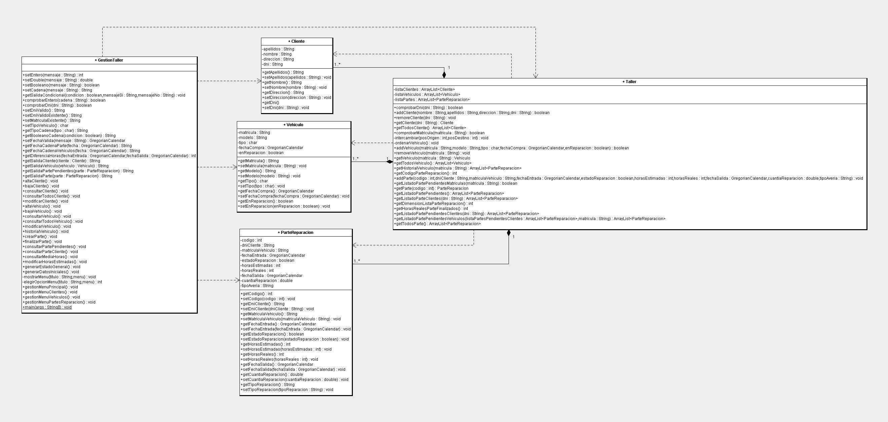

Fundamentos de Programación
=========================================
1º Ingeniería de Telecomunicación 2009/2010
--------------------------------------------


# Práctica I: Uso de estructuras de control
### Germán Martínez Maldonado


## Objetivos:

1. Conocer las estructuras repetitivas y de selección que ofrece Java. 
2. Familiarizarse con ellas mediante el desarrollo de un programa donde se hace uso intensivo de ellas. 


## Guión de la práctica 

En esta práctica se pondrán en juego los **conocimientos** de Java estudiados durante el primer cuatrimestre: conceptos básicos de orientación a objetos y uso de estructuras de control. El principal objetivo de éstas últimas es permitir que el flujo del programa no sea lineal, de tal forma que puedan ejecutarse sentencias según se den unas condiciones u otras, y repetir grupos de ellas. Para el estudio de las mismas, se resolverá un problema que pondrá en práctica el uso de varios tipos de estructuras de control. Su enunciado es el siguiente: 
     
Se pretende realizar un programa de gestión automatizada de un **taller de reparación de vehículos**. Los gestores del mismo nos hacen una serie de consideraciones que debemos de tener en cuenta a la hora de construir nuestro programa informático. En primer lugar nos indican que el lenguaje de programación a usar debe ser **Java**, debido a la posibilidad de ejecutar la aplicación final en cualquier tipo de sistema operativo y a la reconocida habilidad de los alumnos de esta Escuela en el uso de este lenguaje de programación. 

En nuestro taller tendremos que manejar las siguientes entidades: 

* **Clientes**: cada uno de los clientes que llevan vehículos para que sean reparados. 
* **Vehículos**: cada una de los diferentes vehículos que se dejan en el taller. 
* **Partes de reparación**: cada vez que un cliente llega al taller con un vehículo, se crea un parte de reparación que almacena datos básicos del vehículo y del cliente. 
* Y el propio **taller**, que gestionará todas las entidades anteriores. 

**Clientes**

La ficha que actualmente se usa en el taller para cada cliente recoge la siguiente información: 

* Apellidos 
* Nombre 
* Dirección 
* DNI 

Nos indican la necesidad de dotar al programa de las medidas de seguridad necesarias para evitar la manipulación no autorizada de los datos, por lo que debería controlarse la visibilidad de estos. 

Las operaciones que el programa debe permitir hacer con los clientes son las siguientes: 

1.  Dar de alta a un nuevo cliente, evitando que haya dos clientes con idéntico DNI. Para ello sería recomendable disponer de una operación que permitiera determinar si dos clientes son o no iguales (entendiendo por iguales que tienen el mismo DNI). 
2.  Dar de baja a un cliente proporcionando su DNI. 
3.  Mostrar los datos de un cliente en pantalla (salida estándar) a partir de su DNI. 
4.  Mostrar los datos de todos los clientes. 
5.  Modificación de uno o varios de los datos de un cliente (Apellidos, Nombre, Dirección). No permitimos modificar el DNI. 

**Vehículos**

Actualmente la información de los vehículos se mantiene en fichas que recogen para cada una de ellas la siguiente información: 

* Matrícula. 
* Modelo. 
* Tipo ('t' = turismo, 'f' = furgoneta, 'm' = motocicleta). 
* Año de compra. 
* Indicación sobre si el vehículo está actualmente siendo reparado en el taller o no. 

Al igual que en el caso de los clientes el tratamiento de los datos debe ser lo más restringido posible. 

Las operaciones que el programa debe permitir hacer con las vehículos son las siguientes: 

1.  Dar de alta un nuevo vehículo. Los vehículos quedarán ordenados por su matrícula de forma ascendente. 
2.  Dar de baja un vehículo a partir de su matrícula. 
3.  Mostrar los datos de un vehículo (salida estándar), a partir de su matrícula. 
4.  Mostrar los datos de todos los vehículos. 
5.  Modificación de uno o varios de los datos de un vehículo. No se permite modificar la indicación de si está o no en reparación, salvo en el momento de crear un nuevo parte o finalizar otro ya existente. 
6.  Mostrar el historial de reparaciones de un vehículo. 

**Partes de reparación**

Cuando un cliente deja un vehículo para reparar, se crea y añade un parte de reparación a la lista de partes pendientes del taller. El mecánico estima el número de horas que tardará en arreglar el vehículo y se lo comunica al cliente. Los partes se atienden en estricto orden de llegada. Cuando el mecánico repare el vehículo, se anotará el número de horas reales y se facturará el trabajo al cliente, teniendo en cuenta el precio de la hora de mano de obra. El parte correspondiente pasa a estar finalizado. Para poder llevar a cabo estas operaciones es preciso guardar los siguientes datos de cada parte: 

* Código del parte de reparación. 
* Cliente que lleva el vehículo. 
* Vehículo objeto de la reparación. 
* Fecha de entrada en el taller. 
* Estado del parte (pendiente o finalizado). 
* Número de horas de mano de obra estimadas (será un número aleatorio entre 1 y 100). 
* Número de horas de mano de obra reales. 
* Fecha de salida del taller (teniendo en cuenta que una jornada de trabajo son 8 horas, se calcula a partir de las horas reales de reparación). 
* Cuantía de la reparación. 
* Tipo de avería que tiene, así como las acciones realizadas para su reparación. 

Las operaciones que el programa debe permitir hacer respecto a los partes son las siguientes: 

1.  Crear un nuevo parte de reparación pendiente, proporcionando el DNI del cliente y la matrícula del vehículo. La estimación de las horas necesarias para repararlo se llevará a cabo mediante la generación de un número aleatorio entre 1 y 100. El código del parte será único y lo asignará automáticamente el programa. 
2.  Finalizar la reparación de un vehículo (el primero en ser atendido no reparado), por lo que se incluirán el número de horas reales para su reparación; se generará a partir de la fecha inicial y del número de horas reales la fecha de finalización de la reparación; se calculará la cuantía de la reparación y se pondrá el parte como finalizado. 
3.  Dar un listado de todos los partes pendientes. 
4.  Dar un listado de todos los partes de un cliente a partir de su DNI. 
5.  Calcular el número de horas medias de reparación reales para los partes ya finalizados. 
6.  Modificar,  dado el DNI y la matrícula del vehículo, el número de horas estimadas para su reparación de un vehículo en un parte. 

**Taller**

El taller constará de los siguientes datos miembro: 

* Una única lista de partes pendientes y finalizados. 
* Una lista de clientes. 
* Una lista de vehículos. 

Existirá una operación que permita mostrar por pantalla (salida estándar) un estado general del taller, o sea, un listado en que se muestren: todos los vehículos que tienen dados de alta, todos los clientes, y todos los partes de reparación. 

Además en el programa principal se implementará un menú con las siguientes opciones: 

0.  Salir del programa. 
1.  Gestión de clientes (hace que aparezca un menú de tratamiento de clientes). 
2.  Gestión de vehículos (hace que aparezca un menú de tratamiento de vehículos). 
3.  Gestión de partes de reparación (hace que aparezca un menú específico para 
préstamos) 
4.  Estado general del taller (permite probar la funcionalidad de generación del estado 
global). 

Esta especificación no debe entenderse como exhaustiva. Es decir, para cubrir la funcionalidad especificada puede ser necesario definir métodos en las  diferentes clases, aunque no se haya mencionado de forma explícita la funcionalidad correspondiente. De la misma forma, se pueden crear cuantos métodos auxiliares se consideren pertinentes. 

Se recomienda encarecidamente la existencia de la clase GestionTaller donde se dispongan los métodos relacionados con la E/S, así como la gestión del menú. 


## Datos iniciales en el taller: 

Para poder probar la funcionalidad de forma adecuada en la clase que contiene el método main se crearán los objetos necesarios para tratar los datos siguientes: 

* **Clientes**: 

1.  Josechu Letón, DNI: 23457698K. 
2.  Carmelo Cotón, DNI: 13789745F. 
3.  Encarna Vales, DNI: 20943218X. 

* **Vehículos**:

1.  Matrícula: "GR­9999­XY"; Tipo: turismo; Modelo: "Seat Anda"; Fecha compra: 1/1/1990; Estado: en reparación. 
2.  Matrícula: "1234 BCD"; Tipo: turismo; Modelo: "Ferrari Lentini"; Fecha compra: 12/11/2008; Estado: reparado. 
3.  Matrícula: "4321 DCB"; Tipo: furgoneta; Modelo: "Locar Gatodo"; Fecha compra: 4/1/ 2005; Estado: en reparación. 
4.  Matrícula: "GR­0000­A"; Tipo: motocicleta; Modelo: "Troncomóvil Cicleta++"; Fecha de compra: 2/3/1834; Estado: reparado. 

* **Partes de reparación**: 

1.  DNI: "23457698K"; Matrícula: "1234 BCD"; Fecha entrada: 10/5/2009; Estado: finalizado; Nº Horas estimadas: 10; Nº Horas reales: 8; Fecha salida: 12/5/2009; Cuantía: 250€; Tipo avería: "Embrague roto". 
2.  DNI: "23457698K"; Matrícula: "GR­0000­A"; Fecha entrada: 1/7/2009; Estado: finalizado; Nº Horas estimadas: 56; Nº Horas reales: 64; Fecha salida: 8/7/2009; Cuantía: 2500€; Tipo avería: "Chapa y pintura completo". 
3.  DNI: "13789745F"; Matrícula: "GR­9999­XY"; Fecha entrada: 22/10/2009; Estado: pendiente; Nº Horas estimadas: 15; Nº Horas reales: ­­; Fecha salida: ­­; Cuantía: ­­; Tipo avería: "Fallo general de la electricidad. Se ha cambiado la dinamo. Continuamos con las pruebas". 
4.  DNI: "20943218X"; Matrícula: "4321 DCB"; Fecha entrada: 5/1/2010; Estado: pendiente; Nº Horas estimadas: 100; Nº Horas reales: ­­; Fecha salida: ­­; Cuantía: ­­; Tipo avería: "Este coche está hecho polvo. Le fallan hasta los tapones de las válvulas de las ruedas. Yo que el dueño le pedía uno nuevo a los Reyes porque vale más el arreglo que uno nuevo". 


## 1. Clases

### 1.1 Diagrama UML



Arriba se muestra el diagrama UML de las clases, debido a su gran tamaño no se puede apreciar con gran detalle, por lo cual se ha adjuntado la imagen del mismo como un archivo externo llamado "DiagramaUML.JPG". 

### 1.2 Relaciones 

Teniendo en cuenta el diagrama actual, nos encontramos con las siguientes relaciones: 

```
/** 
  * La clase Cliente no es responsable de soportar relación alguna. 
  */ 
public class Cliente { 
  // Dato miembro apellidos 
  private String apellidos; 

  //Dato miembro nombre 
  private String nombre; 

  //Dato miembro direccion 
  private String direccion; 

  //Dato miembro dni 
  private String dni; 
.......................................................................................................................
}
```

```
/** 
  * La clase Vehiculo no es responsable de soportar relación alguna. 
  */ 
public class Vehiculo { 
  //Dato miembro matricula 
  private String matricula 

  //Dato miembro modelo 
  private String modelo; 

  //Dato miembro tipo 
  private char tipo; 

  //Dato miembro fechaCompra 
  private GregorianCalendar fechaCompra; 

  //Dato miembro enReparacion
  private boolean enReparacion; 
.......................................................................................................................
}
```

```
/** 
  * La clase ParteReparacion no es responsable de soportar relación alguna. 
  */ 
public class ParteReparacion { 
  //Dato miembro codigo 
  private int codigo; 

  //Dato miembro dniCliente 
  private String dniCliente; 

  //Dato miembro matriculaVehiculo 
  private String matriculaVehiculo; 

  //Dato miembro fechaEntrada 
  private GregorianCalendar fechaEntrada; 

  //Dato miembro estadoReparacion
  private boolean estadoReparacion; 

  //Dato miembro horasEstimadas 
  private int horasEstimadas; 

  //Dato miembro horasReales 
  private int horasReales; 

  //Dato miembro fechaSalida 
  private GregorianCalendar fechaSalida; 

  //Dato miembro cuantiaReparacion 
  private double cuantiaReparacion; 

  //Dato miembro tipoAveria 
  private String tipoAveria; 
.......................................................................................................................
}
```

```
/** 
  * La clase Taller mantiene una relación de composición con la clase Cliente, una relación de 
  * composición con la clase Vehiculo, una relación de composición con la clase 
  * ParteReparacion, una relación de dependencia con la clase Cliente, una relación de 
  * dependencia de la clase Vehiculo y una relación de dependencia con la clase 
  * ParteReparacion. Ninguna de las relaciones de dependencia da lugar a dato miembro * alguno. 
  */ 
public class Taller { 
  //Dato miembro para la relación de composición con la clase ParteReparacion (la cardinalidad 
  //* obliga a usar un ArrayList preparado para almacenar objetos de la clase ParteReparacion) 
  private ArrayList<ParteReparacion> listaParte; 

  //Dato miembro para la relación de composición con la clase Cliente (la cardinalidad * obliga a 
  //usar un ArrayList preparado para almacenar objetos de la clase Cliente) 
  private ArrayList<Cliente> listaCliente; 

  //Dato miembro para la relación de composición con la clase Vehiculo (la cardinalidad * 
  //obliga a usar un ArrayList preparado para almacenar objetos de la clase Vehiculo) 
  private ArrayList<Vehiculo> listaVehiculo; 
.......................................................................................................................
}
```

```
/** 
  * La clase GestionTaller mantiene una relación de dependencia con la clase Cliente, una 
  * relación de dependencia con la clase Vehiculo, una relación de dependencia con la clase 
  * ParteReparacion y una relación de dependencia con la clase Taller. Ninguna de las relaciones 
  * de dependencia dan lugar a dato miembro alguno. 
  */ 
public class GestionTaller { 
.......................................................................................................................
}
```

### 1.3 Explicación de las relaciones 

La clase Taller tiene relaciones de composición con las clases Cliente, Vehiculo y ParteReparacion, porque en este caso, un taller sería el todo, mientras que las otras serían una parte. 

Esto es así porque, hay que tener en cuenta que si desaparece el taller, desaparecen también los clientes, vehículos y los partes de reparación, ya que si no existe taller, los clientes no son clientes de nada, e igualmente pasa con los vehículos (no tendría sentido que hubieran vehículos para reparar por un taller que no existe) y los partes de reparación (los partes de reparación estarían vinculados a las reparaciones realizadas en un taller que no existe). 

Por lo antes explicado, es necesario crear en la clase Taller unos datos miembros  adicionales para que se cumplan las relaciones. Como la cardinalidad de la relación indica que  un mismo taller va a almacenar más de un cliente, más de un vehículo y más de un parte de reparación, se creará una lista ArrayList preparada para almacenar cada tipo de objeto, una para Cliente, otra para Vehiculo y otra para parte de reparación. 

Esta misma clase, tiene relaciones de dependencia con las clases Cliente, Vehiculo y  ParteReparacion, porque contiene métodos que usan métodos contenidos en las clases mencionadas. 

Por ejemplo: para comprobar si ya existe un cliente con el mismo el D.N.I. en la lista de los clientes, se van comparando el valor del D.N.I. que recibe el método con los D.N.I. de todos  los clientes existentes en la lista, y para obtener el D.N.I. de los clientes de la lista, se hace una  llamada al método getDni() que se encuentra en la clase Cliente. Igualmente pasa cuando se quiere comprobar si ya existe un vehículo con la misma matrícula (método getMatricula() de la clase Vehiculo) o para comprobar si un parte de reparación está finalizado o no (método getEstadoReparacion() de la clase ParteReparacion). 

La clase GestionTaller tiene relaciones de dependencia con las clases Cliente, Vehiculo, ParteReparacion y Taller, porque igual que la clase Taller, contiene métodos que usan métodos contenidos en dichas clases. 

Por ejemplo: para modificar los datos de un cliente, como puede ser su nombre, se hace  una llamada al método setNombre() de la clase Cliente, este se encargará de almacenar en el dato miembro "nombre" del objeto Cliente, correspondiente al nombre del cliente, el valor pasado como parámetro. Exactamente de la misma forma con un vehículo (modificar el modelo de un vehículo con el método setModelo() de la clase Vehiculo) o un parte de reparación (modificar el valor que indica si el parte de reparación está finalizado o no, esto se realizará con el método setEstadoReparacion() de la clase ParteReparacion). 

También mantiene la misma relación con la clase Taller cuando, por ejemplo, se añade un nuevo cliente a la lista de clientes, haciendo una llamada al método addCliente() de la clase Taller. 

Las clases Cliente, Vehiculo y ParteReparacion no son responsable de soportar ninguna relación, porque como ya se ha explicado antes, simplemente son partes de la clase Taller, siendo está la encargada de soportar las relaciones creando los datos miembros pertinentes. 


## 2. Métodos de la clase Taller 

A continuación se van a ir explicando uno por uno, todos los métodos que existen en la clase Taller. 

### 2.1 Constructor de la clase Taller 

```
public Taller() { 
  listaParte=new ArrayList<ParteReparacion>(); 
  listaCliente=new ArrayList<Cliente>(); 
  listaVehiculo=new ArrayList<Vehiculo>(); 
}
```

El constructor de la clase, este método se encargará de hacer la reserva de memoria para los ArrayList datos miembros de la clase. 

### 2.2 Métodos de Cliente 

#### 2.2.1 comprobarDni() 

```
public boolean comprobarDni(String dni) { 
  int i; 

  for (i=0; i<listaCliente.size(); i++) { 
    if (dni.equals(listaCliente.get(i).getDni())) 
      break; 
  }

  if (i<listaCliente.size()) 
    return true; 
  else 
    return false; 
}
```

Este método recibe como parámetro una cadena de texto correspondiente a un D.N.I. de un cliente, para comprobar si ya existe un cliente en la lista de clientes con ese mismo D.N.I.. Será utilizado luego por diversos métodos para realizar acciones como, por ejemplo, comprobar que el D.N.I. de un cliente a borrar existe en la lista de clientes. 

**Funcionamiento**:

1.   Declaramos una variable entera que vaya almacenando el valor de la iteración del bucle que se va a iniciar. 
2.   Iniciamos un bucle que vaya recorriendo uno por uno todos los clientes de la lista. 
3.   En caso de que se encuentre un cliente con el mismo D.N.I. al pasado como argumento, se fuerza la salida del bucle. Esta comprobación se irá realizando con el método equals(), que es un método de la clase String, el método será llamado por el String que contiene el D.N.I. a comprobar y al que se le pasará como parámetro, el String del D.N.I. del cliente cuya posición en la lista de vehículos sea el valor actual de la iteración, si los String tienen el mismo valor, se devolverá "true", sino, se devolverá "false". Todas las 
comprobaciones realizadas con equals durante los demás métodos, se realizarán de la misma manera. 
4.   Si el valor de la última iteración del bucle, es menor al tamaño de la lista de clientes, esto significará que se encontró un cliente con el mismo D.N.I. al pasado como parámetro, lo que ocasionó que se forzará la salida del bucle antes de su finalización. 
5.   Si ya existía un cliente con ese mismo D.N.I., el método devolverá un valor booleano "true", sino, devolverá uno con el valor "false". 

#### 2.2.2 addCliente() 

```
public boolean addCliente(String nombre, String apellidos, String direccion, String dni) { 
  int i; 

  for (i=0; i<listaCliente.size(); i++) { 
    if (dni.equals(listaCliente.get(i).getDni())) 
      break; 
  }

  if (i<listaCliente.size()) 
    return false; 
  else 
  {
    listaCliente.add(new Cliente(apellidos,nombre,direccion,dni)); 
    return true; 
  }
}
```

Este método recibe como parámetros los datos de un cliente para darle de alta, debiendo asegurarse de que no exista ya otro cliente en la lista de clientes con el mismo D.N.I. antes de crearlo. 

**Funcionamiento**:

1.  Declaramos una variable entera que vaya almacenando el valor de la iteración del bucle que se va a iniciar. 
2.  Iniciamos un bucle que vaya recorriendo uno por uno todos los clientes de la lista. 
3.  En caso de que se encuentre un cliente con el mismo D.N.I. al pasado como uno de los argumento, se fuerza la salida del bucle. Esta comprobación se irá realizando con el método equals(). 
4.  Si el valor de la última iteración del bucle, es menor al tamaño de la lista de clientes, esto significará que se encontró un cliente con el mismo D.N.I. al pasado como parámetro, lo que ocasionó que se forzará la salida del bucle antes de su finalización. 
5.  Si ya existía un cliente con ese mismo D.N.I., el método devolverá un valor booleano "false", sino, se añadirá a la lista de clientes el cliente con los datos pasados como parámetros al método y este devolverá un valor booleano "true". 

#### 2.2.3 removeCliente() 

```
public void removeCliente(String dni) { 
  int i; 

  for (i=0; i<listaCliente.size(); i++) { 
    if (dni.equals(listaCliente.get(i).getDni())) 
      break; 
  }

  listaCliente.remove(i); 
}
```

Este método recibe el D.N.I. de un cliente para borrarlo de la lista de clientes. Como en el método que realiza la llamada de este método, ya se comprueba que el D.N.I. introducido exista en la lista de clientes, al recibir siempre un D.N.I. existente, sólo habrá que buscarlo en la lista de clientes para borrarlo. 

**Funcionamiento**:
 
1.  Declaramos una variable entera que vaya almacenando el valor de la iteración del bucle que se va a iniciar. 
2.  Iniciamos un bucle que vaya recorriendo uno por uno todos los clientes de la lista. 3.  Cuando se encuentre un cliente con el mismo D.N.I.al pasado como argumento, se fuerza la salida del bucle. Esta comprobación se irá realizando con el método equals(). 
4.  Finalmente, se borra de la lista de clientes el cliente cuya posición sea el último valor de la iteración, ya que es donde se ha detenido el bucle por encontrar el cliente con ese D.N.I. 

#### 2.2.4 getCliente() 

```
public Cliente getCliente(String dni) { 
  int i; 

  for (i=0; i<listaCliente.size(); i++) { 
    if (dni.equals(listaCliente.get(i).getDni()))
      break; 
  }

  return listaCliente.get(i); 
}
```

Este método recibe el D.N.I. de un cliente para obtener el resto de sus datos. Al igual que pasaba con el método de eliminar clientes, en el método que realiza la llamada de este método, ya se comprueba que el D.N.I. introducido exista en la lista de clientes, por lo que al recibir siempre un D.N.I. existente, sólo habrá que buscarlo en la lista de clientes para encontrar el que tenga el D.N.I. coincidente. 

**Funcionamiento**:
 
1.  Declaramos una variable entera que vaya almacenando el valor de la iteración del bucle que se va a iniciar. 
2.  Iniciamos un bucle que vaya recorriendo uno por uno todos los clientes de la lista. 
3.  Cuando se encuentre un cliente con el mismo D.N.I. al pasado como argumento, se fuerza la salida del bucle. Esta comprobación se irá realizando con el método equals(). 
4.  Finalmente, se devuelve el cliente cuya posición sea el último valor de la iteración, ya que es donde se ha detenido el bucle por encontrar el cliente con ese D.N.I. 

#### 2.2.5 getTodosCliente() 

```
public ArrayList<Cliente> getTodosCliente() { 
  return this.listaCliente; 
}
```

Este método simplemente devolverá la lista de todos los clientes del taller. 

**Funcionamiento**:
 
1.  La única operación que realizará el método, será devolver la lista de clientes del taller actual. 

### 2.3 Métodos de vehículos 

#### 2.3.1 comprobarMatricula() 

```
public boolean comprobarMatricula(String matricula) { 
  int i; 

  for (i=0; i<listaVehiculo.size(); i++) { 
    if (matricula.equals(listaVehiculo.get(i).getMatricula())) 
      break; 
  }

  if (i<listaVehiculo.size()) 
    return true; 
  else 
    return false; 
}
```

Este método recibe como parámetro una cadena de texto correspondiente a una matrícula de un vehículo, para comprobar si ya existe un vehículo en la lista de vehículos con esa misma matrícula. Será utilizado luego por diversos métodos para realizar acciones como puede ser, comprobar que existe un vehículo con una matrícula cuando se introduzca esta misma para consultar sus datos. 

**Funcionamiento**:
 
1.  Declaramos una variable entera que vaya almacenando el valor de la iteración del bucle que se va a iniciar. 
2.  Iniciamos un bucle que vaya recorriendo uno por uno todos los vehículos de la lista. 
3.  En caso de que se encuentre un vehículo con la misma matrícula a la pasada como argumento, se fuerza la salida del bucle. Esta comprobación se irá realizando con el método equals(). 
4.  Si el valor de la última iteración del bucle, es menor al tamaño de la lista de vehículos, esto significará que se encontró un vehículo con la misma matrícula a la pasada como parámetro, lo que ocasionó que se forzará la salida del bucle antes de su finalización. 
5.  Si ya existía un cliente con esa misma matrícula, el método devolverá un valor booleano "true", sino, devolverá uno con el valor "false". 

#### 2.3.2 intercambiar() 

```
private void intercambiar(int posOrigen, int posDestino) { 
  Vehiculo temp=new Vehiculo(listaVehiculo.get(posOrigen));
  listaVehiculo.set(posOrigen, listaVehiculo.get(posDestino)); 
  listaVehiculo.set(posDestino, temp); 
}
```

Este método será el encargado de intercambiar las posiciones de dos vehículos en la lista de vehículos cuando se este realizando la ordenación de la misma. Como sólo será llamado por el método ordenarVehiculo() de esta misma clase, este método tendrá visibilidad privada. 

**Funcionamiento**:
 
1.  El método recibe dos enteros, estos corresponden a las posiciones de los vehículos a intercambiar entre sí en la lista de vehículos. 
2.  Se crea un vehículo nuevo que almacenará temporalmente los datos del vehículo de la posición primera a intercambiar. Como además del constructor que usaremos para dar de alta un vehículo pasando todos sus valores, creamos un constructor de copia en la clase Vehículo, aquí será donde lo utilizaremos, ya que eso nos simplificará el almacenar temporalmente los valores de uno de los vehículos a intercambiar en el vehículo auxiliar, esto para no perderlos durante el proceso de intercambio. 
3.  En el vehículo de la primera posición, guardaremos los datos del vehículo de la segunda posición. 
4.  Finalmente, en el vehículo de la segunda posición, guardaremos los datos del vehículo temporal que creamos antes con los datos del vehículo de la primera posición. 

#### 2.3.3 ordenarVehiculo() 

```
private void ordenarVehiculo() { 
  int inicioDesorden=0; 

  while (inicioDesorden<listaVehiculo.size()) { 
    for (int j=(listaVehiculo.size()-1); j>inicioDesorden; j--) { 
      if (listaVehiculo.get(j-1).getMatricula().compareTo(listaVehiculo.get(j).getMatricula())>0) { 
        intercambiar(j-1,j); 
      }
    }

    inicioDesorden++; 
  }
}
```

Este método será el encargado de ir comprobando que los vehículos de la lista de vehículos estén ordenados por su matrícula, intercambiándolos de posición en caso contrario. Como sólo será llamado por el método addVehiculo() de esta misma clase, este método tendrá visibilidad privada. 

**Funcionamiento**:
 
1.  Para ordenar una lista de objetos, tenemos que pensar que aunque físicamente la lista a ordenar sólo es una, de forma lógica podemos dividirla en dos, la parte ordenada y la parte desordenada. 
2.  Teniendo en cuenta lo anterior, declaramos una variable entera que representará la posición de inicio de la parte de la lista que está desordenada, como inicialmente no conocemos cual será la primera posición desordenada, empezaremos por el principio de la lista, por ello, le daremos a la variable el valor inicial de 0. 
3.  Iniciaremos un bucle que se estará ejecutando mientras que el inicio de la parte desordenada sea menor que el tamaño total de la lista, porque esto indicará que todavía quedarán posiciones por comprobar si están ordenadas o no. 
4.  Dentro del bucle anterior, iniciamos otro bucle que, partiendo desde la posición final de la lista, mientras que la posición actual sea mayor que la posición del inicio de la parte desordenada, el bucle irá recorriendo cada uno de las posiciones de la lista hacia atrás. 
5.  En cada una de las iteraciones del último bucle iniciado, se va comprobando que lexicográficamente, la matrícula del vehículo correspondiente a la posición de la iteración anterior de la lista, no sea mayor que la matrícula del vehículo correspondiente a la posición de la iteración actual de la lista, porque en caso contrario, significaría que no están ordenados alfabéticamente. Esta comprobación lexicográfica, se realiza con el método compareTo() de la clase String. El String de la matrícula del vehículo anterior llamará a este método, pasándole como parámetro el String de la matrícula del vehículo actual; si el resultado devuelto es 0, significa que lexicográficamente los dos String tienen el mismo valor; si devuelve un valor menor que 0, lexicográficamente, la matrícula anterior es menor que la matrícula actual; y, si devuelve un valor mayor que 0, lexicográficamente, la matricula anterior es mayor que la matrícula actual. 
6.  Si se produce el último caso de los antes descritos, significará que los vehículos no están correctamente ordenados pos sus matrículas, por lo tanto, llamamos al método intercambiar() explicado en el punto anterior, pasándole como argumentos el valor anterior a la iteración como posición primera y el valor actual de la iteración como posición segunda, para así intercambiarlas. 
7.  Una vez, que finaliza el segundo bucle, aumentamos en una posición el inicio de la parte desordenada de la lista, y, si el inicio de la parte desordenada es todavía menor al tamaño total de la lista, volvemos a iniciar un bucle que acabamos de finalizar, para seguir comprobando si los vehículos están ordenados por sus matrículas. 

#### 2.3.4 addVehiculo() 

```
public boolean addVehiculo(String matricula, String modelo, char tipo, GregorianCalendar fechaCompra, boolean enReparacion) { 
  int i; 

  for (i=0; i<listaVehiculo.size(); i++) { 
    if (matricula.equals(listaVehiculo.get(i).getMatricula())) 
      break; 
  }

  if (i<listaVehiculo.size()) 
    return false; 
  else { 
    listaVehiculo.add(new Vehiculo(matricula, modelo, tipo, fechaCompra, enReparacion)); 
    ordenarVehiculo(); 
    return true; 
  }
}
```

Este método recibe como parámetros los datos de un vehículo para darlo de alta, 
debiendo asegurarse de que no exista ya otro vehículo en la lista de vehículos con la misma matrícula antes de crearlo. 

**Funcionamiento**:
 
1.  Declaramos una variable entera que vaya almacenando el valor de la iteración del bucle que se va a iniciar. 
2.  Iniciamos un bucle que vaya recorriendo uno por uno todos los vehículos de la lista. 
3.  En caso de que se encuentre un vehículo con la misma matrícula a la pasada como uno de los argumento, se fuerza la salida del bucle. Esta comprobación se irá realizando con el método equals(). 
4.  Si el valor de la última iteración del bucle, es menor al tamaño de la lista de vehículos, esto significará que se encontró un vehículo con la misma matrícula a la pasada como parámetro, lo que ocasionó que se forzará la salida del bucle antes de su finalización. 
5.  Si ya existía un vehículo con esa misma matrícula, el método devolverá un valor booleano "false", sino, se añadirá a la lista de vehículos el vehículo con los datos pasados como parámetros al método y este devolverá un valor booleano "true". 

#### 2.3.5 removeVehiculo() 

```
public void removeVehiculo(String matricula) { 
  int i; 

  for (i=0; i<listaVehiculo.size(); i++) { 
    if (matricula.equals(listaVehiculo.get(i).getMatricula())) 
      break; 
  }

  listaVehiculo.remove(i); 
}
```

Este método recibe la matrícula de un vehículo para borrarlo de la lista de vehículos. Como en el método que realiza la llamada de este método, ya se comprueba que la matrícula introducida exista en la lista de vehículos, al recibir siempre una matrícula existente, sólo habrá que buscarla en la lista de vehículos para borrarlo. 

**Funcionamiento**:
 
1.  Declaramos una variable entera que vaya almacenando el valor de la iteración del bucle 
que se va a iniciar. 
2.  Iniciamos un bucle que vaya recorriendo uno por uno todos los clientes de vehículos. 
3.  Cuando se encuentre un vehículo con la misma matrícula a la pasada como argumento, se 
fuerza la salida del bucle. Esta comprobación se irá realizando con el método equals(). 
4.  Finalmente, se borra de la lista de vehículos el vehículo cuya posición sea el último valor 
de la iteración, ya que es donde se ha detenido el bucle por encontrar el vehículo con esa matrícula. 

#### 2.3.6 getVehiculo() 

```
public Vehiculo getVehiculo(String matricula) { 
  int i; 

  for (i=0; i<listaVehiculo.size(); i++) { 
    if (matricula.equals(listaVehiculo.get(i).getMatricula())) 
      break; 
  }

  return listaVehiculo.get(i); 
}
```

Este método recibe la matrícula de un vehículo para obtener el resto de sus datos. Al igual que pasaba con otros métodos de clientes y vehículos, en el método que realiza la llamada de este método, ya se comprueba que la matrícula introducida exista en la lista de vehículos, por lo que al recibir siempre una matrícula existente, sólo habrá que buscarla en la lista de vehículos para encontrar el que tenga la matrícula coincidente. 

**Funcionamiento**:
 
1.  Declaramos una variable entera que vaya almacenando el valor de la iteración del bucle que se va a iniciar. 
6.  Iniciamos un bucle que vaya recorriendo uno por uno todos los vehículos de la lista. 
7.  Cuando se encuentre un vehículo con la misma matrícula a la pasada como argumento, se fuerza la salida del bucle. Esta comprobación se irá realizando con el método equals(). 
8.  Finalmente, se devuelve el vehículo cuya posición sea el último valor de la iteración, ya que es donde se ha detenido el bucle por encontrar el vehículo con esa matrícula. 

#### 2.3.7 getTodosVehiculo() 

```
public ArrayList<Vehiculo> getTodosVehiculo() { 
  return this.listaVehiculo; 
}
```

Este método simplemente devolverá la lista de todos los vehículos del taller. 

**Funcionamiento**:
 
1.  La única operación que realizará el método, será devolver la lista de vehículos del taller actual. 

#### 2.3.8 getHistorialVehiculo() 

```
public ArrayList<ParteReparacion> getHistorialVehiculo(String matricula) { 
  ArrayList<ParteReparacion> listaParteVehiculo = new ArrayList<ParteReparacion>(); 

  for (int i=0; i<listaParte.size(); i++) { 
    if (matricula.equals(listaParte.get(i).getMatriculaVehiculo())) 
      listaParteVehiculo.add(listaParte.get(i)); 
  }

  return listaParteVehiculo; 
}
```

Este método devolverá una lista con los datos de todos los partes de reparación referentes a todas las reparaciones realizadas a un mismo vehículo. 

**Funcionamiento**:
 
1.  Declaramos una lista ArrayList en la que almacenaremos los partes de reparación de un mismo vehículo. 
2.  Iniciamos un bucle que vaya recorriendo uno por uno todos los partes de reparación de la lista de partes de reparación. 
3.  Cuando se encuentre un parte de reparación con la misma matrícula a la pasada como argumento, este parte de reparación será añadido a la lista declarada en el primer paso. La comprobación de las matrículas se irá realizando con el método equals(). 
4.  Finalmente se devuelve la lista en la que habremos ido almacenando los partes de reparación correspondientes a un mismo vehículo. 

### 2.4 Métodos de parte de reparación 

#### 2.4.1 getCodigoParteReparacion() 

```
public int getCodigoParteReparacion() { 
  int codigo=listaParte.size()+1; 
  
  return codigo; 
}
```

Este método nos permite obtener automáticamente el código de identificación del próximo parte de reparación que fuésemos a crear. 

**Funcionamiento**:
 
1.  Declaramos una variable entera a la que asignamos un valor mayor en 1 que el del tamaño de la lista de partes de reparación, esto lo hacemos así, porque la primera posición de la lista será un 0, mientras que el código del primer parte de reparación será un 1.  
2.  Devolvemos la variable declarada con el valor del código. 

#### 2.4.2 addParte() 

```
public void addParte (int codigo, String dniCliente, String matriculaVehiculo, GregorianCalendar fechaEntrada, boolean estadoReparacion, int horasEstimadas, int horasReales, GregorianCalendar fechaSalida, double cuantiaReparacion, String tipoAveria) { 
  listaParte.add(new ParteReparacion(codigo, dniCliente, matriculaVehiculo, fechaEntrada, estadoReparacion, horasEstimadas, horasReales, fechaSalida, cuantiaReparacion, tipoAveria)); 
}
```

Este método creará un nuevo parte de reparación con los valores que recibe como parámetros. Como el código del parte de reparación es asignado automáticamente, nunca habrá dos partes con el mismo código, por lo cual, no es necesario tomar medidas para evitar que haya dos partes con el mismo código. 

**Funcionamiento**: 

1.  Simplemente, se añade a la lista de partes de reparación, un nuevo parte creado con los valores recibidos como parámetros por el método. 

#### 2.4.3 getListadoPartePendientesMatriculas() 

```
public boolean getListadoPartePendientesMatriculas(String matricula) { 
  ArrayList<ParteReparacion> listaPartePendientesMatriculas = new 
  ArrayList<ParteReparacion>(); 

  for (int i=0; i<listaParte.size(); i++) { 
    if (matricula.equals(listaParte.get(i).getMatriculaVehiculo()) && listaParte.get(i).getEstadoReparacion()==false) 
      listaPartePendientesMatriculas.add(listaParte.get(i)); 
  }

  if (listaPartePendientesMatriculas.size()==0) 
    return true; 
  else 
    return false; 
}
```

Este método devolverá si hay parte de reparación pendientes de un vehículo. La utilidad que tiene este método es la de que cuando vayamos a crear un parte de reparación comprobar que ese vehículo no esté ya siendo reparado en el taller, porque a un vehículo se le pueden hacer varias reparaciones en una misma visita al taller, pero siempre quedarán reflejadas en un mismo parte de reparación, por lo cual, no tendría sentido que hubiera dos parte de reparación pendientes sobre un mismo vehículos. 

**Funcionamiento**:
 
1.  Declaramos una lista ArrayList en la que almacenaremos los partes de reparación pendientes de un mismo vehículo. 
2.  Iniciamos un bucle que vaya recorriendo uno por uno todos los partes de reparación de la lista de partes de reparación. 
3.  Cuando se encuentre un parte de reparación con la misma matrícula a la pasada como argumento y que además tenga su estado reparación como pendiente (su valor sea false), este parte de reparación será añadido a la lista declarada en el primer paso. La comprobación de las matrículas se irá realizando con el método equals(). 
4.  Si el tamaño de la lista declarada en este método es igual a 0, se devolverá un valor "true" indicando que no existen partes pendientes de reparación de ese vehículo y por lo cual, puede crearse un nuevo parte de reparación de ese vehículo; si la lista tuvieses algún elemento, significará que el vehículo ya está siendo reparado, y por lo tanto no se le puede crear otro parte de reparación. 

#### 2.4.4 getParte() 

```
public ParteReparacion getParte (int codigo) { 
    return this.listaParte.get(codigo-1); 
}
```

Este método devuelve un parte de reparación en función al código de identificación de un parte de reparación pasado como argumento. 

**Funcionamiento**:
 
1.  Este método simplemente devolverá el parte de reparación de la lista de partes de reparación taller actual cuya posición sea igual al código recibido como parámetro menos 1, esto último se debe a que un parte de reparación siempre tendrá un código una cantidad mayor en 1 de su posición en la lista de partes de reparación. 

#### 2.4.5 getListadoParteReparacion() 

```
public ArrayList<ParteReparacion> getListadoPartePendientes() { 
  ArrayList<ParteReparacion> listaPartePendientes =new ArrayList<ParteReparacion>(); 

  for (int i=0; i<listaParte.size(); i++) { 
    if (listaParte.get(i).getEstadoReparacion()==false) 
      listaPartePendientes.add(listaParte.get(i)); 
  }

  return listaPartePendientes; 
}
```

Este método devolverá un listado de partes pendientes de reparación. 

**Funcionamiento**:
 
1.  Declaramos una lista ArrayList en la que almacenaremos todos los partes de reparación pendientes. 
2.  Iniciamos un bucle que vaya recorriendo uno por uno todos los partes de reparación de la lista de partes de reparación. 
3.  Cuando se encuentre un parte de reparación que tenga su estado de reparación como pendiente (su valor sea false), este parte de reparación será añadido a la lista declarada en el primer paso. 
4.  Como paso final, se devuelve la lista generada con todos los partes de reparación pendientes. 

#### 2.4.6 getListadoParteCliente() 

```
public ArrayList<ParteReparacion> getListadoParteCliente(String dni) { 
  ArrayList<ParteReparacion> listaParteCliente =new ArrayList<ParteReparacion>(); 

  for (int i=0; i<listaParte.size(); i++) { 
    if (dni.equals(listaParte.get(i).getDniCliente())) 
      listaParteCliente.add(listaParte.get(i)); 
  }

  return listaParteCliente; 
}
```

Este método devolverá una lista con todos los partes de reparación de un mismo cliente. 

**Funcionamiento**:
 
1.  Declaramos una lista ArrayList en la que almacenaremos los partes de reparación de un mismo cliente. 
2.  Iniciamos un bucle que vaya recorriendo uno por uno todos los partes de reparación de la lista de partes de reparación. 
3.  Cuando se encuentre un parte de reparación con el mismo D.N.I. al pasado como argumento, este parte de reparación será añadido a la lista declarada en el primer paso. La comprobación de D.N.I. se irá realizando con el método equals(). 
4.  Por último, se devuelve la lista generada con todos los partes de reparación de un mismo cliente. 

#### 2.4.7 getDimensionListaParteReparacion() 

```
public int getDimensionListaParteReparacion() { 
  int dimension=listaParte.size(); 
  
  return dimension; 
}
```

Este método devolverá el tamaño que tiene la lista de partes de reparación. Como todas las listas de la clase Taller tiene visibilidad privada, para obtener el tamaño de la lista de partes de reparación, utilizaremos este método. 

**Funcionamiento**:
 
1.  Declaramos una variable entera en la que almacenamos el tamaño de la lista de partes de reparación. 
2.  Se devuelve la variable con el tamaño de la lista de los partes de reparación. 

#### 2.4.8 getHorasRealesParteFinalizados() 

```
public int getHorasRealesParteFinalizados() { 
  int suma=0; 

  for (int i=0; i<listaParte.size(); i++) { 
    if (listaParte.get(i).getEstadoReparacion()==true) { 
      suma=suma+listaParte.get(i).getHorasReales(); 
    }
  }

  return suma; 
}
```

Este método devuelve la suma de las horas reales empleadas en la reparación de todas las reparaciones finalizadas. 

**Funcionamiento**:
 
1.  Declaramos una variable entera con el valor 0. 
2.  Iniciamos un bucle que vaya recorriendo uno por uno todos los partes de reparación de la lista de partes de reparación. 
3.  Cuando se encuentre algún parte de reparación con el estado de reparación finalizado (booleano con valor true), se suma el valor de sus horas reales a la variable declarada en el paso 1.  
4.  Se devuelve la variable con el total de horas reales de partes finalizados. 

#### 2.4.9 getListadoPartePendientesCliente() 

```
public ArrayList<ParteReparacion> getListadoPartePendientesCliente(String dni) { 
  ArrayList<ParteReparacion> listaPartePendientesCliente = new ArrayList<ParteReparacion>(); 

  for (int i=0; i<listaParte.size(); i++) { 
    if (dni.equals(listaParte.get(i).getDniCliente()) && listaParte.get(i).getEstadoReparacion()==false)
      listaPartePendientesCliente.add(listaParte.get(i)); 
  }

  return listaPartePendientesCliente; 
}
```

Este método devuelve una lista de partes de reparación con todos los partes de reparación pendientes de un mismo cliente. 

**Funcionamiento**:
 
1.  Declaramos una lista ArrayList en la que almacenaremos los partes de reparación pendientes de un mismo cliente. 
2.  Iniciamos un bucle que vaya recorriendo uno por uno todos los partes de reparación de la lista de partes de reparación. 
3.  Si encontramos algún parte de reparación cuyo D.N.I. se igual al D.N.I. pasado como parámetro y su estado de reparación sea pendiente (valor booleano falso), se añadirá ese parte de reparación a la lista declarada en el paso 1.  La comprobación de D.N.I. se irá realizando con el método equals(). 
4.  Se devuelve la lista con todos los partes de reparación pendientes de un mismo cliente encontrados. 

#### 2.4.10 getListadoPartePendientesVehiculo 

```
public ArrayList<ParteReparacion> getListadoPartePendientesVehiculo (ArrayList<ParteReparacion> listaPartePendientesCliente, String matricula) { 
  ArrayList<ParteReparacion> listaPartePendientesVehiculo = new ArrayList<ParteReparacion>(); 

  for (int i=0; i<listaPartePendientesCliente.size(); i++) { 
    if (matricula.equals(listaPartePendientesCliente.get(i).getMatriculaVehiculo())) 
      listaPartePendientesVehiculo.add(listaPartePendientesCliente.get(i)); 
  }

  return listaPartePendientesVehiculo; 
}
```

Este método devuelve una lista de partes de reparación pendientes de un mismo cliente para un mismo vehículo. 

**Funcionamiento**:
 
1.  Declaramos una lista ArrayList en la que almacenaremos los partes de reparación pendientes de un mismo cliente para un mismo vehículo. 
2.  Iniciamos un bucle que vaya recorriendo uno por uno todos los partes de reparación de una lista generada a través del método explicado anterior a este, el método que genera una lista de partes de reparación pendientes de un mismo cliente. 
3.  Si encontramos algún parte de reparación cuya matrícula se igual a la matrícula pasada como, se añadirá ese parte de reparación a la lista declarada en el paso 1.  La comprobación de la matrícula se irá realizando con el método equals(). 
4.  Se devuelve una lista con todos los partes de reparación pendientes de un mismo cliente para un mismo vehículo encontrados. 

#### 2.4.11 getTodosParte() 

```
public ArrayList<ParteReparacion> getTodosParte() { 
  return this.listaParte; 
}
```

Este método simplemente devolverá la lista de todos los partes de reparación del taller. 

**Funcionamiento**:
 
1.  La única operación que realizará el método, será devolver la lista de partes de reparación del taller actual. 


## 3. Bibliografía 

Toda la información necesaria para la realización de la práctica, como ha sido la documentación sobre los diferentes métodos y parámetros de las clases de Java utilizadas, ha sido obtenida de la página Web oficial Sun Microsystems sobre el soporte de Java, más concretamente la sección donde se encuentran detalladas cada una de las clases: 

[http://java.sun.com/j2se/1.4.2/docs/api/allclasses-noframe.html](http://java.sun.com/j2se/1.4.2/docs/api/allclasses-noframe.html)
