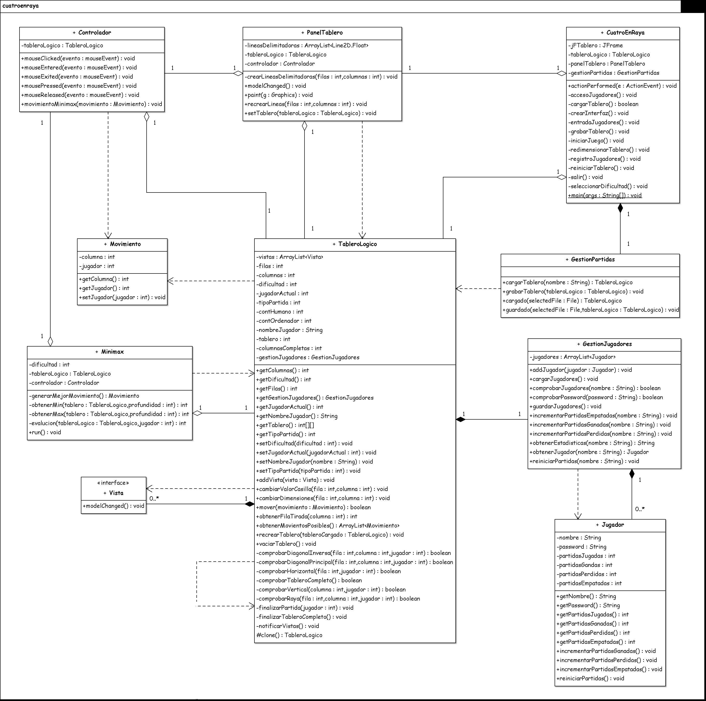

Fundamentos de Programación
=========================================
1º Ingeniería de Telecomunicación 2009/2010
--------------------------------------------


# Práctica II: Cuatro en raya
### Germán Martínez Maldonado


## Objetivos:

1. Poner en práctica todos los conceptos estudiados a lo largo del curso.
2. Afrontar correctamente el desarrollo de una aplicación con cierta entidad.
3. Alcanzar un alto grado de coordinación para el trabajo en equipo.


## Especificación de la práctica

Partiendo de un tablero de n filas y m columnas, situado verticalmente a la mesa de juego, el cuatro en raya o conecta 4 consiste en ir introduciendo fichas alternativamente cada uno de los dos jugadores que participan,  con el objetivo de situar cuatro de éstas en línea, dispuestas, ya sea vertical, horizontalmente o en diagonal (http://en.wikipedia.org/wiki/Connect_Four).

Diseñar e implentar un programa para jugar a este juego de mesa con los siguientes requerimientos:

* Permite jugar a un humano contra el ordenador por medio de un interfaz gráfico, el cual representará un tablero para este juego, y posibilitará una forma cómoda y sencilla al humano de efectuar sus movimientos.
* El usuario decide el tamaño del tablero justo antes de comenzar a jugar.
* Posibilita al usuario la elección del nivel del juego (habrá tres niveles del juego: iniciado, medio y avanzado).
* Permite guardar en cualquier momento el estado del tablero y el nivel de competición elegido y retomarlos en cualquier otro.
* El usuario podrá registrarse y al entrar obtendrá una estadística de partidas jugadas, con indicación de las victorias y derrotas. También se podrán poner a cero estos indicadores.

## Cuestiones técnicas sobre la implementación

*a) Generación de movimientos por parte del ordenador: el método MINIMAX.*

En este juego, los dos jugadores, el humano y el ordenador, van realizando movimentos de forma alternativa hasta que uno de ellos gane (y el otro pierda), o hasta que se llegue a una situación de  empate. Cada jugador tiene conocimiento perfecto del entorno (la situación actual de la partida) y de sus posibles movimientos.

En cuanto al jugador ordenador, éste deberá manejar una representación del tablero de juego que sea sencilla de manejar. La idea general a la hora de que el ordenador elija movimiento a partir de uno ya realizado por parte del humano es crear un árbol con todas las posibles jugadas que se pueden hacer. A partir de cada una de ellas, generar todos los posibles movimientos del contrario y así sucesivamente. El ordenador elegirá la jugada que, una vez explorado el árbol del juego, le oferte mayor ganancia.

A partir de ahora llamaremos a los jugadores MAX y MIN, y el objetivo será encontrar el mejor movimento para MAX. Dado un tablero concreto, consideremos que MAX mueve a patir de él.  La base del método MINMAX radica en la exploración total del árbol del juego hasta llegar a las hojas, es decir, las situaciones del tablero donde bien hay una victoria de un jugador o un empate. Una vez expandido todo el árbol, MAX tiene que decidir qué jugada es la mejor. Para tal fin, disponemos una "función de evaluación", que recibe como argumento un tablero que se corresponde con un nodo hoja (un tablero en el que ya no se puede hacer ningún movimiento) y devuelve un valor, que indica la "calidad" de ese tablero para los objetivos de MAX. Así, si el tablero es favorable a MAX, ésta devolverá valores positivos, mientras que si lo es para MIN, devolverá valores negativos. Valores cercanos a cero indicarán que no es favorable a ninguno.

Una vez que los nodos hoja han sido evaluados, el método MINMAX deberá elegir la mejor evaluación de los nodos hoja y propagarlo hacia el nodo raíz (el tablero inicial). Así, el valor que se le asigna a un nodo MAX padre de nodos hojas MIN será el máximo de los valores de los nodos MIN. Análogamente, el valor que recibirá un nodo MIN a partir de sus hijos MAX, será el mínimo de sus hijos. Una vez realizado el proceso para los nodos padre de los nodos hojas se continuará hacia cada uno de los sucesores del nodo inicial. MAX, por tanto, elegirá la jugada con un valor mayor de la función de evaluación.

Para algunos juegos, como el ajedrez, el hecho de generar el árbol completo es inviable, ya que tendría 1040 nodos, lo que implicaría que se necesitaran 1022 siglos para su finalización. Así, lo normal en estos caso es generar el árbol sólo a cierta profundidad (por ejemplo, 5 niveles del árbol). Las hojas en este caso no corresponden a jugadas finalizadas, pero igualmente podemos evaluar la función de evaluación en ellas y propagar hacia arriba de igual manera.

Una mejora de este método es el procedimiento alfa­beta, que evita visitar ramas del árbol que no aportan nada.

La función de evaluación deberá ser diseñada por el alumno.

Véase, por ejemplo, para más información las siguientes direcciones:

http://www.geekyblogger.com/2007/03/artificial­intelligence­in.html
http://eisc.univalle.edu.co/materias/IA/pdf/parte05­handout.pdf

*b) Gestión de hebras por parte de las clases del interfaz gráfico.*

Java permite disponer de varias tareas ejecutando al mismo tiempo. Para poder conseguir este comportamiento se precisa del uso de hebras. En relación con las interfaces de usuario, de forma automática se crea una hebra que gestiona los eventos de la interfaz, de forma que, en general, la interfaz siempre estará visible y actualizada, pese a que al mismo tiempo se esté ejecutando una tarea pesada.

El problema surge cuando esta tarea se desencadena como consecuencia de algún evento de interfaz. En este caso, la tarea ha de ejecutarse por la hebra que gestiona los eventos, con lo que se distorsiona el mecanismo de actualización de la interfaz. Mientras se está ejecutando la tarea no se pueden procesar eventos y la interfaz queda como "congelada". La única forma de evitar este problema es hacer que la tarea se ejecute mediante una hebra distinta, de forma que ambas podrán ir turnándose en el uso de la CPU.

En el caso del juego, la tarea pesada será la determinación de la mejor jugada por parte de la máquina. Esta tarea se desencadenará mediante algún evento: bien al pulsar un botón, bien al pinchar con el ratón en la interfaz indicando que el jugador humano ha realizado ya su jugada. En este momento habrá que determinar qué jugada es la mejor, evitando que mientras tanto la interfaz quede "congelada". La única forma de conseguirlo es haciendo que la búsqueda de movimiento se haga mediante una hebra aparte.

*c) Creación del tablero de juego.*

El uso de este tablero para el juego es opcional, es decir, podéis crear vuestra propia forma para representar gráficamente el tablero de juego, aunque sí recomendable.


## 1. Clases

### 1.1 Diagrama UML



Arriba se muestra el diagrama UML de las clases, debido a su gran tamaño no se puede apreciar con gran detalle, por lo cual se ha adjuntado la imagen del mismo como un archivo externo llamado “diagrama.png”.

### 1.2 Relaciones

Teniendo en cuenta el diagrama actual, nos encontramos con las siguientes relaciones:

```
package cuatroenraya;

/**
  *La clase Controlador mantiene una relación de agregación con la clase TableroLogico y una
  *relación de dependencia con la clase Movimiento.
  */
public class Controlador {
  //Dato miembro necesario para soportar la relación de agregación con la clase TableroLogico.
private TableroLogico tableroLogico;
.......................................................................................................................
}

/**
  *La clase CuatroEnRaya mantiene una relación de agregación con la clase TableroLogico, una
  *relación de agregación con la clase PanelTablero y una relación de composición con la clase
  *GestionPartidas.
  */
public class CuatroEnRaya {
  //Dato miembro jFTablero 
  private JFrame jFTablero;
  //Dato miembro necesario para soportar la relación de agregación con la clase TableroLogico. 
  private TableroLogico tableroLogico;
  //Dato miembro necesario para soportar la relación de agregación con la clase PanelTablero. 
  private PanelTablero panelTablero;
  //Dato miembro necesario para soportar la relación de composición con la clase GestionPartidas. 
  private GestionPartidas gestionPartidas;
.......................................................................................................................
}

/**
  *La clase GestionJugadores mantiene una relación de composición con la clase Jugadores y
  *una relación de dependencia con la clase Jugador.
  */
public class GestionJugadores {
  //Dato miembro necesario para soportar la relación de composición con la clase Jugador, como la
  //cardinalidad por parte de la clase Jugador es *, es necesario que el dato miembro sea una
  //colección.
  private ArrayList<Jugador> jugadores;
.......................................................................................................................
}

/**
  *La clase GestionPartidas no es responsable de soportar relación alguna.
  */
public class GestionPartidas {
.......................................................................................................................
}

/**
  *La clase Jugador no es responsable de soportar relación alguna.
  */
public class Jugador {
  //Dato miembro nombre 
  private String nombre;
  //Dato miembro password 
  private String password;
  //Dato miembro partidasJugadas 
  private int partidasJugadas;
  //Dato miembro partidasGanadas 
  private int partidasGanadas;
  //Dato miembro partidasPerdidas 
  private int partidasPerdidas;
  //Dato miembro partidasEmpatadas 
  private int partidasEmpatadas;
.......................................................................................................................
}

/**
  *La clase Minimax mantiene una relación de agregación con la clase TableroLogico, una
  *relación de agregación con la clase Controlador y una relación de dependencia con la clase
  *TableroLogico.
  */
public class Minimax {
  //Dato miembro dificultad 
  private int dificultad;
  //Dato miembro necesario para soportar la relación de agregación con la clase TableroLogico. 
  private TableroLogico tableroLogico;
  //Dato miembro necesario para soportar la relación de agregación con la clase Controlador. 
  private Controlador controlador;
.......................................................................................................................
}

/**
  *La clase Movimiento no es responsable de soportar relación alguna.
  */
public class Movimiento {
  //Dato miembro columna
  private int columna;
  //Dato miembro jugador 
  private int jugador;
.......................................................................................................................
}

/**
  *La clase PanelTablero mantiene una relación de agregación con la clase TableroLogico, una
  *relación de agregación con la clase Controlador y una relación de dependencia con la clase
  *TableroLogico.
  */
public class PanelTablero {
  //Dato miembro lineasDelimitadoras
  private ArrayList<Line2D.Float> lineasDelimitadoras;
  //Dato miembro necesario para soportar la relación de agregación con la clase TableroLogico. 
  private TableroLogico tableroLogico;
  //Dato miembro necesario para soportar la relación de agregación con la clase Controlador. 
  private Controlador controlador;
.......................................................................................................................
}

/**
  *La clase TableroLogico mantiene una relación de composición con la interfaz Vista, una
  *relación de composición con GestionJugadores, una relación de dependencia con la clase
  *Movimiento, una relación de dependencia con la interfaz Vista y una relación de dependencia
  *con si misma.
  */
public class TableroLogico {
  //Dato miembro necesario para soportar la relación de composición con la interfaz Vista, como la
  //cardinalidad por parte de la interfaz Vista es *, es necesario que el dato miembro sea una
  //colección.
  private ArrayList<Vista> vistas;
  //Dato miembro filas 
  private int filas;
  //Dato miembro columnas 
  private int columnas;
  //Dato miembro dificultad 
  private int dificultad;
  //Dato miembro jugadorActual 
  private int jugadorActual;
  //Dato miembro tipoPartida 
  private int tipoPartida;
  //Dato miembro contHumano 
  private int contHumano;
  //Dato miembro contOrdenador 
  private int contOrdenador;
  //Dato miembro nombre 
  private String nombre;
  //Dato miembro tablero 
  private int[][] tablero;
  //Dato miembro columnasCompletas 
  private int[] columnasCompletas;
  //Dato miembro necesario para soportar la relación de composición con la clase
  //GestionJugadores.
  private GestionJugadores gestionJugadores;
.......................................................................................................................
}

/**
  *El interfaz Vista no es responsable de soportar relación alguna.
  */
public interface Vista {
.......................................................................................................................
}
```

### 1.3 Explicación de las relaciones

La clase Controlador tiene una relación de agregación con la clase TableroLogico, porque TableroLogico es parte de Controlador, porque Controlador necesita TableroLogico para realizar los movimientos en ella, pero no necesariamente solo puede ser parte de Controlador. También tiene una relación de dependencia con la clase Movimiento, porque su método “movimientoMinimax”, necesita recibir como argumento un objeto de la clase Movimiento para, en este caso, realizar el movimiento que significara la tirada del ordenador en el tablero.

La clase CuatroEnRaya tiene una relación de agregación con las clases TableroLogico y PanelTablero, ya que esta clase representa el interfaz de la aplicación, estas dos clases son los elementos constituyentes mas importantes, porque son, respectivamente, la parte lógica y la parte grafica del juego, pero además pueden ser elementos constituyentes de otras clases. Mantiene también una relación de composición con la clase GestionPartidas, ya que el uso de esta última está limitado únicamente a la clase CuatroEnRaya (solo desde esta clase se llamará a los métodos de cargado y guardado de partidas contenidas en la clase).

La clase GestionJugadores tiene una relación de composición con la clase Jugador, porque sólo esta clase será la única que haga uso directo de esta clase, mediante el uso de una colección (un ArrayList en este caso) de objetos de la clase Jugador, que en este caso, hará las veces de base de datos con todos los jugadores registrados con los que únicamente será posible acceder a la aplicación, además de usar los métodos contenidos en dicha clase. Además, mantiene una relación de dependencia con la clase Jugador, porque su método “addJugador”, usa objetos de la clase Jugador, esto con el objetivo de incluirlos en la base de datos.

La clase Minimax tiene una relación de agregación con las clases TableroLogico y Controlador, esto es así, porque es necesario un objeto de la clase TableroLogico para buscar mediante minimax el mejor movimiento posible para realizar por el ordenador y, es necesario un objeto de la clase Controlador para poder realizar dicho movimiento, pero como en las clases anteriores se ha visto, no son elementos constituyentes que no puedan ser parte de otras clases. La relación de dependencia que tiene con la clase TableroLogico, es porque los métodos “obtenerMin” (busca el peor movimiento posible del adversario en respuesta a nuestro movimiento realizado por nosotros), “obtenerMax” (busca el mejor movimiento posible para nosotros en respuesta al movimiento realizado por el adversario) y “evaluacion” (devuelve el valor de lo buena que ha sida la jugada iniciada por un determinado movimiento después de un número concreto de movimientos) de esta clase, necesitan recibir como argumento un objeto de la clase TableroLogico para cumplir con sus funciones.

La clase PanelTablero tiene una relación de agregación con la clase TableroLogico y con la clase Controlador, a causa de que necesita contener un objeto de la clase TableroLogico para poder representar de forma gráfica el tablero del juego, ya que este representa a la parte lógica, y también le es necesario un objeto de la clase Controlador que con un oyente de ratón añadido, conocerá cuando y donde es necesario pintar una nueva ficha en la representación gráfica del tablero, pero además, estas dos clases son elementos constituyentes de otras clases también. Su relación de dependencia con la clase TableroLogico se da, porque su método “setTablero”, que se encarga de asignar al panel de tablero (objeto propio PanelTablero) y al controlador de los movimientos (objeto de la clase Controlador) el tablero lógico sobre el que se realizarán los movimientos y será la base para pintar el panel de tablero (objeto de la clase TableroLogico), para llevar a cabo tal fin, necesita recibir como argumento un objeto de la clase TableroLogico.

La clase TableroLogico es la que más relaciones mantiene, ya que el representar la parte lógica de la partida, se podría decir que es la parte más importante de la aplicación. Veamos las relaciones de las que es la encarga de soportar:
	
* Tiene una relación de composición con la interfaz Vista, que se produce porque esta clase es la única que usa directamente esta interfaz, para por ejemplo, forzar el repintado de la interfaz gráfica cada vez que se realiza un movimiento.
* Tiene una también una relación de composición con la clase GestionJugadores, porque esta clase, que es la encargada de almacenar la base de datos jugadores y diferentes método para tratar con los mismos, sólo es accedida desde esta clase, como cuando se guardan las estadísticas actualizadas de un jugador.
* Tiene una relación de dependencia con la clase Movimiento, porque el método “mover”, que es el que realiza los movimientos sobre el tablero lógico, necesita recibir un objeto de la clase Movimiento, para realizar dicho movimiento.
* Tiene una relación de dependencia con la interfaz Vista, porque el método “addVista”, que se encarga de añadir un nuevo objeto de la interfaz Vista a la lista ArrayList de objetos de la clase Vista, necesita recibir ese preciso objeto de la interfaz Vista como argumento.
* Finalmente, tiene una relación de dependencia consigo misma, porque su método “recrearTablero”, que se encarga de copiar en el tablero lógico actual los valores de un tablero lógico cargado de un archivo, precisamente necesita recibir ese tablero lógico cargado como argumento.

Finalmente, las clases GestionPartidas, Jugador y Movimiento y la interfaz Vista, no son responsable de soportar ninguna relación, ya que son clases que simplemente otras clases son dependientes de ellas, como pasa con la clase Movimiento, o clases o interfaces que además de lo anterior, solo son elementos componedores de alguna de las clases anteriores, como pasa con las clases GestionPartidas y Jugador y con la interfaz Vista.


## 2. Métodos de la aplicación

### 2.1 Métodos de la clase Controlador

La clase Controlador es la encargada de gestionar los movimientos realizados en el juego.

#### 2.1.1 Constructor de la clase Controlador

El constructor de esta clase crea un controlador de los movimientos a partir del objeto de la clase TableroLogico recibido como argumento.

#### 2.1.2 mouseClicked

Este método recibe un evento de ratón como parámetro que representa un click realizado sobre una posición del tablero, el método transforma la posición del click recibida, en un movimiento sobre el tablero.

#### 2.1.3 movimientoMinimax

Este  método  recibe  como  argumento  un  objeto  de  la  clase  Movimiento,  que  ha  sido generado por el Minimax para ser realizado por el ordenador y, lo realiza sobre el tablero.

#### 2.1.4 mouseEntered

Este método recibe un evento de ratón cuando este entra en un componente. No se usa en esta aplicación, pero es obligatoria su implementación porque la clase implementa MouseListener.

#### 2.1.5 mouseExited

Este método recibe un evento de ratón cuando este sale de un componente.  No se usa en esta aplicación, pero es obligatoria su implementación porque la clase implementa MouseListener.

#### 2.1.6 mousePressed

Este método recibe un evento de ratón cuando se presiona el botón izquierdo. No se usa en esta aplicación, pero es obligatoria su implementación porque la clase implementa MouseListener.

#### 2.1.7 mouseReleased

Este método recibe un evento de ratón cuando se deja de presionar el botón izquierdo. No se usa en esta aplicación, pero es obligatoria su implementación porque la clase implementa MouseListener.

### 2.2 Métodos de la clase CuatroEnRaya

La clase CuatroEnRaya es la encargada de crear el interfaz grafico del programa y sus
menús.

#### 2.2.1 Constructor de la clase CuatroEnRaya

El constructor de esta clase inicializa la interfaz gráfica y demás componentes de la clase. Recibe como parámetros los valores de las filas y de las columnas necesarios para crear el tablero.

#### 2.2.2 actionPerformed

Este método ejecuta la acción asociada a un elemento del  programa. Como todas  las acciones están implementadas junto a sus elementos correspondientes, este método no es necesario pero es obligatoria su implementación porque la clase implementa ActionListener.

#### 2.2.3 accesoJugadores

Este método controla el acceso de los jugadores al programa.

#### 2.2.4 cargarTablero

Este método carga las partidas previamente guardadas. Devuelve como resultado un booleano cuyo valor será verdadero en caso de que se haya cargado correctamente la partida o faso en caso contrario.

#### 2.2.5 crearInterfaz

Este método crea la interfaz del programa y sus menús.

#### 2.2.6 entradaJugadores

Este método de las opciones que puede realizar el jugador al inicio del programa.

#### 2.2.7 grabarTablero

Este método guarda las partidas mientras se está jugando.

#### 2.2.8 iniciarJuego

Este método da las opciones que puede realizar el jugador al iniciar una nueva partida.

#### 2.2.9 redimensionarTablero

Este método redimensiona el tablero de juego.

#### 2.2.10 registroJugadores

Este método realiza el registro de nuevos jugadores, necesarios para que se pueda acceder al programa.

#### 2.2.11 reiniciarTablero

Este método reinicia una partida en curso.

#### 2.2.12 salir

Este método sale del juego.

#### 2.2.13 seleccionarDificultad

Este método selecciona la dificultad de una partida a jugar.

### 2.3 Métodos de la clase GestionJugadores

La clase GestionJugadores es la encargada de gestionar las entrada/salida relacionadas con los datos de los jugadores.

#### 2.3.1 Constructor de la clase GestionJugadores

El constructor de esta clase crea un gestionador de la entrada/salida de las operaciones con jugadores.

#### 2.3.2 addJugador

Este método agrega jugadores a la base de datos. Recibe un objeto de la clase Jugador que es el que será añadido a la lista de jugadores.

#### 2.3.3 cargarJugadores

Este método carga los usuarios existentes en la base de datos.

#### 2.3.4 comprobarJugadores

Este método comprueba si un jugador existe con un nombre concreto en la base de datos.
Recibe como parámetro el nombre de jugador a comprobar, devolviendo verdadero si ha encontrado algún usuario con ese nombre o falso en caso contrario.

#### 2.3.5 comprobarPassword

Este método comprueba si un jugador existe con un password concreto en la base de datos de jugadores. Recibe como parámetro el password del jugador buscado, devolviendo verdadero si ha encontrado algún usuario con ese password o falso en caso contrario.

#### 2.3.6 guardarJugadores

Este método guarda la base de datos de jugadores.

#### 2.3.7 incrementarPartidasEmpatadas

Este método incrementa las partidas empatadas por un jugador en la base de datos. Recibe como parámetro el nombre del jugador al que se le realizará el incremento.

#### 2.3.8 incrementarPartidasGanadas

Este método incrementa las partidas ganadas por un jugador en la base de datos. Recibe como parámetro el nombre del jugador al que se le realizará el incremento.

#### 2.3.9 incrementarPartidasPerdidas

Este método incrementa las partidas perdidas por un jugador en la base de datos. Recibe como parámetro el nombre del jugador al que se le realizará el incremento.

#### 2.3.10 obtenerEstadisticas

Este método obtiene las estadísticas de un jugador que exista en la base de datos. Recibe como parámetro el nombre del jugador del que obtener las estadísticas, devolviendo una cadena de texto con las estadísticas del mismo.

#### 2.3.11 obtenerJugador

Este método obtiene un objeto de la clase Jugador correspondiente a un jugador existente en la base de datos. Recibe como parámetro el nombre del jugador buscado, devolviendo el objeto Jugador correspondiente.

#### 2.3.12 reiniciarPartidas

Este método reinicia a 0 todas las estadísticas de un jugador existente en la base de datos.
Recibe como parámetro el nombre del jugador en cuestión.

### 2.4 Métodos de la clase GestionPartidas

La clase GestionPartidas se encagar de las entrada/salida relacionadas con las partidas.

#### 2.4.1 cargarTablero

Este método carga una partida guardada previamente. Recibe como parámetro el nombre del jugador que está intentando cargar la partida, para que una partida solo pueda ser cargada por el jugador que la guardo. Devolverá el tablero en el estado en que se encontraba cuando se guardó la partida.

#### 2.4.2 grabarTablero

Este  método  graba  la  partida  actual.  Recibe  como  parámetro  un  objeto  de  la  clase TableroLogico que representa la partida que se quiere guardar en un archivo.

#### 2.4.3 cargado

Este método es un método auxiliar que realiza la parte especifica de la carga de una partida. Recibe como parámetros el archivo selecciona para ser cargado, devolviendo el tablero de la partida cargada.

#### 2.4.4 guardado

Este método es un método auxiliar que realiza la parte específica del guardado de una partida. Recibe como parámetro el archivo seleccionado para ser guardado como tablero de la partida a guardar y el tablero a guardar.

### 2.5 Métodos de la clase Jugador

La clase Jugador representa los usuarios que podrán ser almacenados por el programa.

#### 2.5.1 Constructor de la clase Jugador

El constructor de esta clase crea un nuevo jugador con los parámetros recibidos como argumentos (nombre y password) y sus estadísticas a 0.

#### 2.5.2 getNombre

Este método devuelve el nombre de un jugador.

#### 2.5.3 getPassword

Este método devuelve el password un jugador.

#### 2.5.4 getPartidasJugadas

Este método devuelve el número de partidas jugadas de un jugador.

#### 2.5.5 getPartidasGanadas

Este método devuelve el número de partidas ganadas de un jugador.

#### 2.5.6 getPartidasPerdidas

Este método devuelve el número de partidas perdidas de un jugador.

#### 2.5.7 getPartidasEmpatadas

Este método devuelve el número de partidas empatadas de un jugador.

#### 2.5.8 incrementarPartidasGanadas

Este método incrementa en 1 el numero de partidas jugadas y ganadas de un jugador.

#### 2.5.9 incrementarPartidasPerdidas

Este método incrementa en 1 el numero de partidas jugadas y perdidas de un jugador.

#### 2.5.10 incrementarPartidasEmpatadas

Este método incrementa en 1 el numero de partidas jugadas y empatadas de un jugador.

#### 2.5.11 reiniciarPartidas

Este método reinicia todas las estadísticas de un jugador a 0.

### 2.6 Métodos de la clase Minimax

La clase Minimax es la encargar de gestionar los movimientos que realice el ordenador durante el juego.

#### 2.6.1 Constructor de la clase Minimax

El constructor de esta clase crea un generador de movimientos Minimax a partir de los parámetros recibidos que son un objeto de la clase TableroLogico (tablero sobre el que buscar el mejor movimiento para ser realizado por el ordenador) y un objeto de la clase Controlador (controlador que realizara el movimiento buscado para el ordenador).

#### 2.6.2 generarMejorMovimiento

Este método generará el supuesto mejor movimiento para que el ordenador lo realice. Devolviendo dicho supuesto mejor movimiento posible que puede realizar en el tablero actual el ordenador.

#### 2.6.3 obtenerMin

Este método recursivamente irá generando los posibles movimientos del usuario en respuesta a los del ordenador, esto en búsqueda del movimiento de este ultimo. Recibe como parámetros el tablero sobre el que realizar la búsqueda del movimiento y la profundidad (número de niveles que se profundizara en la búsqueda, devolviendo el valor del movimiento realizado por el jugador.

#### 2.6.4 obtenerMax

Este método recursivamente irá generando los posibles movimientos del ordenador en respuesta a los del usuario, esto en búsqueda del mejor movimiento del ordenador. Recibirá como parámetros el tablero sobre el que realizar la búsqueda del movimiento y la profundidad (número de niveles que se profundizara en la búsqueda), devolviendo el valor del movimiento realizado por el ordenador.

#### 2.6.5 evaluación

Este método dado la ejecución de movimientos de una cierta profundidad de niveles realizados, evalúa la efectividad del movimiento para buscar el mejor para realizar por el ordenador. Recibe como parámetros el tablero el tablero sobre el que se evaluará la efectividad del movimiento seleccionado y, el jugador que tiene que salir aventajado por el movimiento, que será el ordenador. Devolverá el valor resultante que en cierto número de niveles de profundidad obtendrá el movimiento realizado por el ordenador.

#### 2.6.6 run

Como vamos a ejecutar el minimax en un hilo de ejecución diferente al del programa principal, al extender la clase Thread sobre la clase Minimax, debemos redefinir el método “run()”, ya que este es el método invocado cuando se inicia el thread. Indicaremos en su interior las acciones a realizarse.

### 2.7 Métodos de la clase Movimiento

Esta clase representa los movimientos que podrán ser realizados en el programa.

#### 2.7.1 Constructor de la clase Movimiento

El constructor de esta clase crea un nuevo movimiento a realizar en el tablero con los parámetros recibidos, la columna en la que se realiza el movimiento y el jugador que realiza el movimiento.

#### 2.7.2 getColumna

Este método devuelve la columna del movimiento.

#### 2.7.3 getJugador

Este método devuelve el jugador al que corresponde el movimiento.

#### 2.7.4 setJugador

Este método cambia el jugador al que corresponde el movimiento.

### 2.8 Métodos de la clase PanelTablero

Esta clase representa el tablero gráfico dentro del cual se desarrollará el juego.

#### 2.8.1 Constructor de la clase PanelTablero

El constructor de esta clase crea el panel sobre el que se pintarán los movimientos que se realicen de forma lógica en el tablero contenido. Recibe como parámetro el tablero en el que de forma lógica se realizaran los movimientos.

#### 2.8.2 crearLineasDelimitadoras

Este  método  crea  las  líneas  delimitadoras  de  las  casillas  del  tablero.  Recibe  como parámetros la cantidad de filas y columnas a pintar.

#### 2.8.3 modelChanged

Este método actualiza el tablero cuando se realiza un movimiento.

#### 2.8.4 paint

Este método pinta las fichas en el tablero. Recibe como parámetro un objeto de la clase que permite realizar operaciones graficas como puede ser pintar círculos.

#### 2.8.5 recrearLineas

Este  método  recrea  las  líneas  delimitadoras  de  las  casillas  del  tablero  cuando  este  es redimensionado. Recibe como parámetro la cantidad de filas y columnas a repintar.

#### 2.8.6 setTablero

Este método asigna al panel del tablero y al controlador de los movimientos el tablero lógico sobre el que se realizaran los movimientos y será la base para pintar el panel del tablero. Recibe como parámetro el tablero en el que de forma lógica se realizaran los movimientos.

### 2.9 Métodos de la clase TableroLogico

Esta clase representa el tablero dentro del cual se desarrollará el juego de forma lógica.
 
#### 2.9.1 Constructor de la clase TableroLogico

El constructor de esta clase, crea el tablero lógico sobre el que se realizaran los movimientos con las dimensiones recibidas como argumentos. Recibe como parámetros las cantidades de filas y columnas que tendrá el tablero.

#### 2.9.2 getColumnas

Este método obtiene las columnas del tablero.

#### 2.9.3 getDificultad

Este método obtiene la dificultad de la partida actual.

#### 2.9.4 getFilas

Este método obtiene las filas del tablero.

#### 2.9.5 getGestionJugadores

Este método obtiene el gestionador con la base de datos de jugadores.

#### 2.9.6 getJugadorActual

Este método obtiene el jugador al que pertenece el turno de tirar.

#### 2.9.7 getNombreJugador

Este método obtiene el nombre del usuario que actualmente esta jugando.

#### 2.9.8 getTablero

Este método obtiene el array con las posiciones lógicas de los movimientos realizados en el tablero.

#### 2.9.9 getTipoPartida

Este método obtiene si una partida ha sido cargado previamente o es nueva.

#### 2.9.10 setDificultad

Este método cambia la dificultad actual de la partida.

#### 2.9.11 setJugadorActual

Este método cambia el jugador al que pertenece el turno actual de tirada.

#### 2.9.12 setNombreJugador

Este método cambia el nombre del jugador actual.

#### 2.9.13 setTipoPartida

Este método cambia el tipo de partida en curso.

#### 2.9.14 addVista

Este método agrega un objeto de la interfaz Vista en una lista de Vistas. Recibe como argumento el objeto Vista a añadir.

#### 2.9.15 cambiarValorCasilla

Este  método  cambia  el  valor  de  una  de  las  casillas  del  tablero  lógico.  Recibe  como parámetro la fila y la columna de la casilla de la que se va a cambiar el valor.

#### 2.9.16 cambiarDimensiones

Este método cambia las dimensiones del tablero lógico. Recibe como parámetro el nuevo tamaño del tablero en filas y columnas.

#### 2.9.17 mover

Este método realiza un movimiento sobre el tablero lógico. Recibe como parámetro el movimiento a realizar, devolviendo un booleano con valor verdadero si el movimiento se ha podido realizar correctamente o falso en caso contrario.

#### 2.9.18 obtenerFilaTirada

Este método obtiene la fila correspondiente a un movimiento que vaya a producir en el tablero. Recibe como parámetro la columna en la que se realiza el movimiento, devolviendo la fila en la que se realiza la tirada.

#### 2.9.19 obtenerMovimientosPosibles

Este método obtiene los movimientos posibles de realizar en el tablero actual. Devuelve una lista con todos los movimientos posibles.

#### 2.9.20 recrearTablero

Este método recrea u n tablero lógico a partir de otro cargado de un archivo. Recibe como parámetro el tablero cargado desde un archivo previamente guardado.

#### 2.9.21 vaciarTablero

Este método cambia el valor lógico de todas las casillas del tablero a vacío.

#### 2.9.22 comprobarDiagonalInversa

Este método comprueba si un movimiento ha conseguido realizar un cuatro en raya en su línea diagonal inversa. Recibe como parámetros la fila y la columna del movimiento a comprobar si ha producido un cuatro en raya y, el jugador que ha realizado el movimiento. Devolverá un booleano con valor verdadero si el movimiento ha producido cuatro en raya o falso en caso contrario.

#### 2.9.23 comprobarDiagonalPrincipal

Este método comprueba si un movimiento ha conseguido realizar un cuatro en raya en su línea diagonal principal. Recibe como parámetros la fila y la columna del movimiento a comprobar si ha producido un cuatro en raya y, el jugador que ha realizado el movimiento. Devolverá un booleano con valor verdadero si el movimiento ha producido cuatro en raya o falso en caso contrario.

#### 2.9.24 comprobarHorizontal

Este método comprueba si un movimiento ha conseguido realizar un cuatro en raya en su línea horizontal. Recibe como parámetros la fila y la columna del movimiento a comprobar si ha producido un cuatro en raya y, el jugador que ha realizado el movimiento. Devolverá un booleano con valor verdadero si el movimiento ha producido cuatro en raya o falso en caso contrario.

#### 2.9.25 comprobarTableroCompleto

Este  método  comprueba  si  un  tablero  tiene  todas  sus  casillas  ocupadas.  Devuelve  un booleano con valor verdadero si el tablero esta completo o falso en caso contrario.

#### 2.9.26 comprobarVertical

Este método comprueba si un movimiento ha conseguido realizar un cuatro en raya en su línea vertical. Recibe como parámetros la fila y la columna del movimiento a comprobar si ha producido un cuatro en raya y, el jugador que ha realizado el movimiento. Devolverá un booleano con valor verdadero si el movimiento ha producido cuatro en raya o falso en caso contrario.

#### 2.9.27 comprobarRaya

Este método comprobará si un movimiento produce cuatro en raya llamando a otros métodos auxiliares. Recibe como parámetros la fila y la columna del movimiento a comprobar si ha producido un cuatro en raya y, el jugador que ha realizado el movimiento. Devolverá un booleano con valor verdadero si el movimiento ha producido cuatro en raya o falso en caso contrario.

#### 2.9.28 finalizaPartida

Este método en caso de cuatro en raya, finaliza la partida. Recibe como parámetro el jugador que ha finalizado la partida ganándola.

#### 2.9.29 finalizarTableroCompleto

Este método en caso de que se completen todas las casillas del tablero, finaliza la partida.

#### 2.9.30 notificarVistas

Este método actualiza los movimientos realizados, repintándose así en el tablero.

#### 2.9.31 clone

Este método realizar una copia en un espacio de memoria diferente del tablero lógico, en otras palabras, clona el tablero lógico. Devuelve el clon del tablero original.

### 2.10 Métodos de la clase Vista

Esta interfaz define el método para la actualización del tablero.

#### 2.10.1 modelChanged

Este método, que al ser de una interfaz, sólo es declarado en la misma, pero no es implementado, servirá para especificar que acciones realizar cuando se “actualicen” las clases que lo implementen.


## 3. Bibliografía

Toda la información necesaria para la realización de la práctica, como ha sido la documentación sobre los diferentes métodos y parámetros de las clases de Java utilizadas, ha sido obtenida de la página Web oficial Sun Microsystems sobre el soporte de Java, más concretamente la sección donde se encuentran detalladas cada una de las clases:

http://java.sun.com/j2se/1.4.2/docs/api/allclasses-noframe.html
