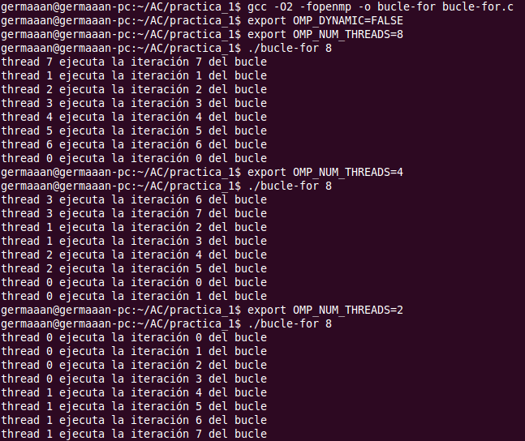
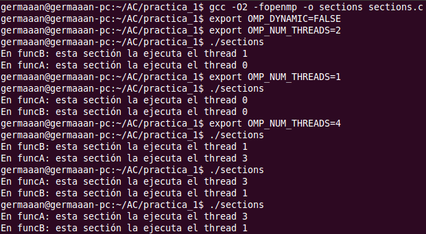
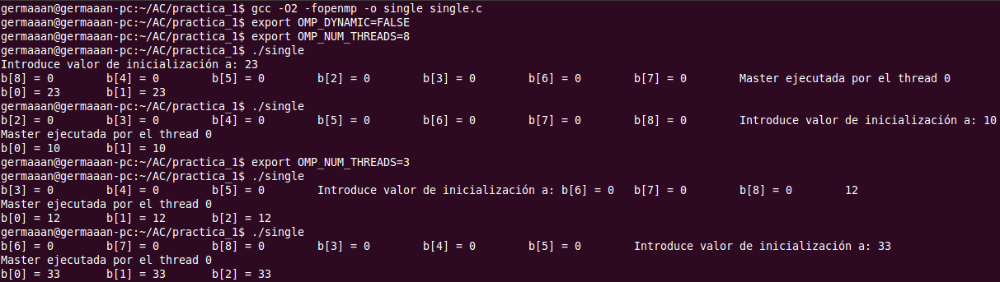
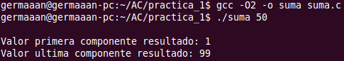
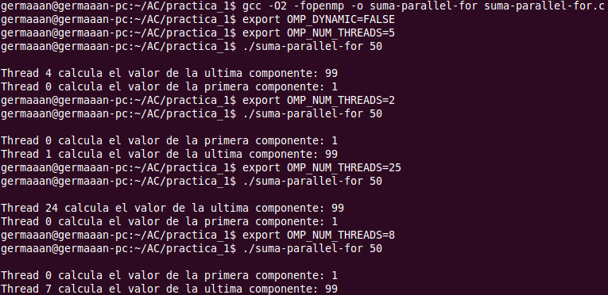
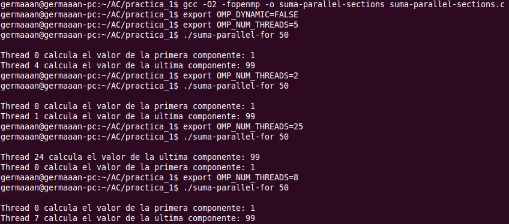

Arquitectura de Computadores
============================
2º Grado en Ingeniería Informática 2011/2012
--------------------------------------------


# Bloque Práctico 1. Programación paralela I: Directivas OpenMP
### Germán Martínez Maldonado

### Ejercicios relacionados con los ejemplos del seminario práctico

#### 1. Usar  la  directiva  parallel  combinada  con  directivas  de  trabajo  compartido  en  los ejemplos bucle-for.c y sections.c del seminario.

**bucle-for.c**

```
#include <stdio.h>
#include <stdlib.h>
#include <omp.h>

int main(int argc, char **argv) {

    int i, n = 9;

    if (argc < 2) {
        fprintf(stderr, "\n[ERROR] - Falta nº iteraciones \n");
        exit(-1);
    }
    n = atoi(argv[1]);

#pragma omp parallel
    {
#pragma omp for
        for (i = 0; i < n; i++)
            printf("thread %d ejecuta la iteración %d del bucle\n",
                omp_get_thread_num(), i);
    }
    return (0);
}
```



**sections.c**

```
#include <stdio.h>
#include <omp.h>

void funcA() {
    printf("En funcA: esta sectión la ejecuta el thread %d\n",
            omp_get_thread_num());
}

void funcB() {
    printf("En funcB: esta sectión la ejecuta el thread %d\n",
            omp_get_thread_num());
}

main() {

#pragma omp parallel
    {
#pragma omp sections
        {
#pragma omp section
            {
                sleep(3);
                (void) funcA();
            }
#pragma omp section 
            {
                sleep(3);
                (void) funcB();
            }
        }
    }
}
```




#### 2. Imprimir los resultados del programa single.c usando una directiva single dentro de la construcción parallel en lugar de imprimirlos fuera de la región parallel. Incorpore, en su cuaderno de trabajo, volcados de pantalla con los resultados de ejecución obtenidos.

**single.c**

```
#include <stdio.h> 
#include <omp.h> 

main() {
    int n = 9, i, a, b[n];

    for (i = 0; i < n; i++) b[i] = -1;
#pragma omp parallel 
    {
#pragma omp single 
        {
            printf("Introduce valor de inicialización a: ");
            scanf("%d", &a);
            printf("Single ejecutada por el thread %d\n", omp_get_thread_num());
        }

#pragma omp for
        for (i = 0; i < n; i++)
            b[i] = a;

#pragma omp single
        for (i = 0; i < n; i++)
            printf("b[%d] = %d\t", i, b[i]);

    }
    printf("\n");
}
```


#### 3. Imprimir los resultados del programa single.c usando una directiva master dentro de la construcción parallel en lugar de imprimirlos fuera de la región parallel. Incorpore en su cuaderno volcados de pantalla con los resultados de ejecución obtenidos. ¿Qué diferencia observa con respecto a los resultados de ejecución del ejercicio 2?

**single.c** *(modificado)*

```
#include <stdio.h> 
#include <omp.h> 

main() {
    int n = 9, i, a, b[n];

    for (i = 0; i < n; i++) b[i] = -1;
#pragma omp parallel 
    {
#pragma omp single 
        {
            printf("Introduce valor de inicialización a: ");
            scanf("%d", &a);
            printf("Single ejecutada por el thread %d\n", omp_get_thread_num());
        }

#pragma omp for
        for (i = 0; i < n; i++)
            b[i] = a;

#pragma omp master
	    printf("Master ejecutada por el thread %d\n, omp_get_thread_num());
        for (i = 0; i < n; i++)
            printf("b[%d] = %d\t", i, b[i]);

    }
    printf("\n");
}
```



La diferencia que vemos es que al usar la directiva “master”, el bloque de código que ejecute dicha directiva sólo se puede ejecutar por el hilo padre, por eso, sólo las instrucciones ejecutadas por la hebra 0 almacenan en la componente del vector correspondiente, el valor introducido por teclado. En el caso que usábamos la directiva “single” observábamos que, independientemente de la hebra que ejecutase la instrucción, todas las hebras almacenaban el valor introducido en la correspondiente componente del vector.


#### 4. ¿Por qué si se elimina directiva barrier en el ejemplo master.c la suma que se calcula e imprime no siempre es correcta? Responda razonadamente.

La directiva “barrier” obliga a que en un punto del código (barrera), los threads se esperen entre sí. Si en el ejemplo master.c eliminamos dicha directiva, los threads no se esperarán en dicho punto a que todos hayan realizado la suma (que en este ejemplo además se ejecuta de forma atómica), por lo que es posible que el valor que se almacene sea erróneo, dando como resultado un cálculo erróneo, cuyo valor es el que se muestra por pantalla.

### Resto de ejercicios

En clase presencial y en casa se trabajarán los siguientes ejercicios y cuestiones:

#### 1. Implementar un programa secuencial en C que calcule la suma de dos vectores (tamaño máximo de los vectores N=4094). NOTAS: (1) el número de componentes debe ser un argumento de entrada al programa; (2) inicializar los vectores antes del cálculo; (3) imprimir siempre la primera y última componente del resultado.

#### VR = V1 + V2; VR(i)=V1(i)+V2(i), i=0,…N-1

```
#include <stdio.h>
#include <stdlib.h>
#include <omp.h>

int main(int argc, char **argv) {

    if (argc < 2) {
        fprintf(stderr, "\n[ERROR] - Falta tamaño vector. \n");
        exit(-1);
    }

    int i, N = atoi(argv[1]);

    if (N > 4094) {
        fprintf(stderr, "\n[ERROR] - El tamaño maximo permitido para el vector es 4094. \n");
        exit(-1);
    }

    int VR[N], V1[N], V2[N];

    for (i = 0; i < N; i++) {
        VR[i] = 0;
        V1[i] = i;
        V2[i] = i + 1;
    }

    for (i = 0; i < N; i++) {
        VR[i] = V1[i] + V2[i];

        if (i == 0) printf("\nValor primera componente resultado: %d", VR[i]);
        if (i == N - 1) printf("\nValor ultima componente resultado: %d", VR[i]);
    }

    printf("\n");
    return (0);
}
```




#### 2. Implementar en paralelo, a partir del código escrito en el ejercicio 1, la suma de vectores con OpenMP usando las directivas parallel y for. Se debe paralelizar también la inicialización de los vectores.

```
#include <stdio.h>
#include <stdlib.h>
#include <omp.h>

int main(int argc, char **argv) {

    if (argc < 2) {
        fprintf(stderr, "\n[ERROR] - Falta tamaño vector. \n");
        exit(-1);
    }

    int i, N = atoi(argv[1]);

    if (N > 4094) {
        fprintf(stderr, "\n[ERROR] - El tamaño maximo permitido para el vector es 4094. \n");
        exit(-1);
    }

    int VR[N], V1[N], V2[N];

#pragma omp parallel
    {
#pragma omp for
        for (i = 0; i < N; i++) {
            VR[i] = 0;
            V1[i] = i;
            V2[i] = i + 1;
        }

#pragma omp for
        for (i = 0; i < N; i++) {
            VR[i] = V1[i] + V2[i];

            if (i == 0) printf("\nThread %d calcula el valor de la primera componente: %d", omp_get_thread_num(), VR[i]);
            if (i == N - 1) printf("\nThread %d calcula el valor de la ultima componente: %d", omp_get_thread_num(), VR[i]);
        }

    }
    printf("\n");
    return (0);
}
```




#### 3. Implementar en paralelo, a partir del código escrito en el ejercicio 1, la suma de vectores con OpenMP usando las directivas parallel y sections/section (aproveche el paralelismo de datos usando estas directivas en lugar de la directiva for). Se debe paralelizar también la inicialización de  los vectores.

```
#include <stdio.h>
#include <stdlib.h>
#include <omp.h>

int main(int argc, char **argv) {

    if (argc < 2) {
        fprintf(stderr, "\n[ERROR] - Falta tamaño vector. \n");
        exit(-1);
    }

    int i, N = atoi(argv[1]);

    if (N > 4094) {
        fprintf(stderr, "\n[ERROR] - El tamaño maximo permitido para el vector es 4094. \n");
        exit(-1);
    }

    int VR[N], V1[N], V2[N];

#pragma omp parallel
    {
#pragma omp sections
        {
#pragma omp section
            for (i = 0; i < N; i++) {
                VR[i] = 0;
                V1[i] = i;
                V2[i] = i + 1;
            }

#pragma omp section
            for (i = 0; i < N; i++) {
                VR[i] = V1[i] + V2[i];

                if (i == 0) printf("\nThread %d calcula el valor de la primera componente: %d", omp_get_thread_num(), VR[i]);
                if (i == N - 1) printf("\nThread %d calcula el valor de la ultima componente: %d", omp_get_thread_num(), VR[i]);
            }
        }
        printf("\n");
        return (0);
    }
```




#### 4. Escriba en su cuaderno las diferencias que ha observado en la ejecución de los códigos que ha implementado en los ejercicios 2 y 3.

Las diferencias que se han observado en la ejecución de los códigos de los ejercicios son básicamente las diferencias propias de usar en un caso la directiva “for” y en otro caso las directivas “sections/section”. Con la directiva “for” cada hebra ejecuta una iteración del bucle for (repartiéndose el número de iteraciones totales entre el número de hebras disponibles), mientras que “sections/section” una hebra ejecuta todas las instrucciones que se encuentren en un bloque “section”. Por ese motivo, vemos que en el ejercicio 2, la primera y la última componente son calculadas por diferentes hebras, mientras que en el ejercicio 3, siempre todas las componentes serán calculadas por la misma hebra, al estar todos los cálculos en el mismo bloque “section”.
