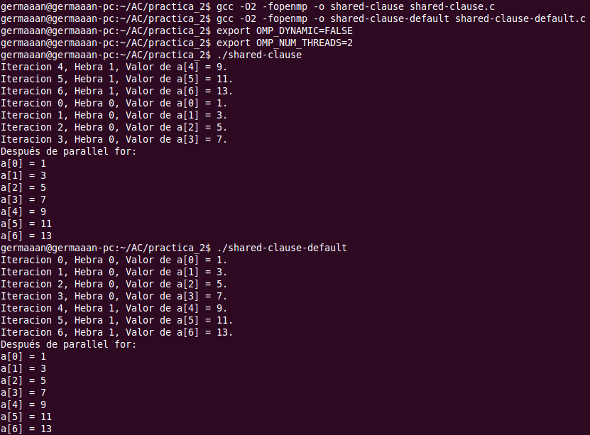
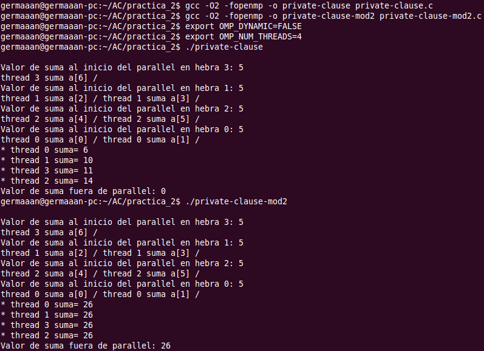
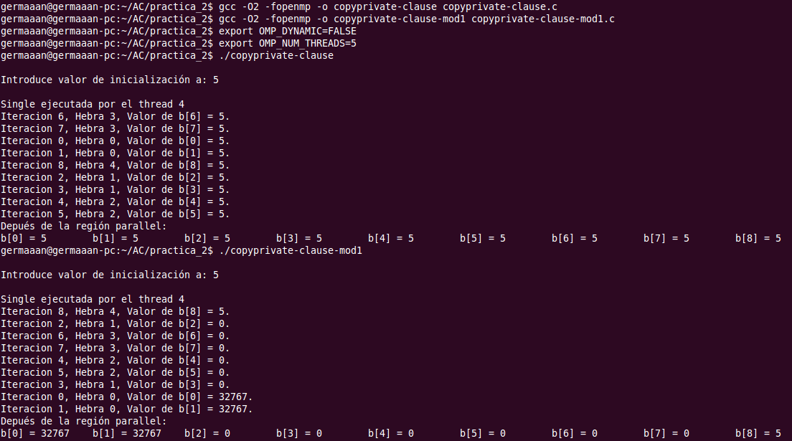
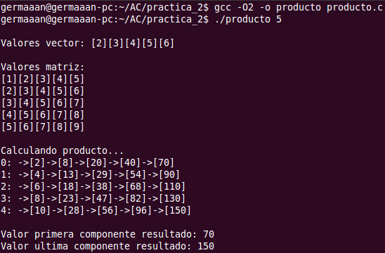
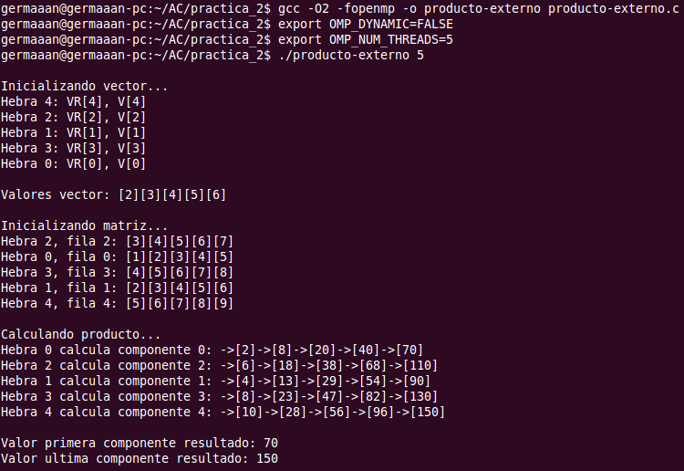
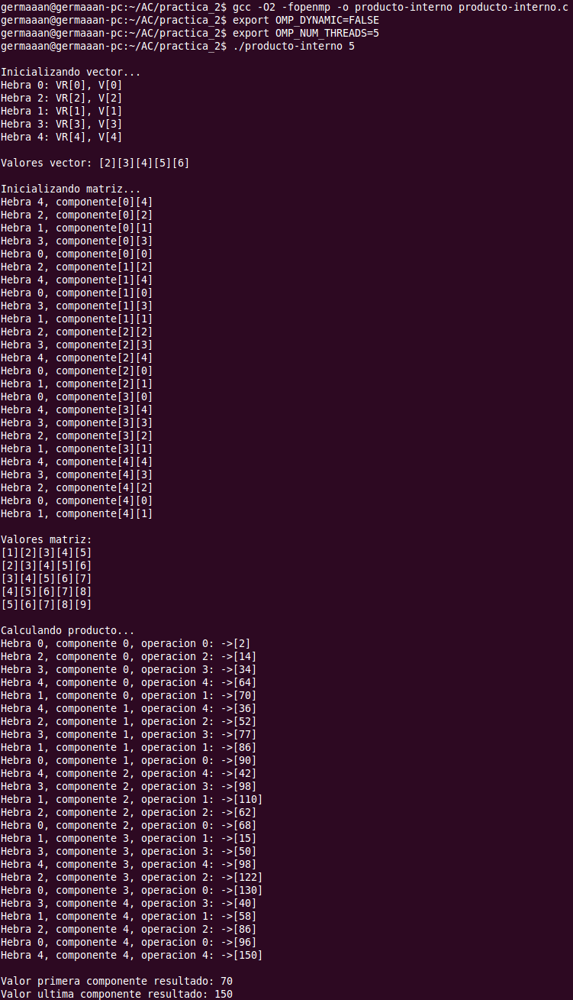
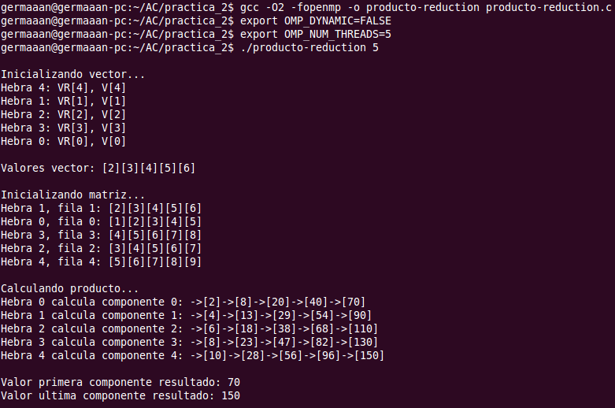

Arquitectura de Computadores
============================
2º Grado en Ingeniería Informática 2011/2012
--------------------------------------------


# Bloque Práctico 2. Programación paralela II: Cláusulas OpenMP
### Germán Martínez Maldonado

### Ejercicios relacionados con los ejemplos del seminario práctico

#### 1. ¿Qué ocurre si en el ejemplo del seminario share-clause.c se añade a la directiva parallel la cláusula default(none)? Si se plantea algún problema, resuélvalo sin eliminar default(none).

**shared-clause.c**

```
#include <stdio.h>
#ifdef _OPENMP
#include <omp.h>
#endif

main() {
    int i, n = 7;
    int a[n];

    for (i = 0; i < n; i++)
        a[i] = i + 1;

#pragma omp parallel for shared(a)
    for (i = 0; i < n; i++) {
        a[i] += i;
        printf("Iteracion %d, Hebra %d, Valor de a[%d] = %d.\n", i, omp_get_thread_num(), i, a[i]);
    }

    printf("Después de parallel for:\n");

    for (i = 0; i < n; i++)
        printf("a[%d] = %d\n", i, a[i]);
}
```

**shared-clause-default.c**

```
#include <stdio.h>
#ifdef _OPENMP
#include <omp.h>
#endif

main() {
    int i, n = 7;
    int a[n];

    for (i = 0; i < n; i++)
        a[i] = i + 1;

#pragma omp parallel for shared(a) default(none) firstprivate(n)
    for (i = 0; i < n; i++) {
        a[i] += i;
        printf("Iteracion %d, Hebra %d, Valor de a[%d] = %d.\n", i, omp_get_thread_num(), i, a[i]);
    }

    printf("Después de parallel for:\n");

    for (i = 0; i < n; i++)
        printf("a[%d] = %d\n", i, a[i]);
}
```

Si eliminamos la cláusula default(none) obtenemos los siguientes errores de compilación:

```
shared-clause-default.c: In function ‘main’:
shared-clause-default.c:15: error: ‘n’ not specified in enclosing parallel 
shared-clause-default.c:14: error: enclosing parallel
```

Al poner default(none), deberemos ser nosotros mismos los que especifiquemos el alcance de todas las variables, “a” se define indicando la cláusula shared(a), como “n” no se define en ninguna cláusula, nos indica que “n” no está especificada, para especificarla usamos firstprivate(n) para que inicialice al valor de “n”, el valor de “n” que toma cada hebra.




#### 2. ¿Qué ocurre si en private-clause.c se inicializa la variable suma fuera de la construcción parallel en lugar de dentro? Razone su respuesta.

**private-clause.c**

```
#include <stdio.h>
#ifdef _OPENMP
#include <omp.h>
#else
#define omp_get_thread_num() 0
#endif

main() {
    int i, n = 7;
    int a[n], suma;

    for (i = 0; i < n; i++)
        a[i] = i;

#pragma omp parallel private(suma)
    {
        suma = 5;

        printf("\nValor de suma al inicio del parallel en hebra %d: %d\n", omp_get_thread_num(), suma);

#pragma omp for
        for (i = 0; i < n; i++) {
            suma = suma + a[i];
            printf("thread %d suma a[%d] / ", omp_get_thread_num(), i);
        }

        printf("\n* thread %d suma= %d", omp_get_thread_num(), suma);
    }

    printf("\nValor de suma fuera de parallel: %d", suma);

    printf("\n");
}
```

**private-clause-mod1.c**

```
#include <stdio.h>
#ifdef _OPENMP
#include <omp.h>
#else
#define omp_get_thread_num() 0
#endif

main() {
    int i, n = 7;
    int a[n], suma;

    for (i = 0; i < n; i++)
        a[i] = i;

    suma = 5;

#pragma omp parallel private(suma)
    {

        printf("\nValor de suma al inicio del parallel en hebra %d: %d\n", omp_get_thread_num(), suma);

#pragma omp for
        for (i = 0; i < n; i++) {
            suma = suma + a[i];
            printf("thread %d suma a[%d] / ", omp_get_thread_num(), i);
        }

        printf("\n* thread %d suma= %d", omp_get_thread_num(), suma);
    }

    printf("\nValor de suma fuera de parallel: %d", suma);

    printf("\n");
}
```

Con private(suma) indicamos que los valores de entrada y salida de suma están indefinidos, por eso si inicializamos el valor de suma dentro de la construcción parallel, todas las hebras tomarán ese valor para su copia privada de suma, pero una vez que finaliza la construcción este valor desaparece porque para el resto del programa es como si nunca hubiera existido, en cambio si inicializamos fuera de la construcción parallel, como con private, el valor de entrada es indefinido, las hebras no tomarán para suma el valor especificado fuera, tomaran un valor indefinido, que nuestro compilador hace que sea 0, pero esto no tiene por qué ser así siempre.


#### 3. ¿Qué ocurre si en private-clause.c se elimina la cláusula private(suma)?¿A qué cree que es debido?

**private-clause-mod2.c**

```
#include <stdio.h>
#ifdef _OPENMP
#include <omp.h>
#else
#define omp_get_thread_num() 0
#endif

main() {
    int i, n = 7;
    int a[n], suma;

    for (i = 0; i < n; i++)
        a[i] = i;

#pragma omp parallel
    {
        suma = 5;

        printf("\nValor de suma al inicio del parallel en hebra %d: %d\n", omp_get_thread_num(), suma);

#pragma omp for
        for (i = 0; i < n; i++) {
            suma = suma + a[i];
            printf("thread %d suma a[%d] / ", omp_get_thread_num(), i);
        }

        printf("\n* thread %d suma= %d", omp_get_thread_num(), suma);
    }

    printf("\nValor de suma fuera de parallel: %d", suma);

    printf("\n");
}
```

Con private lo que se hace es que todas las hebras copien en su “variable privada suma” el valor que establece para suma, mientras que sin private se indica que todas las hebras van a usar el mismo valor, por eso con private cada hebra tiene un valor distinto para suma dependiendo de las operaciones que hayan hecha sobre su valor privado, mientras que sin private solo existe una copia de la variable suma, por eso todas las hebras dan el mismo valor para suma.




#### 4. ¿Qué  ocurre  si  en  copyprivate-clause.c  se  elimina  la  cláusula  copyprivate(a)  en  la directiva single? ¿A qué cree que es debido?

**copyprivate-clause.c**

```
#include <stdio.h>
#include <omp.h>

main() {
    int n = 9, i, b[n];

    for (i = 0; i < n; i++) b[i] = -1;

#pragma omp parallel
    {
        int a;

#pragma omp single copyprivate(a)
        {
            printf("\nIntroduce valor de inicialización a: ");
            scanf("%d", &a);
            printf("\nSingle ejecutada por el thread %d\n", omp_get_thread_num());
        }

#pragma omp for
        for (i = 0; i < n; i++) {
            b[i] = a;
            printf("Iteracion %d, Hebra %d, Valor de b[%d] = %d.\n", i, omp_get_thread_num(), i, b[i]);
        }
    }

    printf("Depués de la región parallel:\n");
    for (i = 0; i < n; i++) printf("b[%d] = %d\t", i, b[i]);
    printf("\n");
}
```

**copyprivate-clause-mod1.c**

```
#include <stdio.h>
#include <omp.h>

main() {
    int n = 9, i, b[n];

    for (i = 0; i < n; i++) b[i] = -1;

#pragma omp parallel
    {
        int a;

#pragma omp single
        {
            printf("\nIntroduce valor de inicialización a: ");
            scanf("%d", &a);
            printf("\nSingle ejecutada por el thread %d\n", omp_get_thread_num());
        }

#pragma omp for
        for (i = 0; i < n; i++) {
            b[i] = a;
            printf("Iteracion %d, Hebra %d, Valor de b[%d] = %d.\n", i, omp_get_thread_num(), i, b[i]);
        }
    }

    printf("Depués de la región parallel:\n");
    for (i = 0; i < n; i++) printf("b[%d] = %d\t", i, b[i]);
    printf("\n");
}
```

Como el valor leído “a” con scanf se hace desde una construcción single sólo se ejecutará una vez, pero como con copyprivate indicamos que todas las hebras tomen ese valor para su copia privada de la variable, todos toman el mismo valor en la asignación de a, si quitamos el copyprivate lo que estaremos asignando es una variable sin inicializar, estaremos asignando un valor indeterminado, por eso como vemos en ocasiones da 0 y en otras 32767.




### Resto de ejercicios

### 1. Implementar un programa secuencial en C que calcule el producto matriz por vector (tamaño máximo de las  filas y columnas  4094). NOTAS: (1) el número de filas M y columnas N de la matriz deben ser argumentos de entrada al programa; (2) inicializar la matriz y el vector antes del cálculo; (3) Imprimir siempre el primer y último componente del vector resultado.

## VR = M * V; VR(i) = Σk=0;N-1 * V(k), i=0,...,N-1

**producto.c**

```
#include <stdio.h>
#include <stdlib.h>

int main(int argc, char **argv) {

    if (argc < 2) {
        fprintf(stderr, "\n[ERROR] - Debe introducir introducir dimension. \n");
        exit(-1);
    }

    int i, k, N = atoi(argv[1]), VR[N], M[N][N], V[N];

    if (N > 4094) {
        fprintf(stderr, "\n[ERROR] - El tamaño maximo permitido para filas y columnas es 4094. \n");
        exit(-1);
    }

    printf("\nValores vector: ");
    for (i = 0; i < N; i++) {
        VR[i] = 0;
        V[i] = i + 2;
        printf("[%d]", V[i]);
    }

    printf("\n\nValores matriz:");
    for (i = 0; i < N; i++) {
        printf("\n");
        for (k = 0; k < N; k++) {
            M[i][k] = i + k + 1;
            printf("[%d]", M[i][k]);
        }
    }

    printf("\n\nCalculando producto...");
    for (i = 0; i < N; i++) {
        printf("\n%d: ", i);

        for (k = 0; k < N; k++) {
            VR[i] += M[i][k] * V[k];
            printf("->[%d]", VR[i]);
        }
    }

    printf("\n\nValor primera componente resultado: %d", VR[0]);
    printf("\nValor ultima componente resultado: %d", VR[N - 1]);

    printf("\n\n");
    return (0);
}
```




#### 2. Implementar en paralelo el producto matriz por vector con OpenMP a partir del código escrito en el ejercicio 1. Use las directivas parallel, for, las directivas para comunicación y sincronización que estime oportunas y las cláusulas que considere necesarias excepto la cláusula reduction. Se debe paralelizar también la inicialización de las matrices. Respecto a este ejercicio 2:
  * **2.1 Anote todos los errores de compilación que se han generado durante la realización del ejercicio y explique cómo los ha resuelto (especifique qué ayudas externas ha usado o recibido).**
  * **2.2 Anote todos los errores en tiempo de ejecución que se han generado durante la realización del ejercicio y explique cómo los ha resuelto (especifique qué ayudas externas ha usado o recibido).**

**producto-externo.c**

```
#include <stdio.h>
#include <stdlib.h>

int main(int argc, char **argv) {

    if (argc < 2) {
        fprintf(stderr, "\n[ERROR] - Debe introducir introducir dimension. \n");
        exit(-1);
    }

    int i, k, N = atoi(argv[1]), VR[N], M[N][N], V[N];

    if (N > 4094) {
        fprintf(stderr, "\n[ERROR] - El tamaño maximo permitido para filas y columnas es 4094. \n");
        exit(-1);
    }

    printf("\nInicializando vector...");
#pragma omp parallel for
    for (i = 0; i < N; i++) {
        //printf("\nHebra %d: VR[%d], V[%d]", omp_get_thread_num(), i, i);
        VR[i] = 0;
        V[i] = i + 2;
    }

    printf("\n\nValores vector: ");
    for (i = 0; i < N; i++) printf("[%d]", V[i]);


    printf("\n\nInicializando matriz...");
#pragma omp parallel for
    for (i = 0; i < N; i++) {
        //printf("\nHebra %d, fila %d: ", omp_get_thread_num(), i);

        for (k = 0; k < N; k++) {
            M[i][k] = i + k + 1;
            printf("[%d]", M[i][k]);
        }
    }

    printf("\n\nCalculando producto...");
#pragma omp parallel for
    for (i = 0; i < N; i++) {
        //printf("\nHebra %d calcula componente %d: ", omp_get_thread_num(), i);

        for (k = 0; k < N; k++) {
            VR[i] += M[i][k] * V[k];
            //printf("->[%d]", VR[i]);
        }
    }

    printf("\n\nValor primera componente resultado: %d", VR[0]);
    printf("\nValor ultima componente resultado: %d", VR[N - 1]);

    printf("\n\n");
    return (0);
}
```

**producto-interno.c**

```
#include <stdio.h>
#include <stdlib.h>
#ifdef _OPENMP
#include <omp.h>
#else
#define omp_get_thread_num() 0
#endif

int main(int argc, char **argv) {

    if (argc < 2) {
        fprintf(stderr, "\n[ERROR] - Debe introducir introducir dimension. \n");
        exit(-1);
    }

    int i, k, N = atoi(argv[1]), VR[N], M[N][N], V[N];

    if (N > 4094) {
        fprintf(stderr, "\n[ERROR] - El tamaño maximo permitido para filas y columnas es 4094. \n");
        exit(-1);
    }

    printf("\nInicializando vector...");
#pragma omp parallel for
    for (i = 0; i < N; i++) {
        //printf("\nHebra %d: VR[%d], V[%d]", omp_get_thread_num(), i, i);
        VR[i] = 0;
        V[i] = i + 2;
    }

    printf("\n\nValores vector: ");
    for (i = 0; i < N; i++) printf("[%d]", V[i]);

    printf("\n\nInicializando matriz...");
    for (i = 0; i < N; i++) {
#pragma omp parallel for lastprivate(k)
        for (k = 0; k < N; k++) {
            //printf("\nHebra %d, componente[%d][%d]", omp_get_thread_num(), i, k);
            M[i][k] = i + k + 1;
        }
    }

    printf("\n\nValores matriz: ");
    for (i = 0; i < N; i++) {
        printf("\n");
        for (k = 0; k < N; k++) {
            M[i][k] = i + k + 1;
            printf("[%d]", M[i][k]);
        }
    }

    printf("\n\nCalculando producto...");
    for (i = 0; i < N; i++) {
#pragma omp parallel for lastprivate(k)
        for (k = 0; k < N; k++) {
            VR[i] += M[i][k] * V[k];

            //printf("\nHebra %d, componente %d, operacion %d: ->[%d]", omp_get_thread_num(), i, k, VR[i]);
        }
    }

    omp_sched_t kind;
    int modifier;

    omp_get_schedule(&kind, &modifier);

    printf("\nValores actuales: dyn-var: %d, nthreads-var: %d, run-sched-var[kind: %d, modifier: %d]\n", omp_get_dynamic(), omp_get_max_threads(), kind, modifier);

    printf("\n\nValor primera componente resultado: %d", VR[0]);
    printf("\nValor ultima componente resultado: %d", VR[N - 1]);

    printf("\n\n");
    return (0);
}
```

No me han aparecido errores que anotar,  porque es simplemente realizar una pequeña adaptación del ejercicio anterior, y con el documento del seminario 2 mirando los ejemplos de las diferentes cláusulas, en la explicación de la cláusula lastprivate da la idea de que se puede usar para la construcción de bucles, porque se copia el valor de la última iteración, siendo sencilla su implementación.






#### 3. A partir del código escrito en el ejercicio 2, implementar una versión paralela del producto matriz por vector con OpenMP que use para comunicación/sincronización la cláusula reduction.

**producto-reduction.c**

```
#include <stdio.h>
#include <stdlib.h>

int main(int argc, char **argv) {

    if (argc < 2) {
        fprintf(stderr, "\n[ERROR] - Debe introducir introducir dimension. \n");
        exit(-1);
    }

    int i, k, N = atoi(argv[1]), VR[N], M[N][N], V[N], producto = 0;

    if (N > 4094) {
        fprintf(stderr, "\n[ERROR] - El tamaño maximo permitido para filas y columnas es 4094. \n");
        exit(-1);
    }

    printf("\nInicializando vector...");
#pragma omp parallel for
    for (i = 0; i < N; i++) {
        printf("\nHebra %d: VR[%d], V[%d]", omp_get_thread_num(), i, i);
        VR[i] = 0;
        V[i] = i + 2;
    }

    printf("\n\nValores vector: ");
    for (i = 0; i < N; i++) printf("[%d]", V[i]);


    printf("\n\nInicializando matriz...");
#pragma omp parallel for
    for (i = 0; i < N; i++) {
        printf("\nHebra %d, fila %d: ", omp_get_thread_num(), i);

        for (k = 0; k < N; k++) {
            M[i][k] = i + k + 1;
            printf("[%d]", M[i][k]);
        }
    }

    printf("\n\nCalculando producto...");
#pragma omp parallel for reduction(+:producto)
    for (i = 0; i < N; i++) {
        producto = 0;
        printf("\nHebra %d calcula componente %d: ", omp_get_thread_num(), i);

        for (k = 0; k < N; k++) {
            producto += M[i][k] * V[k];
            printf("->[%d]", producto);
        }

        VR[i] = producto;
    }

    printf("\n\nValor primera componente resultado: %d", VR[0]);
    printf("\nValor ultima componente resultado: %d", VR[N - 1]);

    printf("\n\n");

    return (0);
}
```


