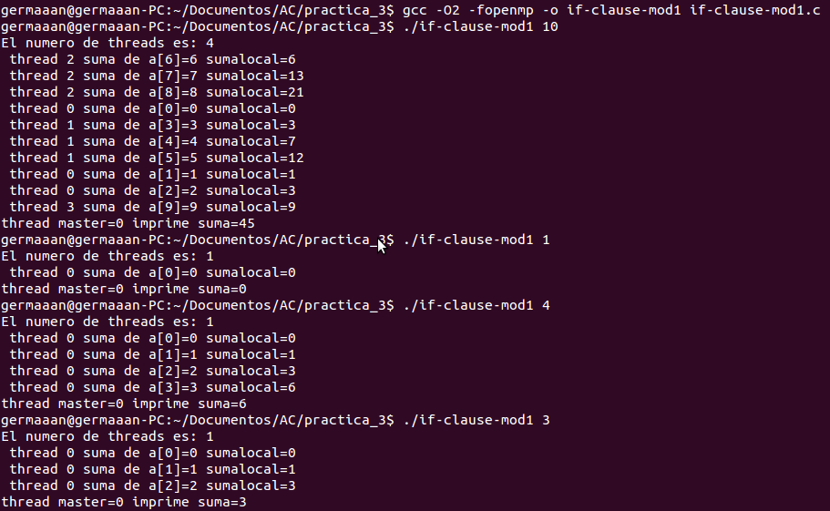
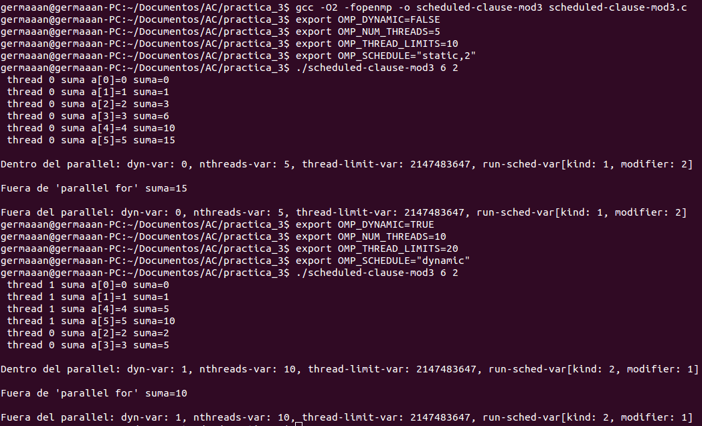
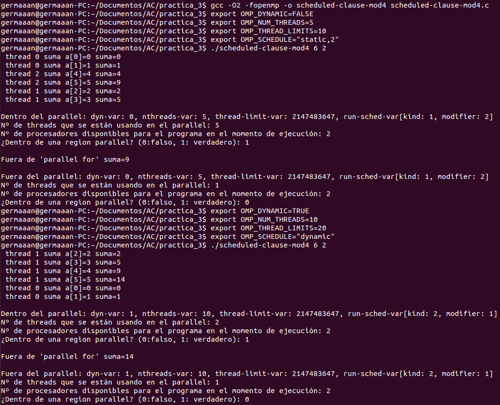
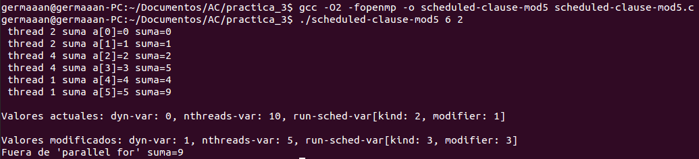
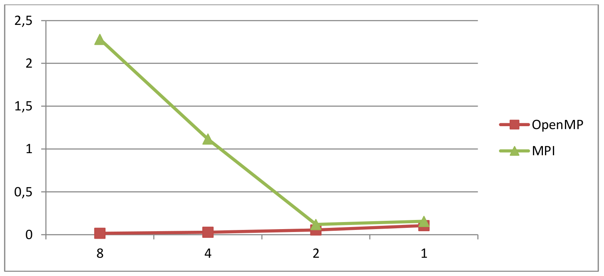
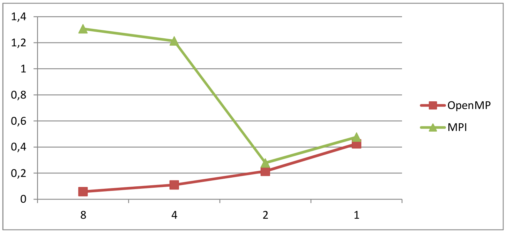
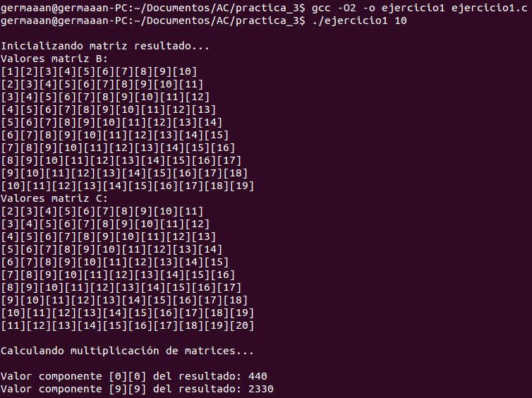
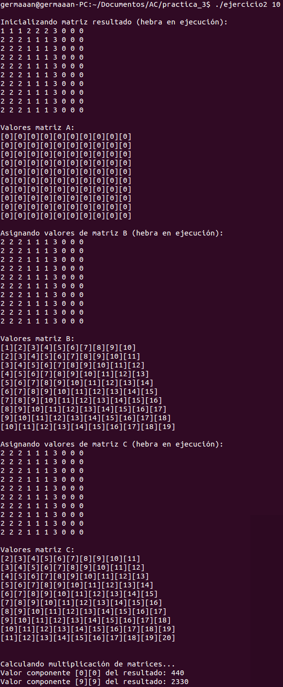
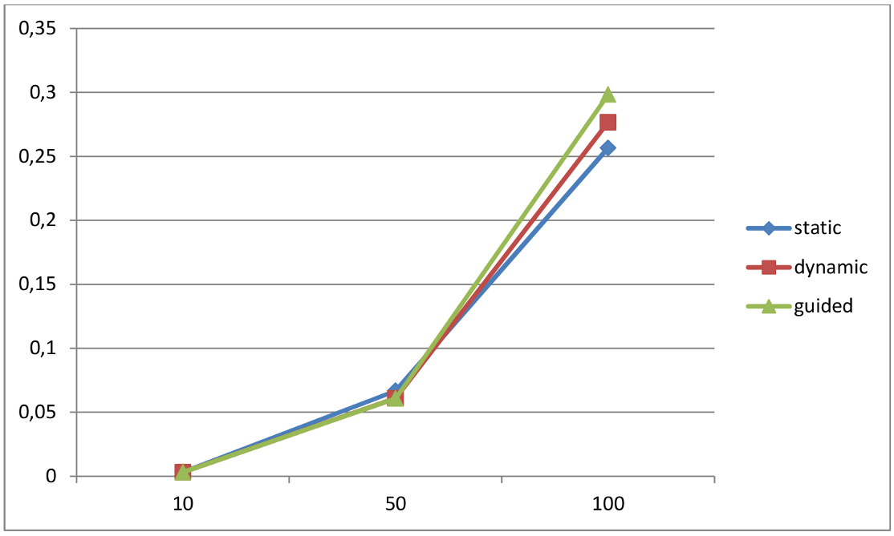

Arquitectura de Computadores
============================
2º Grado en Ingeniería Informática 2011/2012
--------------------------------------------


# Bloque Práctico 3. Programación paralela III: Interacción con el entorno en OpenMP y evaluación de prestaciones
### Germán Martínez Maldonado

### Ejercicios relacionados con los ejemplos del seminario práctico

#### 1. Use la cláusula num_threads() en el ejemplo del seminario if_clause.c. Incorpore en su cuaderno de trabajo de esta práctica volcados de pantalla con ejemplos de ejecución que ilustren la funcionalidad de esta cláusula y explique en su cuaderno por qué lo ilustran.

**if-clause-mod1.c**

```
#include <stdio.h>
#include <stdlib.h>
#include <omp.h>

int main(int argc, char **argv) {
    int i, n = 20, tid;
    int a[n], suma = 0, sumalocal;

    if (argc < 2) {
        fprintf(stderr, "[ERROR]-Falta iteraciones\n");
        exit(-1);
    }

    n = atoi(argv[1]);
    if (n > 20) n = 20;

    for (i = 0; i < n; i++) {
        a[i] = i;
    }

#pragma omp parallel num_threads(4) if(n>4) default(none) private(sumalocal,tid) shared(a,suma,n)
    {
#pragma omp single
        printf("El numero de threads es: %d\n", omp_get_num_threads());

        sumalocal = 0;
        tid = omp_get_thread_num();

#pragma omp for private(i) schedule(static) nowait
        for (i = 0; i < n; i++) {
            sumalocal += a[i];
            printf(" thread %d suma de a[%d]=%d sumalocal=%d \n",
                    tid, i, a[i], sumalocal);
        }

#pragma omp atomic
        suma += sumalocal;
#pragma omp barrier

#pragma omp master
        printf("thread master=%d imprime suma=%d\n", tid, suma);
    }
}
```

Como se comprobará ahora en la imagen, usar la cláusula “num_threads()” para este ejemplo producirá que si introducimos un número de iteraciones mayor que 4, el número de hebras pasa a ser 4.




#### 2. Rellenar una tabla como la que se puede ver la Figura 3 (se debe poner en la tabla el thread que ejecuta cada iteración) ejecutando los ejemplos del seminario schedule- clause.c, scheduled-clause.c y scheduleg-clause.c con dos threads (0,1) y unas entradas de:
* **iteraciones: 15**
* **chunck= 1, 2 y 4**

Podemos fijar que se usen dos threads añadiendo la cláusula “num_threads(2)” al bloque parallel:

```
#pragma omp parallel for num_threads(2) firstprivate(suma) lastprivate(suma) /
  schedule([kind],[modifier])
```

* A: schedule-clause.c
* B: scheduled-claused.c
* C: scheduleg-clauseg.c

|           |   | A |   |   | B |   |   | C |   |
|:---------:|:-:|:-:|:-:|:-:|:-:|:-:|:-:|:-:|:-:|
| Iteración | 1 | 2 | 4 | 1 | 2 | 4 | 1 | 2 | 4 |
|     0     | 0 | 0 | 0 | 0 | 0 | 1 | 1 | 0 | 1 |
|     1     | 1 | 0 | 0 | 1 | 0 | 1 | 1 | 0 | 1 |
|     2     | 0 | 1 | 0 | 0 | 1 | 1 | 1 | 0 | 1 |
|     3     | 1 | 1 | 0 | 0 | 1 | 1 | 1 | 0 | 1 |
|     4     | 0 | 0 | 1 | 0 | 0 | 0 | 1 | 0 | 1 |
|     5     | 1 | 0 | 1 | 0 | 0 | 0 | 1 | 0 | 1 |
|     6     | 0 | 1 | 1 | 0 | 0 | 0 | 1 | 0 | 1 |
|     7     | 1 | 1 | 1 | 0 | 0 | 0 | 1 | 0 | 1 |
|     8     | 0 | 0 | 0 | 0 | 0 | 1 | 0 | 1 | 0 |
|     9     | 1 | 0 | 0 | 0 | 0 | 1 | 0 | 1 | 0 |
|     10    | 0 | 1 | 0 | 0 | 0 | 1 | 0 | 1 | 0 |
|     11    | 1 | 1 | 0 | 0 | 0 | 1 | 0 | 1 | 0 |
|     12    | 0 | 0 | 1 | 0 | 0 | 1 | 1 | 0 | 1 |
|     13    | 1 | 0 | 1 | 0 | 0 | 1 | 1 | 0 | 1 |
|     14    | 0 | 1 | 1 | 0 | 0 | 1 | 1 | 0 | 1 |


#### 3. Añada al programa scheduled-clause.c lo necesario para que imprima el valor de las variables de control dyn-var, nthreads-var, thread-limit-var y run-sched-var dentro y fuera de la región paralela. Realice varias ejecuciones usando variables de entorno para modificar estas variables de control antes de la ejecución. Incorpore en su cuaderno de prácticas volcados de pantalla de estas ejecuciones.

Los métodos necesarios son:
* dyn-var:           omp_get_dynamic()
* nthreads-var:	     omp_get_max_threads()
* thread-limit-var:  omp_get_thread_limit()
* run-sched-var:     omp_get_schedule(omp_sched_t &kind, int &modifier)

Las variables de entorno correspondientes son:
* dyn-var:	     OMP_DYNAMIC
* nthreads-var:	     OMP_NUM_THREADS
* thread-limit-var:  OMP_THREAD_LIMIT
* run-sched-var:     OMP_SCHEDULE=”kind,[modifier]”

**scheduled-clause-mod3.c**

```
#include <stdio.h>
#include <stdlib.h>
#ifdef _OPENMP
#include <omp.h>
#else
#define omp_get_thread_num() 0
#endif

main(int argc, char **argv) {
    int i, n = 200, chunk, a[n], suma = 0;
    omp_sched_t kind;
    int modifier;

    if (argc < 3) {
        fprintf(stderr, "\nFalta iteraciones o chunk \n");
        exit(-1);
    }

    n = atoi(argv[1]);
    if (n > 200) n = 200;
    chunk = atoi(argv[2]);

    for (i = 0; i < n; i++) a[i] = i;

#pragma omp parallel
    {
#pragma omp for firstprivate(suma) lastprivate(suma) schedule(dynamic,chunk)
        for (i = 0; i < n; i++) {
            suma = suma + a[i];
            printf(" thread %d suma a[%d]=%d suma=%d \n",
                    omp_get_thread_num(), i, a[i], suma);
        }

#pragma omp single
        {
            omp_get_schedule(&kind, &modifier);

            printf("\nDentro del parallel: dyn-var: %d, nthreads-var: %d, thread-limit-var: %d, run-sched-var[kind: %d, modifier: %d]\n", omp_get_dynamic(), omp_get_max_threads(), omp_get_thread_limit(), kind, modifier);
        }
    }

    printf("\nFuera de 'parallel for' suma=%d\n", suma);

    omp_get_schedule(&kind, &modifier);

    printf("\nFuera del parallel: dyn-var: %d, nthreads-var: %d, thread-limit-var: %d, run-sched-var[kind: %d, modifier: %d]\n", omp_get_dynamic(), omp_get_max_threads(), omp_get_thread_limit(), kind, modifier);
}
```




#### 4. Use en el ejemplo anterior las funciones omp_get_num_threads(), omp_get_num_procs() y omp_in_parallel() dentro y fuera de la región paralela. Incorpore en su cuaderno de prácticas volcados de pantalla con los resultados de ejecución obtenidos.

Los métodos usados:
* omp_get_num_threads():    Devuelve el número de threads que se están usando.
* omp_get_num_procs():      Devuelve el número de procesadores disponibles.
* omp_in_parallel():        Devuelve un booleano que indica si estamos dentro de un región paralela.

**scheduled-clause-mod4.c**

```
#include <stdio.h>
#include <stdlib.h>
#ifdef _OPENMP
#include <omp.h>
#else
#define omp_get_thread_num() 0
#endif

main(int argc, char **argv) {
    int i, n = 200, chunk, a[n], suma = 0;
    omp_sched_t kind;
    int modifier;

    if (argc < 3) {
        fprintf(stderr, "\nFalta iteraciones o chunk \n");
        exit(-1);
    }

    n = atoi(argv[1]);
    if (n > 200) n = 200;
    chunk = atoi(argv[2]);

    for (i = 0; i < n; i++) a[i] = i;

#pragma omp parallel
    {
#pragma omp for firstprivate(suma) lastprivate(suma) schedule(dynamic,chunk)
        for (i = 0; i < n; i++) {
            suma = suma + a[i];
            printf(" thread %d suma a[%d]=%d suma=%d \n",
                    omp_get_thread_num(), i, a[i], suma);
        }

#pragma omp single
        {
            omp_get_schedule(&kind, &modifier);

            printf("\nDentro del parallel: dyn-var: %d, nthreads-var: %d, thread-limit-var: %d, run-sched-var[kind: %d, modifier: %d]\n", omp_get_dynamic(), omp_get_max_threads(), omp_get_thread_limit(), kind, modifier);
            printf("Nº de threads que se están usando en el parallel: %d\n", omp_get_num_threads());
            printf("Nº de procesadores disponibles para el programa en el momento de ejecución: %d\n", omp_get_num_procs());
            printf("¿Dentro de una region parallel? (0:falso, 1: verdadero): %d\n", omp_in_parallel());
        }
    }

    printf("\nFuera de 'parallel for' suma=%d\n", suma);

    omp_get_schedule(&kind, &modifier);

    printf("\nFuera del parallel: dyn-var: %d, nthreads-var: %d, thread-limit-var: %d, run-sched-var[kind: %d, modifier: %d]\n", omp_get_dynamic(), omp_get_max_threads(), omp_get_thread_limit(), kind, modifier);
    printf("Nº de threads que se están usando en el parallel: %d\n", omp_get_num_threads());
    printf("Nº de procesadores disponibles para el programa en el momento de ejecución: %d\n", omp_get_num_procs());
    printf("¿Dentro de una region parallel? (0:falso, 1: verdadero): %d\n", omp_in_parallel());
}
```




#### 5. Añada al programa scheduled-clause.c lo necesario para modificar las variables de control dyn-var, nthreads-var y run-sched-var y para poder imprimir el valor de estas variables antes y después de dicha modificación. Incorpore en su cuaderno de prácticas volcados de pantalla con los resultados de ejecución obtenidos.

Los métodos necesarios son:
* dyn-var:          omp_set_dynamic(int dynamic_threads)
* nthreads-var:     omp_set_max_threads(int threads)
* run-sched-var:    omp_set_schedule(omp_sched_t kind, int modifier)

```
#include <stdio.h>
#include <stdlib.h>
#ifdef _OPENMP
#include <omp.h>
#else
#define omp_get_thread_num() 0
#endif

main(int argc, char **argv) {
    int i, n = 200, chunk, a[n], suma = 0;
    omp_sched_t kind;
    int modifier;

    if (argc < 3) {
        fprintf(stderr, "\nFalta iteraciones o chunk \n");
        exit(-1);
    }

    n = atoi(argv[1]);
    if (n > 200) n = 200;
    chunk = atoi(argv[2]);

    for (i = 0; i < n; i++) a[i] = i;

#pragma omp parallel
    {
#pragma omp for firstprivate(suma) lastprivate(suma) schedule(dynamic,chunk)
        for (i = 0; i < n; i++) {
            suma = suma + a[i];
            printf(" thread %d suma a[%d]=%d suma=%d \n",
                    omp_get_thread_num(), i, a[i], suma);
        }

#pragma omp single
        {
            omp_get_schedule(&kind, &modifier);

            printf("\nValores actuales: dyn-var: %d, nthreads-var: %d, run-sched-var[kind: %d, modifier: %d]\n", omp_get_dynamic(), omp_get_max_threads(), kind, modifier);

            omp_set_dynamic(10);
            omp_set_num_threads(5);
            omp_set_schedule(omp_sched_guided, chunk + 1);

            omp_get_schedule(&kind, &modifier);

            printf("\nValores modificados: dyn-var: %d, nthreads-var: %d, run-sched-var[kind: %d, modifier: %d]\n", omp_get_dynamic(), omp_get_max_threads(), kind, modifier);
        }
    }

    printf("Fuera de 'parallel for' suma=%d\n", suma);
}
```




#### 6. Ayudándose de una hoja de cálculo (recuerde que en las aulas está instalado OpenOffice) realice un gráfico que permita comparar la escalabilidad del código de PI de OpenMP con el código de PI de MPI usando los datos que aparecen en el último apartado de los contenidos del seminario.

* **Iteraciones: 10000000**

| Threads / Procesos |  OpenMP  |    MPI   |
|:------------------:|:--------:|:--------:|
|          8         | 0,016534 | 2,281467 |
|          4         | 0,029227 | 1,116629 |
|          2         | 0,055943 | 0,119861 |
|          1         | 0,105901 | 0,156071 |



* **Iteraciones: 40000000**

| Threads / Procesos |  OpenMP  |    MPI   |
|:------------------:|:--------:|:--------:|
|          8         | 0,058191 | 1,306842 |
|          4         | 0,109995 | 1,213710 |
|          2         | 0,214541 | 0,278467 |
|          1         | 0,424877 | 0,156071 |




### Resto de ejercicios

#### 1. Implementar un programa secuencial en C que calcule la multiplicación de matrices cuadradas (tamaño máximo de las filas y columnas N=4094). NOTAS: (1) el número de filas/columnas debe ser un argumento de entrada; (2) inicializar las matrices antes del cálculo; (3) imprimir siempre las componentes (0,0) y (N-1, N-1) del resultado.

## A = B * C; A(i,j) = Σk=0;N-1 B(i,k) * C(k,j), i,j=0,...,N-1

```
#include <stdio.h>
#include <stdlib.h>
#include <time.h>

int main(int argc, char **argv) {

    if (argc < 2) {
        fprintf(stderr, "\n[ERROR] - Debe introducir introducir dimension. \n");
        exit(-1);
    }

    int i, k, j, N = atoi(argv[1]), A[N][N], B[N][N], C[N][N];

    struct timespec cgt1, cgt2;
    double ncgt;

    if (N > 4094) {
        fprintf(stderr, "\n[ERROR] - El tamaño maximo permitido para filas y columnas es 4094. \n");
        exit(-1);
    }

    printf("\nInicializando matriz resultado...");
    for (i = 0; i < N; i++)
        for (k = 0; k < N; k++)
            A[i][k] = 0;

    printf("\nValores matriz B:");
    for (i = 0; i < N; i++) {
        printf("\n");
        for (k = 0; k < N; k++) {
            B[i][k] = i + k + 1;
            printf("[%d]", B[i][k]);
        }
    }

    printf("\nValores matriz C:");
    for (i = 0; i < N; i++) {
        printf("\n");
        for (k = 0; k < N; k++) {
            C[i][k] = i + k + 2;
            printf("[%d]", C[i][k]);
        }
    }

    printf("\n\nCalculando multiplicación de matrices...");
    clock_gettime(CLOCK_REALTIME, &cgt1);
    for (i = 0; i < N; i++)
        for (j = 0; j < N; j++)
            for (k = 0; k < N; k++)
                A[i][j] += B[i][k] * C[k][j];

    clock_gettime(CLOCK_REALTIME, &cgt2);
    ncgt = (double) (cgt2.tv_sec - cgt1.tv_sec) + (double) ((cgt2.tv_nsec - cgt1.tv_nsec) / (1.e+9));

    printf("\nTiempo:\t%8.6f\n", ncgt);

    printf("\n\nValor componente [0][0] del resultado: %d", A[0][0]);
    printf("\nValor componente [%d][%d] del resultado: %d", N - 1, N - 1, A[N - 1][N - 1]);

    printf("\n\n");
    return (0);
}
```




#### 2. Implementar en paralelo la multiplicación de matrices cuadradas con  OpenMP  a partir del código escrito en el ejercicio 1. Use las directivas, las cláusulas y las funciones de entorno que considere oportunas. Añada lo necesario para fijar la planificación de tareas en el propio código a través de la variable run-sched-var. Se debe paralelizar también la inicialización de las matrices. Además:
  * **a. Anote todos los errores de compilación que se han generado durante la realización del ejercicio y explique cómo los ha resuelto (especifique qué ayudas externas ha usado o recibido).**
  * **b. Anote todos los errores en tiempo de ejecución que se han generado durante la realización del ejercicio y explique cómo los ha resuelto (especifique qué ayudas externas ha usado o recibido).**

No he tenido problemas al realizar este ejercicio por la razón de que era muy parecido al realizado en el bloque práctico anterior.

```
#include <stdio.h>
#include <stdlib.h>
#ifdef _OPENMP
#include <omp.h>
#else
#define omp_get_thread_num() 0
#endif

int main(int argc, char **argv) {

    if (argc < 2) {
        fprintf(stderr, "\n[ERROR] - Debe introducir introducir dimension. \n");
        exit(-1);
    }

    int i, k, j, N = atoi(argv[1]), A[N][N], B[N][N], C[N][N];
    double t;

    if (N > 4094) {
        fprintf(stderr, "\n[ERROR] - El tamaño maximo permitido para filas y columnas es 4094. \n");
        exit(-1);
    }

    omp_set_num_threads(4);
    omp_set_schedule(omp_sched_guided, 5);

    //printf("\nInicializando matriz resultado (hebra en ejecución):\n");		
    for (i = 0; i < N; i++) {
#pragma omp parallel for lastprivate(k)
        for (k = 0; k < N; k++) {
            //printf("%d ", omp_get_thread_num());
            A[i][k] = 0;
        }
        //printf("\n");
    }

    /*printf("\nValores matriz A:\n");		
    for (i = 0; i < N; i++){
                    for (k = 0; k < N; k++){
                            printf("[%d]", A[i][k]);
                    }
                    printf("\n");
    }*/

    //printf("\nAsignando valores de matriz B (hebra en ejecución):\n");		
    for (i = 0; i < N; i++) {
#pragma omp parallel for lastprivate(k)
        for (k = 0; k < N; k++) {
            //printf("%d ", omp_get_thread_num());
            B[i][k] = i + k + 1;
        }
        //printf("\n");
    }

    /*printf("\nValores matriz B:\n");		
    for (i = 0; i < N; i++){
                    for (k = 0; k < N; k++){
                            printf("[%d]", B[i][k]);
                    }
                    printf("\n");
    }*/

    //printf("\nAsignando valores de matriz C (hebra en ejecución):\n");		
    for (i = 0; i < N; i++) {
#pragma omp parallel for lastprivate(k)
        for (k = 0; k < N; k++) {
            //printf("%d ", omp_get_thread_num());
            C[i][k] = i + k + 2;
        }
        //printf("\n");
    }

    /*printf("\nValores matriz C:\n");		
    for (i = 0; i < N; i++){
                    for (k = 0; k < N; k++){
                            printf("[%d]", C[i][k]);
                    }
                    printf("\n");
    }*/

    //printf("\n\nCalculando multiplicación de matrices...");
    t = omp_get_wtime();
    for (i = 0; i < N; i++) {
        for (j = 0; j < N; j++) {
#pragma omp parallel for lastprivate(k)
            for (k = 0; k < N; k++) {
                A[i][j] += B[i][k] * C[k][j];
            }
        }
    }
    t = omp_get_wtime() - t;

    printf("Tiempo:\t%8.6f\n", t);

    //printf("\nValor componente [0][0] del resultado: %d", A[0][0]);
    //printf("\nValor componente [%d][%d] del resultado: %d", N-1, N-1, A[N-1][N-1]);

    //printf("\n\n");
    return (0);
}
```




#### 3. Hacer estudio de escalabilidad del código paralelo implementado para tres tamaños de las matrices. Presente los resultados del estudio en tablas de valores y en gráficas. Ayúdese de alguna hoja de cálculo. Escoja los tamaños de manera que se observe diferentes curvas de escalabilidad en las gráficas que entregue en su cuaderno de prácticas.

Vamos a comparar la escalabilidad del código con diferentes tamaños y para los 3 tipos de planificación, aunque como vemos en los datos obtenidos, la planificación seleccionada no repercute significativamente en los resultados obtenidos, pero el tamaño si influirá en gran medida en el tiempo obtenido.

* **schedule (chunk = 5)**

| Tamaño |  static  |  dynamic |  guided  |
|:------:|:--------:|:--------:|:--------:|
|   10   | 0,003292 | 0,003035 |  0,00308 |
|   50   | 0,066715 | 0,060839 | 0,060693 |
|   100  | 0,256554 | 0,276541 | 0,298264 |


