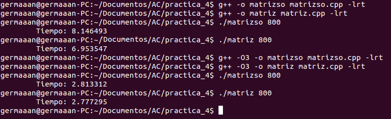
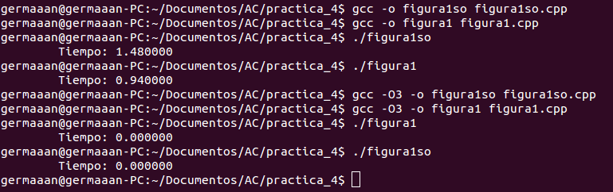
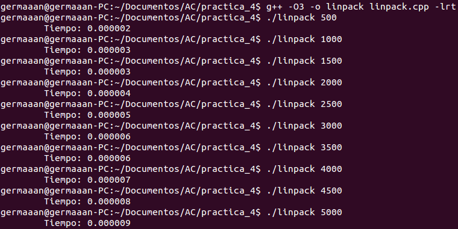

Arquitectura de Computadores
============================
2º Grado en Ingeniería Informática 2011/2012
--------------------------------------------


# Bloque Práctico 4. Optimización de código
### Germán Martínez Maldonado

### Práctica o trabajo a desarrollar

#### 1. Para el núcleo que se muestra en la Figura 1, y para un programa que implemente la multiplicación de matrices:

* **a. Modifique el código C para reducir el tiempo de ejecución del mismo. Justifique los resultados obtenidos a partir de la modificación realizada.**

**Multiplicación de matrices sin optimización:**

```
#include <stdio.h>
#include <stdlib.h>
#include <time.h>

int main(int argc, char **argv) {

    if (argc < 2) {
        fprintf(stderr, "\n[ERROR] - Debe introducir introducir dimension. \n");
        exit(-1);
    }

    int i, k, j, N = atoi(argv[1]), A[N][N], B[N][N], C[N][N], valorB = 1, valorC = 2;

    struct timespec cgt1, cgt2;
    double ncgt;

    if ((N <= 0) || (N > 4094)) {
        fprintf(stderr, "\n[ERROR] - El tamaño de filas y columnas tiene que ser un valor entre 1 y 4094. \n");
        exit(-1);
    }

    for (i = 0; i < N; i++)
        for (k = 0; k < N; k++)
            A[i][k] = 0;

    for (i = 0; i < N; i++)
        for (k = 0; k < N; k++)
            B[i][k] = valorB++;

    for (i = 0; i < N; i++)
        for (k = 0; k < N; k++)
            C[i][k] = valorC++;

    clock_gettime(CLOCK_REALTIME, &cgt1);

    printf("INICIO\n");

    for (i = 0; i < N; i++)
        for (j = 0; j < N; j++)
            for (k = 0; k < N; k++)
                A[i][j] += B[i][k] * C[k][j];

    printf("FIN\n");

    clock_gettime(CLOCK_REALTIME, &cgt2);
    ncgt = (double) (cgt2.tv_sec - cgt1.tv_sec) + (double) ((cgt2.tv_nsec - cgt1.tv_nsec) / (1.e+9));

    printf("\tTiempo:\t%8.6f\n", ncgt);

    return 0;
}
```

**Multiplicación de matrices con optimización:**

```
#include <stdio.h>
#include <stdlib.h>
#include <time.h>

int main(int argc, char **argv) {

    if (argc < 2) {
        fprintf(stderr, "\n[ERROR] - Debe introducir introducir dimension. \n");
        exit(-1);
    }

    int i, k, j, N = atoi(argv[1]), A[N][N], B[N][N], C[N][N], valorB = 1, valorC = 2;

    struct timespec cgt1, cgt2;
    double ncgt;

    if ((N < 4) || (N > 4094)) {
        fprintf(stderr, "\n[ERROR] - El tamaño de filas y columnas tiene que ser un valor entre 4 y 4094. \n");
        exit(-1);
    }

    for (i = 0; i < N; i++) {
        for (k = 0; k < N; k += 4) {
            A[i][k] = 0;
            A[i][k + 1] = 0;
            A[i][k + 2] = 0;
            A[i][k + 3] = 0;
        }
    }

    for (i = 0; i < N; i++) {
        for (k = 0; k < N; k += 4) {
            B[i][k] = valorB++;
            B[i][k + 1] = valorB++;
            B[i][k + 2] = valorB++;
            B[i][k + 3] = valorB++;
        }
    }

    for (i = 0; i < N; i++) {
        for (k = 0; k < N; k += 4) {
            C[i][k] = valorC++;
            C[i][k + 1] = valorC++;
            C[i][k + 2] = valorC++;
            C[i][k + 3] = valorC++;
        }
    }

    clock_gettime(CLOCK_REALTIME, &cgt1);

    printf("INICIO\n");

    for (i = 0; i < N; i++) {
        for (j = 0; j < N; j++) {
            for (k = 0; k < N; k += 4) {
                A[i][j] += B[i][k] * C[k][j];
                A[i][j] += B[i][k + 1] * C[k + 1][j];
                A[i][j] += B[i][k + 2] * C[k + 2][j];
                A[i][j] += B[i][k + 3] * C[k + 3][j];
            }
        }
    }

    printf("FIN\n");

    clock_gettime(CLOCK_REALTIME, &cgt2);
    ncgt = (double) (cgt2.tv_sec - cgt1.tv_sec) + (double) ((cgt2.tv_nsec - cgt1.tv_nsec) / (1.e+9));

    printf("\tTiempo:\t%8.6f\n", ncgt);
}
```



Vemos como mejora el tiempo de ejecución del código optimizado (matriz) frente al código sin optimizar (matrizso), simplemente con introducir desenrollado de bucle, que nos permite reducir el número de saltos. La mejora mediante localidad de los accesos siempre la tenemos en cuenta accediendo a las matrices por las filas.

**Código Figura 1 sin optimizar:**

´´´
#include <stdio.h>
#include <stdlib.h>
#include <time.h>

struct s {
    int a;
    int b;
};

main() {
    struct s p[5000];

    clock_t cgt1, cgt2;
    double ncgt;

    int ii, i, X1, X2, R[40000];

    cgt1 = clock();

    printf("INICIO\n");

    for (ii = 1; ii <= 40000; ii++) {

        for (i = 0; i < 5000; i++)
            X1 = 2 * p[i].a + ii;

        for (i = 0; i < 5000; i++)
            X2 = 3 * p[i].b - ii;

        if (X1 < X2)
            R[ii] = X1;
        else
            R[ii] = X2;
    }

    printf("FIN\n");

    cgt2 = clock();
    ncgt = (double) (cgt2 - cgt1) / CLOCKS_PER_SEC;

    printf("\tTiempo:\t%8.6f\n", ncgt);
}
´´´

**Código Figura 1 con optimización:**

```
#include <stdio.h>
#include <stdlib.h>
#include <time.h>

struct s {
    int a;
    int b;
    long int pad;
};

main() {
    struct s *p, *new_p;


    clock_t cgt1, cgt2;
    double ncgt;

    int ii, i, X1, X2, R[40000];

    p = (struct s*) malloc(sizeof (struct s) * 5000);
    new_p = (struct s*) (((long int) p + 63) & (-64));

    cgt1 = clock();

    printf("INICIO\n");

    for (ii = 1; ii <= 40000; ii++) {

        for (i = 0; i < 5000; i += 4) {
            X1 = 2 * p[i].a + ii;
            X1 = 2 * p[i + 1].a + ii;
            X1 = 2 * p[i + 2].a + ii;
            X1 = 2 * p[i + 3].a + ii;
            X2 = 3 * p[i].b - ii;
            X2 = 3 * p[i + 1].b - ii;
            X2 = 3 * p[i + 2].b - ii;
            X2 = 3 * p[i + 3].b - ii;
        }

        if (X1 < X2)
            R[ii] = X1;
        else
            R[ii] = X2;
    }

    printf("FIN\n");

    cgt2 = clock();
    ncgt = (double) (cgt2 - cgt1) / CLOCKS_PER_SEC;

    printf("\tTiempo:\t%8.6f\n", ncgt);
}
```



Vemos como mejora el tiempo de ejecución del código optimizado (figura1) frente al código sin optimizar (figura1so), al introducir desenrollado de bucle, que nos permite reducir el número de saltos y, alineamiento de datos, para que la estructura ocupe el mínimo número de líneas de cache completas y empiecen en una línea de cache, disminuyendo así los tiempos de acceso a los elementos. La mejora mediante localidad de los accesos siempre la tenemos en cuenta accediendo a las matrices por las filas.

* **b. Genere los programas en ensamblador para los programas modificados obtenidos en el punto anterior considerando las distintas opciones de optimización del compilador (-O1, -O2, ...) y explique los resultados obtenidos a partir de las características de dichos códigos.**

* **Multiplicación de matrices:**

**Optimización O1**

```
...
.LC2:
	.string	"INICIO"
.LC3:
	.string	"FIN"
...
	movl	$.LC2, %edi
	call	puts
	testl	%r14d, %r14d
	jle	.L11
	salq	$2, %r15
	movq	%r15, -120(%rbp)
	movl	$0, -108(%rbp)
	jmp	.L12
.L13:
	leal	1(%rax), %r9d
	leal	2(%rax), %r8d
	movslq	%eax, %rsi
	leaq	(%rsi,%rcx), %r10
	imulq	%r13, %rsi
	addq	%rdx, %rsi
	movl	(%r12,%r10,4), %r10d
	imull	(%rbx,%rsi,4), %r10d
	addl	%r10d, %edi
	movslq	%r9d, %r9
	leaq	(%r9,%rcx), %rsi
	imulq	%r13, %r9
	addq	%rdx, %r9
	movl	(%r12,%rsi,4), %esi
	imull	(%rbx,%r9,4), %esi
	addl	%esi, %edi
	movslq	%r8d, %r8
	leaq	(%r8,%rcx), %rsi
	imulq	%r13, %r8
	addq	%rdx, %r8
	movl	(%r12,%rsi,4), %esi
	imull	(%rbx,%r8,4), %esi
	addl	%esi, %edi
	leal	3(%rax), %r8d
	movslq	%r8d, %r8
	leaq	(%r8,%rcx), %rsi
	imulq	%r13, %r8
	addq	%rdx, %r8
	movl	(%r12,%rsi,4), %esi
	imull	(%rbx,%r8,4), %esi
	addl	%esi, %edi
	addl	$4, %eax
	cmpl	%r14d, %eax
	jl	.L13
	movl	%edi, (%r15,%r11,4)
	addq	$1, %r11
	cmpl	%r11d, %r14d
	jle	.L14
.L15:
	movq	-104(%rbp), %r15
	movl	(%r15,%r11,4), %edi
	movl	$0, %eax
	movslq	%r11d, %rdx
	jmp	.L13
.L14:
	addl	$1, -108(%rbp)
	movq	-120(%rbp), %rax
	addq	%rax, -104(%rbp)
	cmpl	%r14d, -108(%rbp)
	jge	.L11
.L12:
	movl	$0, %r11d
	movslq	-108(%rbp), %rcx
	imulq	%r13, %rcx
	jmp	.L15
.L11:
	movl	$.LC3, %edi
...
```

**Optimización O2**

```
...
.LC2:
	.string	"INICIO"
.LC3:
	.string	"FIN"
...
	movl	$.LC2, %edi
.LEHB0:
	call	puts
	leaq	0(,%r12,4), %rdx
	xorl	%r11d, %r11d
	movq	%rdx, -104(%rbp)
.L10:
	movslq	%r11d, %rax
	xorl	%r9d, %r9d
	imulq	%r12, %rax
	leaq	(%r14,%rax,4), %r10
	.p2align 4,,10
	.p2align 3
.L14:
	movl	(%r15,%r9,4), %esi
	movq	%r10, %rdx
	xorl	%eax, %eax
	movslq	%r9d, %rcx
	.p2align 4,,10
	.p2align 3
.L11:
	movslq	%eax, %rdi
	movl	(%rdx), %r8d
	imulq	%r12, %rdi
	addq	%rcx, %rdi
	imull	(%rbx,%rdi,4), %r8d
	leal	1(%rax), %edi
	movslq	%edi, %rdi
	imulq	%r12, %rdi
	addl	%r8d, %esi
	movl	4(%rdx), %r8d
	addq	%rcx, %rdi
	imull	(%rbx,%rdi,4), %r8d
	movl	8(%rdx), %edi
	addl	%esi, %r8d
	leal	2(%rax), %esi
	movslq	%esi, %rsi
	imulq	%r12, %rsi
	addq	%rcx, %rsi
	imull	(%rbx,%rsi,4), %edi
	movl	12(%rdx), %esi
	addq	$16, %rdx
	addl	%r8d, %edi
	leal	3(%rax), %r8d
	addl	$4, %eax
	movslq	%r8d, %r8
	imulq	%r12, %r8
	addq	%rcx, %r8
	imull	(%rbx,%r8,4), %esi
	addl	%edi, %esi
	cmpl	%r13d, %eax
	jl	.L11
	movl	%esi, (%r15,%r9,4)
	addq	$1, %r9
	cmpl	%r9d, %r13d
	jg	.L14
	addl	$1, %r11d
	addq	-104(%rbp), %r15
	cmpl	%r13d, %r11d
	jl	.L10
	movl	$.LC3, %edi
...
```

**Optimización O3**

```
...
.LC2:
	.string	"INICIO"
.LC3:
	.string	"FIN"
...
	movl	$.LC2, %edi
.LEHB0:
	call	puts
	xorl	%r11d, %r11d
.L13:
	movslq	%r11d, %rax
	xorl	%r9d, %r9d
	imulq	%r12, %rax
	leaq	(%r15,%rax,4), %r10
	.p2align 4,,10
	.p2align 3
.L17:
	movl	(%r14,%r9,4), %esi
	movq	%r10, %rdx
	xorl	%eax, %eax
	movslq	%r9d, %rcx
	.p2align 4,,10
	.p2align 3
.L14:
	movslq	%eax, %rdi
	movl	(%rdx), %r8d
	imulq	%r12, %rdi
	addq	%rcx, %rdi
	imull	(%rbx,%rdi,4), %r8d
	leal	1(%rax), %edi
	movslq	%edi, %rdi
	imulq	%r12, %rdi
	addl	%r8d, %esi
	movl	4(%rdx), %r8d
	addq	%rcx, %rdi
	imull	(%rbx,%rdi,4), %r8d
	movl	8(%rdx), %edi
	addl	%esi, %r8d
	leal	2(%rax), %esi
	movslq	%esi, %rsi
	imulq	%r12, %rsi
	addq	%rcx, %rsi
	imull	(%rbx,%rsi,4), %edi
	movl	12(%rdx), %esi
	addq	$16, %rdx
	addl	%r8d, %edi
	leal	3(%rax), %r8d
	addl	$4, %eax
	movslq	%r8d, %r8
	imulq	%r12, %r8
	addq	%rcx, %r8
	imull	(%rbx,%r8,4), %esi
	addl	%edi, %esi
	cmpl	%r13d, %eax
	jl	.L14
	movl	%esi, (%r14,%r9,4)
	addq	$1, %r9
	cmpl	%r9d, %r13d
	jg	.L17
	addl	$1, %r11d
	addq	-104(%rbp), %r14
	cmpl	%r13d, %r11d
	jl	.L13
	movl	$.LC3, %edi
```

Como vemos, no disminuyen en gran cantidad el número de instrucciones, pero si habíamos visto que había una gran diferencia entre los tiempos de ejecutar sin optimización y optimización O3, esto se debe a que las optimizaciones O2 y O3 usan la instrucciones “.p2align” que alinea la siguiente etiqueta/instrucción según el número de bits indicamos en el primer parámetro.

* **Figura 1:**

**Optimización O1**

```
...
.LFB43:
	.cfi_startproc
	pushq	%rbx
	.cfi_def_cfa_offset 16
	.cfi_offset 3, -16
	movl	$80000, %edi
	call	malloc
	call	clock
	movq	%rax, %rbx
	movl	$.LC0, %edi
	call	puts
	movl	$40000, %edx
	jmp	.L2
.L3:
	subl	$1, %eax
	jne	.L3
	subl	$1, %edx
	je	.L4
.L2:
	movl	$1250, %eax
	jmp	.L3
.L4:
	movl	$.LC1, %edi
	call	puts
	call	clock
	subq	%rbx, %rax
	cvtsi2sdq	%rax, %xmm0
	divsd	.LC2(%rip), %xmm0
	movl	$.LC3, %esi
	movl	$1, %edi
	movl	$1, %eax
	call	__printf_chk
	movl	$0, %eax
	popq	%rbx
	.cfi_def_cfa_offset 8
	ret
	.cfi_endproc
...
```

**Optimización O2**

```
...
.LFB43:
	.cfi_startproc
	pushq	%rbx
	.cfi_def_cfa_offset 16
	.cfi_offset 3, -16
	movl	$80000, %edi
	call	malloc
	call	clock
	movl	$.LC0, %edi
	movq	%rax, %rbx
	call	puts
	movl	$.LC1, %edi
	call	puts
	call	clock
	subq	%rbx, %rax
	movl	$.LC3, %esi
	movl	$1, %edi
	cvtsi2sdq	%rax, %xmm0
	movl	$1, %eax
	divsd	.LC2(%rip), %xmm0
	call	__printf_chk
	xorl	%eax, %eax
	popq	%rbx
	.cfi_def_cfa_offset 8
	ret
	.cfi_endproc
...
```

**Optimización O3**

```
...
	.cfi_startproc
	pushq	%rbx
	.cfi_def_cfa_offset 16
	.cfi_offset 3, -16
	movl	$80000, %edi
	call	malloc
	call	clock
	movl	$.LC0, %edi
	movq	%rax, %rbx
	call	puts
	movl	$.LC1, %edi
	call	puts
	call	clock
	subq	%rbx, %rax
	movl	$.LC3, %esi
	movl	$1, %edi
	cvtsi2sdq	%rax, %xmm0
	movl	$1, %eax
	divsd	.LC2(%rip), %xmm0
	call	__printf_chk
	xorl	%eax, %eax
	popq	%rbx
	.cfi_def_cfa_offset 8
	ret
	.cfi_endproc
...
```

En este caso, vemos que se reduce también el número de instrucciones, pero que obtenemos el mismo número de instrucciones tanto al optimizar con O2 como al optimizar con O3. La diferencia que vemos es que O1 se realizan más saltos, mientras que O2 y O3, realizan en su lugar constantes movimientos de los valores de registros, siendo esto último más rápido.

* **c. (Ejercicio EXTRA) Intente mejorar los resultados obtenidos transformando el código ensamblador del programa para el que se han conseguido las mejores prestaciones de tiempo**

En el programa de multiplicación de matrices, para O3, podríamos obtener un rendimiento mayor, si optimizamos los saltos, todas las instrucciones que son un salto conticional “jX” precedido de una instrucción de comparación “cmpl”, que como objetivo es que el salto sea a una instrucción que mueve valores de registro, podríamos sustituir el salto por la instrucción “setXX” que nos permitiría asignar los valores de forma más eficiente.

Para el programa de la figura 1, como la optimización O3, ya elimina los saltos no podremos usar la misma solución que en el caso anterior, pero podríamos usar instrucciones de prefetch, para cargar zonas de memoria en cache antes de que se soliciten y así evitaríamos atascos por acceso a memoria.


#### 2. El benchmark Linpack ha sido uno de los programas más ampliamente utilizados para evaluar las prestaciones de los computadores. De hecho, se utiliza como base en la lista de los 500 computadores más rápidos del mundo (el Top500 Report). El núcleo de este programa es una rutina denominada DAXPY (Double precision- real Alpha X Plus Y) que multiplica un vector por una constante y los suma a otro vector:

#### for (i=1;i<=N,i++) y[i]= a*x[i] + y[i];

```
#include <stdio.h>
#include <stdlib.h>
#include <time.h>

int main(int argc, char **argv) {

    if (argc < 2) {
        fprintf(stderr, "\n[ERROR] - Debe introducir introducir dimension. \n");
        exit(-1);
    }

    int a = 5, N = atoi(argv[1]), x[N], y[N], i;

    struct timespec cgt1, cgt2;
    double ncgt;

    if (N <= 0) {
        fprintf(stderr, "\n[ERROR] - El tamaño tiene que ser un valor mayor que 0. \n");
        exit(-1);
    }

    for (i = 0; i < N; i++) {
        x[i] = i;
        y[i] = i * 3;
    }

    clock_gettime(CLOCK_REALTIME, &cgt1);

    printf("INICIO\n");

    for (i = 0; i < N; i++)
        y[i] = a * x[i] + y[i];

    printf("FIN\n");

    clock_gettime(CLOCK_REALTIME, &cgt2);
    ncgt = (double) (cgt2.tv_sec - cgt1.tv_sec) + (double) ((cgt2.tv_nsec - cgt1.tv_nsec) / (1.e+9));

    printf("\tTiempo:\t%8.6f\n", ncgt);

    return 0;
}
```

* **a. Genere los programas en ensamblador para cada una de las opciones de optimización del compilador (-O1, -O2,..) y explique las diferencias que se observan en el código justificando las mejoras en velocidad que acarrean.**

**Optimización O1**

```
...
.LC2:
	.string	"INICIO"
.LC3:
	.string	"FIN"
...
	movl	$.LC2, %edi
	call	puts
	movl	$0, %eax
.L4:
	movl	(%r12,%rax,4), %edx
	leal	(%rdx,%rdx,4), %edx
	addl	%edx, (%rbx,%rax,4)
	addq	$1, %rax
	cmpl	%eax, %r13d
	jg	.L4
	movl	$.LC3, %edi
...
```

**Optimización O2**

```
...
.LC2:
	.string	"INICIO"
.LC3:
	.string	"FIN"
...
	movl	$.LC2, %edi
.LEHB0:
	call	puts
	xorl	%eax, %eax
	.p2align 4,,10
	.p2align 3
.L4:
	movl	(%r12,%rax,4), %edx
	leal	(%rdx,%rdx,4), %edx
	addl	%edx, (%rbx,%rax,4)
	addq	$1, %rax
	cmpl	%eax, %r13d
	jg	.L4
	movl	$.LC3, %edi
...
```

**Optimización O3**
```
...
.LC2:
	.string	"INICIO"
.LC3:
	.string	"FIN"
...
	movl	$.LC4, %edi
.LEHB0:
	call	puts
	xorl	%ecx, %ecx
	testl	%ecx, %ecx
	movl	%ecx, %esi
	je	.L22
	xorl	%eax, %eax
	.p2align 4,,10
	.p2align 3
.L12:
	movl	(%rbx,%rax,4), %edx
	leal	(%rdx,%rdx,4), %edx
	addl	%edx, (%r12,%rax,4)
	leal	1(%rax), %edx
	addq	$1, %rax
	cmpl	%eax, %ecx
	ja	.L12
	cmpl	%r14d, %ecx
	je	.L13
.L11:
	subl	%ecx, %r14d
	movl	%r14d, %edi
	shrl	$2, %edi
	leal	0(,%rdi,4), %r9d
	testl	%r9d, %r9d
	je	.L24
	salq	$2, %rsi
	movdqa	.LC5(%rip), %xmm2
	leaq	(%rbx,%rsi), %r8
	xorl	%eax, %eax
	addq	%r12, %rsi
	xorl	%ecx, %ecx
	.p2align 4,,10
	.p2align 3
.L15:
	movdqu	(%r8,%rax), %xmm1
	addl	$1, %ecx
	movdqa	%xmm2, %xmm3
	movdqa	%xmm1, %xmm0
	psrldq	$4, %xmm1
	psrldq	$4, %xmm3
	pmuludq	%xmm3, %xmm1
	pshufd	$8, %xmm1, %xmm1
	pmuludq	%xmm2, %xmm0
	pshufd	$8, %xmm0, %xmm0
	punpckldq	%xmm1, %xmm0
	paddd	(%rsi,%rax), %xmm0
	movdqa	%xmm0, (%rsi,%rax)
	addq	$16, %rax
	cmpl	%edi, %ecx
	jb	.L15
	addl	%r9d, %edx
	cmpl	%r9d, %r14d
	je	.L13
	.p2align 4,,10
	.p2align 3
.L24:
	movslq	%edx, %rax
	addl	$1, %edx
	movl	(%rbx,%rax,4), %ecx
	leal	(%rcx,%rcx,4), %ecx
	addl	%ecx, (%r12,%rax,4)
	cmpl	%edx, %r13d
	jg	.L24
.L13:
	movl	$.LC6, %edi
...
```

A diferencia de lo que pasaba en los casos del ejercicio anterior, ahora la optimización O3 genera un número de instrucciones bastante mayor, pero es porque usa instrucciones con mayor complejidad para obtener un rendimiento mayor, como es el caso de usar instrucciones como “pmuludq” que es una instrucción del conjunto SSE2 y trabajos instrucciones MMX con una extensión de hasta 128 bits.

* **b. (Ejercicio EXTRA) Para la mejor de las opciones, obtenga los tiempos de ejecución con distintos valores de N y determine para su sistema los valores de Rmax (valor máximo del número de operaciones en coma flotante por unidad de tiempo), Nmax (valor de N para el que se consigue Rmax), y N1/2 (valor de N para el que se obtiene Rmax/2). Estime el valor de la velocidad pico (Rpico) del procesador y compárela con el valor obtenido para Rmax.**



Considerando los tiempos de la imagen:

R = Nº instrucciones en coma flotante / TCPU x 10^9 

N = 500:   R = 3 x 10^8 / (2 x 10^-6) x 10^9 = 150000
N = 1000:  R = 3 x 10^8 / (3 x 10^-6) x 10^9 = 100000
N = 1500:  R = 3 x 10^8 / (3 x 10^-6) x 10^9 = 100000
N = 2000:  R = 3 x 10^8 / (4 x 10^-6) x 10^9 = 75000
N = 2500:  R = 3 x 10^8 / (5 x 10^-6) x 10^9 = 60000
N = 3000:  R = 3 x 10^8 / (6 x 10^-6) x 10^9 = 50000
N = 3500:  R = 3 x 10^8 / (6 x 10^-6) x 10^9 = 50000
N = 4000:  R = 3 x 10^8 / (7 x 10^-6) x 10^9 = 42857’14
N = 4500:  R = 3 x 10^8 / (8 x 10^-6) x 10^9 = 37500
N = 5000:  R = 3 x 10^8 / (9 x 10^-6) x 10^9 = 33333’33

Rmax = 150000	Nmax = 500	N1/2 = 2000

La velocidad pico del procesador es 2000 MHz, que como vemos se corresponde con el valor obtenido para N1/2, que es muy inferior al valor de Rmax.
