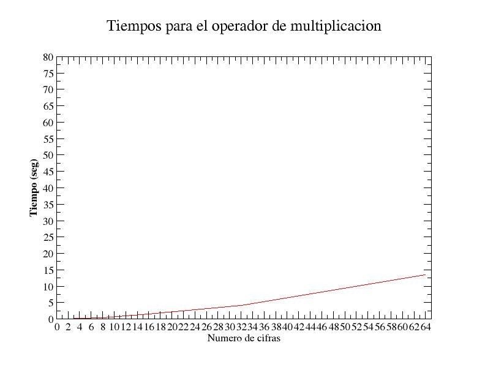
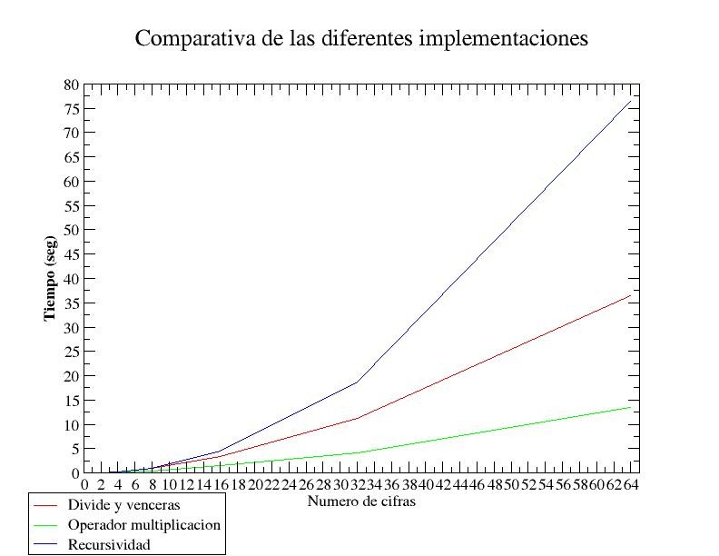
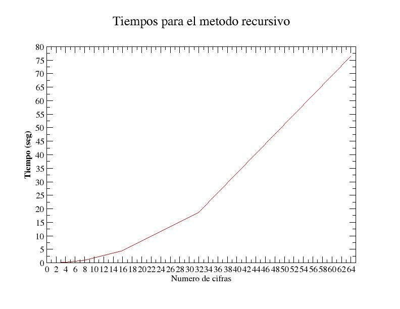
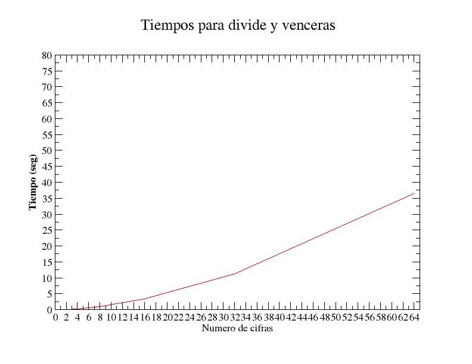

Algorítmica
===========
2º Grado en Ingeniería Informática 2011/2012
--------------------------------------------

# Práctica 2: Divide y vencerás
### Germán Martínez Maldonado

### Estudio sobre eficiencia de algoritmo clásico de multiplicación de enteros largos

#### Cálculo del tiempo teórico

Vamos a realizar el análisis del tiempo teórico del operador * implementado en la clase bigint, dicha clase trabaja sobre un objeto vector de la clase vector de la STL, usando  métodos de dicha clase en esta implementación. El código es el siguiente:

```
 1. bigint bigint::operator*(const bigint &x) const 
 2. {
 3.    if (*this == 0 || x == 0)
 4.        return bigint();

 5.    bigint res;
 6.    unsigned int ceros = 0;
 7.    while (x.digitos[ceros] == 0)
 8.        ceros++;

 9.    res = *this * x.digitos[ceros];

10.    for (unsigned int i = ceros + 1; i < x.digitos.size(); i++) {
11.        if (x.digitos[i] != 0) {
12.            bigint aux = *this * x.digitos[i];
13.            for (unsigned int k = 0; k < i - ceros; k++)
14.                aux.digitos.insert(aux.digitos.begin(), 0);
15.            res = res + aux;
16.        }
17.    }

18.    for (unsigned int j = 0; j < ceros; j++)
19.        res.digitos.insert(res.digitos.begin(), 0);

20.    res.signo = signo * x.signo;

21.    return res;
22. }
```

Según vamos estudiando el código nos vamos encontrando, por ejemplo, en la línea 9 la asignación del resultado de una multiplicación de un bigint y un entero. De la multiplicación bigint por entero, hay que tener en cuenta que en su composición tiene un bucle for que se ejecuta como máximo n veces (siendo n el tamaño del vector que contiene los dígitos del bigint), que en su interior aparte de asignaciones, tiene una llamada al método de push_back de vector, ambas operaciones constantes. Así que la multiplicación bigint-entero tendrá un coste de O(n).

En la línea 10 nos encontramos un bucle for con límite en el tamaño del vector de dígitos, incrementándose de 1 en 1. En su interior, debemos tener en cuenta que hay otro bucle for de incremento secuencial 1 en 1 que realiza una llamada al método insert de vector, así que el valor total del bucle for será O(n2).

El siguiente bucle for hace también una inserción, siendo O(n), y la última operación es una multiplicación entre char que es constante.

Por lo que obtenemos que el tiempo de este algoritmo será O(n2).

#### Cálculo de la eficiencia empírica

Lo primero que tendremos que tener en cuenta para el análisis empírico es las especificaciones de nuestra máquina, siendo en este caso el procesador un Pentium(R) Dual-Core CPU T4200 @ 2.00GHz con una cache de 1024 KB. Y también que el compilador usado ha sido el g++ sin aplicar ninguna optimización al código. Como estas operaciones  son  muy pequeñas, para que nos aparezca un tiempo mayor que 0, hemos tenido que hacer la medición de realizar la operación 10000 veces y luego procesar los tiempos para obtener un valor significativo.

```
tantes = clock();
for (j = 0; j < NUM_VECES; j++)    biMC = bi * bi;
tdespues = clock();
tiempo_transcurrido = ((double)(tdespues-tantes)/(CLOCKS_PER_SEC*(double)NUM_VECES));
```

Como valores de entrada se han usado los siguientes: 

* 11
* 2222
* 33333333
* 4444444444444444
* 55555555555555555555555555555555 
* 6666666666666666666666666666666666666666666666666666666666666666

Teniendo respectivamente 2, 4, 8, 16, 32 y 64 cifras. Obteniendo como tiempos de ejecución:

* **2**: 0.050000
* **4**: 0.160000
* **8**: 0.440000
* **16**: 1.460000
* **32**: 4.150000
* **64**: 13.570000

Como veremos en el gráfico de ejecución el crecimiento de tiempo en proporción al número de dígitos es bastante lineal, para este caso seguramente influirá que hayamos usado un vector de la STL en vez de una tipo de dato primitivo. Como veremos esto puede ser el motivo de que ante una comparación, esta sea la opción más eficiente.






### Estudio sobre eficiencia de algoritmo multiplicación de enteros largos mediante recursividad

#### Cálculo del tiempo teórico

Vamos a realizar el análisis del tiempo teórico del método que hemos implementado para realizar la multiplicación de enteros largos mediante recursividad. El umbral para delimitar la recursividad es dividir hasta que el número tenga 8 cifras. El código sería el siguiente.

```
 1. bigint producto1(const bigint &x, const bigint &y) {
 2.     int n;
 3.     bigint a, b, c, d;

 4.     if (x.size() > y.size())
 5.         n = x.size();
 6.     else
 7.         n = y.size();

 8.     if (n < UMBRAL)
 9.         return x * y;
10.     else {

11.         a = x.digits(x.size() / 2, x.size() - 1);
12.         b = x.digits(0, x.size() / 2 - 1);

13.         c = y.digits(y.size() / 2, y.size() - 1);
14.         d = y.digits(0, y.size() / 2 - 1);

15.         return (producto1(a, c) * elevar10(n)) + ((producto1(a, d) + producto1(b, c)) * elevar10(n / 2)) + producto1(b, d);
16.     }
17. }
```

En la línea 5 y 7, nos encontramos llamadas al método size de vector, cuyo valor es constante. En la línea 8, si nos metemos por la rama if, tenemos un multiplicación de bigint por bigint usando el operador *, que ya hemos comprobado que su eficiencia es O(n2). En las líneas 11, 12, 13 y 14 tenemos la operación de partir los dos bigint por la mitad, estas operaciones tendrán un coste de O(n).

Y por último lo verdaderamente importante es cuando llegamos a las llamadas recursivas. Como se realizan 4 llamadas recursivas, sobre valores que son la mitad de grandes en cada caso obtendremos la función t(n) = 4*t(n/2) + d*n, que será O(n2). El mismo orden de eficiencia que tenía la multiplicación clásica.

#### Cálculo de la eficiencia empírica

Utilizando la misma máquina que para el cálculo empírico de la multiplicación clásica (Pentium(R) Dual-Core CPU T4200 @ 2.00GHz con una cache de 1024 KB) y el mismo compilador (g++ sin opciones de optimización). También hemos tenido que repetir cada operación 10000 veces para obtener resultados significativos y hemos utilizado los mismos valores    para    realizar    los    cálculos:    

* 11
* 2222
* 33333333
* 4444444444444444
* 55555555555555555555555555555555
* 6666666666666666666666666666666666666666666666666666666666666666

Habiendo obtenido en este caso los siguientes tiempos:

* **2**: 0.060000
* **4**: 0.160000
* **8**: 0.980000
* **16**: 4.500000
* **32**: 18.750000
* **64**: 76.490000

Si recordamos, el umbral lo fijamos en 8 cifras, y como vemos, a partir de ese número, el tiempo de ejecución se dispara. Aunque teóricamente la implementación del operador * y nuestro método tienen el mismo orden de eficiencia, en  este caso se  demuestra que empíricamente una  es mucho más eficiente que otra. Nuestra implementación no sólo no mejora, además que empeora enormemente el rendimiento de la operación de multiplicación.




### Estudio sobre eficiencia de algoritmo multiplicación de enteros largos mediante divide y vencerás

#### Cálculo del tiempo teórico

Vamos a realizar el análisis del tiempo teórico del método que hemos implementado para realizar la multiplicación de enteros largos mediante una técnica divide y vencerás. El umbral para delimitar la recursividad es dividir hasta que el número tenga 8 cifras. El código sería el siguiente:

```
 1. bigint producto2(const bigint &x, const bigint &y) {
 2.     int n;
 3.     bigint a, b, c, d, r, p, q;

 4.     if (x.size() > y.size())
 5.         n = x.size();
 6.     else
 7.         n = y.size();

 8.     if (n < UMBRAL)
 9.         return x * y;
10.     else {

11.         a = x.digits(x.size() / 2, x.size() - 1);
12.         b = x.digits(0, x.size() / 2 - 1);

13.         c = y.digits(y.size() / 2, y.size() - 1);
14.         d = y.digits(0, y.size() / 2 - 1);

15.         r = producto2(a + b, c + d);
16.         p = producto2(a, c);
17.         q = producto2(b, d);

18.         return (p * elevar10(n)) + ((r - p - q) * elevar10(n / 2)) + q;
19.     }
20. }
```

Como esta implementación es una variación de la implementación de recursividad, todas las operaciones iniciales tienen el mismo orden de eficiencia, pero ahora no haremos 4 llamadas recursivas, haremos 3, por lo que función de tiempo ahora correspondería a t(n) = 3*t(n/2) + d’*n, lo que nos daría un orden de eficiencia O(n ^ (log2 3)), lo que sería aproximadamente O(n^1.59), mejorando el O(n^2) que obteníamos tanto con el operador * como con el método recursivo.

#### Cálculo de la eficiencia empírica

Seguimos utilizando la misma máquina que para el cálculo empírico de los otros métodos (Pentium(R) Dual-Core CPU T4200 @ 2.00GHz con una cache de 1024 KB) y el mismo compilador (g++ sin opciones de optimización). También hemos tenido que repetir cada operación 10000 veces para obtener resultados significativos y hemos utilizado los mismos valores    para    realizar    los    cálculos:    

* 11
* 2222
* 33333333
* 4444444444444444
* 55555555555555555555555555555555
* 6666666666666666666666666666666666666666666666666666666666666666

Habiendo obtenido en este caso los siguientes tiempos:

* **2**: 0.060000
* **4**: 0.160000
* **8**: 0.890000
* **16**: 3.370000
* **32**: 11.330000
* **64**: 36.370000

Vemos que los tiempos mejoran en gran medida en comparación con el método recursivo, pero siguen empeorando bastante los tiempos obtenidos con el operador * una vez pasado el umbral, incluso teniendo una mayor eficiencia teórica, esto sin duda es dado porque la implementación realizada para el operador * sigue siendo mejor, aunque teóricamente obtengamos lo contrario.



