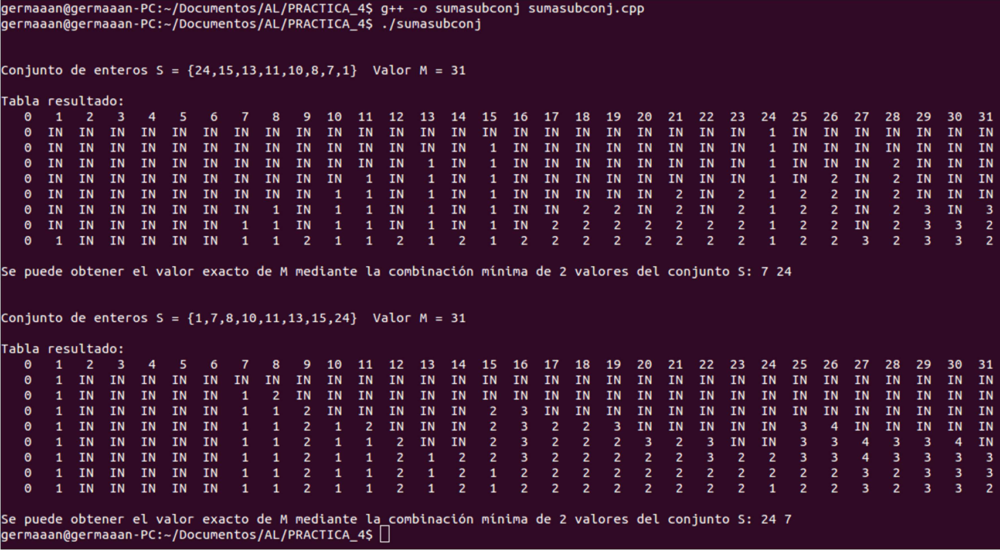
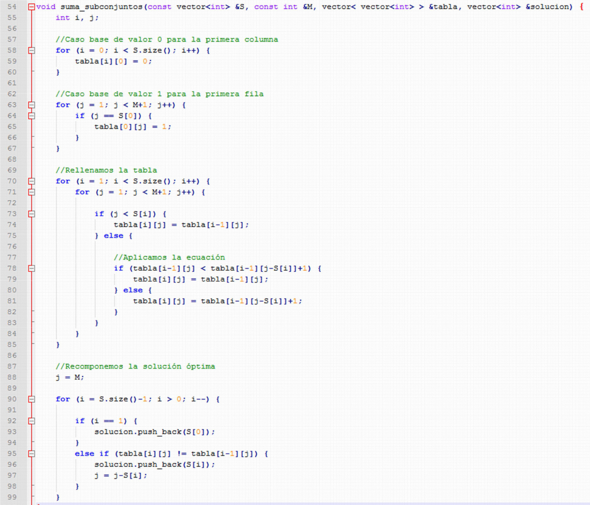
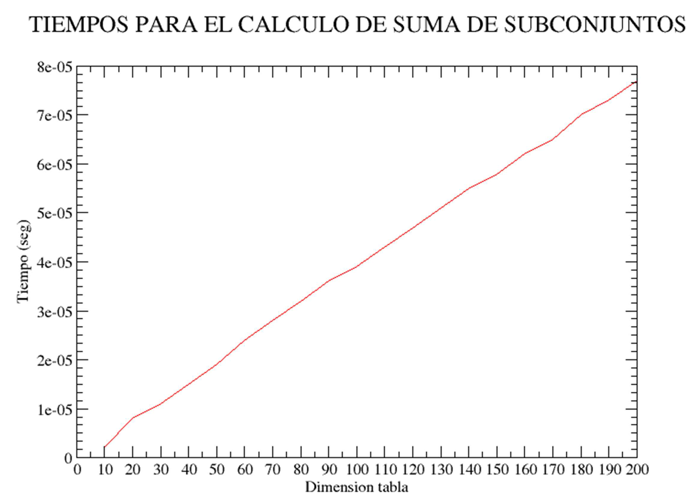

Algorítmica
===========
2º Grado en Ingeniería Informática 2011/2012
--------------------------------------------

# Práctica 4: Programación dinámica
### Germán Martínez Maldonado

### 1. Descripción del problema

Tenemos que realizar la implementación de un algoritmo que dado un conjunto de enteros “S” y un valor “M” devuelve la secuencia de elementos del conjunto “S” cuya suma es exactamente “M” y que tiene el menor número de componentes posible.

Lo primero será obtener los casos base y la ecuación para poder realizar la descomposición recurrente. La ecuación que usaremos para rellenar la tabla será la que se nos indica en el guión:

```
tabla[i][j] = min(tabla[i-1][j], tabla[i-1][j-S[i]] + 1)
```

Esto quiere decir que el valor de cada casilla de la tabla lo obtendremos del menor valor de casilla entre la casilla de la fila anterior en la misma columna y 1 más el valor de la casilla de la fila anterior y número de columna resultante de número de columna actual menos valor del conjunto “S” correspondiente al número de fila actual.

Por lo que los casos base a considerar son que el valor de la casilla es 0 si pertenece a la primero columna, 1 si pertenece a la primera fila, un valor superior a “M” si no hay solución posible y el resultado de aplicar la ecuación en el resto de los casos.


### 2. Implementación
Para resolver el problema planteado se han implementado dos métodos:

* `void suma_subconjuntos(const vector<int> &S, const int &M, vector< vector<int> > &tabla, vector<int> &solucion)`: este método es la implementación del algoritmo que nos permitirá resolver el problema mediante programación dinámica, recibe como parámetros el conjunto de enteros “S”, el valor “M”, un vector<vector<int>> que será donde almacenaremos la tabla de valores obtenida y un vector<int> donde almacenaremos la solución óptima que recompondremos a partir de la tabla de valores.

* `void escribe(const vector<int> &S, const int &M, vector< vector<int> > &tabla, vector<int> &solucion)`: esté método será el que nos permitirá mostrar por pantalla la solución obtenida.

Hay que tener en cuenta que como vamos a usar un tipo de dato de la STL como es vector, aprovecharemos para inicializar directamente en la declaración de las variables que pasaremos a los métodos por referencia desde el método main():

* El vector “S” lo inicializaremos con los valores del conjunto.

* El vector tabla lo inicializaremos con valores mayores que el valor de “M”, esto es porque como todavía no hemos rellenado la tabla, lo inicializamos a valores que se considerarán inválidos, en el código de ejemplo adjuntado esta inicialización se hacía a valores -1, pero como nuestra ecuación busca mínimos, esto debemos cambiarlo a un valor más grande y que sepamos que nunca puede ser obtenido, en este caso, si el valor de “M” es 31, como los valores del conjunto son enteros, nunca podremos obtener 31 como resultado de la suma de 32 elementos.

* El vector “solucion” simplemente lo declaramos, pero no lo inicializamos, ya tomará valor cuando se reconstruya la solución óptima.

#### 2.1 Método “suma_subconjuntos”

Este método será el encargado de rellenar la tabla de valores y recomponer la solución óptima. Lo primero que hará será inicializar los casos base de la primera columna a 0 y de la primera fila a 1, esto es necesario para poder aplicar la ecuación, porque no podremos calcular sobre los valores inválidos de inicialización.

Rellenamos la tabla que será de un tamaño igual al producto del número de elementos n del conjunto por el valor “M+1”, teniendo en cuenta que si el número de columna es menor que el valor del conjunto de valores correspondiente al número de fila, esa casilla tomará el valor de la casilla que se encuentra en la fila anterior (necesario para expandir los resultado inválidos), aplicándose la fórmula en caso contrario para tomar el valor menor correspondiente.

Una vez rellena la tabla, como sabemos que el valor óptimo está al final, partiendo desde la última fila, iremos recorriendo el camino inverso que el que realizamos para rellenar la tabla, para cada casilla, si su casilla es distinta de la de la fila superior, significará que el valor que representa la fila en el conjunto de valores se usó para la solución, por lo que se guarda en la solución, y se le resta al valor del problema. Si se llega al principio de la tabla, como todavía no se tiene la solución óptima, y es el único elemento restante, significará que es también parte de la solución.

#### 2.2 Método “escribir”

Este método será el encargado de interpretar los resultados obtenidos, mostrará la tabla de valores por pantalla, y ya que como hemos dicho, el valor óptimo se encuentra al final de la tabla, haremos que el programa interprete esto como lo haríamos nosotros a simple vista, si la última casilla de la última fila de la última columna, tiene el valor que consideramos inicialmente como inválido, significará que no hay solución posible, en caso contrario, mostrará la solución óptima obtenida.

#### 2.3 Salida del programa

Resultado que obtenemos por pantalla al compilar y ejecutar el archivo “sumasubconj.cpp”:



### 3. Análisis de eficiencia

#### Cálculo del tiempo teórico

Vamos a realizar el análisis del tiempo teórico del método implementado para obtener la suma de subconjuntos, el código numerado se muestra en la siguiente imagen:



Como vemos el método se compone básicamente de bucles for con sentencias simples en su interior (en su mayoría asignaciones con un orden “O(1)” que darían un orden “O(n)”). Si nos fijamos en la línea 70, veremos el único for anidado del método, con sentencias interiores que son asignaciones (“O(1)”), el bucle externo se ejecutará tantas veces como número de elementos del conjunto de valores “S” (llamémoslo “n”), el bucle interno se ejecutará un número de veces mayor en una unidad al valor que hemos puesto como máximo para buscar sus subconjuntos (lo que podemos considerar “m”), como sabemos que ambos valores son constantes, podemos decir que el algoritmo tiene un orden de eficiencia O(n*m).

Visto la eficiencia que obtenemos, podemos comprobar que es mejor realizar una implementación mediante programación dinámica que mediante divide y vencerás, ya que está tendría un orden de eficiencia exponencial.

#### Cálculo de la eficiencia empírica

Vamos a realizar una análisis de eficiencia empírico de nuestro algoritmo, lo ejecutaremos en un procesador Pentium(R) Dual-Core CPU T4200 @ 2.00GHz con una cache de 1024 KB. El compilador usado ha sido el g++ sin aplicar ninguna optimización al código. Habiendo obtenido los siguientes resultados:

| Dimensión tabla | Tiempo (seg) |
|:---------------:|:------------:|
|        10       |   0.000002   |
|        20       |   0.000008   |
|        30       |   0.000011   |
|        40       |   0.000015   |
|        50       |   0.000019   |
|        60       |   0.000024   |
|        70       |   0.000028   |
|        80       |   0.000032   |
|        90       |   0.000036   |
|       100       |   0.000039   |
|       110       |   0.000043   |
|       120       |   0.000047   |
|       130       |   0.000051   |
|       140       |   0.000055   |
|       150       |   0.000058   |
|       160       |   0.000062   |
|       170       |   0.000065   |
|       180       |   0.000070   |
|       190       |   0.000073   |
|       200       |   0.000077   |



Como podemos ver, se comprueba lo que habíamos comentado en el análisis teórico, el algoritmo tiene una eficiencia constante tal y como se ve en el crecimiento de la gráfica.
