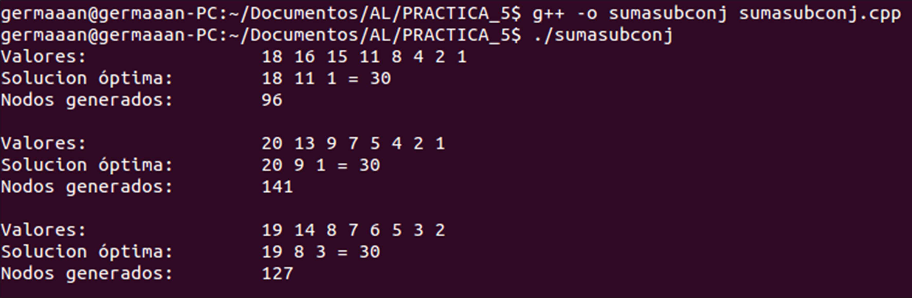
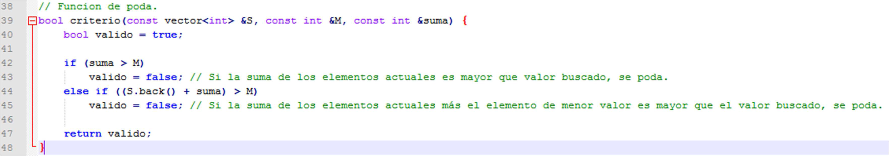
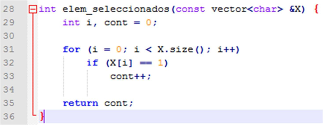
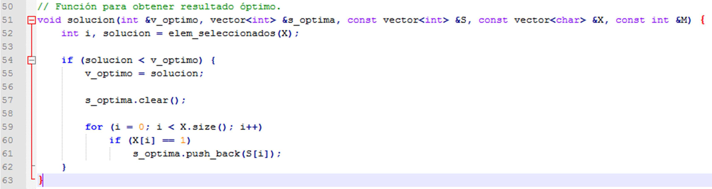
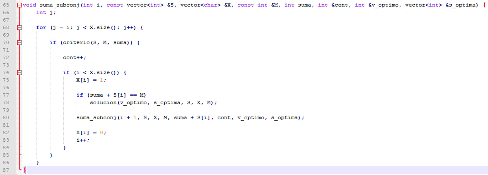
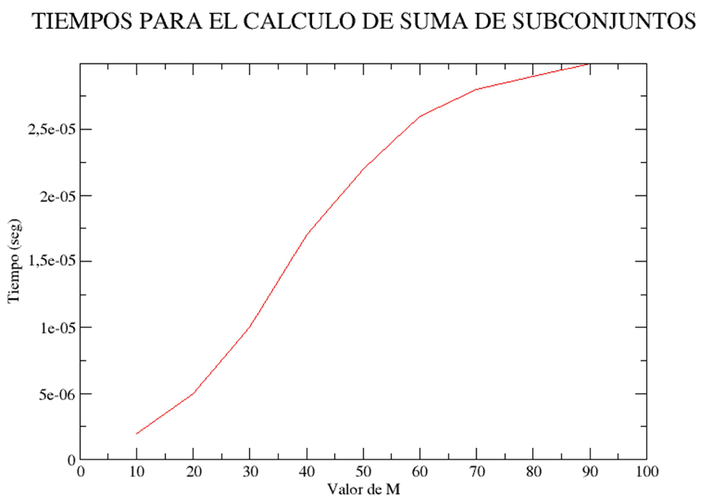
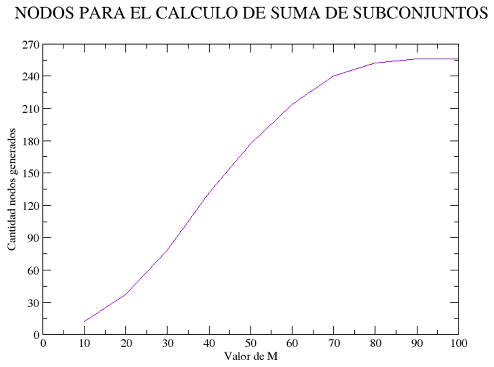

Algorítmica
===========
2º Grado en Ingeniería Informática 2011/2012
--------------------------------------------

# Práctica 4: Programación dinámica
### Germán Martínez Maldonado

### 1. Descripción del problema

Tenemos que realizar la implementación de un algoritmo que dado un conjunto de enteros “S” y un valor “M” devuelva la secuencia de elementos del conjunto “S” cuya suma es exactamente “M” y que tiene el menor número de componentes posible.

Partiendo de la función recursiva de fuerza bruta proporcionada, tenemos que añadir la funcionalidad que permita podar, pasa así no generar todos los estados posibles, sólo los que parezcan prometedores.

Para realizar la poda hemos implementado una función que evaluará si una rama debe ser explorada o no, dicha función se basa en dos condiciones para cumplir su función:

* Si la suma de los elementos actuales es mayor que el valor objetivo, como no es posible obtener solución, se poda.

* Si la suma de los elementos actuales más el elemento de menor valor es mayor que el valor objetivo, como no es posible obtener solución, se poda.

La forma de proceder, es que nos basaremos en una solución en forma de tupla, cada elemento tomará un valor 0 o 1 dependiendo de si el elemento es seleccionado para la solución o no, e iremos probando todas las posibles combinaciones de elementos siempre que los estados generados cumplan los criterios de poda. Cuando encontremos una solución (si es que el caso tiene solución), comprobamos si la solución actual tiene un número de elementos menor a una solución encontrada anteriormente, y si es este el caso, consideramos la nueva solución como la solución óptima temporalmente, mientras que seguimos explorando el grafo en busca de otras combinaciones que nos produzcan nuevas soluciones.

### 2. Implementación

Para resolver el problema se han implementado cuatro métodos:

* `void suma_subconj(int i, const vector<int> &S, vector<char> &X, const int &M, int suma, int &cont, int &v_optimo, vector<int> &s_optima)`: este método es la implementación del algoritmo que nos permitirá resolver el problema mediante backtracking con poda, recibe como parámetros el valor entero “i” que indica el elemento actual que se está probando para encontrar la solución, el conjunto de enteros “S”, el estado X que indica los elementos que cogidos para la solución, el valor “M”, el valor entero “suma” que contiene el valor actual de la suma de los elementos seleccionados, el entero “cont” que contiene el número de nodos generados en la búsqueda, el valor entero “v_optimo” que contiene el número de elementos de la solución óptima actual y, el vector de enteros “s_optima” que representa la solución óptima actual para el problema.

* `bool criterio(const vector<int> &S, const int &M, const int &suma)`: es método será el que utilicemos para implementar la poda, recibe como parámetros el conjunto de enteros “S”, el valor “M” y el valor de la suma de los elementos actuales.

* `void solucion(int &v_optimo, vector<int> &s_optima, const vector<int> &S, const vector<char> &X, const int &M)`: este método será el comprobará cada vez que obtengamos una solución al problema, si es mejor que la ya existente, recibe como parámetros el número de elementos de la solución óptima actual (“v_optimo”), la solución óptima  actual (“s_optima”), la tupla que representa los elementos seleccionados para la solución actual (“X”) y el valor M.

* `int elem_seleccionados(const vector<char> &X)`: este método calcula el número de elementos seleccionados para la solución actual, recibe como argumento la tupla solución X.

* `void  escribe(const  vector<int>  &S,  const  vector<int>  &s_optima,  const  int  &M,  const  int &cont)`: este método será el que nos permitirá mostrar los resultados obtenidos por pantalla, recibe como argumentos el conjunto de elementos “S”, la solución óptima obtenida “s_optima”, el valor “M” y el número de nodos generados (“cont”).

Hay que tener en cuenta que como vamos a usar un tipo de dato de la STL como es vector, aprovecharemos para inicializar directamente en la declaración de las variables que pasaremos a los métodos por referencia desde el método main():

* El vector “S” lo inicializamos con los valores del conjunto generados aleatoriamente.

* Ordenamos la lista en orden descendente antes de pasársela al método implementado, para que así podamos obtener directamente la solución sin problemas (nuestra función criterio así lo requiere, y así evitamos tener que ordenar el conjunto cada vez que quisiéramos evaluar si podamos o no el nodo por el que estamos explorando).

* El vector “X” lo inicializamos con valores “-1”, porque al representar la tupla solución, al estado inicial de esta, todos sus valores deben ser inválidos.

* El valor de número de elementos de la solución óptima, lo inicializamos a un valor mayor en una unidad al número de elementos de S, para así asegurarnos que considere por igual todas las soluciones encontradas.

* Los valores “i” y “suma”, se los pasaremos al método con un valor 0 como valor inicial, porque ambos van a funcionar como contadores.

* El vector “s_optima” simplemente lo declaramos, pero no lo inicializamos, ya  tomará  los valores de la que se vaya considerando la solución óptima en cada situación.

#### 2.1 Método “suma_subconj”

Este método será el encargado de obtener la solución óptima del problema presentado, se basa en el método de cálculo recursivo de fuerza bruta, por lo que el esquema general es muy parecido, consiste en ir probando todas las posibles de valores, para ver con cuales obtendríamos una solución,  las modificaciones más importantes con respecto al método original, son la inclusión de una condición que llama al método de poda (método “criterio”) para decidir si es prometedor seguir explorando a partir del nodo actual en busca de posibles soluciones y, la llamada al método “solucion“ cada vez que se obtenga una solución, para comprobar si esta solución es más óptima que una solución anterior encontrada.

#### 2.2 Método “criterio”

Este método será el encargado de en base a los criterios que definimos en el primer punto, decidir si es recomendable seguir explorando a partir del nodo actual en la búsqueda de soluciones.

#### 2.3 Método “solucion”

Este método será el encargado de comprobar si la solución que se acaba de encontrar, tiene un número de elementos menor que la se considera actualmente como solución óptima, para en caso afirmativo, sustituir a esta como solución óptima.

#### 2.4 Método “elem_seleccionados”

Este método será el encargado de devolver el número de elementos que contiene una solución en función de la tupla solución que reciba como parámetro.

#### 2.5 Método “escribe”

Este método será el encargado mostrar por pantalla los resultados obtenidos: conjunto de valores para los que se buscaba la solución, solución óptima obtenida y número de nodos generados en la búsqueda de la solución.

#### 2.6 Salida del programa

Salida del programa para conjuntos de 8 valores generados aleatoriamente, vemos que la cantidad de nodos generados tiene una gran variación de unos casos a otros, pero siempre se alejan bastante Del peor de los casos (tener que generar todos los nodos, 28 = 256).

### 3. Análisis de eficiencia

#### Cálculo del tiempo teórico

Vamos a realizar el análisis del tiempo teórico del método implementado para obtener la suma de subconjuntos, pero para ello primero debemos conocer el orden de eficiencia de los métodos que son llamados desde el método de nuestro problema.

El método del criterio para podar sólo tiene operaciones simples, todas “O(1)”.

El método para obtener el número de elementos seleccionados en una tupla solución, consideran que realiza la misma operación en función del tamaño de la tupla solución, será de un orden “O(n)”, donde “n” es el tamaño de la tupla solución.

En el método para decidir si la solución obtenida es la óptima, tenemos que observar que:

* Se hace una llamada al método “elem_seleccionados”: “O(n)”, donde “n” es tamaño de “X”.
* Se  hace  una  llamada  al  método  “clear”  de  vector:  “O(m)”,  donde  “m”  es  tamaño  de “s_optima”.
* Un bucle for con llamadas al método “push_back” de vector: “push_back” es “O(1)”, y dentro del bucle for “O(n)”, donde “n” es tamaño de “X”.

Por lo que la eficiencia del método es “O(n)”.

Para el método de sumar los subconjuntos la eficiencia será, en el peor de los casos, O(p(n)2n), donde “p(n)” será la eficiencia de la función de poda y “2n” sale de número de nodos generados en el peor caso. Pero como en el caso promedio esperamos podar una cantidad alta de nodos, si nuestra función de poda funciona lo suficientemente bien, esperamos reducir el orden exponencial.

#### Cálculo de la eficiencia empírica

Vamos a realizar una análisis de eficiencia empírico de nuestro algoritmo, lo ejecutaremos en un procesador Pentium(R) Dual-Core CPU T4200 @ 2.00GHz con una cache de 1024 KB. El compilador usado ha sido el g++ sin aplicar ninguna optimización al código. Habiendo obtenido los siguientes resultados para el conjunto de valores {24, 15, 13, 11, 10, 8, 7, 1}:

|  M  | Tiempo (seg) | Nodos generados | Porcentaje de nodos reducidos |
|:---:|:------------:|:---------------:|:-----------------------------:|
|  10 |   0.000002   |        12       |             95,31             |
|  20 |   0.000005   |        37       |             85,55             |
|  30 |   0.000010   |        78       |             69,53             |
|  40 |   0.000017   |       132       |             48,44             |
|  50 |   0.000022   |       177       |             30,86             |
|  60 |   0.000026   |       214       |             16,41             |
|  70 |   0.000028   |       240       |              6,25             |
|  80 |   0.000029   |       252       |              1,56             |
|  90 |   0.000030   |       256       |              0,00             |
| 100 |   0.000030   |       256       |              0,00             |

Observando la tabla de resultados y las gráficas obtenidas vemos que cuando el valor objetivo M es cercano a los valores del conjunto de valores, la poda es bastante grande, pero según el valor de M va creciendo, tiende a llegarse al peor de los casos, que es generar todos los nodos. De todas maneras con respecto al método por fuerza bruta mejoramos, prácticamente en todos los casos, el número de nodos generados, siendo este bastante menor en la mayoría de los casos cuando se usa poda.
