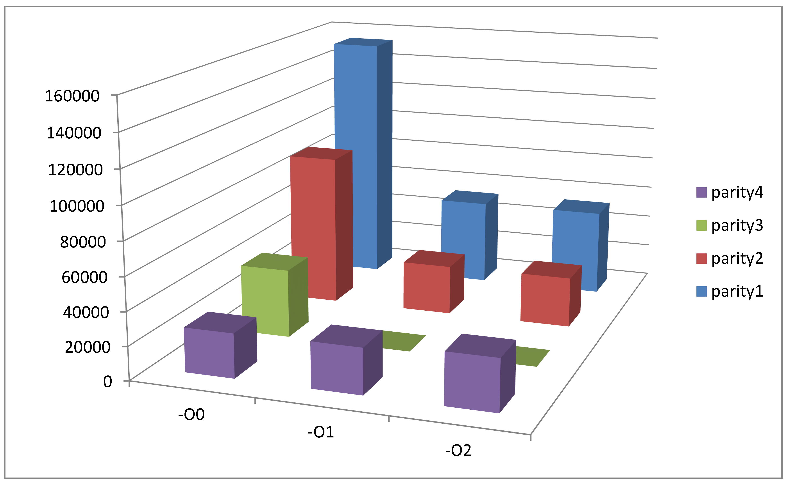
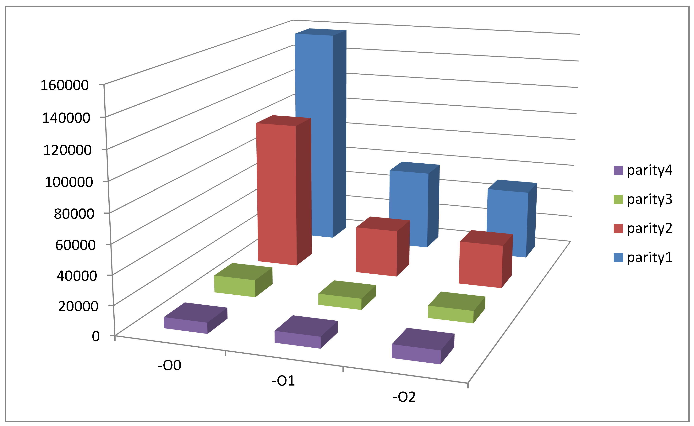
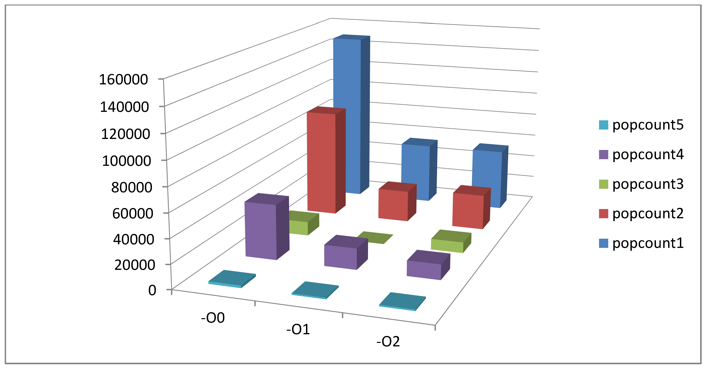
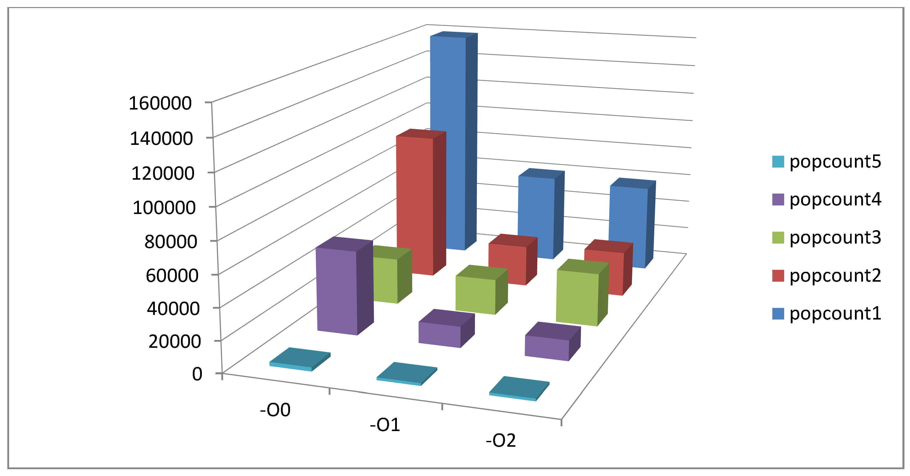
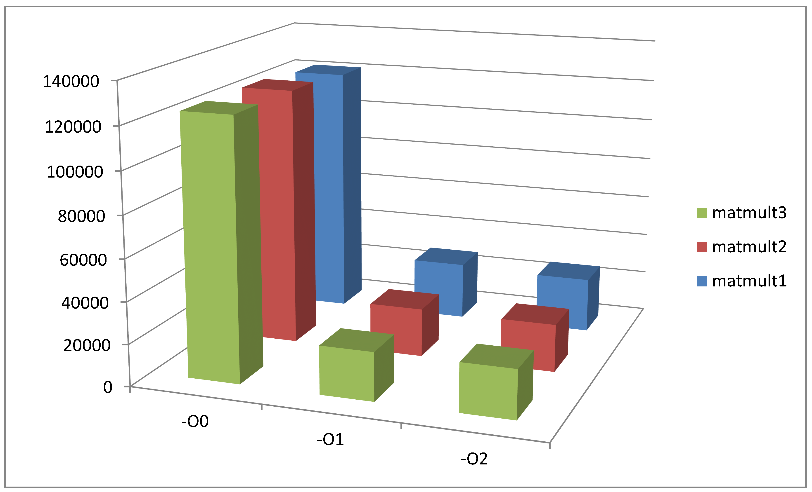
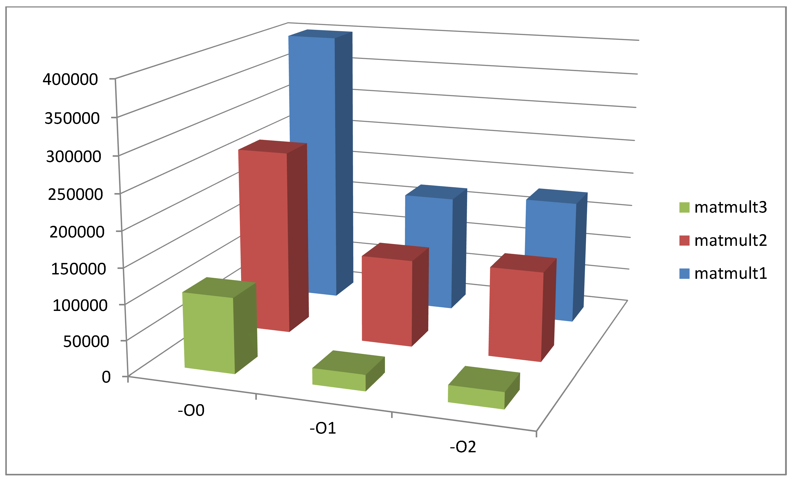
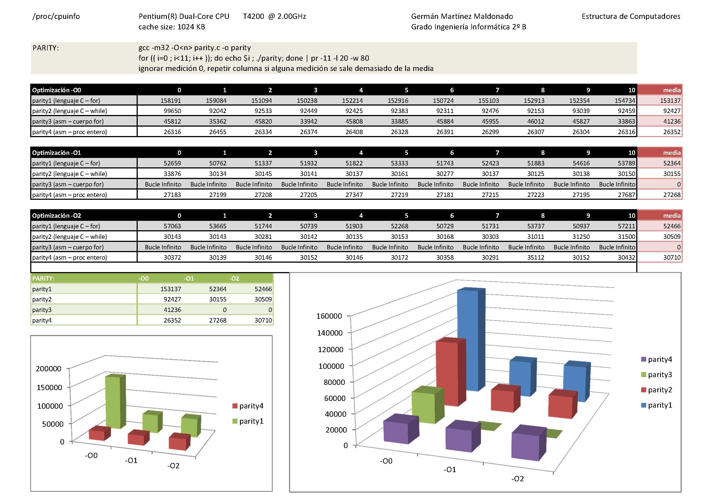
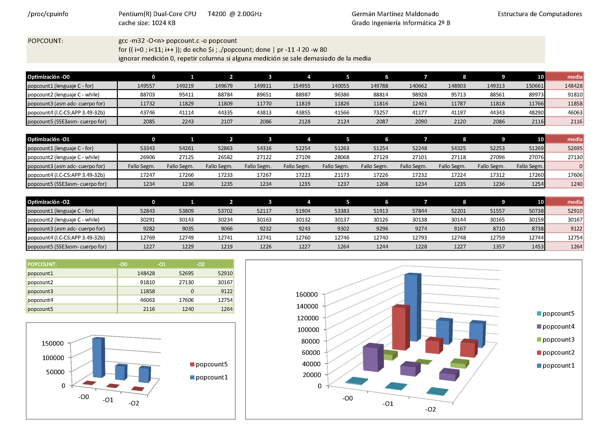
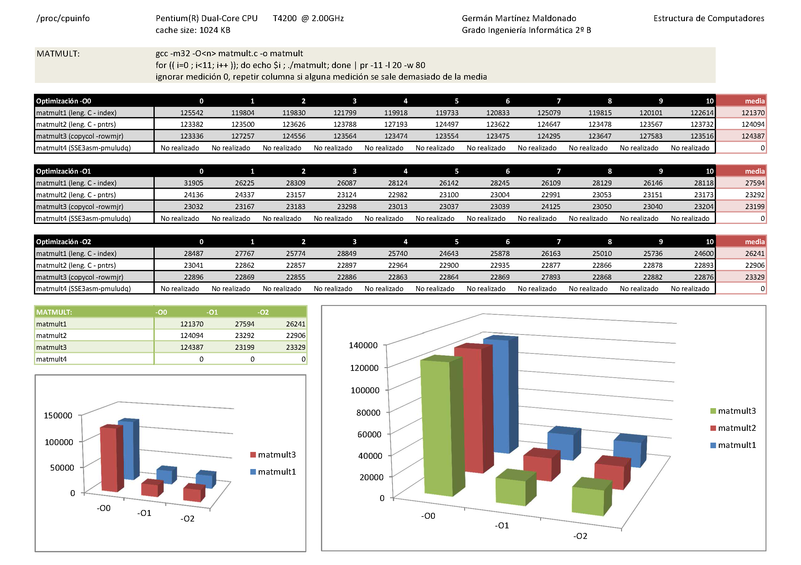

Estructura de Computadores
==========================
2º Grado en Ingeniería Informática 2011/2012
--------------------------------------------


# Práctica 2: Programación mixta C-asm x86 Linux
### Germán Martínez Maldonado

### Resumen de objetivos

Al finalizar esta práctica, se debería ser capaz de: 

* Usar las herramientas gcc, as y ld para compilar código C, ensamblar código ASM, enlazar ambos tipos de código objeto, estudiar el código ensamblador generado por gcc con y sin optimizaciones, localizar el código ASM en‐línea introducido por el programador, y estudiar el correcto interfaz del mismo con el resto del programa C. 
* Reconocer la estructura del código generado por gcc según la convención de llamada cdecl. 
* Reproducir dicha estructura llamando a funciones C desde programa ASM, y recibiendo llamadas desde programa C a subrutinas ASM. 
* Escribir fragmentos sencillos de ensamblador en‐línea. 
* Usar la instrucción CALL (con convención cdecl ) desde programas ASM para hacer llamadas al sistema operativo (kernel Linux, sección 2) y a la librería C (sección 3 del manual). 
* Enumerar los registros y algunas instrucciones de los repertorios MMX/SSE de la línea x86. 
* Usar con efectividad un depurador como gdb/ddd. 
* Argumentar la utilidad de los depuradores para ahorrar tiempo de depuración. 
* Explicar la convención de llamada cdecl para procesadores x86. 
* Recordar y practicar en una plataforma de 32bits las operaciones de cálculo de paridad, cálculo de peso Hamming (population count), suma lateral (de bits o de componentes SIMD enteros) y producto de matrices. 


### COMENTARIOS SOBRE LOS PROGRAMAS

#### Calcular la suma de paridades de una lista de enteros sin signo (parity.c)

La primera versión del programa (parity1, lenguaje C – for) está basada en el ejemplo del bucle for de la página 43 del material de clase “Programación a Nivel-Máquina II: Aritmética & Control”.

La segunda versión del programa (parity2, lenguaje C – while) está basada en el ejemplo del bucle while de la página 41 del material de clase “Programación a Nivel-Máquina II: Aritmética & Control”.

La tercera versión del programa (parity3, asm – cuerpo for) está basada en la realización en C de un método que realice únicamente las acciones contenidas en el bucle while interno del método parity2, obteniendo posteriormente el código ensamblador de ese método mediante la línea de comandos “gcc –m32 –O0 -S parity_bucle.c” (ambos archivos incluidos), para comprender mejor el funcionamiento de instrucciones usadas se ha consultado del material de clase “Programación a Nivel-Máquina II: Aritmética & Control” las páginas 8 (xorl, sarl), 22 (test) y 27 (je, jne). Como anotación mencionar que está versión funciona compilando con optimización –O0, pero produce un bucle infinito con las optimizaciones –O1 y
–O2 que no ha podido ser resuelto, además el resultado mostrado es el valor correcto, pero en negativo.

La cuarta versión del programa (parity4, asm – proc entero) está basada en la realización en C de un método que realice todas las acciones contenidos en el método parity2, obteniendo posteriormente el código ensamblador de ese método mediante la línea de comandos “gcc –m32 –O0 –S parity_completo.c” (ambos archivos incluidos).

Cuando se compila el programa con la orden “gcc -m32 -O2 parity.c -o parity” se obtiene el error:

```
parity.c: Assembler messages:
parity.c:59: Error: symbol `bucle' is already defined
parity.c:66: Error: symbol `fin' is already defined
parity.c:85: Error: symbol `condicion' is already defined
parity.c:89: Error: symbol `while' is already defined
parity.c:95: Error: symbol `for' is already defined
```

Parece ser que al realizar la compilación del código con optimización O2, el compilador interpreta que las etiquetas de salto condicional incluidas tienen nombres repetidos, lo que se puede comprobar que no es así si se observa el código. Este error sólo se produce cuando hacemos que se muestre por pantalla el resultado de la suma de paridades, si simplemente hacemos que se muestre el tiempo cronometrado, no se produce.

#### Calcular la suma de bits de una lista de enteros sin signo (popcount.c)

La primera versión del programa (popcount1, lenguaje C – for) está basada en el ejemplo del bucle for de la página 43 del material de clase “Programación a Nivel-Máquina II: Aritmética & Control”.

La segunda versión del programa (popcount2, lenguaje C – while) está basada en el ejemplo del bucle while de la página 41 del material de clase “Programación a Nivel-Máquina II: Aritmética & Control”.

La tercera versión del programa (popcount3, asm adc – cuerpo for) está basada en la realización en C de un método que realice únicamente las acciones contenidas en el bucle while interno del método popcount2, obteniendo posteriormente el código ensamblador de ese método mediante la línea de comandos “gcc –m32 –O0 -S popcount_bucle.c” (ambos archivos incluidos). Cuando se compila el programa completo con optimización O1, al ejecutar el programa, este método provoca un fallo de segmentación por motivo desconocido. Cuando se compila con optimización O2, ocurre el mismo problema de supuesta duplicidad con las etiquetas que ocurría en parity.c, teniendo la misma “solución” (no produce error de compilación cuando lo único que se muestra es el tiempo de cronometrado). El valor resultado obtenido de este método no es el correcto, pero difiriendo de este en un solo dígito, se ha mantenido para realizar la comparación del rendimiento.

La cuarte versión del programa (popcount4, l.C-CS: APP 3.49-32b) está basada en el ejercicio resuelto 3.49 de la página 330 del libro “Computer Systems - A Programmer’s Perspective. Bryant, O’Hallaron. Pearson, 2nd Edition (2010)”, realizando las modificaciones necesarias para convertir el código de 64 bits a 32. El resultado obtenido no es el correcto, pero se ha mantenido para realizar la comparación del rendimiento.

La quinta versión del programa (popcount5, SSE3asm- cuerpo for) está basada en el código SSE3 para fast popcount obtenido de la dirección de internet “[http://0x80.pl/snippets/asm/ssse3_popcount.c](http://0x80.pl/snippets/asm/ssse3_popcount.c)”, más concretamente en el método “uint32_t ssse3_popcount3(uint8_t* buffer, int chunks16)”. El resultado obtenido no es el correcto, pero se ha mantenido para realizar la comparación del rendimiento.

#### Calcular el producto de matrices cuadradas de números enteros (matmult.c)

La primera versión del programa (matmult1, leng. C- index) ha sido realizado sin consultar ninguna referencia bibliográfica, ya que al ser un sencillo ejercicio, esto no ha sido necesario.

La segunda versión del programa (matmult2, leng. C – pntrs) ha sido realizada basándose en la versión anterior (matmult1) y las explicaciones para acceder a los elementos de un array mediante punteros, que se encuentran en las páginas 27 y 34 del material de clase “Programación a Nivel-Máquina IV: Procedimientos x86-64, Datos”.

La tercera versión del programa (matmult3, copycol – rowmjr) ha sido realizada basándose en el ejemplo sobre mejora de rendimiento de acceso mediante copia de columnas de la página 35 del material de clase “Programación a Nivel-Máquina IV: Procedimientos x86- 64, Datos”.


### COMPARACIONES SOBRE LOS RENDIMIENTOS

Aunque los valores reflejados en el primer gráfico (programas realizados por mí) aparentemente difieren bastante en los métodos parity3 y parity4 de los valores del segundo gráfico (gráfico de referencia que se encuentra en SWAD), se puede ver en ambos casos que hay un gran diferencia de rendimiento de parity1 con parity2, y de este con parity3, parity3 y parity4 son más equiparables, demostrando lo que ya sabíamos que una implementación directa o parcialmente en ensamblador, es más rápida que una hecha de forma simple en C. (Nota: los tiempos de parity3 en O1 y O2 no han podido ser medidos al provocarse un bucle infinito, por eso se reflejan en el gráfico con valor 0).





En los siguientes gráficos, a excepción de los valores de popcount3 (método en el que los valores cambian más de un gráfico a otro, además que en la versión implementada por mí, al compilar con optimización O1, la ejecución producía un fallo de segmentación, hecho que no se producía con las otras optimizaciones). Podemos comprobar que aunque pensando bien un programa en C su rendimiento baja considerablemente, sigue sin mejorar el rendimiento de un programa realizado en ensamblador, aunque no sea completamente, siendo la diferencia todavía mucho más significativa si se compara la primera versión C (con 2 bucles for) con la quinta versión (SSE3).





En estos últimos gráficos, aunque en la implementación realizada por mí no sea posible apreciarlo, podemos ver la gran diferencia que hay entre acceder directamente mediante índices (matmult1), acceder mediante punteros (matmult2) y copiar columnas completas para mejorar rendimiento (matmult3), siendo está ultima la mejor con amplia diferencia.






### Gráficas "parity.c"




### Gráficas "popcount.c"




### Gráficas "matmult.c"


