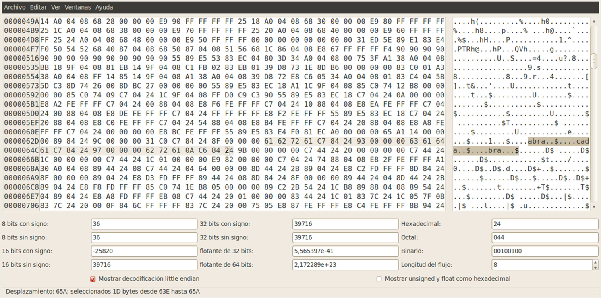

Estructura de Computadores
==========================
2º Grado en Ingeniería Informática 2011/2012
--------------------------------------------


# Práctica 3: Bomba Digital - desensambladores
### Germán Martínez Maldonado

### Resumen de objetivos

Con esta práctica se pretende profundizar en el uso de depuradores a bajo nivel y habituarse al uso de desensambladores y editores hexadecimal. Al finalizar esta práctica, se debería ser capaz de: 

* Leer e interpretar lo que hace un programa consultando y ejecutando su código binario sin información de depuración. 
* Modificar un programa del que sólo se dispone de su código binario sin información de depuración. 
* Usar desensambladores y editores hexadecimal.


### EXPLICACIÓN SOBRE COMO DESACTIVAR LA BOMBA DIGITAL

#### 1. Inicio

Vamos a comprobar cómo se puede desactivar la bomba digital que he programado sin ser necesario para ello conocer ninguna de las claves ni hacerlo en un tiempo determinado.

Lo primero será abrir la bomba con el depurador gráfico ddd, que se basa en  el depurador de línea de comandos gdb y además incorpora un desensamblador. Para que nos aparezca el desensamblado del método main de nuestra bomba, en línea de comandos ponemos “info line main”, comenzamos la ejecución con “run” y, vamos ejecutando el código paso a paso con “nexti” para no meternos en subrutinas por ahora.

#### 2. Saltarse la comprobación de la primera clave

Lo primero que deberemos conseguir es saltarnos la primera protección, la comprobación de que la contraseña que introduzcamos es correcta. Según vayamos ejecutando el código, llegará un momento en el que se nos pedirá que introduzcamos la contraseña, paremos un momento a observar la instrucción en la que nos encontramos y sus instrucciones siguientes:

```
0x080487d4 <main+68>:     call    0x80484a4 <__printf_chk@plt>
0x080487d9 <main+73>:     mov     0x804a040,%eax
0x080487de <main+78>:     movl    $0x64,0x4(%esp)
0x080487e6 <main+86>:     mov     %esi,(%esp)
0x080487e9 <main+89>:     mov     %eax,0x8(%esp)
0x080487ed <main+93>:     call    0x80484b4 <fgets@plt>
0x080487f2 <main+98>:     mov     %esi,(%esp)
0x080487f5 <main+101>:    call    0x80486c0 <unnamed88>
```

Para nuestra prueba introduciremos cualquier cadena, como por ejemplo, “hola”. Seguimos ejecutando con “nexti”, y llegará el momento en el que la bomba explote. Si observamos las instrucciones de arriba, vemos que después de introducir la cadena de texto (instrucción  <main+93>),  se  hace  un  movimiento  de  valores  de  registro  y  después  en
<main+101> se hace una llamada a <unnamed88>. Ponemos un breakpoint justo antes de esta instrucción y volvemos a ejecutar el programa con “run” , y cuando llegue al breakpoint, hacemos “stepi” para meternos dentro.

Una vez dentro de <unnamed88>, hacemos “nexti” hasta que explote la bomba, nos fijamos en la instrucción que provoca que esto ocurra:

```
0x08048713 <+83>:         call    0x8048630 <unnamed1>
```

Como podemos    ver,    la   bomba   explota   cuando se   ejecuta    la    instrucción
<unnamed88+83>, así que ponemos un breakpoint justo antes de su ejecución, y ejecutamos nuevamente el programa hasta llega a ese punto, una vez que hemos llegado, con “stepi” nos metemos dentro de <unnamed1> para comprobar que instrucciones contiene en su interior, vemos que esta llamada simplemente avisa de que la bomba ha sido activada y finaliza el programa, pero nada más.

```
Dump of assembler code for function unnamed1:
  0x08048630 <+0>:          push    %ebp
  0x08048631 <+1>:          mov     %esp,%ebp
  0x08048633 <+3>:          sub     $0x18,%esp
  0x08048636 <+6>:          movl    $0x80489a4,0x4(%esp)
  0x0804863e <+14>:         movl    $0x1,(%esp)
  0x08048645 <+21>:         call    0x80484a4 <__printf_chk@plt>
  0x0804864a <+26>:         movl    $0x80489d4,0x4(%esp)
  0x08048652 <+34>:         movl    $0x1,(%esp)
  0x08048659 <+41>:         call    0x80484a4 <__printf_chk@plt>
  0x0804865e <+46>:         movl    $0x8048a50,0x4(%esp)
  0x08048666 <+54>:         movl    $0x1,(%esp)
  0x0804866d <+61>:         call    0x80484a4 <__printf_chk@plt>
  0x08048672 <+66>:         movl    $0xffffffff,(%esp)
  0x08048679 <+73>:         call    0x8048524 <exit@plt>
End of assembler dump.
```

Nos fijamos ahora en las instrucciones anteriores a la llamada a <unnamed1>:

```
0x0804870f <+79>:       cmp    %eax,%esi
0x08048711 <+81>:       je     0x8048726 <unnamed88+102>
0x08048713 <+83>:       call   0x8048630 <unnamed1>
```

Vemos que la instrucción que se ejecuta anterior a la llamada de activación de la bomba, es un salto condicional a <unnamed88+102>, por lo que si conseguimos producir ese salto, evitaremos que se active la bomba, dicho salto se producirá si en  la  comparación anterior los valores de los dos registros comparados con iguales. Borramos el breakpoint de la instrucción <unnamed88+83> y ponemos uno en la instrucción <unnamed88+79>, y volvemos a ejecutar el programa hasta este punto.

Comprobamos cual es el valor actual de los registros a comparar:

```
(gdb) print $eax
$1 = 10
(gdb) print $esi
$2 = 5
```

Ya conocemos los valores que se van a comparar, vemos que como no son iguales, esto provocará que no se realice el salto y que, por lo tanto, se active la bomba. Miremos las instrucciones que se ejecutan antes de la comparación:

```
0x080486fc <+60>:       call    0x80484e4 <strlen@plt>
0x08048701 <+65>:       movl    $0x804a030,(%esp)
0x08048708 <+72>:       mov     %eax,%esi
0x0804870a <+74>:       call    0x80484e4 <strlen@plt>
0x0804870f <+79>:       cmp     %eax,%esi
```

Nos resulta interesante ver que se hacen  llamadas a <strlen@plt>, porque si nos fijamos esto nos puede estar indicando que los valores de los registros a comparar, son el tamaño de cadenas de caracteres, recordemos que para nuestro ejemplo introducimos la cadena “hola”. La cadena que introducimos tiene 4 caracteres más el carácter de salto de línea necesario para continuar con la ejecución del programa, dan un total de 5, el valor que se encuentra en el registro $esi, podemos suponer que $esi tendrá como valor la longitud de la cadena que nosotros introducimos y, que $eax tendrá como valor la longitud de la cadena necesaria para desactivar la bomba, por eso se realiza la comprobación, porque si los tamaños de las cadenas son distintos, no hace falta comparar las cadenas, ya se sabe que no puede ser iguales, y por lo tanto se debe proceder con la activación de la bomba.

Ahora que conocemos la razón de la comparación y el salto condicional, como hemos puesto un breakpoint antes de que se realice la comparación, en ese momento modificamos el valor del registro $esi, para que así coincida con el de $eax, y se pueda producir el salto que evite la activación de la bomba.

```
(gdb) set $esi=10
```

Hemos conseguido saltarnos la primera comprobación que provocaría la activación de la bomba, ahora nos encontramos en la instrucción <unnamed88+102>, como no sabemos que nos vamos a encontrar a continuación, seguimos ejecutando el con “nexti”. Después de muchas ejecuciones de las mismas instrucciones en bucle, la bomba volverá a ser activa y explotará, esto se produce en la instrucción < unnamed88+170>, y vemos que antes hay un salto condicional, así que ponemos un breakpoint justo antes de su ejecución (instrucción < unnamed88+168>):

```
0x08048766 <+166>:      test    %eax,%eax
0x08048768 <+168>:      je      0x804876f <unnamed88+175>
0x0804876a <+170>:      call    0x8048630 <unnamed1>
```

Vemos que el salto condicional se produce después de una instrucción test, y por el tipo de salto condicional que es, podemos saber que el salto se producirá solo si el test provoca que ZF se ponga a 1. Volvemos a ejecutar el programa hasta el último breakpoint que hemos puesto y comprobamos el valor de los flags:

```
(gdb) print $eflags
$3 = [ PF SF IF ]
```

Vemos que ZF, por eso no se produce el salto, y por eso se activa la bomba, así que deberemos activar ZF. Sabemos que el bit que indica el valor de ZF es el séptimo desde la derecha, así que para poner este bit a 1, hacemos un OR lógico con el valor 0x40 (valor binario 1000000), y comprobamos su nuevo valor.

```
(gdb) set $eflags = $eflags|0x40
(gdb) print $eflags
$3 = [ PF ZF SF IF ]
```

Continuamos la ejecución con “nexti”, vemos que se realiza el salto a la instrucción
<unnamed88+175>, seguimos la ejecución del programa, y volveremos <main>.

Hemos concluido la primera fase de desactivación de la bomba, saltarse la comprobación de la primera clave.

#### 3. Saltarse la comprobación del primer temporizador

De vuelta en <main>, seguimos con la ejecución como hemos estado haciendo, con “nexti”. Llegará un momento en el que la bomba se volverá a activar, concretamente en la instrucción <main+137>. Observamos las instrucciones anteriores:

```
0x08048816 <main+134>:  cmp    $0x3c,%eax
0x08048819 <main+137>:  jg     0x8048898 <main+264>
```

Vemos que la instrucción que provoca la activación de la bomba es una sentencia de salto condicional a la instrucción <main+264>, así que por lo pronto, ponemos un breakpoint justo antes de su ejecución <main+137>. Si hacemos una ejecución paso a paso con “stepi”, vemos que la instrucción <main+264> no se ve de inicio en el desensamblado de <main>, pero lo único que hace es llamar a <unnamed1>, que es el activador de la bomba.

El salto condicional que provoca la activación de la bomba, es consecuencia de una comparación   anterior,   como   hemos   comprobado   que   no   había   nada   interesante   en <main+264>, eliminamos el breakpoint que acabábamos de poner en <main+137>, y ponemos uno en <main+134>, justo antes de la instrucción de comparación. Hacemos que la ejecución del programa vuelva a llegar al breakpoint, y lo primero que haremos a continuación será ver que valores contienen los registros que están siendo comparados.

```
(gdb) print 0x3c
$4 = 60
(gdb) print $eax
$5 = 152
```

A simple vista, los valores de estos registros no nos dicen gran cosa, pero si nos fijamos en las últimas operaciones que se hicieron sobre el registro $eax, la cosa puede quedarnos mucho más clara:

```
0x08048809 <main+121>:  call    0x80484d4 <gettimeofday@plt>
0x0804880e <main+126>:  mov     0x14(%esp),%eax
0x08048812 <main+130>:  sub     0x1c(%esp),%eax
```

Vemos que hay una llamada a <gettimeofday@plt>, así que con esto podemos deducir que el valor del registro $eax, será el tiempo que haya pasado desde un punto de la ejecución hasta este mismo instante en la ejecución. Si recordamos en la instrucción <main+137> el salto se producía si en la comparación el segundo valor era mayor que el primero, por lo que podemos sacar que este es el temporizador de la bomba, y como hemos tardado más tiempo del tiempo límite, la bomba se activará al llegar a este punto. Para solucionar esto, simplemente deberemos darle al registro $eax, un valor más bajo que el valor límite:

```
(gdb) set $eax=0
```

Con lo que acabamos de hacer, podremos comprobar que no se produce el salto, por lo que no se activa la bomba y así podemos continuar con la ejecución del programa.

Hemos conseguido saltarnos la comprobación del primer temporizador, ya tenemos la mitad del programa “desactivado”.

#### 4. Saltarse la comprobación de la segunda clave

Seguimos con la ejecución del programa hasta que nos pida que introduzcamos la clave (instrucción <main+154>), para nuestro ejemplo introduciremos el valor “5”:

```
0x0804882a <main+154>:  call    0x80484a4 <__printf_chk@plt>
0x0804882f <main+159>:  lea     0x24(%esp),%eax
0x08048833 <main+163>:  mov     %eax,0x4(%esp)
0x08048837 <main+167>:  movl    $0x8048a8d,(%esp)
0x0804883e <main+174>:  call    0x8048504 <__isoc99_scanf@plt>
0x08048843 <main+179>:  mov     0x24(%esp),%eax
0x08048847 <main+183>:  mov     %eax,(%esp)
0x0804884a <main+186>:  call    0x8048690 <unnamed503>
```

Por  lo  aprendido  a  lo  largo  del  programa,  podemos  suponer  que  la  instrucción <main+186> que hace una llamada a <unnamed503>, su función será comprobar que la clave introducida es correcta, así que por lo pronto, ponemos un  breakpoint justo antes de la llamada (instrucción <main+186>), continuamos la ejecución paso a paso, pero con “stepi” para meternos dentro. Una vez dentro de <unnamed503>, seguimos con la ejecución del código con “nexti”, hasta llegamos a la instrucción < unnamed503+31> que como es un salto a <unnamed1>, ya sabemos antes de ejecutarlo, que esto activará la bomba. Nos fijamos en las instrucciones próximas a esta:

```
0x080486a9 <+25>:       cmp     %eax,0x8(%ebp)
0x080486ac <+28>:       je      0x80486b8 <unnamed503+40
0x080486ae <+30>:       leave
0x080486af <+31>:       jmp     0x8048630 <unnamed1>
0x080486b4 <+36>:       lea     0x0(%esi,%eiz,1),%esi
0x080486b8 <+40>:       leave
0x080486b9 <+41>:       ret
```

Vemos que hay una comparación (instrucción < unnamed503+25>) que si da igualdad, se saltará a la instrucción <unnamed+40>, pero si no se produce dicho salto, en la instrucción <unnamed503+31>, se producirá la llamada a <unnamed1> que hará que explote la bomba. Ponemos   un   breakpoint   justo   antes   de   la   instrucción   del   primer   salto   (instrucción <unnamed503+28>) y, volvemos a llevar la ejecución del programa hasta dicho punto. Como ZF tiene que estar a 1 para que se produzca el salto, volvemos a realizar la operación que realizamos anteriormente, activar ZF. Comprobamos que efectivamente, ZF no está a 1 y, después hacemos el OR lógico de $eflags con el valor 0x40 para activar ZF.

```
(gdb) print $eflags
$6 = [ CS PF SF IF ]
(gdb) set $eflags = $eflags|0x40
(gdb) print $eflags
$7 = [ CF AF ZF SF IF ]
```

Con esto hecho, conseguiremos que en la instrucción < unnamed503+28> se produzca el salto a <unnamed503+40>, para poder seguir con la ejecución y volver a <main>.

También acabamos de conseguir saltarnos la comprobación de la segunda clave, por lo que podemos decir que la bomba está prácticamente “desactivada”.

### 5. Saltarse la comprobación del segundo temporizador

Decíamos que la bomba está prácticamente desactivada, porque lo único que nos queda para completar la desactivación, es saltarnos la comprobación del segundo temporizador, lo cual podremos hacer fácilmente, porque simplemente hay que seguir los mismos pasos que seguimos para saltarnos el primer temporizador.

De vuelta en <main>, seguimos con la ejecución con “nexti”, cuando lleguemos a la instrucción <main+202>, veremos el siguiente bloque de código:

```
0x0804885a <main+202>:  call    0x80484d4 <gettimeofday@plt>
0x0804885f <main+207>:  mov     0x1c(%esp),%eax
0x08048863 <main+211>:  sub     0x14(%esp),%eax
0x08048867 <main+215>:  cmp     $0x3c,%eax
0x0804886a <main+218>:  jle     0x8048871 <main+225>
0x0804886c <main+220>:  call    0x8048630 <unnamed1>
0x08048871 <main+225>:  call    0x8048600 <unnamed2>
```

Seguramente este conjunto de instrucciones nos resultará familiar, si nos fijamos en la instrucción <main+202> volvemos a encontrarnos con una llamada a <gettimeofday@plt>, así que nos encontramos ante otro temporizador. Fijémonos ahora en la instrucción <main+218>, ahora el salto condicional es diferente (ahora el salto se produce si el segundo es menor), pero también se producirá en consecuencia del resultado de una comparación anterior, ponemos un breakpoint justo antes de la instrucción <main+215> por si quisiéramos volver a parar en este punto. Como ya sabemos cómo funcionan estos temporizadores, comprobamos primero si el valor límite ha cambiado, aunque directamente podemos cambiar el valor del registro $eax a 0, para que se puede producir el salto:

```
(gdb) print 0x3c
$6 = 60
(gdb) set $eax=0
```

Seguimos con la ejecución (“nexti”), se produce el salto a la instrucción <main+225>, esta hace la llamada a <unnamed2> que lo único que hará será mostrar que hemos desactivado la bomba, indicando que el programa ha finalizado correctamente.

#### 6. Resumen de los pasos seguidos para la desactivación

Una vez llevada a cabo con éxito la desactivación de la bomba, podemos resumir el proceso con los siguientes pasos llevados a cabo:

* Breakpoint definidos:

```
(gdb) break *0x080487f5
Punto de interrupción 1 at 0x80487f5
(gdb) break *0x0804870f
Punto de interrupción 2 at 0x804870f
(gdb) break *0x08048768
Punto de interrupción 3 at 0x8048768
(gdb) break *0x08048816
Punto de interrupción 4 at 0x8048816
(gdb) break *0x0804884a
Punto de interrupción 5 at 0x804884a
(gdb) break *0x080486ac
Punto de interrupción 6 at 0x80486ac
(gdb) break *0x08048867
Punto de interrupción 7 at 0x8048867
(gdb) info break
Num     Type     Disp Enb Address    What
1   breakpoint   keep y   0x080487f5 <main+101>
2   breakpoint   keep y   0x0804870f <unnamed88+79>
3   breakpoint   keep y   0x08048768 <unnamed88+168>
4   breakpoint   keep y   0x08048816 <main+134>
5   breakpoint   keep y   0x0804884a <main+186>
6   breakpoint   keep y   0x080486ac <unnamed503+28>
7   breakpoint   keep y   0x08048867 <main+215>
```

* Traza del programa:

```
(gdb) run
Starting program: /home/germaaan/EC/P3/bomba
aviso: the debug information found in "/lib/ld-2.11.1.so" does not match 
"/lib/ld-linux.so.2" (CRC mismatch).

Introduce la contraseña: hola

Breakpoint 1, 0x080487f5 in main ()
(gdb) stepi
0x080486c0 in unnamed88 ()
(gdb) cont
Continuando.

Breakpoint 2, 0x0804870f in unnamed88 ()
(gdb) set $esi=10
(gdb) cont
Continuando.

Breakpoint 3, 0x08048768 in unnamed88 ()
(gdb) set $eflags = $eflags|0x40
(gdb) cont
Continuando.

Breakpoint 4, 0x08048816 in main ()
(gdb) set $eax=0
(gdb) cont
Continuando.

Introduce el código: 5
Breakpoint 5, 0x0804884a in main ()
(gdb) stepi
0x08048690 in unnamed503 ()
(gdb) cont
Continuando.

Breakpoint 6, 0x080486ac in unnamed503 ()
(gdb) set $eflags = $eflags|0x40
(gdb) cont
Continuando.

Breakpoint 7, 0x08048867 in main ()
(gdb) set $eax=0
(gdb) cont
Continuando.

ACCESO PERMITIDO: la BOMBA ha sido DESACTIVADA


Program exited normally.
```

#### 7. Código desensamblado de las principales llamadas

```
Dump of assembler code from 0x8048790 to 0x8048890:
  0x08048790 <main+0>:    push    %ebp
  0x08048791 <main+1>:    mov     %esp,%ebp
  0x08048793 <main+3>:    and     $0xfffffff0,%esp
  0x08048796 <main+6>:    push    %esi
  0x08048797 <main+7>:    push    %ebx
  0x08048798 <main+8>:    sub     $0x98,%esp
  0x0804879e <main+14>:   lea     0x1c(%esp),%ebx
  0x080487a2 <main+18>:   mov     %gs:0x14,%eax
  0x080487a8 <main+24>:   mov     %eax,0x8c(%esp)
  0x080487af <main+31>:   xor     %eax,%eax
  0x080487b1 <main+33>:   lea     0x28(%esp),%esi
  0x080487b5 <main+37>:   movl    $0x0,0x4(%esp)
  0x080487bd <main+45>:   mov     %ebx,(%esp)
  0x080487c0 <main+48>:   call    0x80484d4 <gettimeofday@plt>
  0x080487c5 <main+53>:   movl    $0x8048a5b,0x4(%esp)
  0x080487cd <main+61>:   movl    $0x1,(%esp)
  0x080487d4 <main+68>:   call    0x80484a4 <    printf_chk@plt>
  0x080487d9 <main+73>:   mov     0x804a040,%eax
  0x080487de <main+78>:   movl    $0x64,0x4(%esp)
  0x080487e6 <main+86>:   mov     %esi,(%esp)
  0x080487e9 <main+89>:   mov     %eax,0x8(%esp)
  0x080487ed <main+93>:   call    0x80484b4 <fgets@plt>
  0x080487f2 <main+98>:   mov     %esi,(%esp)
  0x080487f5 <main+101>:  call    0x80486c0 <unnamed88>
  0x080487fa <main+106>:  lea     0x14(%esp),%eax
  0x080487fe <main+110>:  movl    $0x0,0x4(%esp)
  0x08048806 <main+118>:  mov     %eax,(%esp)
  0x08048809 <main+121>:  call    0x80484d4 <gettimeofday@plt>
  0x0804880e <main+126>:  mov     0x14(%esp),%eax
  0x08048812 <main+130>:  sub     0x1c(%esp),%eax
  0x08048816 <main+134>:  cmp     $0x3c,%eax
  0x08048819 <main+137>:  jg      0x8048898 <main+264>
  0x0804881b <main+139>:  movl    $0x8048a76,0x4(%esp)
  0x08048823 <main+147>:  movl    $0x1,(%esp)
  0x0804882a <main+154>:  call    0x80484a4 <    printf_chk@plt>
  0x0804882f <main+159>:  lea     0x24(%esp),%eax
  0x08048833 <main+163>:  mov     %eax,0x4(%esp)
  0x08048837 <main+167>:  movl    $0x8048a8d,(%esp)
  0x0804883e <main+174>:  call    0x8048504 <    isoc99_scanf@plt>
  0x08048843 <main+179>:  mov     0x24(%esp),%eax
  0x08048847 <main+183>:  mov     %eax,(%esp)
  0x0804884a <main+186>:  call    0x8048690 <unnamed503>
  0x0804884f <main+191>:  movl    $0x0,0x4(%esp)
  0x08048857 <main+199>:  mov     %ebx,(%esp)
  0x0804885a <main+202>:  call    0x80484d4 <gettimeofday@plt>
  0x0804885f <main+207>:  mov     0x1c(%esp),%eax
  0x08048863 <main+211>:  sub     0x14(%esp),%eax
  0x08048867 <main+215>:  cmp     $0x3c,%eax
  0x0804886a <main+218>:  jle     0x8048871 <main+225>
  0x0804886c <main+220>:  call    0x8048630 <unnamed1>
  0x08048871 <main+225>:  call    0x8048600 <unnamed2>
  0x08048876 <main+230>:  mov     0x8c(%esp),%edx
  0x0804887d <main+237>:  xor     %gs:0x14,%edx
  0x08048884 <main+244>:  jne     0x80488a2 <main+274>
  0x08048886 <main+246>:  add     $0x98,%esp
  0x0804888c <main+252>:  pop     %ebx
  0x0804888d <main+253>:  pop     %esi
  0x0804888e <main+254>:  mov     %ebp,%esp
End of assembler dump.
```

```
Dump of assembler code for function unnamed88:
  0x080486c0 <+0>:    push    %ebp
  0x080486c1 <+1>:    mov     %esp,%ebp
  0x080486c3 <+3>:    push    %edi
  0x080486c4 <+4>:    push    %esi
  0x080486c5 <+5>:    push    %ebx
  0x080486c6 <+6>:    sub     $0x3c,%esp
  0x080486c9 <+9>:    mov     0x8(%ebp),%eax
  0x080486cc <+12>:   movl    $0x804a030,(%esp)
  0x080486d3 <+19>:   mov     %gs:0x14,%edx
  0x080486da <+26>:   mov     %edx,-0x1c(%ebp)
  0x080486dd <+29>:   xor     %edx,%edx
  0x080486df <+31>:   mov     %eax,-0x2c(%ebp)
  0x080486e2 <+34>:   call    0x80484e4 <strlen@plt>
  0x080486e7 <+39>:   add     $0x1e,%eax
  0x080486ea <+42>:   and     $0xfffffff0,%eax
  0x080486ed <+45>:   sub     %eax,%esp
  0x080486ef <+47>:   mov     -0x2c(%ebp),%eax
  0x080486f2 <+50>:   lea     0x1b(%esp),%edi
  0x080486f6 <+54>:   and     $0xfffffff0,%edi
  0x080486f9 <+57>:   mov     %eax,(%esp)
  0x080486fc <+60>:   call    0x80484e4 <strlen@plt>
  0x08048701 <+65>:   movl    $0x804a030,(%esp)
  0x08048708 <+72>:   mov     %eax,%esi
  0x0804870a <+74>:   call    0x80484e4 <strlen@plt>
  0x0804870f <+79>:   cmp     %eax,%esi
  0x08048711 <+81>:   je      0x8048726 <unnamed88+102>
  0x08048713 <+83>:   call    0x8048630 <unnamed1>
  0x08048718 <+88>:   movl    $0x804a030,(%esp)
  0x0804871f <+95>:   call    0x80484e4 <strlen@plt>
  0x08048724 <+100>:  mov     %eax,%esi
  0x08048726 <+102>:  xor     %ebx,%ebx
  0x08048728 <+104>:  jmp     0x804874e <unnamed88+142>
  0x0804872a <+106>:  lea     0x0(%esi),%esi
  0x08048730 <+112>:  mov     -0x2c(%ebp),%edx
  0x08048733 <+115>:  movzbl  (%edx,%ebx,1),%eax
  0x08048737 <+119>:  add     $0x2,%eax
  0x0804873a <+122>:  mov     %al,(%edi,%ebx,1)
  0x0804873d <+125>:  add     $0x1,%ebx
  0x08048740 <+128>:  movl    $0x804a030,(%esp)
  0x08048747 <+135>:  call    0x80484e4 <strlen@plt>
  0x0804874c <+140>:  mov     %eax,%esi
  0x0804874e <+142>:  cmp     %esi,%ebx
  0x08048750 <+144>:  jb      0x8048730 <unnamed88+112>
  0x08048752 <+146>:  mov     %esi,0x8(%esp)
  0x08048756 <+150>:  movl    $0x804a030,0x4(%esp)
  0x0804875e <+158>:  mov     %edi,(%esp)
  0x08048761 <+161>:  call    0x8048514 <strncmp@plt>
  0x08048766 <+166>:  test    %eax,%eax
  0x08048768 <+168>:  je      0x804876f <unnamed88+175>
  0x0804876a <+170>:  call    0x8048630 <unnamed1>
  0x0804876f <+175>:  mov     -0x1c(%ebp),%eax
  0x08048772 <+178>:  xor     %gs:0x14,%eax
  0x08048779 <+185>:  jne     0x8048783 <unnamed88+195>
  0x0804877b <+187>:  lea     -0xc(%ebp),%esp
  0x0804877e <+190>:  pop     %ebx
  0x0804877f <+191>:  pop     %esi
  0x08048780 <+192>:  pop     %edi
  0x08048781 <+193>:  pop     %ebp
  0x08048782 <+194>:  ret  
  0x08048783 <+195>:  call    0x80484f4 <    stack_chk_fail@plt>
End of assembler dump.
```

```
Dump of assembler code for function unnamed503:
  0x08048690 <+0>:    push    %ebp
  0x08048691 <+1>:    mov     %esp,%ebp
  0x08048693 <+3>:    sub     $0x8,%esp
  0x08048696 <+6>:    mov     0x804a03c,%eax
  0x0804869b <+11>:   mov     %eax,%edx
  0x0804869d <+13>:   shr     $0x1f,%edx
  0x080486a0 <+16>:   lea     (%edx,%eax,1),%eax
  0x080486a3 <+19>:   sar     %eax
  0x080486a5 <+21>:   lea     0x37(%eax,%eax,2),%eax
  0x080486a9 <+25>:   cmp     %eax,0x8(%ebp)
  0x080486ac <+28>:   je      0x80486b8 <unnamed503+40>
  0x080486ae <+30>:   leave  
  0x080486af <+31>:   jmp     0x8048630 <unnamed1>
  0x080486b4 <+36>:   lea     0x0(%esi,%eiz,1),%esi
  0x080486b8 <+40>:   leave  
  0x080486b9 <+41>:   ret  
End of assembler dump.
```


### ACLARACIÓN SOBRE COMO DESACTIVAR LA BOMBA DIGITAL

#### 1. Encontrar valor de la contraseña

Si iniciamos la ejecución del programa, llegado el momento nos pedirá que introduzcamos la primera contraseña, acción  que hasta que no realicemos, no podremos seguir con la ejecución del programa, introducimos la cadena “hola” y, una vez introducida se mueve a “$esp” y se llama a la subrutina <unnamed88>, que será la encargada de comprobar que la contraseña es correcta. Todas las acciones hasta ahora llevadas a cabo corresponden con las siguientes instrucciones, deberemos poner un breakpoint en <main+101> para mediante “stepi” poder entrar en el interior de la subrutina:

```
0x080487d4 <main+68>:   call    0x80484a4 <__printf_chk@plt>
0x080487d9 <main+73>:   mov     0x804a040,%eax
0x080487de <main+78>:   movl    $0x64,0x4(%esp)
0x080487e6 <main+86>:   mov     %esi,(%esp)
0x080487e9 <main+89>:   mov     %eax,0x8(%esp)
0x080487ed <main+93>:   call    0x80484b4 <fgets@plt>
0x080487f2 <main+98>:   mov     %esi,(%esp)
0x080487f5 <main+101>:  call    0x80486c0 <unnamed88>
```

Como vamos a comparar la contraseña que hemos introducido con la que contraseña de la bomba, estas dos cadenas en algún momento deberán ser movidas a registros con los que operar, como en la instrucción <unnamed88+12>, que mueve un valor de una dirección de memoria hacia “$esp”:

```
0x080486cc <+12>:   movl    $0x804a030,(%esp)
```

Imprimimos por pantalla el valor de la dirección de memoria que se va a mover, para ver si es una cadena, obteniendo una extraña cadena de texto:

```
(gdb) x /1sb 0x804a030
0x804a030 <spacing83>:  "qtfgpcfqt\f"
```

Si volvemos a iniciar el programa e introducimos esa cadena como contraseña, vemos que la bomba sigue explotando, y fijándonos en la cadena, además de tener una rara composición, tiene una rara terminación, porque como todas las cadenas que son introducidas desde teclado, al ser introducidas finalizan siempre con un salto de línea, lo normal sería que si fuera la cadena que estamos buscando, terminará en ‘\n’, que representa el salto de línea, y no en ‘\f’, que representa el salto de página, aunque tanto su particular composición como su llamativa terminación nos podrán servir de pistas posteriormente para averiguar la verdadera cadena de la contraseña.

Seguimos con la ejecución de nuestro programa por donde nos habíamos quedado, observemos la siguiente secuencia de instrucciones:

```
0x080486df <+31>:   mov     %eax,-0x2c(%ebp)
0x080486e2 <+34>:   call    0x80484e4 <strlen@plt>
```

Vemos que hay una llamada a <strlen@plt>, una subrutina para obtener el tamaño de una cadena, como antes el valor de un registro ha sido movido a “$ebp”, buscamos si hay un cadena en dicho registro:

```
(gdb) x /1sb $eax
0xffffd338:    "hola\n"
```

Es la cadena que hemos introducido antes, por lo que sabemos que el programa quiere obtener el tamaño de la cadena que hemos introducido. Nos encontramos unas cuentas llamadas más a <strlen@plt> hasta el punto al que queremos llegar, en el que vemos que se vuelve a mover a registro el valor de la dirección que corresponde a la cadena que hemos pensando antes que podía ser la contraseña, pero no ha sido.

```
0x08048701 <+65>:   movl    $0x804a030,(%esp)
0x08048708 <+72>:   mov     %eax,%esi
0x0804870a <+74>:   call    0x80484e4 <strlen@plt>
0x0804870f <+79>:   cmp     %eax,%esi
0x08048711 <+81>:   je      0x8048726 <unnamed88+102>
0x08048713 <+83>:   call    0x8048630 <unnamed1>
```

Notamos que se ha movido un valor desde “$eax” hasta “$esi”, se pide esta vez el tamaño de la cadena sospechosa, y se compara el valor de los registros “$eax” y “$esi”. Cuando imprimamos sus valores, vemos que respectivamente son los tamaños de la cadena sospechosa y la cadena que nosotros hemos introducido por teclado.

```
(gdb) print $eax
$1 = 10
(gdb) print $esi
$2 = 5
```

Como los valores no son iguales, no se produce el salto, y se llamada a la subrutina
<unnamed1>, que hace que explote la bomba. Vamos a volver a llevar el punto de ejecución de nuestro programa hasta aquí, pero ahora introduciendo la cadena “holamundo” que si le añadimos el carácter de salto de línea, tiene una longitud de 10, lo necesario para que se produzca el salto (también podríamos haber cambiado el valor de nuestro tamaño con “set”, pero como no será la última comprobación que se hace de esto, es mejor asegurarnos de que el valor no cambiará).

Ahora como el tamaño de la cadena sospechosa y la que hemos introducido es el misma, se realizará el salto, lo que significará que no se activará la bomba. Nos encontramos en la línea <unnamed+102>, observemos las siguientes instrucciones a ejecutar.

```
0x08048726 <+102>:  xor     %ebx,%ebx
0x08048728 <+104>:  jmp     0x804874e <unnamed88+142>
           ---> Se produce el salto
0x0804874e <+142>:  cmp     %esi,%ebx
0x08048750 <+144>:  jb      0x8048730 <unnamed88+112>
```

El registro “$esi” tiene el tamaño de nuestra cadena (10), mientras que “$ebx” tiene 0, como la siguiente instrucción es un salto hacia atrás que se produce si el segundo valor es menor, vemos que nos encontramos en un bucle, con las siguientes instrucciones:

```
0x08048730 <+112>:  mov     -0x2c(%ebp),%edx
0x08048733 <+115>:  movzbl  (%edx,%ebx,1),%eax
0x08048737 <+119>:  add     $0x2,%eax
0x0804873a <+122>:  mov     %al,(%edi,%ebx,1)
0x0804873d <+125>:  add     $0x1,%ebx
0x08048740 <+128>:  movl    $0x804a030,(%esp)
0x08048747 <+135>:  call    0x80484e4 <strlen@plt>
0x0804874c <+140>:  mov     %eax,%esi
0x0804874e <+142>:  cmp     %esi,%ebx
0x08048750 <+144>:  jb      0x8048730 <unnamed88+112>
```

En la segunda instrucción, vemos que se mueve un contenido a “$eax” y luego se le añade 2.

```
(gdb) print $eax    # Antes de <unnamed+119>
$3 = 104
(gdb) print $eax    # Después de <unnamed+119>
$4 = 106
```

A “$ebx” que es nuestro índice del bucle, se le añade 1, unas cuantas instrucciones después, se vuelve a realizar la comparación y como, todavía es menor, se producirá otra iteración en el bucle. En la siguiente iteración cambia el valor que toma el registro “$eax”, y así hasta que la bomba vuelva a explotar. La secuencia de valores que hemos obtenido es:

```
104 + 2 = 106
111 + 2 = 113
108 + 2 = 110
97 + 2 = 99
109 + 2 = 111
117 + 2 = 119
110 + 2 = 112
100 + 2 = 102
111 + 2 = 113
10 + 2 = 12
```

Deberíamos considerar como algo raro que se hagan operaciones aritméticas con valores numéricos, cuando nosotros en teoría estamos usando cadenas de caracteres, aunque si lo pensamos, un carácter es representado internamente como un valor numérico, ya que tenemos un una secuencia de valores numéricos, vamos a comprobar en la tabla ASCII (disponible en la dirección, http://www.ascii.cl/es/), a que valores corresponden, tanto los valores que se han leído de primeras, como a los que se le ha sumado 2.

```
104 = h                     106 = j
111 = o                     113 = q
108 = l                     110 = n
97 = a                      99 = c
109 = m                     111 = o
117 = u                     119 = w
110 = n                     112 = p
100 = d                     102 = f
111 = o                     113 = q
10 = LF = Line Feed = \n    12 = FF = Form Feed = \f
```

Una vez conocido el carácter correspondiente a cada uno  de los valores de las 2 secuencias, dos cosas deberían llamarnos la atención, la primera secuencia produce la cadena “holamundo\n”, mientras que la segunda secuencia genera otra cadena que no parece que tenga ningún significado especial, sin embargo, termina en '\f'. ¿Qué otra cadena que parecía no tener un significado especial terminaba en '\f'? La cadena de la que hemos sospechado desde el principio que podía ser la contraseña, pero no desactivaba la bomba:

```
(gdb) x /1sb 0x804a030
0x804a030 <spacing83>:      "qtfgpcfqt\f"
```

A simple vista, no tenía ningún significado especial, pero como vemos, también termina en '\f', ¿y si hubiera sufrido  la misma transformación que  la cadena que hemos introducido para las pruebas? Hagamos ahora el proceso inverso, teniendo una secuencia de caracteres, vamos a mirar su correspondiente valor numérico y le restamos 2, para obtener una nueva secuencia de caracteres.

```
q = 113 – 2 = 111 = o
t = 116 - 2 = 114 = r
f = 102 - 2 = 100 = d
g = 103 – 2 = 101 = e
p = 112 – 2 = 110 = n
c = 99 – 2 = 97 = a
f = 102 – 2 = 100 = d
q = 113 – 2 = 111 = o
t = 116 – 2 = 114 = r
\f = 12 – 2 = 10 = \n
```

Resulta que la cadena misteriosa, después de hacerle la operación de “decodificación” da como resultado la cadena “ordenador\n”, y podemos comprobar que esta es la contraseña que estamos buscando.

#### 2. Encontrar clave

Ahora que ya tenemos la contraseña, solo nos falta encontrar la clave para poder desactivar la bomba. Como pasó para introducir la contraseña, si introducimos la contraseña de forma correcta, llegará un momento en el que nos pedirá que introduzcamos la clave, deteniéndose la ejecución hasta que lo hagamos, llamando después al método <unnamed503> para comprobar que la clave introducida es correcta, estos pasos corresponde a las siguientes instrucciones:

```
0x0804883e <main+174>:  call  0x8048504 <__isoc99_scanf@plt>
0x08048843 <main+179>:	mov   0x24(%esp),%eax
0x08048847 <main+183>:  mov   %eax,(%esp)
0x0804884a <main+186>:  call  0x8048690 <unnamed503>
```

Habiendo puesto un breakpoint en <main+186>, con “stepi” nos meteremos dentro:

```
0x08048696 <+6>:    mov     0x804a03c,%eax
0x0804869b <+11>:   mov     %eax,%edx
0x0804869d <+13>:   shr     $0x1f,%edx
0x080486a0 <+16>:   lea     (%edx,%eax,1),%eax
0x080486a3 <+19>:   sar     %eax
0x080486a5 <+21>:   lea     0x37(%eax,%eax,2),%eax
0x080486a9 <+25>:   cmp     %eax,0x8(%ebp)
0x080486ac <+28>:   je      0x80486b8 <unnamed503+40>
0x080486ae <+30>:   leave
0x080486af <+31>:   jmp     0x8048630 <unnamed1>
0x080486b4 <+36>:   lea     0x0(%esi,%eiz,1),%esi
0x080486b8 <+40>:   leave
0x080486b9 <+41>:   ret
```

Si llegamos hasta <unnamed503+25>, se hace la comparación entre dos valores, y dependiendo de que sean iguales, se producirá un salto que permitirá salir de la subrutina, si imprimimos los valores que se van a comparar:

```
(gdb) x /1ub $ebp+8
0xfffd310: 1
(gdb) print $eax
$6 = 128269
```

El primer valor corresponde al valor que hemos introducido como clave cuando nos lo ha pedido por teclado, mientras que el segundo valor es el resultado de varías operaciones aritméticas, como para que se produzca el salto que nos permita salir de la subrutina, los dos valores deben ser iguales, podemos deducir el valor “128269” es la clave para desactivar la bomba. Ya que tenemos la contraseña y la clave, ejecutemos la bomba en un terminal para comprobar que son correctos:

```
$ ./bomba
Introduce la contraseña: ordenador
Introduce el código: 128269

ACCESO PERMITIDO: la BOMBA ha sido DESACTIVADA
```


### EXPLICACIÓN	SOBRE COMO HAN SIDO DESACTIVADAS LAS BOMBAS DE OTROS COMPAÑEROS

#### 1. Primera bomba

La primera bomba que desactivé es la de Perandrés Gómez. Para desactivar esta sólo he necesitado usar ghex2, porque a simple vista se puede descubrir la única contraseña que tiene la bomba:



Como vemos arriba, se ve claramente que la contraseña es “abracadabra”, lo que podemos comprobar si ejecutamos la bomba y metemos dicha contraseña:

```
$ ./bomba

Introduce el codigo
abracadabra
·························
··· bomba desactivada ···
·························
```

#### 2. Segunda bomba

La segunda bomba que desactivé es la de Rueda Delgado. Para desactivar esta bomba he usado únicamente el ddd. Lo primero es mirar el código desensamblado, porque a simple vista se puede tener pistas de como averiguar las contraseñas:

Para la primera contraseña, nos podemos fijar en que se usan las instrucciones repnz (Repeat While Not Zero) y scas (SCan A String), esto indica que se van a realizar repetidamente búsquedas en cadenas que se encuentren en memoria, por lo que si realizamos volcados de memoria de los registros relacionados, seguramente encontremos la contraseña que estemos buscando.

```
0x08048684 <main+116>:  repnz   scas %es:(%edi),%al
```

Ponemos un break antes de esa instrucción y llevamos la ejecución hasta este punto, introduciendo antes cualquier cadena que se nos ocurra. Como vemos que las instrucciones antes mencionadas se hacen sobre el registro “$edi”, vamos a buscar un string en ese registro:

```
(gdb) x /1sb $edx
0x804a030 <password>:   "ancomarcio\n"
```

Hemos encontrado la primera contraseña, la cadena “ancomarcio\n”. Ahora vamos a buscar la segunda clave. Volvemos a mirar en el código y cerca del final vemos lo siguiente:

```
  0x08048705 <main+245>:  cmp    %eax,%edx
  0x08048707 <main+247>:  je     0x804870e <main+254>
  0x08048709 <main+249>:  call   0x80485a4 <boom>
  0x0804870e <main+254>:  movl   $0x0,0x4(%esp)
End of assembler dump.
```

Si introducimos como clave el número “1”, y ejecutamos paso a paso todas las instrucciones, vemos que en cuando llega a <main+245>, hace una comparación, producto de la cual se debería producir el salto a <main+254>, pero en nuestro caso, como no se produce el salto, la ejecución llega a <main+249>, que realiza una llamada a la rutina <boom>, haciendo que la bomba explote. Ya podemos imaginarnos que es muy posible que uno de los registros comparados tenga el valor que hemos introducido, y en tal caso, el otro podría ser la clave que buscamos. Dicho lo anterior, ponemos un breakpoint en la línea que se realiza la comparación (<main+245>), e imprimimos el valor que tienen los 2 registros que están siendo comparados:

```
(gdb) print $eax
$1 = 102481
(gdb) print $edx
$2 = 1
```

Como “1” es el valor que nosotros hemos introducido, el otro valor (“102481”) será la clave que estábamos buscando. Sólo nos queda ejecutar la bomba desde un terminal para comprobar que las claves son correctas:

```
$ ./boom
Introduce la contraseña: ancomarcio
Introduce el código: 102481
·························
··· bomba desactivada ···
·························
```
