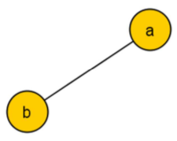
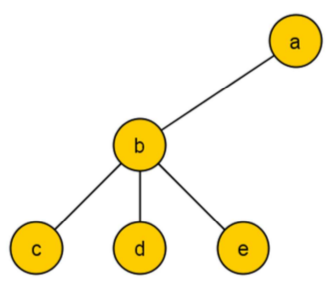
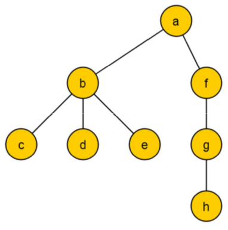
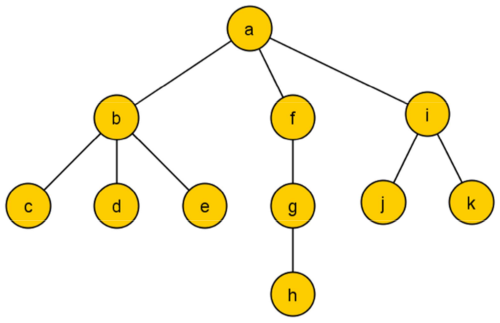

Estructuras de Datos
====================
2º Grado en Ingeniería Informática 2011/2012
--------------------------------------------

# Reto 6: Árboles-I
### Germán Martínez Maldonado

### PRIMER PROBLEMA

**Dar un algoritmo para reconstruir un árbol general dados los listados preorden, inorden y postorden del mismo, poniendo un ejemplo de su funcionamiento.**

Para explicar el algoritmo de reconstrucción de árboles general que vamos a usar, partiremos de un árbol ejemplo con los siguientes recorridos:

* Preorden:  a b c d e f g h i j k 
* Inorden:   c b d e a h g f j i k 
* Postorden: c d e b h g f j k i a

Comenzaremos buscando la raíz a partir de la cual reconstruiremos el árbol, la raíz siempre será el primero en el preorden y el último en el postorden, en este caso “a”.

Ahora buscaremos el primero de los hijos izquierda, vemos que el siguiente elemento de la lista preorden es “b”, por lo que sabemos que ese será su hijo más a la izquierda.

Para conocer los hijos de “b”, como en inorden y postorden, el primer elemento es “c”, sabemos que este será el hijo más a la izquierda, y que además este no tendrá hijos, el siguiente elemento de inorden es “b”, que ya sabíamos a través de preorden que era el hijo más a la izquierda de la raíz, buscamos en postorden el nodo “b” y vemos que antes, están “d” y “e”, así que sabemos que estos son descendientes suyos, para saber si estos dos nodos son hermanos o hijo y padre, como “b” es el primer hijo a la izquierda de la raíz, si en inorden hasta que encontremos “a”, coinciden con el orden hasta que encontremos “b”, significará que “d” y “e” son hermanos entre sí, hermanos de “c” y, a la vez, hijos de “b”. Con esto tenemos completamente construida la rama del hijo más a la izquierda de la raíz.

Queremos averiguar ahora el próximo hijo de la raíz, avanzaremos por el preorden mientras que encontremos nodos que ya han sido incluidos en el árbol, y nos encontramos con “f”, ahora sabemos que este es otro nodo hijo de la raíz, si el próximo elemento en los otros recorridos fuera también “f”, significaría que este nodo no tiene hijos, pero no es este el caso. Para saber cómo se organizan sus nodos descendientes, debemos tener en cuenta que si los listados inorden y postorden coinciden después del nodo padre, como pasaba con el nodo “b”, significa que estos nodos son hermanos, pero en este caso, para el nodo “f”, los dos listados coinciden antes de que este aparezca, lo que significará que estos nodos son nieto (“h”) e hijo (“g”) del nodo “f”. Como en postorden hemos llegado al nodo “f”, que sabíamos que es un hijo de la raíz, significará que hemos termina de listar este hijo.

Volvemos a recorrer el listado preorden mientras que encontremos elementos que ya hemos incluido en el árbol, y llegamos al nodo “i”, que ahora sabemos que es otro hijo del nodo raíz, seguimos avanzando por los recorridos inorden y postorden hasta encontrar “i”, como los recorridos no son iguales, significará que sus descendientes, no son a su vez descendientes entre sí, y como son hermanos, en el recorrido inorden vemos que “j” es el hijo a la izquierda de “i” y “k” será el hijo a la derecha. Con esto ya tendríamos el árbol completamente construido.

### SEGUNDO PROBLEMA

**Dar un procedimiento para guardar un árbol en disco de forma que se recupere la estructura jerárquica de forma unívoca usando el mínimo número de centinelas que veáis posible. Tendría puntuación doble el que consiga dar la mejor solución que sería la que use un menor número de datos para el proceso de salvado a disco del árbol.**

Lo primero que vamos a definir en nuestro procedimiento, son los diferentes centinelas que vamos a usar para asegurarnos que el mismo árbol que se almacena, será el que luego se reconstruya. Estos centinelas los representaremos con los siguientes números enteros:

* 1: indica que este nodo tiene hijos.
* 2: indica que se ha llegado al fin de la rama.

Partiendo del ejemplo de árbol general del caso anterior, generaríamos la siguiente secuencia:

a b -1 c d e -2 f -1 g -1 h -2 i -1 j k -2 

Para entender cómo se ha generado esta secuencia, simplemente deberemos ir haciendo un recorrido preorden del árbol:

* El primer nodo siempre será el raíz, así que no deberemos añadir ningún centinela especial.
* Insertamos en la lista el nodo “b”, como este nodo tiene hijos, a continuación añadimos el centinela “-1”, e insertamos los 3 hijos en orden (“c”, “d”, “e”), para finalizar la rama añadimos un “-2”.
* Añadimos el siguiente hijo de la raíz (“f”), y como tiene un hijo, insertamos “-1”, incluimos el hijo (“g”) y, como este a su vez tiene otro hijo, insertamos otro “-1” y el hijo (“h”). Finalizamos la rama con “-2”.
* Encontramos otro hijo del raíz (“i”), lo insertamos, como tiene hijos ponemos “-1”, y los añadimos (“j”, “k”). Finalizamos la rama, y como es la última, también el árbol, poniendo otro “-2”.

Esta forma de almacenar los árboles es más ventajosa cuando menos niveles haya en el árbol, independientemente de los hijos existentes por nodo, porque es indiferente que un nodo tenga 2 o 3 hijos, pues el costo de almacenamiento, pero si un nodo tiene un mayor grado de descendencia esto aumentará proporcionalmente los recursos necesario.
