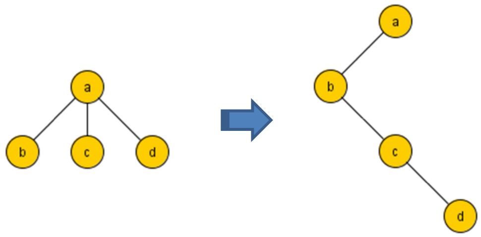

Estructuras de Datos
====================
2º Grado en Ingeniería Informática 2011/2012
--------------------------------------------

# Reto 7: Árboles-II
### Germán Martínez Maldonado

### PRIMER PROBLEMA

**Diseñar un procedimiento postorden no recursivo a imagen y semejanza del procedimiento preorden no recursivo visto en clase:**

```
void postordenNR(const ArbolBinario<int>& a){
  ArbolBinario<int>::Nodo actual, anterior;
  stack<ArbolBinario<int>::Nodo> p;

  /* Aunque en un recorrido postorden la raíz es el último nodo a listar, siempre deberemos empezar por ella nuestro recorrido, pero sin listarla todavía. */
  actual = a.raiz();

  /* Lo primero que deberemos tener en cuenta antes de hacer el recorrido es que el nodo actual no sea un nodo nulo, porque en tal caso no tendríamos nada que recorrer. */
  while (actual != ArbolBinario<int>::nodo_nulo){

    /* El primer nodo a listar en un recorrido postorden es el hijo más a la izquierda, así que almacenaremos todos los hijos izquierda (mientras haya, o lo que es lo mismo, mientras que ningún hijo izquierda sea un nodo nulo) en una pila, porque así siempre tendremos el hijo por encima del padre. */
    while (a.izquierda(actual) != ArbolBinario<int>::nodo_nulo){ 
      p.push(actual);
      actual = a.izquierda(actual);
    }

    /* Una vez nos encontramos en el hijo más a la izquierda, vamos a comenzar a listar, como iremos de izquierda a derecha y de abajo hacia arriba, deberemos ir controlando que  cuando subamos de nivel, si existen hijos a la derecha, antes de seguir listando hacia arriba, deberemos listar hacia la derecha, pero también controlando que el nodo hijo derecha no sea un nodo por el que acabemos de pasar, porque en caso contrario se produciría un bucle infinito listando continuamente el nodo derecha. */ 
    while (a.derecha(actual) == ArbolBinario<int>::nodo_nulo || a.derecha(actual) == anterior){

      cout << a.etiqueta(actual); 
      anterior = actual;

      /* Como ya dijimos usamos una pila para que los hijos siempre queden sobre los padres, como los hijos que vamos a ir listando van saliendo de la pila, deberemos controlar que si la pila está vacía, es porque ya no hay nada más que listar, si intentamos seguir listando obtendremos un error de violación de segmento. */
      if (p.empty()) return;

      /* Sacamos el siguiente nodo a listar y lo eliminamos de la pila. */
      actual = p.top(); 
      p.pop();
    }

    /* Una vez listada la parte izquierda, tocará listar la parte derecha siguiendo un procedimiento como el que hemos seguido para listar hijos a la izquierda, como es un árbol binario, una vez listada la parte derecha también, habremos terminado */
    p.push(actual);
    actual = a.derecha(actual);
  }
}
```

### SEGUNDO PROBLEMA

**Un árbol general tiene asociado un árbol binario construido de la siguiente forma: La raíz es la misma, el hijo más a la izquierda de un nodo del general pasa a ser el hijo izquierda de ese nodo en el binario y el hermano a la derecha de un nodo en el general pasa a ser el hijo derecha de ese nodo en el binario. P. ej:**



**El reto consiste en estudiar la relación que hay entre los recorridos de ambos arboles razonando adecuadamente la respuesta.**

Para poder estudiar la relación entre los recorridos de los árboles, lo primero que haremos será ir listando cada uno de los recorridos de ambos árboles:

* Preorden:

En el primer árbol, claramente sacamos el preorden, porque el árbol es simplemente un nodo raíz del que salen 3 hijos, por lo tanto, listamos primero la raíz y luego sus hijos de izquierda a derecha:

Preorden primer árbol: a b c d

En el segundo árbol, nos encontramos con un árbol que tiene un nodo raíz con un solo hijo izquierda (que además es el hijo más a la izquierda), y este hijo tiene un hijo derecha, que a su vez tiene otro hijo derecha, pero ninguno de los dos tiene hijo izquierda. Para el preorden de este árbol, empezaremos por la raíz, luego por su hijo más a la izquierda, y como este y sus sucesores, no tiene a la vez hijos izquierda, pues ir listando los hijos derecha por niveles, quedándonos el siguiente recorrido:

Preorden segundo árbol: a b c d

* Inorden:

Como pasaba con el preorden, por la simpleza del árbol, para el recorrido inorden es simplemente lista primero el hijo más a la izquierda, su padre (la raíz), y sus hermanos:

Inorden primer árbol: b a c d

De nuevo en el segundo árbol, para listar su recorrido inorden, nos fijamos en que solo tiene un hijo izquierda (así que el más a la izquierda, y por lo tanto el primero a lista), como este nodo no tiene hijos, el siguiente en listar será su padre (la raíz), como el hijo izquierda, es el hijo más a la izquierda, este a su vez no tendrá más hijos izquierda, así que procede a listar su descendencia por la derecha, encontrándonos un hijo que tampoco tiene descendencia a su izquierda, sólo a su derecha, así que lo listamos a él y después a su hijo derecha, quedando lo siguiente:

Inorden segundo árbol: b a c d

* Postorden:

Para finalizar con los recorridos del primer árbol, nos falta el postorden, que en este caso, es simplemente listar los hijos de izquierda a derecha y después listar su padre:

Postorden primer árbol: b c d a

Y por último nos queda el postorden del segundo árbol, habría que listar los hijos en orden de izquierda a derecha de menor nivel a mayor nivel, pero como en este árbol los niveles inferiores no tienen hijo izquierda, deberemos listar solo sus hijos derecha desde el nivel más bajo al más alto, quedando:

Postorden segundo árbol: d c b a

* CONCLUSIÓN:

Veamos como son los recorridos de los árboles que nos han quedado:

|    Primer árbol:   |   Segundo árbol:   |
|:------------------:|:------------------:|
|  Preorden: a b c d |  Preorden: a b c d |
|  Inorden: b a c d  |  Inorden: b a c d  |
| Postorden: b c d a | Postorden: d c b a |

El postorden no coincide, pero el preorden y el inorden sí, esto significará que conociendo el preorden y el inorden de un árbol general podremos tratarlos como si fuera un árbol binario, que en la práctica son muchos más fáciles de manejar que los árboles generales, entre otras cosas, por el simple hecho, de que un árbol general no podemos saber exactamente cuántos hijo puede tener cada nodo, pero en un árbol binario si sabemos que como máximo serán dos, lo que facilitará enormemente su recorrido.
