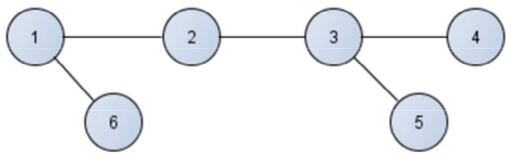
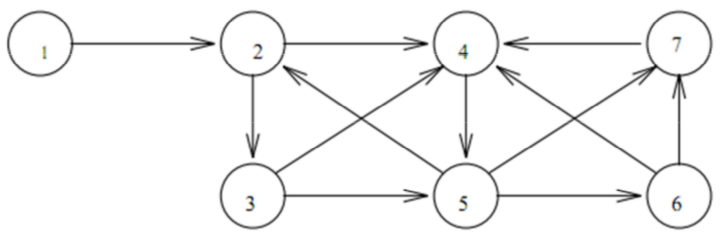

Estructuras de Datos
====================
2º Grado en Ingeniería Informática 2011/2012
--------------------------------------------

# Reto 10: Grafos
### Germán Martínez Maldonado

### PROBLEMA 1
**¿Puede recuperarse un grafo no dirigido a partir de sus recorridos en anchura y profundidad? Razona la respuesta.**

Sí es posible recuperar un grafo no dirigido a partir de sus recorridos  en anchura y profundidad, porque realizando el recorrido de un grafo se puede obtener el grafo asociado al recorrido, y como un grafo es equivalente a un árbol con varios caminos, al igual que pasaba con los árboles con un solo recorrido no se podía reconstruir el mismo árbol, pero si teníamos los dos recorridos indicados, si se podía hacer, pues el caso de los grafos es el mismo, contando con los dos recorridos haciéndolo paso a paso, podremos reconstruir el grafo.

Usemos de ejemplo el siguiente grafo:

Si tenemos en cuenta sus recorridos: 

* Profundidad:  1 2 3 4 5 6
* Anchura:	1 2 6 3 4 5

Si vamos realizando un grafo desde los 2 recorridos vemos que 1 está conectado con 2, 2 con 3, sabemos que 3 está conectado con 4, pero no sabemos si también con 5, por lo que nos fijamos en el recorrido en anchura, y vemos que 4 y 5 pertenecen a la misma “ola”, por lo que 3 estará conectado con 4 y con 5, y ya solo no queda saber con quién está conectado 6, como vemos que está en la misma “ola” que 2, estará también conectado con 1. Y así tendríamos el grafo reconstruido.

### PROBLEMA 2
**Dado el grafo siguiente:**

**Si suponemos que en el grafo todos los pesos de los arcos son 1, ¿Cómo averiguarías (con un algoritmo adecuado) si hay o no un camino de longitud mayor o igual que uno entre cualesquiera 2 vértices i,j del grafo?**

Aunque el peso de todos los arcos sea 1, con el algoritmo de Dijkstra podremos averiguar el camino más corto entre dos vértices, porque aunque todos los arcos  pesen 1, esto no tiene que significar que todos los caminos sean igual de largos, eso  lo podemos ver a simple vista fijándonos en el vértice 1 del caso a tomar en cuenta.

El procedimiento a seguir será ir examinando todos los caminos más cortos que parten desde el vértice origen y que van hacia todos los demás vértices, y cuando se obtiene el camino más corto desde el vértice origen al resto de vértices del grafo, el algoritmo se para. Si resulta que el camino menor entre dos vértices es del que estábamos buscando mayor, como es el menor, el resto de caminos será igual o mayores en longitud.
