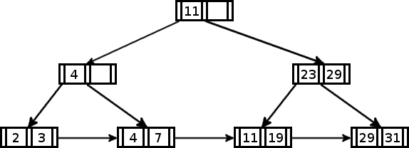
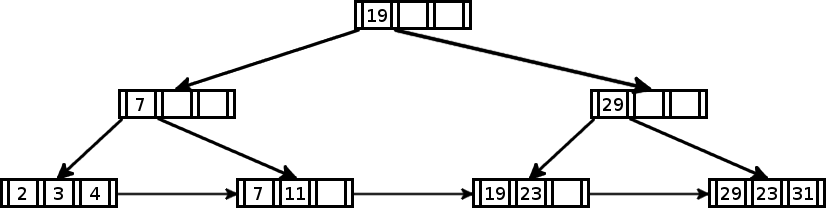
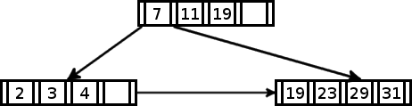
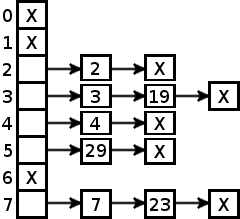

Fundamentos de Bases de Datos
=============================
2º Grado en Ingeniería Informática 2011/2012
--------------------------------------------

# Ejercicios de autocomprobación del tema 7: Nivel interno
### Germán Martínez Maldonado

**1. Describe los medios de almacenamiento físico que hay actualmente en tu ordenador, indicando capacidad y velocidad de transferencia de cada uno de ellos.**

* Caché: 1 MB
* Memoria principal: 4060 MB, 12800 MB/s
* Discos magnéticos: 465 GB, 300 MB/s
* Discos ópticos: 900 MB (CD) - 17 GB (DVD), 3600 KB/s (CD) - 10’8 MB/s (DVD)

**2. Poned un ejemplo de almacenamiento de registros de longitud variable en el que la reserva de espacio máximo para cada registro sea más conveniente que la utilización de una organización encadenada. Poned también un ejemplo del caso contrario.**

Cuando se van a almacenar muchos registros que contienen cadenas de texto, a estas poder tomar tamaños muy variados, es de mayor interés usar longitudes variables con reserva de espacio máximo. Sin embargo, si la mayoría de los registros contienen valores numéricos o tipos que no varían en gran cantidad su tamaño, será mejor usar una organización encadenada.

**3. Explicad por qué la organización de los registros en bloques es un elemento importante dentro del rendimiento de una base de datos.**

Porque lo ideal es buscar una organización de tal manera que se minimice el número de registros de entre los que buscar, para que se así se reduzca el tiempo de recuperación de la información.

**4. Dado que los índices agilizan el procesamiento de las consultas. ¿Por qué no se mantiene un índice para cada campo del fichero? Enumera tantas razones como se te ocurran.**

Porque los índices aceleran el acceso a los datos, pero ralentizan el resto de operaciones, como son la inserción o el borrado de un registro, ya que hay que realizar operaciones de mantenimiento del índice después de cada una de estas operaciones. Esto junto a que un índice sólo es útil para los campos que está pensando, habría que hacer un índice para cada combinación de búsquedas, con el consiguiente enorme  trabajo que requeriría el mantenimiento constante de estos índices, por eso sólo se crean índices exclusivamente para los registros que van a ser buscados en una gran número de consultas.

**5. ¿Por qué es preferible utilizar un índice no-denso a uno denso? ¿Por qué no se utilizan índices no densos para todas las claves de búsqueda?**
Porque los índices densos son muy grandes al contener todos los registros del fichero que indexan, mientras que los no densos se componen de clave de búsqueda y dirección de comienzo donde se puede encontrar el registro deseado, lo que hace que el número de registros se reduzca al número de bloques del fichero de datos, por lo que el acceso secuencial al índice no denso se acelera.

**6. Construid un árbol B con el siguiente conjunto de valores de la clave:**

* **{2; 3; 4; 7; 11; 19; 23; 29; 31}**

**Suponed que el árbol esta inicialmente vacío y que se van insertando los datos por orden creciente. Construid el árbol suponiendo que el orden del árbol es:**

**a) dos**

**b) tres**

**c) cuatro**

**7. Para  el  árbol  del  ejercicio  anterior  mostrad  los  pasos  involucrados  en  las  consultas siguientes:**

**a) Encontrar los registros con un valor de la clave de 11.**

* Orden 2: {11}
* Orden 3: {7; 11}
* Orden 4: {7; 11; 19}

**b) Encontrar todos los registros con un valor de la clave entre 7 y 17**

* Orden 2: {4; 7;}, {11}, {11; 19}
* Orden 3: {7}, {7; 11}
* Orden 4: {7; 11; 19}

**8. ¿Por qué una organización basada en el acceso directo no es la mejor idea para aquellos ficheros que se consulten por rangos de valores de la clave física, (entre c1 y c2)?**

Porque en la organización base en el acceso directo, los algoritmos transforman un campo clave del registro en una dirección, pero estos no suelen mantener el orden de la clave, por lo que no serán almacenados según el orden de su clave física, lo que ocasiona problemas con la recuperación por intervalos.

**9. Enumera las ventajas e inconvenientes que tienen, a tu juicio, la organización basada en índices y la que se basa en el acceso directo. Haz un análisis comparativo.**

La organización basada en índices no tiene los problemas para las consultas por rangos de valores que se tienen con el acceso directo, pero tiene la desventaja de que el mantenimiento de los índices se puede hacer muy costoso, además de que un índice sólo es útil para consultas con los campos para los que se ha construido el índice.

La organización basada en acceso directo es útil en todos los casos, en comparación que los índices que sólo es útil para los campos para los que está construido el índice, pero como desventaja, es que si los campos claves tienen una difícil conversión a valor entero positivo, esto puede hacer que se produzcan demasiados huecos en el almacenamiento y muchas colisiones en el acceso, lo que ralentizará las operaciones.

**10. Supongamos que se desea diseñar una estructura de “hashing" dinámico para un archivo que contiene los valores de clave:**

**{2; 3; 4; 7; 11; 19; 23; 29; 31}**

**Mostrad la organización que se obtiene si la función de direccionamiento es f(x) = x mod 8 y las páginas pueden contener hasta tres registros.**

| Clave | 2 | 3 | 4 | 7 | 11 | 19 | 23 | 29 | 31 |
|-------|---|---|---|---|----|----|----|----|----|
| f(x)  | 2 | 3 | 4 | 7 | 3  | 3  | 7  | 5  | 7  |

**11. Mostrad  como  cambia  la  estructura  del  ejercicio  anterior  como  resultado  de  los siguientes pasos:**

**a) Borrar el 11 y el 31.**

**b) Insertar el 1, el 15, el 36, el 40, el 46, el 25.**

Partiendo del estado del apartado a:

| Clave | 1 | 15 | 36 | 40 | 46 | 25 |
|-------|---|----|----|----|----|----|
| f(x)  | 1 | 7  | 4  | 0  | 6  | 1  |

