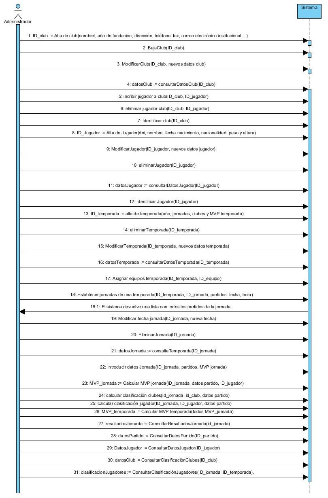
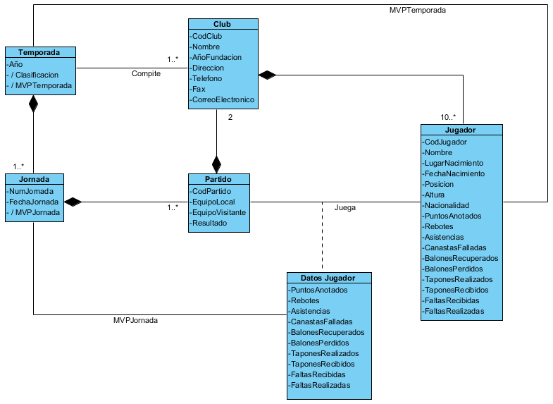
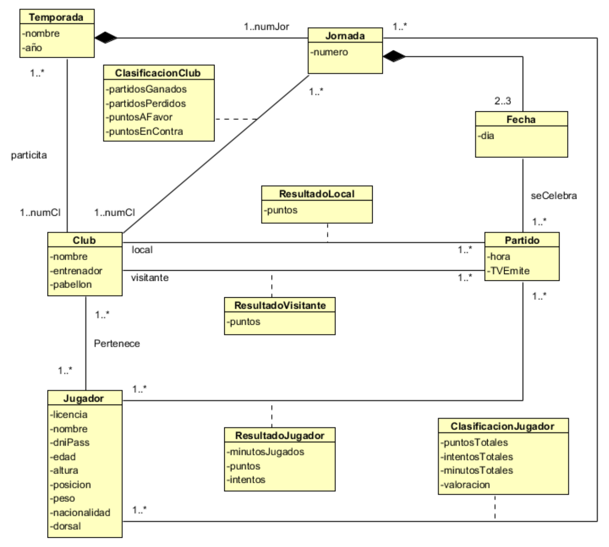
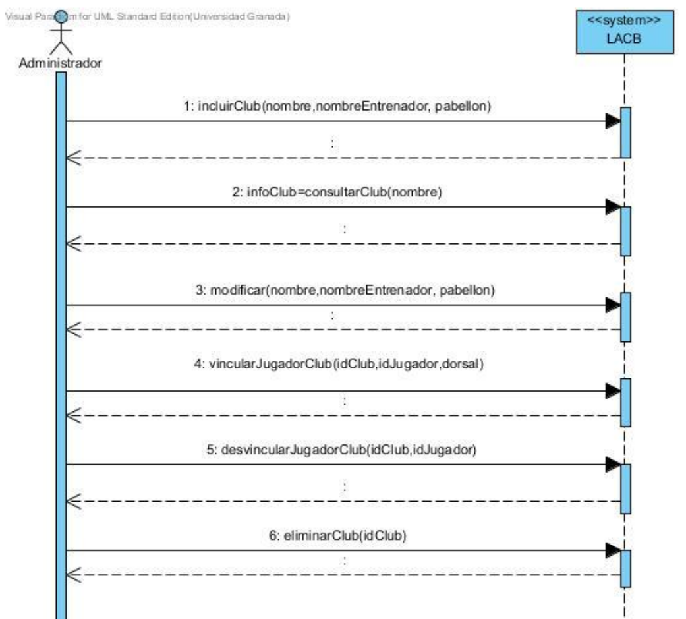
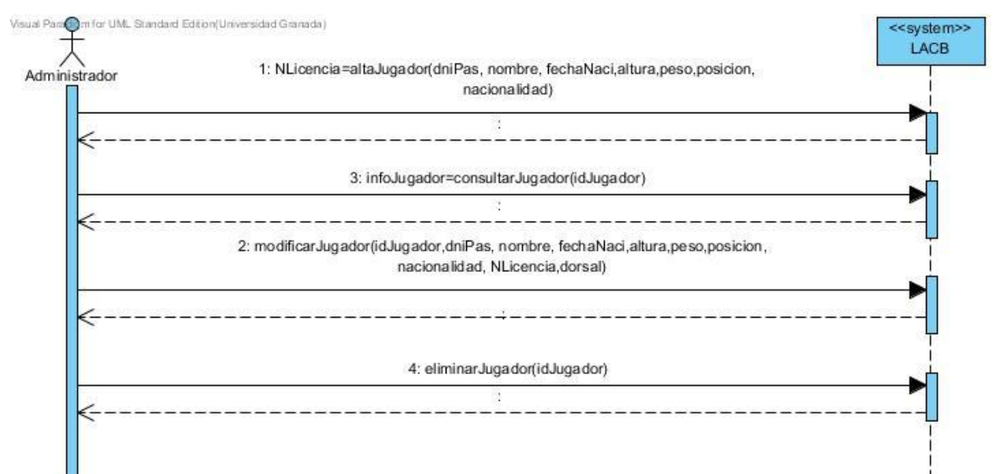
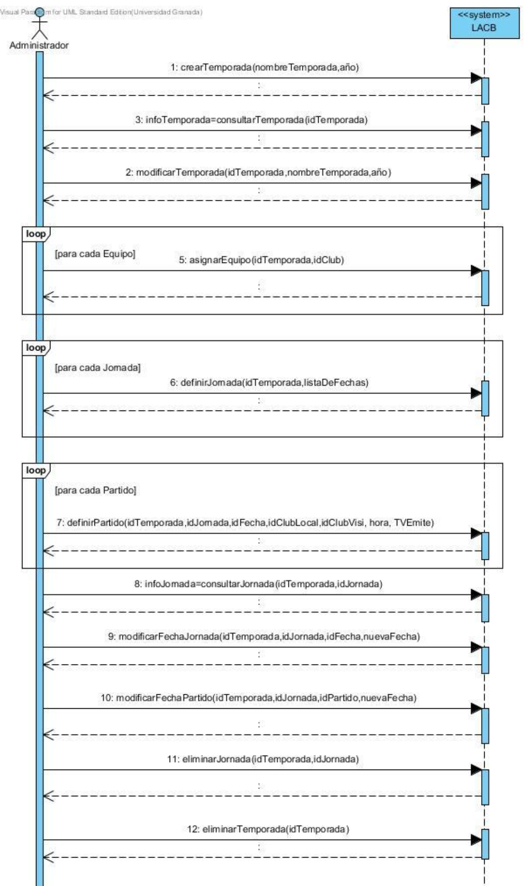
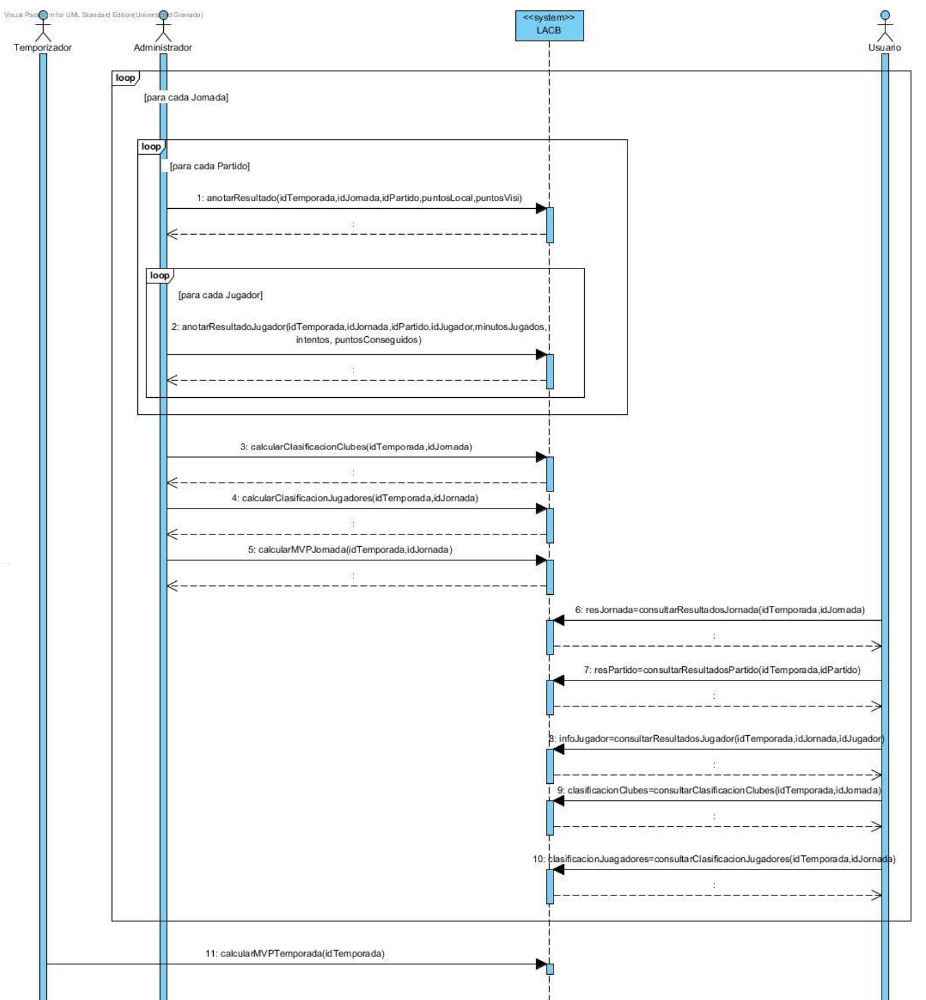

Fundamentos de Ingeniería del Software
======================================
2º Grado en Ingeniería Informática 2011/2012
--------------------------------------------

# Práctica 3: Ingeniería de requisitos. Modelo conceptual y contratos
### Jesús Gómez Obregón
### Germán Martínez Maldonado 
### Ramón Rueda Delgado
### José Rubén Sánchez Iruela
### Pablo Sánchez Robles

### Actividades a realizar

A partir de la descripción inicial del sistema realizada en la práctica anterior, en esta práctica se deben realizar las siguientes actividades:

1. Crear el modelo conceptual o modelo de dominio del problema, representándolo mediante un diagrama de clases de UML.
2. Representar el/los diagrama/s de secuencia correspondiente a todos los diagramas de CU incluidos en el guión de la práctica anterior.
3. Elaborar los contratos de todas las operaciones que aparecen en los diagramas de secuencia del sistema.

### Modelo conceptual

* **Temporada**: año, jornadas (colección), clubes (colección), MVP temporada.

* **Jornada**: ID jornada, partidos (colección), MVP jornada.

* **Partido**: ID partido, ID local, ID visitante, datos partido.

* **Club**: ID club, datos generales (clasificación), jugadores (colección), nombre, denominación social, año de fundación, dirección de la sede central, teléfono, fax, correo electrónico institucional, pabellón y página web.

* **Jugador**: ID jugador, datos personales, datos generales (MVP).

* **Clase asociación entre jugador y partido**: datos del jugador del partido.

### Diagrama de secuencia

### Diagrama del modelo conceptural

### Modelo conceptual propuesto

### Diagramas de secuencia del sistema propuesto

### Contratos

| Nombre               | modificar(nombre, nombreEntrenador, pabellón)                                                        |
|----------------------|------------------------------------------------------------------------------------------------------|
| Responsabilidades    | Modificar atributos de un club identificado por su nombre, el nombre de su entrenador y su pabellón. |
| Tipo                 | LACB                                                                                                 |
| Notas                |                                                                                                      |
| Referencias cruzadas | Caso de uso "Modificación club".                                                                     |
| Excepciones          | Si el club no existe en el sistema.                                                                  |
| Salida               | Confirmación de modificación realizada con éxito.                                                    |
| Precondiciones       | Club identificado en el sistema.                                                                     |
| Poscondiciones       | Se modifica alguno de los atributos del objeto Club.                                                 |

| Nombre               | infoJugador = consultarJugador(idJugador)                                                                    |
|----------------------|--------------------------------------------------------------------------------------------------------------|
| Responsabilidades    | Consultar la información de un jugador identificado por idJugador.                                           |
| Tipo                 | LACB                                                                                                         |
| Notas                |                                                                                                              |
| Referencias cruzadas | Caso de uso "Consultar datos jugador".                                                                       |
| Excepciones          | Que el jugador no exista en el sistema.                                                                      |
| Salida               | Toda la información del jugador: licencia, nombre, dni, edad, altura, posición, peso, nacionalidad y dorsal. |
| Precondiciones       | Jugador identificado en el sistema.                                                                          |
| Poscondiciones       |                                                                                                              |

| Nombre               | modificarTemporada(idTemporada, nombreTemporada, año)                                        |
|----------------------|----------------------------------------------------------------------------------------------|
| Responsabilidades    | Modificar atributos de una temporada identificada por su idTemporada, nombreTemporada y año. |
| Tipo                 | LACB                                                                                         |
| Notas                |                                                                                              |
| Referencias cruzadas | Caso de uso "Modificar temporada".                                                           |
| Excepciones          | Que la temporada no exista en el sistema.                                                    |
| Salida               | Confirmación de modificación realizada con éxito.                                            |
| Precondiciones       | Temporada identificada en el sistema.                                                        |
| Poscondiciones       | Se modifica alguno de los atributos del objeto Temporada.                                    |

| Nombre               | modificarFechaJornada(idTemporada, idJornada, idFecha, nuevaFecha)                                      |
|----------------------|---------------------------------------------------------------------------------------------------------|
| Responsabilidades    | Se modifica la fecha de una jornada en una temporada determinada indicando la antigua y la nueva fecha. |
| Tipo                 | LACB                                                                                                    |
| Notas                |                                                                                                         |
| Referencias cruzadas | Caso de uso "Modificar fechas jornadas".                                                                |
| Excepciones          | Que la temporada no exista en el sistema.                                                               |
|                      | Que la jornada no exista en el sistema.                                                                 |
|                      | Que nueva Fecha sea incorrecta.                                                                         |
| Salida               | Confirmación de modificación realizada con éxito.                                                       |
| Precondiciones       | Temporada identificada en el sistema.                                                                   |
|                      | Jornada identificada en el sistema.                                                                     |
| Poscondiciones       | Fue creado un enlace entre el objeto Temporada y el objeto Jornada.                                     |
|                      | Fue creado un enlace entre el objeto Jornada y el objeto Fecha.                                         |
|                      | Fue modificado el atributo día del objeto Fecha a nuevaFecha.                                           |

| Nombre               | anotarResultadoJugador(idTemporada, idJornada, idJugador, minutosJugados, puntosConseguidos)                                 |
|----------------------|------------------------------------------------------------------------------------------------------------------------------|
| Responsabilidades    | Se anota los minutos jugados y los puntos conseguidos por un jugador en una jornada determinada de una temporadadeterminada. |
| Tipo                 | LACB                                                                                                                         |
| Notas                |                                                                                                                              |
| Referencias cruzadas |                                                                                                                              |
| Excepciones          | Que la temporada no exista en el sistema.                                                                                    |
|                      | Que la jornada no exista en el sistema.                                                                                      |
|                      | Que el jugador no exista en el sistema.                                                                                      |
| Salida               |                                                                                                                              |
| Precondiciones       | Temporada identificada en el sistema.                                                                                        |
|                      | Jornada identificada en el sistema.                                                                                          |
|                      | Jugador identificado en el sistema.                                                                                          |
| Poscondiciones       | Fue creado un enlace entre el objeto ResultadoJugador y el objeto Jugador.                                                   |
|                      | Fue creado un enlace entre el objeto ResultadoJugador y el objeto Partido.                                                   |
|                      | Fue modificado el atributo minutosJugados de ResultadoJugador.                                                               |
|                      | Fue modificado el atributo puntos de ResultadoJugador.                                                                       |

| Nombre               | resPartido = consultarResultadosPartido(idTemporada, idPartido)               |
|----------------------|-------------------------------------------------------------------------------|
| Responsabilidades    | Consultamos el resultado de un partido concreto de una determinada temporada. |
| Tipo                 | LACB                                                                          |
| Notas                |                                                                               |
| Referencias cruzadas |                                                                               |
| Excepciones          | Que la temporada no exista en el sistema.                                     |
|                      | Que el partido no exista en el sistema.                                       |
| Salida               | Puntos del equipo local y puntos del equipo visitante.                        |
| Precondiciones       | Temporada identificada en el sistema.                                         |
|                      | Partido identificado en el sistema.                                           |
| Poscondiciones       |                                                                               |

| Nombre               | infoClub = consultarClub(nombre)                                           |
|----------------------|----------------------------------------------------------------------------|
| Responsabilidades    | Consultar los datos de un club mediante su nombre.                         |
| Tipo                 | LACB                                                                       |
| Notas                |                                                                            |
| Referencias cruzadas | Caso de uso “Consulta club”                                                |
| Excepciones          |                                                                            |
| Salida               | Se informa de que la operación se ha realizado correctamente.              |
| Precondiciones       | El club referido existe en el sistema.                                     |
| Poscondiciones       | Se creó una instancia a un objeto Club infoClub (identificado por nombre). |

| Nombre               | NLicencia = altaJugador(dniPas, nombre, fechaNaci, altura, peso, posición, nacionalidad)                                                  |
|----------------------|-------------------------------------------------------------------------------------------------------------------------------------------|
| Responsabilidades    | Dar de alta en el sistema un jugador con su DNI o pasaporte, nombre, fecha de nacimiento, altura, peso, posición de juego y nacionalidad. |
| Tipo                 | LACB                                                                                                                                      |
| Notas                |                                                                                                                                           |
| Referencias cruzadas | Caso de uso “Alta jugador”                                                                                                                |
| Excepciones          | Si el jugador ya existe en el sistema, se informa sobre ello al administrador y se cancela el proceso de alta de jugador.                 |
| Salida               | Se informa de que la operación se ha realizado correctamente.                                                                             |
| Precondiciones       |                                                                                                                                           |
| Poscondiciones       | Se creó un objeto Jugador NLicencia (identificado por dniPas).                                                                            |

| Nombre               | infoTemporada = consultarTemporada(idTemporada)                                                                                                                 |
|----------------------|-----------------------------------------------------------------------------------------------------------------------------------------------------------------|
| Responsabilidades    | Consultar los datos de una temporada mediante su identificador de temporada.                                                                                    |
| Tipo                 | LACB                                                                                                                                                            |
| Notas                |                                                                                                                                                                 |
| Referencias cruzadas | Caso de uso “Consultar temporada”                                                                                                                               |
| Excepciones          | Si no existe una temporada con el identificador de temporada recibido, se informa sobre ello al administrador y se cancela el proceso de consulta de temporada. |
| Salida               | Se informa de que la operación se ha realizado correctamente.                                                                                                   |
| Precondiciones       |                                                                                                                                                                 |
| Poscondiciones       | Se creó una instancia a un objeto Temporada infoTemporada (identificado por idTemporada).                                                                       |

| Nombre               | infoJornada = consultarJornada(idTemporada, idJornada)                                                                                                                                  |
|----------------------|-----------------------------------------------------------------------------------------------------------------------------------------------------------------------------------------|
| Responsabilidades    | Consultar los datos de una jornada mediante su identificador de temporada y su identificador de jornada.                                                                                |
| Tipo                 | LACB                                                                                                                                                                                    |
| Notas                |                                                                                                                                                                                         |
| Referencias cruzadas | Caso de uso “Consultar jornadas de una temporada”                                                                                                                                       |
| Excepciones          | Si no existe una jornada con el identificador de temporada e identificador de jornada recibidos, se informa sobre ello al administrador y se cancela el proceso de consulta de jornada. |
| Salida               | Se informa de que la operación se ha realizado correctamente.                                                                                                                           |
| Precondiciones       |                                                                                                                                                                                         |
| Poscondiciones       | Se creó una instancia a un objeto Jornada infoJornada(identificado por idTemporada e idJornada).                                                                                        |

| Nombre               | anotarResultado(idTemporada, idJornada, idPartido, puntosLocal, puntosVisi)                                                                                                                                                                 |
|----------------------|---------------------------------------------------------------------------------------------------------------------------------------------------------------------------------------------------------------------------------------------|
| Responsabilidades    | Introducir en el sistema el resultado de una partido referido mediante su identificación de temporada, identificación de jornada, identificación de partido, puntos anotados por el equipo local y puntos anotados por el equipo visitante. |
| Tipo                 | LACB                                                                                                                                                                                                                                        |
| Notas                |                                                                                                                                                                                                                                             |
| Referencias cruzadas | Caso de uso “Introducir datos jornada”                                                                                                                                                                                                      |
| Excepciones          |                                                                                                                                                                                                                                             |
| Salida               | Se informa de que la operación se ha realizado correctamente.                                                                                                                                                                               |
| Precondiciones       |                                                                                                                                                                                                                                             |
| Poscondiciones       | Se creó un objeto ResultadoLocal (identificado por idTemporada, idJornada, idPartido).                                                                                                                                                      |
|                      | Se creó un objeto ResultadoVisitante (identificado por idTemporada, idJornada, idPartido).                                                                                                                                                  |
|                      | Se asoció ResultadoLocal a Partido (identificado por idTemporada, idJornada, idPartido).                                                                                                                                                    |
|                      | Se asoció ResultadoVisitante a Partido (identificado por idTemporada, idJornada, idPartido).                                                                                                                                                |
|                      | Se estableció el valor del atributo “puntos” de ResultadoLocal con el argumento recibido “puntosLocal”.                                                                                                                                     |
|                      | Se estableció el valor del atributo “puntos” de ResultadoVisitante con el argumento recibido “puntosVisi”.                                                                                                                                  |

| Nombre               | resJornada = consultarResultadosJornada(idTemporada, idJornada)                                                                                                                                           |
|----------------------|-----------------------------------------------------------------------------------------------------------------------------------------------------------------------------------------------------------|
| Responsabilidades    | Consultados los resultados de una jornada mediante su identificador de temporada y su identificador de jornada.                                                                                           |
| Tipo                 | LACB                                                                                                                                                                                                      |
| Notas                |                                                                                                                                                                                                           |
| Referencias cruzadas | Caso de uso “Consultar resultados jornada”                                                                                                                                                                |
| Excepciones          | Si no existe una jornada con el identificador de temporada e identificador de jornada recibidos, se informa sobre ello al administrador y se cancela el proceso de consulta de resultados de una jornada. |
| Salida               | Se informa de que la operación se ha realizado correctamente.                                                                                                                                             |
| Precondiciones       |                                                                                                                                                                                                           |
| Poscondiciones       | Se creó una instancia a un objeto Jornada resJornada (identificado por idTemporada e idJornada).                                                                                                          |

| Nombre               | calcularMVPTemporada(idTemporada)                                                |
|----------------------|----------------------------------------------------------------------------------|
| Responsabilidades    | Calcular el jugador MVP de una temporada mediante un identificador de temporada. |
| Tipo                 | LACB                                                                             |
| Notas                |                                                                                  |
| Referencias cruzadas | Caso de uso “Calcular MVP temporada”                                             |
| Excepciones          |                                                                                  |
| Salida               | Se muestra el MVP de la temporada y sus datos.                                   |
| Precondiciones       |                                                                                  |
| Poscondiciones       |                                                                                  |

| Nombre               | vincularJugadorClub(idClub, idJugador, dorsal)                                                              |
|----------------------|-------------------------------------------------------------------------------------------------------------|
| Responsabilidades    | Asignar un club a un jugador, indicando el jugador el número que llevará y el club donde va a ser asignado. |
| Tipo                 | LACB                                                                                                        |
| Notas                |                                                                                                             |
| Referencias cruzadas | Caso de uso (Añadir jugador)                                                                                |
| Excepciones          | Que el dorsal ya esté asignado a otro jugador.                                                              |
| Salida               | El jugador ha sido asignado con éxito a dicho club y con el dorsal indicado.                                |
| Precondiciones       | El club y el jugador deben estar identificados en el sistema.                                               |
| Poscondiciones       | Se creó un objeto jugador y fue incluido en un determinado club.                                            |

| Nombre               | modificarJugador(idJugador, dniPas, fechaNac, altura, peso, posicion, nacionalidad) |
|----------------------|-------------------------------------------------------------------------------------|
| Responsabilidades    | Modifica las características de un jugador.                                         |
| Tipo                 | LACB                                                                                |
| Notas                |                                                                                     |
| Referencias cruzadas | Caso de uso (Modificar características de un determinado jugador)                   |
| Excepciones          | El jugador debe existir.                                                            |
| Salida               | El jugador ha sido modificado con éxito.                                            |
| Precondiciones       | Jugador identificado en el sistema.                                                 |
| Poscondiciones       | Se modificó correctamente las características del jugador.                          |

| Nombre               | asignarEquipo(idTemporada, idClub)                                    |
|----------------------|-----------------------------------------------------------------------|
| Responsabilidades    | Se asignan los diferentes equipos y clubes entre sí para enfrentarse. |
| Tipo                 | LACB                                                                  |
| Notas                |                                                                       |
| Referencias cruzadas | Caso de uso (Asignar equipos y clubes)                                |
| Excepciones          | Los equipos a asignar deben existir.                                  |
| Salida               | Los equipos han sido asignados a la temporada correctamente.          |
| Precondiciones       | El equipo está identificado en el sistema.                            |
| Poscondiciones       |                                                                       |

| Nombre               | modificarFechaPartido(idTemporada, idJornada, idPartido, nuevaFecha)        |
|----------------------|-----------------------------------------------------------------------------|
| Responsabilidades    | Se modifica la fecha de un partido de una temporada la nueva fecha deseada. |
| Tipo                 | LACB                                                                        |
| Notas                |                                                                             |
| Referencias cruzadas | Caso de uso (Modificar la fecha de un partido)                              |
| Excepciones          | La nueva fecha debe estar disponible.                                       |
|                      | La temporada y el partido debe existir en el sistema.                       |
| Salida               | La modificación de la fecha del partido ha sido realizada correctamente.    |
| Precondiciones       |                                                                             |
| Poscondiciones       | Ha sido creado un enlace entre fecha y partido.                             |
|                      | El atributo fecha ha sido actualizado a nueva Fecha.                        |

| Nombre               | calcularClasificacionClubes(idTemporada, idJornada)                                                         |
|----------------------|-------------------------------------------------------------------------------------------------------------|
| Responsabilidades    | Ordenar los equipos en base a la puntuación que llevan obtenida en la temporada.                            |
| Tipo                 | LACB                                                                                                        |
| Notas                |                                                                                                             |
| Referencias cruzadas | Caso de uso (Calcular la clasificación de los clubes)                                                       |
| Excepciones          | Que la temporada no exista en el sistema.                                                                   |
|                      | Que la jornada no exista en el sistema.                                                                     |
| Salida               | Devuelve la clasificación de los equipos ordenados desde el equipo con mayor puntuación, hasta el de menor. |
| Precondiciones       | El equipo está identificado en el sistema.                                                                  |
| Poscondiciones       | Ha sido creada una lista con la ordenación de los diferentes clubes en base a los puntos acumulados .       |

| Nombre               | infoJugador = consultarResultadoJugador(idTemporada, idJornada, idJugador) |
|----------------------|----------------------------------------------------------------------------|
| Responsabilidades    | Consultar los datos de los partidos que ha jugado un jugador.              |
| Tipo                 | LACB                                                                       |
| Notas                |                                                                            |
| Referencias cruzadas | Caso de uso (Consultar información de un jugador)                          |
| Excepciones          | Que el jugador no exista en el sistema.                                    |
|                      | Que la temporada y la jornada no existan en el sistema.                    |
| Salida               | Se obtiene la información que se ha consultado acerca de un jugador.       |
| Precondiciones       | El jugador debe estar identificado en el sistema.                          |
| Poscondiciones       |                                                                            |

| Nombre               | desvincularJugadorClub(idClub, idJugador)                                     |
|----------------------|-------------------------------------------------------------------------------|
| Responsabilidades    | Liberar al jugador de la relación que tenia con el club.                      |
| Tipo                 | LACB                                                                          |
| Notas                |                                                                               |
| Referencias cruzadas | Caso de uso (Eliminar jugador de club)                                        |
| Excepciones          | Si el jugador indicado no esta dado de alta en el club se cancela el proceso. |
| Salida               | El jugador queda libre para poder ser vinculado a otro club.                  |
| Precondiciones       | El jugador y el club indicados deben de estar dado de alta en el sistema.     |
| Poscondiciones       | Se elimina la asociación de un club con un jugador.                           |

| Nombre               | eliminarJugador(idJugador)                                    |
|----------------------|---------------------------------------------------------------|
| Responsabilidades    | Eliminar un jugador del sistema.                              |
| Tipo                 | LACB                                                          |
| Notas                |                                                               |
| Referencias cruzadas | Caso de uso (Eliminación jugador)                             |
| Excepciones          | Que el idJugador no exista, en ese caso se informa del error. |
| Salida               |                                                               |
| Precondiciones       | El jugador debe de estar dado de alta en el sistema           |
| Poscondiciones       | Se elimina del sistema el jugador.                            |

| Nombre               | definirJornada(idTemporada, listaDeFechas)                                                                                     |
|----------------------|--------------------------------------------------------------------------------------------------------------------------------|
| Responsabilidades    | Establecer una jornada nueva a una temporada y fecha.                                                                          |
| Tipo                 | LACB                                                                                                                           |
| Notas                |                                                                                                                                |
| Referencias cruzadas | Caso de uso (Establecer jornada de una temporada)                                                                              |
| Excepciones          | Que la temporada no haya sido creada aun o la fecha este fuera de la temporada anual, en ese caso se anualaria el proceso.     |
| Salida               |                                                                                                                                |
| Precondiciones       | Se debe coger una temporada dada de alta en el sistema y una fecha que este dentro de la lista de fechas previamente definida. |
| Poscondiciones       | Se le añade a la temporada una nueva jornada.                                                                                  |

| Nombre               | eliminarJornada(idTemporada, idJornada)                                        |
|----------------------|--------------------------------------------------------------------------------|
| Responsabilidades    | Eliminar jornada de una temporada                                              |
| Tipo                 | LACB                                                                           |
| Notas                |                                                                                |
| Referencias cruzadas | Caso de uso (Eliminar jornadas de una temporada)                               |
| Excepciones          | Que el idTemporada o idJornada no coincidan, en ese caso se informa del error. |
| Salida               |                                                                                |
| Precondiciones       | Que se hayan dado de alta previamente la jornada a eliminar en el sistema.     |
| Poscondiciones       | Se elimina una jornada especifica de una temporada especifica.                 |

| Nombre               | calcularClasificacionJugadores(idTemporada, idJornada)                                                 |
|----------------------|--------------------------------------------------------------------------------------------------------|
| Responsabilidades    | Tener los jugadores ordenados según su puntacion                                                       |
| Tipo                 | LACB                                                                                                   |
| Notas                |                                                                                                        |
| Referencias cruzadas | Caso de uso (Calcular clasificación jugadores)                                                         |
| Excepciones          | Que el idTemporada o idJornada no coincidan, en ese caso se informa del error.                         |
| Salida               |                                                                                                        |
| Precondiciones       | Que se hayan dado de alta previamente la jornada y la temporada para poder clasificar a los jugadores. |
| Poscondiciones       | Se crea una lista con los datos de los jugadores con respecto a una temporada y jornada especifica.    |

| Nombre               | clasificacionClubes=consultarClasificacionClubes(idTemporada, idJornada)       |
|----------------------|--------------------------------------------------------------------------------|
| Responsabilidades    | Consultar información de la clasificación de los equipos.                      |
| Tipo                 | LACB                                                                           |
| Notas                |                                                                                |
| Referencias cruzadas | Caso de uso (Consultar clasificación clubes)                                   |
| Excepciones          | Que el idTemporada o idJornada no coincidan, en ese caso se informa del error. |
| Salida               | Una lista con la clasificación de los clubes.                                  |
| Precondiciones       | Que la clasificación de todos los equipos conste en la base de datos.          |
| Poscondiciones       | Se publica la clasificación de clubes.                                         |

| Nombre               | incluirClub(nombre, nombreEntrenador, pabellon)                                                                        |
|----------------------|------------------------------------------------------------------------------------------------------------------------|
| Responsabilidades    | Crear un objeto club con los atributos que se le pasan al método e incluirlo en la lista de equipos de la liga actual. |
| Tipo                 | LACB                                                                                                                   |
| Notas                |                                                                                                                        |
| Referencias cruzadas | Caso de uso (Alta de equipo)                                                                                           |
| Excepciones          | Que el club a incluir no esté en el sistema previamente.                                                               |
| Salida               | Club incluido con éxito.                                                                                               |
| Precondiciones       |                                                                                                                        |
| Poscondiciones       |                                                                                                                        |

| Nombre               | eliminarClub(idClub)                                                                         |
|----------------------|----------------------------------------------------------------------------------------------|
| Responsabilidades    | Eliminar el club cuyo idClub se pasa como argumento de la lista de clubes de la liga actual. |
| Tipo                 | LACB                                                                                         |
| Notas                |                                                                                              |
| Referencias cruzadas | Caso de uso (Baja del equipo)                                                                |
| Excepciones          | Debe existir un club con el idClub que se recibe en la liga actual.                          |
| Salida               | Club eliminado con éxito.                                                                    |
| Precondiciones       |                                                                                              |
| Poscondiciones       |                                                                                              |

| Nombre               | crearTemporada(nombreTemporada, anio)                                                                             |
|----------------------|-------------------------------------------------------------------------------------------------------------------|
| Responsabilidades    | Crear una nueva temporada con el nombre que se pasa como argumento y el año que también se recibe como argumento. |
| Tipo                 | LACB                                                                                                              |
| Notas                |                                                                                                                   |
| Referencias cruzadas |                                                                                                                   |
| Excepciones          | Que no haya una temporada ya en ese año.                                                                          |
| Salida               | Temporada creada con éxito.                                                                                       |
| Precondiciones       |                                                                                                                   |
| Poscondiciones       |                                                                                                                   |

| Nombre               | definirPartido(idTemporada, idJornada, idFecha, idClubLocal, idClubVisi, hora, TVEmite)                                                                                                                                 |
|----------------------|-------------------------------------------------------------------------------------------------------------------------------------------------------------------------------------------------------------------------|
| Responsabilidades    | Se encarga de crear un objeto partido con los clubes que se pasan como argumento en la jornada indicada, en la fecha y hora que se pasa, indicando la televisión que lo emite y la temporada en la que se va a incluir. |
| Tipo                 | LACB                                                                                                                                                                                                                    |
| Notas                |                                                                                                                                                                                                                         |
| Referencias cruzadas | Caso de uso (Alta de partido)                                                                                                                                                                                           |
| Excepciones          | Tienen que existir tanto la temporada que se pasa como argumento, como la jornada y los clubes.                                                                                                                         |
|                      | Ninguno de los clubes que se pasan como argumento puede tener otro partido en dicha jornada.                                                                                                                            |
| Salida               | Se ha definido el partido con éxito.                                                                                                                                                                                    |
| Precondiciones       |                                                                                                                                                                                                                         |
| Poscondiciones       |                                                                                                                                                                                                                         |

| Nombre               | eliminarTermporada(idTemporada)                                                                 |
|----------------------|-------------------------------------------------------------------------------------------------|
| Responsabilidades    | Se encarga de eliminar la temporada que identifica el idTemporada que se recibe como argumento. |
| Tipo                 | LACB                                                                                            |
| Notas                |                                                                                                 |
| Referencias cruzadas | Caso de uso (Alta de partido)                                                                   |
| Excepciones          | El idTemporada recibido debe identificar a alguna temporada existente.                          |
| Salida               | Temporada eliminada con éxito.                                                                  |
| Precondiciones       |                                                                                                 |
| Poscondiciones       |                                                                                                 |

| Nombre               | calcularMVPJornada(idTemporada, idJornada)                                                                                                                      |
|----------------------|-----------------------------------------------------------------------------------------------------------------------------------------------------------------|
| Responsabilidades    | Calcula de entre los mejores jugadores de cada partido de la jornada representada por idJornada en la temporada representada por idTemporada el mejor de todos. |
| Tipo                 | LACB                                                                                                                                                            |
| Notas                |                                                                                                                                                                 |
| Referencias cruzadas | Casos de usos (Calcular MVP partido) y (Calcular MVP jornada)                                                                                                   |
| Excepciones          | IdTemporada tiene que representar una temporada existente.                                                                                                      |
|                      | idJornada tiene que representar una jornada de la temporada idTemporada.                                                                                        |
| Salida               | MVP de la jornada calculado con éxito.                                                                                                                          |
| Precondiciones       |                                                                                                                                                                 |
| Poscondiciones       |                                                                                                                                                                 |

| Nombre               | clasificacionJugadores = consultarclasficacionJugadores(idTemporada, idJornada)                                                                                       |
|----------------------|-----------------------------------------------------------------------------------------------------------------------------------------------------------------------|
| Responsabilidades    | Crear una lista de los jugadores de la jornada idJornada de la temporada idTemporada, ordenarlos por su puntuación y devolverlos en una colección de objetos jugador. |
| Tipo                 | LACB                                                                                                                                                                  |
| Notas                |                                                                                                                                                                       |
| Referencias cruzadas |                                                                                                                                                                       |
| Excepciones          | Se comprueba que existe la temporada idTemporada y que en esa temporada hay una jornada representada por idJornada.                                                   |
| Salida               | Una colección de jugadores ordenados por su puntuación.                                                                                                               |
| Precondiciones       |                                                                                                                                                                       |
| Poscondiciones       |                                                                                                                                                                       |
