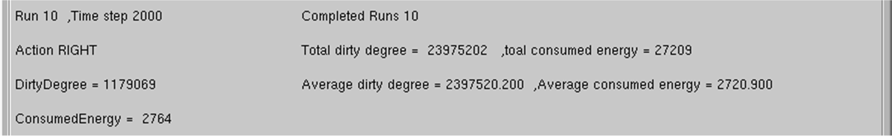
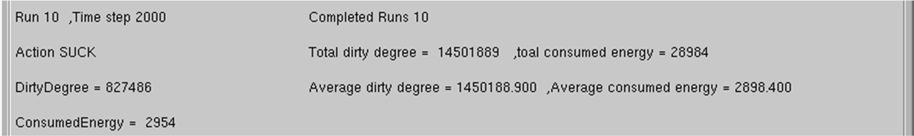
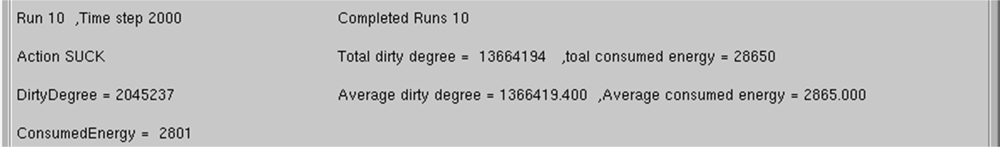
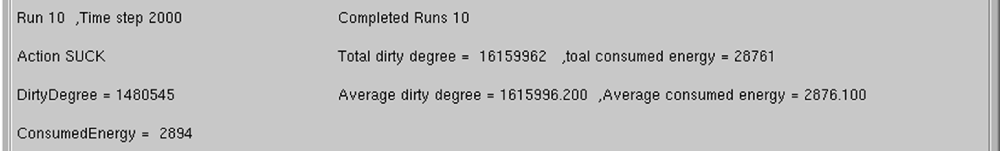

Inteligencia Artificial
=======================
2º Grado en Ingeniería Informática 2011/2012
--------------------------------------------


# Práctica 1: Agentes reactivos
### Germán Martínez Maldonado

### 1. Análisis del problema

En esta práctica vamos a realizar la implementación de un agente reactivo que controlará los movimientos de una aspiradora inteligente. El agente se comportará de una determinada manera en función de las percepciones que reciba de su entorno, para ello usará dos sensores, el primero que indicará si hay suciedad en el lugar donde se encuentra en el momento actual la aspiradora (procediendo con su limpieza en tal caso) y, un segundo sensor, que informará si el último movimiento de la aspiradora ha hecho que esta choque contra algún obstáculo (en cuyo caso, debe variar su trayectoria). Los movimientos se harán de una casilla en una casilla y siempre las únicas direcciones posibles serán arriba, abajo, izquierda o derecha.

El entorno en el que debe realizarse la acción es totalmente desconocido por el agente, incluso el punto de partida, sólo se conocerá el tamaño máximo del mismo y que puede haber obstáculos, que no serán atravesables y que además de rodear completamente la parte externa del campo de movimiento, también se pueden encontrar libremente en cualquier punto del habitáculo.

Conociendo las condiciones de que cada casilla tiene la misma probabilidad de ensuciarse, que la suciedad se mide en unidades enteras, y que cada acción realizada gasta una determinada cantidad de energía (no moverse: 0 puntos de energía, moverse: 1 punto de energía, limpieza: 2 puntos de energía por unidad de suciedad); se buscará obtener el máximo rendimiento energético y la máxima eficiencia de limpieza.


### 2. Descripción de la solución planteada

Los movimientos que realizará la aspiradora serán en gran medida aleatorios, pero con varias restricciones. Como el agente no conoce el entorno en el que se moverá, nos interesará poder representarlo, para que así tenga la memoria suficiente para poder esquivar los obstáculos y no chocarse repetidamente con ellos.

La actividad del agente se resume en los siguientes pasos:

1. Si se detecta que la casilla actual contiene suciedad, se procede con su limpieza, almacenando en memoria que la casilla actual acaba de ser limpiada.
2. Si se detecta que el último movimiento ha producido un choque, se almacena en memoria la posición actual como un obstáculo, y retrocede su trayectoria.
3. Se comprueba si hubiera la posibilidad de que el movimiento a realizar a continuación, se realizase entre dos obstáculos, porque en tal caso, podría darse el caso de que queramos seguir la trayectoria fijada por el movimiento anterior (por ejemplo, considerar recorrer el tramo completo de un pasillo para realizar una limpieza más eficiente, en vez de cambiar constantemente de sentido de movimiento).
4. Si no se diera el caso del punto anterior, se decidiría aleatoriamente el próximo movimiento, pero controlando que no se pueda entrar en un bucle hacia delante hacia atrás en un mismo eje horizontal o vertical.
5. Haciendo uso de la memoria del agente, comprobaremos que el movimiento a realizar no nos llevase a una situación de choque ya producida, y pronosticando que esto fuera a suceder, corregir la dirección del movimiento hacia la casillas accesible que hemos visitado un menor número de veces.
6. Una vez asegurados que el movimiento es válido, procedemos a almacenar la dirección del movimiento a realizar y la posición actual respecto al entorno, actualizamos la posición a la nueva localización e incrementamos el número de veces que hemos pasado por la casilla actual.


### 3. Resultados obtenidos por la solución aportada en los distintos mapas.

* **agent.map:**



* **mapa1.map:**



* **mapa2.map:**



* **mapa3.map:**




### 4. Código fuente de los ficheros agent.cpp y agent.h.

* **agent.h:**

```

#ifndef AGENT__
#define AGENT__

#include <string>

using std::string;

// -----------------------------------------------------------
//				class Agent
// -----------------------------------------------------------

class Environment;

class Agent {
public:

    Agent() {
        int i,
                j;

        bump_ = false;
        dirty_ = false;
        last_action_ = 5;

        for (i = 0; i < 30; i++)
            for (j = 0; j < 30; j++)
                map_[i][j] = 1;

        posX_ = 10;
        posY_ = 10;

        pre_posX_ = posX_;
        pre_posX_ = posY_;

        map_[posX_][posY_]++;
    }

    enum ActionType {
        actUP, actDOWN, actLEFT, actRIGHT, actSUCK, actIDLE
    };

    void Perceive(const Environment &env);
    ActionType Think();

private:
    bool bump_,
    dirty_;

    int last_action_,
    map_[30][30],
    posX_,
    posY_,
    pre_posX_,
    pre_posY_,
    Next_UpDo(int mov),
    Next_LeRi(int mov);

    void Print_Map();
};

string ActionStr(Agent::ActionType);

#endif
```

* **agent.cpp:**

```
#include "agent.h"
#include "environment.h"
#include <cstdlib>

// -----------------------------------------------------------

Agent::ActionType Agent::Think() {
    int next_action;

    if (dirty_) {
        last_action_ = 4;
        map_[posX_][posY_] = 1;
        return actSUCK;
    } else if (bump_) {
        map_[posX_][posY_] = 0;
        posX_ = pre_posX_;
        posY_ = pre_posY_;
    }

    if (last_action_ < 2 and map_[posX_][posY_ - 1] == 0 and map_[posX_][posY_ + 1] == 0)
        next_action = last_action_;
    else if (last_action_ > 1 and last_action_ < 4 and map_[posX_ + 1][posY_] == 0 and map_[posX_ - 1][posY_] == 0)
        next_action = last_action_;
    else {
        next_action = rand() % 4;

        if (last_action_ < 2 and next_action < 2 and last_action_ != next_action)
            next_action = next_action + 2;
        else if (last_action_ < 4 and last_action_ > 1 and next_action > 1 and last_action_ != next_action)
            next_action = next_action - 2;
    }

    switch (next_action) {
        case 0:
            if (map_[posX_ - 1][posY_] == 0)
                next_action = Next_UpDo(next_action);
            break;

        case 1:
            if (map_[posX_ + 1][posY_] == 0)
                next_action = Next_UpDo(next_action);
            break;

        case 2:
            if (map_[posX_][posY_ - 1] == 0)
                next_action = Next_LeRi(next_action);
            break;

        case 3:
            if (map_[posX_][posY_ + 1] == 0)
                next_action = Next_LeRi(next_action);
            break;
    }

    last_action_ = next_action;

    pre_posX_ = posX_;
    pre_posY_ = posY_;

    switch (next_action) {
        case 0: posX_ = posX_ - 1;
            break;
        case 1: posX_ = posX_ + 1;
            break;
        case 2: posY_ = posY_ - 1;
            break;
        case 3: posY_ = posY_ + 1;
            break;
    }

    map_[posX_][posY_]++;

    return static_cast<ActionType> (next_action);
}

// -----------------------------------------------------------

int Agent::Next_UpDo(int mov) {
    int next_action;

    if (map_[posX_][posY_ - 1] != 0 and map_[posX_][posY_ - 1] < map_[posX_][posY_ + 1])
        next_action = 2;
    else if (map_[posX_][posY_ + 1] != 0 and map_[posX_][posY_ + 1] < map_[posX_][posY_ - 1])
        next_action = 3;
    else if (map_[posX_][posY_ - 1] == 0 and map_[posX_][posY_ + 1] != 0)
        next_action = 3;
    else if (map_[posX_][posY_ + 1] == 0 and map_[posX_][posY_ - 1] != 0)
        next_action = 2;
    else if (map_[posX_][posY_ - 1] != 0 and map_[posX_][posY_ + 1] != 0)
        next_action = rand() % 3 + 2;
    else {

        if (mov == 0)
            next_action = 1;
        else
            next_action = 0;
    }

    return next_action;
}

int Agent::Next_LeRi(int mov) {
    int next_action;

    if (map_[posX_ - 1][posY_] != 0 and map_[posX_ - 1][posY_] < map_[posX_ + 1][posY_])
        next_action = 0;
    else if (map_[posX_ + 1][posY_] != 0 and map_[posX_ + 1][posY_] < map_[posX_ - 1][posY_])
        next_action = 1;
    else if (map_[posX_ - 1][posY_] == 0 and map_[posX_ + 1][posY_] != 0)
        next_action = 1;
    else if (map_[posX_ + 1][posY_] == 0 and map_[posX_ - 1][posY_] != 0)
        next_action = 0;
    else if (map_[posX_ - 1][posY_] != 0 and map_[posX_ + 1][posY_] != 0)
        next_action = rand() % 2;
    else {

        if (mov == 2)
            next_action = 3;
        else
            next_action = 2;
    }

    return next_action;
}

void Agent::Print_Map() {
    int i, j;

    printf("\n");

    for (i = 0; i < 30; i++) {
        for (j = 0; j < 30; j++)
            printf("%d ", map_[i][j]);

        printf("\n");
    }
}

// -----------------------------------------------------------
// -----------------------------------------------------------
// -----------------------------------------------------------
// -----------------------------------------------------------

void Agent::Perceive(const Environment &env) {
    bump_ = env.isJustBump();
    dirty_ = env.isCurrentPosDirty();
}

// -----------------------------------------------------------

string ActionStr(Agent::ActionType action) {
    switch (action) {
        case Agent::actUP: return "UP";
        case Agent::actDOWN: return "DOWN";
        case Agent::actLEFT: return "LEFT";
        case Agent::actRIGHT: return "RIGHT";
        case Agent::actSUCK: return "SUCK";
        case Agent::actIDLE: return "IDLE";
        default: return "???";
    }
}
```
