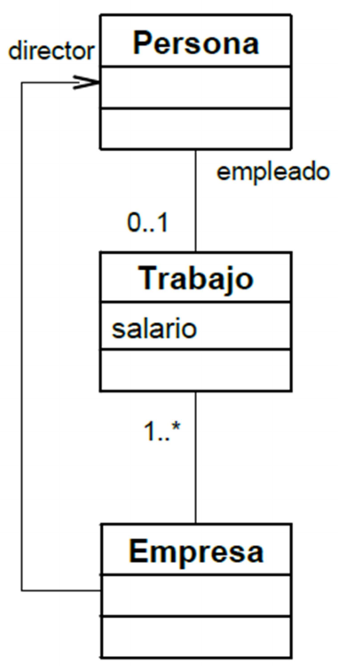

Programación y Diseño Orientado a Objetos
=========================================
2º Grado en Ingeniería Informática 2011/2012
--------------------------------------------


# Relación de problemas. Tema 2: Clases y métodos
### Germán Martínez Maldonado

### Ejercicio 3. Dada la clase Java:

```
public class Prueba {
    public static int a = 1; 
    public int b = 2;
}
```

**a. ¿Cuántos atributos tiene? Indica si se trata de atributos de instancia o de clase.**

Tiene 2 atributos, “a” que es un atributo de clase y “b” que es un atributo de instancia.

**b. Indica cuál es el estado de obj1 y obj2 después de ejecutar la siguiente secuencia de código:**

```
Prueba obj1 = new Prueba(); 
Prueba obj2 = new Prueba(); 
obj1.a = 3;
obj1.b = 4;
obj2.a = 5;
obj2.b = 6;
```

Después de ejecutar la secuencia de código, obj1.b tiene un valor de 4 e obj2.b tiene un valor de 6, obj1.a y obj2.a como hacen referencia a una variable de clase, aunque se acceda a través de dos instancias diferentes de la clase, el objeto es el mismo, porque si se cambia el valor en uno, también se verá reflejado en el otro, por eso obj1.a y obj2.a después de la ejecución tendrán el mismo valor de 5.

**c. ¿Se produciría algún error de compilación? ¿Por qué? (Recomendación: ejecutar el código para comprobarlo).**

No se produciría ningún error de compilación, ya que todas las operaciones se pueden hacer directamente al ser la clase y los atributos de visibilidad pública.


### Ejercicio 5. Razona si las siguientes afirmaciones son ciertas o falsas:

**a. Los atributos de clase son accesibles sólo desde métodos de clase (no desde métodos de instancia)**

Los atributos de clase son accesibles tanto desde métodos de clase como desde métodos de instancia, pero siempre teniendo en cuenta que el modificar un atributo de clase afecta por igual a todas las instancias de una misma clase.

**b. Los atributos de instancia son accesibles sólo desde métodos de instancia (no desde métodos de clase).**

Los atributos de instancia son accesibles desde los métodos de instancia y los métodos de clase, pero no directamente desde estos últimos, porque los métodos de clase no conocen las instancia existentes de una clase, suponiendo que existen los métodos pertinentes, para que una método de clase pueda acceder a los atributos de esa instancia, deberá recibir mínimo una referencia sobre a los atributos de que instancia va a acceder, de otra manera no es posible el acceso.

**c. La palabra reservada “this” (Java) / “self” (Smalltalk) puede emplearse tanto en métodos de clase como de instancia.**

No, porque “this” y “self” se refieren a un atributo de la propia instancia, pero como los métodos de clase no pertenecen a una instancia en concreto, sino a una a la clase en general, no es posible referenciarlos de esta forma.


### Ejercicio 6. Razona si las afirmaciones siguientes sobre la clase Empleado son verdaderas o falsas:

```
Object subclass: #Empleado 
instanceVariableNames: ‘dni nombre’ 
classVariableNames:’PorcentajeRetencion’ 
poolDictionaries:’MiPoolDiccionario’
Smalltalk at:#MiPoolDiccionario put:Dictionary new.
MiPoolDiccionario at:#Var1 put:valor
```

**a. Empleado es una variable global.**

No, empleado es el nombre de la clase.

**b. Smalltalk es una variable global.**

Sí, y además contiene todas las variables globales conocidas por el entorno.

**c. Smalltalk inspect permite ver todas las variables globales.**

Sí, porque muestra las variables de Smalltalk, que son las variables globales.

**d. PorcentajeRetencion es una variable de clase.**

Sí, porque es declarada en “classVariableNames”.

**e. dni es una variable de instancia.**

Sí, porque es declarada en “instanceVariableNames”

**f. dni es una variable privada.**

Sí, pero porque en Smalltalk la visibilidad es siempre privada.

**g. MiPoolDiccionario es una variable global.**

Sí, porque es declarada en “poolDictionaries”, y todas las variables declaradas aquí son variables globales que además, son también guardadas en el diccionario de Smalltalk.

**h. Var1 es una variable semi-global.**

Sí, porque es una variable dentro de una variable global.


### Ejercicio 7. ¿Cuántos constructores distintos puede tener una clase? ¿Qué los diferencia?

Tantos como se quiera, siempre que al recibir diferentes argumentos (ya sea en número o tipo), sobrecarguen la declaración del constructor.


### Ejercicio 9. En el código claseAlumno1.txt (está en SWAD, corresponde a la sesión 1 de la práctica 1) ¿Con qué especificador de acceso se han declarado los atributos y métodos? ¿Crees que esta elección es la óptima? En caso negativo, indica qué especificadores de acceso emplearías.

Como no se especifica ningún identificador de acceso, todos se considerarán privados, lo que estará bien para los atributos, pero no para todos los métodos, sobre todo para el constructor, que como normalmente querremos crear instancias de una de clase desde otra clase, este método debe ser público.


### Ejercicio  10. ¿Qué  mecanismos  tienen  Java  y  Smalltalk  para  ocultación  de información?

El principal mecanismo para la ocultación de información en todos los lenguajes de programación orientada a objetos es el uso de clases, que encapsulan la información sobre la misma, pero además, también en Java mediante los especificadores de acceso, podemos restringir la visibilidad de clases, atributos y métodos según queramos que se accesible de forma privada, publica, protegida o paquete.


### Ejercicio 13. Escribe el código Java y Smalltalk correspondiente a las clases que aparecen en el siguiente diagrama de clases sin olvidar los atributos de referencia y haciendo uso del nombre de los roles que figuran en el diagrama.

```
public class LoyaltyProgram { 
    String name; 
    ArrayList<ServiceLevel> levels;
    ArrayList<Customer> participants;

    void enroll(Customer c){ 
        participants.add(c);
    }
}

public class Customer { 
    String name;
    String title; 
    boolean isMale; 
    Date dateofBirth; 
    int age;
    ArrayList<LoyaltyProgram> programs;

    int age(){ 
        return age;
    }
}

public class ServiceLevel { 
    String name;

    ArrayList<Membership> memberships;
}

public class Membership {
    …
}

Object subclass: #LoyaltyProgram 
    instanceVariableNames: 'name levels participants' 
    classVariableNames: ''
    poolDictionaries: '' 
    category: 'PrimeraPractica'

enroll: c
    participants add: c.

Object subclass: #Customer
    instanceVariableNames: 'name title isMale dateOfBirth age programs' 
    classVariableNames: ''
    poolDictionaries: '' 
    category: 'PrimeraPractica'

age:
    ^age.

Object subclass: #ServiceLevel 
    instanceVariableNames: 'name' 
    classVariableNames: '' 
    poolDictionaries: ''
    category: 'PrimeraPractica'

Object subclass: #Membership 
    instanceVariableNames: '' 
    classVariableNames: '' 
    poolDictionaries: '' 
    category: 'PrimeraPractica'
```

### Ejercicio  14.  En  el  código  que  has  generado,  ¿qué  implicación  tendrá  la restricción {ordered}? ¿Qué harías para asegurarte de que se cumple?

Como la restricción indica que los objetos tienen que ir ordenados, incluiría un atributo numérico a la clase ServiceLevel, así este funcionaría como índice para mantener un orden establecido, que me permitiría mantenerlos ordenados.


### Ejercicio UML



La clase Trabajo no tiene atributos de referencia porque no soporta la función de mantener ninguna relación con otra clase, son las otras clases las encargadas de mantener la relación con la clase Trabajo, por lo cual cuentan con sus correspondientes atributos de referencia.


### Ejercicios KernelClass

**1) Cuál es el método para consultar variables de instancia.**

KernelClass >> Behavior >> accessing instances and variables >> allInstVarNames

**2) Cuál es el método para consultar variables de clase.**

KernelClass >> Behavior >> accessing instances and variables >> allClassVarNames

**3) Cuál es el método para consultar métodos de instancia.**

KernelClass >> Behavior >> accessing method dictionary >> Alumno methodDictionary

**4) Cuál es el método para añadir una variable de instancia a una clase en tiempo de ejecución.**

KernelClass >> ClassDescription >> instance variables >> addInstVarName: aString

**5) Cuál es el método para borra una variable de instancia de una clase en tiempo de ejecución.**

KernelClass >> ClassDescription >> instance variables >> removeInstVarName: aString
