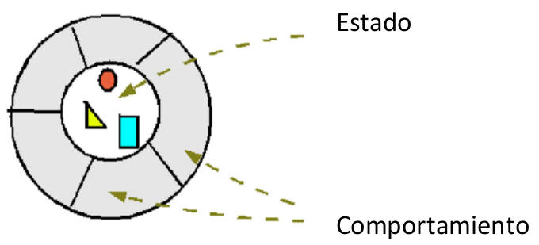

Programación y Diseño Orientado a Objetos
=========================================
2º Grado en Ingeniería Informática 2011/2012
--------------------------------------------

# Relación de problemas. Tema 3: Objetos y mensajes
### Germán Martínez Maldonado

**1. Sabiendo  que  la  siguiente  imagen  representa  un  objeto ¿Qué puede simbolizar cada una de las partes señaladas?**

**3. ¿Qué encapsula un objeto? De todo lo que encapsula, ¿qué se recomienda que esté oculto?**

Un objeto encapsula el estado y el comportamiento, siendo recomendado que este oculto el estado para que no puede ser modificado por ningún elemento externo.

**4. Uno de los mecanismos para copiar estado es usar el constructor de copia ¿hay que usarlo siempre que necesitemos una nueva referencia a un objeto que ya esté creado?**

Para crear una nueva referencia a un objeto copiando solo el estado, podemos usar la asignación, siempre que el lenguaje proporcione las operaciones para la copia de estados mediante asignación.

**6. ¿Por qué la siguiente afirmación: “El estado de un objeto viene definido por el valor que toman sus atributos básicos” es falsa?**

Porque el estado de un objeto no tiene que estar compuesto solo por atributos de tipos primitivos básicos, también puede estar formado por un conjunto de objetos, que a su vez estén compuestos por conjuntos de objetos, y así hasta que lleguemos a un conjunto que este compuesto de tipos primitivos.

**10. ¿Qué es más eficiente, la ligadura dinámica o la estática?¿Por qué?**

La ligadura estática es más eficiente, porque todo lo relacionado con ella se resolverá en tiempo de compilación, conociendo totalmente su comportamiento para cuando llegue el momento de la ejecución.

**13. Considerando las variables declaradas en la pregunta anterior, indica qué devuelven las siguientes expresiones de envío de mensajes:**

* **x.getClass()**: “[I”, indicando que es del tipo vector de enteros.
* **x.getClass().equals(d.getClass())**: “true”, porque los dos devuelven un objeto “[I”.
* **x.getClass()==d.getClass()**: “true”, porque los dos devuelven “[I”.

**14. Indica a continuación si hay errores de compilación o ejecución en las siguientes instrucciones relacionadas con el uso de las clases envoltorio de Java:**

* **Integer i=Integer.parseInt("5");**: No hay error.
* **Integer i=Integer.valueOf("h12");**: No se puede devolver un entero obtenido de la cadena “h12”.
* **float f=Float.floatValue();**: f es una variable de instancia y Float.floatValue() una llamada a un método de clase.
* **Float f2=new Float(3); f=f2.floatValue();**: No hay error.
* **double d=Double.doubleValue(3.4);**: El método doubleValue() no acepta ningún argumento, además que volvería a estar el problema de hacer una llamada a un método de clase para asignar el resultado a una variable de instancia.
