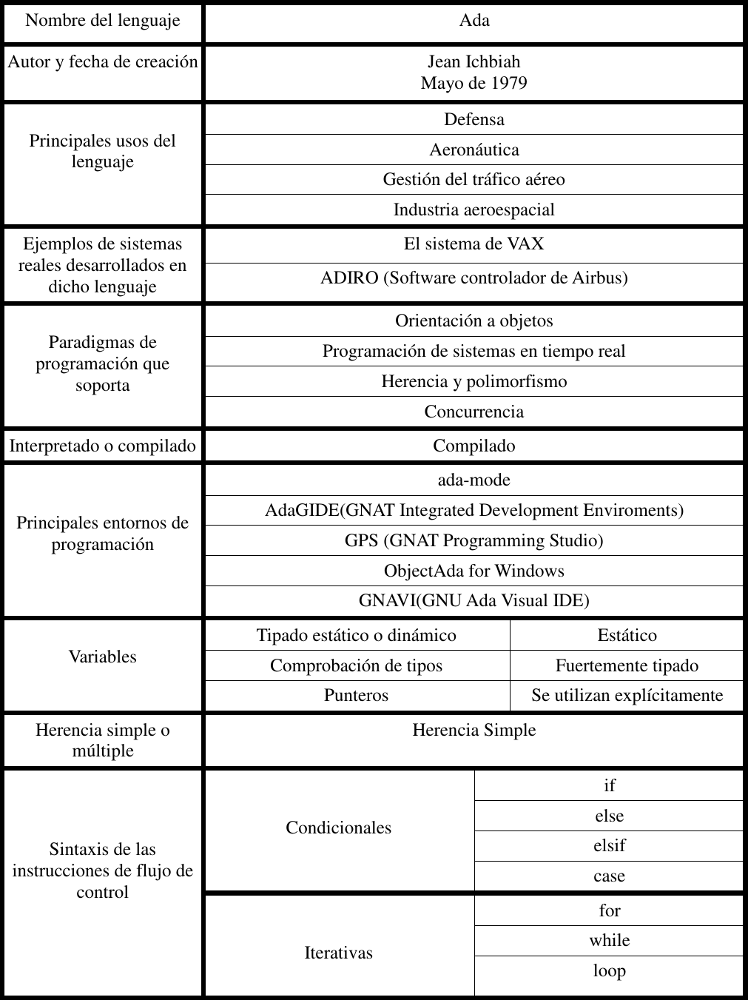
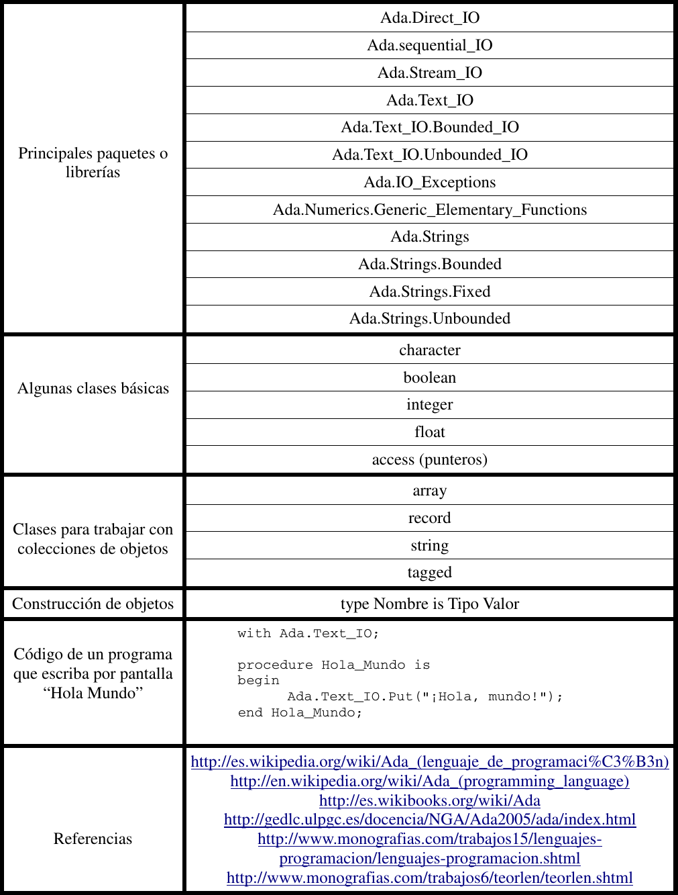

Programación y Diseño Orientado a Objetos
=========================================
2º Grado en Ingeniería Informática 2011/2012
--------------------------------------------

# Lenguajes de programción orientados a objetos
### Germán Martínez Maldonado
### José Rubén Sánchez Iruela
### Pablo Sánchez Robles

