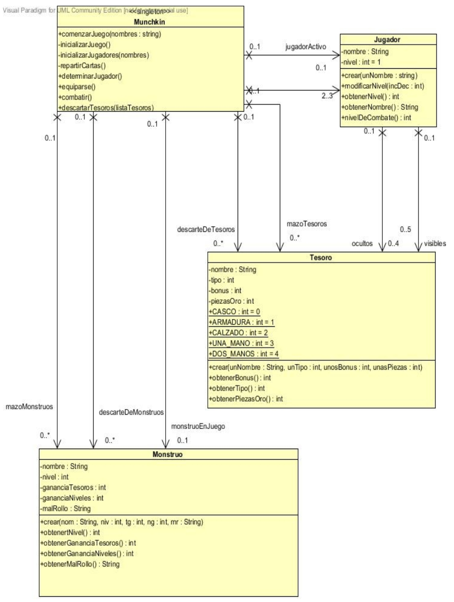
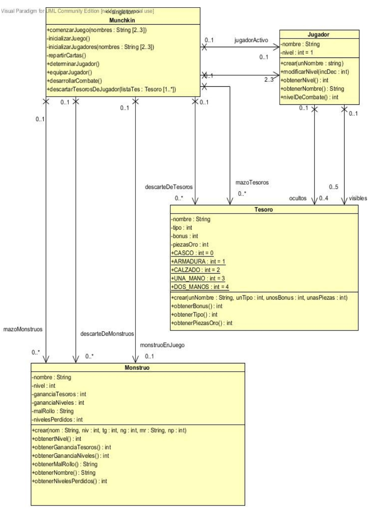

Programación y Diseño Orientado a Objetos
=========================================
2º Grado en Ingeniería Informática 2011/2012
--------------------------------------------


# Práctica 2: Implementación del diseño de una estructura de clases
### Germán Martínez Maldonado
### José Rubén Sánchez Iruela
### Pablo Sánchez Robles

### Competencias específicas de la primera práctica

* Interpretar correctamente diagramas de clases del diseño en UML.
* Implementar el esqueleto de clases (cabecera de la clase, declaración de variables y declaración de métodos) en Java y Smalltalk, así como sus relaciones (principalmente las asociaciones).

### Primera sesión

####A) Descripción del problema: La dinámica del juego

En el juego pueden participar de 2 a 3 jugadores, identificados por un nombre único y cuyo nivel inicial es 1. Gana el juego aquel que llegue primero al nivel 10.

En Muchkin hay dos barajas de cartas: monstruos y tesoros. Los jugadores deben combatir con los monstruos y para ello pueden usar los tesoros, tal y como se describe a continuación.

**Tesoros**:

* Bonus
* Nombre
* Valor en piezas de oro
* Tipo

Los tesoros poseen un nombre, valen una cierta cantidad de piezas de oro, y suponen al jugador que los tiene poder enfrentarse a un monstruo con un cierto número de niveles adicionales a los que él tiene como jugador (lo que se denomina un bonus). Hay varios tipos de tesoros: de mano (una o dos manos), cubrecabezas, calzado y armadura.

Hay tesoros sin bonus, cuya utilidad es simplemente la de su valor en piezas de oro. La carta con bonus “uff” puede tomarse como bonus +5. Si alguna carta tiene dos valores de bonus (por ejemplo +2/+5), se usará con el bonus menor.

Cada jugador puede equiparse con un único tesoro de cada tipo (salvo los tesoros que sólo ocupan una mano, en cuyo caso puede tener dos). Así, cada jugador podría equiparse en el mejor de los casos con una armadura, un tesoro de dos manos, un cubrecabezas y un calzado, o con una armadura, dos tesoros de una mano, un cubrecabeza y un calzado.

Las cartas “equipadas” se muestran a todos los jugadores. Cada jugador podrá tener además hasta cuatro tesoros “ocultos” en la mano. En el combate contra un monstruo, al jugador se sumará el bonus de todos sus tesoros equipados, no así el de sus tesoros ocultos. Al final de cada turno, el jugador podrá equiparse de nuevos tesoros (haciendo visible una o varias cartas que tenga en la mano), respetando las restricciones comentadas anteriormente.

**Monstruos**:

* Nombre
* Nivel
* Buen rollo: Ganancia en caso de vencerle
* Mal rollo: Pérdida en caso de que te derrote

Los monstruos poseen un nombre que los identifica y tienen un cierto nivel, en la carta correspondiente al monstruo, además se indica cuántos niveles y/o tesoros gana  el jugador que le venza y cuántos tesoros (ocultos y/o visibles) y/o niveles pierde el que sucumba. Si el mal rollo es la muerte, entonces el jugador pierde todos sus tesoros (visibles y ocultos) y vuelve a quedar con nivel 1.

Por defecto, al vencer a un monstruo se sube un nivel, a no ser que el monstruo indique explícitamente que se suben más, como por ejemplo:

**Juego**

La partida se inicia repartiendo 2 tesoros a cada jugador. El jugador que comienza el juego se decide al azar, y después se sigue el orden de las agujas del reloj.

En su turno, el jugador debe sacar una carta del mazo de monstruos y combatir contra él. Si el monstruo tiene un nivel inferior al nivel total del jugador (su nivel más el bonus de todos los tesoros que tenga equipados), gana el jugador y se aplica el “buen rollo” correspondiente (sube un nivel – o más si así lo indica el monstruo – y roba el número de tesoros que se indique). Si el monstruo tiene un nivel mayor o igual, el jugador tiene la posibilidad de intentar huir tirando un dado. Si el resultado es 5 o 6, entonces el jugador logra huir y se queda tal y como estaba. En caso contrario, se aplica el “mal rollo” indicado por el monstruo: el jugador se descarta de los tesoros y pierde el número de niveles que se indique.

El nivel mínimo de un jugador es 1, es decir, que si un jugador tiene nivel 2 y sucumbe ante un monstruo cuyo mal rollo es bajar 3 niveles, se queda con nivel 1 (nunca se puede quedar en negativo o cero).

En el caso de que después de perder contra un monstruo un jugador quedase  en situación de muerte (nivel 1 y ningún tesoro), en su propio turno robará dos cartas que podrá equiparse antes de sacar el monstruo con el que vaya a combatir.

El robo de tesoros se hace siempre oculto. Después del combate, el jugador puede equiparse las cartas que considere oportuno. En caso de quedarse con más de 4 cartas ocultas, deberá descartar las que juzgue que le serán menos útiles hasta quedarse con un máximo de 4 cartas ocultas.

Las cartas visibles no pueden pasar nunca a ser ocultas. Por ejemplo, un jugador no puede cambiar un cubrecabezas que se haya equipado por otro con un bonus mayor que tenga en la mano. Sin embargo, sí podrán ser susceptibles de ser elegidas como descartes cuando el mal rollo del monstruo no indique qué tipo de tesoros se pierden.

Finalmente, es posible comprar un nivel con 1.000 piezas de oro. La compra se realizará al principio del turno del jugador, antes de combatir con el monstruo que haya tocado. Para ello, el jugador deberá descartarse de tantos tesoros como sea necesario para sumar dicha cantidad. Es posible comprar tantos niveles como se crea conveniente (1 nivel – 1000 piezas de oro, 2 niveles – 2000 piezas de oro), y es posible usar tesoros tanto visibles como ocultos.

Para expertos en Munckin:

Se trata de una versión muy simplificada del juego original, en la que no es posible:
 * Equiparse monstruos.
 * Ayudar / incordiar a otros jugadores.
 * Tener malos rollos dependientes del sexo, nombre, edad o rol del jugador.

#### B) Tarea a realizar

Para comprender mejor cómo son las reglas del juego, nada mejor que jugar a Munchkin. Se han preparado las barajas que vamos a emplear en la práctica para que juguéis.

En la siguiente dirección web tenéis un dado para usar cuando tenéis que huir.  

[http://www.random.org/dice/?num=1](http://www.random.org/dice/?num=1)

### Segunda sesión

**Tareas para hacer:**

1) A partir del diagrama de clases del diseño de la siguiente página implementar en Java cada una de sus clases (clase, atributos y cabecera de los métodos) y asociaciones (atributos de referencia), teniendo en cuenta lo siguiente:

La clase Munchkin debe ser un Singleton. Se dice que una clase es un singleton cuando sólo puede tener una instancia. Para conseguir esto utilizamos el código que nos indica el patrón de diseño singleton, que es el siguiente (suponiendo que sea Miclase la que debe ser un singleton):

```
public class MiClase {

    private static final MiClase instance = new MiClase();

    // Private constructor prevents instantiation from other classes
    private MiClase() { }

    public static MiClase getInstance() {
        return instance;
    }
}
```

Más información: [http://en.wikipedia.org/wiki/Singleton_pattern](http://en.wikipedia.org/wiki/Singleton_pattern)

Hacer un estudio de cuál sería la colección de objetos más adecuada para la implementación de los atributos de referencia. En concreto, se debe estudiar en primer lugar cuáles son las interfaces más adecuadas para su definición: List, Set o Map; y en segundo lugar, qué clase usamos para implementar las interfaces:

1. Si se ha optado por la interfaz Map, la clase HashMap o TreeMap.
2. Si se ha optado por la interfaz List, la clase ArrayList o LinkedList.
3. Si se ha optado por la interfaz Set, la clase HashSet o TreeSet.

2) Por último implementar el método privado inicializarJuego() de la clase Munchkin, en el que se crean todas las cartas de Tesoro y Mostruos que hay en el juego, de la forma que se indica a continuación.

* Para todos los tesoros:

`mazoTesoros.add(new Tesoro(nombre, tipo, bonus, piezas));`

* Para todos los monstruos:

`mazoMonstruos.add(new Monstruo(nombre,nivel, gananciaTesoros, gananciaNivel, malRollo);`

Nota: Tenéis que implementar antes los constructores de Tesoro y Monstruo.



### Tercera sesión

**Tareas para hacer:**

1. Modificar el código java implementado en la sesión anterior con los cambios introducidos en el diagrama de clases del diseño (página siguiente). Las modificaciones han sido:

* Renombrar algunos métodos de la clase Munchkin para que sus nombres sean más significativos.

* Introducir un nuevo atributo nivelesPerdidos en la clase Monstruo, que indique los niveles que se pierden en los casos en que el mal rollo del Monstruo indique una pérdida de nivel. Además de introducir este atributo en la clase java, habrá que cambiar las cartas que se introdujeron en el método inicializarJuego.

2. A partir del diagrama de clases del diseño de la siguiente página implementar en Smalltalk cada una de la clases (clase, atributos y cabecera de los métodos) y las asociaciones (atributos de referencia), teniendo en cuenta lo siguiente:

* La clase Munchkin debe ser un Singleton. Se dice que una clase es un singleton cuando sólo puede tener una instancia. Para conseguir esto utilizamos el código que nos indica el patrón de diseño singleton, que es el siguiente (suponiendo que sea Miclase la que debe ser un singleton):

```
Object subclass: #MiClase
instanceVariableNames: ' '
classVariableNames: ''
poolDictionaries: ''
category: 'PruebaPatrones'

"definir una variable de instancia de la clase MiClase"
MiClase class 
 instanceVariableNames: 'instancia'

"metodo de clase" 
getInstance
    instancia ifNil:[instancia := super new].
    ^instancia

new
^ self error: 'Esta clase solo tiene una instancia, usa getInstance para obtenerla'
```

* Hacer un estudio de cuál sería la colección de objetos más adecuada para la implementación de los atributos de referencia considerando las clases: Array, LinkedList, Stack y OrderedCollection.

1. Implementar el método privado inicializarJuego() de la clase Munchkin, en el que se definen todas las cartas de Tesoro y Monstruos que hay en el juego, de forma equivalente a como se hizo en Java.
2. Implementar tanto en Java (si no lo tenías hecho) como en Smalltalk, los métodos de las clases Tesoro, Monstruo y Jugador (no olvides los constructores).



### Explicación

#### Tipos de colecciones usadas en Java

Hemos usado la interface List, porque por definición, como su nombre indica, es el más indicado para listas, y como en nuestro caso, se puede considerar los mazos de cartas como listas que tienen un orden establecido.

En el caso de las otras interfaces, Set, aunque se podría asemejar por el hecho de los mazos de cartas se pueden considerar conjuntos, ya que no hay cartas repetidas, pero por definición no tienen un orden arbitrario definido y, Map, al ser una estructura mucho más compleja, además de que nuestro caso no se asemeja a un caso recomendable de usar pares clave/valor, queda también descartado.

Ya dentro de la interface List, hemos usado tanto la clase ArrayList como la clase LinkedList. La clase ArrayList ha sido usada para representar las cartas que tenemos en la mano, porque al ser de un número tan reducido, que incluso podríamos fácilmente manejar con un simple vector de cartas, la clase ArrayList nos va a proporcionar sobradamente los mecanismos necesarios para manejar las cartas, siendo la clase LinkedList algo más complejo para esta situación tan simple. Para los mazos de cartas de tesoros y monstruos hemos usado la clase LinkedList, porque ahora si nos interesará que todas las cartas del mazo estén bien conectadas para que se conozca y mantenga perfectamente el orden establecido, además que como de los mazos sólo haremos inserciones y extracciones al principio de los mismos, esto se hace de manera muy efectiva con esta clase.

#### Tipos de colecciones usadas en SmallTalk

En SmallTalk hemos usado las colecciones LinkedList y OrderedCollection. Las colecciones Array aunque fácilmente podríamos usarla para gestionar las cartas que tenemos en la mano, preferimos las facilidades que proporcionan las colecciones OrderedCollection, y las colecciones Stack serían perfectas para manejar los mazos de las cartas de tesoros y de monstruos, ya que, un mazo es en esencia una pila, donde las extracciones se hacen por el tope, pero esta colección no proporciona métodos para la mezcla de elementos como si proporciona LinkedList, y esto es totalmente necesario, porque en todos los juegos de cartas, siempre antes de empezar a jugar, se barajan las cartas para que estas no tengan ya un orden establecido.

Por lo dicho anteriormente, usaremos para gestionar las cartas en la mano, la colección OrderedCollection, que nos permite manipular fácilmente colecciones de objetos, que como en este caso, son de reducidas dimensiones y, para gestionar los mazos de cartas de monstruos y tesoros, usaremos colecciones LinkedList por las mismas ventajas que hemos indicado para usarlas en Java, y además porque en este caso en comparación con Stack, nos es primordial poder barajar los elementos de la colección.
