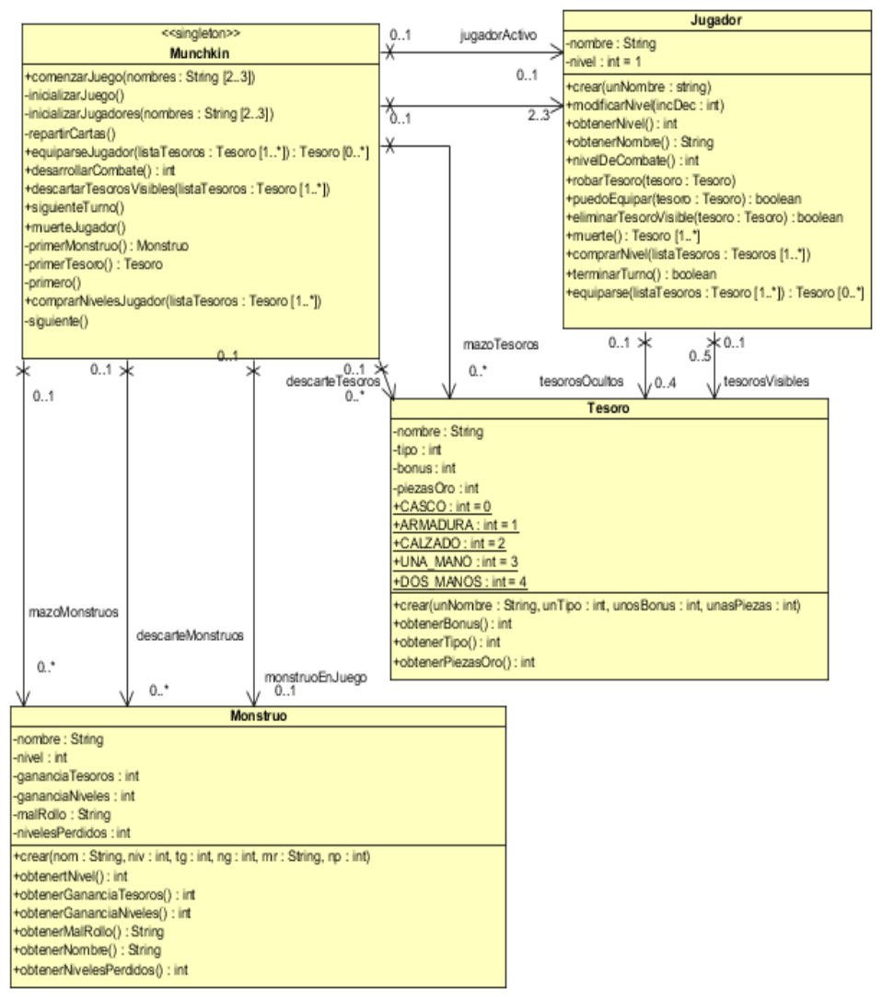
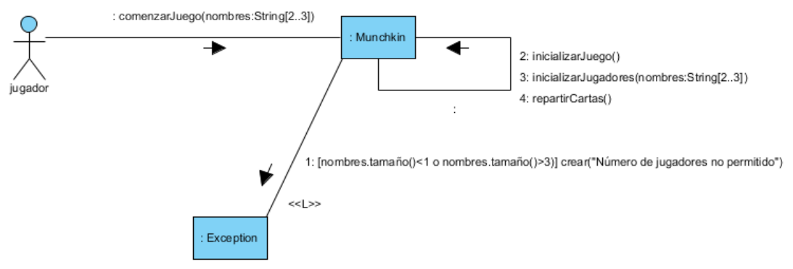
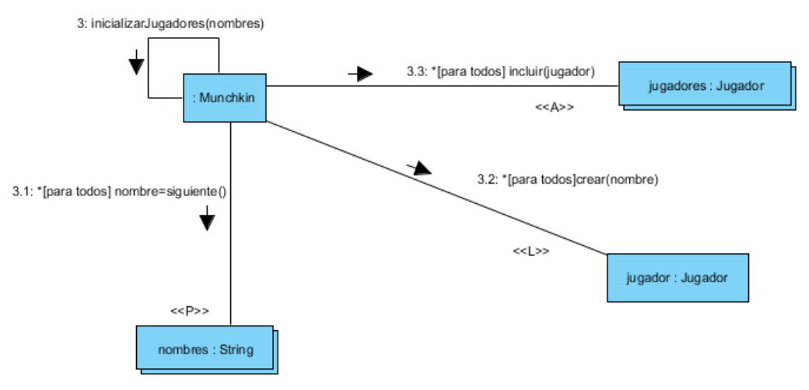
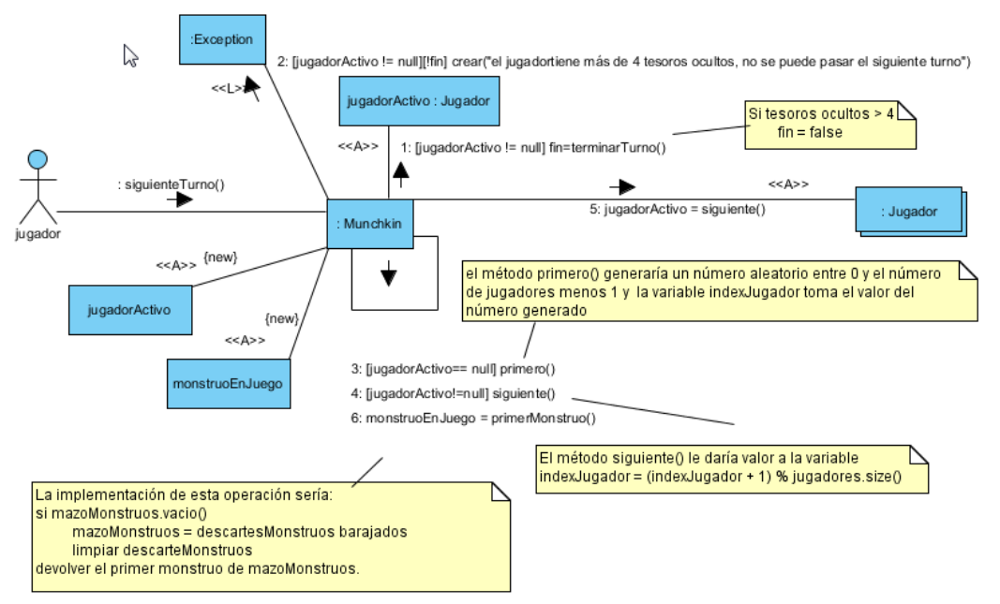
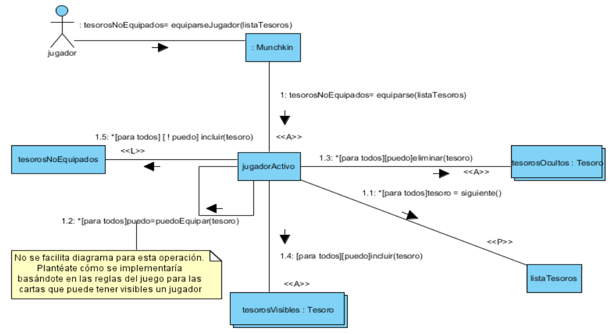
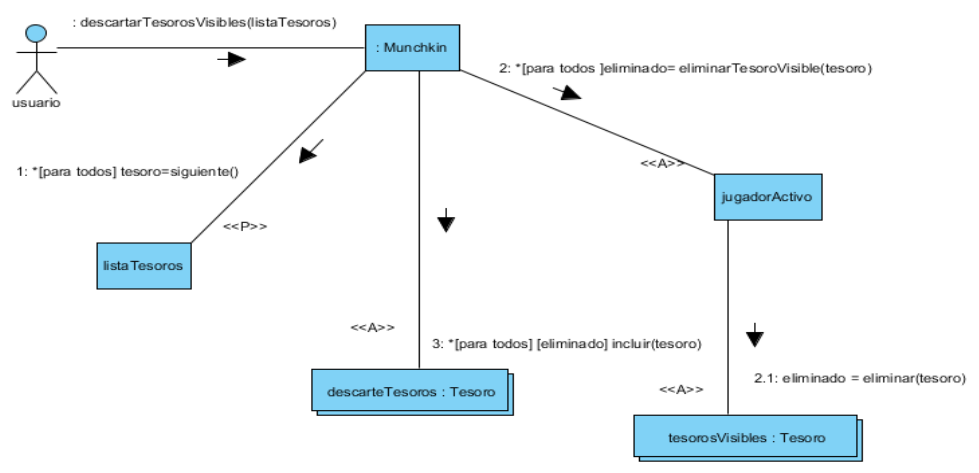
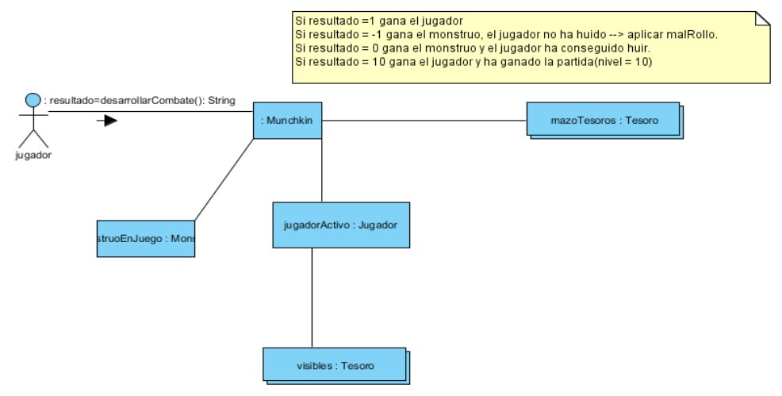
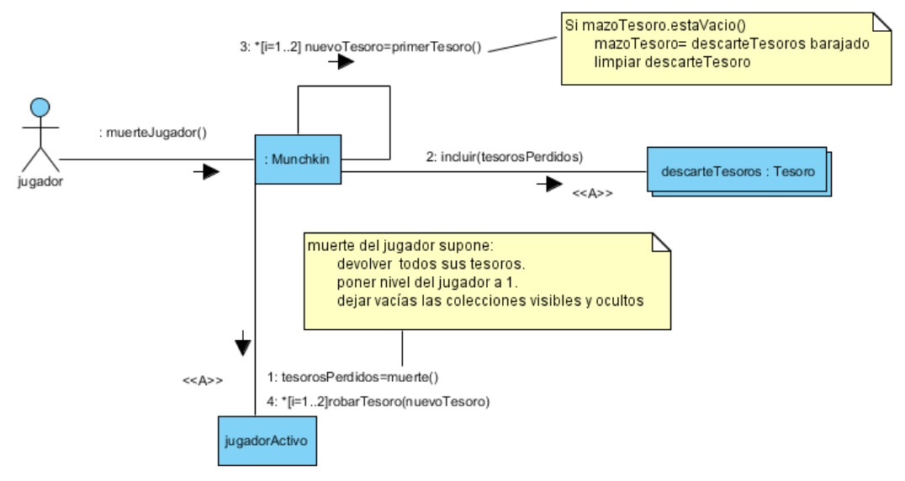
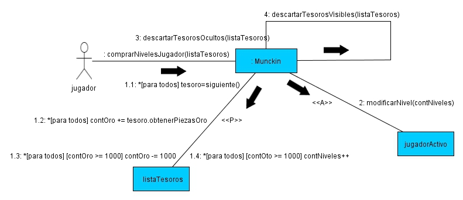

Programación y Diseño Orientado a Objetos
=========================================
2º Grado en Ingeniería Informática 2011/2012
--------------------------------------------


# Práctica 3: Implementación del diseño de la interacción de objetos
### Germán Martínez Maldonado
### José Rubén Sánchez Iruela
### Pablo Sánchez Robles

**Tareas para hacer:**

1) Modificar la implementación del diagrama de clases, incorporando las nuevas operaciones surgida
sde los diagramas de interacción. Las clases que han cambiado son Munchkin y Jugador



2) Implementar las siguientes operaciones:

* **comenzarJuego(nombre:String[2..3]**

Se encarga de inicializar los mazos de cartas de Tesoros y de Monstruos, de inicializar los jugadores proporcionándoles un nombre y de repartir dos cartas de Tesoro a cada jugador. Para esto invoca a las correspondientes operaciones que están representadas en los siguientes diagramas de comunicación. La operación inicializarJuego, que se encarga de inicializar los mazos, se implementó en la práctica 2.

Diagrama principal:



Diagrama subordinado: **inicializarJugadores(nombres)**



Diagrama subordinado: **repartirCartas()**


* **siguienteTurno()**

Operación que actualiza jugadorActivo (jugador que tiene el turno) e indica el munstruo con el que tiene que enfrentarse (monstruoEnJuego).



* **equiparseJugador(listaTesoros:Tesoro[1..*]):Tesoro[1..*]**

Pasa los tesoros del jugador en listaTesoros de ocultos a visibles. La operación devuelve una colección con los tesoros que no se haya podido equipar el jugador si no se lo permitan las reglas del juego, y null en caso de que pueda equipárselos todos.



* **descartarTesorosVisibles(listaTesoros:Tesoro[1..*])**

Operación encargada de pasar a la pila de descartes de tesoros los tesoros visibles del jugador activo indicados en listaTesoros.



* **desarrollarCombate()**

El algoritmo general de la operación es el siguiente:

```
Si (nivelM < nivelJ)

    tesorosGanados = monstruoEnJuego.obtenerGananciaTesoros(); 
    para(i=1..tesorosGanados){
        jugadoractivo.robarTesoro(primerTesoro());
    }
    jugadoractivo.modificarNivel(monstruoEnJuego.obtenerGananciaNiveles()); 
    si (nivelJ = 10)
        resultado = 10;
    si no
        resultado = 1;

Si (nivelM >= nivelJ){
    dado = numero aleatorio entre 1 y 6; 
    si (dado < 5){
        jugadorActivo.modificarNivel(monstruoActivo.obtenerNivelesPerdidos()); 
        resultado = -1;
    }
    si no {
        resultado = 0
    }
devolver resultado
```

El esquema de las relaciones entre objetos del diagrama de comunicación correspondiente a la operación desarrollarCombate() es:



* **muerteJugador()**

Esta operación se encarga de dejar el nivel del jugador a 1, quitarle todos los tesoros y proporcionarle dos tesoros nuevos con los que jugará en el siguiente turno.



* **comprarNivelesJugador(listaTesoros:Tesoro[1..*])**

Esta operación permite comprar niveles antes de combatir con el monstruo que haya tocado. Para ello, a partir de listaTesoros calcula los niveles que puede subir el jugador en función del número de piezas de oro que sumen (pueden ser tanto ocultos como visibles) y pasa al mazo de descartes todos los tesoros que se encuentren en listaTesoros.

Implementa la operación y crea su diagrama de comunicación.


