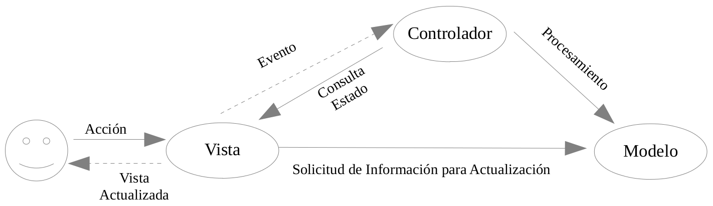
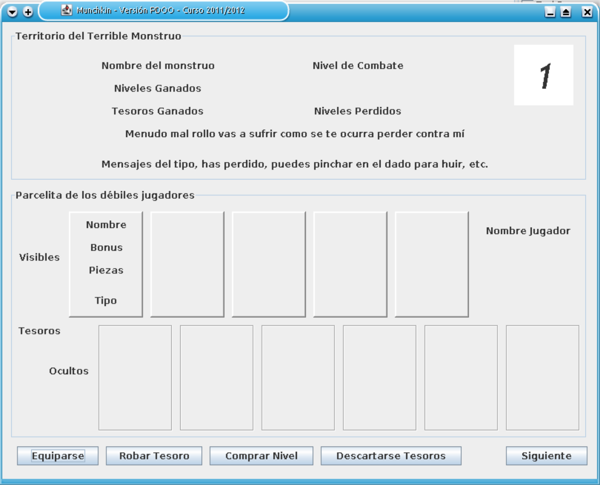
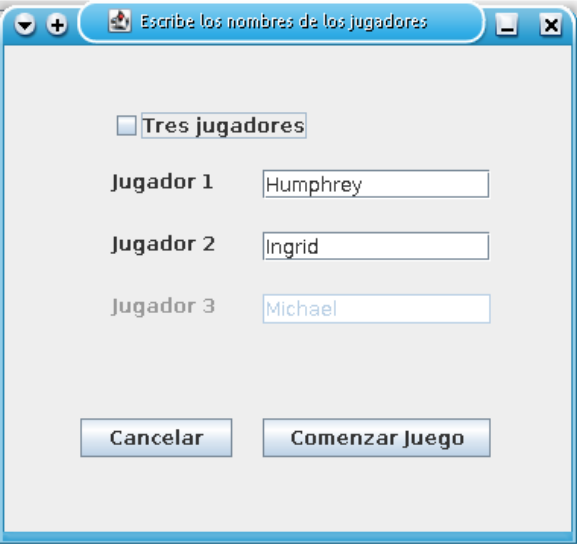

Programación y Diseño Orientado a Objetos
=========================================
2º Grado en Ingeniería Informática 2011/2012
--------------------------------------------


# Práctica 4: Interfaces Gráficas de Usuario
### Germán Martínez Maldonado
### José Rubén Sánchez Iruela
### Pablo Sánchez Robles

**Tareas para hacer:**

1. Leer este guion y entender el modo de trabajo en el desarrollo de interfaces gráficas de usuario.

2. Entender el código de los programas de ejemplo que se adjuntan y ejecutarlos:

* cartas.- Se trata de un juego de cartas cuyas instrucciones se encuentran en el apéndice A.
* ejemploComponentes.- Muestra el uso de los componentes más usados.

3. Crear una estructura mínima de clases  e interfaces para añadirle un interfaz gráfico al juego Munchkin, para ello:

a) Añade un nuevo archivo al proyecto de tipo “Java Class” que se llame Main y pertenezca al paquete ya definido donde se encuentran las demás clases.

b) Añade en esa clase el método main (lo puedes cortar y pegar si ya lo tenías en otra clase).

c) Establece esta clase como la clase main del proyecto, para ello:

c1. Botón derecho sobre el proyecto definido para la práctica.

c2. Pincha en Propiedades

c3. Se abre una ventana con las propiedades del proyecto. Pincha en Run

c4. Pincha en el botón Browse del campo Main Class

c5. Y elige Main

d) Añade un nuevo archivo al proyecto de tipo Java Interface que se llame Vista y pertenezca al paquete definido y declara en el interface java el método mostrar así:

    `public void mostrar (String[] args);`

e) Añade un nuevo archivo al proyecto de la categoría Swing GUI Forms y de tipo JFrame Form
que se llame VentanaPrincipal y pertenezca al paquete definido.

f) Pincha en la pestaña Source (situada en la parte superior izquierda del editor de texto) y haz los siguientes cambios:

f1. Añade a la declaración de la clase “implements Vista” de modo que quede tal que así:

```
    public class VentanaPrincipal
        extends javax.swing.JFrame 
        implements Vista
```

f2. Modifica el constructor para añadirle un parámetro de la clase Munchkin tal que así:

    `public VentanaPrincipal (Munchkin unJuego)`

f3. Vete al final del fichero y sustituye la función main que Netbeans ha incluido por esta:

```
    public void mostrar(String args[]) {
        this.setVisible(true);
    }
```

g) En el fichero Main.java, añade en el método main una variable de tipo Vista de modo que el método main sea similar a este:

```
    public static void main(String[] args) {
        Munchkin juego = Munchkin.obtenerInstancia(); 
        Vista v = new VentanaPrincipal(juego);
        // aquí irían otras declaraciones
        // e instrucciones que puedas necesitar
        v.mostrar(args); // esta instrucción debe ser la última del método
    }
```

h) Ahora, si pinchas en ejecutar (icono con aspecto de triángulo verde) debería abrirse la aplicación en una ventana.

4. En el fichero VentanaPrincipal.java pincha en la pestaña Design y diseña el interfaz usando los elementos que nos proporciona NetBeans. Ten en cuenta las siguientes recomendaciones:

* Antes de comenzar con el diseño de la interfaz lee detenidamente el apéndice B y haz un boceto de interfaz similar al que se muestra en el apéndice C.
* Se recomienda poner el modo Absolute Layout para distribuir los componentes, tanto en el JFrame principal como en los sucesivos JPanels
* En cada momento sólo sera visible el jugador que tiene el turno
* Cada entidad (Monstruo, Jugador, Tesoro, etc.) debe ir en un JPanel. Para activar un JPanel para añadirle componentes se hace un doble click sobre su nombre en la lista de compoenentes.


### Apéndices

#### A) Interfaces gráficas en general

El objetivo principal al añadirle un interfaz gráfica de usuario (GUI) a la aplicación que hemos venido desarrollado es mantener la independencia (bajo acoplamiento) entre las clases que hemos desarrollado, que modelan la aplicación, y las clases que implementemos para desarrollar el GUI.

Para ello nos basaremos en el patrón Modelo-Vista-Controlaldor, que se describe por primera vez en 1979 para Smalltalk en [http://heim.ifi.uio.no/~trygver/themes/mvc/mvc-index.html](http://heim.ifi.uio.no/~trygver/themes/mvc/mvc-index.html)

* Modelo: Nos referimos a la estructura de clases que modelan la aplicación y a los objetos concretos que existen en un determinado momento. Estas clases no deben verse afectadas por la incorporación del GUI, no deben tener referencias a objetos del interfaz.
* Vista: Nos referimos a la estructura de clases y objetos que modelan el aspecto visual del GUI. Estas clases sí tendrán referencias a objetos del modelo. También tendrán referencias a objetos del Controlador.
* Controlador: Nos referimos a las clases y objetos encargados de capturar las acciones del usuario sobre el GUI. Estos objetos se comunicarán con el Modelo para llevar a cabo las operaciones solicitadas por el usuario y también se comunicarán con la Vista para que ésta muestre el nuevo estado del Modelo.

El modo de funcionamiento habitual será el siguiente:

1. El usuario interactúa con el interfaz gráfico de usuario, por ejemplo, escribe algún valor en un campo, marca una casilla o pulsa un botón.
2. Algunas de estas interacciones sólo modificarán el estado de algunos objetos de la vista y no necesitarán un procesamiento más allá de eso. En cambio, otras interacciones sí requerirán un procesamiento mayor, y una comunicación con los objetos del modelo.  En estos casos, esos eventos son capturados por el controlador.
3. El controlador, según el evento capturado y el estado de la vista, se comunica con el modelo para ejecutar la orden del usuario.
4. La vista, entonces, puede solicitarle al modelo la información necesaria para actualizar su estado. La siguiente figura muestra gráficamente el proceso descrito.



Este planteamiento nos permite realizar cambios en la GUI, o incluso tener varias versiones del interfaz de uso de la aplicación, sin que las clases que modelan la aplicación se vean afectadas.

En el código adjunto se muestra un ejemplo mediante un sencillo juego de cartas.

**Instrucciones del juego de cartas de ejemplo**

Se trata de un juego en el que participan 4 jugadores que van interviniendo por turno. Cada carta contiene un número comprendido entre el 0 y el 9. El juego comienza estando una carta visible en la mesa, y los jugadores sin cartas en la mano. Las acciones que puede realizar un jugador son: si tiene en la mano una carta cuyo número es el inmediatamente superior o inmediatamente inferior al de la mesa, puede jugar esa carta colocándola encima de la que hay en la mesa; si no tiene ninguna carta para jugar, tomará una carta del mazo.

El juego finaliza cuando haya un ganador (el jugador que se quede primero sin cartas) o cuando haya un perdedor (el jugador que teniendo 5 cartas en la mano, tiene el turno y no puede jugar ninguna).

En la implementación realizada, se toma una carta del mazo pinchando sobre el botón “Carta” o se juega una carta pinchando directamente sobre ella.

Antes de continuar con este guion, lee detenidamente el código java adjunto, está suficientemente comentado. Te ayudará a entender mejor el patrón Modelo-Vista-Controlador. No obstante, pregunta todo lo que no entiendas.

#### B) Interfaces Gráficos de Usuario en Java

Para tomar un primer contacto con el desarrollo de GUIs con Netbeans podéis seguir este tutorial: [http://netbeans.org/kb/docs/java/quickstart-gui.html](http://netbeans.org/kb/docs/java/quickstart-gui.html)

No obstante se comentan aquí las clases de los componentes más usados y sus principales atributos:

Lo primero que hay que comentar es que debemos nombrar los objetos con nombre significativos. Según vamos añadiendo componentes al GUI, Netbeans le va poniendo nombres genéricos, por ejemplo, si añadimos un par de componentes JLabel para mostrar texto en una ventana veremos que Netbeans añadirá el siguiente codigo:

`private JLabel label1, label2;`

Es importante adquirir el buen hábito de renombrar los componentes que vamos añadiendo. Especialmente aquellos componentes/objetos directamente involucrados en el procesamiento de las acciones que realice el usuario sobre el interfaz. Los renombramos en Netbeans, no editando el código que genera.

#### C) Ejemplo de diseño para la interfaz de Munchkin:



### Segunda sesión

En  estas  sesiones  se  realizará  la  asociación  entre  la  interfaz  gráfica  y  el  modelo,  así  como  la implementación necesaria para la finalización de la aplicación.

Debe incluirse obligatoriamente herencia, a lo largo del presente guion se indica dónde puede hacerse.

**Tareas para hacer**:

#### A) Asociar la clase VentanaPrincipal con la clase Munchkin

1. Añadir en VentanaPrincipal un atributo
    `private Munchkin juego;`

2.  Modificar el constructor para inicializar dicho atributo

```
    public VentanaPrincipal(Munchkin unJuego) { 
        juego = unJuego;
        initComponents();
    }
```

#### B) Crear una ventana para leer los nombres de los jugadores

1. Añadir un nuevo archivo de la categoría Swing GUI Forms y de tipo JDialog que se llame JD_nombreJugadores y pertenezca al paquete definido.

2. Añadir a la clase JD_nombresJugadores un atributo
    `private String[] nombres;`

3.  Añadir al constructor que Netbeans ha creado para dicha clase el código necesario para que se quede así:

```
    public JD_nombresJugadores(java.awt.Frame parent, boolean modal) { 
        super(parent, modal);
        initComponents();
        this.addWindowListener(new java.awt.event.WindowAdapter() {
            @Override
            public void windowClosing(java.awt.event.WindowEvent e) { 
                System.exit(0);
            }
        });
    }
```

La aplicación finaliza si el usuario cierra la ventana.

4.  Sustituir el método main que Netbeans ha creado en la clase JD_nombresJugadores por este otro método:

```
    public String[] getNombres() { 
        this.setVisible(true); 
        return nombres;
    }
```



5. Diseñar el cuadro de diálogo con un aspecto similar al siguiente.

**¡Recuerda, dale a todos los componentes nombres significativos!**


6. Añadir el código que capture y procese las acciones del usuario:

* **Acción sobre el botón Cancelar**

1. Hacer un doble click sobre el botón Cancelar.
2. Se habrá creado un método llamado <nombreBoton>ActionPerformed donde <nombreBoton> será el nombre que le habéis dado a ese componente al diseñar el cuadro de diálogo.
3. La implementación de ese método sólo tendrá una instrucción
    `System.exit(0);`

Cancelar significa salir de la aplicación

* **Acción sobre el CheckBox etiquetado como “Tres Jugadores”**

1. Doble click sobre el componente
2. En el método ActionPerformed correspondiente añadir:

```
    jL_jugador2.setEnabled(jCB_tresJugadores.isSelected()); 
    jT_jugador2.setEnabled(jCB_tresJugadores.isSelected());
```

Es decir, se habilita o no la etiqueta (jL_jugador2) y la entrada de texto (jT_jugador2) para el tercer jugador dependiendo del estado (activo o no) del JCheckBox (jCB_tresJugadores). Obviamente, cada alumno/a usará los nombres que le haya dado a esos componentes.

* **Acción sobre el botón Aceptar**

1. Doble click sobre el componente para acceder a su método ActionPerformed
2. Entender y añadir el siguiente código:

```
    if (jCB_tresJugadores.isSelected()) { 
        nombres = new String[3];
        nombres[2] = jT_jugador2.getText();
    } else nombres = new String[2];
    nombres[0] = jT_jugador0.getText(); 
    nombres[1] = jT_jugador1.getText(); 
    this.dispose();
```

#### C) Comenzar el juego con los nombres leídos

1. Añadir en la clase VentanaPrincipal un atributo

    `private String[] nombresJugadores;`

2. Modificar el método mostrar de la clase VentanaPrincipal para que quede similar a:

```
    public void mostrar(String args[]) { 
        JD_nombresJugadores dialogoNombres;
        dialogoNombres = new JD_nombresJugadores (this,true); 
        nombresJugadores = dialogoNombres.getNombres();
        // Añadir aquí el código para comunicarse con la clase Munchkin
        // y comenzar el juego
        // Por ejemplo,	juego.comenzarJuego(nombresJugadores); 
        this.setVisible(true);
    }
```

#### D) Crear métodos para actualizar la interfaz

1. Añadir en la clase VentanaPrincipal un método para actualizar la vista del monstruo:

    `private void actualizarMonstruo () { }`

Las instrucciones de este método enviarán mensajes a la clase Munchkin a través del atributo de asociación juego para obtener información del monstruo en juego y actualizar los componentes de la interfaz que lo visualizan. Por ejemplo:

```
    jL_nombreMonstruo.setText (juego.getMonstruoEnJuego().getNombre()); 
    jL_malRollo.setText (juego.getMonstruoEnJuego().getMalRollo()); 
    pack();
```

2. Por comodidad, se puede añadir otro atributo de asociación a la clase VentanaPrincipal (`private Monstruo monstruoEnJuego`) de modo que el código anterior se escribiría así:

```
    monstruoEnJuego = juego.getMonstruoEnJuego(); 
    jL_nombreMonstruo.setText (monstruoEnJuego.getNombre()); 
    jL_malRollo.setText (monstruoEnJuego.getMalRollo()); 
    pack();
```

3. Cualquier método que modifique componentes de la interfaz, como este mostrado que cambia el texto de unas etiquetas debe finalizar con la instrucción `pack()`

4. Proceder de forma similar definiendo un atributo de asociación y un método para actualizar la vista del jugador activo.

5. Estos métodos serán llamados cada vez que haya que actualizar la vista del monstruo en juego y del jugador activo. Por ejemplo, cuando se haya producido un cambio de turno. Pero sólo serán llamados desde la propia clase VentanaPrincipal.

**6. IMPORTANTE: En las clases del modelo (Munchkin, Jugador, Monstruo y Tesoro) no debe haber ninguna referencia a la interfaz gráfica, de ningún tipo. Saltarse esta norma se penalizará considerablemente en la evaluación de la práctica.**

#### E) Crear clases para representar la vista de los tesoros

Debido a que en la vista se tienen varias instancias de un mismo tipo de entidad, la vista de un tesoro, no tiene sentido tener componentes de la interfaz duplicados, como un JPanel para cada tesoro o cualquier otro componente que muestre la vista de un tesoro. Para ello, se creará una clase, TesoroGrafico, que representará la vista de un tesoro y de la que se instanciarán varios objetos para los distintos tesoros que haya que mostrar en cada momento.

Para no tener  que codificar  manualmente la vista del tesoro al completo,  se procederá se la siguiente manera:

1. Se diseñará la vista de un tesoro de la manera habitual, es decir, añadiendo componentes y modificando sus atributos. Teniendo en cuenta:

* El tesoro será un JPanel que contendrá el resto de componentes.
* Tanto ese JPanel, como el JPanel de la vista del jugador que va a contener la vista de los tesoros se le pondrá como layout el modo Absolute Layout.
* Asegurarse de que los componentes añadidos a la vista del tesoro están contenidos en su
JPanel.
 * Antes de añadir los componentes hacer un doble click en el JPanel del tesoro para que pase a ser el contenedor principal en la ventana de diseño.
 * Comprobar que los componentes están bien anidados observándolos en la vista en árbol de componentes de la parte inferior izquierda de Netbeans.

2. Se necesitan las posiciones que van a ocupar los JPanel de los tesoros en la vista del jugador. Para ello se va moviendo el JPanel del tesoro por las distintas ubicaciones que después va a poder tener y mirando en el código que genera Netbeans se van anotando las distintas posiciones (x,y). Por ejemplo, si el JPanel del jugador se llama jP_jugador y el del tesoro que hemos diseñado se llama jP_tesoro, una vez situado en un sitio donde después se quiere que pueda mostrarse un tesoro, en el código que Netbeans genera se verá una línea como esta:

```
    jP_jugador.add(jP_tesoro,
             new org.netbeans.lib.awtextra.AbsoluteConstraints(80, 30, -1, -1));
```

Donde 80 y 30 es la posición (x,y) que se está buscando.

Con  todas  las  posiciones  anotadas,  tanto  para  los  tesoros  ocultos,  como  los  visibles,  se almacenan en arrays como atributos de la clase VentanaPrincipal. Por ejemplo,

```
    private static final int posXtesorOcult[] = {120,230,340,450,560,670}; 
    private static final int posYtesorOcult = 180;
    private static final int posXtesorVisib[] = {80,190,300,410,520}; 
    private static final int posYtesorVisib = 30;
```

3. Crear una clase privada e interna a la clase VentanaPrincipal para representar la vista de un tesoro que derive de JPanel, por ejemplo:

```
public class VentanaPrincipal . . . {
    // diversas declaraciones de la clase VentanaPrincipal 
    private class TesoroGrafico extends JPanel {
        protected Tesoro tesoro; // asociación con el tesoro que representa 
        TesoroGrafico (Tesoro unTesoro) { }
    }
    // el resto de la clase VentanaPrincipal
}
```

4. En el constructor, además de inicializar el atributo de asociación tesoro, deben ir las instrucciones que definen la vista del tesoro. Estas instrucciones, se localizan en el código que ha generado Netbeans cuando se ha diseñado el tesoro mediante modo habitual de añadir componentes y definir atributos. Se encuentran fácilmente gracias a que se han usado nombres significativos para todos los componentes. Se copian y pegan en el constructor.

En el siguiente ejemplo se han copiado y pegado las líneas sombreadas, y se ha añadido la declaración y creación de la etiqueta jL_nombre. También se ha modificado la línea subrayada para que el texto de la etiqueta se asigne con la información extraída del tesoro.

Igualmente, si el JPanel que contiene el tesoro se llamó al diseñarlo jP_tesoro, se procederá a sustituir jP_tesoro por this, o bien a eliminarse. En el ejemplo se ha sustituido por this para que ilustrar en qué instrucciones aparecía jP_tesoro, pero podía haberse eliminado.

```
    private class TesoroGrafico extends JPanel { 
        protected Tesoro tesoro;
        private JLabel jL_nombre = new JLabel(); 
        TesoroGrafico(Tesoro unTesoro) {
            tesoro = unTesoro;
            this.setPreferredSize(new java.awt.Dimension(100, 140)); 
            this.setLayout(new org.netbeans.lib.awtextra.AbsoluteLayout());

            jL_nombre.setHorizontalAlignment(javax.swing.SwingConstants.CENTER); 
            jL_nombre.setText(tesoro.obtenerNombre());
            this.setBackground (new java.awt.Color(200,200,0)); 
            this.setOpaque(false);
            this.add(jL_nombre,
                new org.netbeans.lib.awtextra.AbsoluteConstraints(5, 10, 90, -1));
        }
    }
```

5. Dado que se tienen tesoros ocultos y tesoros visibles, se crearán sendas clases que heredarán de TesosoGrafico y que muestren los tesoros ocultos y visibles con un aspecto distinto. También serán clases internas a la clase VentanaPrincipal. Ejemplo:

```
    private class TesoroGraficoVisible extends TesoroGrafico { 
        TesoroGraficoVisible (Tesoro unTesoro) {
            super(unTesoro);
            // instrucciones que le dan un aspecto distinto a este tipo de tesoro
        }
    }
```

6. Ademas de representar los tesoros usando el concepto de herencia, también se incorpora el concepto de polimorfismo. Cuando el usuario haga un click sobre un tesoro para seleccionarlo, bien para equiparse, descartarse o cualquier otra acción posterior, ese evento será procesado por el método mouseClicked asignado a una u otra subclase dependiendo del tipo de tesoro sobre el que se ha hecho el click. Para ello, se añadirá en el constructor de cada subclase el código necesario para que quede de una forma similar a esta:

```
    private class TesoroGraficoVisible extends TesoroGrafico { 
        TesoroGraficoVisible (Tesoro unTesoro) {
            super(unTesoro);
            // instrucciones que le dan un aspecto distinto a este tipo de tesoro 
            addMouseListener(new java.awt.event.MouseAdapter() {
                @Override
                public void mouseClicked(java.awt.event.MouseEvent evt) {
                    // instrucciones para procesar la selección de un tesoro visible
                }
            });
        }
    }
```

Hay que tener en cuenta que dentro del método mouseClikcked, la pseudovariable this no referencia al objeto concreto de la clase TesoroGraficoVisible que ha recibido el mensaje, sino al objeto concreto de la clase MouseAdapter que se encarga del proceso del click sobre el tesoro. Si se necesita usar this referenciando al objeto concreto de TesoroGraficoVisible se hará así: `TesosorGraficoVisible.this`.

No obstante, se puede acceder directamente a todos los atributos de TesoroGraficoVisible, a todos los atributos public y protected de TesoroGrafico, y a todos los atributos de VentanaPrincipal.

7. Para la gestión de los tesoros seleccionados se pueden tener sendas List<Tesoro>, una llamada tesorosOcultosSeleccionados y otra llamada tesorosOcultosVisibles, en las que los métodos mouseClicked de las subclases de Tesoro se encargan de añadir o eliminar los tesoros que se seleccionan o deseleccionan.

Esas listas se usarán como parámetros para comunicarse con la clase Munchkin cuando proceda, con mensajes como `juego.equiparseJugador(tesorosOcultosSeleccionados);` o `juego.descartarTesorosVisibles (tesorosVisiblesSeleccionados);`

Estas listas auxiliares deben limpiarse  (mensaje clear())  cuando pase  el turno al siguiente jugador.

8. Obviamente, también hay que cambiar el aspecto de los tesoros para que el usuario sepa qué tesoros tiene seleccionados y cuáles no.

#### F) Gestión de la vista de los tesoros en la vista del jugador

En el método actualizarJugador hay que incorporar código para al actualizar la vista del jugador se muestren sus tesoros, tanto visibles como ocultos. Básicamente, para el jugador activo se obtienen sus listas de tesoros ocultos y visibles mediante mensajes al modelo. A partir de esas listas se construyen objetos de las clases TesoroGraficoVisible y TesoroGraficoOculto que se añaden al JPanel de la vista del jugador. Objetos que habrá que eliminar de dicho JPanel cuando se cambie el turno del jugador.

Con esas premisas, el método actualizarJugador queda de forma similar a éste:

```
    private void actualizarJugador() {
        TesoroGrafico unTesoroGrafico; // variable auxiliar para varios usos 
        int i; // contador en bucles
        jugadorActivo = juego.getJugadorActivo(); // asociación con el modelo
        // INCLUIR instrucciones para actualizar el nombre, el nivel, u otra
        // información del jugador activo distinta a los tesoros
        //
        // Antes de añadir los tesoros de este jugador al JPanel,
        // se eliminan los tesoros que ya tiene el JPanel de cuando contenía
        // información del jugador anterior. Esos tesoros se encuentran en
        // tesorosAlimpiar (atributo de tipo List<TesoroGrafico> de la clase
        // VentanaPrincipal
        for (TesoroGrafico tg : tesorosAlimpiar) 
            jP_jugador.remove (tg);
        // Se vacía tesorosAlimpiar para incluirle los del jugador activo tesorosAlimpiar.clear();
        i = 0;
        for (Tesoro t : jugadorActivo.getTesorosVisibles()) {
            // OJO: Se crea un objeto de la subclase
            // pero se asigna a una variable de la superclase 
            unTesoroGrafico = new TesoroGraficoVisible(t);
            // El tesoro gráfico se añade al JPanel del jugador haciendo uso
            // de las posiciones (x,y) que se tenían almacenadas.
            jP_jugador.add (unTesoroGrafico, new
                                      org.netbeans.lib.awtextra.AbsoluteConstraints
                                      (posXtesorVisib[i], posYtesorVisib, -1, -1));
            // También se incluye en tesorosAlimpiar para la actualización del
            // próximo jugador tesorosAlimpiar.add(unTesoroGrafico); 
            i++;
        }
        // El jugador que acaba de recibir el turno no debe tener ningún tesoro
        // visible seleccionado 
        tesorosVisiblesSeleccionados.clear();
        // PROCEDER de forma similar con los tesoros ocultos
        // INCLUIR otras instrucciones que se estimen necesarias
        //
        // Se han estado añadiendo y quitando componentes del JPanel, no sólo
        // modificando algún atributo de un componente existente.
        // No sólo se requiere pack(), sino también repaint() 
        repaint();
        pack();
    }
```

#### G) Ultimas tareas

1. Una vez se tienen implementados los tesoros mediante código editable por el programador y no mediante código generado por NetBeans, se accede a la pestaña Design del fichero VentanaPrincipal.java y se borra el JPanel del tesoro que ha servido de muestra para copiar y pegar código.
2. Completar el método mostrar de VentanaPrincipal. Este método se encarga de abrir el cuadro de diálogo para leer los nombres de los jugadores, tarea ya realizada. Pero también se encarga de iniciar el juego. Tiene que comunicarse con Munchkin a través del atributo de asociación juego para comenzar el juego, y hacer llamadas a actualizarJugador() y actualizarMonstruo() para mostrar en el inicio el primer jugador y el primer monstruo.
3. Añadir código para procesar las acciones del usuario sobre los botones de la interfaz. Haciendo doble click sobre cada botón de la interfaz se accede a su método ActionPerformed. Incluir el código necesario para completar la funcionalidad asociada a dicho botón. Normalmente supondrá, entre otras cosas, mensajes a Munchkin a través del atributo de asociación juego, y llamadas a actualizarJugador() y/o actualizarMonstruo().
4. Terminar el juego y jugar
