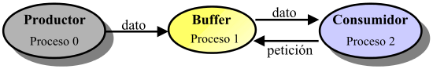
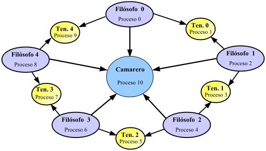

Sistemas Concurrentes y Distribuidos
=========================================
2º Grado en Ingeniería Informática 2011/2012
--------------------------------------------


# Práctica 3: Programación de algoritmos distribuidos usando una interfaz paso de mensajes.
### Germán Martínez Maldonado

### 1 Objetivos

* El objetivo general es iniciarse en la programación de algoritmos distribuidos.
* Conocer varios problemas sencillos de sincronización y su solución distribuida mediante el uso de la interfaz de paso de mensajes MPI:
 * Diseñar una solución distribuida al problema del productor-consumidor con buffer acotado para varios productores y varios consumidores, usando MPI.
 * Diseñar diversas soluciones al problema de la cena de los filósofos usando MPI.

### 2 Productor-Consumidor con buffer acotado en MPI

#### 2.1 Aproximación inicial en MPI

**Aproximación inicial en MPI**

* Supongamos que disponemos de una versión distribuida del problema del productor-consumidor que usa tres procesos y la interfaz de paso de mensajes MPI. Para ello, tendremos un proceso productor (proceso 0 del comunicador universal) que producirá datos, un proceso Buffer (proceso 1) que gestionará el intercambio de datos y un proceso consumidor que procesará los datos (proceso 2). El esquema de comunicación entre estos procesos se muestra a continuación:



* El proceso Productor se encarga de ir generando enteros comenzando por el 0 y enviárselos al proceso Buffer. El proceso Consumidor envía peticiones al proceso Buffer, recibe los enteros de Buffer, los imprime por pantalla y calcula su raíz cuadrada.

* El proceso Buffer debería atender las peticiones de ambos procesos (Productor y Consumidor).

#### 2.1 Solución con selección no determinista

**Solución con selección no determinista**

* Se debe permitir que el productor pueda enviar TAM datos sin tener que interrumpirse, y que el consumidor no se retrase cuando haya datos almacenados en el proceso buffer.

* Una forma de corregir dicho código consiste en usar una sentencia de selección no determinista de órdenes con guarda en el proceso Buffer que permita cierta asincronía entre productor y consumidor en función del tamaño del buffer temporal (TAM).

* En MPI, no hay ninguna sentencia de selección no determinista de órdenes con guarda, pero es fácil
emularla con las funciones de sondeo MPI_Probe y/o MPI_Iprobe.

**Ejercicio propuesto**

*Extender el programa MPI anteriormente presentado que implementa el productor-consumidor con buffer acotado (los fuentes del programa se proporcionan junto con el guión de prácticas) para que el proceso buffer dé servicio a 5 productores y 4 consumidores. Para ello, se lanzarán 10 procesos y asumiremos que los procesos 0 ... 4 son productores, el proceso Buffer es el proceso 5 y el resto de procesos en el comunicador universal (6 ... 9) son consumidores.*

Los cambios más significativos realizados son que ahora al haber más de un productor y más de un consumidor, en el buffer para elegir la rama se tiene que tener esto en cuenta, por lo que tomar una rama en función de si es 0 es productor y 1 es consumidor, ahora será 0-4 productor y 5-9 consumidor. Además también, los mensajes recibidos por el buffer vendrán de cualquier fuente (MPI_ANY_SOURCE) y el buffer lo deberá enviar a quien haya hecho la solicitud (status.MPI_SOURCE).

*Salida del programa:*

```
germaaan@PC-G:~/Universidad/2º/SCD/practica3/ejercicios$ mpirun -np 10 prod_cons Productor 0 produce valor 0
Productor 1 produce valor 0
Productor 2 produce valor 0
Productor 4 produce valor 0
Productor 0 produce valor 1
Buffer recibe 0 del Productor 0 
Consumidor 6 recibe valor 0 de Buffer 
Buffer envía 0 al Consumidor 1
Buffer recibe 0 del Productor 0
Buffer recibe 0 del Productor 0
Productor 2 produce valor 1
Buffer recibe 0 del Productor 0
Productor 4 produce valor 1
Productor 1 produce valor 1
Buffer envía 0 al Consumidor 1 
Consumidor 8 recibe valor 0 de Buffer 
Consumidor 6 recibe valor 0 de Buffer 
Buffer envía 0 al Consumidor 1
Buffer envía 0 al Consumidor 1 
Consumidor 8 recibe valor 0 de Buffer 
Productor 3 produce valor 0
Buffer recibe 0 del Productor 0
Productor 3 produce valor 1
Buffer envía 0 al Consumidor 1 
Consumidor 7 recibe valor 0 de Buffer 
Productor 0 produce valor 2
Buffer recibe 1 del Productor 0
Buffer envía 1 al Consumidor 1 
Consumidor 7 recibe valor 1 de Buffer 
Buffer recibe 1 del Productor 0
Buffer recibe 1 del Productor 0
Productor 2 produce valor 2
Buffer recibe 1 del Productor 0
Productor 3 produce valor 2
Buffer recibe 1 del Productor 0
Productor 4 produce valor 2
Productor 1 produce valor 2 
Consumidor 6 recibe valor 1 de Buffer
...
```


### 3 Cena de los Filósofos

#### 3.1 Cena de los filósofos en MPI

* Se pretende realizar una implementación del problema de la cena de los filósofos en MPI utilizando el siguiente esquema:

* Tenemos 5 procesos filósofos y 5 procesos tenedor (10 procesos en total). Supondremos que los procs. filósofos se identifican con número pares y los tenedores con números impares. El filósofo i (i = 0, ..., 4) será el proc. 2i y el tenedor i será el 2i + 1.


**Procesos filósofos**

* En principio, cada filósofo realiza repetidamente la siguiente secuencia de acciones:
 * Pensar (sleep aleatorio).
 * Tomar los tenedores (primero el tenedor izquierdo y después el derecho).
 * Comer (sleep aleatorio).
 * Soltar tenedores (en el mismo orden).

* Las acciones pensar y comer pueden implementarse mediante un mensaje por pantalla seguido de un retardo durante un tiempo aleatorio. Las acciones de tomar tenedores y soltar tenedores pueden implementarse enviando mensajes de petición y de liberación a los procesos tenedor situados a ambos lados de cada filósofo.

**Procesos tenedor**

* Un tenedor solamente podrá ser asignado a uno de los dos filósofos que realicen la petición. Hasta que el tenedor no sea liberado no podrá ser asignado de nuevo. Cada proceso tenedor tendrá que ejecutar repetidamente la siguiente secuencia de acciones:
 * Esperar mensajes de petición de tenedor y recibir uno.
 * Esperar mensaje de liberación.

**Ejercicio propuesto**

* *Implementar una solución distribuida al problema de los filósofos de acuerdo con el esquema descrito en las plantillas. Usar la operación síncrona de envío MPI_Ssend para realizar las peticiones y liberaciones de tenedores.*

* *El esquema propuesto (cada filósofo coge primero el tenedor de su izquierda y después el de la derecha) puede conducir a interbloqueo. Identificar la secuencia de peticiones de filósofos que conduce a in- terbloqueo en el programa y realizar pequeñas modificaciones en el programa (y en el comportamiento de las entidades que participan) que eliminan la posibilidad de interbloqueo (sin añadir nuevos procesos).*

Según el problema de los filósofos al haber el mismo número de tenedores que de filósofos, siendo necesario para todos coger dos tenedores para comer, si todos intentan coger sus dos tenedores simultáneamente se producirá el interbloqueo.

Para solucionar esto, una solución puede ser que el primer filosofo coja primero su tenedor derecho, y luego el izquierdo, y que el resto de filósofos haga lo contrario, cojan primero el tenedor izquierdo, y después el derecho, así, el primer filosofo podrá coger 2 tenedores y comer, y todos los filósofos irán comiendo según vayan quedando libres los tenedores.

Aunque no es la mejor solución posible, al ser pequeño el número de filósofos, y estos parando a pensar entre “bocado y bocado”, es difícil que un filósofo se quedase sin comer.

*Salida del programa:*

```
germaaan@PC-G:~/Universidad/2º/SCD/practica3/ejercicios$ mpirun -np 10 filósofos 
El tenedor 3 recibe una peticion del filosofo 4.
El filosofo 4 coge el tenedor de su izquierda (3). 
El tenedor 5 recibe una peticion del filosofo 4. 
El tenedor 7 recibe una peticion del filosofo 8. 
El tenedor 1 recibe una peticion del filosofo 0. 
El filosofo 4 coge el tenedor de su derecha (5). 
El filosofo 4 esta COMIENDO...
El filosofo 0 coge el tenedor de su derecha (1). 
El filosofo 0 coge el tenedor de su izquierda (9). 
El filosofo 0 esta COMIENDO...
El tenedor 9 recibe una peticion del filosofo 0. 
El filosofo 8 coge el tenedor de su izquierda (7). 
El filosofo 4 suelta el tenedor de su izquierda 3. 
El filosofo 4 suelta el tenedor de su derecha 5. 
El filosofo 4 esta PENSANDO...
El tenedor 3 recibe la liberacion del filosofo 4. 
El tenedor 5 recibe la liberacion del filosofo 4. 
El tenedor 5 recibe una peticion del filosofo 6. 
El filosofo 6 coge el tenedor de su izquierda (5). 
El filosofo 0 suelta el tenedor de su izquierda 9. 
El filosofo 0 suelta el tenedor de su derecha 1. 
El filosofo 0 esta PENSANDO...
El filosofo 8 coge el tenedor de su derecha (9). 
El filosofo 8 esta COMIENDO...
El tenedor 1 recibe la liberacion del filosofo 0. 
El tenedor 1 recibe una peticion del filosofo 2. 
El tenedor 9 recibe la liberacion del filosofo 0. 
El tenedor 9 recibe una peticion del filosofo 8. 
El filosofo 2 coge el tenedor de su izquierda (1). 
El tenedor 3 recibe una peticion del filosofo 2. 
El filosofo 2 coge el tenedor de su derecha (3). 
El filosofo 2 esta COMIENDO...
El filosofo 8 suelta el tenedor de su izquierda 7. 
El filosofo 2 suelta el tenedor de su izquierda 1. 
El filosofo 8 suelta el tenedor de su derecha 9. 
El filosofo 8 esta PENSANDO...
```

#### 3.2 Cena de los filósofos con camarero en MPI

**Cena de los filósofos con camarero**

* Una forma de evitar la posibilidad de interbloqueo consiste en impedir que todos los filósofos intenten ejecutar la acción de “tomar tenedor” al mismo tiempo. Para ello podemos usar un proceso camarero central que permita sentarse a la mesa como máximo a 4 filósofos. Podemos suponer que tenemos 11 procesos y que el camarero es el proc. 10.



**Proceso filósofo con Camarero central**

* Ahora, cada filósofo ejecutará repetidamente la siguiente secuencia de acciones:
 * Pensar
 * Sentarse
 * Tomar tenedores
 * Comer
 * Soltar tenedores
 * Levantarse

* Cada filósofo pedirá permiso para sentarse o levantarse enviando un mensaje al camarero, el cual llevará una cuenta del número de filósofos que hay sentados a la mesa en cada momento.

**Ejercicio propuesto**

* *Implementar una solución distribuida al problema de los filósofos con camarero central que se ha descrito, usando MPI.*

La solución a este problema es bastante parecida al problema anterior.  El proceso Tenedor sigue siendo el mismo. El proceso Filosofo varia un poco, ahora piensa antes de comer, y además de tener que solicitar los tenedores, antes de poder comer, tiene que solicitar al camarero poder sentarse en la mesa para poder comer, no pudiendo sentarse a la mesa, si ya hay 4 filósofos en la misma, y al igual que avisa de que suelta los tenedores, debe avisar al camarero de que se quiere levantar de la mesa, para que este le dé permiso, a la vez que llama a otro filosofo para indicarle que ya puede sentarse.

La mayor diferencia de este problema, está en el proceso Camarero, que será el encargado ahora de hacer que un filosofo pueda sentarse a comer o tenga que esperar.

```
germaaan@PC-G:~/Universidad/2º/SCD/practica3/ejercicios$ mpirun -np 11 filosofos_camarero 
El filosofo 2 esta PENSANDO...
El filosofo 6 esta PENSANDO... 
El filosofo 8 esta PENSANDO... 
El filosofo 0 esta PENSANDO... 
El filosofo 4 esta PENSANDO... 
El filosofo 6 se sienta a la mesa.
El camarero recibe una peticion del filosofo 6. 
El filosofo 8 se sienta a la mesa.
El camarero le da permiso al filosofo 6 para levantarse de la mesa. 
El filosofo 8 coge el tenedor de su izquierda (7).
El tenedor 7 recibe una peticion del filosofo 8. 
El camarero recibe una peticion del filosofo 2. 
El tenedor 1 recibe una peticion del filosofo 2. 
El filosofo 2 se sienta a la mesa.
El filosofo 2 coge el tenedor de su izquierda (1). 
El filosofo 0 se sienta a la mesa.
El camarero le da permiso al filosofo 2 para levantarse de la mesa. 
El camarero recibe una peticion del filosofo 4.
El filosofo 4 se sienta a la mesa.
El filosofo 6 coge el tenedor de su izquierda (5). 
El filosofo 8 coge el tenedor de su derecha (9). 
El filosofo 2 coge el tenedor de su derecha (3). 
El filosofo 2 esta COMIENDO...
El filosofo 8 esta COMIENDO...
El tenedor 9 recibe una peticion del filosofo 8. 
El tenedor 3 recibe una peticion del filosofo 2. 
El tenedor 5 recibe una peticion del filosofo 6. 
El filosofo 2 suelta el tenedor de su izquierda 1. 
El tenedor 1 recibe la liberacion del filosofo 2. 
El filosofo 8 suelta el tenedor de su izquierda 7. 
El tenedor 7 recibe la liberacion del filosofo 8. 
El tenedor 7 recibe una peticion del filosofo 6. 
El tenedor 1 recibe una peticion del filosofo 0. 
El filosofo 0 coge el tenedor de su derecha (1).
El camarero le da permiso al filosofo 4 para levantarse de la mesa. 
El filosofo 0 coge el tenedor de su izquierda (10).
El filosofo 0 esta COMIENDO...
El filosofo 8 suelta el tenedor de su derecha 9. 
El filosofo 8 se levanta de la mesa.
El tenedor 9 recibe la liberacion del filosofo 8. 
El tenedor 3 recibe la liberacion del filosofo 2. 
El tenedor 3 recibe una peticion del filosofo 4.
```
