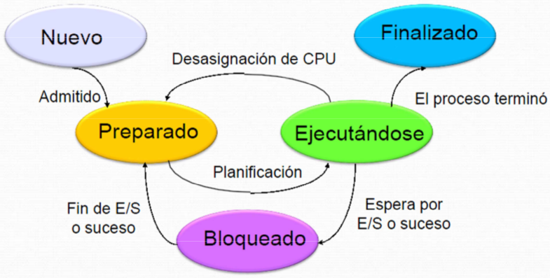

Sistemas Operativos
===================
2º Grado en Ingeniería Informática 2011/2012
--------------------------------------------


# Portafolio Teoría Sistemas Operativos
## Germán Martínez Maldonado

## INTRODUCCIÓN: Repaso de conceptos sobre hardware y sistemas operativos

**1. Esquema básico de los componentes de un computador y sus interconexiones: CPU, memoria y dispositivos.**

La función principal de un ordenador es ejecutar programas, esto se puede llevar a cabo gracias a la interconexión de los cuatro elementos estructurales principales:

* **Procesador**. Controla el funcionamiento del ordenador y realiza sus funciones de procesamiento de datos.
* **Memoria principal**. Almacena datos y programas. Esta memoria normalmente es volátil, también puede recibir el nombre de memoria real o memoria primaria.
* **Módulos de entrada/salida**. Transfieren datos entre el ordenador y el exterior. Este exterior pueden ser dispositivos como dispositivos de memoria secundaria (por ejemplo, discos), equipos de comunicación o terminales.
* **Bus del sistema**. Permite que se comuniquen los procesadores, la memoria principal y los módulos de entrada/salida.

Para cumplir con su función de intercambiar datos con la memoria y los dispositivos de E/S, el procesador tiene varios registros internos:

* **Registro de dirección de memoria (RDIM)**: que especifica la dirección de memoria de la siguiente lectura o escritura.
* **Registro de datos de memoria (RDAM)**: que contiene los datos que se van a escribir en la memoria o que recibe los datos leídos de la memoria.
* **Registro de dirección de E/S (RDIE/S)**: que especifica un determinado dispositivo de E/S.
* **Registro de datos de E/S (RDAE/S)**: que permite intercambiar datos entre un módulo de E/S y el procesador.

Un módulo de memoria tiene  un conjunto  de posiciones definidas mediante direcciones numeradas secuencialmente. Cada posición contiene un patrón de bits que se puede interpretar como una instrucción o como datos.

Un módulo de E/S transfiere datos desde los dispositivos externos hacia el procesador y la memoria, y viceversa. Contiene buffers que almacenarán los datos temporalmente hasta que se puedan enviar.

Se emplean varios registros del procesador para controlar el funcionamiento del mismo. En la mayoría de las máquinas, muchos de ellos no son visibles para el usuario. A algunos de ellos se puede acceder mediante instrucciones de máquina ejecutadas en modo kernel.

Además de los registros RDIM, RDAM, RDIE/S y RDAE/S, hay dos registros más que son esenciales para la ejecución de instrucciones:

* **Contador de programa (Program Counter, PC)**: contiene la dirección de la próxima instrucción que se leerá de la memoria.
* **Registro de instrucción (Instruction Register, IR)**: contiene la última instrucción leída.

Todos los diseños de procesador incluyen también un registro, o conjunto de registros, llamado normalmente la Palabra de Estado del Programa (Program Status Word, PSW). Normalmente contiene códigos de condición, además de otra información de estado, como un bit para habilitar/inhabilitar las interrupciones y un bit de modo de usuario/supervisor.

**2. ¿Qué es una interrupción y cómo se maneja?**

Una interrupción es la suspensión temporal de la ejecución de un programa, que se produce cuando un dispositivo notifica al procesador que necesita tiempo de procesamiento. Para conocer que dispositivo ha solicitado la interrupción se usa el sondeo. Las interrupciones son asíncronas.

El programa de usuario no tiene que contener ningún código especial para tratar las interrupciones: el procesador y el sistema operativo son responsable de suspender el programa de usuario y, posteriormente, reanudarlo en el mismo punto.

Operaciones que se ejecutan cuando se produce una interrupción:

1. El dispositivo genera una señal de interrupción hacia el procesador.
2. El procesador termina la ejecución de la instrucción actual antes de responder a la interrupción.
3. El procesador comprueba si hay una petición de interrupción pendiente, determina que hay una y manda una señal de reconocimiento al dispositivo. Esto hace que el dispositivo elimine su señal de interrupción.
4. El procesador se prepara para transferir el control a la rutina de interrupción. Salva la información necesaria para luego poder reanudar el programa actual al momento de la interrupción: la palabra de estado, el contador de programa y los registros del procesador.
5. El procesador carga el contado del programa con la posición del punto de entrada de la rutina de manejo de interrupción que responder a la interrupción.

Pasos de la gestión de la interrupción:

6. El manejador de interrupción procesa la interrupción, examinando la información de estado relacionada el evento que haya causado la interrupción.
7. Cuando se completa el procesamiento de la interrupción, se recuperan los valores de los registros salvados en la pila y se restauran en los registros.
8. Finalmente, se restauran de la pila los valores de la palabra de estado y del contador de programa, y se continúa con la ejecución del programa previamente interrumpido.

**3. ¿Qué es una excepción y cómo se maneja?**

Una excepción es un evento que se produce cuando el resultado de procesar una instrucción produce un comportamiento no esperado. Las excepciones son internas al procesador y síncronas. Cuando se producen, el sistema operativo toma el control (pasa a modo kernel), salva el estado actual del sistema, si existe un manejador para la excepción generada, el sistema operativo transfiere el control a dicho manejador, en caso contrario aborta le ejecución del proceso. Ejemplos de excepciones incluyen la división por cero o la ejecución de instrucciones ilegales.

El manejo de excepciones necesita el soporte del lenguaje de programación para que el programador pueda especificar el manejador a ejecutar cuando se produzca una excepción. Un esquema habitual es el que se presenta a continuación:

```
try {
    Bloque donde puede producirse una excepción
}
except {
    Bloque que se ejecutará si se produce una excepción en el bloque anterior
}
```

En el esquema anterior, el programador encierra dentro del bloque try el fragmento de código que quiere proteger de la generación de excepciones. En el bloque except sitúa el manejador de excepciones. En caso de generarse una excepción en el bloque try, el sistema operativo transfiere el control al bloque except que se encargara de manejar la correspondiente excepción.

**4. Diferencia  entre  interrupciones  y  excepciones  desde  el  punto  de  vista  del hardware y el SO.**

La diferencia está en que cuando se produce una interrupción, el proceso que había en ejecución cuando se produjo, es interrumpido para que se gestione dicha interrupción, pero una vez resuelta por el sistema operativo, se reanudará la ejecución del proceso, mientras que cuando se produce una excepción, el proceso es interrumpido para gestionar la excepción, pero en caso de que la excepción producida no puede ser manejada, se abortará la ejecución del proceso.

**5. En una arquitectura con modo dual de funcionamiento, ¿cómo obtenemos un servicio del sistema operativo? Concepto de trampa para realizar llamadas al sistema.**

Obtendremos el servicio del sistema operativo a través de una trampa, que es un tipo de interrupción síncrona que producirá una excepción, lo que a su vez genera un cambio de contexto a modo kernel, haciendo que se salve los registros PC y PSW, para después cargar en PC la dirección que hay en el vector de excepciones, para acceder a la rutina del sistema que queremos que se ejecute.

### 1. TÉCNICAS DE COMUNICACIÓN DE E/S

**E/S PROGRAMADA**

Cuando el procesador ejecuta un programa y encuentra una instrucción relacionada con la E/S, ejecuta esa instrucción generando un mandato al módulo de E/S apropiado. En el caso de la E/S programada, el módulo de E/S realiza la acción solicitada, pero  no  realiza ninguna acción para avisar al procesador. Después de que se llame a la instrucción de E/S, el procesador debe estar atento para enterarse de cuándo se completa la instrucción de E/S. Para eso el procesador comprueba periódicamente el estado del módulo de E/S hasta que se ha completado la operación.

El procesador es el responsable de extraer los datos de la memoria principal en una operación de salida y de almacenarlos en ella en una operación de entrada. Ejecutará instrucciones que le dan control directo de la operación de E/S, estas instrucciones se pueden dividir en las siguientes categorías:

* **Control**: activa un dispositivo externo e indicarle que hacer.
* **Estado**: comprueba las condiciones de estado de un módulo de E/S y sus periféricos.
* **Transferencia**: lee y/o escribe datos entre los registros del procesador y los dispositivos externos.

Usando E/S programada para leer un bloque de datos de un dispositivo externo y almacenarlo en memoria, los datos se leerán palabra a palabra. Por cada palabra que se lee, el procesador debe permanecer en un bucle de comprobación del estado hasta que se comprueba que la palabra está disponible en el registro de datos del módulo de E/S.

**E/S DIRIGIDA POR INTERRUPCIONES**

El problema de la E/S programada es que como el procesador tiene que estar comprobando repetidamente el estado del módulo de E/S, baja enormemente el nivel de rendimiento de todo el sistema.

Una solución puede ser que el procesador genere un mandato de E/S para un módulo y seguidamente continúe realizando otras operaciones. El módulo de E/S interrumpirá al procesador para solicitar su servicio cuando esté listo para intercambiar datos. El procesador ejecutara la transferencia de datos y después reanudara el procesamiento previo.

Desde el punto de vista del procesador, se genera un mandato de LECTURA. Salva el contexto del programa actual y lo abandona, pasando a hacer otra cosa. Al final de cada ciclo de instrucción, el procesador comprueba si hay interrupciones. Cuando se produce la interrupción del módulo de E/S, el procesador salva el contexto del programa que se está ejecutando actualmente y comienza a ejecutar un programa de manejo de interrupción que procesa la interrupción. En este caso, el procesador lee la palabra de datos del módulo de E/S y la almacena en memoria. A continuación, restaura el contexto del programa que había realizado el mandado de E/S y reanuda su ejecución.

**ACCESO DIRECTO A MEMORIA**

La E/S dirigida por interrupciones, aunque más eficiente que la programada simple, todavía requiere la intervención activa del procesador para transferir datos entre la memoria y un módulo de E/S, ya que cualquier transferencia de datos debe pasar por el procesador produciendo dos inconvenientes:

1. La tasa de transferencia de E/S está limitada por la velocidad con la que el procesador puede comprobar el estado de un dispositivo y ofrecerle servicio.
2. El procesador está involucrado en la gestión de una transferencia de E/S; se deben ejecutar varias instrucciones por cada transferencia de E/S.

Cuando se van a transferir grandes volúmenes de datos, se requiere una técnica más eficiente: el Acceso Directo a Memoria (**Direct Memory Access, DMA**). La función del DMA puede estar en un módulo separado conectado en el bus del sistema o un módulo de E/S. Cuando el procesador desea leer o escribir un bloque de datos, genera un mandato al módulo de DMA, enviándole la siguiente información:

* Si se trata de una lectura o de una escritura.
* La dirección del dispositivo de E/S involucrado.
* La posición inicial de memoria en la que se desea leer los datos o donde se quieren escribir.
* El número de palabras que se pretenden leer o escribir.

A continuación, el procesador continúa con otro trabajo. Ha encargado esta operación de E/S al módulo de DMA, que se ocupará de la misma. El módulo de DMA transferirá el bloque completo de datos, palabra a palabra, hacia la memoria o desde ella sin pasar a través del procesador. Por tanto, el procesador solamente está involucrado al principio y al final de la transferencia.

El módulo de DMA necesita tomar el control del bus para transferir datos hacia la memoria o desde ella, por este motivo, a veces el procesador tendrá que esperar al módulo de DMA, lo que provocará que el procesador ejecute más lentamente durante una transferencia de DMA en el caso de que el procesador requiera acceso al bus. Sin embargo, para una transferencia de E/S de múltiples palabra, el DMA más eficiente que la E/S dirigida por interrupciones o la programada.

### 2 LA EVOLUCIÓN DE LOS SITEMAS OPERATIVOS

**SISTEMAS EN LOTES MULTIPROGRAMADOS**

El problema de los sistemas en lotes está en que los dispositivos de E/S son lentos comparados con el procesador, por lo que procesador se suele encontrar desocupado muchas veces durante su tiempo de trabajo.

Para evitar esto, cuando un trabajo necesita esperar por la E/S, se puede asignar el procesador a otro trabajo que no esté esperando por una operación de E/S. La mejor opción es aumentar la memoria para que pueda almacenar varios programas y pueda haber multiplexación entre ellos. Esto es la multiprogramación o multitarea.

Es necesario disponer de un hardware que soporte las interrupciones de E/S y DMA. Al gestionar la E/S mediante interrupciones o DMA, el procesador puede solicitar la E/S de un trabajo y, mientras seguir con la ejecución de otro trabajo hasta que se gestione le operación de E/S. Cuando esta finaliza, el procesador es interrumpido y se pasa el control a un programa de tratamiento de interrupciones del sistema operativo, pasando el sistema operativo a otro trabajo.

**SISTEMAS DE TIEMPO COMPARTIDO**

Aunque el uso de multiprogramación es muy eficiente, para otro tipos de trabajos, es más útil tener un modo mediante el cual el usuario interaccione directamente con el procesador.

Tiempo compartido es compartir el tiempo de procesador entre múltiples usuarios. En un sistema de tiempo compartido, múltiples usuarios acceden simultáneamente al sistema a través de terminales, siendo el sistema operativo el encargado de entrelazar la ejecución de cada programa de usuario en pequeños intervalos de tiempo.

La compartición de tiempo y la multiprogramación implican nuevos problemas para el sistema operativo. Si existen múltiples trabajos en memoria, deben protegerse para que evitar que interfieran entre sí. Con múltiples usuarios interactivos, el sistema de ficheros debe ser protegido, sólo usuarios autorizados deberán tener acceso a un archivo concreto. También deberán gestionarse conflictos entre recursos, como impresoras o dispositivos de almacenamiento masivo.

### 3 ESTADO DE LOS PROCESOS

Para que un programa se ejecute, se debe crea un proceso para dicho programa. Si existen varios programas en ejecución en memoria principal, el encargado de intercambiar el procesador de un proceso a otro es el activador o dispatcher.

**UN MODELO DE PROCESOS DE DOS ESTADOS**

Básicamente un proceso puede estar en dos estados: Ejecutando o No ejecutando. Cuando el sistema operativo crea un proceso, crea un PCB asociado a este y lo introduce en el sistema en estado No ejecutando. Cuando se interrumpa la ejecución actual en el procesador, el dispatcher buscará otro proceso a ejecutar. Los procesos que no están en ejecución, estarán en una cola, esperando su turno de ejecución.

**CREACIÓN Y TERMINACIÓN DE PROCESOS**

*CREACIÓN DE UN PROCESO.* Cuando se va a añadir un nuevo proceso, el sistema operativo crea su PCB y le reserva el espacio de direcciones en memoria principal. Cuando el sistema operativo crea un proceso por petición explicita de otro, dicha acción se llama creación del proceso. Al primero se le llamará proceso padre y al creado, proceso hijo.

*TERMINACIÓN DE UN PROCESO.* Todo sistema debe tener los elementos necesarios para que un proceso pueda indicar su finalización, una instrucción que generará una interrupción para indicar al sistema operativo que dicho proceso ha finalizado. Para finalmente, solicitar un servicio al sistema operativo para terminar con el proceso saliente. En algunos sistemas operativos, un proceso hijo puede finalizar por parte del proceso padre o porque dicho proceso padre también haya terminado su ejecución.

**MODELO DE PROCESO DE CINCOS ESTADOS**

Es posible que un proceso en estado No ejecutándose este listo para ejecutarse, mientras que otro este bloqueado por un operación de E/S. Si el dispatcher sólo se fija en que proceso lleva más tiempo en la cola, se podrán producir situaciones como la descrita, algo que no interesa.



Se deben dividir los procesos en 5 estados:

* **Ejecutando**. El proceso está actualmente en ejecución.
* **Listo**. El proceso está preparado para ejecutar cuando tenga oportunidad.
* **Bloqueado**. El proceso no podrá reanudar su ejecución hasta que se resuelva el evento que lo ha dejado en este estado.
* **Nuevo**. El proceso acaba de ser creado y todavía no ha sido admitido en la cola de ejecución.
* **Saliente**. El proceso sale de la cola de ejecución por su finalización, sea cual sea la causa.

Los posibles cambios de estado son los siguientes:

* **Null -> Nuevo**. Se produce cuando un proceso es creado.
* **Nuevo -> Listo**. Se produce cuando el sistema operativo está listo para ejecutar un nuevo proceso.
* **Listo -> Ejecutando**.  Se  produce  cuando  el  planificador  elige  un  nuevo  proceso a ejecutar.
* **Ejecutando -> Saliente**.  Se  produce  cuando  el  proceso  que  actualmente  está  en ejecución, finaliza la misma bien porque ha terminado o ha sido abortado.
* **Ejecutando -> Listo**. Se produce cuando el proceso ha alcanzado el máximo tiempo ininterrumpido de ejecución permitido.
* **Ejecutando -> Bloqueado**. Se produce cuando un proceso solicita una acción por la cual debe esperar, como un entrada/salida de datos.
* **Bloqueado -> Listo**. Se produce cuando se resuelve el evento que había dejado el proceso en estado bloqueado.
* **Listo -> Saliente**. Se puede producir cuando un proceso padre finaliza la ejecución de un proceso hijo, o ha finalizado la propia ejecución del proceso padre.
* **Bloqueado -> Saliente**. Se puede producir en una situación similar a la anterior.

Por esto el sistema deberá tener dos colas de procesos: la cola de Listos y la cola de Bloqueados. Cuando un proceso es admitido por el sistema, se añade a la cola de Listos. Cuando el sistema tenga que seleccionar otro proceso a ejecutar, lo hará de la cola de Listos. Cuando un proceso en ejecución termina de utilizar el procesador, o finaliza, o pasa a la lista de Listos o Bloqueados. El último caso posible, es que cuando se produce un evento, si un proceso de la lista de Bloqueados estaba esperando a dicho evento, este se mueve a la lista de Listos.

## TEMA 1: ESTRUCTURAS DE SISTEMAS OPERATIVOS

### 2.6 DISEÑO E IMPLEMENTACIÓN DE UN SISTEMA OPERATIVO

**2.6.1 OBJETIVOS DEL DISEÑO**

El primer problema al diseñar un sistema es el de definir los objetivos y especificaciones. En el nivel más alto, el diseño del sistema se verá afectado por la elección del hardware y el tipo de sistema: de procesamiento por lotes, de tiempo compartido, monousuario, multiusuario, distribuido, en tiempo real o de propósito general.

Los requisitos del diseño se pueden dividir en grupos básicos: objetivos del usuario y objetivos del sistema:

* Para el usuario común del sistema debe ser cómodo de utilizar, fácil de aprender y de usar, fiable, seguro y rápido.
* Para las personas encargadas de diseñar, crear, mantener y operar el sistema, este debería ser fácil de diseñar, implementar y mantener por un lado; por otra parte flexible, fiable, libre de errores y eficiente.

En resumen, no existe una solución única para el problema de definir los requisitos de un sistema operativo.

**2.6.2 MECANISMO Y POLÍTICAS**

Es importante separar las políticas de los mecanismos. Los mecanismos determinan cómo hacer algo; las políticas determinan qué hacer. Por ejemplo, el temporizador es un mecanismo para asegurar la protección de la CPU, pero la decisión de cuáles deben ser los datos de temporización para un usuario concreto es una decisión de política.

La separación de políticas y mecanismos es importante por cuestiones de flexibilidad. Las políticas probablemente cambien de un sitio a otro o con el paso del tiempo, pero eso no debería hacer necesario cambiar los mecanismos.

Los sistemas operativos basados en microkernel llevan al extremo la separación de mecanismos y políticas, implementando un conjunto básico de bloques componentes primitivos. Estos bloques son prácticamente independientes de las políticas concretas, permitiendo que se añadan políticas y mecanismos más avanzados a través de módulos del kernel creados por el usuario o a través de los propios programas de usuario.

Las decisiones sobre políticas son importantes para la asignación de recursos. Cuando es necesario decidir si un recurso se asigna o no, se debe tomar una decisión política. Cuando la pregunta es cómo en lugar de qué, es un mecanismo lo que hay que determinar.

**2.6.3 IMPLEMENTACIÓN**

Una vez que se ha diseñado el sistema operativo, debe implementarse. Tradicionalmente, los sistemas operativos tenían que escribirse en lenguaje ensamblador. Sin embargo, ahora se escriben en lenguajes de alto nivel como C o C++.

El primer sistema que no fue escrito en lenguaje ensamblador fue probablemente el MCP (Master Control Program) para las ordenadores Burroughs; MCP fue escrito en una variante de ALGOL. MULTICS, desarrollado en el MIT, fue escrito principalmente en PL/1. Los sistemas operativos Linux y Windows XP están escritos en su mayor parte en C, aunque hay algunas pequeñas secciones de código ensamblador para controladores de dispositivos y para guardar y restaurar el estado de registros.

Las ventajas de usar un lenguaje de alto nivel para implementar sistemas operativos son las mismas que las que se obtiene cuando el lenguaje se usa para programar aplicaciones: el código puede escribirse más rápido, es más compacto y más fácil de entender y depurar. Además, cada mejora en la tecnología de compiladores permitirá mejorar el código generado para el sistema operativo completo, mediante una simple recompilación. Un sistema operativo es más fácil de portar si está escrito en un lenguaje de alto nivel.

Las únicas posibles desventajas de implementar un sistema operativo en un lenguaje de alto nivel se reducen a los requisitos de velocidad y de espacio de almacenamiento, pero esto no es problema hoy en día gracias a los ordenadores y compiladores actuales. Las principales mejoras de rendimiento en los sistemas operativos son el resultado de utilizar mejores estructuras de datos y mejores algoritmos, más que de usar un código optimizado en lenguaje ensamblador.

### 2.7 ESTRUCTURA DEL SISTEMA OPERATIVO

La ingeniería de un sistema tan grande y complejo que un sistema operativo moderno debe hacerse cuidadosamente para que el sistema funcione apropiadamente y pueda modificarse con facilidad. Un método habitual consiste en dividir la tarea en componentes más pequeños, en lugar de tener un sistema monolítico. Cada uno de estos módulos debe ser una parte bien definida del sistema, con entradas, salidas y funciones cuidadosamente especificadas.

**2.7.1 ESTRUCTURA SIMPLE**

Muchos sistemas operativos no tienen una estructura bien definida. A menudo comienzan siendo sistemas pequeños, simples y limitados y luego crecen más allá de su ámbito original; como por ejemplo MS-DOS. Originalmente, fue diseñado e implementado por unas pocas personas que no tenían ni idea de que iba a terminar siendo tan popular. Fue escrito para proporcionar la máxima funcionalidad en el menor espacio posible, por lo que no fue dividido en módulos de forma cuidadosa.

En MS-DOS, las interfaces y niveles de funcionalidad no están separados. Por ejemplo, los programas de aplicación pueden acceder a las rutinas básicas de E/S para escribir directamente en la pantalla y las unidades de disco. Esto hace que MS-DOS sea vulnerable a programas erróneos (o maliciosos), lo que hace que el sistema completo falle cuando los programas de usuario fallan. Como el 8088 de Intel para el que fue escrito no proporciona un modo dual ni protección hardware, los diseñadores de MS-DOS no tuvieron más opción que dejar accesible el hardware base.

Otro ejemplo de estructuración limitada es el sistema operativo UNIX original. UNIX es otro sistema que inicialmente estaba limitado por la funcionalidad hardware. Consta de dos partes separadas: el kernel y los programas del sistema. El kernel se divide en una serie de interfaces y controladores de dispositivo, que se han ido añadiendo y ampliando a lo largo de los años, a medida que UNIX ha ido evolucionando. Todo lo que está por debajo de la interfaz de llamadas al sistema y por encima del hardware físico es el kernel. El kernel proporciona el sistema de archivos, los mecanismos de planificación de la CPU, la funcionalidad de gestión de memoria y otras funciones del sistema operativo, a través de las llamadas al sistema. En resumen, es una enorme cantidad de funcionalidad que se combina en un sólo nivel. Esta estructura monolítica era difícil de implementar y de mantener.

**2.7.2 ESTRUCTURAS DE NIVELES**

Con el soporte hardware apropiado, los sistemas operativos pueden dividirse en partes más pequeñas y más adecuadas que lo que permitían los sistemas originales MS-DOS o UNIX. El sistema operativo podrá tener un control mucho mayor sobre el ordenador y sobre las aplicaciones que hacen uso de dicha computadora. Un nivel sólo usará las funciones de sus niveles inferiores, por lo que los programadores podrán implementar las rutinas de bajo nivel como quieran, siempre que la interfaz externa de la rutina no cambien.

Una posible forma de dividir un sistema en niveles puede ser, un nivel 0 que represente el hardware, un nivel N que represente la interfaz de usuario y, de entre los niveles intermedios, que tendrán todas sus funcionalidades bien definidas, uno será el nivel  del sistema operativo, con estructuras de datos y rutinas que pueden ser invocadas desde niveles superiores, mientras que él puede invocar otras de niveles inferiores.

La principal ventaja del método de niveles es la simplicidad de construcción y depuración. El primer nivel puede depurarse sin afectar al resto del sistema, ya que solo usa el hardware básico, cuando este  se  encuentre  depurado,  puede  suponerse correcto su funcionamiento mientras se depura el siguiente nivel, y así con el resto  de niveles. Si se encuentra un error durante la depuración de un nivel, el error tendrá que estar en ese nivel, porque se conoce los niveles inferiores funciona correctamente.

Un problema de los sistemas por niveles es que suelen ser menos eficientes que otros tipos de implementación, porque cuando un nivel alto necesita funcionalidades de un nivel bajo, cada nivel añade una carga de trabajo adicional a la llamada al sistema; tardando la llamada al sistema más en ejecutarse que en un sistema sin niveles. Por este motivo, en los diseños más recientes se utiliza un menor número de niveles, con más funcionalidad por cada nivel.

**2.7.3 MICROKERNELS**

Este método estructura el sistema operativo eliminando todos los componentes no esenciales del kernel e implementándolos como programas del sistema y de nivel de usuario; el resultado es un kernel más pequeño. Normalmente los microkernels proporcionan una gestión de la memoria y de los procesos mínima, además de un mecanismo de comunicaciones.

La función principal del microkernel es proporcionar un mecanismo de comunicaciones entre el programa cliente y los distintos servicios que se ejecutan también en el espacio de usuario. La comunicación se proporciona mediante paso de mensajes.

Una ventaja del método de microkernel es la facilidad para ampliar el sistema operativo. Todos los servicios nuevos se añaden al espacio de usuario y, por lo tanto, no requieren que se modifique el kernel. Cuando es necesario modificar el kernel, los cambios suelen ser pocos, porque el microkernel es un kernel muy pequeño. El sistema operativo resultante es más fácil de portar de un diseño hardware a otro. El microkernel también proporciona más seguridad y fiabilidad porque la mayor parte de los servicios se ejecutan como procesos de usuario, en lugar de como procesos del kernel. Si un servicio falla, el resto del sistema operativo no se ve afectado.

Como gran inconveniente, los microkernels pueden tener un rendimiento peor que otras soluciones, debido a la carga de procesamiento adicional impuesta por las funciones del sistema. Eso pasó con Windows NT, la primera versión tenía una organización de microkernel con niveles, pero tenía un rendimiento muy bajo en comparación con el de Windows 95. Windows NT 4.0 solucionó parcialmente el problema del rendimiento, pasando diversos niveles del espacio de usuario al espacio del kernel e integrándolos más estrechamente. Para cuando se diseñó Windows XP, la arquitectura del sistema operativo era más de tipo monolítico que basada en microkernel.

**2.7.4 MÓDULOS**

Es quizás la mejor técnica actual para diseñar sistemas operativos, usar programación orientada a objetos para crear un kernel modular. El kernel dispondrá de un conjunto de componentes fundamentales y enlaza dinámicamente los servicios adicionales, cargando los módulos necesarios durante el arranque o en tiempo de ejecución según vayan siendo necesitados. Es lo habitual en las implementaciones modernas de UNIX, como Solaris, Linux y Mac OS X.

Esta estructura tiene lo mejor de las dos estructuras anteriores: cada sección tiene sus interfaces bien definidas y protegidas como en un sistema de niveles, pero es más flexible porque cualquier módulo puede llamar a cualquier otro módulo; y funciona de manera similar a un microkernel (módulo principal sólo tiene las funciones esenciales y los conocimientos sobre cómo cargar y comunicarse con otros módulos), pero es más eficiente porque los módulos no necesitan invocar un mecanismo de paso de mensajes para comunicarse.

El sistema operativo Mac OS X utiliza una estructura híbrida, estructura el sistema operativo usando una técnica por niveles en la que uno de esos niveles es el microkernel Mach. Los niveles superiores incluyen los entornos de aplicación y un conjunto de servicios que proporcionan una interfaz gráfica a las aplicaciones. Por debajo de estos niveles se encuentra el entorno del kernel, que consta fundamentalmente del microkernel Mach y el kernel BSD. Mach proporciona la gestión de memoria, el soporte para llamadas a procedimientos remotos y facilidades para la comunicación  interprocesos, incluyendo un mecanismo de paso de mensajes, así como mecanismos de planificación de hebras de ejecución. El módulo BSD proporciona una interfaz de línea de comandos BSD, soporte para red y sistemas de archivos y una implementación de las API de POSIX, incluyendo Pthreads. Además de Mach y BSD, el entorno del kernel proporciona un kit de E/S para el desarrollo de controladores de dispositivo y módulos dinámicamente cargables (que Mac OS X denomina

extensiones del kernel). Las aplicaciones y los servicios comunes pueden usar directamente las facilidades de Mach o BSD.

### 2.8 MÁQUINAS VIRTUALES

La idea fundamental de una máquina virtual es la de separar el hardware del ordenador (CPU, memoria, unidades de disco, tarjetas de red, etc.) formando varios entornos de ejecución diferentes, creando así la ilusión de que cada entorno de ejecución está operando en su propia computadora privada.

Con los mecanismos de planificación de la CPU y las técnicas de memoria virtual, un sistema operativo puede crear la ilusión de que un proceso tiene su propio procesador con su propia memoria virtual. Cada proceso dispone de una copia virtual del ordenador. La principal razón para crear una máquina virtual es poder compartir el mismo hardware entre diferentes entornos de ejecución (sistema operativos) diferentes de forma concurrente. Para trabajar con los sistemas de almacenamiento de disco, como no se pueden asignar todas las unidades a las máquinas virtuales, porque el propio software de la máquina necesita un gran espacio, estas usaran discos virtuales, que serán iguales en todo menos en el tamaño.

El software de la máquina virtual será el encargado de realizar la ejecución multiprogramada de las múltiples máquinas virtuales sobre una única máquina física, no preocupándose de ningún aspecto relativo al software de soporte al usuario.

**2.8.1 IMPLEMENTACIÓN**

Aunque el concepto de máquina virtual es muy útil resulta difícil de implementar, porque es necesario proporcionar un duplicado del sistema, con sus dos modos: usuario y kernel. La máquina virtual sólo puede ejecutarse en modo usuario, pero al igual que  la máquina física tiene dos modos, por lo que hay que tener un modo usuario virtual y un modo kernel virtual, ejecutándose ambos en modo usuario físico. Las acciones que hacen que se produzca el paso de modo usuario a modo kernel en el sistema real, también tienen que hacerlo en el modo usuario virtual y el modo kernel virtual de la máquina virtual.

Para realizar un cambio de modo desde la máquina virtual, se puede realizar una llamada al sistema desde un programa que se esté ejecutando en la máquina virtual en modo usuario virtual, produciendo una transferencia al monitor de la máquina virtual en la máquina real. Cuando el monitor de la máquina virtual obtiene el control, puede cambiar el contenido de los registros y el contador de programa para que la máquina virtual simule el efecto de la llamada a sistema. Como esto  puedo tardar mucho más en la máquina virtual de lo  que tardaría en un máquina física, solo las instrucciones kernel totalmente necesarias (fundamentalmente operaciones de E/S) deben simularse.

**2.8.2 BENEFICIOS**

Una de las mayores ventajas de los sistemas en máquinas virtuales es que existe una protección completa de los diversos recursos del sistema. Cada máquina ira completamente aislada de las demás, por lo que no existen problemas de protección, no es posible la compartición directa de recursos, deben ser implementados a parte los mecanismos para tal fin. Como ventajas, podremos compartir datos entre las diferentes máquinas virtuales aisladas y con la máquina física, o también podremos montar una red de máquinas independientes,

pudiendo cada una de ellas enviar información a través de una red de comunicaciones virtual como si fuera una red física, todo controlado por software.

Un sistema de máquina virtual es un medio perfecto para la investigación y desarrollo de sistemas operativos. Normalmente, modificar un sistema operativo es una  tarea complicada, los sistemas operativos son programas grandes y complejos, y es difícil asegurar que una modificación en una parte no causará errores complicados en alguna otra parte. La potencia de un sistema operativo hace que su modificación sea especialmente peligrosa, dado que el sistema operativo se ejecuta en modo kernel, un cambio erróneo en un puntero podría dar lugar a un error que destruyera el sistema de archivos completo. Por tanto, es necesario probar cuidadosamente todos los cambios realizados en el sistema operativo.

Como el sistema operativo opera y controla la máquina completa, para que este pueda ser detenido para realizar las pruebas, debe hacerse cuando no sea necesario que los usuarios trabajen con él, ya que este dejará de esta disponible durante dichas pruebas.

Una máquina virtual puede eliminar gran parte de este problema. Los programadores de sistemas emplean su propia máquina virtual y el desarrollo del sistema se hace en la máquina virtual, en lugar de en la máquina física; prácticamente nunca será necesario interrumpir el funcionamiento del sistema operativo.

**2.8.3 EJEMPLOS**

A pesar de las ventajas de las máquinas virtuales, en los años posteriores a su desarrollo recibieron poca atención. Sin embargo, actualmente las máquinas virtuales se están poniendo de nuevo de moda como medio para solucionar problemas de compatibilidad entre sistemas. Normalmente estas máquinas virtuales operan por encima de un sistema operativo de cualquiera de los tipos que se han visto con anterioridad. Por tanto, los distintos métodos de diseño de sistemas operativos (en niveles, basado en microkernel, modular y máquina virtual) no son mutuamente excluyentes.

*2.8.3.1 VMWARE*

VMware es una popular aplicación comercial que abstrae el hardware 80x86 de Intel, creando una serie de máquinas virtuales aisladas. VMware se ejecuta como una aplicación sobre un sistema operativo anfitrión, tal como Windows o Linux, y permite al sistema anfitrión ejecutar de forma concurrente varios sistemas operativos huésped diferentes como máquinas virtuales independientes.

Considere el siguiente escenario: un desarrollador ha diseñado una aplicación y desea probarla en Linux, FreeBSD, Windows NT y Windows XP. Una opción es conseguir cuatro ordenadores diferentes, ejecutando cada una de ellas una copia de uno de los sistemas operativos. Una alternativa sería instalar primero Linux en un ordenador y probar la aplicación, instalar después FreeBSD y probar la aplicación y así sucesivamente. Esta opción permite emplear el mismo ordenador físico, pero lleva mucho tiempo, dado que es necesario instalar un sistema operativo para cada prueba. Estas pruebas podrían llevarse a cabo de forma concurrente sobre el mismo ordenador físico usando VMware. En este caso, el programador podría probar la aplicación en un sistema operativo anfitrión y tres sistemas operativos huésped, ejecutando cada sistema como una máquina virtual diferente.

El nivel de virtualización es el corazón de VMware, ya que abstrae el hardware físico, creando máquinas virtuales aisladas que se ejecutan como sistemas operativos huésped. Cada máquina virtual tiene su propia CPU, memoria, unidades de disco, interfaces de red, etc., virtuales.

*2.8.3.2 MÁQUINA VIRTUAL JAVA*

Java es un popular lenguaje de programación orientado a objetos introducido por Sun Microsystems en 1995. Además de una especificación de lenguaje y una amplia biblioteca de interfaces de programación de aplicaciones, Java también proporciona una especificación para una máquina virtual Java, JVM (Java Virtual Machine).

Los objetos Java se especifican mediante clases, utilizando la estructura class; cada programa Java consta de una o más clases. Para cada clase Java, el compilador genera un archivo de salida (.class) en código intermedio (bytecode) que es neutral con respecto a la arquitectura y se ejecutará sobre cualquier implementación de la JVM.

La JVM es una especificación de un ordenador abstracto. Consta de un cargador de clases y de un intérprete de Java que ejecuta el código intermedio  arquitectónicamente neutro. El cargador de clases carga los archivos .class compilados correspondientes tanto al programa Java como a la API Java, para ejecutarlos mediante el intérprete de Java. Después de cargada una clase, el verificador comprueba que el archivo .class es un código intermedio Java válido y que no desborda la pila ni por arriba ni por abajo. También verifica que el código intermedio no realice operaciones aritméticas con los punteros que proporcionen acceso ilegal a la memoria. Si la clase pasa la verificación, el intérprete de Java la ejecuta. La JVM también gestiona automáticamente la memoria, llevando a cabo las tareas de recolección de memoria, que consisten en recoger la memoria de los objetos que ya no estén siendo usados, para devolverla al sistema. Buena parte de la investigación actual se centra en el desarrollo de algoritmos de recolección de memoria que permitan aumentar la velocidad de los programas Java ejecutados en la máquina virtual.

La JVM puede implementarse por software encima de un sistema operativo anfitrión, como Windows, Linux o Mac OS X, o bien puede implementarse como parte de un explorador web. Alternativamente, la  JVM puede implementarse por  hardware en un chip específicamente diseñado para ejecutar programas Java. Si la JVM se implementa por software, el intérprete de Java interpreta las operaciones en código intermedio una por una. Una técnica software más rápida consiste en emplear un compilador just-in-time. En este caso, la primera vez que se invoca un método Java, el código intermedio correspondiente al método se convierte a lenguaje máquina nativo del sistema anfitrión. Estas operaciones se almacenan en caché, con el fin de que las siguientes invocaciones del método se realicen usando las instrucciones en código máquina nativo y las operaciones en código intermedio no tengan que interpretarse de nuevo. Una técnica que es potencialmente incluso más rápida es la de ejecutar la JVM por hardware, usando un chip Java especial que ejecute las operaciones en código intermedio Java como código nativo, obviando así la necesidad de un intérprete Java o un compilador just-in-time.

## TEMA 2: PROCESOS E HILOS

### 3.1 ¿QUÉ ES UN PROCESO?

**PROCESOS Y BLOQUES DE CONTROL DE PROCESOS**

Podemos ver un proceso como una entidad que consiste en un número de elementos. Los dos elementos esenciales serian el código de programa (que puede compartirse con otros procesos que estén ejecutando el mismo programa) y un conjunto de datos asociados a dicho código. Cuando el procesador comience con la ejecución de dicho código de programa, este proceso tendrá las siguientes características:

* **Identificador**. Identificador único asociado al proceso para distinguirlo de los demás.
* **Estado**. Básicamente el proceso estará parado o en ejecución, pero aún dentro de estas posibilidades hay distintas clasificaciones.
* **Prioridad**. Nivel de prioridad relativo a otros procesos.
* **Contador de programa**. La dirección de la siguiente instrucción a ejecutar.
* **Punteros a memoria**. Los punteros al código de programa y los datos asociados a dicho proceso, además de cualquier bloque de memoria compartido con otros procesos.
* **Datos de contexto**. Los datos que están en los registros del procesador cuando el proceso está corriendo.
* **Información de estado de E/S**. Las peticiones de E/S pendientes, dispositivos de E/S asociados a dicho proceso, una lista de los ficheros en uso por el mismo, etc.
* **Información  de  auditoria**.  Datos  como  la  cantidad  de  tiempo  de  procesado  y  de tiempo de reloj utilizados, límites de tiempo, registros contables, etc.

Todos los puntos anteriores son almacenados en una estructura de datos que recibe el nombre de **PCB (Process Control Block o Bloque de Control de Proceso)**, el sistema operativo lo crea y lo gestiona. El PCB tiene la suficiente información para interrumpir el proceso cuando está corriendo y posteriormente restaurarlo a sus estado  de ejecución  como si nunca se hubiese interrumpido, gracias a esto se podrá permitir la multiprogramación, ya que el sistema operativo podrá dar soporte a varios procesos simultáneamente.

### 3.2 ESTADO DE LOS PROCESOS

Para que un programa se ejecute, se debe crea un proceso para dicho programa. Si existen varios programas en ejecución en memoria principal, el encargado de intercambiar el procesador de un proceso a otro es el activador o dispatcher.

**UN MODELO DE PROCESOS DE DOS ESTADOS**

Básicamente un proceso puede estar en dos estados: Ejecutando o No ejecutando. Cuando el sistema operativo crea un proceso, crea un PCB asociado a este y lo introduce en el sistema en estado No ejecutando. Cuando se interrumpa la ejecución actual en el procesador, el dispatcher buscará otro proceso a ejecutar. Los procesos que no están en ejecución, estarán en una cola, esperando su turno de ejecución.

**CREACIÓN Y TERMINACIÓN DE PROCESOS**

*CREACIÓN DE UN PROCESO* Cuando se va a añadir un nuevo proceso, el sistema operativo crea su PCB y le reserva el espacio de direcciones en memoria principal. Cuando el sistema operativo crea un proceso por petición explicita de otro, dicha acción se llama creación del proceso. Al primero se le llamará proceso padre y al creado, proceso hijo.

*TERMINACIÓN DE UN PROCESO*. Todo sistema debe tener los elementos necesarios para que un proceso pueda indicar su finalización, una instrucción que generará una interrupción para indicar al sistema operativo que dicho proceso ha finalizado. Para finalmente, solicitar un servicio al sistema operativo para terminar con el proceso saliente. En algunos sistemas operativos, un proceso hijo puede finalizar por parte del proceso padre o porque dicho proceso padre también haya terminado su ejecución.

**MODELO DE PROCESO DE CINCOS ESTADOS**

Es posible que un proceso en estado No ejecutándose este listo para ejecutarse, mientras que otro este bloqueado por un operación de E/S. Si el dispatcher sólo se fija en que proceso lleva más tiempo en la cola, se podrán producir situaciones como la descrita, algo que no interesa.

Se deben dividir los procesos en 5 estados:

* **Ejecutando**. El proceso está actualmente en ejecución.
* **Listo**. El proceso está preparado para ejecutar cuando tenga oportunidad.
* **Bloqueado**. El proceso no podrá reanudar su ejecución hasta que se resuelva el evento que lo ha dejado en este estado.
* **Nuevo**. El proceso acaba de ser creado y todavía no ha sido admitido en la cola de ejecución.
* **Saliente**. El proceso sale de la cola de ejecución por su finalización, sea cual sea la causa.

Los posibles cambios de estado son los siguientes:

* **Null -> Nuevo**. Se produce cuando un proceso es creado.
* **Nuevo -> Listo**. Se produce cuando el sistema operativo está listo para ejecutar un nuevo proceso.
* **Listo ->  Ejecutando**.  Se  produce  cuando  el  planificador  elige  un  nuevo  proceso a ejecutar.
* **Ejecutando ->  Saliente**.  Se  produce  cuando  el  proceso  que  actualmente  está  en ejecución, finaliza la misma bien porque ha terminado o ha sido abortado.
* **Ejecutando -> Listo**. Se produce cuando el proceso ha alcanzado el máximo tiempo ininterrumpido de ejecución permitido.
* **Ejecutando -> Bloqueado**. Se produce cuando un proceso solicita una acción por la cual debe esperar, como un entrada/salida de datos.
* **Bloqueado -> Listo**. Se produce cuando se resuelve el evento que había dejado el proceso en estado bloqueado.
* **Listo -> Saliente**. Se puede producir cuando un proceso padre finaliza la ejecución de un proceso hijo, o ha finalizado la propia ejecución del proceso padre.
* **Bloqueado -> Saliente**. Se puede producir en una situación similar a la anterior.

Por esto el sistema deberá tener dos colas de procesos: la cola de Listos y la cola de Bloqueados. Cuando un proceso es admitido por el sistema, se añade a la cola de Listos. Cuando el sistema tenga que seleccionar otro proceso a ejecutar, lo hará de la cola de Listos. Cuando un proceso en ejecución termina de utilizar el procesador, o finaliza, o pasa a la lista de Listos o Bloqueados. El último caso posible, es que cuando se produce un evento, si un proceso de la lista de Bloqueados estaba esperando a dicho evento, este se mueve a la lista de Listos.

### 3.4 CONTROL DE PROCESOS

**MODOS DE EJECUCIÓN**

Hay instrucciones que sólo se pueden ejecutar en modos privilegiados, como podrían ser: lectura y modificación de los registros de control, instrucciones de E/S primitivas e instrucciones relacionadas con la gestión de memoria. Además, ciertas regiones de memoria sólo se pueden acceder en modos privilegiados.

El modo menos privilegiado se suele llamar **modo usuario**, porque los programas de usuaria normalmente se ejecutan en ese modo. El modo más privilegiado se denomina modo sistema, **modo control o modo núcleo o kernel**, este último en referencia al núcleo del sistema operativo, la parte del sistema operativo que engloba las funciones más importante del sistema.

Es necesario que existan diferentes modos de ejecución para proteger al sistema operativo y, a las tablas clave del sistema, como el PCB, de la interferencia con programas de usuario. En modo kernel, el software tiene control completo del procesador y de sus instrucciones, registros y memoria.

El procesador conoce el modo en el que está ejecutándose gracias a un bit en la PSW que indica esto. Este puede cambiar cuando un usuario realiza una llamada a un servicio del sistema operativo o cuando una interrupción dispara la ejecución de una rutina del sistema operativo, este modo de ejecución se cambia a modo kernel y cuando finaliza el servicio, el modo vuelve a usuario.

**CREACIÓN DE PROCESOS**

Cuando el sistema operativo crea un proceso, lleva a cabo los siguientes pasos:

1. **Asignar un identificador de proceso único al proceso**. Añadiendo una nueva entrada a la tabla primaria de procesos.
2. **Reservar espacio para el proceso**. Para lo que el sistema operativo debe conoce cuanta memoria es necesaria para el espacio de direcciones privado (programas y datos), para la pila de usuario y el PCB.
3. **Inicialización del PCB**. Con la dirección inicial de comienzo del programa, la dirección de la pila de sistema, la memoria donde reside el programa y el resto de campos inicializados con valores por omisión.
4. **Establecer los enlaces apropiados**. El proceso debe situarse en la cola que le corresponda.
5. **Creación o expansión de otras estructuras de datos**. Como puede ser mantener un registro de auditoria por cada proceso para utilizarlo posteriormente con algún fin específico.

**CAMBIO DE PROCESO**

El cambio de proceso permite que se turnen los procesos en ejecución en el procesador, esto se producirá cuando se interrumpa la ejecución de un proceso y el sistema operativo asigne el estado en Ejecutando a otro proceso.

Un cambio de proceso se puede producir en cualquier momento en el que el sistema operativo obtiene el control sobre el proceso en ejecución.

Hay dos tipos de interrupciones de sistema, las interrupciones normales y las traps. Las primeras se producen por causa de algún tipo de evento que es externo e independiente al proceso actualmente en ejecución, como la finalización de la operación de E/S. Las otras están asociadas a una condición de error o excepción generada dentro del proceso que se está ejecutando, como un intento de acceso no permitido a un fichero.

Con una interrupción normal, el control se transfiere al manejador de interrupción, que realiza determinadas tareas internas y posteriormente salta a una rutina del sistema operativo.

Con una trap, el sistema operativo conoce si una condición de error o de excepción es irreversible, cuyo caso, el proceso en ejecución cambia su estado a Saliente y se hace un cambio de proceso. Sino, se puede intentar un procedimiento de recuperación o simplemente la notificación al usuario.

**CAMBIO DE MODO**

En la fase de interrupción, el procesador comprueba que no exista ninguna interrupción pendiente. Si no hay interrupciones pendientes, el procesador pasa a la fase de búsqueda de instrucción, siguiendo con el programa del proceso actual. Si hay una interrupción pendiente, el proceso actúa de la siguiente manera:

1. Coloca el contador de programa en la dirección de comienzo de la rutina del programa manejador de la interrupción.
2. Cambia de modo usuario a modo kernel de forma que el código de tratamiento de la interrupción pueda incluir instrucciones privilegiadas.

El procesador, acto seguido, pasa a la fase de búsqueda de instrucción y busca la primera instrucción del programa de manejo de interrupción. En ese punto, normalmente, el contexto del proceso que se ha interrumpido se guarda en el bloque de control de proceso del programa interrumpido.

El contexto a guardar será toda la información que se pueda ver alterada por la ejecución de la rutina de interrupción y que se necesitara para la continuación del proceso que ha sido interrumpido. Se guardará la parte del PCB del proceso que hace referencia a la información de estado del procesador: el contador de programa, otros registros del procesador y la información de la pila. Normalmente esto es hecho por el hardware.

**CAMBIO DEL ESTADO DEL PROCESO**

Pasos para realizar completamente un cambio de proceso:

1. Salvar el estado del procesador, incluyendo el contador de programa y otros registros.
2. Actualizar el bloque de control del proceso que está actualmente en el estado Ejecutando. Esto incluye cambiar el estado del proceso a uno de los otros estados (Listo, Bloqueado, Listo/Suspendido, o Saliente). También se tienen  que actualizar otros campos importantes, incluyendo la razón por la cual el proceso ha dejado el estado de Ejecutando y demás información de auditoría.
3. Mover el bloque de control de proceso a la cola apropiada (Listo, Bloqueado en el evento i, Listo/Suspendido).
4. Selección de un nuevo proceso a ejecutar; esta cuestión se analiza con más detalle en la Parte Cuatro.
5. Actualizar el bloque de control del proceso elegido. Esto incluye pasarlo al estado Ejecutando.
6. Actualizar las estructuras de datos de gestión de memoria. Esto se puede necesitar, dependiendo de cómo se haga la traducción de direcciones; estos aspectos se cubrirán en la Parte Tres.
7. Restaurar el estado del procesador al que tenía en el momento en el que el proceso seleccionado salió del estado Ejecutando por última vez, leyendo los valores anteriores de contador de programa y registros.

### 4.1 PROCESOS E HILOS

Un proceso tiene dos características:

* **Propiedad de recursos**. Un proceso incluye un espacio de direcciones virtuales para el manejo de la imagen del proceso. Puede tener asignado el control o propiedad de recursos tales como la memoria principal, canales E/S, dispositivos E/S y archivos.
* **Planificación/ejecución**. La ejecución de un proceso sigue una ruta de ejecución (traza) a través de uno o más programas. Esta ejecución puede estar intercalada con ese u otros procesos. De esta manera, un proceso tiene un estado de ejecución y una prioridad de activación y ésta es la entidad que se planifica y activa por el sistema operativo.

Estas dos características son independientes y de esa forma pueden ser reconocidas por el sistema operativo. La unidad que se activa se suele denominar hilo (thread) o hebra mientras que la unidad de propiedad de recursos se suele denominar proceso o tarea.

**MULTIHILO**

Multihilo se refiere a la capacidad de un sistema operativo de dar soporte a múltiples hilos de ejecución en un solo proceso.

En  un  entorno  multihilo,  un  proceso  se  define  como  la  unidad  de  asignación  de recursos y una unidad de protección. Se asocian con procesos los siguientes:

* Un espacio de direcciones virtuales que soporta la imagen del proceso.
* Acceso protegido a procesadores, otros procesos (para comunicación entre procesos), archivos y recursos de E/S (dispositivos y canales).

Dentro de un proceso puede haber uno o más hilos, cada uno con:

* Un estado de ejecución por hilo.
* Un contexto de hilo que se almacena cuando no está en ejecución; una forma de ver a un hilo es como un contador de programa independiente dentro de un proceso.
* Una pila de ejecución.
* Por cada hilo, espacio de almacenamiento para variables locales.
* Acceso a la memoria y recursos de su proceso, compartido con todos los hilos de su mismo proceso.

Todos los hilos de un proceso comparten el estado y los recursos de ese proceso, residen en el mismo espacio de direcciones y tiene acceso a los mismos datos.

Beneficios de los hilos:

1. Es mucho más rápido crear un hilo de un proceso que crear un proceso nuevo.
2. Lleva menos tiempo finalizar un hilo que un proceso.
3. Lleva menos tiempo cambiar entre dos hilos dentro del mismo proceso.
4. Los hilos mejoran la eficiencia de la comunicación entre diferentes programas que están ejecutando.

**FUNCIONALIDAD DE LOS HILOS**

*ESTADOS DE LOS HILOS*. Hay cuatro operaciones básicas de hilos asociadas con un cambio de estado del hilo:

* **Creación**
* **Bloqueo**
* **Desbloqueo**
* **Finalización**

*SINCRONIZACIÓN DE LOS HILOS*. Todos los hilos de un proceso comparten el mismo espacio de direcciones y otros recursos, como por ejemplo, los archivos abiertos. Cualquier alteración de un recurso por cualquiera de los hilos, afecta al entorno del resto de los hilos del mismo proceso. Por tanto, en necesario sincronizar las actividades de los hilos para que no interfieran entre ellos o corrompan estructuras de datos.

### 3.1 TIPOS DE PLANIFICACIÓN DEL PROCESADOR

El objetivo de la planificación de procesos es asignar procesos a ser ejecutados por el procesador o procesadores a lo largo del tiempo de forma que se cumplan los objetivos del sistema tales como el tiempo de respuesta, el rendimiento y la eficiencia del procesador. En muchos sistemas, esta actividad de planificación se divide en tres funciones independientes: planificación a largo-, medio- y corto-plazo.

La planificación afecta al rendimiento del sistema porque determina que proceso esperar y que proceso progresara. Fundamentalmente, la planificación es un problema de manejo de colas para minimizar el retardo en la cola y para optimizar el rendimiento un entorno de colas.

**PLANIFICACIÓN A LARGO PLAZO**

El planificador a largo plazo determina que programas se admiten en el sistema para su procesamiento. De esta forma, se controla el grado de multiprogramación. Una vez admitido, un trabajo o programa de usuario se convierte en un proceso y se añade a la cola de planificador a corto plazo. En algunos sistemas, un proceso de reciente creación comienza en la zona de intercambio, en cuyo caso se añaden a la cola del planificador a medio plazo.

La decisión de cuándo crear un nuevo proceso se toma dependiendo del grado de multiprogramación deseado. Cuanto mayor sea el número de procesos creados, menos ser el porcentaje de tiempo en que cada proceso se puede ejecutar.

Para los programas interactivos en un sistema de tiempo compartido, la petición de la creación de un proceso, puede estar generada por un usuario intentando conectarse al sistema. Los usuarios de tiempo compartido no se sitúan simplemente en una cola hasta que el sistema los pueda aceptar. El sistema operativo aceptará a todos los usuarios autorizados hasta que el sistema se satura.

**PLANIFICACIÓN A MEDIO PLAZO**

La planificación a medio plazo es parte de la función de intercambio. Con frecuencia, la decisión de intercambio se base en la necesidad de gestionar el grado de multiprogramación. En un sistema que no utiliza la memoria virtual, la gestión de la memoria es también otro aspecto a tener en cuenta. De esta forma, la decisión de meter un proceso en la memoria, tendrá en cuenta las necesidades de memoria de los procesos que están fuera de la misma.

**PLANIFICACIÓN A CORTO PLAZO**

En términos de frecuencia de ejecución, el planificador a largo plazo ejecuta con relativamente poca frecuencia y toma la decisión de grano grueso de admitir o no un nuevo proceso y que proceso admitir. El planificador a medio plazo se ejecuta más frecuente para tomar decisiones de intercambio. El planificador a corto plazo, conocido también como activador, ejecuta mucho más frecuentemente y toma las decisiones de grano fino sobre qué proceso ejecutar el siguiente.

El planificador a corto plazo se invoca siempre que ocurre un evento que puede conllevar el bloque del proceso actual y que puede proporcionar la oportunidad de expulsar al proceso actualmente en ejecución en favor de otro. Algunos ejemplos de estos eventos son:

* Interrupción de reloj.
* Interrupciones de E/S.
* Llamadas al sistema.
* Señales (por ejemplo, semáforos)

### 9.2 ALGORITMOS DE PLANIFICACION

**CRITERIOS DE PLANIFICACION A CORTO PLAZO**

El objetivo principal de la planificación a corto plazo es asignar tiempo de procesador de tal forma que se optimicen uno o más aspectos del comportamiento del sistema. Generalmente, se establece un conjunto de criterios con los que se pueden evaluar varias políticas de planificación.

Los criterios utilizados habitualmente se pueden categorizar en dos dimensiones. Primero, se puede hacer una distinción entre criterios orientados al usuario y criterios orientados al sistema. Los criterios orientados al  usuarios están relacionados con el comportamiento del sistema tal y como lo percibe un usuario individual o un proceso. Un ejemplo es el tiempo de respuesta en un sistema interactivo. Nos gustaría tener una política de planificación que proporcione “buen” servicio a varios usuarios. En el caso del tiempo de respuesta se puede definir un límite, por ejemplo, 2 segundos.

Otros criterios son los relacionados con el sistema. Es decir, la atención se centra en el uso efectivo y eficiente del procesador. Un ejemplo es el rendimiento (throughput), que es la tasa con que los procesos finalizan. Esta medida es valiosa en relación al sistema y es algo que nos gustaría maximizar.

Mientras que los criterios orientados al usuario son importantes en prácticamente todos los sistemas, los criterios orientas al sistema son generalmente menos importantes en sistemas de un solo usuarios. En sistemas de un solo usuario, probablemente no está importante lograr una alta utilización del procesado a un alto rendimiento como que la respuesta del sistema a las aplicaciones del usuario sea aceptable.

También es posible clasificar los criterios dependiendo de si están o no relacionados con las prestaciones. Los criterios relacionados con las prestaciones son cuantitativos y generalmente puede ser medido. Algunos ejemplos son el tiempo de respuesta y el rendimiento. Los criterios que no están relacionados con las prestación, o son cualitativos por naturaleza, o no pueden ser medidos y analizados.

**Criterios de planificación**

**Orientados al usuario, relacionadas con las prestaciones**

**Tiempo de estancia (turnaround time)**. Tiempo transcurrido desde que se lanza un proceso hasta que finaliza. Incluye el tiempo de ejecución sumado con el tiempo de espera por los recursos, incluyendo el procesador. Es una medida apropiada para trabajar por lotes.

**Tiempo de respuesta (response time)**. Para un proceso interactivo, es el tiempo que trascurre desde que se lanza una petición hasta que se comienza a recibir la respuesta. A menudo un proceso puede producir alguna salida al usuario mientras continúa el proceso de la petición. De esta forma, desde el punto de vista del usuario, es una medida mejor que el tiempo de estancia. La planificación debe intentar lograr bajos tiempos de respuesta y maximizar el número de usuarios interactivos con tiempos de respuesta aceptables.

**Fecha tope (deadlines)**. Cuando se puede especificar la fecha tope de un proceso, el planificador debe subordinar otros objetivos al de maximizar el porcentaje de fechas tope conseguidas.

**Orientados al usuarios, otros**

**Previsibilidad.** Un trabajo dado debería ejecutarse aproximadamente en el mismo tiempo y con el mismo coste a pesar de la carga del sistema. Una gran variación en el tiempo de respuesta o en el tiempo de estancia es mala desde el punto de vista de los usuarios. Puede significar una gran oscilación en la sobrecarga del sistema o la necesidad de poner a punto el sistema para eliminar la inestabilidad.

**Orientados al sistema, relacionados con las prestaciones**

**Rendimiento**. La política de planificación debería intentar maximizar el número de procesos completados por unida de tiempo. Es una medida de cuanto trabajo está siendo realizado. Esta medida depende claramente de la longitud media de los procesos, pero esta influenciada por la política de planificación, que puede afectar a la utilización.

**Utilización del procesador.** Es el porcentaje de tiempo que el procesador está ocupada. Para un sistema compartido costoso, es un criterio significativo. En un sistema de un solo usuarios y en otros sistemas, tales como los sistemas de tiempo real, este criterio es menos importante que algunos otros.

**Orientados al sistema, otros**

**Equidad.** En ausencia de orientación de los usuarios o de orientación proporcionada por otro sistema, los procesos deben ser tratados de la misma manera, y ningún proceso debe sufrir inanición.

**Imposición de prioridades.** Cuando se asignan prioridades a los procesos, la política del planificador debería favorecer a los procesos con prioridades más altas.

**Equilibrio de recursos.** La política del planificador debería mantener ocupados los recursos del sistema. Los procesos que utilicen poco los recursos que en un determinado momento están sobreutilizados, deberían ser favorecidos. Este criterio también implica planificación a medio plazo y a largo plazo.

**EL USO DE PRIORIDADES**

En muchos sistemas, cada proceso se le asigna una prioridad y el planificador siempre elegirá un proceso de prioridad mayor sobre un proceso de prioridad menor. En lugar de una sola cola de procesos listos para ejecutar, se proporcionan un conjunto de colas en orden descendente de prioridad: CL0, CL1,… CLn, con la [prioridad(CLi) > prioridad(CLj)] para i<j3. Cuando se va a realizar una selección en la planificación, el planificador comenzara en la cola de listos con la prioridad más alta (CL0). Si hay uno o más procesos en la cola, se selecciona un proceso utilizando alguna política de planificación. Si CL0 está vacía, entonces se examina CL1, y así sucesivamente.

Un problema de los esquemas de planificación con prioridades es que los procesos con prioridad más baja pueden sufrir inanición. Esto  sucederá si hay siempre un conjunto  de procesos con mayor prioridad listos para ejecutar. Si es comportamiento no es deseable, la prioridad de un proceso puede cambiar con su antigüedad o histórico de ejecución.

**POLITICAS DE PLANIFICACIÓN ALTERNATIVAS**

La función de selección determina que proceso, entre los procesos listos, se selecciona para su ejecución. La función puede estar basada en prioridades, requisitos sobre los recursos, o las características de ejecución del proceso. Para este último caso, se usan tres medidas cuantitativas:

* w: tiempo usado en el sistema hasta este momento, esperando o ejecutando.
* e: tiempo usado en ejecución hasta este momento.
* s: tiempo total de servicio requerido por el proceso, incluyendo e; generalmente, esta cantidad debe ser estimada o proporcionada por el usuario.

El **modo de decisión** especifica los instantes de tiempo en que se ejecuta la función de selección. Hay dos categorías generales:

* Sin expulsión o no apropiativo (nonpreemptive). En este caso, una vez que el proceso está en el estado Ejecutando, continua ejecutando hasta que termina o se bloque para esperar E/S o para solicitar algún servicio al sistema operativo.
* Con expulsión o apropiativo (preemptive). Un proceso ejecutando en un determinado momento puede ser interrumpido y pasado al estado de listo por el sistema operativo. La decisión de expulsar puede ser tomada cuando llega un nuevo proceso, cuando llega una interrupción que pasa un proceso de bloqueado a estado de listo, o periódicamente, basándose en las interrupciones del reloj.

**Primero en llegar, primero en servirse (first-come-first-served).** La directiva de planificación más sencilla es primero en llegar primero en servirse (FCFS), también conocida como primero-entra-primero-sale (FIFO) o como un sistema de colas estricto. En el momento en que un proceso pasa al estado de listo, se une a la cola de listos. Cuando el proceso actualmente en ejecución deja de ejecutar, se selecciona para ejecutar el proceso que ha estado más tiempo en la cola de listos.

Funciona mucho mejor para procesos largos que para procesos cortos. No es un alternativa atractiva para un sistema uniprocesador, sobre todo si gran parte de la carga de procesos va a necesitar de operaciones de entrada-salida, lo que generará grandes tiempos ociosos en los dispositivos, desperdiciando tiempo que podría ser ocupado para realizar otras tareas, ya que mientras que un proceso está en ejecución, el resto deben esperar.

**Turno rotativo (round robin).** Una forma directa de reducir el castigo que tienen los trabajos cortos con FCFS es la utilización de expulsión basándose en el reloj. La política más sencilla es la del turno rotatorio. Cuando sucede la interrupción, el proceso actual en ejecución se sitúa en la cola de listos, y se selecciona el siguiente trabajo según la política FCFS. También es conocida como cortar el tiempo, porque a cada proceso se le da una rodaja de tiempo antes de ser expulsado.

Con la planificación en turno rotatorio, el tema clave del diseño es la longitud del quantum de tiempo a ser utilizada. Si el quantum es muy pequeño, el proceso se moverá por el sistema relativamente tapido. Pero, esto provocaría una sobrecarga de procesamiento por tener que controlar continuamente las interrupciones de reloj y las funciones de planificación y activación. Por lo que hay que encontrar el tamaño para quantum que sea lo más pequeño posible, pero algo mayor al tiempo necesario para mayoría de los procesos, para que  la mayoría de los procesos ocupen un único quantum de tiempo.

Esta planificación en turno rotatorio es particularmente efectiva en sistemas de tiempo compartido de propósito general o en sistemas de procesamiento transaccional, pero  no siendo es justo para los procesos con más trabajo de procesamiento que de entrada/salida, porque mientras que estos últimos suelen usar poco tiempo de procesador entre acción y acción, pudiendo perfectamente hacerlo en un quantum, los procesos con más carga de procesamiento, aun usando totalmente su quantum para procesamiento, necesitara un mayor número para realizar todo su trabajo.

**Retroalimentación (feedback).** Otra forma de establecer una preferencia para los trabajos más cortos es penalizar a los trabajos que han estado ejecutando más tiempo.

La forma de hacerlo sería la siguiente. La planificación se realiza con expulsión (apropiativo, en este caso con quantums de tiempo), utilizando un mecanismo de prioridades dinámico. Cuando un proceso entra en el sistema, se sitúa en CL0 (cola de procesos de máxima prioridad). Después de su primera expulsión, cuando vuelve al estado de Listo, se sitúa en CL1 (una cola con prioridad inmediatamente inferior). Cada vez que es expulsado, se sitúa en la siguiente cola de menor prioridad.

El principal problema, es que los procesos cortos finalizaran rápidamente, pero según un proceso sea más largo, y vaya bajando más en las colas de prioridad, su finalización tardara más en llegar. En todas las colas, menos en la de menor prioridad, se utiliza un mecanismo FCFS. En la cola de menor prioridad, al no poder descender más un proceso, estará continuamente entrando y saliendo en la misma hasta que finalice su ejecución, usando una política de turno rotatorio.
