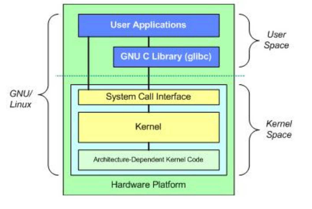
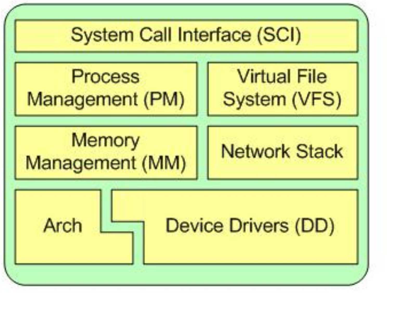
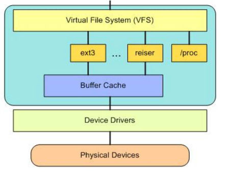
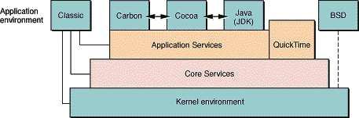
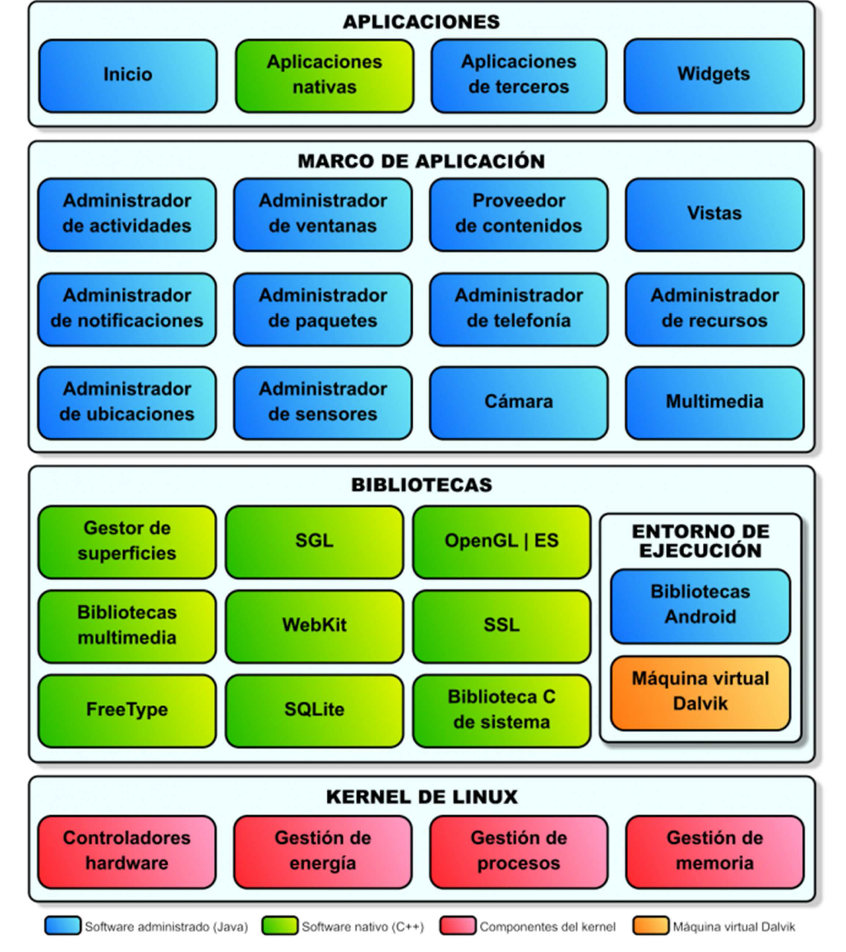
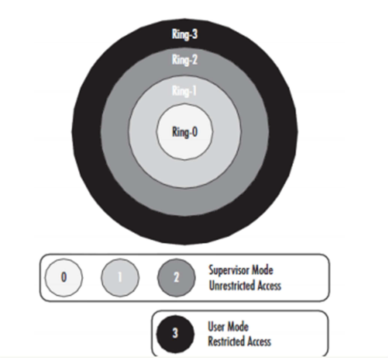
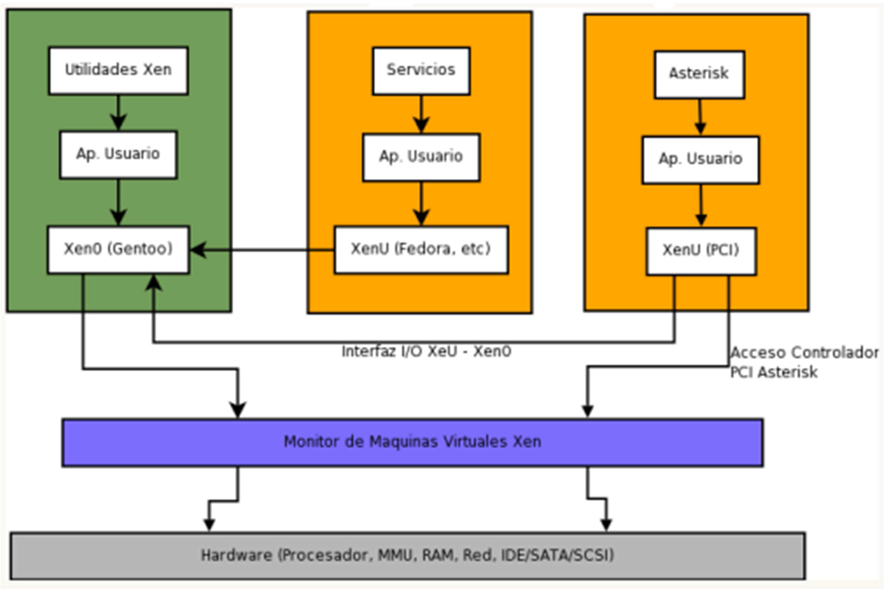

Sistemas Operativos
===================
2º Grado en Ingeniería Informática 2011/2012
--------------------------------------------

# Estructuras de Sistemas Operativos (GNU/Linux, Mac OS X e iOS, Android, Xen)
## David Bustos García
## Germán Martínez Maldonado
## José Rubén Sánchez Iruela
## Pablo Sánchez Robles

## 1.1 GNU/Linux

Linux es un núcleo monolítico, donde sus controladores de dispositivos y las extensiones del núcleo normalmente se ejecutan en un espacio privilegiado conocido como anillo, es considerado monolítico ya que agrupa a todos los servicios básicos en el núcleo.

A diferencia de los núcleos monolíticos tradicionales, los controladores de dispositivos y las extensiones al sistema operativo se pueden cargar y descargar fácilmente como módulos, mientras el sistema continúa funcionando sin interrupciones. También podemos decir que los controladores de dispositivos son fácilmente configurables como Loadable Kernel Modules, y se pueden cargar o descargar mientras se está ejecutando el sistema y pueden ser detenidos momentáneamente por actividades más importantes bajo ciertas condiciones.

Linux es un núcleo dinámico, el apoyo a la adición y la eliminación de componentes de software sobre la marcha. Estos son llamados módulos del kernel de carga dinámica, y se pueden insertar en el arranque, cuando se les necesita (cuando un dispositivo en particular se encuentra que requiere el módulo) o en cualquier momento por el usuario.

## 1.2 Estructura de GNU/Linux

En la parte superior es el usuario, o espacio de aplicación. Aquí es donde las aplicaciones de usuario se ejecutan. Debajo del espacio de usuario es el espacio del núcleo. También está la Biblioteca GNU C (glibc). Esto proporciona la interfaz de llamada al sistema que se conecta con el núcleo y proporciona el mecanismo para la transición entre la aplicación del espacio de usuario y el kernel.

Principales subsistemas del kernel de Linux.

### 1.2.1 System Call Interface (SCI)

El SCI es una fina capa que proporciona los medios para realizar llamadas a funciones desde el espacio de usuario en el núcleo. Esta interfaz puede ser dependiente de la arquitectura, incluso dentro de la misma familia de procesadores. El SCI es en realidad una interesante función llamada de servicio multiplexación y demultiplexación.

### 1.2.2 Process Management (PM)

La gestión del proceso se centra en la ejecución de procesos. Linux no separa los dos conceptos (los procesos y subprocesos). El núcleo proporciona una interfaz de programación de aplicaciones (API) a través del SCI para crear un nuevo proceso detener un proceso, y comunicarse y sincronizarse  entre  ellos. También en la gestión de procesos surge la necesidad de compartir la CPU entre los hilos activos.

### 1.2.3 Memory Management  (MM)

Para una mayor eficacia, la memoria se gestiona en lo que se llama las páginas, (4 KB de tamaño en la mayoría de las arquitecturas). Este esquema de gestión de memoria asigna las estructuras desde dentro, hace el seguimiento de las páginas que están llenas, parcialmente utilizadas, y vacías. Esto permite que el sistema crezca de manera dinámica y reducir el tamaño según las necesidades del sistema mayor. Hay momentos en que la memoria disponible puede agotarse. Por esta razón, las páginas se pueden mover fuera de la memoria y en el disco. Este proceso se llama intercambio.

### 1.2.4 Virtual File System (VFS)

El sistema de archivos virtual (VFS) proporciona una abstracción de interfaz común para los sistemas de archivos. La VFS ofrece una capa de cambio entre el SCI y los sistemas de archivos soportados por el núcleo.
En la parte superior de la VFS es una abstracción de la API común de funciones, tales como abrir, cerrar, leer y escribir. En la parte inferior de la VFS son las abstracciones del sistema de archivos que definen el funcionamiento de la capa superior. Por debajo de la capa de sistema de archivos es la caché del búfer, lo que proporciona un conjunto común de funciones a la capa de sistema de archivos (independiente de cualquier sistema de archivos en particular). Por debajo de la caché del búfer son los controladores de dispositivo

### 1.2.5 Network Stack

La pila de red, por su diseño, sigue una arquitectura por capas. Hay que recordar que el Protocolo de Internet (IP) es el núcleo de la red de protocolo de capa que se encuentra por debajo  del protocolo  de transporte (el más común en el Protocolo de Control de Transmisión o TCP). Por encima de TCP es la capa de sockets, que se invoca a través del SCI.

La capa de sockets es el API estándar para el subsistema de red y proporciona una interfaz de usuario para una gran variedad de protocolos de red. la capa de sockets proporciona una forma estandarizada para gestionar las conexiones y mover datos entre los extremos.

### 1.2.6 Device Drivers (DD)

El componente de controladores de dispositivos ofrece la gran cantidad de controladores de dispositivos que están disponibles. De hecho, casi la mitad de los archivos de código fuente del kernel de Linux se dedican a los controladores de dispositivos.

### 1.2.7 Arch

El subdirectorio ./Linux/arch define la porción dependiente de la arquitectura de las fuentes del kernel en un determinado número de subdirectorios que son específicos de la arquitectura (en conjunto forman el BSP).

## 2.1 Mac OS X e iOS

### 2.1.1 crokernel:

El microkernel que utiliza Mac OS X es Mach. Se encarga de administrar los recursos del procesador como el uso de CPU y la memoria, se ocupa de la programación, proporciona protección de memoria, y proporciona una infraestructura de mensajería centrada en el resto de las capas del sistema operativo. Ofrece:

* Comunicación entre procesos sin tipo (IPC).
* Llamadas a procedimientos remotos (RPC).
* Soporte para multiprocesamiento simétrico (SMP)
* Apoyo a servicios en tiempo real.
* Apoyo a la memoria virtual.
* Apoyo a los localizadores.
* Arquitectura modular.

### 2.1.2 Núcleo Monolítico:

XNU es el núcleo del sistema operativo Mac OS X, significa X No es Unix. Es un núcleo híbrido que combina Mach 3.0 con componentes de FreeBSD y una API orientada a objetos para escribir drivers llamada I/O Kit.

XNU es un híbrido y tiene características tanto de núcleo monolítico como de micronúcleo, haciendo un mejor uso de ambas tecnologías. Protege la memoria del sistema operativo y mantiene la velocidad de los núcleos monolíticos para desempeñar determinadas tareas. Los componentes de este núcleo son:

* Mach
* BSD
* I/O kit.
* Plataforma para desarrolladores.
* libkern y libsa (bibliotecas)

## 2.2 Estructura de Mac OS X e iOS:

En la siguiente imagen podemos ver la estructura por capas de Mac OS X:

### 2.2.1 rnel environment

El kernel (capa 0) proporciona los servicios esenciales para el funcionamiento del sistema. Consta de 5 componentes:

* **Mach**: Proporciona memoria protegida, memoria virtual y soporte a tiempo real.
* **BSD**: Sirve como base para el sistema de archivos y las redes. Provee sockets BSD, threads POSIX, políticas de seguridad básicas, etc.
* **I/O kit**: para los driver de los dispositivos.
* **Redes**: A través de los Network Kernel Extensions (NKE) es posible añadir módulos y hasta protocolos adicionales al kernel.

### 2.2.2 Core Services

Core Services (capa 1) ofrece los servicios que no están involucrados con la interfaz gráfica: manejo de strings, colecciones, procesos, threads, recursos, memoria e interacción con el sistema de archivos.

### 2.2.3 lications Services

La capa de Applications Services (capa 2) se encarga del manejo de la pantalla (rendering, ventanas, cursor), impresión y manejo de eventos. QuickTime es un caso especial. Provee servicios que pueden utilizar las aplicaciones, pero también ofrece servicios que son característicos de las aplicaciones.

### 2.2.4 lication environment

En la capa superior (capa 3) está el entorno de aplicación, o sea, los entornos donde se ejecutan las aplicaciones. Mac OS X provee 5:

* **Classic**: Para aplicaciones Mac OS 9. Este entorno utiliza directamente los servicios de las capas inferiores.
* **Cocoa**: Para las nuevas aplicaciones escritas específicamente para aprovechar las capacidades de Mac OS X.
* **Carbon**: Para las aplicaciones de Mac OS 9 modificadas para aprovechar algunas de las ventajas de Mac OS X.
* **Java**: Para las aplicaciones Java.
* **BSD**: Para los programas que se invocan a través de la línea de comandos. Este ambiente no depende de los servicios de las capas de Applications Services y Core Services, por tanto, hay una línea que lo une directamente con el Kernel.

## 3.1 Android

Android es un sistema operativo basado en el núcleo Linux diseñado y orientado a dispositivos móviles, principalmente para smartphones, pero también disponible para tablets, reproductor MP3, netbooks, PCs, televisores y diversos aparatos, en los que día a día, se puede encontrar una adaptación de este sistema operativo.

Al estar basado en un núcleo Linux, al igual que este, usa una estructura monolítica, pero no funciona igual que otros sistemas operativos basados en un núcleo Linux, además de que en Android no disponemos de muchos componentes que podemos encontrar en Linux, como pueden ser las consolas, los compiladores o los cargadores de arranque entre otros.

De todas maneras, aunque Android tiene un núcleo Linux, todas las aplicaciones corren bajo Dalvik, una máquina virtual Java que se ejecuta por encima del núcleo del sistema, el kernel es simplemente una capa de abstracción del hardware para que los componentes de Android, Dalvik, las bibliotecas y las aplicaciones sean ejecutadas sobre un entorno estandarizado que no dependa del hardware, esto es especialmente útil, porque al existir cientos de modelos de terminales que usan Android, simplemente modificando una pequeña parte del sistema operativo (la encargada de la comunicación con el hardware), evitamos complicaciones a la hora de realizar actualizaciones o nuevos desarrollos que harían que tuviéramos que modificar todo el sistema operativo.

## 3.2 Estructura de Android

En el siguiente esquema podremos ver muy bien desarrollada la distribución de las diferentes capas en la estructura de un sistema Android.

Podemos diferenciar 4 capas principalmente: Aplicaciones, Marco de aplicación, Bibliotecas y el Kernel de Linux. El entorno  de ejecución, no  se considera una capa, ya que básicamente es un conjunto de bibliotecas que usan otras bibliotecas.

### 3.2.1 Aplicaciones

Aquí podemos encontrar todo tipo de aplicaciones básicas que será las que usaremos en el teléfono, tanto  de forma intencionada como involuntariamente. Podemos distinguir varios tipos:

* **Inicio**: son las aplicaciones lanzadas automáticamente al arrancar el dispositivo, el ejemplo más claro puede ser, cuando al encender un teléfono se nos pide introducir el código PIN de la tarjeta SIM para poder desbloquear la realización de llamadas, el acceso a la agenda, etc.
* **Aplicaciones nativas**: son las aplicaciones propias del sistema para gestionar diferentes tareas como son la agenda de contactos, los mensajes SMS o los ajustes de la configuración del terminal.
* **Aplicaciones de terceros**: son todas las aplicaciones que le instalemos de forma externa al terminal: un reproductor de audio, un navegador web, un GPS, juegos...
* **Widgets***: son aplicaciones que, contando normalmente con la misma finalidad que las aplicaciones de terceros, tienen una funcionalidad y una representación mucho más pequeña que estas, destacan por ser especialmente vistosas, los más normales son del tipo de relojes en pantalla, información meteorológica, notas…

También cabe destacar que mientras que las aplicaciones de inicio, de terceros y de Widgets, se encuentran en Java, las aplicaciones nativas lo hacen en C++, esto es debido a que estas últimas al trabajar a un nivel más interno, por lo que no podrán ser interpretadas por la máquina virtual Dalvik.

### 3.2.2 Marco de Aplicación

El marco de aplicación consiste en un conjunto de software utilizado por los desarrolladores de software para implementar la estructura estándar de una aplicación en el entorno  de desarrollo. Los sistemas Android proporcionan una plataforma abierta de desarrollo (siguiendo la filosofía del desarrollo de aplicaciones en sistemas GNU/Linux), para que eso pueda ocurrir, se ofrece a los desarrolladores acceso total al hardware del dispositivo y a la API de un mismo marco, dando la posibilidad de estás ser modificadas y compartidas.

Como podemos ver en el esquema de la arquitectura de Android anterior, son muchos los marcos disponibles y muchas las funciones que podemos conseguir a través de ellos: notificaciones (como poder realizar notificaciones propias en la barra de estado), vistas (como poder usar cajas de texto o botones), sensores (como mostrar un velocímetro) y muchos más disponibles.

### 3.2.3 Bibliotecas

En los sistemas Android se pone a disposición de los desarrolladores un gran número de bibliotecas (algunas en lenguaje C++, aunque la gran mayoría en C), para que se pueden acceder a sus funcionalidades a través de los diversos marcos de aplicación. Algunas de estas bibliotecas son las siguientes:

* **Gestor de superficies (Surface Manager)**: se encarga de componer las imágenes que se muestran en pantalla a partir de capas gráficas 2D y 3D.
* **SGL (Scalable Graphics Library)**: El motor gráfico 2D de Android.
* **OpenGL | ES (OpenGL for Embedded Systems)**: motor gráfico 3D que proporcionada aceleración gráfica (si está disponible en el dispositivo) o en caso de no estar disponible, un motor software altamente optimizado.
* **WebKit**: motor web usado por el navegador.
* **Biblioteca C de sistema**: Bibliotecas que proporcionan funcionalidad básica para la ejecución de aplicaciones.

### 3.2.4 Entorno de ejecución

Como hemos dicho, el entorno de ejecución no  se considera una capa de la arquitectura del sistema Android, esto es porque aunque se basa en las bibliotecas de la capa antes descrita, este entorno, en su interior no más que otro conjunto de bibliotecas.
Aquí podremos diferenciar dos partes:

* Las bibliotecas Android, que proporcionan funcionalidades básicas para el sistema Android.
* La máquina virtual Dalvik, está es la parte más importante del entorno de ejecución, porque es la encargada de ejecutar todas las aplicaciones no nativas del sistema, se considera una máquina virtual Java, pero no lo es exactamente, es compatible con archivos de clases para máquina virtual Java, siempre que estos antes sean convertidos al formato  compatible con Dalvik. Como  cada aplicación se ejecuta en un proceso propio, Dalvik ha sido escrito para que se pueden ejecutar varias máquinas virtuales de forma eficiente.

### 3.2.5 Kernel de Linux

Finalmente el nivel más bajo en la estructura de un sistema Android, el núcleo, un núcleo Linux. Android se basa en un kernel Linux 2.6, similar al de cualquier distribución basada en GNU/Linux medianamente actual, pero adaptado a las características del hardware en el que se ejecutará el sistema.

Como indicamos al principio, el núcleo Linux, proporciona una capa de abstracción para que sea posible acceder a los componentes del sistema sin tener que conocer las características específicas a nivel hardware del dispositivo. Para que los elementos software puedan acceder a los elementos hardware, el núcleo provee al sistema de los controladores hardware, además también se encargará de gestionar los diferentes recursos del dispositivo como son la energía, los procesos y la memoria.

## 4.1 Xen

Xen es una máquina virtual, que usa un hypervisor, para ordenadores x86  que permite ejecutar múltiples máquinas virtuales, cada una con su propio sistema operativo, y lo hace con un rendimiento prácticamente idéntico a una ejecución nativa de ese sistema. Normalmente se sufre una penalización del 2% y en casos extremos del 8%. Para ejecutar un sistema operativo sobre Xen este debe sufrir ligeras modificaciones para adaptarse a su API, pero una vez modificado el sistema operativo el resto de aplicaciones no debe sufrir ningún tipo de cambio, y esta es una de las grandes características de Xen frente a otros paravirtualizadores como Denali, un gran rendimiento sin modificar aplicaciones y librerías.

### 4.1.1 Xen Hypervisor

Xen Hypervisor es una capa de software corriendo directamente sobre un hardware de computadora reemplazando el S.O. permitiendo al hardware de computadora correr múltiples S.O. Guest concurrentemente.

## 4.2 Estructura de Xen

Xen hace uso del modo protegido del i386, donde la CPU está compuesta por 4 anillos.

El ring 0 se usa normalmente para el kernel del sistema operativo y el ring 3 se usa para las aplicaciones de usuario.

El Hypervisor corre en ring 0, los Sistemas Operativos invitados corren en ring 1 y las aplicaciones en ring 3. Con esto aprovechamos el ring 1 como una capa más de protección, algo que nadie hasta ahora había hecho. En tiempo de arranque del sistema operativo anfitrión Xen se carga en memoria y ejecuta un kernel parcheado en Ring 1 que se llama domain0.

Desde este domino será desde el cual se podrá crear, destruir, migrar o detener el resto de dominios. Estos dominios creados también funcionarán en ring1, mientras que sus aplicaciones lo harán en ring3. Para poder acceder a los dispositivos físicos de una forma segura Xen utiliza el domain0 que es el único que puede acceder a ellos, de modo que los sistemas operativos que corran en dominios, como ya hemos dicho deberán ser parcheados para acceder a los dispositivos físicos. Este es el mayor inconveniente de Xen, pero  cuando dispongamos de la tecnología de virtualización por hardware tanto de AMD como Intel este problema no existirá.

1. La primera capa (gris) es el hardware del servidor.
2. Sobre el hardware corre Xen (lila), el cual restringe las direcciones de memoria y el acceso a los dispositivos.
3. Xen ejecuta Xen0 (verde), el cual es el sistema operativo que tiene acceso a todos los dispositivos encontrados en la computadora, ejecutándose con RAM restringida.- 74 –
4. Dentro de Xen0, se inicia el arranque de los servidores virtuales XenU (naranja), de las cuales una es un prestador de servicios (web, correo, etc.) y la otra controla un dispositivo PCI.
5. El servidor virtual XenU que requiere de acceso a un dispositivo PCI, se comunica al monitor Xen (lila) y para sus servicios de ejecución, se comunica con Xen0 (verde).
