Diseño y Desarrollo de Sistemas de Información
==============================================
3º Grado en Ingeniería Informática 2012/2013
--------------------------------------------


# Sistema de Información de un gimnasio genérico

### Germán Martínez Maldonado
### José Rubén Sánchez Iruela
### Pablo Sánchez Robles

## Descripción detallada del proyecto

Un gimnasio nos ha encargado que desarrollemos un sistema de información que se encargue de la gestión de empleados, gestión de clientes, gestión de las clases impartidas, gestión de las finanzas y del control de acceso al gimnasio por parte de los clientes.

En la **gestión de empleados** se debe llevar un registro de los datos de cada empleado, dichos registros serán almacenados en una base de datos, además, también serán almacenadas las sesiones que inicien durante su jornada laboral, con el objetivo de llevar una contabilidad de la productividad durante las horas trabajadas. Una vez que estos terminan su jornada laboral deberán cerrar su sesión. También tendremos como empleados a los profesores del gimnasio, pero estos no tendrán que iniciar sesión en el sistema. Los datos de cada empleado que se almacenaran en el sistema son: Nombre, DNI, Teléfono de contacto, email, usuario y contraseña.

En la parte de la **gestión de clientes** se almacenará un registro de los datos personales necesarios para poder llevar un control de los clientes, la mayoría de estos datos estarán ocultos para los usuarios y solo se utilizarán para cuestiones de pagos. Todos los datos relacionados con los clientes estarán con un nivel de seguridad conforme a la Ley de Protección de Datos. A cada cliente se le dará una tarjeta identificadora que se usará para el control de entrada y salida de las instalaciones, este control tendrá un registro con todos los usuarios que entran diariamente en el gimnasio. De los clientes se almacenará: DNI, nombre y apellidos, foto, teléfono de contacto, e-mail, tarifa contratada, número de clases asistidas, si tiene los pagos de las clases al día, número de clases asistidas durante la semana, y opcionalmente, número de cuenta para domiciliar pagos.

En la **gestión de clases** tendremos un registro de los datos que almacenará la información sobre cada clase, entre lo que se incluye: nombre del entrenador que impartirá dicha clase, la hora de comienzo, la duración de la clase, la cantidad de personas que pueden asistir, una lista de los asistentes (los asistentes han de ser clientes registrados) y un campo descripción en el que se explica en qué consistirá dicha clase. Para que un cliente pueda asistir a una clase, primero debe comunicárselo a un empleado, y este será el encargado de apuntarlo a la clase solicitada, en función de si dispone de plazas libres o no, además el cliente debe disponer también de horas de clase libres en la tarifa que haya contratado, es decir, no puede haber agotado el número de clases que pueden dar a la semana con la tarifa que tiene contratada.

Tendremos una parte de **gestión financiera** en la cual nos permitirá llevar un control de los beneficios por días, meses y años. También podremos ver los gastos generados durante los meses en concepto de nóminas y pagos a proveedores. Para ello tendremos que registrar todas las operaciones económicas que se hagan en el gimnasio, almacenaremos en el sistema todo lo correspondiente al importe de tarifas del gimnasio, salario de los empleados, pagos realizados a los proveedores y demás aspectos relacionados con el ámbito monetario. El gestor financiero podrá realizar estadísticas y gráficos.

Finalmente, dispondremos de una **gestión de entradas y salidas** que nos permitirá controlar cuando entran y salen los clientes de las instalaciones. Todo cliente deberá acceder identificándose a la entrada con la tarjeta de identificación ya mencionada, no pudiendo acceder si no está al corriente de los pagos de su clases, y volver a identificarse a la salida para controlar el número de horas que permanece en las clases.


## Análisis de requisitos

### Análisis de requisitos.

#### REQUISITOS DE DATOS

**RD1:** Datos  para  dar  de  alta  nuevos  empleados,  proporcionados  por  los  propios  empleados  y  se componen de:
* Nombre
* DNI
* Teléfono
* Email
* Usuario
* Contraseña
* Fecha

**RD2**: Datos para dar de alta nuevos empleados y se compone de:
* Nombre
* DNI
* Teléfono
* Email
* Usuario
* Contraseña
* Fecha

**RD3**: Datos para dar de baja a un empleado, proporcionado por el administrador y se compone de:
* DNI

**RD4**: Datos para dar de baja a un empleado y se compone de:
* Nombre
* DNI
* Teléfono
* Email
* Usuario
* Contraseña
* Fecha

**RD5**: Datos para modificar un empleado, proporcionado por el administrador y se compone de:
* Nombre
* DNI
* Teléfono
* Email
* Usuario
* Contraseña
* Fecha

**RD6**: Datos para modificar un empleado y se compone de:
* Nombre
* DNI
* Teléfono
* Email
* Usuario
* Contraseña
* Fecha

**RD7**: Datos para listar los empleados y se compone de:
* Botón

**RD8**: Datos para listar los empleados y se compone de:
* Nombre
* DNI
* Teléfono
* Email
* Usuario
* Contraseña
* Fecha

**RD9**: Listado de los empleados y se compone de:
* Nombre
* DNI
* Teléfono
* Email
* Usuario
* Contraseña
* Fecha

**RD10**: Datos para buscar un empleado, proporcionado por el administrador y se compone de:
* DNI.

**RD11**: Datos para buscar un empleado y se compone de:
* Nombre
* DNI
* Teléfono
* Email
* Usuario
* Contraseña
* Fecha

**RD12**: Datos que proporciona la búsqueda de un empleado y se compone de:
* Nombre
* DNI
* Teléfono
* Email
* Usuario
* Contraseña
* Fecha

**RD13**: Datos para mostrar los beneficios por día, proporcionados por el administrador y se compone de:
* Ingreso clientes
* Fecha de pago

**RD14**: Datos para mostrar los beneficios por día, se compone de:
* Ingreso clientes
* Total pago
* Fecha de pago

**RD15**: Datos para mostrar los beneficios por día, se compone de:
* Ingreso clientes.
* Total pago
* Fecha de pago
* Día

**RD16**: Datos para mostrar los beneficios por mes, proporcionados por el administrador y se compone de:
* Ingreso clientes
* Fecha de pago

**RD17**: Datos para mostrar los beneficios por mes, se compone de:
* Ingreso clientes
* Total pago
* Fecha de pago

**RD18**: Datos para mostrar los beneficios por mes, se compone de:
* Ingreso clientes
* Total pago
* Fecha de pago

**RD19**: Datos para mostrar los beneficios por año, proporcionados por el administrador y se compone de:
* Ingreso clientes
* Fecha de pago

**RD20**: Datos para mostrar los beneficios por año, se compone de:
* Ingreso clientes
* Total pago
* Fecha de pago

**RD21**: Datos para mostrar los beneficios por año, se compone de:
* Ingreso clientes
* Total pago
* Fecha de pago

**RD22**: Datos para mostrar los gastos por día, proporcionados por el administrador y se compone de:
* Pagos a empleados y gastos extras (administrador)
* Fecha de pago

**RD23**: Datos para mostrar los gastos por día, se compone de:
* Pagos a empleados y gastos extras (administrador)
* Total pago
* Fecha de pago

**RD24**: Datos para mostrar los gastos por día, se compone de:
* Pagos a empleados y gastos extras (administrador)
* Total pago
* Fecha de pago

**RD25**: Datos para mostrar los gastos por mes, proporcionados por el administrador y se compone de:
* Pagos a empleados y gastos extras (administrador)
* Fecha de pago

**RD26**: Datos para mostrar los gastos por mes, se compone de:
* Pagos a empleados y gastos extras (administrador)
* Total pago
* Fecha de pago

**RD27**: Datos para mostrar los gastos por mes, se compone de:
* Pagos a empleados y gastos extras (administrador)
* Total pago
* Fecha de pago

**RD28**: Datos para mostrar los gastos por año, proporcionados por el administrador y se compone de:
* Pagos a empleados y gastos extras (administrador)
* Fecha de pago

**RD29**: Datos para mostrar los gastos por año, se compone de:
* Pagos a empleados y gastos extras (administrador)
* Total pago
* Fecha de pago

**RD30**: Datos para mostrar los gastos por año, se compone de:
* Pagos a empleados y gastos extras (administrador)
* Total pago
* Fecha de pago

**RD31**: Datos para dar de alta una nueva nomina en el sistema, proporcionados por el empleado y se compone:
* Nombre
* DNI
* Sueldo
* Fecha
* Nº CC

**RD32**: Datos para dar de alta una nueva nomina en el sistema, se compone:
* Nombre
* DNI
* Sueldo
* Fecha
* Nº CC

**RD33**: Datos para eliminar una nomina que haya sido dada de alta en el sistema, proporcionados por el administrador y se compone:
* DNI

**RD34**: Datos para dar eliminar una nomina que haya sido dada de alta en el sistema, se compone:
* Nombre
* DNI
* Sueldo
* Fecha
* Nº CC

**RD35**: Datos para modificar una nomina que haya sido dada de alta en el sistema, proporcionados por el administrador y se compone:
* Nombre
* DNI
* Sueldo
* Fecha
* Nº CC

**RD36**: Datos para modificar una nomina que haya sido dada de alta en el sistema, se compone:
* Nombre
* DNI
* Sueldo
* Fecha
* Nº CC

**RD37**: Datos para buscar una nomina que haya sido dada de alta en el sistema, proporcionados por el administrador y se compone:
* DNI

**RD38**: Datos para buscar una nomina que haya sido dada de alta en el sistema, se compone:
* Nombre
* DNI
* Sueldo
* Fecha
* Nº CC

**RD39**: Datos de la búsqueda de una nomina que haya sido dada de alta en el sistema, se compone:
* Nombre
* DNI
* Sueldo
* Fecha
* Nº CC

**RD40**: Datos para dar de alta nuevos gastos extras en el sistema, proporcionados por el administrador y se compone:
* Cantidad
* ID_gastos_extra
* Descripción
* ID_administrador

**RD41**: Datos para dar de alta nuevos gastos extras en el sistema, se compone:
* Cantidad
* ID_gastos_extra
* Descripción
* ID_administrador

**RD42**:  Datos  para  eliminar  gastos  extras  en  el  sistema,  proporcionados  por  el  administrador  y  se compone:
* ID_gastos_extra

**RD43**: Datos para eliminar gastos extras en el sistema, se compone:
* Cantidad
* ID_gastos_extra
* Descripción
* ID_administrador

**RD44**: Datos para modificar gastos extras en  el sistema, proporcionados por el administrador y se compone:
* Cantidad
* ID_gastos_extra
* Descripción
* ID_administrador

**RD45**: Datos para modificar gastos extras en el sistema, se compone:
* Cantidad
* ID_gastos_extra
* Descripción
* ID_administrador

**RD46**: Datos para buscar gastos extras en el sistema, proporcionados por el administrador y se compone:
* ID_gastos_extra

**RD47**: Datos para buscar gastos extras en el sistema, se compone:
* Cantidad
* ID_gastos_extra
* Descripción
* ID_administrador

**RD48**: Datos mostrados de la búsqueda de gastos extras en el sistema, se compone:
* Cantidad
* ID_gastos_extra
* Descripción
* ID_administrador

**RD49**:  Datos  para  crear  un  nuevo  ingreso  de  un  cliente,  proporcionado  por  el  administrador  y se compone:
* DNI_cliente
* Total
* Fecha

**RD50**: Datos para crear un nuevo ingreso de un cliente, se compone:
* DNI_cliente
* Total
* Fecha

**RD51**: Datos para buscar un ingreso de un cliente proporcionados por el administrador y se compone:
* DNI_cliente

**RD52**: Datos para buscar un ingreso de un cliente y se compone:
* DNI_cliente
* Total
* Fecha

**RD53**: Datos de la búsqueda de un ingreso de un cliente y se compone:
* DNI_cliente
* Total
* Fecha

**RD54**: Datos para dar de alta una nueva tarifa, proporcionados por el administrador y se compone:
* ID_tarifa
* Turno
* Precio
* Descripción

**RD55**: Datos para dar de alta una nueva tarifa, se compone:
* ID_tarifa
* Turno
* Precio
* Descripción

**RD56**: Datos para eliminar una tarifa, proporcionados por el administrador y se compone:
* ID_tarifa

**RD57**: Datos para dar eliminar una tarifa, se compone:
* ID_tarifa
* Turno
* Precio
* Descripción

**RD58**: Datos para modificar una tarifa, proporcionados por el administrador y se compone:
* ID_tarifa

**RD59**: Datos para modificar una tarifa, se compone:
* ID_tarifa
* Turno
* Precio
* Descripción

**RD60**: Datos para registrar un nuevo cliente, proporcionados por los clientes y se compone de:
* DNI
* Nombre
* Apellidos
* Foto
* Tarifa
* Teléfono
* E-mail

**RD61**: Datos para registrar un nuevo cliente, se compone de:
* DNI
* Nombre
* Apellidos
* Foto
* Teléfono
* E-mail
* Tarifa

**RD62**: Datos para eliminar un cliente, proporcionados por el administrador y se compone de:
* DNI

**RD63**: Datos para eliminar un cliente, se compone de:
* DNI
* Nombre
* Apellidos
* Foto
* Teléfono
* E-mail
* Tarifa

**RD64**: Datos para modificar un cliente, proporcionados por los administrador y se compone de:
* DNI

**RD65**: Datos para modificar un cliente, se compone de:
* DNI
* Nombre
* Apellidos
* Foto
* Teléfono
* E-mail
* Tarifa

**RD66**: Datos para listar clientes, se compone de:
* Botón

**RD67**: Datos para listar clientes, se compone de:
* DNI
* Nombre
* Apellidos
* Foto
* Teléfono
* E-mail
* Tarifa

**RD68**: Listado de clientes, se compone de:
* DNI
* Nombre
* Apellidos
* Foto
* Teléfono
* E-mail
* Tarifa

**RD69**: Datos para buscar un cliente, proporcionados por el administrador y se compone de:
* DNI

**RD70**: Datos para buscar un cliente, se compone de:
* DNI
* Nombre
* Apellidos
* Foto
* Teléfono
* E-mail
* Tarifa

**RD71**: Resultado de la búsqueda de clientes, se compone de:
* DNI
* Nombre
* Apellidos
* Foto
* Teléfono
* E-mail
* Tarifa

**RD72**: Datos para registrar una nueva clase, proporcionados por los empleados y se compone de:
* ID_clase
* Nº alumnos
* Nombre profesor
* Días de la semana
* Hora
* Numero de clase
* Descripción

**RD73**: Datos para registrar una nueva clase, se compone de:
* ID_clase
* Nº alumnos
* Nombre profesor
* Días de la semana
* Hora
* Numero de clase
* Descripción

**RD74**: Datos para eliminar una clase, proporcionados por los empleados y se compone de:
* ID_clase

**RD75**: Datos para eliminar una clase, se compone de:
* ID_clase
* Nº alumnos
* Nombre profesor
* Días de la semana
* Hora
* Numero de clase
* Descripción

**RD76**: Datos para modificar una clase, proporcionados por los empleados y se compone de:
* ID_clase

**RD77**: Datos para modificar una clase, se compone de:
* ID_clase
* Nº alumnos
* Nombre profesor
* Días de la semana
* Hora
* Numero de clase
* Descripción

**RD78**: Datos para listar clases, se compone de:
* ID_clase

**RD79**: Datos para listar clases, se compone de:
* ID_clase
* Nº alumnos
* Nombre profesor
* Días de la semana
* Hora
* Numero de clase
* Descripción

**RD80**: Listado de clases se compone de:
* ID_clase
* Nº alumnos
* Nombre profesor
* Días de la semana
* Hora
* Numero de clase
* Descripción

**RD81**: Datos para buscar una clase, proporcionados por el administrador y se compone de:
* ID_clase

**RD82**: Datos para buscar una clase, se compone de:
* ID_clase
* Nº alumnos
* Nombre profesor
* Días de la semana
* Hora
* Numero de clase
* Descripción

**RD83**: Resultado de la búsqueda de clase, se compone de:
* ID_clase
* Nº alumnos
* Nombre profesor
* Días de la semana
* Hora
* Numero de clase
* Descripción

**RD84**: Datos para acceder al sistema a la entrada del gimnasio, proporcionados por el cliente y se compone de :
* DNI

**RD85**: Datos para acceder al sistema a la entrada del gimnasio, se compone de :
* DNI

**RD86**: Datos para des acceder al sistema a la salida del gimnasio, proporcionados por el cliente y se compone de:
* DNI

**RD87**: Datos para des acceder al sistema a la salida del gimnasio, se compone de:
* DNI

**RD88**: Datos para apuntarse a clases, proporcionados por el cliente y se compone de:
* DNI
* ID_clase

**RD89**: Datos para apuntarse a clases, se compone de :
* DNI
* IDClase

**RD90**: Datos para desapuntarse a clases, proporcionados por el cliente y se compone de:
* DNI
* ID_clase

**RD91**: Datos para desapuntarse a clases, se compone de :
* DNI
* IDClase

**RD92**: Datos de listado de nominas de los empleados, se compone de:
* DNI

**RD93**: Datos de listado de nominas de los empleados, se compone de:
* DNI
* Sueldo
* Número Cuenta Corriente
* Fecha de pago

**RD94**: Datos de listado de nominas de los empleados, se compone de:
* DNI
* Sueldo
* Número Cuenta Corriente
* Fecha de pago

**RD95**: Datos de entrada de un cliente, se compone de:
* DNI
* Fecha

**RD96**: Datos de entrada de un cliente almacenados, se compone de:
* DNI
* Fecha
* Horas

**RD97**: Datos de entrada de un cliente almacenados, se compone de:
* DNI
* Fecha
* Horas

**RD98**: Datos de entrada de un cliente, se compone de:
* DNI
* Fecha

**RD99**: Datos de entrada de un cliente almacenados, se compone de:
* DNI
* Fecha
* Horas

**RD100**: Datos de entrada de un cliente almacenados, se compone de:
* DNI
* Fecha
* Horas

#### REQUISITOS FUNCIONALES

**RF1: Alta de empleado:** esta función registra un empleado dentro del sistema, a partir de los datos que proporciona el usuario.
* Entrada: RD1
* Manejo: RD2

**RF2: Eliminación de empleado:** esta función permite eliminar un empleado del sistema, a partir de los datos que proporcione el administrador.
* Entrada: RD3
* Manejo: RD4

**RF3: Modificación de empleado:** esta función permite modificar un empleado del sistema, a partir de los datos que proporcione el empleado.
* Entrada: RD5
* Manejo: RD6

**RF4: Listado de empleados:** esta función permite listar todos los empleados almacenados en el sistema, a partir de los datos que proporcione el administrador.
* Entrada: RD8
* Manejo: RD7
* Salida: RD9

**RF5: Búsqueda de empleado:** esta función permite buscar un empleado para consultar sus datos, a partir de los datos que proporcione el administrador.
* Entrada: RD10
* Manejo: RD11
* Salida: RD12

**RF6: Mostrar beneficios por día:** esta función permitirá mostrar las ganancias del un día cualquiera, a partir de los datos que proporcione el administrador.
* Entrada: RD13
* Manejo: RD14
* Salida: RD15

**RF7: Mostrar beneficios por mes:** esta función permitirá mostrar las ganancias del un mes cualquiera, a partir de los datos que proporcione el administrador.
* Entrada: RD16
* Manejo: RD17
* Salida: RD18

**RF8: Mostrar beneficios por año:** esta función permitirá mostrar las ganancias del un ano cualquiera, a partir de los datos que proporcione el administrador.
* Entrada: RD19
* Manejo: RD20
* Salida: RD21

**RF9: Mostrar gastos por día:** esta función permitirá mostrar las gastos del un día cualquiera, a partir de los datos que proporcione el administrador.
* Entrada: RD22
* Manejo: RD23
* Salida: RD24

**RF10: Mostrar gastos por mes:** esta función permitirá mostrar las gastos del un mes cualquiera, a partir de los datos que proporcione el administrador.
* Entrada: RD25
* Manejo: RD26
* Salida: RD27

**RF11: Mostrar gastos por año:** esta función permitirá mostrar las gastos del un ano cualquiera, a partir de los datos que proporcione el administrador.
* Entrada: RD28
* Manejo: RD29
* Salida: RD30

**RF12: Alta nomina:** esta función permite añadir una nueva nomina al sistema, a partir de los datos de que proporciona el administrador.
* Entrada: RD31
* Manejo: RD32

**RF13: Eliminar nomina:** esta función permite eliminar una nomina que se encuentre dada de alta en el sistema, a partir de los datos que proporciona el administrador.
* Entrada: RD33
* Manejo: RD34

**RF14: Modificar nomina:** esta función permite modificar una nomina que se encuentre en el sistema, a partir de los datos que proporcione el administrador.
* Entrada: RD35
* Manejo: RD36

**RF15: Buscar nomina:** esta funcione permite visualizar una nomina que se encuentre en el sistema, a partir de los datos que proporcione el administrador.
* Entrada: RD37
* Manejo: RD38
* Salida: RD39

* **RF16: Nuevo pago administrador:** esta función permite añadir un nuevo gasto al sistema, a partir de los datos que proporciona el administrador.
* Entrada: RD40
* Manejo: RD41

**RF20: Listar nomina:** esta funcione permite visualizar un listado de las nominas que se encuentran en el sistema, a partir de los datos que proporcione el administrador.
* Manejo: RD92.
* Manejo: RD93.
* Salida: RD94.

**RF22: Eliminar pago administrador:** esta función permite eliminar un gasto que se encuentre dado de alta en el sistema, a partir de los datos que proporciona el administrador.
* Entrada: RD42
* Manejo: RD43.

**RF23: Modificar pago administrador:** esta función permite modificar un pago que se encuentre en el sistema, a partir de los datos que proporcione el administrador.
* Entrada: RD44
* Manejo: RD45

**RF24: Buscar pago administrador:** esta funcione permite visualizar un pago que se encuentre en el sistema, a partir de los datos que proporcione el administrador.
* Entrada: RD46
* Manejo: RD47
* Salida: RD48

**RF25: Ingreso cliente:** esta función permite añadir un nuevo ingreso al sistema, a partir de los datos  que proporciona el administrador.
* Entrada: RD49
* Manejo: RD50

**RF26: Buscar ingreso cliente:** esta función permite buscar un nuevo ingreso en el sistema, a partir de los datos  que proporciona el administrador.
* Entrada: RD51
* Manejo: RD52
* Salida: RD53

**RF27: Alta tarifa:** esta función permite añadir una tarifa nueva al sistema, a partir de los datos que proporciona el administrador.
* Entrada: RD54
* Manejo: RD55

**RF28: Eliminar tarifa:** esta función permite eliminar una tarifa que haya sido dada de alta en el sistema, a partir de los datos que proporcione el administrador.
* Entrada: RD56
* Manejo: RD57

**RF29: Modificar tarifa:** esta función permite modificar una tarifa que se encuentre en el sistema, a partir de los datos que proporcione el administrado.
* Entrada: RD58
* Manejo: RD59

**RF30: Alta de cliente:** esta función registra un cliente dentro del sistema, a partir de los datos que proporciona el cliente.
* Entrada: RD60
* Manejo: RD61

**RF31: Eliminación de cliente:** esta función permite eliminar un cliente del sistema, a partir de los datos que proporcione el administrador.
* Entrada: RD62
* Manejo: RD63

**RF32: Modificación de cliente:** esta función permite modificar un cliente del sistema, a partir de los datos que proporcione el cliente.
* Entrada: RD64
* Manejo: RD65

**RF33: Listado de clientes:** esta función permite listar todos los clientes almacenados en el sistema, a partir de los datos que proporcione el empleado.
* Manejo: RD66
* Manejo: RD67
* Salida: RD68

**RF34: Búsqueda de cliente:** esta función permite buscar un cliente para consultar sus datos, a partir de los datos que proporcione el empleado.
* Entrada: RD69
* Manejo: RD70
* Salida: RD71

**RF45: Alta de clases:** esta función registra una clase dentro del sistema, a partir de los datos que proporciona el administrador.
* Entrada: RD72
* Manejo: RD73

**RF46: Eliminación de clases:** esta función permite eliminar una clase del sistema, a partir de los datos que proporcione el administrador.
* Entrada: RD74
* Manejo: RD75

**RF47: Modificación de clases:** esta función permite modificar una clase del sistema, a partir de los datos que proporcione el administrador.
* Entrada: RD76
* Manejo: RD77

**RF48: Listado de clases:** esta función permite listar todas las clases almacenados en el sistema, a partir de los datos que proporcione el empleado.
* Entrada: RD78
* Manejo: RD79
* Salida: RD80

**RF49: Búsqueda de clases:** esta función permite buscar una clase para consultar sus datos, a partir de los datos que proporcione el empleado.
* Entrada: RD81.
* Manejo: RD82.
* Salida: RD83

**RF50: Entrada de clientes:** esta función permite reconocer al sistema el usuario que entra al gimnasio, a partir de los datos que proporciona la tarjeta electrónica del cliente.
* Entrada: RD84
* Manejo: RD85.

**RF51: Salida de clientes:** esta función permite reconocer al sistema el usuario que sale al gimnasio, a partir de los datos que proporciona la tarjeta electrónica del cliente.
* Entrada: RD86
* Manejo: RD87.

**RF52: Apuntarse a clase:** esta función permite al cliente apuntarse a las clases del gimnasio, a partir de los datos que proporciona el cliente.
* Entrada: RD88.
* Manejo: RD89

**RF53: Desapuntarse de clase:** esta función permite desapuntarse de una clase que previamente se haya apuntado, a partir de los datos que proporciona el cliente.
* Entrada: RD90
* Manejo: RD91.

**RF54: Listar entradas cliente:** esta funcione permite visualizar un listado de las horas de entradas de un cliente que se encuentran en el sistema, a partir de los datos proporcionados por el empleado.
* Manejo: RD95.
* Manejo: RD96.
* Salida: RD97.

**RF55: Listar salidas cliente:** esta funcione permite visualizar un listado de las horas de salida de un cliente que se encuentran en el sistema, a partir de los datos proporcionados por el empleado.
* Manejo: RD98.
* Manejo: RD99.
* Salida: RD100.

#### RESTRICCIONES SEMÁNTICAS

**RS1**: Afecta RF12. RD31. RD32. Para crear una nómina hay que tener al empleado dado de alta.
**RS2**: Afecta RF50, RD84, RD85 Un cliente que ya haya accedido a las instalaciones, no podrá volver a registrar su entrada hasta que realice una salida.
**RS3**: Afecta RF51, RD86, Rd87 RD Un cliente que no haya registrado su entrada no podrá realizar la salida.
**RS4**: Afecta RF50, RD88, RD89 Un cliente no podrá apuntarse a clase si esta ya está completa.

#### VALIDACIÓN CRUZADA DE REQUISITOS DE DATOS

|   RD  | Entrada | Manejo | Salida |
|:-----:|:-------:|:------:|:------:|
|  RD1  |   RF1   |        |        |
|  RD2  |         |   RF1  |        |
|  RD3  |   RF2   |        |        |
|  RD4  |         |   RF2  |        |
|  RD5  |   RF3   |        |        |
|  RD6  |         |   RF3  |        |
|  RD7  |         |   RF4  |        |
|  RD8  |   RF4   |        |        |
|  RD9  |         |        |   RF4  |
|  RD10 |   RF5   |        |        |
|  RD11 |         |   RF5  |        |
|  RD12 |         |        |   RF5  |
|  RD13 |   RF6   |        |        |
|  RD14 |         |   RF6  |        |
|  RD15 |         |        |   RF6  |
|  RD16 |   RF7   |        |        |
|  RD17 |         |   RF7  |        |
|  RD18 |         |        |   RF7  |
|  RD19 |   RF8   |        |        |
|  RD20 |         |   RF8  |        |
|  RD21 |         |        |   RF8  |
|  RD22 |   RF9   |        |        |
|  RD23 |         |   RF9  |        |
|  RD24 |         |        |   RF9  |
|  RD25 |   RF10  |        |        |
|  RD26 |         |  RF10  |        |
|  RD27 |         |        |  RF10  |
|  RD28 |   RF11  |        |        |
|  RD29 |         |  RF11  |        |
|  RD30 |         |        |  RF11  |
|  RD31 |   RF12  |        |        |
|  RD32 |         |  RF12  |        |
|  RD33 |   RF13  |        |        |
|  RD34 |         |  RF13  |        |
|  RD35 |   RF14  |        |        |
|  RD36 |         |  RF14  |        |
|  RD37 |   RF15  |        |        |
|  RD38 |         |  RF15  |        |
|  RD39 |         |        |  RF15  |
|  RD40 |   RF16  |        |        |
|  RD41 |         |  RF16  |        |
|  RD42 |   RF22  |        |        |
|  RD43 |         |  RF22  |        |
|  RD44 |   RF23  |        |        |
|  RD45 |         |  RF23  |        |
|  RD46 |   RF24  |        |        |
|  RD47 |         |  RF24  |        |
|  RD48 |         |        |  RF24  |
|  RD49 |   RF25  |        |        |
|  RD50 |         |  RF25  |        |
|  RD51 |   RF26  |        |        |
|  RD52 |         |  RF26  |        |
|  RD53 |         |        |  RF26  |
|  RD54 |   RF27  |        |        |
|  RD55 |         |  RF27  |        |
|  RD56 |   RF28  |        |        |
|  RD57 |         |  RF28  |        |
|  RD58 |   RF29  |        |        |
|  RD59 |         |  RF29  |        |
|  RD60 |   RF30  |        |        |
|  RD61 |         |  RF30  |        |
|  RD62 |   RF31  |        |        |
|  RD63 |         |  RF31  |        |
|  RD64 |   RF32  |        |        |
|  RD65 |         |  RF32  |        |
|  RD66 |   RF33  |        |        |
|  RD67 |         |  RF33  |        |
|  RD68 |         |        |  RF33  |
|  RD69 |   RF34  |        |        |
|  RD70 |         |  RF34  |        |
|  RD71 |         |        |  RF34  |
|  RD72 |   RF45  |        |        |
|  RD73 |         |  RF45  |        |
|  RD74 |   RF46  |        |        |
|  RD75 |         |  RF46  |        |
|  RD76 |   RF47  |        |        |
|  RD77 |         |  RF47  |        |
|  RD78 |   RF48  |        |        |
|  RD79 |         |  RF48  |        |
|  RD80 |         |        |  RF48  |
|  RD81 |   RF49  |        |        |
|  RD82 |         |  RF49  |        |
|  RD83 |         |        |  RF49  |
|  RD84 |   RF50  |        |        |
|  RD85 |         |  RF50  |        |
|  RD86 |   RF51  |        |        |
|  RD87 |         |  RF51  |        |
|  RD88 |   RF52  |        |        |
|  RD89 |         |  RF52  |        |
|  RD90 |   RF53  |        |        |
|  RD91 |         |  RF53  |        |
|  RD92 |   RF20  |        |        |
|  RD93 |         |  RF20  |        |
|  RD94 |         |        |  RF20  |
|  RD95 |   RF54  |        |        |
|  RD96 |         |  RF54  |        |
|  RD97 |         |        |  RF54  |
|  RD98 |   RF55  |        |        |
|  RD99 |         |  RF55  |        |
| RD100 |         |        |  RF55  |
	
#### VALIDACIÓN CRUZADA DE REQUISITOS FUNCIONALES

|  RF  | Entrada | Manejo | Salida |
|:----:|:-------:|:------:|:------:|
|  RF1 |   RD1   |   RD2  |        |
|  RF2 |   RD3   |   RD4  |        |
|  RF3 |   RD5   |   RD6  |        |
|  RF4 |   RD8   |   RD7  |   RD9  |
|  RF5 |   RD10  |  RD11  |  RD12  |
|  RF6 |   RD13  |  RD14  |  RD15  |
|  RF7 |   RD16  |  RD17  |  RD18  |
|  RF8 |   RD19  |  RD20  |  RD21  |
|  RF9 |   RD22  |  RD23  |  RD24  |
| RF10 |   RD25  |  RD26  |  RD27  |
| RF11 |   RD28  |  RD29  |  RD30  |
| RF12 |   RD31  |  RD32  |        |
| RF13 |   RD33  |  RD34  |        |
| RF14 |   RD35  |  RD36  |        |
| RF15 |   RD37  |  RD38  |  RD39  |
| RF16 |   RD40  |  RD41  |        |
| RF22 |   RD42  |  RD43  |        |
| RF23 |   RD44  |  RD45  |        |
| RF24 |   RD46  |  RD47  |  RD48  |
| RF25 |   RD49  |  RD50  |        |
| RF26 |   RD51  |  RD52  |  RD53  |
| RF27 |   RD54  |  RD55  |        |
| RF28 |   RD56  |  RD57  |        |
| RF29 |   RD58  |  RD59  |        |
| RF30 |   RD60  |  RD61  |        |
| RF31 |   RD62  |  RD63  |        |
| RF32 |   RD64  |  RD65  |        |
| RF33 |   RD66  |  RD67  |  RD68  |
| RF34 |   RD69  |  RD70  |  RD71  |
| RF45 |   RD72  |  RD73  |        |
| RF46 |   RD74  |  RD75  |        |
| RF47 |   RD76  |  RD77  |        |
| RF48 |   RD78  |  RD79  |  RD80  |
| RF49 |   RD81  |  RD82  |  RD83  |
| RF50 |   RD84  |  RD85  |        |
| RF51 |   RD86  |  RD87  |        |
| RF52 |   RD88  |  RD89  |        |
| RF53 |   RD90  |  RD91  |        |
| RF20 |   RD92  |  RD93  |  RD94  |
| RF54 |   RD95  |  RD96  |  RD97  |
| RF55 |   RD98  |  RD99  |  RD100 |	


## Diseño (análisis conjunto de datos y funciones orientado a las funciones)

### Esquema de caja negra

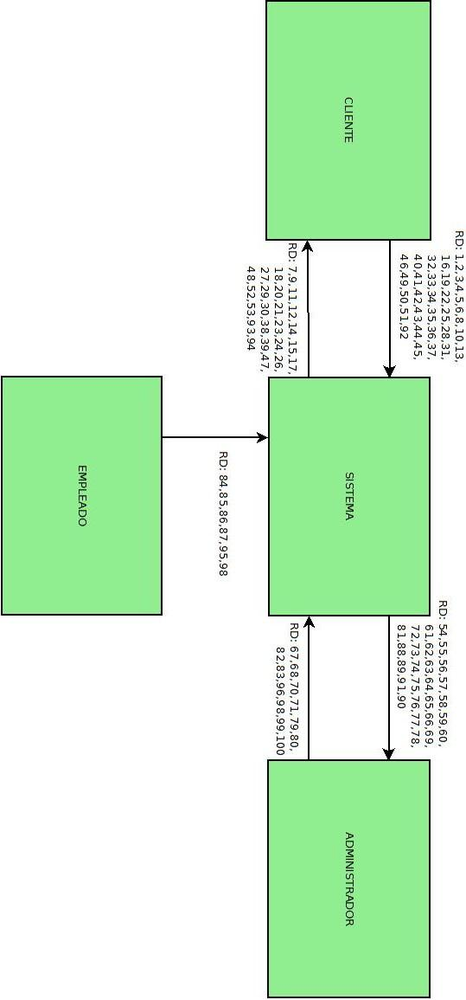

### Esquemas armazón

#### Esquema armazón F (funcional)

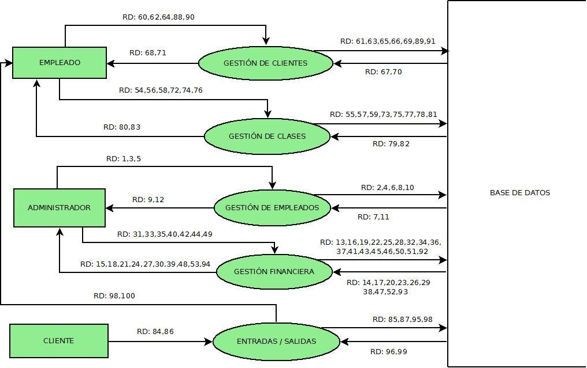

#### Ubicación de requisitos en los esquemas armazón

* **Requisito de datos:** Número de referencia del requisito.
* **Elemento del DFD:** Flujo, proceso o almacén del DFD en el que está representado o contenido el requisito.
* **Elemento del E/R:** Elemento o elementos del diagrama E/R en el que está representado o contenido el requisito.

| Requisito de datos |        Elemento del DFD       |   Elemento del E/R  |
|:------------------:|:-----------------------------:|:-------------------:|
|         RD1        | Proceso: Gestión de Empleados |  Entidad: Empleado  |
|         RD2        | Proceso: Gestión de Empleados |  Entidad: Empleado  |
|         RD3        | Proceso: Gestión de Empleados |  Entidad: Empleado  |
|         RD4        | Proceso: Gestión de Empleados |  Entidad: Empleado  |
|         RD5        | Proceso: Gestión de Empleados |  Entidad: Empleado  |
|         RD6        | Proceso: Gestión de Empleados |  Entidad: Empleado  |
|         RD7        | Proceso: Gestión de Empleados |  Entidad: Empleado  |
|         RD8        | Proceso: Gestión de Empleados |  Entidad: Empleado  |
|         RD9        | Proceso: Gestión de Empleados |  Entidad: Empleado  |
|        RD10        | Proceso: Gestión de Empleados |  Entidad: Empleado  |
|        RD11        | Proceso: Gestión de Empleados |  Entidad: Empleado  |
|        RD12        | Proceso: Gestión de Empleados |  Entidad: Empleado  |
|        RD13        |  Proceso: Gestión Financiera  | Entidad: Movimiento |
|        RD14        |  Proceso: Gestión Financiera  | Entidad: Movimiento |
|        RD15        |  Proceso: Gestión Financiera  | Entidad: Movimiento |
|        RD16        |  Proceso: Gestión Financiera  | Entidad: Movimiento |
|        RD17        |  Proceso: Gestión Financiera  | Entidad: Movimiento |
|        RD18        |  Proceso: Gestión Financiera  | Entidad: Movimiento |
|        RD19        |  Proceso: Gestión Financiera  | Entidad: Movimiento |
|        RD20        |  Proceso: Gestión Financiera  | Entidad: Movimiento |
|        RD21        |  Proceso: Gestión Financiera  | Entidad: Movimiento |
|        RD22        |  Proceso: Gestión Financiera  | Entidad: Movimiento |
|        RD23        |  Proceso: Gestión Financiera  | Entidad: Movimiento |
|        RD24        |  Proceso: Gestión Financiera  | Entidad: Movimiento |
|        RD25        |  Proceso: Gestión Financiera  | Entidad: Movimiento |
|        RD26        |  Proceso: Gestión Financiera  | Entidad: Movimiento |
|        RD27        |  Proceso: Gestión Financiera  | Entidad: Movimiento |
|        RD28        |  Proceso: Gestión Financiera  | Entidad: Movimiento |
|        RD29        |  Proceso: Gestión Financiera  | Entidad: Movimiento |
|        RD30        |  Proceso: Gestión Financiera  | Entidad: Movimiento |
|        RD31        |  Proceso: Gestión Financiera  |   Entidad: Nomina   |
|        RD32        |  Proceso: Gestión Financiera  |   Entidad: Nomina   |
|        RD33        |  Proceso: Gestión Financiera  |   Entidad: Nomina   |
|        RD34        |  Proceso: Gestión Financiera  |   Entidad: Nomina   |
|        RD35        |  Proceso: Gestión Financiera  |   Entidad: Nomina   |
|        RD36        |  Proceso: Gestión Financiera  |   Entidad: Nomina   |
|        RD37        |  Proceso: Gestión Financiera  |   Entidad: Nomina   |
|        RD38        |  Proceso: Gestión Financiera  |   Entidad: Nomina   |
|        RD39        |  Proceso: Gestión Financiera  |   Entidad: Nomina   |
|        RD40        |  Proceso: Gestión Financiera  | Entidad: Movimiento |
|        RD41        |  Proceso: Gestión Financiera  | Entidad: Movimiento |
|        RD42        |  Proceso: Gestión Financiera  | Entidad: Movimiento |
|        RD43        |  Proceso: Gestión Financiera  | Entidad: Movimiento |
|        RD44        |  Proceso: Gestión Financiera  | Entidad: Movimiento |
|        RD45        |  Proceso: Gestión Financiera  | Entidad: Movimiento |
|        RD46        |  Proceso: Gestión Financiera  | Entidad: Movimiento |
|        RD47        |  Proceso: Gestión Financiera  | Entidad: Movimiento |
|        RD48        |  Proceso: Gestión Financiera  | Entidad: Movimiento |
|        RD49        |  Proceso: Gestión Financiera  | Entidad: Movimiento |
|        RD50        |  Proceso: Gestión Financiera  | Entidad: Movimiento |
|        RD51        |  Proceso: Gestión Financiera  | Entidad: Movimiento |
|        RD52        |  Proceso: Gestión Financiera  | Entidad: Movimiento |
|        RD53        |  Proceso: Gestión Financiera  | Entidad: Movimiento |
|        RD54        |  Proceso: Gestión de Clientes |   Entidad: Tarifa   |
|        RD55        |  Proceso: Gestión de Clientes |   Entidad: Tarifa   |
|        RD56        |  Proceso: Gestión de Clientes |   Entidad: Tarifa   |
|        RD57        |  Proceso: Gestión de Clientes |   Entidad: Tarifa   |
|        RD58        |  Proceso: Gestión de Clientes |   Entidad: Tarifa   |
|        RD59        |  Proceso: Gestión de Clientes |   Entidad: Tarifa   |
|        RD60        |  Proceso: Gestión de Clientes |   Entidad: Cliente  |
|        RD61        |  Proceso: Gestión de Clientes |   Entidad: Cliente  |
|        RD62        |  Proceso: Gestión de Clientes |   Entidad: Cliente  |
|        RD63        |  Proceso: Gestión de Clientes |   Entidad: Cliente  |
|        RD64        |  Proceso: Gestión de Clientes |   Entidad: Cliente  |
|        RD65        |  Proceso: Gestión de Clientes |   Entidad: Cliente  |
|        RD66        |  Proceso: Gestión de Clientes |   Entidad: Cliente  |
|        RD67        |  Proceso: Gestión de Clientes |   Entidad: Cliente  |
|        RD68        |  Proceso: Gestión de Clientes |   Entidad: Cliente  |
|        RD69        |  Proceso: Gestión de Clientes |   Entidad: Cliente  |
|        RD70        |  Proceso: Gestión de Clientes |   Entidad: Cliente  |
|        RD71        |  Proceso: Gestión de Clientes |   Entidad: Cliente  |
|        RD72        |   Proceso: Gestión de Clases  |    Entidad: Clase   |
|        RD73        |   Proceso: Gestión de Clases  |    Entidad: Clase   |
|        RD74        |   Proceso: Gestión de Clases  |    Entidad: Clase   |
|        RD75        |   Proceso: Gestión de Clases  |    Entidad: Clase   |
|        RD76        |   Proceso: Gestión de Clases  |    Entidad: Clase   |
|        RD77        |   Proceso: Gestión de Clases  |    Entidad: Clase   |
|        RD78        |   Proceso: Gestión de Clases  |    Entidad: Clase   |
|        RD79        |   Proceso: Gestión de Clases  |    Entidad: Clase   |
|        RD80        |   Proceso: Gestión de Clases  |    Entidad: Clase   |
|        RD81        |   Proceso: Gestión de Clases  |    Entidad: Clase   |
|        RD82        |   Proceso: Gestión de Clases  |    Entidad: Clase   |
|        RD83        |   Proceso: Gestión de Clases  |    Entidad: Clase   |
|        RD84        |  Proceso: Entradas / Salidas  |     Entidad: E/S    |
|        RD85        |  Proceso: Entradas / Salidas  |     Entidad: E/S    |
|        RD86        |  Proceso: Entradas / Salidas  |     Entidad: E/S    |
|        RD87        |  Proceso: Entradas / Salidas  |     Entidad: E/S    |
|        RD88        |   Proceso: Gestión de Clases  |    Entidad: Clase   |
|        RD89        |   Proceso: Gestión de Clases  |    Entidad: Clase   |
|        RD90        |   Proceso: Gestión de Clases  |    Entidad: Clase   |
|        RD91        |   Proceso: Gestión de Clases  |    Entidad: Clase   |
|        RD92        |  Proceso: Gestión Financiera  |   Entidad: Nomina   |
|        RD93        |  Proceso: Gestión Financiera  |   Entidad: Nomina   |
|        RD94        |  Proceso: Gestión Financiera  |   Entidad: Nomina   |
|        RD95        |  Proceso: Entradas / Salidas  |     Entidad: E/S    |
|        RD96        |  Proceso: Entradas / Salidas  |     Entidad: E/S    |
|        RD97        |  Proceso: Entradas / Salidas  |     Entidad: E/S    |
|        RD98        |  Proceso: Entradas / Salidas  |     Entidad: E/S    |
|        RD99        |  Proceso: Entradas / Salidas  |     Entidad: E/S    |
|        RD100       |  Proceso: Entradas / Salidas  |     Entidad: E/S    |

| Requisito funcional1 |       Elemento del DFD2       |
|:--------------------:|:-----------------------------:|
|          RF1         | Proceso: Gestión de Empleados |
|          RF2         | Proceso: Gestión de Empleados |
|          RF3         | Proceso: Gestión de Empleados |
|          RF4         | Proceso: Gestión de Empleados |
|          RF5         | Proceso: Gestión de Empleados |
|          RF6         |  Proceso: Gestión Financiera  |
|          RF7         |  Proceso: Gestión Financiera  |
|          RF8         |  Proceso: Gestión Financiera  |
|          RF9         |  Proceso: Gestión Financiera  |
|         RF10         |  Proceso: Gestión Financiera  |
|         RF11         |  Proceso: Gestión Financiera  |
|         RF12         |  Proceso: Gestión Financiera  |
|         RF13         |  Proceso: Gestión Financiera  |
|         RF14         |  Proceso: Gestión Financiera  |
|         RF15         |  Proceso: Gestión Financiera  |
|         RF16         |  Proceso: Gestión Financiera  |
|         RF22         |  Proceso: Gestión Financiera  |
|         RF23         |  Proceso: Gestión Financiera  |
|         RF24         |  Proceso: Gestión Financiera  |
|         RF25         |  Proceso: Gestión Financiera  |
|         RF26         |  Proceso: Gestión Financiera  |
|         RF27         |  Proceso: Gestión de Clientes |
|         RF28         |  Proceso: Gestión de Clientes |
|         RF29         |  Proceso: Gestión de Clientes |
|         RF30         |  Proceso: Gestión de Clientes |
|         RF31         |  Proceso: Gestión de Clientes |
|         RF32         |  Proceso: Gestión de Clientes |
|         RF33         |  Proceso: Gestión de Clientes |
|         RF34         |  Proceso: Gestión de Clientes |
|         RF45         |   Proceso: Gestión de Clases  |
|         RF46         |   Proceso: Gestión de Clases  |
|         RF47         |   Proceso: Gestión de Clases  |
|         RF48         |   Proceso: Gestión de Clases  |
|         RF49         |   Proceso: Gestión de Clases  |
|         RF50         |  Proceso: Entradas / Salidas  |
|         RF51         |  Proceso: Entradas / Salidas  |
|         RF52         |   Proceso: Gestión de Clases  |
|         RF53         |   Proceso: Gestión de Clases  |
|         RF20         |  Proceso: Gestión Financiera  |
|         RF54         |  Proceso: Entradas / Salidas  |
|         RF55         |  Proceso: Entradas / Salidas  |

| Requisito funcional |        Elemento del DFD       |
|:-------------------:|:-----------------------------:|
|         RF1         | Proceso: Gestión de Empleados |
|         RF2         | Proceso: Gestión de Empleados |
|         RF3         | Proceso: Gestión de Empleados |
|         RF4         | Proceso: Gestión de Empleados |
|         RF5         | Proceso: Gestión de Empleados |
|         RF6         |  Proceso: Gestión Financiera  |
|         RF7         |  Proceso: Gestión Financiera  |
|         RF8         |  Proceso: Gestión Financiera  |
|         RF9         |  Proceso: Gestión Financiera  |
|         RF10        |  Proceso: Gestión Financiera  |
|         RF11        |  Proceso: Gestión Financiera  |
|         RF12        |  Proceso: Gestión Financiera  |
|         RF13        |  Proceso: Gestión Financiera  |
|         RF14        |  Proceso: Gestión Financiera  |
|         RF15        |  Proceso: Gestión Financiera  |
|         RF16        |  Proceso: Gestión Financiera  |
|         RF22        |  Proceso: Gestión Financiera  |
|         RF23        |  Proceso: Gestión Financiera  |
|         RF24        |  Proceso: Gestión Financiera  |
|         RF25        |  Proceso: Gestión Financiera  |
|         RF26        |  Proceso: Gestión Financiera  |
|         RF27        |  Proceso: Gestión de Clientes |
|         RF28        |  Proceso: Gestión de Clientes |
|         RF29        |  Proceso: Gestión de Clientes |
|         RF30        |  Proceso: Gestión de Clientes |
|         RF31        |  Proceso: Gestión de Clientes |
|         RF32        |  Proceso: Gestión de Clientes |
|         RF33        |  Proceso: Gestión de Clientes |
|         RF34        |  Proceso: Gestión de Clientes |
|         RF45        |   Proceso: Gestión de Clases  |
|         RF46        |   Proceso: Gestión de Clases  |
|         RF47        |   Proceso: Gestión de Clases  |
|         RF48        |   Proceso: Gestión de Clases  |
|         RF49        |   Proceso: Gestión de Clases  |
|         RF50        |  Proceso: Entradas / Salidas  |
|         RF51        |  Proceso: Entradas / Salidas  |
|         RF52        |   Proceso: Gestión de Clases  |
|         RF53        |   Proceso: Gestión de Clases  |
|         RF20        |  Proceso: Gestión Financiera  |
|         RF54        |  Proceso: Entradas / Salidas  |
|         RF55        |  Proceso: Entradas / Salidas  |

| Restricción semántica |       Elemento del DFD       | Elemento del E/R |
|:---------------------:|:----------------------------:|:----------------:|
|          RS1          |     Proceso: Alta nomina     |  Entidad: nomina |
|          RS2          | Proceso: Entrada de clientes |   Entidad: E/S   |
|          RS3          |  Proceso: Salida de clientes |   Entidad: E/S   |
|          RS4          |  Proceso: Apuntarse a clase  |  Entidad Clases  |

### Primer refinamiento

#### Primer refinamiento del esquema funcional

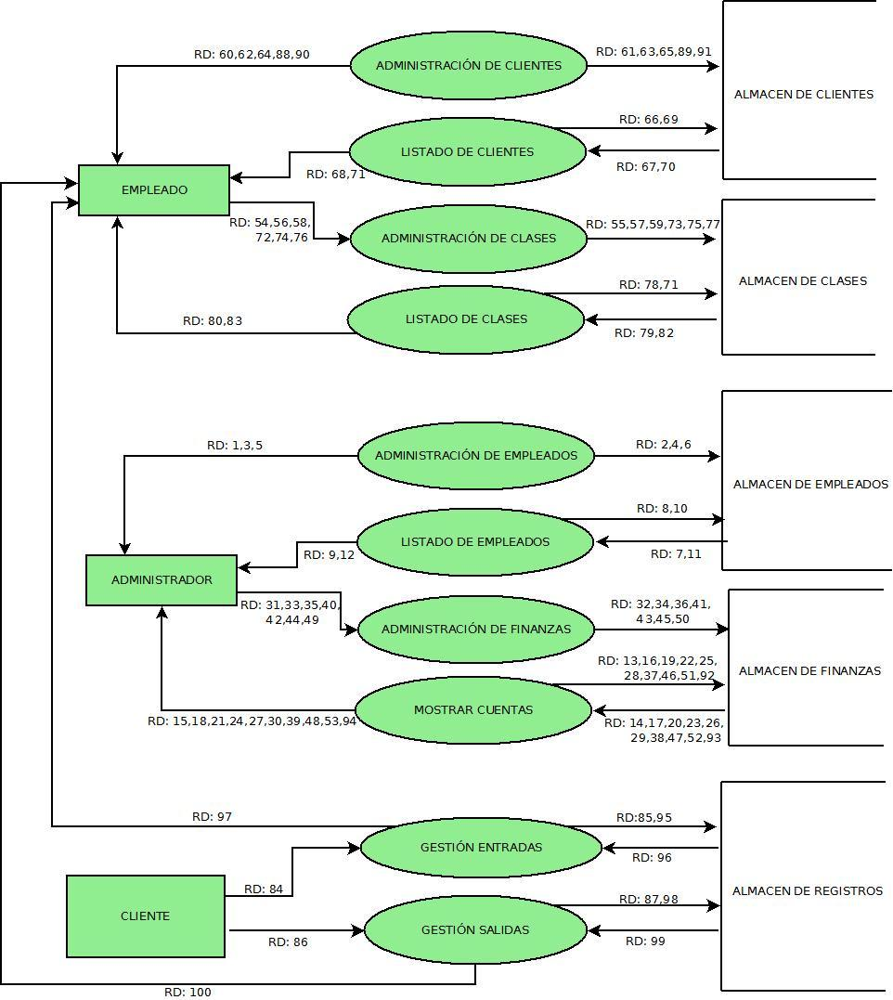

#### Ubicación de requisitos en los planos D y F del primer refinamiento

| Requisito de datos |           Elemento del DFD           |   Elemento del E/R  |
|:------------------:|:------------------------------------:|:-------------------:|
|         RD1        | Proceso: Administración de Empleados |  Entidad: Empleado  |
|         RD2        | Proceso: Administración de Empleados |  Entidad: Empleado  |
|         RD3        | Proceso: Administración de Empleados |  Entidad: Empleado  |
|         RD4        | Proceso: Administración de Empleados |  Entidad: Empleado  |
|         RD5        | Proceso: Administración de Empleados |  Entidad: Empleado  |
|         RD6        | Proceso: Administración de Empleados |  Entidad: Empleado  |
|         RD7        |     Proceso: Listado de Empleados    |  Entidad: Empleado  |
|         RD8        |     Proceso: Listado de Empleados    |  Entidad: Empleado  |
|         RD9        |     Proceso: Listado de Empleados    |  Entidad: Empleado  |
|        RD10        |     Proceso: Listado de Empleados    |  Entidad: Empleado  |
|        RD11        |     Proceso: Listado de Empleados    |  Entidad: Empleado  |
|        RD12        |     Proceso: Listado de Empleados    |  Entidad: Empleado  |
|        RD13        |       Proceso: Mostrar Cuentas       | Entidad: Movimiento |
|        RD14        |       Proceso: Mostrar Cuentas       | Entidad: Movimiento |
|        RD15        |       Proceso: Mostrar Cuentas       | Entidad: Movimiento |
|        RD16        |       Proceso: Mostrar Cuentas       | Entidad: Movimiento |
|        RD17        |       Proceso: Mostrar Cuentas       | Entidad: Movimiento |
|        RD18        |       Proceso: Mostrar Cuentas       | Entidad: Movimiento |
|        RD19        |       Proceso: Mostrar Cuentas       | Entidad: Movimiento |
|        RD20        |       Proceso: Mostrar Cuentas       | Entidad: Movimiento |
|        RD21        |       Proceso: Mostrar Cuentas       | Entidad: Movimiento |
|        RD22        |       Proceso: Mostrar Cuentas       | Entidad: Movimiento |
|        RD23        |       Proceso: Mostrar Cuentas       | Entidad: Movimiento |
|        RD24        |       Proceso: Mostrar Cuentas       | Entidad: Movimiento |
|        RD25        |       Proceso: Mostrar Cuentas       | Entidad: Movimiento |
|        RD26        |       Proceso: Mostrar Cuentas       | Entidad: Movimiento |
|        RD27        |       Proceso: Mostrar Cuentas       | Entidad: Movimiento |
|        RD28        |       Proceso: Mostrar Cuentas       | Entidad: Movimiento |
|        RD29        |       Proceso: Mostrar Cuentas       | Entidad: Movimiento |
|        RD30        |       Proceso: Mostrar Cuentas       | Entidad: Movimiento |
|        RD31        |  Proceso: Administración de Finanzas |   Entidad: Nomina   |
|        RD32        |  Proceso: Administración de Finanzas |   Entidad: Nomina   |
|        RD33        |  Proceso: Administración de Finanzas |   Entidad: Nomina   |
|        RD34        |  Proceso: Administración de Finanzas |   Entidad: Nomina   |
|        RD35        |  Proceso: Administración de Finanzas |   Entidad: Nomina   |
|        RD36        |  Proceso: Administración de Finanzas |   Entidad: Nomina   |
|        RD37        |       Proceso: Mostrar Cuentas       |   Entidad: Nomina   |
|        RD38        |       Proceso: Mostrar Cuentas       |   Entidad: Nomina   |
|        RD39        |       Proceso: Mostrar Cuentas       |   Entidad: Nomina   |
|        RD40        |  Proceso: Administración de Finanzas | Entidad: Movimiento |
|        RD41        |  Proceso: Administración de Finanzas | Entidad: Movimiento |
|        RD42        |  Proceso: Administración de Finanzas | Entidad: Movimiento |
|        RD43        |  Proceso: Administración de Finanzas | Entidad: Movimiento |
|        RD44        |  Proceso: Administración de Finanzas | Entidad: Movimiento |
|        RD45        |  Proceso: Administración de Finanzas | Entidad: Movimiento |
|        RD46        |       Proceso: Mostrar Cuentas       | Entidad: Movimiento |
|        RD47        |       Proceso: Mostrar Cuentas       | Entidad: Movimiento |
|        RD48        |       Proceso: Mostrar Cuentas       | Entidad: Movimiento |
|        RD49        |  Proceso: Administración de Finanzas | Entidad: Movimiento |
|        RD50        |  Proceso: Administración de Finanzas | Entidad: Movimiento |
|        RD51        |       Proceso: Mostrar Cuentas       | Entidad: Movimiento |
|        RD52        |       Proceso: Mostrar Cuentas       | Entidad: Movimiento |
|        RD53        |       Proceso: Mostrar Cuentas       | Entidad: Movimiento |
|        RD54        |  Proceso: Administración de Clientes |   Entidad: Tarifa   |
|        RD55        |  Proceso: Administración de Clientes |   Entidad: Tarifa   |
|        RD56        |  Proceso: Administración de Clientes |   Entidad: Tarifa   |
|        RD57        |  Proceso: Administración de Clientes |   Entidad: Tarifa   |
|        RD58        |  Proceso: Administración de Clientes |   Entidad: Tarifa   |
|        RD59        |  Proceso: Administración de Clientes |   Entidad: Tarifa   |
|        RD60        |  Proceso: Administración de Clientes |   Entidad: Tarifa   |
|        RD61        |  Proceso: Administración de Clientes |   Entidad: Tarifa   |
|        RD62        |  Proceso: Administración de Clientes |   Entidad: Tarifa   |
|        RD63        |  Proceso: Administración de Clientes |   Entidad: Tarifa   |
|        RD64        |  Proceso: Administración de Clientes |   Entidad: Tarifa   |
|        RD65        |  Proceso: Administración de Clientes |   Entidad: Cliente  |
|        RD66        |     Proceso: Listado de Clientes     |   Entidad: Cliente  |
|        RD67        |     Proceso: Listado de Clientes     |   Entidad: Cliente  |
|        RD68        |     Proceso: Listado de Clientes     |   Entidad: Cliente  |
|        RD69        |     Proceso: Listado de Clientes     |   Entidad: Cliente  |
|        RD70        |     Proceso: Listado de Clientes     |   Entidad: Cliente  |
|        RD71        |     Proceso: Listado de Clientes     |   Entidad: Cliente  |
|        RD72        |   Proceso: Administración de Clases  |    Entidad: Clase   |
|        RD73        |   Proceso: Administración de Clases  |    Entidad: Clase   |
|        RD74        |   Proceso: Administración de Clases  |    Entidad: Clase   |
|        RD75        |   Proceso: Administración de Clases  |    Entidad: Clase   |
|        RD76        |   Proceso: Administración de Clases  |    Entidad: Clase   |
|        RD77        |   Proceso: Administración de Clases  |    Entidad: Clase   |
|        RD78        |      Proceso: Listado de Clases      |    Entidad: Clase   |
|        RD79        |      Proceso: Listado de Clases      |    Entidad: Clase   |
|        RD80        |      Proceso: Listado de Clases      |    Entidad: Clase   |
|        RD81        |      Proceso: Listado de Clases      |    Entidad: Clase   |
|        RD82        |      Proceso: Listado de Clases      |    Entidad: Clase   |
|        RD83        |      Proceso: Listado de Clases      |    Entidad: Clase   |
|        RD84        |       Proceso: Gestión Entradas      |     Entidad: E/S    |
|        RD85        |       Proceso: Gestión Entradas      |     Entidad: E/S    |
|        RD86        |       Proceso: Gestión Salidas       |     Entidad: E/S    |
|        RD87        |       Proceso: Gestión Salidas       |     Entidad: E/S    |
|        RD88        |  Proceso: Administración de Clientes |    Entidad: Clase   |
|        RD89        |  Proceso: Administración de Clientes |    Entidad: Clase   |
|        RD90        |  Proceso: Administración de Clientes |    Entidad: Clase   |
|        RD91        |  Proceso: Administración de Clientes |    Entidad: Clase   |
|        RD92        |       Proceso: Mostrar cuentas       |   Entidad: Nomina   |
|        RD93        |       Proceso: Mostrar cuentas       |   Entidad: Nomina   |
|        RD94        |       Proceso: Mostrar cuentas       |   Entidad: Nomina   |
|        RD95        |       Proceso: Gestión Entradas      |     Entidad: E/S    |
|        RD96        |       Proceso: Gestión Entradas      |     Entidad: E/S    |
|        RD97        |       Proceso: Gestión Entradas      |     Entidad: E/S    |
|        RD98        |       Proceso: Gestión Salidas       |     Entidad: E/S    |
|        RD99        |       Proceso: Gestión Salidas       |     Entidad: E/S    |
|        RD100       |       Proceso: Gestión Salidas       |     Entidad: E/S    |

| Requisito funcional |           Elemento del DFD          |
|:-------------------:|:-----------------------------------:|
|         RF1         | Proceso: Administración de Clientes |
|         RF2         | Proceso: Administración de Clientes |
|         RF3         | Proceso: Administración de Clientes |
|         RF4         |     Proceso: Listado de Clientes    |
|         RF5         |     Proceso: Listado de Clientes    |
|         RF6         |       Proceso: Mostrar Cuentas      |
|         RF7         |       Proceso: Mostrar Cuentas      |
|         RF8         |       Proceso: Mostrar Cuentas      |
|         RF9         |       Proceso: Mostrar Cuentas      |
|         RF10        |       Proceso: Mostrar Cuentas      |
|         RF11        |       Proceso: Mostrar Cuentas      |
|         RF12        | Proceso: Administración de Finanzas |
|         RF13        | Proceso: Administración de Finanzas |
|         RF14        | Proceso: Administración de Finanzas |
|         RF15        |       Proceso: Mostrar Cuentas      |
|         RF16        | Proceso: Administración de Finanzas |
|         RF22        | Proceso: Administración de Finanzas |
|         RF23        | Proceso: Administración de Finanzas |
|         RF24        |       Proceso: Mostrar Cuentas      |
|         RF25        | Proceso: Administración de Finanzas |
|         RF26        |       Proceso: Mostrar Cuentas      |
|         RF27        | Proceso: Administración de Clientes |
|         RF28        | Proceso: Administración de Clientes |
|         RF29        | Proceso: Administración de Clientes |
|         RF30        | Proceso: Administración de Clientes |
|         RF31        | Proceso: Administración de Clientes |
|         RF32        | Proceso: Administración de Clientes |
|         RF33        |     Proceso: Listado de Clientes    |
|         RF34        |     Proceso: Listado de Clientes    |
|         RF45        |  Proceso: Administración de Clases  |
|         RF46        |  Proceso: Administración de Clases  |
|         RF47        |  Proceso: Administración de Clases  |
|         RF48        |      Proceso: Listado de Clases     |
|         RF49        |      Proceso: Listado de Clases     |
|         RF50        |      Proceso: Gestión Entradas      |
|         RF51        |       Proceso: Gestión Salidas      |
|         RF52        |      Proceso: Gestión Clientes      |
|         RF53        |      Proceso: Gestión Clientes      |
|         RF20        |       Proceso: Mostrar Cuentas      |
|         RF54        |      Proceso: Gestión Entradas      |
|         RF55        |       Proceso: Gestión Salidas      |

| Restricción semántica |       Elemento del DFD       | Elemento del E/R |
|:---------------------:|:----------------------------:|:----------------:|
|          RS1          |     Proceso: Alta nomina     |  Entidad: nomina |
|          RS2          | Proceso: Entrada de clientes |   Entidad: E/S   |
|          RS3          |  Proceso: Salida de clientes |   Entidad: E/S   |
|          RS4          |  Proceso: Apuntarse a clase  |  Entidad Clases  |

### Segundo refinamiento

#### Segundo refinamiento del esquema funcional

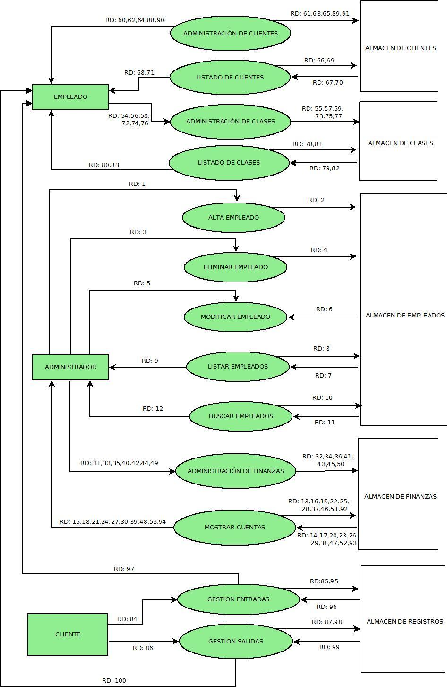

#### Esquemas externos del segundo refinamiento del esquema funcional

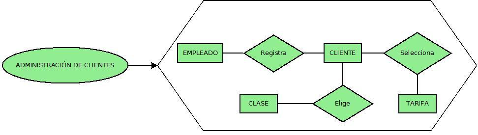

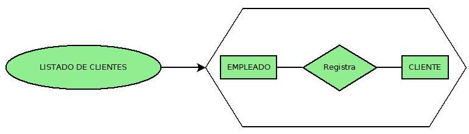

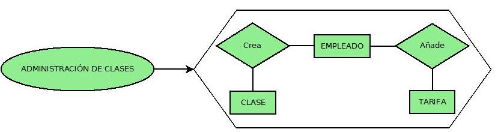

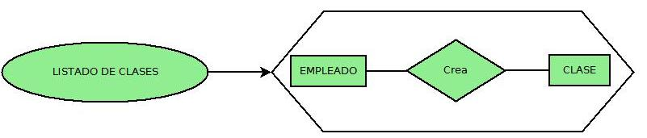

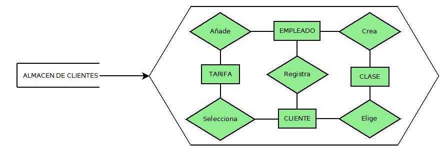


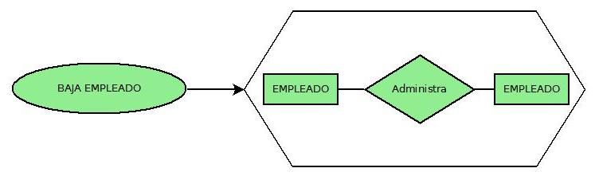

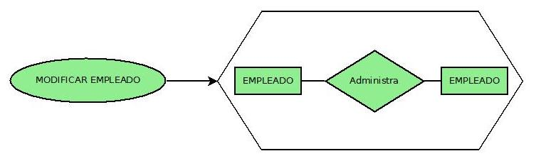

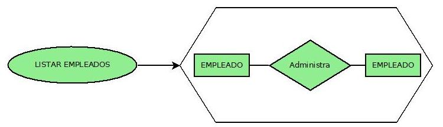

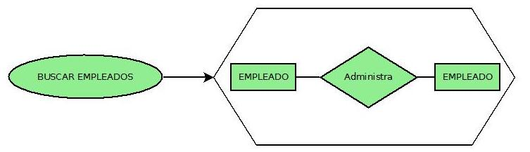

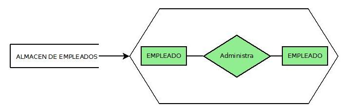

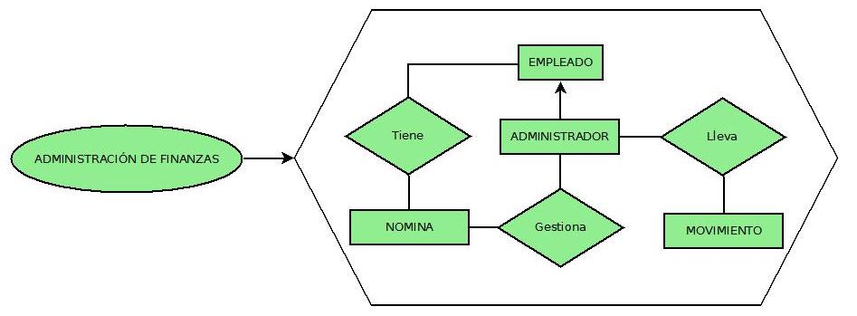

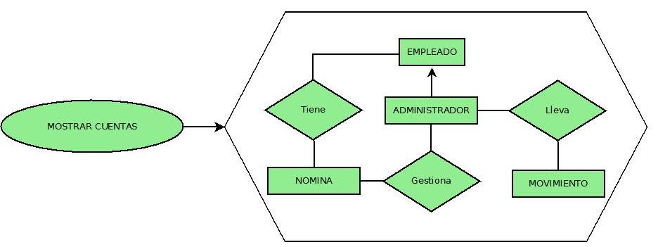

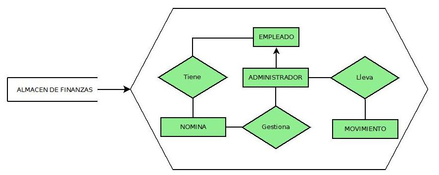

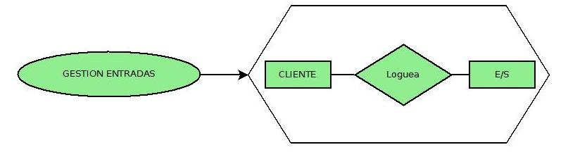

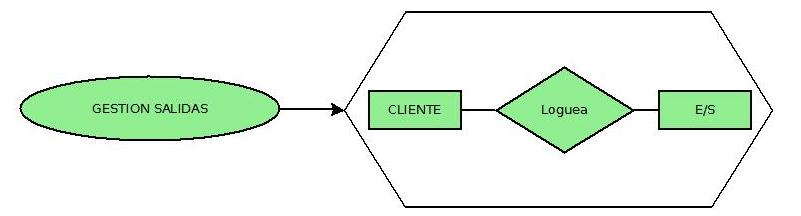

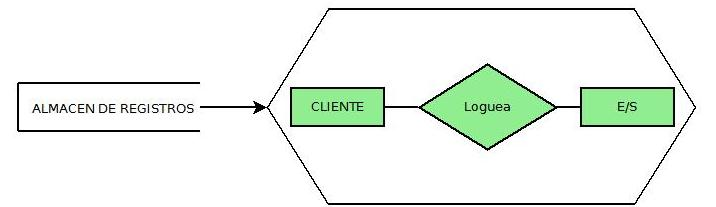

#### Segundo refinamiento del esquema D (conceptual)

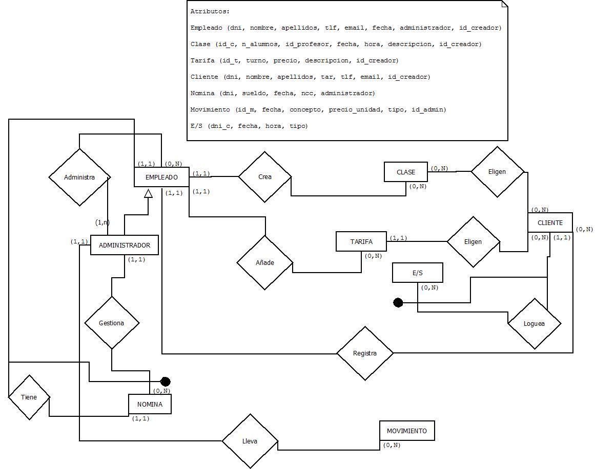

#### Ubicación de requisitos en los planos D y F del segundo refinamiento

| Requisito de datos |           Elemento del DFD          |   Elemento del E/R  |
|:------------------:|:-----------------------------------:|:-------------------:|
|         RD1        |        Proceso: Alta Empleado       |  Entidad: Empleado  |
|         RD2        |        Proceso: Alta Empleado       |  Entidad: Empleado  |
|         RD3        |        Proceso: Baja Empleado       |  Entidad: Empleado  |
|         RD4        |        Proceso: Baja Empleado       |  Entidad: Empleado  |
|         RD5        |     Proceso: Modificar Empleado     |  Entidad: Empleado  |
|         RD6        |     Proceso: Modificar Empleado     |  Entidad: Empleado  |
|         RD7        |      Proceso: Listar Empleados      |  Entidad: Empleado  |
|         RD8        |      Proceso: Listar Empleados      |  Entidad: Empleado  |
|         RD9        |      Proceso: Listar Empleados      |  Entidad: Empleado  |
|        RD10        |      Proceso: Buscar Empleados      |  Entidad: Empleado  |
|        RD11        |      Proceso: Buscar Empleados      |  Entidad: Empleado  |
|        RD12        |      Proceso: Buscar Empleados      |  Entidad: Empleado  |
|        RD13        |       Proceso: Mostrar Cuentas      | Entidad: Movimiento |
|        RD14        |       Proceso: Mostrar Cuentas      | Entidad: Movimiento |
|        RD15        |       Proceso: Mostrar Cuentas      | Entidad: Movimiento |
|        RD16        |       Proceso: Mostrar Cuentas      | Entidad: Movimiento |
|        RD17        |       Proceso: Mostrar Cuentas      | Entidad: Movimiento |
|        RD18        |       Proceso: Mostrar Cuentas      | Entidad: Movimiento |
|        RD19        |       Proceso: Mostrar Cuentas      | Entidad: Movimiento |
|        RD20        |       Proceso: Mostrar Cuentas      | Entidad: Movimiento |
|        RD21        |       Proceso: Mostrar Cuentas      | Entidad: Movimiento |
|        RD22        |       Proceso: Mostrar Cuentas      | Entidad: Movimiento |
|        RD23        |       Proceso: Mostrar Cuentas      | Entidad: Movimiento |
|        RD24        |       Proceso: Mostrar Cuentas      | Entidad: Movimiento |
|        RD25        |       Proceso: Mostrar Cuentas      | Entidad: Movimiento |
|        RD26        |       Proceso: Mostrar Cuentas      | Entidad: Movimiento |
|        RD27        |       Proceso: Mostrar Cuentas      | Entidad: Movimiento |
|        RD28        |       Proceso: Mostrar Cuentas      | Entidad: Movimiento |
|        RD29        |       Proceso: Mostrar Cuentas      | Entidad: Movimiento |
|        RD30        |       Proceso: Mostrar Cuentas      | Entidad: Movimiento |
|        RD31        | Proceso: Administración de Finanzas |   Entidad: Nomina   |
|        RD32        | Proceso: Administración de Finanzas |   Entidad: Nomina   |
|        RD33        | Proceso: Administración de Finanzas |   Entidad: Nomina   |
|        RD34        | Proceso: Administración de Finanzas |   Entidad: Nomina   |
|        RD35        | Proceso: Administración de Finanzas |   Entidad: Nomina   |
|        RD36        | Proceso: Administración de Finanzas |   Entidad: Nomina   |
|        RD37        |       Proceso: Mostrar Cuentas      |   Entidad: Nomina   |
|        RD38        |       Proceso: Mostrar Cuentas      |   Entidad: Nomina   |
|        RD39        |       Proceso: Mostrar Cuentas      |   Entidad: Nomina   |
|        RD40        | Proceso: Administración de Finanzas | Entidad: Movimiento |
|        RD41        | Proceso: Administración de Finanzas | Entidad: Movimiento |
|        RD42        | Proceso: Administración de Finanzas | Entidad: Movimiento |
|        RD43        | Proceso: Administración de Finanzas | Entidad: Movimiento |
|        RD44        | Proceso: Administración de Finanzas | Entidad: Movimiento |
|        RD45        | Proceso: Administración de Finanzas | Entidad: Movimiento |
|        RD46        |       Proceso: Mostrar Cuentas      | Entidad: Movimiento |
|        RD47        |       Proceso: Mostrar Cuentas      | Entidad: Movimiento |
|        RD48        |       Proceso: Mostrar Cuentas      | Entidad: Movimiento |
|        RD49        | Proceso: Administración de Finanzas | Entidad: Movimiento |
|        RD50        | Proceso: Administración de Finanzas | Entidad: Movimiento |
|        RD51        | Proceso: Administración de Finanzas | Entidad: Movimiento |
|        RD52        | Proceso: Administración de Finanzas | Entidad: Movimiento |
|        RD53        | Proceso: Administración de Finanzas | Entidad: Movimiento |
|        RD54        |  Proceso: Administración de Clases  |   Entidad: Tarifa   |
|        RD55        |  Proceso: Administración de Clases  |   Entidad: Tarifa   |
|        RD56        |  Proceso: Administración de Clases  |   Entidad: Tarifa   |
|        RD57        |  Proceso: Administración de Clases  |   Entidad: Tarifa   |
|        RD58        |  Proceso: Administración de Clases  |   Entidad: Tarifa   |
|        RD59        |  Proceso: Administración de Clases  |   Entidad: Tarifa   |
|        RD60        | Proceso: Administración de Clientes |   Entidad: Cliente  |
|        RD61        | Proceso: Administración de Clientes |   Entidad: Cliente  |
|        RD62        | Proceso: Administración de Clientes |   Entidad: Cliente  |
|        RD63        | Proceso: Administración de Clientes |   Entidad: Cliente  |
|        RD64        | Proceso: Administración de Clientes |   Entidad: Cliente  |
|        RD65        | Proceso: Administración de Clientes |   Entidad: Cliente  |
|        RD66        |     Proceso: Listado de Clientes    |   Entidad: Cliente  |
|        RD67        |     Proceso: Listado de Clientes    |   Entidad: Cliente  |
|        RD68        |     Proceso: Listado de Clientes    |   Entidad: Cliente  |
|        RD69        |     Proceso: Listado de Clientes    |   Entidad: Cliente  |
|        RD70        |     Proceso: Listado de Clientes    |   Entidad: Cliente  |
|        RD71        |     Proceso: Listado de Clientes    |   Entidad: Cliente  |
|        RD72        |  Proceso: Administración de Clases  |    Entidad: Clase   |
|        RD73        |  Proceso: Administración de Clases  |    Entidad: Clase   |
|        RD74        |  Proceso: Administración de Clases  |    Entidad: Clase   |
|        RD75        |  Proceso: Administración de Clases  |    Entidad: Clase   |
|        RD76        |  Proceso: Administración de Clases  |    Entidad: Clase   |
|        RD77        |  Proceso: Administración de Clases  |    Entidad: Clase   |
|        RD78        |      Proceso: Listado de Clases     |    Entidad: Clase   |
|        RD79        |      Proceso: Listado de Clases     |    Entidad: Clase   |
|        RD80        |      Proceso: Listado de Clases     |    Entidad: Clase   |
|        RD81        |      Proceso: Listado de Clases     |    Entidad: Clase   |
|        RD82        |      Proceso: Listado de Clases     |    Entidad: Clase   |
|        RD83        |      Proceso: Listado de Clases     |    Entidad: Clase   |
|        RD84        |     Proceso: Gestión de Entradas    |     Entidad: E/S    |
|        RD85        |     Proceso: Gestión de Entradas    |     Entidad: E/S    |
|        RD86        |     Proceso: Gestión de Salidas     |     Entidad: E/S    |
|        RD87        |     Proceso: Gestión de Salidas     |     Entidad: E/S    |
|        RD88        | Proceso: Administración de Clientes |   Entidad: Clases   |
|        RD89        | Proceso: Administración de Clientes |   Entidad: Clases   |
|        RD90        | Proceso: Administración de Clientes |   Entidad: Clases   |
|        RD91        | Proceso: Administración de Clientes |   Entidad: Clases   |
|        RD92        |       Proceso: Mostrar Cuentas      |   Entidad: Nomina   |
|        RD93        |       Proceso: Mostrar Cuentas      |   Entidad: Nomina   |
|        RD94        |       Proceso: Mostrar Cuentas      |   Entidad: Nomina   |
|        RD95        |      Proceso: Gestión Entradas      |     Entidad: E/S    |
|        RD96        |      Proceso: Gestión Entradas      |     Entidad: E/S    |
|        RD97        |      Proceso: Gestión Entradas      |     Entidad: E/S    |
|        RD98        |       Proceso: Gestión Salidas      |     Entidad: E/S    |
|        RD99        |       Proceso: Gestión Salidas      |     Entidad: E/S    |
|        RD100       |       Proceso: Gestión Salidas      |     Entidad: E/S    |

| Requisito funcional |           Elemento del DFD          |
|:-------------------:|:-----------------------------------:|
|         RF1         |        Proceso: Alta Empleado       |
|         RF2         |      Proceso: Eliminar Empleado     |
|         RF3         |     Proceso: Modificar Empleado     |
|         RF4         |      Proceso: Listar Empleados      |
|         RF5         |      Proceso: Buscar Empleados      |
|         RF6         |       Proceso: Mostrar Cuentas      |
|         RF7         |       Proceso: Mostrar Cuentas      |
|         RF8         |       Proceso: Mostrar Cuentas      |
|         RF9         |       Proceso: Mostrar Cuentas      |
|         RF10        |       Proceso: Mostrar Cuentas      |
|         RF11        |       Proceso: Mostrar Cuentas      |
|         RF12        | Proceso: Administración de Finanzas |
|         RF13        | Proceso: Administración de Finanzas |
|         RF14        | Proceso: Administración de Finanzas |
|         RF15        |       Proceso: Mostrar Cuentas      |
|         RF16        | Proceso: Administración de Finanzas |
|         RF22        | Proceso: Administración de Finanzas |
|         RF23        | Proceso: Administración de Finanzas |
|         RF24        | Proceso: Administración de Finanzas |
|         RF25        | Proceso: Administración de Finanzas |
|         RF26        |       Proceso: Mostrar Cuentas      |
|         RF27        |  Proceso: Administración de Clases  |
|         RF28        |  Proceso: Administración de Clases  |
|         RF29        |  Proceso: Administración de Clases  |
|         RF30        | Proceso: Administración de Clientes |
|         RF31        | Proceso: Administración de Clientes |
|         RF32        | Proceso: Administración de Clientes |
|         RF33        |     Proceso: Listado de Clientes    |
|         RF34        |     Proceso: Listado de Clientes    |
|         RF45        |  Proceso: Administración de Clases  |
|         RF46        |  Proceso: Administración de Clases  |
|         RF47        |  Proceso: Administración de Clases  |
|         RF48        |      Proceso: Listado de Clases     |
|         RF49        |      Proceso: Listado de Clases     |
|         RF50        |      Proceso: Gestión Entradas      |
|         RF51        |       Proceso: Gestión Salidas      |
|         RF52        |      Proceso: Gestión Clientes      |
|         RF53        |      Proceso: Gestión Clientes      |
|         RF20        |       Proceso: Mostrar Cuentas      |
|         RF54        |      Proceso: Gestión Entradas      |
|         RF55        |       Proceso: Gestión Salidas      |
|         RF50        |      Proceso: Gestión Entradas      |
|         RF51        |       Proceso: Gestión Salidas      |
|         RF52        |      Proceso: Apuntarse a clase     |
|         RF53        |    Proceso: Desapuntarse de clase   |
|         RF20        |        Proceso: Listar nomina       |

| Restricción semántica |       Elemento del DFD       | Elemento del E/R |
|:---------------------:|:----------------------------:|:----------------:|
|          RS1          |     Proceso: Alta nomina     |  Entidad: nomina |
|          RS2          | Proceso: Entrada de clientes |   Entidad: E/S   |
|          RS3          |  Proceso: Salida de clientes |   Entidad: E/S   |
|          RS4          |  Proceso: Apuntarse a clase  |  Entidad Clases  |


## Operaciones de datos para el esquema final F

* **O1**: Insertar un nuevo empleado a parir de su DNI, nombre, teléfono, email, fecha, contraseña, nombre_usuario.
* **O2**: Buscar empleado por su DNI. 
* **O3**: Eliminar empleado por su DNI.
* **O4**: Modificar empleado seleccionado por su DNI y introduciendo su nombre, teléfono, email, fecha, contraseña, nombre_usuario.
* **05**: Listar empleado mostrando DNI, nombre, teléfono, email, fecha, contraseña, nombre_usuario

## Esquemas de operación y navegación para las operaciones de datos

* **O1**:

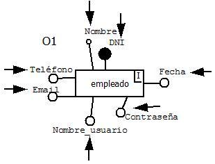

* **O2**:

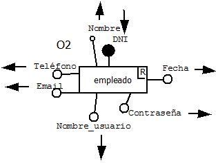

* **O3**: 

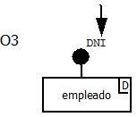

* **O4**:

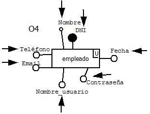

* **05**:

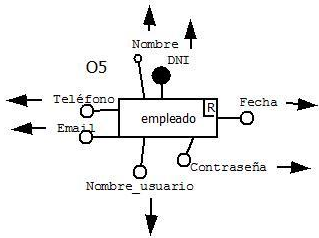


## Diseño lógico relacional a partir del esquema final D

Suponemos que un email puede estar repetidos para 2 clientes o empleados diferentes. 

### Tablas:

* Empleado (**DNI**, nombre, apellidos, teléfono, email, fecha)
* Administrador (**DNI_empleado**, es_admin)
* Administrador_administra_empleado (**DNI_empleado**, **DNI_admin**)
* Clase (**ID_clase**, N_alumno, id_profesor, fecha, hora, descripción,)
* Empleado_crea_clase (**ID_empleado**, **ID_clase**)
* Tarifa (**ID_tarifa**, turno, precio, descripción)
* Empleado_añade_tarifa (**ID_empleado**, **ID_tarifa**)
* Cliente (**DNI**, nombre, apellidos, tlfn, email)
* Empleado_registra_cliente (**DNI_empleado**, **DNI_cliente**)
* Cliente_elige_tarifa (**DNI_cliente**, **DNI_tarifa**)
* Cliente_elige_clase (**DNI_cliente**, **ID_clase**)
* E/S (**ID_e/s**, fecha, hora, tipo)
* Cliente_loguea_E/S (**DNI_cliente**, **ID_e/s**)
* Nomina (**ID_nomina**, sueldo, fecha, NCC)
* Admin_gestiona_nomina (**DNI_admin**, **ID_nomina**)
* Empleado_tiene_nomina (**DNI_empleado**, **ID_nomina**)
* Movimiento (**ID_movimiento**, fecha, concepto, cantidad, precio_unidad, tipo)
* Admin_lleva_movimiento (**DNI_admin**, **ID_movimiento**

Al final nos quedan las siguientes tablas simplificando:

* Empleado (**dni**, nombre, apellidos, tlfn, email, fecha, administrador, *id_creador*)
* Clase (**id_c**, n_alumno, *id_profesor*, fecha, hora, descripción, *id_creador*)
* Tarifa (**id_t**, turno, precio, descripción, *id_creador*)
* Cliente (**dni**, nombre, apellido, tar, tlf, email, *id_creador*)
* Nomina (**dni**, sueldo, fecha. Ncc, administrador)
* Movimiento (**id_m**, fecha, concepto, precio_unidad, tipo, *id_admin*) 
* E/S (**dni_c**, fecha, hora, tipo)
* Cliente_elige_clase (**id_cliente**, **id_clase**)

### Normalización

* Empleado (**dni**, nombre, apellidos, tlfn, email, fecha, administrador, *id_creador*)
* Clase (**id_c**, n_alumno, *id_profesor*, fecha, hora, descripción, *id_creador*)
* Tarifa (**id_t**, turno, precio, descripción, *id_creador*)
* Cliente (**dni**, nombre, apellido, tar, tlf, email, *id_creador*)
* Nomina (**dni**, sueldo, fecha. Ncc, administrador)
* Movimiento (**id_m**, fecha, concepto, precio_unidad, tipo, *id_admin*)
* E/S (**dni_c**, fecha, hora, tipo)
* Cliente_elige_clase (**id_cliente**, **id_clase**)


## Diseño físico relacional

```
-- Borrado de tablas

drop table tarifa;
drop table empleado;
drop table cliente;
drop table movimiento;
drop table clase;
drop table nomina;
drop table ensal;
drop table cliente_elige_clase;


-- Creación de tablas

create table empleado(
DNI	CHAR(9) primary key,
NOMBRE	VARCHAR(30),
APELLIDOS	VARCHAR(50),
TLF	NUMBER(9),
EMAIL	VARCHAR(30),
FECHA	DATE,
ADMINISTRADOR	CHAR(1) check (administrador in('S','s','N','n')),
id_creador char(9) references empleado(dni)
);

create table clase(
  id_c number(5) primary key,
  n_alumnos number(2),
  id_profesor references empleado(dni),
  fecha date,
  hora number,
  descripcion varchar(300),
  id_creador char(9) references empleado(dni)
);

create table tarifa(
  id_t number(5) primary key,
  turno varchar(8) check(turno in ('mañana', 'tarde', 'total')),
  precio number,
  descripcion varchar(300),
  id_creador char(9) references empleado(dni)
);

create table cliente(
  dni char(9) primary key,
  nombre varchar(30),
  apellidos varchar(50),
  --foto,
  tar references tarifa(id_t),
  tlf number(9),
  email varchar(30),
  id_creador char(9) references empleado(dni)
);

create table cliente_elige_clase(
  id_c  references clase(id_c),
  dni_c  references cliente(dni),
  primary key(id_c,dni_c)
);

create table EnSal(
dni_c references cliente(dni),
fecha date,
hora number,
tipo char(7) check(tipo in ('entrada','salida')),
primary key(dni_c,fecha,hora)
);

create table nomina(
  dni references empleado(dni),
  sueldo number,
  fecha date,
  ncc number,
  administrador references empleado(dni)
);

create table movimiento(
  id_m number primary key,
  fecha date,
  concepto varchar(300),
  cantidad number,
  precio_unidad number,
  tipo char(10) check(tipo in ('ingreso','reintegro','pago','cobro')),
  id_admin char(9) references empleado(dni)
);


-- Introducción de valores en las tablas

insert into cliente_elige_clase (id_c,dni_c)
values(1,'45345645L');
insert into cliente_elige_clase (id_c,dni_c)
values(2,'11111111E');
insert into cliente_elige_clase (id_c,dni_c)
values(3,'23412412R');

insert into empleado(dni,nombre,apellidos,tlf,email,fecha, administrador,id_creador)
values('73737373F','PEPE','PERES_PEREZ','958585858','pepe@ugr.es','10/10/10', 'S','73737373F');
insert into empleado(dni,nombre,apellidos,tlf,email,fecha, administrador,id_creador)
values('19283918F','JUAN','RAMIREZ','958234241','juan@ugr.es', '12/9/08', 'N','73737373F');
insert into empleado(dni,nombre,apellidos,tlf,email,fecha, administrador,id_creador)
values('92839182F','LURDES','MAXIMA DIVERSION','958938392','lurdes@ugr.es', '7/10/09', 'N','73737373F');
insert into empleado(dni,nombre,apellidos,tlf,email,fecha, administrador,id_creador)
values('23412412R','MARIA','JIMENEZ','681928392','maria@ugr.es','1/1/1', 'S','73737373F');

insert into clase(id_c, n_alumnos, id_profesor, fecha, hora, descripcion, id_creador)
values(1,20,'73737373F','1/2/2013', 1800, 'Estiramientos', '73737373F');
insert into clase(id_c, n_alumnos, id_profesor, fecha, hora, descripcion, id_creador)
values(2,20,'73737373F','1/12/2012', 1200, 'Movimientos funcionales', '73737373F');
insert into clase(id_c, n_alumnos, id_profesor, fecha, hora, descripcion, id_creador)
values(3,20,'73737373F','1/2/2013', 1400, 'Alterofilia', '73737373F');
insert into clase(id_c, n_alumnos, id_profesor, fecha, hora, descripcion, id_creador)
values(4,25,'73737373F','1/3/2013', 1900, 'Aer—bica', '73737373F');

insert into tarifa(id_t, turno, precio, descripcion, id_creador)
values(1,'mañana', 30, 'Turno para ir solo por la mañana','73737373F');
insert into tarifa(id_t, turno, precio, descripcion, id_creador)
values(2,'tarde', 35, 'Turno para ir solo por la tarde','73737373F');
insert into tarifa(id_t, turno, precio, descripcion, id_creador)
values(3,'total', 45, 'Todo el dia','73737373F');

insert into cliente (dni, nombre, apellidos, tar, tlf, email, id_creador)
values('45345645L','Elutardo','DelCallao', 1, 619223344,'EluDC@callao.org','73737373F');
insert into cliente (dni, nombre, apellidos, tar, tlf, email, id_creador)
values('11111111E','Ruben','Sanchez', 2, 689381232,'Ruben@gmail.com','73737373F');
insert into cliente (dni, nombre, apellidos, tar, tlf, email, id_creador)
values('23412412R','German','lerelele', 3, 958302102,'german@ugr.es','73737373F');

insert into EnSal (dni_c, fecha, hora, tipo)
values('11111111E','23/1/2013', 1100, 'entrada');
insert into EnSal (dni_c, fecha, hora, tipo)
values('45345645L','23/1/2013', 1210, 'entrada');
insert into EnSal (dni_c, fecha, hora, tipo)
values('23412412R','23/1/2013', 1210, 'entrada');
insert into EnSal (dni_c, fecha, hora, tipo)
values('11111111E','23/1/2013', 1200, 'salida');

insert into nomina (dni, sueldo, fecha,  ncc, administrador)
values('73737373F',2000, '01/01/2012', 20020303940104, '73737373F');
insert into nomina (dni, sueldo, fecha,  ncc, administrador)
values('19283918F',1200, '01/02/2012', 30192039102932, '73737373F');
insert into nomina (dni, sueldo, fecha,  ncc, administrador)
values('92839182F',1800, '10/04/2012', 30020703940104, '73737373F');
insert into nomina (dni, sueldo, fecha,  ncc, administrador)
values('23412412R',2000, '11/03/2012', 42020893720423, '73737373F');

insert into movimiento (id_m, fecha, concepto, cantidad, precio_unidad, tipo, id_admin)
values(1, '1/1/2013','material-Pesas', 3, 20, 'pago','73737373F');
insert into movimiento (id_m, fecha, concepto, cantidad, precio_unidad, tipo, id_admin)
values(2, '1/2/2012','Complemento vitam’nico', 5, 12, 'pago','73737373F');
insert into movimiento (id_m, fecha, concepto, cantidad, precio_unidad, tipo, id_admin)
values(3, '6/12/2012','Gomas elasticas', 15, 3, 'pago','73737373F');
insert into movimiento (id_m, fecha, concepto, cantidad, precio_unidad, tipo, id_admin)
values(4, '6/11/2012','Barras de proteinas', 20, 8, 'pago','73737373F');


-- Selección de tablas

select * from tarifa;
select * from empleado;
select * from cliente;
select * from movimiento;
select * from clase;
select * from nomina;
select * from ensal;
select * from cliente_elige_clase;
```


## DISPARADORES

**Disparador 'PRE-INSERT': para controlar que un cliente no pueda acceder al gimnasio si el sistema reconoce que ya se encuentra dentro.**

DECLARE
excepcion EXCEPTION;
cursor entrada_salida is select tipo, fecha
  from ensal where dni_c= :ENSAL.DNI_C order by fecha desc;
ultima char(1);

fecha date;
BEGIN

open entrada_salida;
fetch entrada_salida into ultima, fecha;

if (:ENSAL.TIPO = ultima) then
  message('Hay que realizar una entrada antes que una salida y viceversa.');
    raise excepcion;
end if;

EXCEPTION
  WHEN excepcion 
  THEN
    raise Form_Trigger_Failure; 
END;

**Disparador 'PRE-INSERT': para lanzar una excepción si el sueldo que introducimos en la nueva nomina es mayor de 1200 €.**

DECLARE
Duplicado EXCEPTION;
Begin
if (:sueldo > 200) then RAISE Duplicado; 

end if;

EXCEPTION
  WHEN	Duplicado THEN message ('El sueldo es demasiado alto'); 
    raise Form_Trigger_Failure;

end;

**Disparador 'WHEN-BUTTON-PRESSED': para mostrar una lista de valores y poder escoger uno de ellos.**

go_item('ID_C');
list_values;

Disparador 'WHEN-BUTTON-PRESSED': Para asociar una acción a un botón. 

OPEN_FORM('CLASE');

**Disparador 'WHEN-BUTTON-PRESSED': para controlar que solo pueda utilizar el programa la persona autorizada, necesitando su usuario y contraseña.**

declare contador number; 
  acceso number;

begin
--select count(*) into contador from usario where user = :usuario.login and contra = :usuario.contraseña;
  --if contador = 0 then
  if :LOGIN != 'admin' then
    acceso := show_alert ('acceso_no_permitido');
  else
    if :CONTRA = 'admin' then
      acceso := show_alert ('acceso_permitido'); 
      open_form('PRINCIPAL');
    else
      acceso := show_alert ('acceso_no_permitido');
    end if;
  end if;
end;

**Disparador 'WHEN-NEW-BLOCK-INSTANCE': para mostrar la fecha y la hora cuando se cre una instancia de un bloque.**

:block3.fecha_hora := 'Día, ' || to_char(sysdate,'dd')||' de '|| to_char(sysdate,'month')||' de '||to_char(sysdate, 'YYYY')||'. Hora.: '||to_char(sysdate, 'hh24:mi');
