Fundamentos de Redes
=========================================
3º Grado en Ingeniería Informática 2012/2013
--------------------------------------------

# Práctica 3: Configuración de red
### Germán Martínez Maldonado

## PARTE I

### 1.- Compruebe el número de isla y puesto en el que se encuentra e identifique a sus compañeros en la isla. Compruebe las direcciones IP que tienen asignadas las diferentes interfaces de red de su puesto mediante el comando ifconfig, ¿cómo se llaman dichas interfaces? ¿Qué direcciones de red hay definidas? ¿Qué direcciones tienen el router al que se conecta el equipo que está usando?

El número de isla es el 1 y el puesto el PC1_1, por lo tanto mis compañeros de isla son PC1_2 en mi misma subred VLAN1_1_PC, en la subred VLAN1_2_PC los puestos PC1_3 y PC_14 y, en la subred VLAN1_3_PC los puestos PC1_5 y PC1_6. Las interfaces de mi puesto son:

* DATOS:   33.1.1.2
* GESTIÓN: 192.168.1.1
* INTERNA: 172.18.141.80

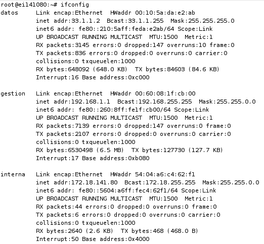

El router al que estoy conectado es el R1_1 y las direcciones que tiene son las siguientes:

* DATOS:   33.1.1.1
* GESTIÓN: 192.168.1.11
* INTERNA: 172.16.1.1

### 2.- Introduzca las entradas de encaminamiento necesarias para comunicar todos los puestos de usuario de su isla. Compruebe la configuración con las utilidades ping y traceroute, y anote los resultados.

Para configurar las entradas de encaminamiento accedemos desde un navegador a la página de configuración del router, para acceder introducimos la dirección del interfaz de datos de nuestro router (33.1.1.1) y entramos con usuario “admin” y sin introducir contraseña.

Tener que introducir en nuestro router los encaminamientos necesarios para que pueda llegar a los ordenadores de las otras subredes de la misma isla, para ello indicaremos que dada la dirección de una subred de destino, la puerta de enlace a través de la que se acceda sea la dirección de la interfaz interna del router de dicha subred, quedando la tabla ya configurada de la siguiente manera:

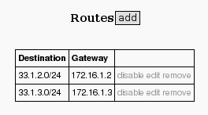

Ahora vamos a comprobar que hay conectividad, vamos a comprobar que estamos conectados al ordenador PC1_5, cuya dirección IP es 33.1.3.2. Primero comprobamos mediante “ping”:

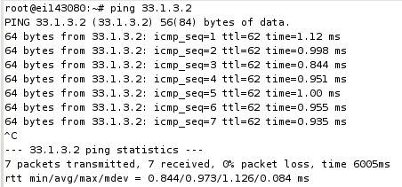

Ahora comprobamos con “traceroute”:

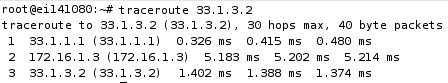

Como podemos comprobar, existe conectividad entre las 2 subredes.

### 3.- Introduzca las entradas de encaminamiento necesarias para comunicar todos los puestos de usuario de su isla con los puestos de usuario de otra isla. Compruebe la configuración con las utilidades ping y traceroute.

Para poder comunicar todos los puestos de todas las islas, deberemos configurar el camino a través de los routers R1_4 o R1_5, de igual manera los dos, y siguiendo por R1_6 hacia las otras islas. Además los routers de las otras islas también deben estar configurados para que las conexiones puedan realizarse. En nuestro caso las tablas de los routers quedarían así:

El router R1_1, que es el router de nuestra subred, indicando por donde tiene que pasar para salir de nuestra isla:

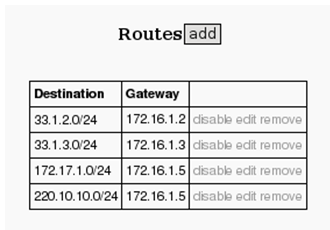

Los routers que se encuentran en mitad, R1_4 y R1_5, ya que los dos usarán la misma tabla de enrutamiento, en estos indicamos como salir de la isla y, como llegarán a nuestros ordenadores las conexiones provenientes desde otras islas:

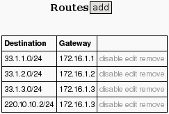

El router 1_6, que será el que nos permitirá interconectarnos con el resto de islas, indicando por el router que tiene que pasar en función de la isla a la que se realice la conexión:

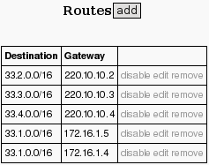

Como no pudimos coincidir con que los compañeros de otra isla terminarán su configuración, no nos fue posible realizar las pruebas de “ping” y “traceroute”.

## PARTE I

### 1.- Configure el router con el que está directamente conectado para que no reenvíe ningún tipo de tráfico (acción "drop"). Habitualmente, al configurar un cortafuego inicialmente se deniega cualquier acceso, y luego se añaden reglas para el tráfico que sí se desea dejar pasar.

Como queremos añadir una regla que descarte todo el tipo de tráfico, primero en la pestaña “General” indicamos que la cadena va a ser “forward”, para que se aplique a los paquetes que reenviará el router según sus tablas de encaminamiento.
Además como queremos que se aplique a todo el tráfico, no especificaremos ni dirección ni puerto, ni para el origen, ni para el destino.

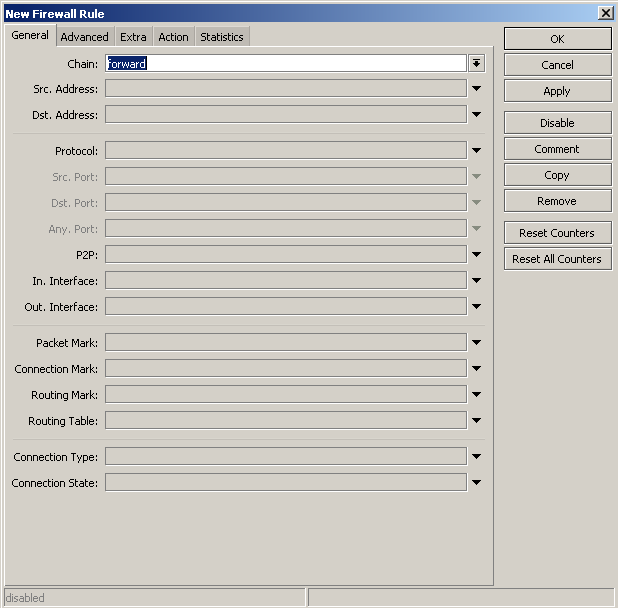

Desde la pestaña “Action” vamos a indicar la acción a realizar con todos los paquetes que cumplan el criterio anterior, y como queremos desecharlos, marcaremos la “Action:” “drop”.

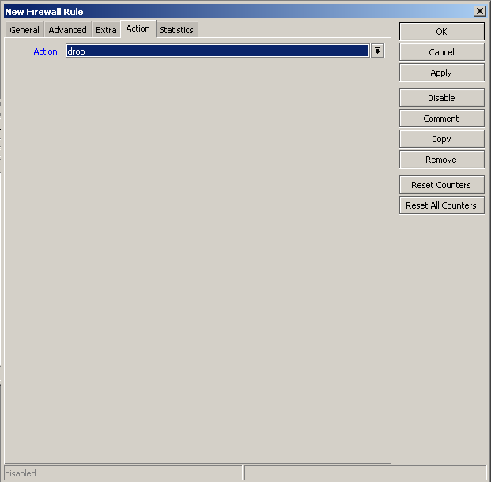

Aquí podemos observar que la regla se ha creado correctamente, ningún paquete será reenviado desde ninguna dirección a ninguna dirección.

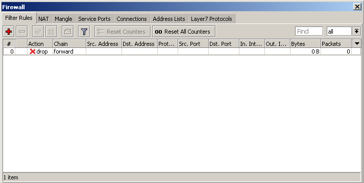

### 2.- A continuación configure el cortafuego del router para que permita a otros ordenadores:
#### a) conectarse al servidor de SSH del ordenador que tenga la dirección 33.X.Y.2.
#### b) iniciar una conexión al servidor de SSH del ordenador que tenga la dirección 33.X.Y.3.

Para configurar el cortafuegos de manera que nos permita hacer lo pedido, deberemos crear cuatro reglas:

1. Aceptar el tráfico TCP desde cualquier dirección hacia la dirección 33.1.1.2 y puerto 22 (el puerto de la conexión SSH).
2. Aceptar el tráfico TCP desde cualquier dirección desde el puerto 22 hacia la dirección 33.1.1.3.
3. Aceptar el tráfico TCP desde la dirección 33.1.1.2 y el puerto 22 hacia cualquier dirección.
4. Aceptar el tráfico TCP desde la dirección 33.1.1.3 con cualquier dirección de destino, pero al puerto 22.
Dichas reglas son las que vamos a crear introduciendo lo siguiente:

1. General -> Chain: forward / Dst. Address: 33.1.1.2 / Protocol: 6 (tcp) / Dst. Port: 22 Action -> Action: accept
2. General -> Chain: forward / Dst. Address: 33.1.1.3 / Protocol: 6 (tcp) / Src. Port: 22 Action -> Action: accept
3. General -> Chain: forward / Src. Address: 33.1.1.2 / Protocol: 6 (tcp) / Src. Port: 22 Action -> Action: accept
4. General -> Chain: forward / Src. Address: 33.1.1.3 / Protocol: 6 (tcp) / Dst. Port: 22 Action -> Action: accept

Una vez creadas todas las reglas, deberemos bajar al final de la lista la regla “drop”, porque como cualquier condición la cumple, todas las demás reglas no llegarían a activarse nunca.

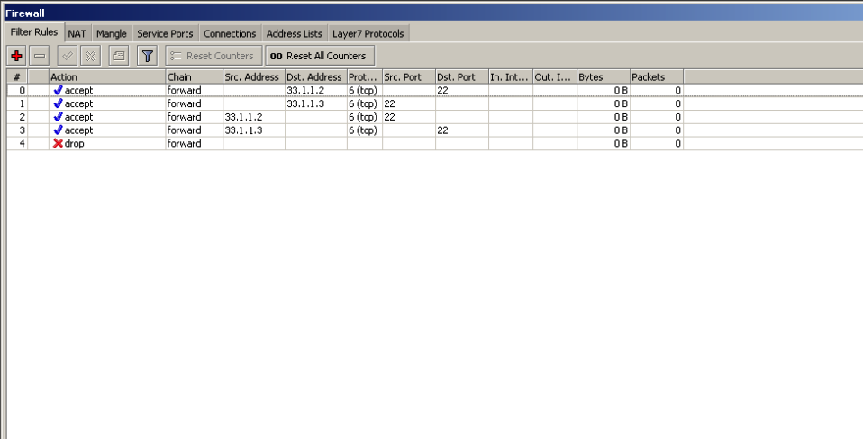

Dado que hubo problemas durante la configuración, no pudimos comprobar que las reglas establecidas funcionaran correctamente, pero en teoría, si desde mi ordenador que tiene IP 33.1.1.2 intentase conectarme mediante SSH al ordenador de mi compañero, cuya IP es 33.1.1.3, debería poder conectarme sin problemas.
