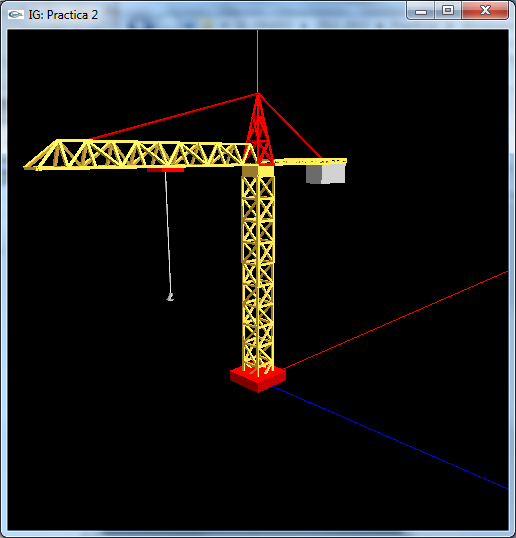
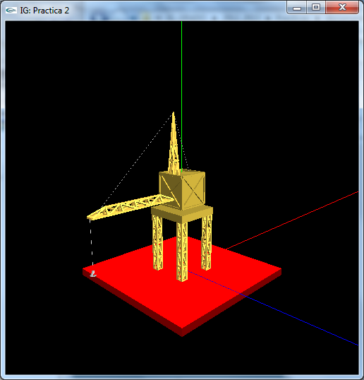

Informática Gráfica
=========================================
3º Grado en Ingeniería Informática 2012/2013
--------------------------------------------


# Práctica 2: Modelos jerárquicos
### Germán Martínez Maldonado

## Objetivos

El objetivo principal de esta segunda práctica es aprender a diseñar modelos jerárquicos de objetos articulados. Realizaremos su implementacion y el control de los parámetros de animación de los grados de libertad del modelo usando OpenGL. Como objetivo secundario aprenderemos a gestionar y usar la pila de trasformaciones de OpenGL.


## Desarrollo

Las acciones a realiar en esta práctica son:

1. Diseñar un modelo jerárquico con al menos 3 grados de libertad distintos (al menos deben aparecer giros y desplazamientos). Puedes tomar como ejemplo el diseño de un grúa semejante a las del ejemplo (ver figura). En el ejemplo, estas gruas tienen al menos tres grados de libertad: ángulo de giro de la teorre, giro del brazo y altura del gancho.




2. Diseña el grafo del modelo jerárquico del objeto diseñado, determinando el tamaño de las piezas y las transformaciones geométricas a aplicar (tendrás que entregar el grafo del modelo en papel, o en formato: pdf, jpeg, etc, cuando entregues la práctica).

3. Crea en objetos.h e implementa en objetos.cc, una clase para almacenar el modelo jerárquico. El modelo debe contener la información necesaria para definir los parámetros asociados a la construcción del modelo (medidas de elementos, posicionamiento, etc.) y los parámetros que preveas modificar (grados de libertad, etc.).

4. Edita el constructor de la clase para inicializar los parámetros necesarios.

5. Crea un método para dibujar el modelo jerárquico en la clase creada en el módulo objetos.cc, utilizando los valores de los parámetros del constructor anterior. Llama a este método desde la función de dibujo definida en OpenGL. Para ver mejor la colocación de cada pieza puedes dibujar los ejes.

6. Incorpora métodos a la clase para modificar los parámetros modificables del modelo y para controlar su animación. Añade la ejecución de dichos métodos en las funciones de control de pulsación de teclas para animar el modelo de forma interactiva. Ten presente los límites de cada movimiento. Puedes utilizar el ejemplo del coche entregado para familiaazrizarte con el proceso. Ejecuta el programa y compurueba que los movimientos son correctos.

7. Añade miembros a la clase para almacenar la velicidad de movimiento según cada uno de los parámetros. Añade opciones para fijar la velocidad de cada parámetro a un valor positivo, negativo o cero. Ahora puedes animar el modelo haciendo que el valor del parámetro se incremente con su velocidad.

Para animar el modelo utiliza una función de fondo que se ejecute de forma indefinida en el ciclo de ejecución de la aplicación OpenGL, en la que puedes realizar la actualización de cada parámetro en función de su velocidad. La función de fondo está creada en el fichero practica_2.cc y se activa desde el programa principal con:

```
glutIdleFunc( idle );
```

Siendo **void idle()** el nombre de la función que se llama para modificar los parámetros. La función animación debe cambiar los parámetros del modelo en función de la velocidad y llamar:

```
glutPostRedisplay();
```

Para que se redibuje. Cambia finalmente el procedimiento de entrada para que lo que se modifiquen desde el teclado sean las velocidades.
