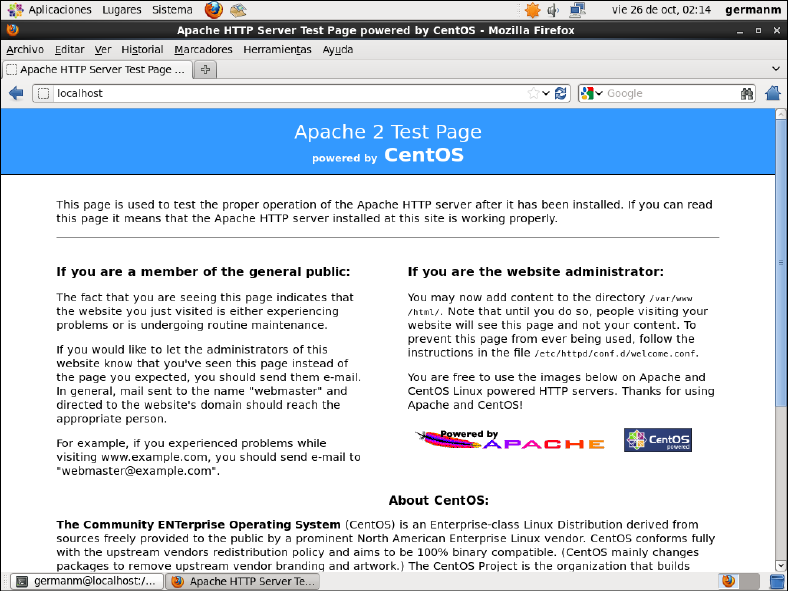
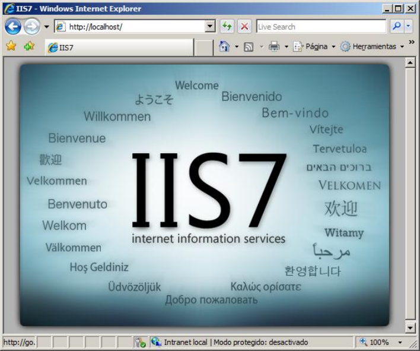
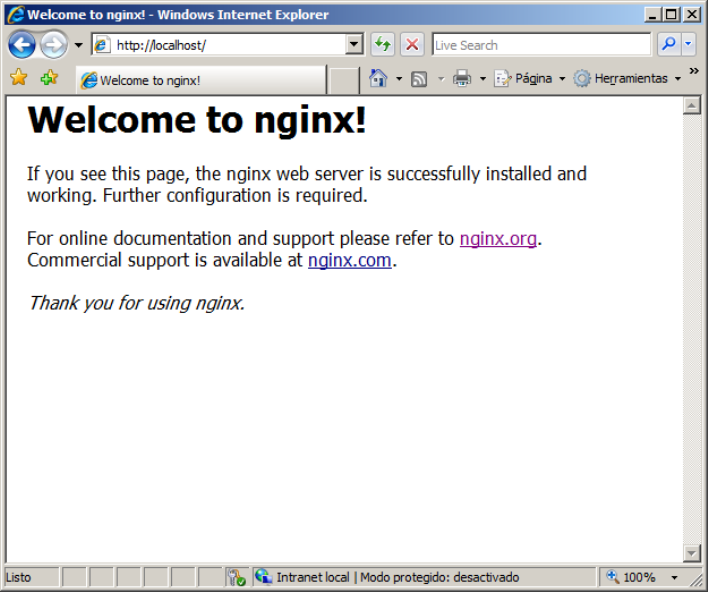
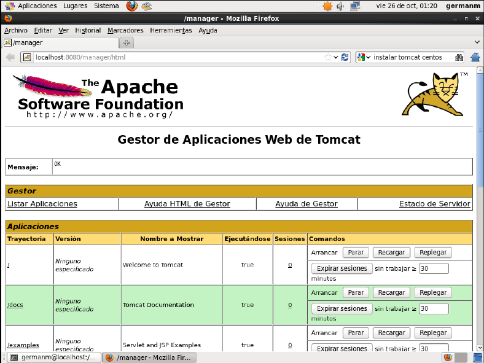

Ingeniería de Servidores
=========================================
3º Grado en Ingeniería Informática 2012/2013
--------------------------------------------


# Práctica 2: Instalación y configuración básica de servicios
### Germán Martínez Maldonado


## 3.1.- INSTALACIÓN DE SERVICIOS Y CONFIGURACIONES

## 3.1.1) yum

### Cuestión 1: Liste los argumentos de yum necesarios para instalar, buscar y eliminar paquetes

Para instalar paquetes: 

```# yum [-y] install paquete1 [paquete2 ...]```

Para buscar paquetes: 

```# yum search cadena1 [cadena2 ...]```

Para eliminar paquetes: 

```# yum [-y] remove|erase paquete1 [paquete2 ...]```

En los tres casos podemos indicar tantos paquetes como queramos. Para instalar o eliminar podemos añadir la opción "-y" para que la acción se realice directamente sin pedirnos confirmación.

### Cuestión 2.2: Instale el programa “midnight commander” e indique el comando usado.

Para conocer el paquete del programa "midnight commander" usamos:

```
# yum search "midnight commader"
```

Esto nos devolverá como candidato:

```
mc.i686:User-friendly text console file manager and visual shell.
```

Así que ya solo nos queda instalarlo son:

```
# yum install mc
```

## 3.1.2) apt

### Cuestión 3: Indique el comando para buscar un paquete en un repositorio y el correspondiente para instalarlo.

Para buscar un paquete:

```
$ apt-cache search cadena1 [cadena2 ...]
```

Para instalar un paquete:

```
# apt-get install paquete1 [paquete2 ...]
```

### Cuestión 4.1: Indiqué qué ha modificado para que apt pueda acceder a los servidores de paquetes a través del proxy.

Para configurar el acceso de apt a través del proxy deberemos comprobar si existe el archivo "/etc/apt/apt.conf", si existe, añadimos la siguiente línea:

```
Acquire::http::Proxy "stargate.ugr.es:3128";
```

Si el archivo anterior no existe, creamos el archivo "/etc/apt/apt.conf.d/88apt-proxy" e introducimos en él la línea anterior.

### Cuestión 4.2: Instale el programa “midnight commander” e indique el comando usado.

Para saber el paquete que tenemos que instalar buscaremos en la caché de paquetes:

```
$ apt-cache search "midnight commander"
```

De entre los paquetes mostrados el que nos interesa es:

```
mc - Midnight Commader - a powerful file manager
```

Y procedemos con su instalación:

```
# apt-get install mc
```

## 3.1.4) OpenSuse [opcional]

### Cuestion opcional 1: ¿Qué gestores utiliza OpenSuse?

OpenSuse utiliza Libzypp como sistema de gestión de paquetes. Se puede manejar mediante YaST en entorno gráfico y Zypper en línea de comandos.


## 3.3.- INSTALACIÓN DEL SERVICIO DE ACCESO REMOTO A LA CONSOLA (SECURE SHELL)

### Cuestión 5: ¿Qué diferencia hay entre telnet y ssh?

Tanto telnet como ssh sirven para realizar conexiones con una máquina remota a tavés de una red, pero mientras telnet envía toda la información como texto plano, ssh usa técnicas de cifrado para que la información enviada solo sea legible para su destinatario.

### Cuestión 6: ¿Para que sirve la opción -X? Ejecute remotamente, es decir, desde la máquina anfitriona con una sesión abierta en la máquina virtual, el comando gedit. ¿Qué ocurre?

La opción -X habilita el "X11 forwarding", que permite ejecutar aplicaciones gráficas en la máquina remota, pero visualizando la interfaz gráfica en el escritorio local, no siendo necesario ni que la máquina remota disponga de un gestor de ventanas.

Para probarlo, primero desde nuestra máquina anfitriona nos conectamos a la máquina virtual remota con ssh y la opción -X (siendo para el ejemplo nuestro de usuario "germanm" y "la dirección de la máquina remote "192.168.116.128").

```
$ ssh -X germanm@192.168.116.128
```

Se nos avisará que la autenticación del host remoto no puede ser comprobada, confirmamos que aun así queremos conectarnos e introducimos la contraseña de nuestro usuario. Una vez dentro, si ejecutamos el comando gedit veremos como aparece la interfaz gráfica en nuestra máquina anfitriona, pero si vemos los archivos accesibles comprobaremos que son los almacenados en la máquina remota.

### Cuestión 7: muestre la secuencia de comandos y las modificaciones a los archivos correspondientes para permitir acceder a la consola remota sin introducir la contraseña. (Pistas: ssh-keygen, ssh-copy-id)

Para poder acceder a la consola remota sin introducir contraseña, primero deberemos generar localmente una clave de autenticación para la autenticación de conexiones ssh en nuestro sistema, como en la cuestión anterior hemos visto que el sistema de encriptación usado es RSA, generamos la clave para ese tipo de identificación:

```
$ ssh-keygen -t rsa
```

Indicaremos en que directorio de nuestra máquina local queremos que se cree el archivo de la clave, dejando la contraseña en blanco cuando nos la solicite, para así poder acceder sin contraseña.

Ahora deberemos copiar la clave al servidor para poder realizar con él la conexión sin contraseña.

```
$ ssh-copy-id-i /home/usuario/.ssh/id_rsa.pub germanm@192.168.116.128
```

Deberemos introducir la contraseña del usuario remoto esta vez, pero no a partir de ahora, podremos conectarnos directamente con ese nombre de uusario a la máquina remota mediante ssh sin tener que introducir ninguna contraseña.

### Cuestión 8: ¿Qué archivo es el que contiene la configuración de sshd?

El archivo que contiene la configuración de sshd es "/etc/ssh/sshd.config", desde aquí podremos cambiar configuraciones como permitir el acceso sin tener que introducir contraseña, para ello introducimos las siguientes líneas:

```
ChallengeResponseAuthentication no
PasswordAuthentication no
UsePAM no
```

### Cuestión 9: Indique si es necesario reiniciar el servicio ¿Cómo se reinicia un servicio en Ubuntu? ¿y en CentOS? Muestre la secuencia de comandos para hacerlo.

Comprobamos que hasta que no reiniciaremos el servicio, la configuración no se hará efectiva, por lo que tendremos que reiniciarlo. En Ubuntu el servicio a reiniciar será "ssh", mientras que en CentOS será el servicio "ssh", pero se reiniciarán de igual forma:

* Ubuntu: `# service ssh restart`
* CentOS: `# service sshd restart`


## 3.4.- INSTALACIÓN DE UN SERVIDOR WEB BÁSICO

## 3.4.1) Instalación de Apache + MySQL + PHP en Linux (LAMP)

### Cuestión 10: Muestre los comandos que ha utilizado en Ubuntu Server y en CentOS (aunque en este último puede utilizar la GUI, en tal caso, realice capturas de pantalla)

Para instalar Apache + MySQL + PHP seguimos los siguientes pasos:

* Primero instalamos Apache, para ello introducimos el comando correspondiente:
 * Ubuntu: `# apt-get install apache2`
 * CentOS: `# yum install httpd`

* Seguidamente instalamos MySQL:
 * Ubuntu: `# apt-get install mysql-server`
 * CentOS: `# yum install mysql-server mysql`

* Finalmente instalamos PHP:
 * Ubuntu: `# apt-get install php5 libapache2-mod-php5 php5-cli php5-mysql`
 * CentOS: `# yum install php php-mysql`



### Cuestión 11: Enumere otros servidores web (mínimo 3 sin considerar Apache, IIS ni nginx)

Podemos encontrarnos otros servidores como Lighttpd, Cherokee o HTTP Explorer, teniendo todos en común que son servidores web libres.

## 3.4.2) Windows: IIS

### Cuestión 12: ¿Cómo comprueba que funciona?

Para comprobar que el servidor web IIS funciona, al igual que comprobamos en CentOS por tener interfaz gráfica, si accedemos a la dirección "http://localhost/" a través de la barra de direcciones del navegador web, nos mostrará una ventana que indicará que el servicio se ha instalado correctamente.



## 3.4.3) Windows y otros servidores web [opcional]

### Cuestión opcional 2: Ilustre el proceso de instalación. (http://nginx.org)

Primero nos descargarmos la última versión estable de nginx, que actualmente es la "1.2.4". Copiamos el archivo en la carpeta "C:\" y lo descomprimimos, sólo deberemos ejecutar el archivo "nginx.exe", que se encuentra dentro de la carpeta que acabamos de descomprimir, y ya tendremos el servidor funcionando, como podremos comprobar si introducimos "http://localhost/" en la barra de direcciones del navegador web.



## 3.4.4) Java Servlets

### Cuestión 13: ¿Qué es un Servlet?

Los servlets son pequeños programas escritos en Java que se ejecutan en el servidor para añadirle nuevas funcionalidades a una página web, pudiendo realzar acciones como la de saludar a un usuario cuando accede a una página web o permitir el acceso a una base de datos encriptando la información enviada.

### Cuestión opcional 3: Realice la instalación de uno de estos dos “web containers”

El "web container" que vamos a instalar en este caso es Apache Tomcat en CentOS. Deberemos seguir los siguientes pasos.

1. Comprobamos que tenemos instalado Java con "java -version", si nos devuelve un error descargamos el archivo RPM de la web de Oracle y lo instalamos directamente con el instalador de paquetes.

2. Podremos instalar Tomcat directamente con el gestor de paquetes yum:

```
# yum install tomcat6
```

3. Iniciamos el servicio correspondiente:

```
# service tomcat6 start
```

4. Para comprobar que funciona correctamente, introducimos la dirección "http://localhost:8080" en la barra de direcciones del navegador web. Si quisiéramos acceder al gestor de aplicaciones de Tomcat, la dirección a la que deberíamos acceder es "http://localhost:8080/manager/html".




## Bibliografia: (consultado a día 11/11/2012)

* Enlace 1: "Cómo instalar LAMP en Ubuntu 12.04 | @lobo_tuerto": 
          [http://lobotuerto.com/blog/2012/09/09/como-instalar-lamp-en-ubuntu/](http://lobotuerto.com/blog/2012/09/09/como-instalar-lamp-en-ubuntu/)

* Enlace 2: "CentOS 6 LAMP Install (Apache MySQL & PHP) via YUM:
          [http://linuxmoz.com/centos-6-lamp-install/](http://linuxmoz.com/centos-6-lamp-install/)

* Enlace 3: "fraterneo GNU/Linux: 6 Servidores Web libres para GNU/Linux y otros sistemas"
          [http://fraterneo.blogspot.com.es/2010/12/6-servidores-web-libres-para-gnulinux-y.html](http://fraterneo.blogspot.com.es/2010/12/6-servidores-web-libres-para-gnulinux-y.html)

* Enlace 4: nginx 1.2.4 Stable version: 
          [http://nginx.org/download/nginx-1.2.4.zip](http://nginx.org/download/nginx-1.2.4.zip)

* Enlace 5: "nginx for Windows":
          [http://nginx.org/en/docs/windows.html](http://nginx.org/en/docs/windows.html)

* Enlace 6: "Introducción a los Servlets | Manual Web":
          [http://www.manualweb.net/java-ee/introduccion-a-los-servlets/](http://www.manualweb.net/java-ee/introduccion-a-los-servlets/)

* Enlace 7: "Java SE Downloads":
          [http://www.oracle.com/technetwork/java/javase/downloads/index.html](http://www.oracle.com/technetwork/java/javase/downloads/index.html)
