Ingeniería de Servidores
=========================================
3º Grado en Ingeniería Informática 2012/2013
--------------------------------------------

# Práctica 3: Monitorización de servicios
### Germán Martínez Maldonado

## 3.1.- MANIPULANDO PROCESOS CON TOP Y HTOP

### Cuestión 1: ¿Qué muestra este comando?

Muestra información actualizada a intervalos regulares sobre los procesos en el sistema, la carga media, el consumo de memoria, el PID de los procesos, el usuario que ejecuta los procesos y demás datos relativos al funcionamiento del sistema.

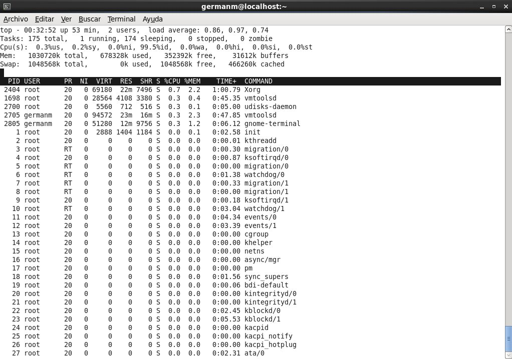

### Cuestión 2: Indique la secuencia de teclas que debe pulsar para “matar” un proceso.

Pulsamos “k”, introducimos el PID del proceso a matar e introducimos que la señal a mandar al proceso es “SIGTERM”.

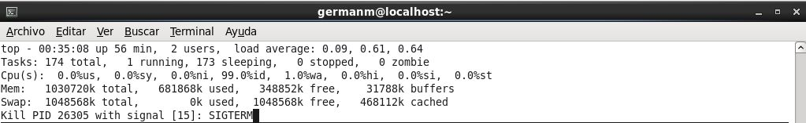

### Cuestión 3: El contenido de las ventanas cambia constantemente, ¿Qué teclas tiene que pulsar para ordenar la salida en base al %CPU? ¿y en base al consumo de memoria %MEM?

Pulsaremos “P” para ordenar por “%CPU” y “M” para ordenar por “%MEM”. Salida del comando top ordenada por %CPU:

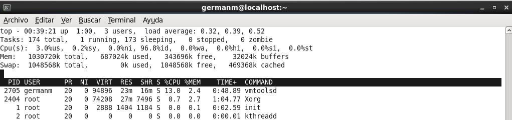

Salida del comando top ordenada por %MEM.

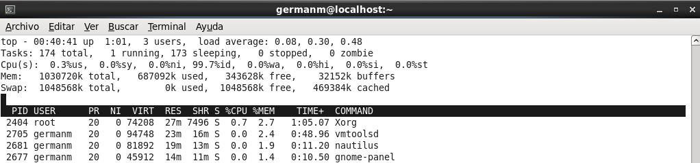

### Cuestión 4: ¿Qué tienen en común el comando uptime y top?

El comando uptime muestra la siguiente información:

* Hora actual del sistema.
* El tiempo que lleva el sistema en funcionamiento desde el último arranque.
* El número de usuarios logueados en el sistema actualmente.
* La carga promedio del sistema en los últimos 1, 5 y 15 minutos.

Y está información es la misma que muestra la primera línea de top.

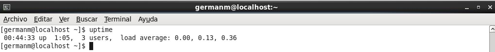

## 3.2.- CONOCIENDO EL SUBSISTEMA DE ARCHIVOS

### Cuestión 5: ¿Qué archivo debe consultar para ver quién se ha autenticado en el sistema?

En Ubuntu, en el archivo “/var/log/auth.log” quedan registrados todos los intentos de acceso al sistema, por lo que podremos usarlo para saber quién se ha autenticado en el sistema.

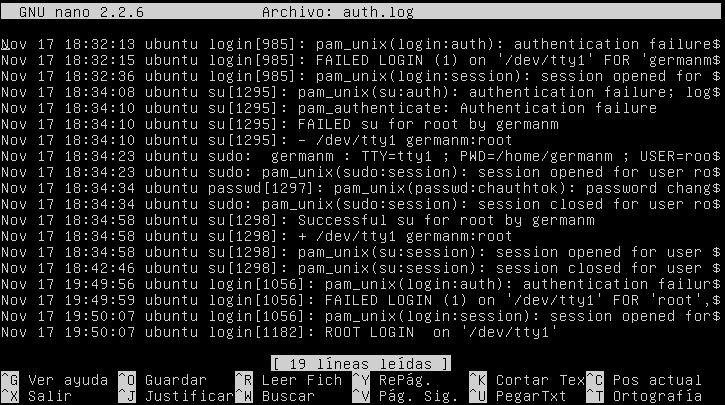

En CentOS el fichero que cumple la misma función lo encontramos en “/var/log/secure”:

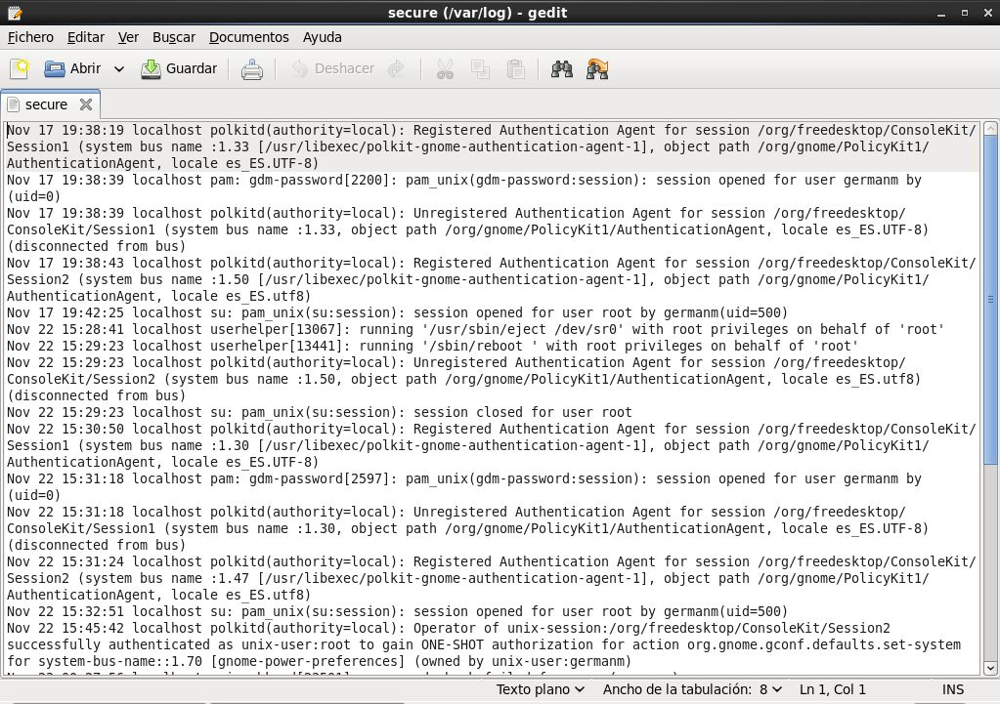

### Cuestión 6: ¿Qué significan las terminaciones .1.gz o .2.gz de los archivos en ese directorio?

Son archivos de registro que han sido comprimidos según las especificaciones de generación del propio archivo de registro, normalmente el tamaño que se ha definido para que ocupen. Contenido del directorio “/var/log/” en Ubuntu Server:

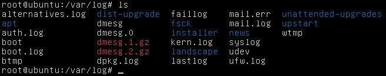

## 3.3.- ANALIZANDO QUÉ OCURRE CON EL KERNEL CON DMESG

### Cuestión 7: Pruebe a ejecutar el comando, conectar un dispositivo USB y vuelva a ejecutar el comando. Copie y pegue la salida del comando.

Si comparados la salida de dmesg antes de conectar el dispositivo USB y después, la diferencia que encontramos es:

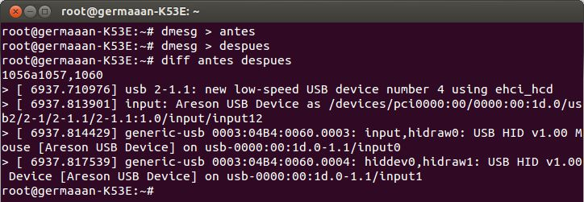

Como vemos nos indica que ha encontrado un nuevo dispositivo USB, concretamente un ratón que hemos conectado mediante conexión USB. Nota: ha sido hecho fuera de la máquina virtual, porque en la ejecución en esta no obtenía ninguna diferencia en el resultado.

## 3.4.-  MONITOR  GENERAL  GNOME-SYSTEM-MONITOR

### Cuestión 8: Instale el gnome-system-monitor (realice una captura de pantalla mostrando que funciona)

Instalamos gnome-system-monitor como siempre, con el comando yum.

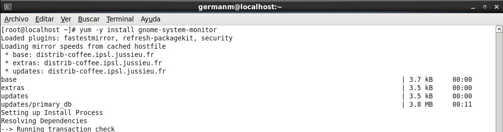

Una vez instalado, podemos ver que nos muestra información relativa a nuestra sistema sobre las características básicas de nuestro hardware como cantidad de memoria y procesadores instalados, información sobre los procesos en ejecución, el uso de los recursos de la máquina y capacidad de los sistemas de almacenamiento existentes. Información básica sobre el sistema y el hardware:

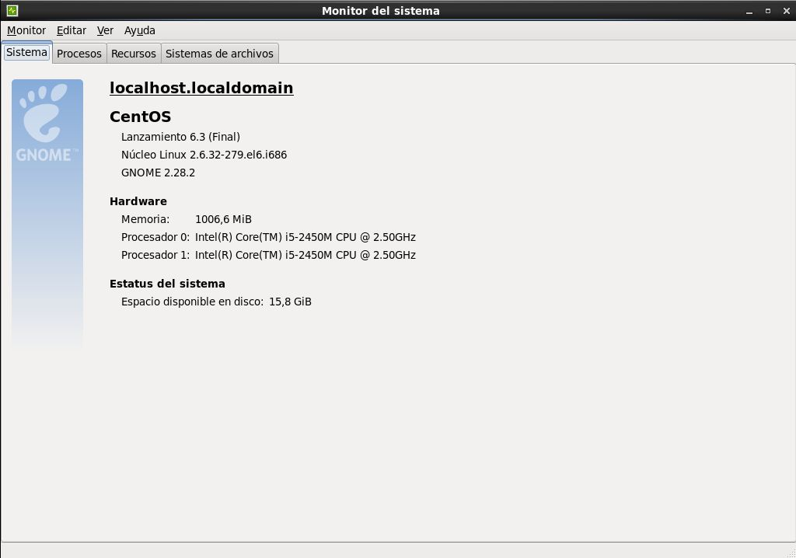

Información sobre los procesos en ejecución:

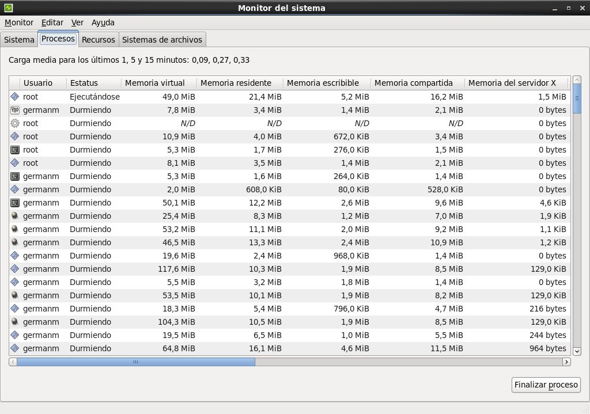

Información sobre el uso actual de los recursos de CPU, memoria y red:

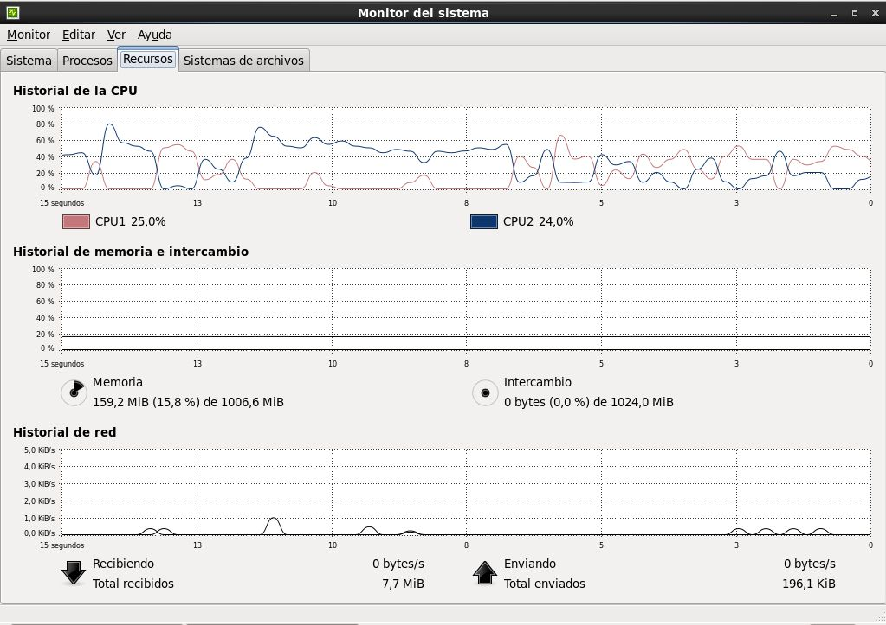

Información sobre los sistemas de almacenamiento:

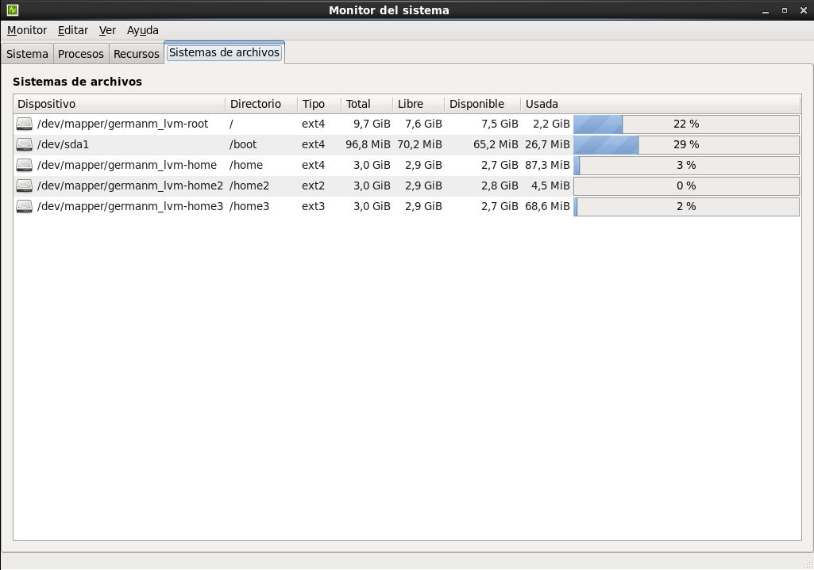

## 4.- MONITORIZANDO WINDOWS: PERFMON

### Cuestión  9:  Ejecute  el  monitor  de  “System  Performance”  y  muestre  el  resultado. Incluya capturas de pantalla.

El Monitor de rendimiento del sistema se encuentra dentro del Monitor de confiabilidad y rendimiento, para acceder a este último, desde el Menú Inicio, en el cuadro de búsqueda introducimos “perfmon”. Una vez abierto, en el panel de la izquierda, dentro de la categoría Herramientas de supervisión, seleccionamos Monitor de rendimiento. Ventana principal de Monitor de confiabilidad y rendimiento:

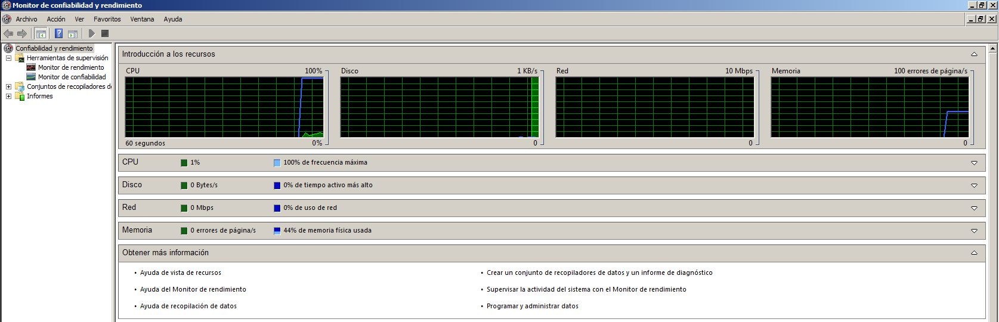

Ejecución del monitor de rendimiento con las opciones por defecto:

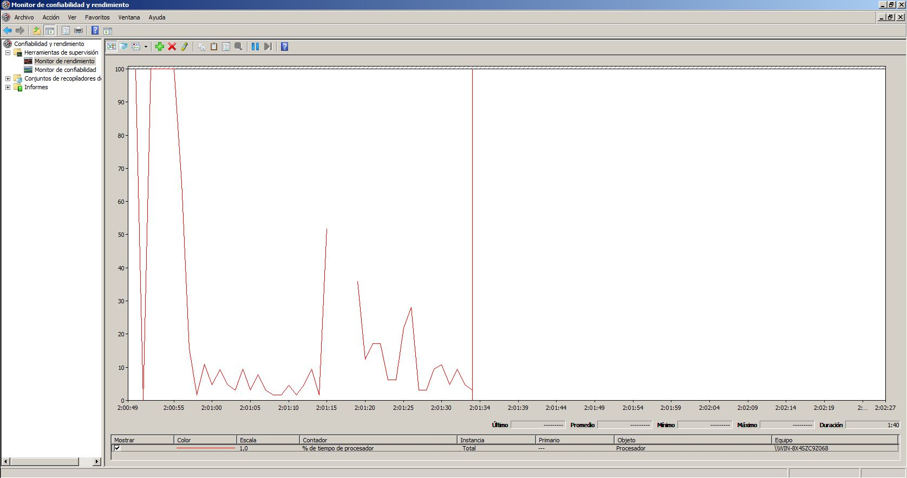

Vemos que por defecto solo se muestra el contador de % de tiempo de procesador, pero si pulsamos el botón verde que hay en la parte superior, este nos permitirá agregar más contadores al monitor, relacionados con otros aspectos del sistema como memoria, unidades lógicas, red o servidores entre otras.Ventana de propiedades del monitor, nos muestra los contadores agregados actualmente al monitor:

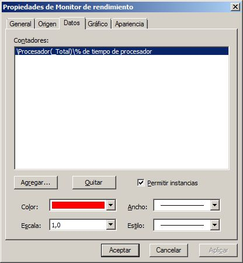

Ventana desde la que podremos agregar nuevos contadores a nuestro monitor:

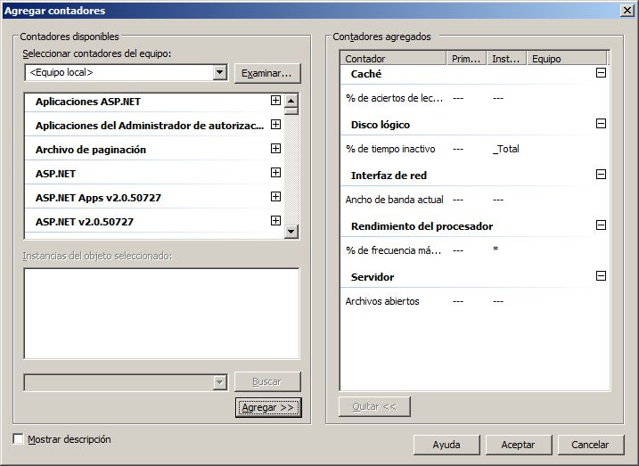

Ejecución del monitor con los nuevos contadores agregados.

### Cuestión 10: Cree un recopilador de datos definido por el usuario (modo avanzado) que incluya tanto el contador de rendimiento como los datos de seguimiento:

* Todos los referentes al procesador, al proceso y al servicio web. 
* Intervalo de muestra 15 segundos
* Almacene el resultado en el directorio Escritorio\logs 

### Incluya las capturas de pantalla de cada paso.

Para crear un recopilador de datos definido por el usuario, en el menú de la izquierda, expandimos la categoría Conjuntos de recopiladores de datos y seleccionamos la categoría Definido por el usuario. Si no tenemos ningún otro recopilador de datos definido por el usuario creado, la parte derecha de la ventana aparecerá en blanco, pues hacemos clic con el botón derecho sobre ella y seleccionamos Nuevo  -> Conjunto recopilador de datos y seguimos los siguientes pasos:

* Introducimos el nombre del recopilador y seleccionamos crear el recopilador manualmente.

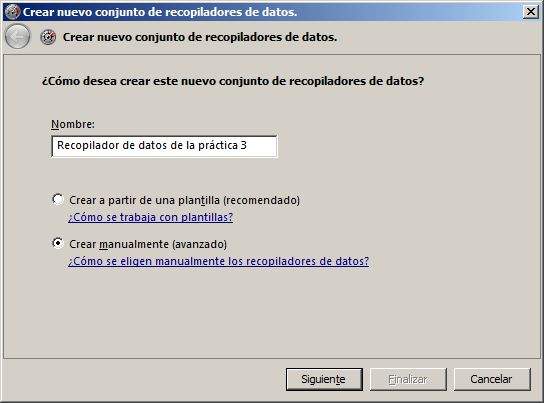

* Indicamos que queremos registrar tanto contador de rendimiento como datos de seguimiento de eventos.

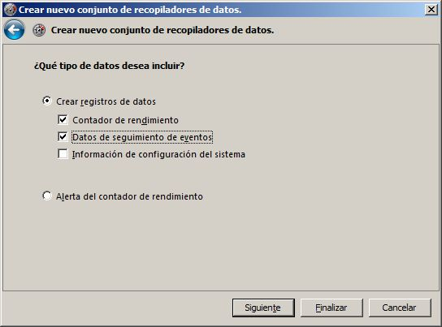

* Agregamos los contadores que queremos que el recopilador registre.

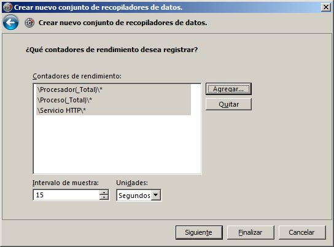

* Seleccionamos los contadores de rendimiento que vamos a agregar.

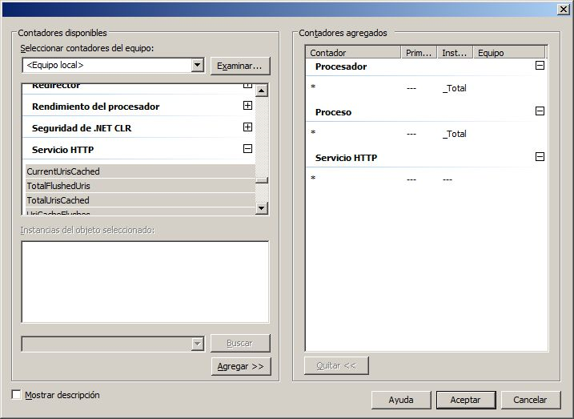

* Agregamos los proveedores de seguimiento de eventos para el recopilador.

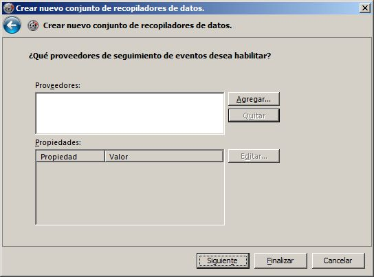

* Seleccionamos el proveedor de seguimiento de evento para agregar.
	
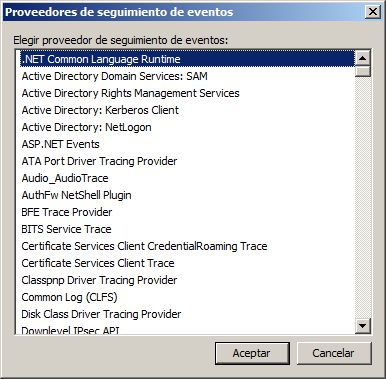

* Indicamos donde vamos a guardar el recopilador de datos.

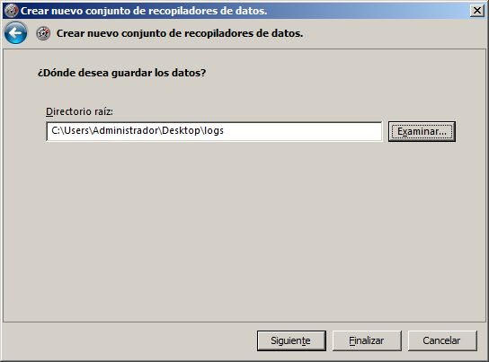

* Finalmente ponemos que lo vamos a ejecutar como el administrador del sistema.

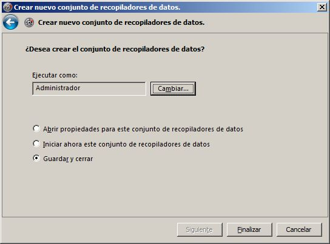

* Con el recopilador creado, hacemos clic derecho sobre él para iniciarlo.

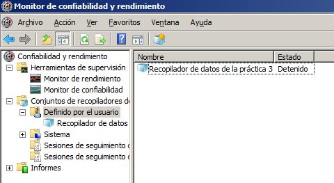

* Ejecutamos el archivo de monitor que aparecerá en la ruta que indicásemos.
	
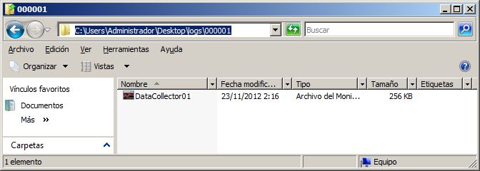

* Ahora vemos como es la ejecución del monitor de rendimiento con los datos que le hemos indicado que recopile.

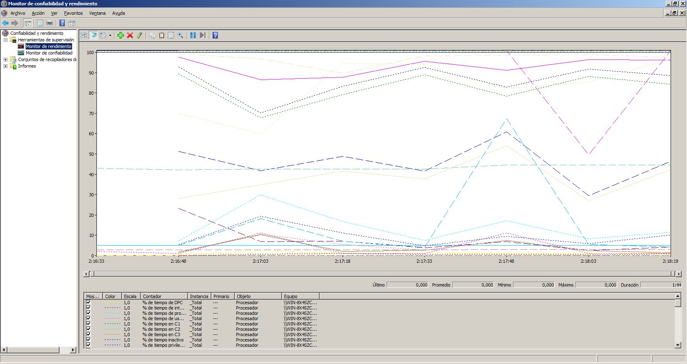

## 5.- MONITORIZANDO EL HARDWARE

### Cuestión opcional 1:  instale  lm-sensors y  su GUI en  CentOS (muestre  captura de  pantalla) (Consejo: lea los archivos README y los mensajes de error que le muestra el sistema. Pistas: make, gcc, gtk2-devel).

Vamos a seguir paso a paso la instalación de lm-sensors con su GUI xsensors, no he podido instalarlo en CentOS porque los sensores daban problemas en la máquina virtual, y al encontrarse la página web del proyecto caída actualmente [http://lm-sensors.org/](http://lm-sensors.org/), los archivos necesarios para que funcione en está sistema virtualizado que nombran muchos tutoriales consultados no están disponibles. Por lo descrito, la instalación ha sido llevada a cabo en una instalación no virtualizada de Ubuntu. Instalamos lm-sensors y su GUI (xsensors), no nos ha hecho falta indicar nada más para que funcione el programa correctamente.

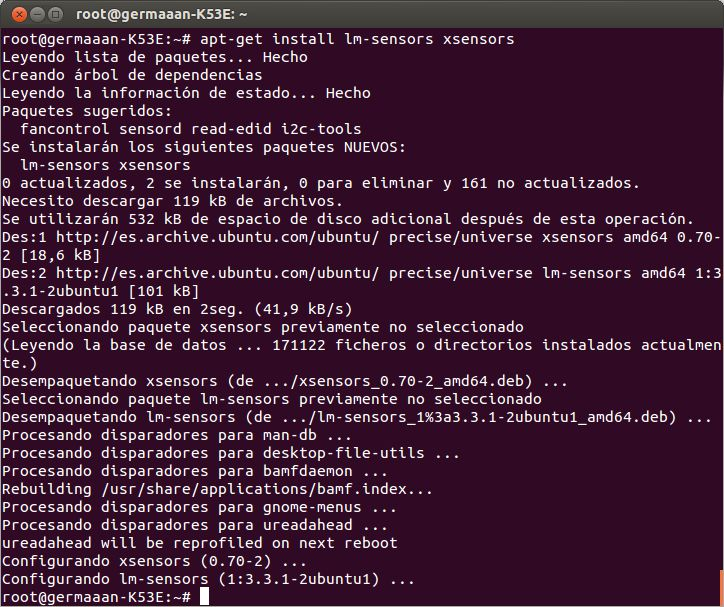

Usamos sensors-detect para conocer que sensores se encuentran disponibles en nuestro sistema, para ello responderemos afirmativamente a todas las pruebas que solicite hacer el programa.

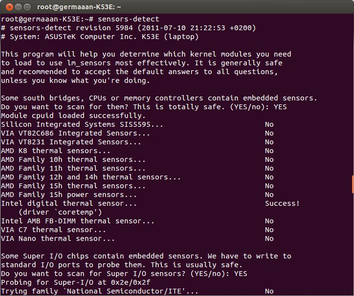

Una vez finalizadas las pruebas, el programa nos indicará los módulos que debemos añadir a nuestra configuración para que se puedan hacer las monitorizaciones disponibles, además de darnos la opción de añadirlos directamente a nuestra configuración.

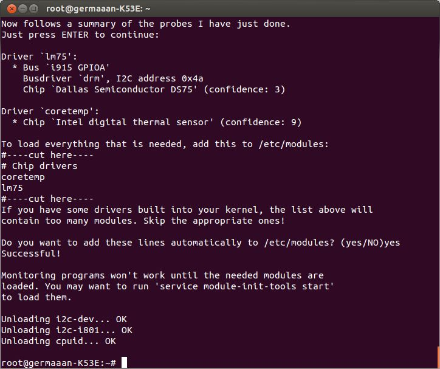

Ahora ya podremos obtener las mediciones en entorno texto o gráfico según como llamemos al programa.
Para el modo texto usamos “sensors”:

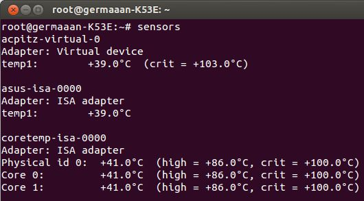

Para el modo gráfico usamos “xsensors”:

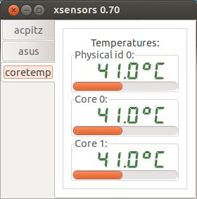

### Cuestión 11: Busque otros (mínimo dos) monitores para hardware comerciales o de código abierto para Windows y Linux.

System Explorer [http://systemexplorer.net/](http://systemexplorer.net/): programa gratuito para Windows que nos da información sobre los procesos de nuestro sistema y además el uso que hacen del procesador y la memoria esos procesos.

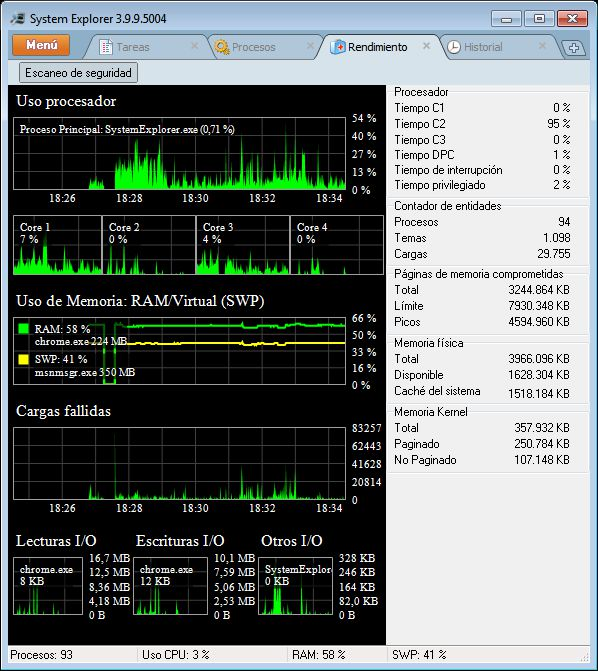

Active@ Hard Disk Monitor [http://www.disk-monitor.com/](http://www.disk-monitor.com/): es un programa de pago para Windows que nos permite conocer el estado actual de nuestro disco duro.

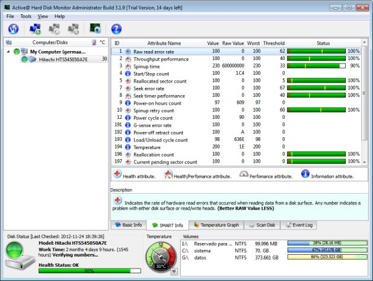
	

## 6.- OTROS MONITORES DEL SISTEMA

#### Cuestión opcional 1:¿Qué es el SGE? ¿Qué programa de monitorización usa?

SGE (Sun Grid Engine) es un sistema de encolamiento de procesos distribuido destinado a la creación y gestión de arquitectura de procesamiento en grid, siendo usado frecuentemente en entornos típicos de clústeres de computación de alto rendimiento. El programa de monitorización que usa es QMaster, que es el componente central de un cluster de computación basado en SGE.

## 6.1.- MUNIN

### Cuestión 12: Visite la web del proyecto y acceda a la demo que proporcionan donde se muestra cómo monitorizan un servidor. Monitorice varios parámetros y haga capturas de pantalla de lo que está mostrando.

Accediendo a la dirección [http://demo.munin-monitoring.org/munin-monitoring.org/demo.munin-monitoring.org/index.html#apache](http://demo.munin-monitoring.org/munin-monitoring.org/demo.munin-monitoring.org/index.html#apache) podremos encontrar ejemplos de la monitorización de un servidor Apache. Diversos parámetros monitorizados que encontramos son:

* Accesos al servidor Apache durante la última semana.

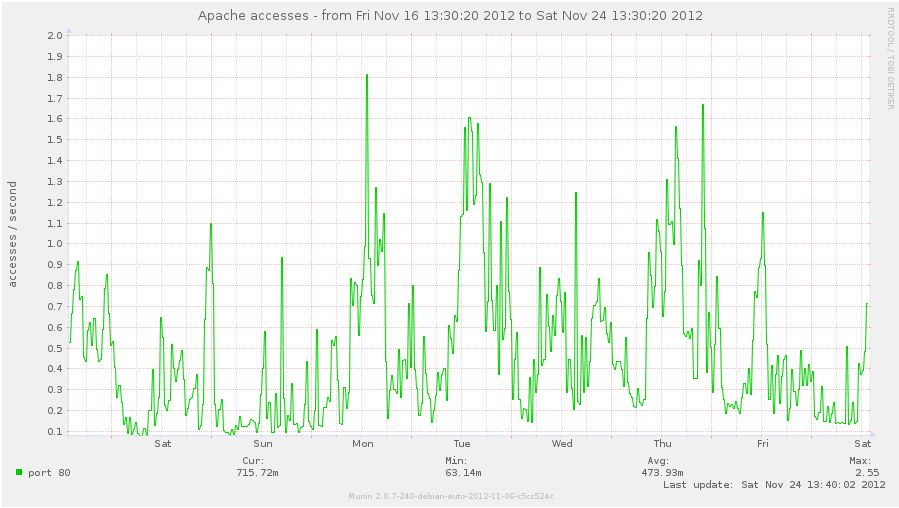

* Operaciones de entrada/salida en la unidad de disco duro durante la última semana.

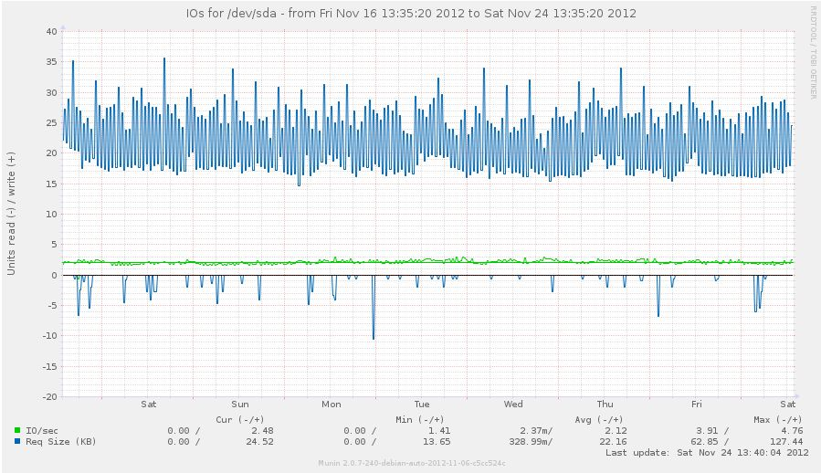

* Usuarios conectados durante la última semana.

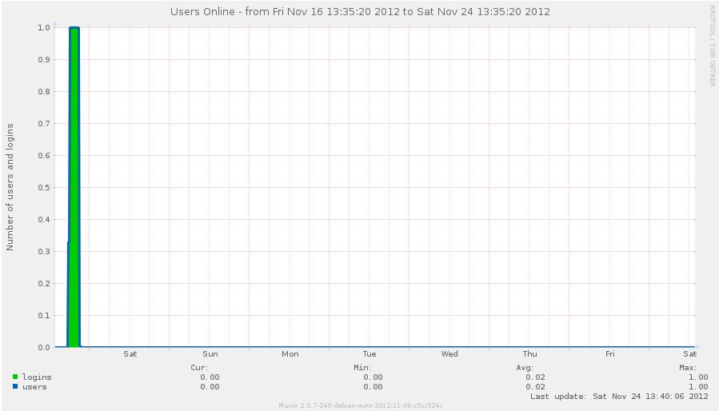

* Tiempo de procesamiento de Munin durante la última semana.

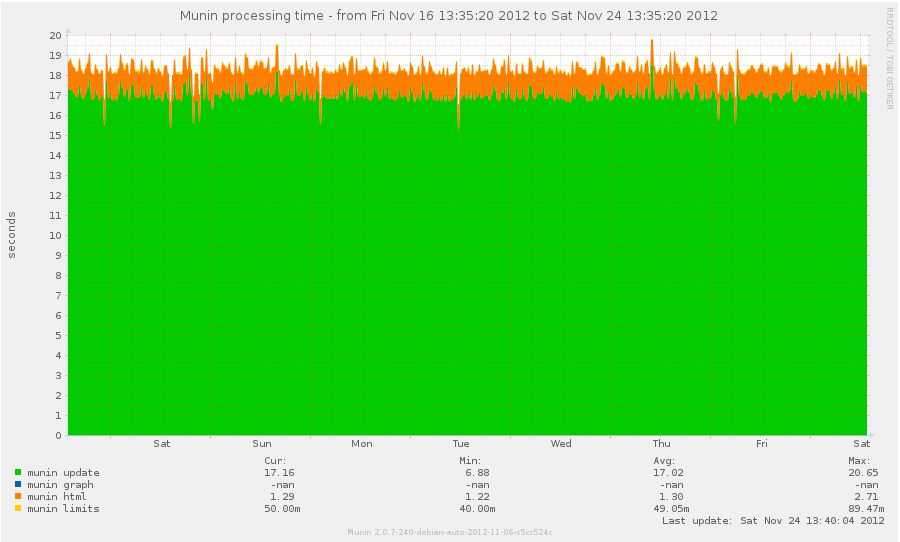

* Resultados de las ejecuciones de netstat durante la última semana.

## 6.3.- GANGLIA

### Cuestión opcional 3: En la página web está disponible el acceso demo a varios clusters, acceda sobre alguno de ellos y monitorícelo. Muestre capturas de pantalla.
Podremos acceder a las demos de los clusters a través de la dirección [http://ganglia.info/?page_id=69](http://ganglia.info/?page_id=69). De entre las demos disponible vamos a probar el del cluster de Wikimedia, la fundación a la que pertenece Wikipedia. Los parámetros a parametrizar son los siguientes:

* Carga en el grid de Wikimedia durante la última semana.

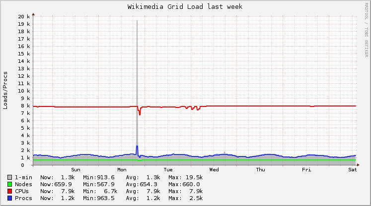

* Uso de memoria en el grid de Wikimedia durante la última semana.

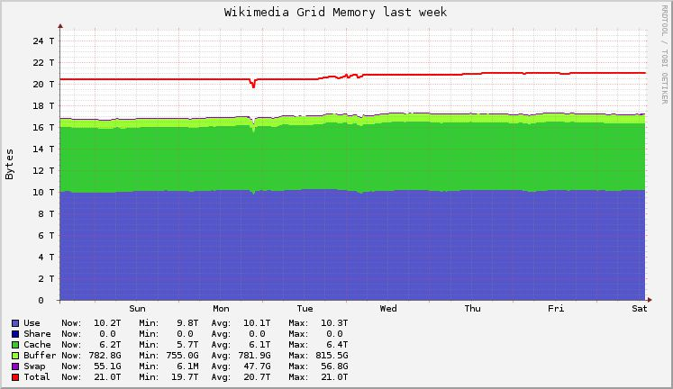

* Uso de CPU en el grid de Wikimedia durante la última semana.

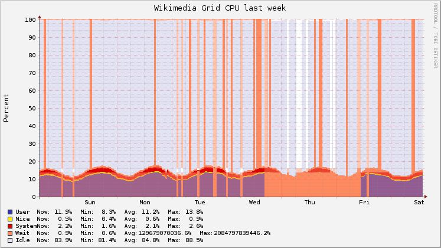

## Bibliografia: (consultado a día 25/11/2012)

* Enlace 1: “Instalar lm_sensors | systemadmin.es”:
          [http://systemadmin.es/2011/01/instalar-lm_sensors](http://systemadmin.es/2011/01/instalar-lm_sensors)

* Enlace 2: “LM_Sensors on Cent OS 5.4: How To Get And Install The Coretemp Module”, 10:13 24/03/2012:
          [http://www.question-defense.com/2010/03/24/lm_sensors-on-cent-os-5-4-how-to-get-and-install-the-coretemp-module](http://www.question-defense.com/2010/03/24/lm_sensors-on-cent-os-5-4-how-to-get-and-install-the-coretemp-module)

* Enlace 3: “Instalar y configura lm-sensors << Entre tuxes y pepinos”, 27/04/2007:
          [http://tuxpepino.wordpress.com/2007/04/27/instalar-y-configurar-lm-sensors/](http://tuxpepino.wordpress.com/2007/04/27/instalar-y-configurar-lm-sensors/)

* Enlace  4:  “Oracle  Grid  Engine  –  Wikipedia,  the  free  enciclopedia”,  última  modificación  02:47 22/11/2012:
          [http://en.wikipedia.org/wiki/Oracle_Grid_Engine](http://en.wikipedia.org/wiki/Oracle_Grid_Engine)

* Enlace 5: “Beginner’s Guide to Oracle Grid Engine 6.2”: 
          [http://www.oracle.com/technetwork/oem/host-server-mgmt/twp-gridengine-beginner-167116.pdf](http://www.oracle.com/technetwork/oem/host-server-mgmt/twp-gridengine-beginner-167116.pdf)
