Ingeniería de Servidores
=========================================
3º Grado en Ingeniería Informática 2012/2013
--------------------------------------------


# Práctica 4: Benchmarks
### Germán Martínez Maldonado


## 2.- BENCHMARKS POPULARES

## 2.1.- PHORONIX SUITE

### Cuestión 1: Instale la aplicación. ¿Qué comando permite listar los benchmarks disponibles?

Lo primero que deberemos hacer es instalar la aplicación **“Phoronix Test Suite”**, tanto en Ubuntu Server como en CentOS podremos instalarla directamente con el gestor de paquetes que usemos.

En el caso de Ubuntu Server deberemos introducir `# apt-get install phoronix-test-suite`:

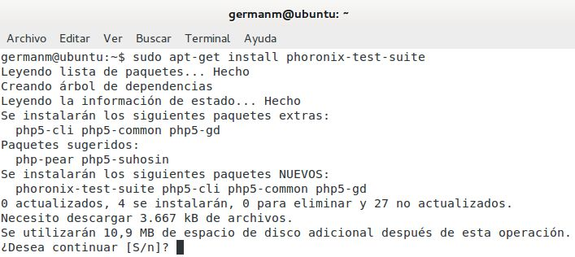

En el caso de CentOS para poder instalarlo desde el gesto de paquetes, primero deberemos añadir el repositorio EPEL, un grupo de paquetes adicionales para Linux Empresarial, ya que es el repositorio que contiene el paquete “**phoronix-test-suite**”. Podremos añadir el repositorio instalando el paquete “**epel-release-6-7**”, que nos podemos descargar desde “[http://download.fedoraproject.org/pub/epel/6/i386/epel-release-6-7.noarch.rpm](http://download.fedoraproject.org/pub/epel/6/i386/epel-release-6-7.noarch.rpm)” e instalar con el comando rpm:

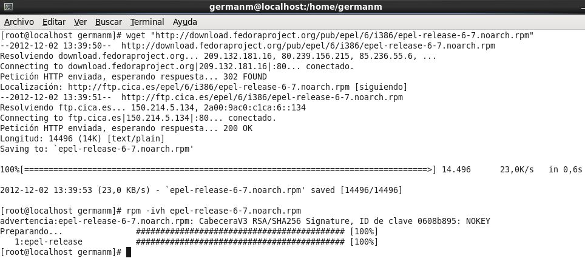

E instalamos el paquete “**phoronix-test-suite**” con “`# yum –y install phoronix-test-suite`”:

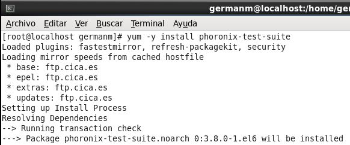

Comprobamos que el paquete se ha instalado correctamente ejecutando “**phoronix-test-suite system-info**” en ambos sistemas:

* Ubuntu Server:

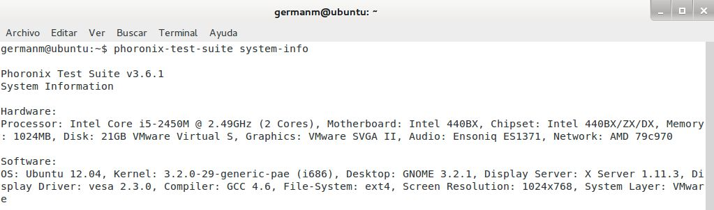

* CentOS:

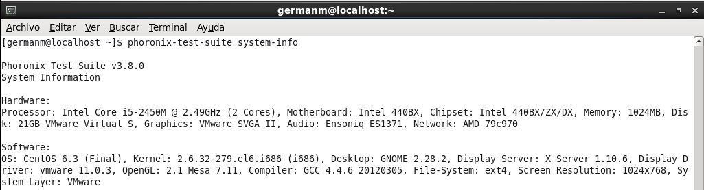

Antes de poder realizar los test, debemos conocer qué benchmarks están disponibles, por lo que necesitamos una lista con todos los test disponibles. Para listar los benchmarks disponibles introducimos en el terminal: “$ phoronix- test-suite  list-tests”:

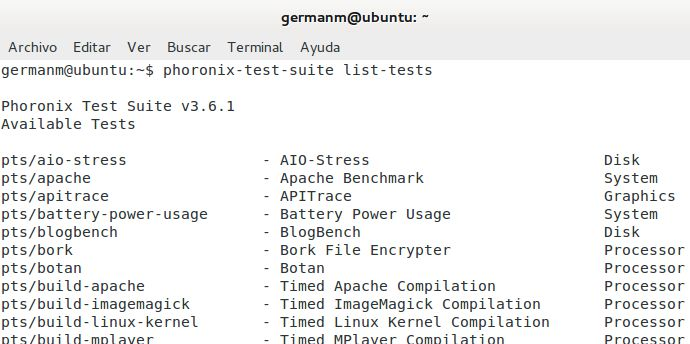

### Cuestión  2:  Seleccione  e  instale  tres  que  desee  y  ejecútelos.  Cambie  los  parámetros  de experimentación. ¿Aprecia cambios en los resultados?

Como el funcionamiento de los benchmarks es similar en ambos sistemas, ilustraremos con imágenes los tests realizados bajo Ubuntu Server. Los test a ejecutar son:

* Timed Linux Kernel Compilation (pts/build-linux-kernel)
* LAME MP3 Encoding (pts/encode-mp3-1.4.0)
* Stream  (pts/stream)

Primero vamos a mostrar la información sobre cada uno de los tests:

```
$ phoronix-test-suite info nombreTest
```

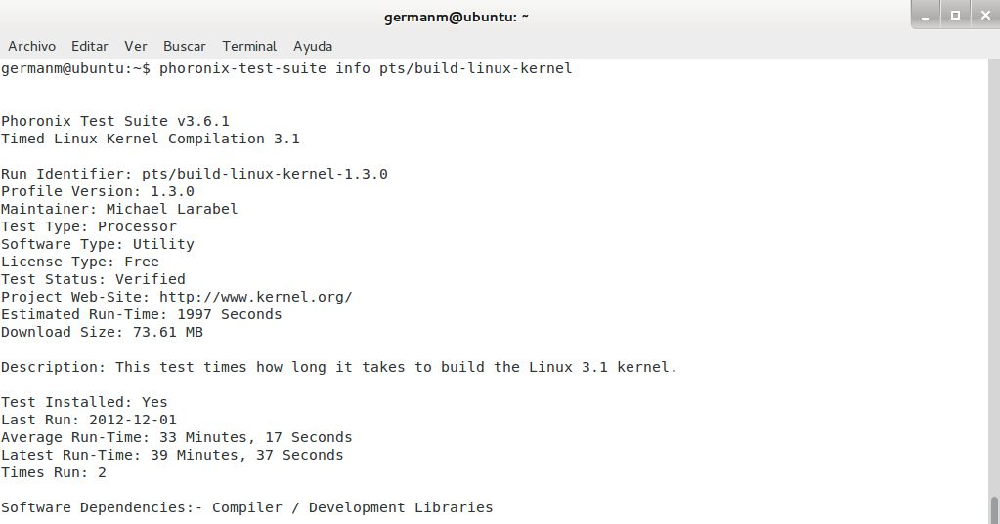

Si alguno de los test no estuviese instalado, deberíamos instalarlo introduciendo:

```
$ phoronix-test-suite install nombreTest
```

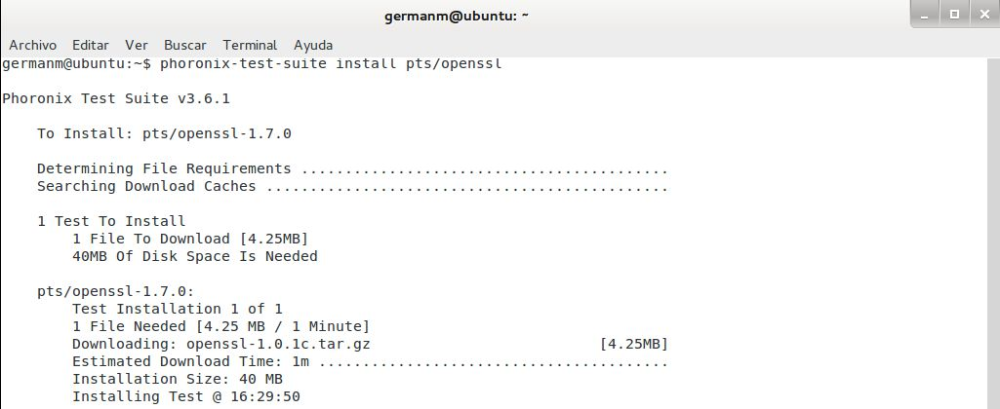

Finalmente, para ejecutar los benchmarks deberemos introducir la siguiente línea:

```
$ phoronix-test-suite benchmark nombreTest
```

Cada vez que realicemos un test, nos dará la opción de mostrar los resultados únicamente, guardarlos en el sistema y/o subirlos a la web de OpenBenchmarking.org para poder visualizarlos desde cualquier sistema.

Como la salida generada por la ejecución es bastante larga en la ejecución de algunos tests, la copiaré en vez de hacer capturas de pantalla.

El primer benchmark a ejecutar es realizar una compilación programa de un kernel Linux (Timed Linux Kernel Compilation, pts/build-linux-kernel):

```
germanm@ubuntu:~$ phoronix-test-suite benchmark pts/build-linux-kernel

Phoronix Test Suite v3.6.1

  Installed: pts/build-linux-kernel-1.3.0

System Information

Hardware:
Processor: Intel Core i5-2450M @ 2.49GHz (2 Cores), Motherboard: Intel 440BX, Chipset: Intel 440BX/ZX/DX, Memory: 1024MB, Disk: 21GB VMware
Virtual S, Graphics: VMware SVGA II, Audio: Ensoniq ES1371, Network: AMD 79c970

Software:
OS: Ubuntu 12.04, Kernel: 3.2.0-29-generic-pae (i686), Desktop: GNOME 3.2.1, Display Server: X Server 1.11.3, Display Driver: vesa 2.3.0, Compiler: GCC 4.6, File-System: ext4, Screen Resolution: 1024x768, System Layer: VMware

  Would you like to save these test results (Y/n): Y

  Enter a name to save these results under: compilacion_programada_kernel_linux
  Enter a unique name to describe this test run / configuration: prueba_1

If you wish, enter a new description below to better describe this result set / system configuration under test.
Press ENTER to proceed without changes.

Current Description: VMware testing on Ubuntu 12.04 via the Phoronix Test Suite.

New Description: Primera prueba de rendimiento del procesador durante una compilacion programada del kernel de Linux.

Estimated Run-Time: 27 Minutes

Timed Linux Kernel Compilation 3.1:
  pts/build-linux-kernel-1.3.0
  Test 1 of 1
  Estimated Trial Run Count: 3
  Estimated Time To Completion: 27 Minutes
    Running Pre-Test Script @ 14:19:07
    Started Run 1 @ 14:23:36
    Running Interim Test Script @ 14:30:45
    Started Run 2 @ 14:30:51
    Running Interim Test Script @ 14:36:22
    Started Run 3 @ 14:36:26
    Running Interim Test Script @ 14:41:57 [Std. Dev: 15.07%]
    Started Run 4 @ 14:42:01
    Running Interim Test Script @ 14:47:34 [Std. Dev: 13.23%]
    Started Run 5 @ 14:47:38
    Running Interim Test Script @ 14:53:08 [Std. Dev: 12.05%]
    Started Run 6 @ 14:53:12 [Std. Dev: 11.12%]
    Running Post-Test Script @ 14:58:42

  Test Results:
    425.48991417885
    331.00604701042
    330.78356218338
    332.95846509933
    330.06093096733
    330.52892780304

  Average: 346.80 Seconds

  Do you want to view the results in your web browser (y/N): y
  Would you like to upload these results to OpenBenchmarking.org (Y/n): Y
  Would you like to attach the system logs (lspci, dmesg, lsusb, etc) to the test result (Y/n): y

Results Uploaded To: http://openbenchmarking.org/result/1212023-AR-COMPILACI26
  Do you want to launch OpenBenchmarking.org (Y/n): Y
```

De este test hemos obtenido como resultados que como promedio, el tiempo de compilación del kernel Linux es de
346.80 segundos (5 minutos y 46.80 segundos), siendo el máximo tiempo 425.49 segundos (7 minutos y 5.49 segundos) y el mínimo 330.06 segundos (5 minutos y 30.06 segundos).

Los resultados estarán disponibles permanentemente en el enlace “[http://openbenchmarking.org/result/1212023-AR-COMPILACI26](http://openbenchmarking.org/result/1212023-AR-COMPILACI26)” y además los resultados han sido almacenados en el sistema, representando los datos antes mencionados en la siguiente tabla y gráfica:

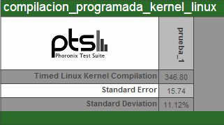

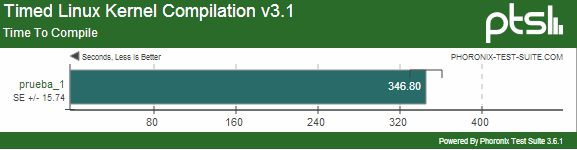
	
El siguiente benchmark a ejecutar es realizar codificación de audio utilizando el codificador LAME MP3 (LAME MP3 Encoding, pts/encode-mp3-1.4.0):

```
germanm@ubuntu:~$ phoronix-test-suite benchmark pts/encode-mp3-1.4.0

Phoronix Test Suite v3.6.1

  Installed: pts/timed-audio-encode-1.0.0
  Installed: pts/encode-mp3-1.4.0

System Information

Hardware:
Processor: Intel Core i5-2450M @ 2.49GHz (2 Cores), Motherboard: Intel 440BX, Chipset: Intel 440BX/ZX/DX, Memory: 1024MB, Disk: 21GB VMware
Virtual S, Graphics: VMware SVGA II, Audio: Ensoniq ES1371, Network: AMD 79c970

Software:
OS: Ubuntu 12.04, Kernel: 3.2.0-29-generic-pae (i686), Desktop: GNOME 3.2.1, Display Server: X Server 1.11.3, Display Driver: vesa 2.3.0, Compiler: CC 4.6, File-System: ext4, Screen Resolution: 1024x768, System Layer: VMware

  Would you like to save these test results (Y/n): Y

  Enter a name to save these results under: codificacion_mp3
  Enter a unique name to describe this test run / configuration: prueba1

If you wish, enter a new description below to better describe this result set / system configuration under test.
Press ENTER to proceed without changes.

Current Description: VMware testing on Ubuntu 12.04 via the Phoronix Test Suite.

New Description: Primera prueba de rendimiento del procesador codificando audio en formato MP3.

Estimated Run-Time: 3 Minutes

LAME MP3 Encoding 3.99.3:
  pts/encode-mp3-1.4.0
  Test 1 of 1
  Estimated Trial Run Count: 5
  Estimated Time To Completion: 3 Minutes
    Started Run 1 @ 15:57:26
    Started Run 2 @ 15:57:52
    Started Run 3 @ 15:58:15
    Started Run 4 @ 15:58:38
    Started Run 5 @ 15:59:01 [Std. Dev: 0.78%]

  Test Results:
    21.344193935394
    20.988651990891
    21.181079864502
    20.954982042313
    21.012395858765

  Average: 21.10 Seconds

  Do you want to view the results in your web browser (y/N): y
  Would you like to upload these results to OpenBenchmarking.org (Y/n): Y
  Would you like to attach the system logs (lspci, dmesg, lsusb, etc) to the test result (Y/n): Y

Results Uploaded To: http://openbenchmarking.org/result/1212029-AR-CODIFICAC57
  Do you want to launch OpenBenchmarking.org (Y/n): Y
```

De este nuevo test obtenemos como resultados que como promedio, el tiempo de codificación es de 21.10 segundos, siendo el máximo tiempo 21.34 segundos y el mínimo 20.95 segundos.

Al igual que para el test anterior, podremos ver los resultados desde la dirección Los resultados estarán disponibles permanentemente en el enlace “[http://openbenchmarking.org/result/1212029-AR-CODIFICAC57](http://openbenchmarking.org/result/1212029-AR-CODIFICAC57)”, quedando además los resultados almacenados en el sistema igualmente.

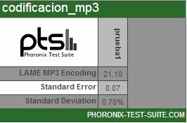


	
El último benchmark que vamos a ejecutar es sobre diferentes pruebas de rendimiento de la memoria del sistema (Stream,  pts/encode-mp3-1.4.0):

```
germanm@ubuntu:~$ phoronix-test-suite benchmark pts/stream

Phoronix Test Suite v3.6.1

  Installed: pts/stream-1.1.0

Stream Test Configuration

Type:

1: Copy
2: Scale
3: Add
4: Triad
5: Test All Options

Enter Your Choice: 5

System Information

Hardware:
Processor: Intel Core i5-2450M @ 2.49GHz (2 Cores), Motherboard: Intel 440BX, Chipset: Intel 440BX/ZX/DX, Memory: 1024MB, Disk: 21GB VMware
Virtual S, Graphics: VMware SVGA II, Audio: Ensoniq ES1371, Network: AMD 79c970

Software:
OS: Ubuntu 12.04, Kernel: 3.2.0-29-generic-pae (i686), Desktop: GNOME 3.2.1, Display Server: X Server 1.11.3, Display Driver: vesa 2.3.0, Compiler: GCC 4.6, File-System: ext4, Screen Resolution: 1024x768, System Layer: VMware

  Would you like to save these test results (Y/n): Y

  Enter a name to save these results under: test_stream
  Enter a unique name to describe this test run / configuration: prueba1

If you wish, enter a new description below to better describe this result set / system configuration under test.
Press ENTER to proceed without changes.

Current Description: VMware testing on Ubuntu 12.04 via the Phoronix Test Suite.

New Description: Primera prueba del rendimiento de la memoria del sistema durante la prueba de stream.

Estimated Run-Time: 8 Minutes

Stream 2009-04-11:
  pts/stream-1.1.0 [Type: Copy]
  Test 1 of 4
  Estimated Trial Run Count:  10
  Estimated Test Run-Time:    2 Minutes
  Estimated Time To Completion: 8 Minutes
    Started Run 1 @ 16:06:25
    Started Run 2 @ 16:06:37
    Started Run 3 @ 16:06:40
    Started Run 4 @ 16:06:43
    Started Run 5 @ 16:06:45
    Started Run 6 @ 16:06:47
    Started Run 7 @ 16:06:50
    Started Run 8 @ 16:06:52
    Started Run 9 @ 16:06:55
    Started Run 10 @ 16:06:57 [Std. Dev: 2.19%]

  Test Results:
    5828.725
    5843.7851
    5827.7422
    5865.1533
    5839.304
    5821.3159
    5520.9584
    5879.0205
    5784.6023
    5564.208

  Average: 5777.48 MB/s

Stream 2009-04-11:
  pts/stream-1.1.0 [Type: Scale] 
  Test 2 of 4
  Estimated Trial Run Count:  10 
  Estimated Test Run-Time:    2 Minutes
  Estimated Time To Completion: 6 Minutes 
    Started Run 1 @ 16:06:57
    Started Run 2 @ 16:06:57
    Started Run 3 @ 16:06:57
    Started Run 4 @ 16:06:57
    Started Run 5 @ 16:06:57
    Started Run 6 @ 16:06:57
    Started Run 7 @ 16:06:57
    Started Run 8 @ 16:06:57
    Started Run 9 @ 16:06:57
    Started Run 10 @ 16:06:57 [Std. Dev: 0.87%]

  Test Results: 
    5760.6091
    5637.8198
    5725.5552
    5773.1032
    5726.5443
    5698.1239
    5820.2972
    5754.3023
    5779.2796
    5757.5119

  Average: 5743.31 MB/s

Stream 2009-04-11:
  pts/stream-1.1.0 [Type: Add] 
  Test 3 of 4
  Estimated Trial Run Count:  10 
  Estimated Test Run-Time:    2 Minutes
  Estimated Time To Completion: 4 Minutes 
    Started Run 1 @ 16:06:57
    Started Run 2 @ 16:06:57
    Started Run 3 @ 16:06:57
    Started Run 4 @ 16:06:57
    Started Run 5 @ 16:06:57
    Started Run 6 @ 16:06:57
    Started Run 7 @ 16:06:57
    Started Run 8 @ 16:06:57
    Started Run 9 @ 16:06:57
    Started Run 10 @ 16:06:57 [Std. Dev: 0.84%]

  Test Results:
    6348.3167
    6462.1306
    6439.4345
    6403.4141
    6369.3906
    6381.2984
    6455.0035
    6475.0701
    6452.572
    6521.7235

Average: 6430.84 MB/s

Stream 2009-04-11:
  pts/stream-1.1.0 [Type: Triad]
  Test 4 of 4
  Estimated Trial Run Count:  10
  Estimated Time To Completion: 2 Minutes
    Started Run 1 @ 16:06:57
    Started Run 2 @ 16:06:57
    Started Run 3 @ 16:06:57
    Started Run 4 @ 16:06:57
    Started Run 5 @ 16:06:57
    Started Run 6 @ 16:06:57
    Started Run 7 @ 16:06:57
    Started Run 8 @ 16:06:57
    Started Run 9 @ 16:06:57
    Started Run 10 @ 16:06:57 [Std. Dev: 1.11%]

  Test Results:
    6482.974
    6429.202
    6417.1266
    6500.6042
    6354.2998
    6589.8578
    6448.9248
    6484.8291
    6378.7409
    6537.6419

  Average: 6462.42 MB/s

  Do you want to view the results in your web browser (y/N): y
  Would you like to upload these results to OpenBenchmarking.org (Y/n): Y
  Would you like to attach the system logs (lspci, dmesg, lsusb, etc) to the test result (Y/n): Y

Results Uploaded To: http://openbenchmarking.org/result/1212029-AR-TESTSTREA24
  Do you want to launch OpenBenchmarking.org (Y/n): Y
```

El último test se divide en varios subtests, los resultados para cada uno de ellos son:

* Copy: la tasa de transferencia promedia es de 5777.48 MB/s, la más alta ha sido 5879.02 MB/s y la más baja 5520.96 MB/s.
* Scale: la tasa de transferencia promedia es de 5743.31 MB/s, la más alta ha sido 5820.3 MB/s y la más baja 5637.82 MB/s.
* Add: la tasa de transferencia promedia es de 6430.84 MB/s, la más alta ha sido 6521.72 MB/s y la más baja 6348.32 MB/s.
* Triad: la tasa de transferencia promedia es de 6462.42 MB/s, la más alta ha sido 6589.86 MB/s y la más baja 6354.3 MB/s.

El enlace para ver los resultados en la web es “[http://openbenchmarking.org/result/1212029-AR-TESTSTREA24](http://openbenchmarking.org/result/1212029-AR-TESTSTREA24)”, siendo los resultados almacenados en el sistema los siguientes:

* Resultados de todas las pruebas de memoria:

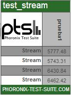

* Resultados de Copy:

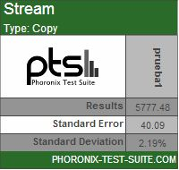

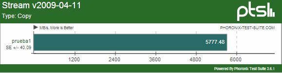

* Resultados de Scale:


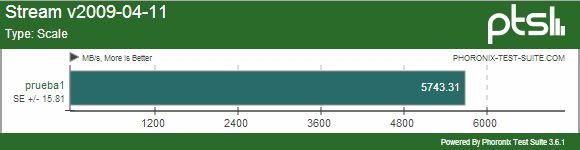

* Resultados de Add:

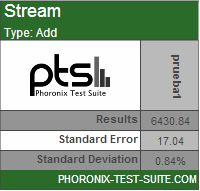

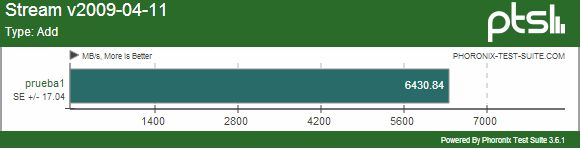

* Resultados de Triad:

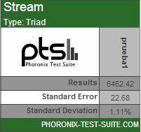


	

## 2.- BENCHMARKS POPULARES

## 2.2.- APACHE BENCHMARK

### Cuestión 3: De los parámetros que le podemos pasar al comando. ¿Qué significa -c 30? ¿Y -n 1000?

El parámetro “**-c**” indica la concurrencia, pasar como parámetro “**-c 30**”, indicará que vamos ejecutar concurrentemente 30 solicitudes a la vez. El parámetro “**-n**” indica el número de solicitudes, usar “**-n 1000**” significará que le vamos a hacer 1000 solicitudes al servidor.

### Cuestión 4: Ejecute ab contra a las tres máquinas virtuales una a una (arrancadas por separado) y muestre las estadísticas. ¿Cuál es la que proporciona mejores resultados?

Para hacer las pruebas a todos los servidores de las máquinas virtuales en igual de condiciones, ejecutaremos ab desde nuestro sistema operativo anfitrión, como en nuestro caso es Windows 7, vamos a descargarnos XAMPP, que ya contiene los ejecutable de Apache y podremos usarlos sin tener que hacer ninguna instalación, lo descargaremos desde “[http://www.apachefriends.org/download.php?xampp-portable-lite-win32-1.8.1-VC9.zip](http://www.apachefriends.org/download.php?xampp-portable-lite-win32-1.8.1-VC9.zip)” y podremos ejecutar directamente Apache Benchmark, que se encuentra dentro de la carpeta “**apache/bin**”.

Hechas las pruebas a los servidores de las 3 máquinas virtuales los resultados son los siguientes:

* Benchmark del Apache en CentOS.

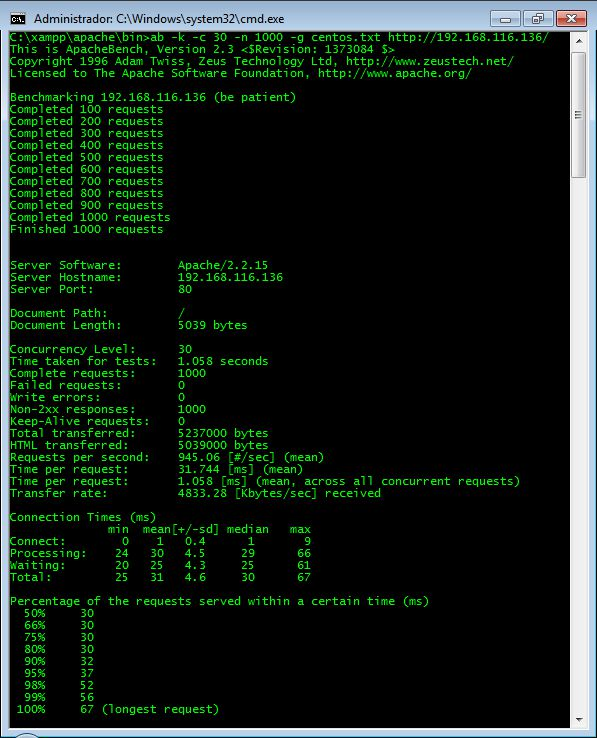

* Benchmark del Apache en Ubuntu Server.

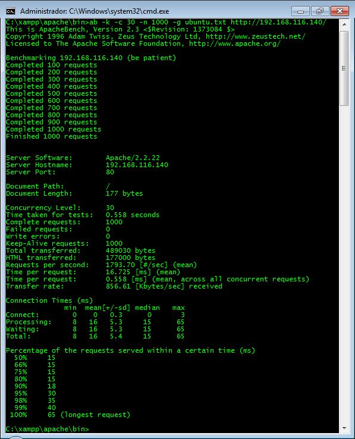

* Benchmark del IIS en Windows Server.


Para facilitar el saber que servidor tiene mejor rendimiento vamos a extraer los datos más significativos en una tabla:

|                | Tiempo total |  Promedio solicitudes |   Promedio tiempo   | Velocidad transferencia |
|:--------------:|:------------:|:---------------------:|:-------------------:|:-----------------------:|
|     CentOS     |    1.058 s   |  945.06 solicitudes/s | 31.744 ms/solicitud |       4833.28 KB/s      |
|  Ubuntu Server |    0.558 s   | 1793.70 solicitudes/s | 16.725 ms/solicitud |       856.61 KB/s       |
| Windows Server |    0.577 s   | 1793.50 solicitudes/s | 17.316 ms/solicitud |        1624 KB/s        |

Aunque la diferencia en este caso es insignificante, vemos que las pruebas tardan en ejecutarse casi la mitad en el servidor de Ubuntu Server y de Windows Server que de CentOS, siendo Ubuntu Server el que parece que da un mejor rendimiento a la hora de responder a un mayor número de solicitudes por segundo, aunque en este caso la diferencia entre Ubuntu Server y Windows Server es todavía más insignificante.

## 2.3.- SISOFTWARE SANDRA

### Cuestión  5:  Instale  la  aplicación  y  realice  varios  tests  a  la  máquina  virtual  cambiando  los parámetros (número de núcleos y RAM). Muestre capturas de pantalla.

Vamos a realizar una serie de pruebas al procesador y a la memoria desde la máquina virtual, todas las pruebas a realizar van a ser realizadas, primero con una configuración de 1 procesador con 2 cores y 1 GB de RAM y después, con 2 procesadores con 2 cores cada uno y 2 GB de RAM. Las pruebas a realizar van a ser:

* Rendimiento de caché y memoria:
 * Caché y memoria con 1 procesador con 2 cores y 1 GB de RAM. 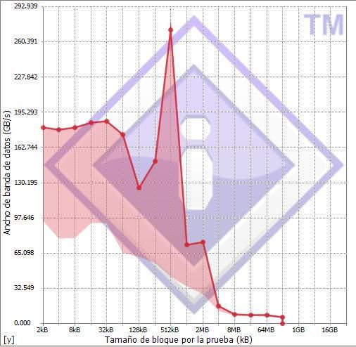
 * Caché y memoria con 2 procesadores con 2 cores y 2 GB de RAM. 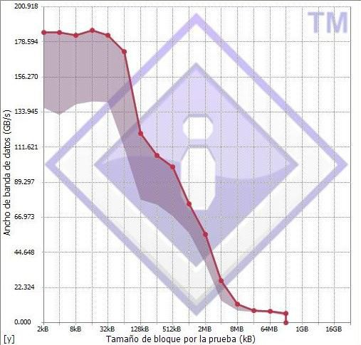
	
* Latencia de la memoria:
 * Latencia de la memoria con 1 procesador con 2 cores y 1 GB de RAM. 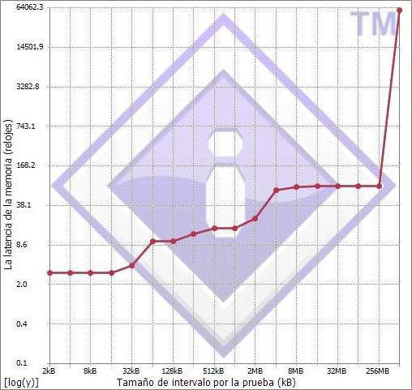
 * Latencia de la memoria con 2 procesadores con 2 cores y 2 GB de RAM. 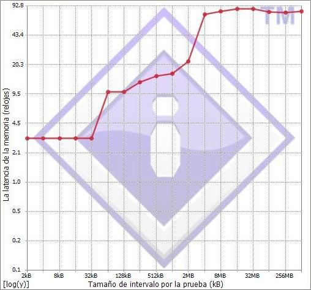

* Eficiencia del núcleo múltiple:
 * Eficiencia núcleo múltiple de 1 procesador con 2 cores y 1 GB de RAM. 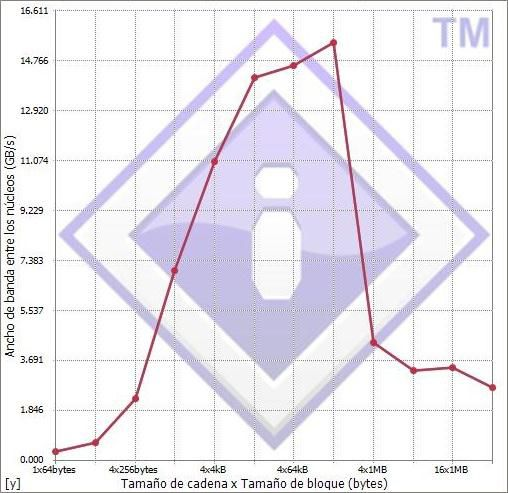
 * Eficiencia núcleo múltiple de 2 procesadores con 2 cores y 2 GB de RAM. 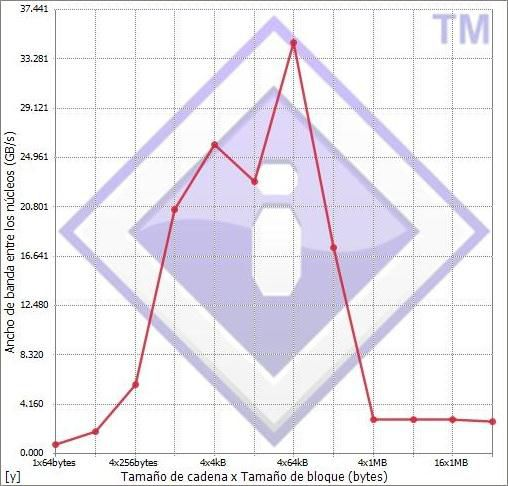
	
En los resultados se ve que salvo extraños picos, el rendimiento es mayor cuando los recursos de procesador y memoria son mayores.

## 2.4.- AIDA64 (ANTIGUO EVEREST)

### Cuestión 6: Instale la aplicación y realice varios tests a la máquina virtual cambiando los parámetros (número de núcleos y RAM). Muestre capturas de pantalla de las distintas ejecuciones y comente los resultados.

Al igual que hemos hecho en el apartado anterior, vamos a realizar una serie de pruebas a la memoria y el procesador, con los mismos parámetros de configuración de la máquina virtual, pero con otro software.

* Benchmark de cache y memoria:
 * Caché y memoria con 1 procesador con 2 cores y 1 GB de RAM. 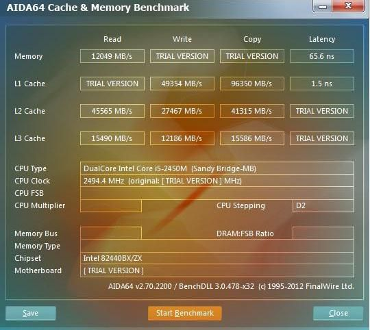
 * Caché y memoria con 2 procesadores con 2 cores y 2 GB de RAM. 

* Pruebas al procesador:

|       CPU       | 2x Core i5-2450M | 4x Core i5-2450M |
|:---------------:|:----------------:|:----------------:|
| Reloj de la CPU |     2500 MHz     |     2500 MHz     |
|     Chipset     |     i440BX/ZX    |     i440BX/ZX    |
|    CPU Queen    |       13604      |       19565      |
|  CPU PhotoWorxx |   4834 MPíxel/s  |   5167 MPíxel/s  |
|     CPU ZLib    |     76.6 MB/s    |    108.2 MB/s    |
|     CPU AES     |     3117 MB/s    |     3767 MB/s    |
|     CPU Hash    |     765 MB/s     |     888 MB/s     |
|     FPU VP8     |       2139       |       2669       |
|    FPU Julia    |       3271       |       3909       |
|    FPU Mandel   |       1720       |       2004       |
|   FPU SinJulia  |       1206       |       1876       |

Como en los resultados obtenidos en el apartado anterior, se ve claramente como en general, a mayor cantidad de recursos, mayor rendimiento.

## 3.- MÁS BENCHAMRKS O PROGRAME SU PROPIO BENCHMARK

### Cuestión  7  (alternativa  2):  Si  no  desea  implementar  el  benchmark,  utilice  como  mínimo  3 benchmarks descargados de:

[http://sourceforge.net/directory/system/benchmark/os:linux/freshness:recently-updated/](http://sourceforge.net/directory/system/benchmark/os:linux/freshness:recently-updated/)

### Y compare sus máquinas virtuales de Linux. Muestre capturas de pantalla con los resultados y escriba las conclusiones sobre qué sistema es mejor. Nota: mejor dependerá de las métricas proporcionadas por los benchmarks.

* Collectl ([http://sourceforge.net/projects/collectl/?source=directory](http://sourceforge.net/projects/collectl/?source=directory)) es una ligera aplicación para monitorizar el rendimiento del sistema con datos estadísticos de la CPU, disco duro, memoria, red o procesos entre otros:
 * Ejecución de Collectl en CentOS: 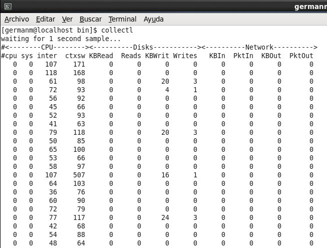
 * Ejecución de Collectl en Ubuntu Server: 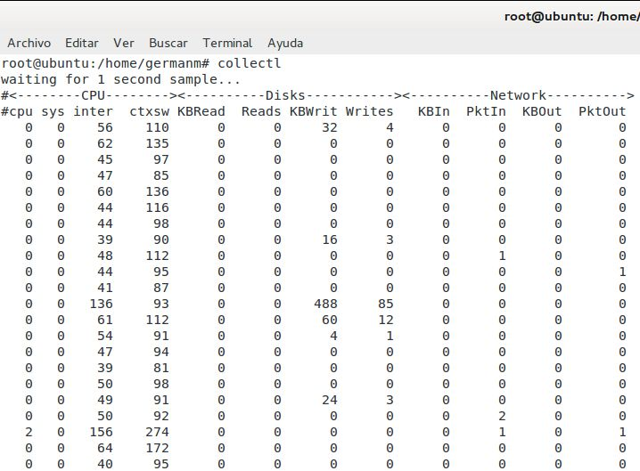
	
* Procbench ([http://sourceforge.net/projects/procbench.berlios/?source=directory](http://sourceforge.net/projects/procbench.berlios/?source=directory)) es un benchmark de CPU para medir el rendimiento del procesador mediante pruebas matemáticas
 * Ejecución de Procbecn en CentOS: 
 * Ejecución de Procbecn en Ubuntu Server: 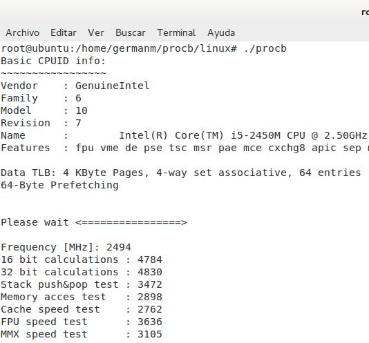
	
Viendo los resultados obtenidos por los benchmark realizados, en los apartados analizados ambos sistemas dan un rendimiento bastante similar, no destacando en gran medida ninguno de los 2 sobre el otro.


## Bibliografia: (consultado a día 9/12/2012)

* Enlace 1: “Phoronix Test Suite v4.0.1 (Suldal) User Manual”:
          [http://www.phoronix-test-suite.com/documentation/phoronix-test-suite.pdf](http://www.phoronix-test-suite.com/documentation/phoronix-test-suite.pdf)

* Enlace 2: “EPEL/es – FedoraProject”:
          [http://fedoraproject.org/wiki/EPEL/es](http://fedoraproject.org/wiki/EPEL/es)

* Enlace 3: “Benchmarking On Ubuntu Just Became Easier”, Michael Larabel, 17/02/2009:
          [http://www.phoronix.com/scan.php?page=news_item&px=NzA3Mg](http://www.phoronix.com/scan.php?page=news_item&px=NzA3Mg)

* Enlace 4: “Phoronix Test Suite Documentation”:
          [http://www.phoronix-test-suite.com/?k=documentation](http://www.phoronix-test-suite.com/?k=documentation)
