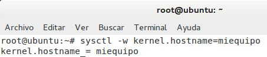
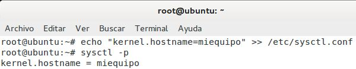
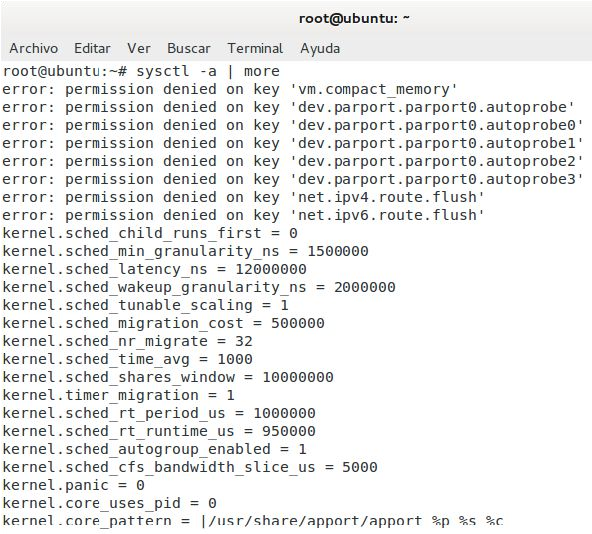
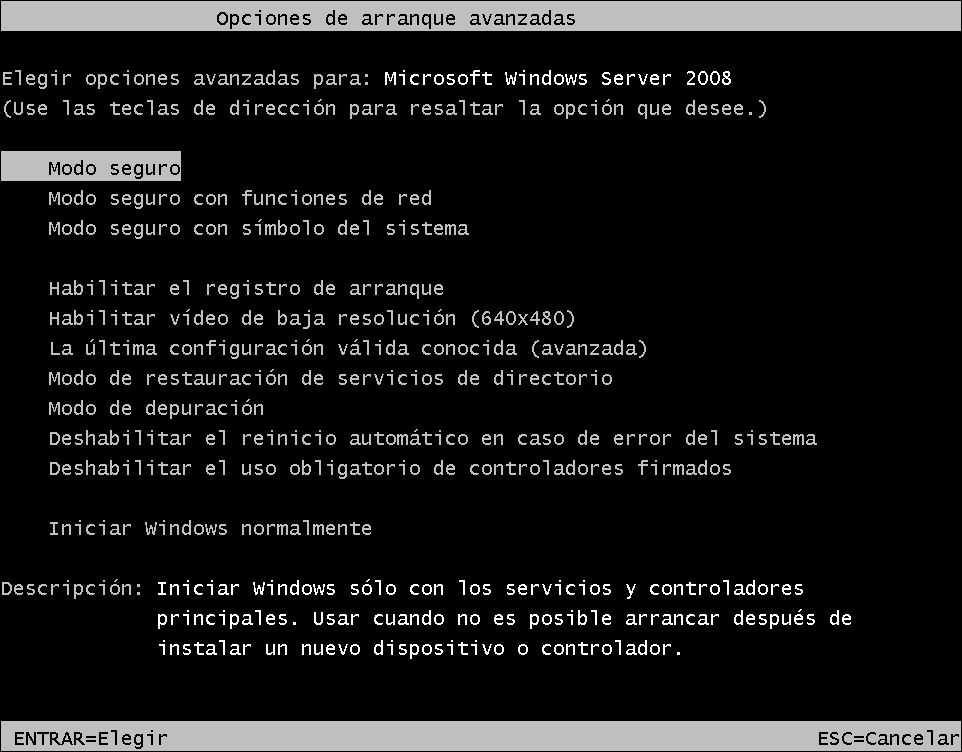
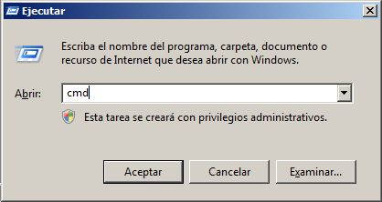
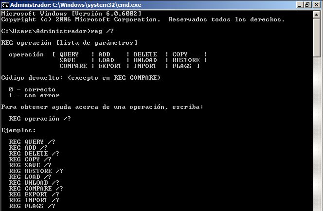
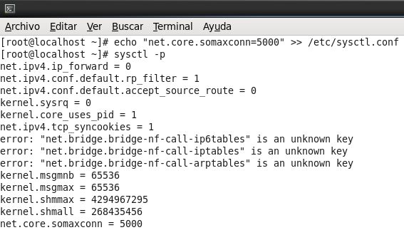
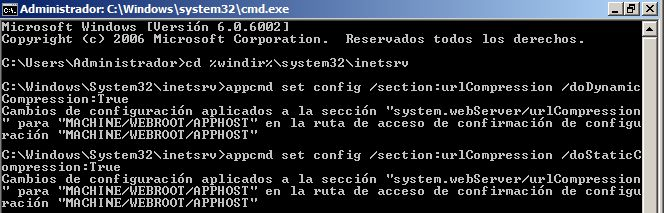
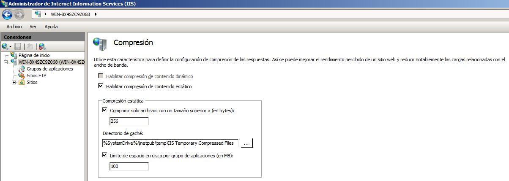
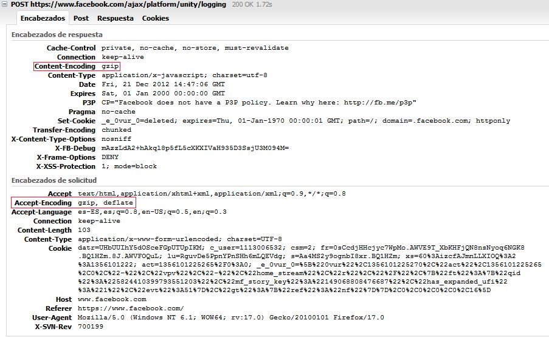

Ingeniería de Servidores
=========================================
3º Grado en Ingeniería Informática 2012/2013
--------------------------------------------

# Práctica 5: Sintonización del sistema
### Germán Martínez Maldonado

## 2.- PARÁMETROS DEL SISTEMA Y SU EDICIÓN

## 2.1.- SISTEMAS UNIX: SYSCTL Y /PROC

### Cuestión 1: Al modificar los valores del kernel de este modo, no logramos que persistan después de reiniciar la máquina. ¿Qué archivo hay que editar para que los cambios sean permanentes?

Para que los cambios sean permanentes el archivo que debemos editar es “**/etc/sysctl.conf**”.

Por ejemplo, el resultado de ejecutar `# sysctl -w kernel.hostname=miequipo` será cambiar el nombre del equipo, pero solo será válido hasta que se reinicie el sistema, sin embargo, si introducimos `# echo “kernel.hostname=miequipo” >> /etc/sysctl.conf`, estaremos haciendo el mismo cambio en el archivo “**/etc/sysctl.conf**”, haciendo que este cambio sea permanente.

### Cuestión 2:  ¿Con qué opción se muestran todos los parámetros modificables en tiempo de ejecución? Elija dos parámetros y expliqué, en dos líneas, qué función tienen.

Para mostrar todos los parámetros modificables en tiempo de ejecución deberemos introducir `# sysctl –a`. Entre los obtenidos, podemos encontrar:

* **kernel.pid_max**: nos permite modificar el máximo valor valido para un PID de proceso en ejecución.

* **vm.laptop_mode**: nos permite activar el “Laptop mode”, un modo de ahorro de energía pensado para ser utilizado en portátiles, haciendo que se desactiven opciones menos comunes.

## 2.2.- WINDOWS: EDICIÓN DEL REGISTRO

### Cuestión 3: ¿Qué tecla hay que pulsar para poder restaurar el registro? ¿Cuándo?

Para restaurar el registro, cuando arranquemos el sistema, una vez que haya pasado la pantalla de carga de la BIOS, pulsaremos la  tecla “**F8**” hasta que nos aparezca el menú “**Opciones de arranque avanzadas**”. Seleccionaremos “**La última configuración válida conocida (avanzada)**” y con esto haremos que se restablezcan los valores del registro al estado en el que estaban la última vez que se inició correctamente el sistema.

### Cuestión 4: ¿Cómo se abre una consola en Windows? ¿Qué comando hay que ejecutar para editar el registro?

Para abrir una consola en Windows deberemos acceder a la ventana “**Ejecutar**”, dicha ventana podemos abrirla desde **Menú Inicio -> Ejecutar** o utilizando la combinación de teclas “**Tecla Windows + R**”. Una vez en **Ejecutar**, debemos introducir “**cmd**” y se abrirá una consola.

Ahora para editar el registro debemos ejecutar el comando “**reg**”.

### Cuestión 5: Las cadenas de caracteres y valores numéricos tienen distintos tipos. Busque en la documentación de Microsoft y liste todos los tipos de valores.

Los distintos tipos de datos que podemos encontrar son:

* **Valor binario [REG_BINARY]**: datos binarios sin formato.
* **Valor DWORD [REG_DWORD]**: datos representados por un número de 4 bytes de longitud (un valor entero de 32 bits).
* **Valor alfanumérico expandible [REG_EXPAND_SZ]**: Cadena de datos de longitud variable.
* **Valor de cadena múltiple [REG_MULTI_SZ]**: Cadena múltiple.
* **Valor de cadena [REG_SZ]**: Cadena de texto de longitud fija.
* **Valor binario [REG_RESOURCE_REQUIREMENTS_LIST]**: Serie de matrices anidadas diseñara para almacenar una lista de recursos utilizados por el controlador de un dispositivo de hardware o uno de los dispositivos físicos que controla.
* **Valor binario [REG_FULL_RESOURCE_DESCRIPTOR]**: Serie de matrices anidadas diseñada para almacenar una lista de recursos utilizados por un dispositivo físico de hardware.
* **Ninguna [REG_NONE]**: Datos sin ningún tipo en particular.
* **Vínculo [REG_LINK]**: Cadena Unicode que da nombre a un vínculo simbólico.
* **Valor QWORD [REG_QWORD]**: Datos representados por un número entero de 64 bytes.

## 3.- MEJORA DE UN SERVICIO CONCRETO

## 3.1.- SERVIDOR WEB: APACHE E IIS

### Cuestión 6: Enumere qué elementos se pueden configurar en Apache y en IIS para que Moodle funcione mejor.

Los elementos configurables que podemos tener en cuenta para que Moodle funcione mejor son los siguientes:

* En un servidor **Apache**:
 * Ajustar el parámetro “**MaxClients**” en función de la memoria total disponible en nuestro equipo.
 * Cargar el mínimo número posible de módulos para reducir la memoria necesaria.
 * Utilizar la última versión de Apache porque reduce el uso de memoria.
 * Reducir a un mínimo valor de 20-30 el parámetro “**MaxRequestPerChild**”, para que la bifurcación de procesos no genere una mayor sobrecarga en vez de beneficio en el rendimiento.
 * Establecer el parámetro “**KeepAlive**” a Off o bajar el valor de “**KeepAliveTimeout**” a un valor de 2-5, evitando así sobrecarga del procesador en el inicio de proesos.
 * En  lugar  de  la  anterior,  podemos  crear  un  servidor  proxy  inverso  delante  del  servidor  de  Moodle  para almacenar en caché los archivos HTML con imágenes.
 * Si no utilizamos un archivo “**.htaccess**” establecer “**AllowOverride**” a None para no tener que buscar dichos archivos.
 * Establecer correctamente “**DirectoryIndex**” para evitar negociación de contenido indicando el archivo de índice que debe ser cargado.
 * Configurar “**ExtendedStatus**” a Off y desactivar “**mod_info**” y “**mod_status**” si no vamos a hacer trabajo de desarrollo en el servidor.
 * No cambiar “**HostnameLookups**” de Off para reducir la latencia de DNS.
 * Reducir “**TimeOut**” a 30-60 segundos.
 * En las directivas “**Options**”, evitar “**Options MultiViews**” para reducir el uso de entrada/salida en disco.

* En un servidor **ISS**:
 * Ajustar a 2-5 el valor de “**ListenBacklog**”.
 * Cambiar el “**MemCacheSize**” para ajustar la memoria que se usará como caché de archivos.
 * Cambiar “**MaxCachedFileSize**” para ajustar el tamaño máximo de un archivo en la caché de archivos.
 * Crear un valor DWORD llamado “**ObjectCacheTTL**” para cambiar la cantidad de tiempo (en milisegundos) que los objetos de la caché se mantienen en la memoria.

## 3.1.1.- Apache

### Cuestión 7: Intente resolver el problema en alguna de las distribuciones (pistas: net.core.somaxconn, ulimit). Describa como lo ha solucionado indicando los cambios y los ficheros de configuración afectados.

Podemos comprobar que para un alto número de concurrencia en las peticiones el servidor Apache devuelve un error en el socket, en nuestro caso hemos comprobado que este error aparece cuando la concurrencia indicada es superior o igual a 1021.

El problema está en que sobrepasamos  el límite de conexiones  por socket. Para solucionar este problema editaremos el archivo “**/etc/sysctl.con**”, modificando el parámetro “**net.core.somaxconn**” que es el que nos permite modificar el número máximo de conexiones socket. Podemos modificar el parámetro con la siguiente línea de comando: `# echo “net.core.somaxconn=5000” >> /etc/sysctl.conf`.

Para que lo que acabamos de hacer pueda funcionar, ahora debemos cambiar el número máximo de descriptores de archivo que puede abrir el servidor para que se puedan realizar todas las conexiones, esto lo haremos con `# echo “httpd soft nofile 5000” >> /etc/security/limits.conf` y `# echo “httpd hard nofile 5000” >> /etc/security/limits.conf`. Una vez realizados estos cambios y cargadas las nuevas configuraciones reiniciando, deberíamos haber solucionado el problema.

## 3.1.2.- IIS

### Cuestión 8: Ajuste la compresión en el servidor y analice su comportamiento usando varios valores para el tamaño a de archivo partir del cual comprimir. Para comprobar que está comprimiendo puede usar el navegador o comandos como curl (see url) o lynx.

Para ajustar la compresión en el servidor primero deberemos habilitar la compresión en el servidor, nos movemos hasta el directorio “**%windir%\system32\inetsrv**” y ejecutaremos `appcmd`, para habilitar la compresión de contenido dinámico ejecutamos `appcmd set config /section:urlCompression /doDynamicCompression:True` y para habilitar la compresión de contenido estático ejecutamos `appcmd set config /section:urlCompression /doStaticCompression:True`.

Para configura la compresión accedemos al “**Administrador de Internet Information Services (ISS)**” desde “**Inicio -> Todos los programas -> Herramientas administrativas**”. Una vez ahí, seleccionamos el servidor (**WIN-8X4SZC9Z068** es nuestro caso) y pulsamos “**Compresión**” para acceder a su ventana de configuración. Ahora marcamos la casilla “**Habilitar compresión de contenido estático**”, porque es la única que nos permite hacerlo, y rellenamos los campos inferiores.

Utilizando el complemento Firebug para Firefox, podemos ver el contenido de las cabeceras que se generan para la solicitud y la respuesta durante una comunicación entre un navegador y un servidor, como no he conseguido que funcione la compresión en el servidor IIS de mi propia máquina virtual, he hecho la prueba accediendo a la página de Facebook para poder ver cómo sería la respuesta de un servidor que acepta compresión. Vemos que la compresión es aceptada porque en el encabezado de respuesta aparece “**Content-Encoding gzip**” y en el encabezado de solicitud aparece “**Accept-Encoding gzip, deflate**”.

## Bibliografia: (consultado a día 21/12/2012)

* Enlace 1: “Sysctl: modificar parámetros del kernel << Mis notas de Linux”, Alexis, 22/07/2011:
          [http://misnotasdelinux.wordpress.com/2011/07/22/sysctl-modificar-parametros-del-kernel/](http://misnotasdelinux.wordpress.com/2011/07/22/sysctl-modificar-parametros-del-kernel/)

* Enlace 2: “Linux Increase Process Identifiers Limit with /proc/sys/kernel/pid_max”, Nixcraft, 3/11/2007:
          [http://www.cyberciti.biz/tips/howto-linux-increase-pid-limits.html](http://www.cyberciti.biz/tips/howto-linux-increase-pid-limits.html)

* Enlace 3: “Restore the Registry”, Microsoft, 2012:
          [http://technet.microsoft.com/en-us/library/cc772043.aspx](http://technet.microsoft.com/en-us/library/cc772043.aspx)

* Enlace 4: “Información del Registro de Windows para usuarios avanzados”, Microsoft, 2012:
          [http://support.microsoft.com/kb/256986/es](http://support.microsoft.com/kb/256986/es)

* Enlace 5: “Perfonmance recommendations – MoodleDocs”, 11/10/2012:
          [http://docs.moodle.org/23/en/Performance_recommendations](http://docs.moodle.org/23/en/Performance_recommendations)

* Enlace 6: “Iniciar Appcmd.exe (IIS 7)”, Microsoft, 2012:
          [http://technet.microsoft.com/es-es/library/cc730918(v=ws.10).aspx](http://technet.microsoft.com/es-es/library/cc730918(v=ws.10).aspx)

* Enlace 7: “Configurar la compresión (IIS 7)”, Microsoft, 2012:
          [http://technet.microsoft.com/es-es/library/cc730629%28v=ws.10%29.aspx](http://technet.microsoft.com/es-es/library/cc730629%28v=ws.10%29.aspx)
