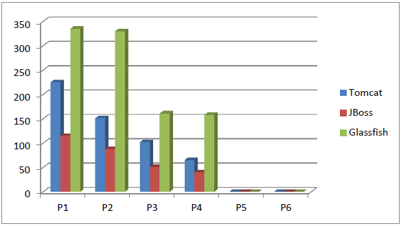
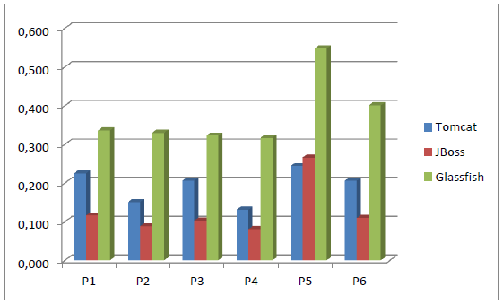
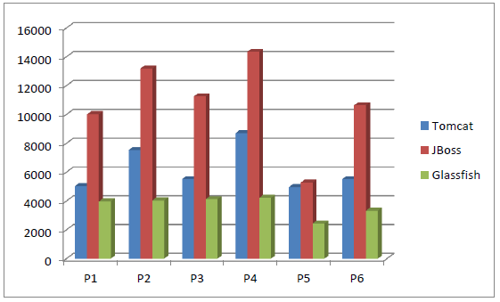

Ingeniería de Servidores
=========================================
3º Grado en Ingeniería Informática 2012/2013
--------------------------------------------

# Análisis comparativo Tomcat, JBoss y GlassFish
### Jesús Gómez Obregón
### Germán Martínez Maldonado

## ÍNDICE DE CONTENIDOS

1. [Especificación de objetivos](README.md#1-especificaci%C3%93n-de-objetivos)
2. [Características generales de Tomcat, JBoss y GlassFish](README.md#2-caracter%C3%8Dsticas-generales-de-tomcat-jboss-y-glassfish)
3. [Métricas y parámetros que afectan a las prestaciones](README.md#3-metricas-y-par%C3%81metros-que-afectan-al-rendimiento)
4. [Técnicas de evaluación, carga de trabajo y diseño de experimentos](README.md#4-t%C3%89cnicas-de-evaluaci%C3%93n-carga-de-trabajo-y-dise%C3%91o-de-experimentos)
5. [Presentación de resultados](README.md#5-presentaci%C3%93n-de-resultados)
6. [Análisis e interpretación de resultados](README.md#6-an%C3%81lisis-e-interpretaci%C3%93n-de-resultados)
7. [Conclusiones](README.md#7-conclusiones)
8. [Bibliografía](README.md#8-bibliograf%C3%8Da)

## ANEXOS

1. [Instalación de Tomcat, JBoss y GlassFish](anexo_01.md)
2. [Ejecuciones ApacheBench](anexo_02.md)
3. [Presentación](presentacion.md)

## 1. ESPECIFICACIÓN DE OBJETIVOS

La principal finalidad es realizar un análisis comparativo del contenedor de aplicaciones **Tomcat** y los servidores de aplicaciones **JBoss** y **GlassFish**.

Para ello trataremos de satisfacer los siguientes objetivos:

* Breve explicación de **Tomcat, JBoss y GlassFish**, comparando sus características para poder tener una visión general de los 3 servidores con el fin de conocerlos mejor y poder hacer un análisis más efectivo.

* Instalación y realización del análisis comparativo del rendimiento de los tres servidores de aplicaciones, especificando las métricas usadas y los parámetros que pueden afectar al sistema.

* Realización de benchmarking (herramienta ApacheBench) contra los tres servidores de aplicaciones para poder obtener medidas con el fin de realizar un análisis lo más neutral posible.

* Presentación de los resultados obtenidos.

* Análisis e interpretación de los resultados con el objetivo de poder sacar conclusiones acertadas.

## 2. CARACTERÍSTICAS GENERALES DE TOMCAT, JBOSS Y GLASSFISH

**Tomcat** es un servidor web, desarrollado bajo el proyecto Jakarta en la Apache Software Foundation, con soporte de servlets y JSPs (JavaServer Pages), pero no es un servidor de aplicaciones, por tanto, habría que incluirle módulos adicionales para ampliar sus posibilidades. Se usa como servidor web autónomo en entornos con alto nivel de tráfico y alta disponibilidad.

Incluye el compilador Jasper, que nos permite compilar archivos JSPs convirtiéndolos en servlets. El motor de servlets de Tomcat suele encontrarse combinado con el servidor web Apache. Tomcat puede funcionar como servidor web por sí mismo. Funciona en cualquier sistema operativo que disponga de la máquina virtual Java.

**JBoss** es un servidor de aplicaciones J2EE de código abierto implementado en Java. Ofrece una plataforma de alto rendimiento para aplicaciones de e-business. Sus características principales son:

* Es distribuido bajo licencia de código abierto GPL/LGPL.
* Proporciona un nivel de confianza suficiente para ser utilizado en entornos empresariales.
* Es un servicio incrustable, por ello está orientado a la arquitectura en servicios.
* Servicio del middleware para objetos Java.
* Soporte completo para JMX (Java Management eXtensions).

**GlassFish** es un servidor de aplicaciones de código abierto que implementa funcionalidades de Java EE. Es gratuito y de código abierto, desarrollado por Sun Microsystems. Tiene como base al servidor Sun Java Application Server de Oracle Corporation, un derivado de Apache Tomcat.

Tanto **JBoss** como **GlassFish** son servidores de aplicación Java EE. Java EE provee estándares que permiten a un servidor de aplicaciones servir como contenedor de los componentes que conforman dichas aplicaciones. Entre los componentes podemos encontrar:

* Servlets.
* JavaServer Pages (JSP).
* JavaServer Faces (JSF).
* Enterprise JavaBeans (EJBs).
* Java API for Web Services (JAX-WS).

Estos componentes permiten implementar diferentes capas de la aplicación, como la interfaz de usuario, la lógica de negocio, la gestión de sesiones, etc.

Para observar mejor las diferencias entre los 3 servidores, vamos comparar tres versiones específicas de cada uno de ellos, viendo que componentes integran.

|                   Característica                  |  Tomcat 6  |  JBoss 4.2 | GlassFish 2 |
|:-------------------------------------------------:|:----------:|:----------:|:-----------:|
| Cumplimiento de las especificaciones de Java EE 5 |     NO     |   PARCIAL  |      SI     |
| Uso de EJB 3.0                                    | DISPONIBLE |     SI     |      SI     |
| Uso de JSP 2.1 y 2.5                              |     SI     |     SI     |      SI     |
| Soporte de JavaServer Faces 1.2                   | DISPONIBLE |     SI     |      SI     |
| Soporte para plug-in personalizados               |     NO     |     SI     |      SI     |
| Soporte para manejar reglas de negocio            | DISPONIBLE | DISPONIBLE |  DISPONIBLE |
| Soporte para Hibernate 3.x                        | DISPONIBLE |     SI     |      SI     |
| Soporte para JBoss Seam                           | DISPONIBLE |     SI     |      SI     |
| Soporte de clustering                             |   PARCIAL  |     SI     |      SI     |
| Soporte para conector Eclipse IDE                 |     SI     |     SI     |      SI     |

## 3. METRICAS Y PARÁMETROS QUE AFECTAN AL RENDIMIENTO

A la hora de comparar las prestaciones de los tres servidores de aplicaciones hay que tener en cuenta los siguientes criterios:

* Tanto el hardware como el software sobre el que se realizará el benchmark contra los 3 servidores de aplicaciones siempre será el mismo. El objetivo es medir las prestaciones de los tres servidores de aplicaciones bajo las mismas condiciones lo que nos aportará un análisis neutro.

* Se aplicará la herramienta ApacheBench contra los tres servidores de aplicaciones bajo las mismas condiciones.

* Los parámetros que afectarán al rendimiento de los tres servidores serán los parámetros usados en la herramienta. Estos son, el número de peticiones que se realizan al servidor y el nivel de concurrencia con el que se realizan las peticiones.

* Los valores de estos parámetros irán cambiando de igual manera para cada servidor de aplicaciones, modificándose la carga de trabajo que tienen que soportar dichos servidores.

El hardware y el software del sistema serán los siguientes:

**Hardware**:
* **Procesador**: Intel Core i5-2450M @ 2.49GHz (1 Core)
* **Placa base**: Intel 440BX
* **Chipset**: Intel 440BX/ZX/DX
* **Memoria**: 1 x 1024 MB DRAM
* **Disco**: 21GB VMware Virtual S
* **Gráficos**: VMware SVGA II
* **Audio**: Ensoniq ES1371
* **Red**: AMD 79c970

**Software**:
* **Sistema Operativo**: CentOS 6.3 (Final)
* **Kernel**: 2.6.32-279.19.1.el6.i686 (i686)
* **Escritorio**: GNOME 2.28.2
* **Display Server**: X Server 1.10.6
* **Display Driver**: vmware 11.0.3
* **OpenGL**: 2.1 Mesa 7.11
* **Compilador**: GCC 4.4.6 20120305
* **Sistema de archivos**: ext4
* **Resolución de pantalla**: 1024x768
* **Sistema de capas**: VMware

## 4. TÉCNICAS DE EVALUACIÓN, CARGA DE TRABAJO Y DISEÑO DE EXPERIMENTOS

Para la evaluación del rendimiento de los diferentes programas vamos a realizar benchmark hacia los programas en funcionamiento para poder obtener una evaluación sobre cómo se comportan bajo diferentes cargas de trabajo. El programa con el que vamos hacer las pruebas es el ApacheBench.

ApacheBench es un programa en línea de comandos que nos va a permitir realizar pruebas de rendimiento a cualquier servidor desde línea de comandos con una gran sencillez. Para nuestros tests haremos pruebas realizando diferentes números de conexiones con el servidor (1.000.000,
500.1 y 1.000) y con diferentes valores de concurrencia (500 y 10).

Los experimentos consistirán en realizar a cada uno de los servidores que proveen las aplicaciones pruebas con diferentes niveles de carga para comprobar su comportamiento y su repercusión antes diferentes pruebas de estrés. Estos test consistirán en que cada servidor pasará 6 pruebas, dos con cada número de conexiones especificados anteriormente, cada una de ellas con cada valor de concurrencia.

Las variables respuestas a tener en cuenta para el estudio serán:

* Tiempo de ejecución.
* Solicitudes por segundo.
* Tiempo por solicitud concurrente.
* Velocidad de transferencia.

Los factores para el experime5to serán, como hemos dicho, cada uno de los programas contenedores o servidores de aplicaciones, teniendo los niveles: **Tomcat, JBoss y Glassfish**.

Una vez realizadas todas estas pruebas, los resultados obtenidos se analizarán e interpretarán.

## 5. PRESENTACIÓN DE RESULTADOS

Las 6 pruebas a realizar se describen a continuación:

* **P1**: 1000000 solicitudes, nivel de concurrencia 500
* **P2**: 1000000 solicitudes, nivel de concurrencia 10
* **P3**: 500000 solicitudes, nivel de concurrencia 500
* **P4**: 500000 solicitudes, nivel de concurrencia 10
* **P5**: 1000 solicitudes, nivel de concurrencia 500
* **P6**: 1000 solicitudes, nivel de concurrencia 10

### 5.1 Tiempo de ejecución

| Tiempo de ejecución (segundos) |  Tomcat |        Tomcat       |  JBoss  |        JBoss        | GlassFish |      GlassFish      |
|:------------------------------:|:-------:|:-------------------:|:-------:|:-------------------:|:---------:|:-------------------:|
|                                |  Tiempo | Desviación estándar |  Tiempo | Desviación estándar |   Tiempo  | Desviación estándar |
|               P1               | 225.011 |        342.2        | 115.931 |         17.1        |  335.939  |         14.3        |
|               P2               | 151.135 |         5.5         |  88.110 |         0.9         |  330.465  |         2.8         |
|               P3               | 102.917 |        341.3        |  51.611 |         14.0        |  161.642  |         16.1        |
|               P4               |  65.447 |         1.5         |  40.466 |         0.5         |  158.422  |         2.8         |
|               P5               |  0.244  |         40.3        |  0.266  |         41.9        |   0.548   |         38.3        |
|               P6               |  0.206  |         1.4         |  0.110  |         1.3         |   0.401   |         3.5         |

### 5.2 Solicitudes por segundo

| Solicitudes/segundo |  Tomcat |   JBoss  | GlassFish |
|:-------------------:|:-------:|:--------:|:---------:|
|          P1         | 4444.23 |  8625.80 |  2976.73  |
|          P2         | 6616.60 | 11349.46 |  3026.04  |
|          P3         | 4858.30 |  9687.81 |  3093.26  |
|          P4         | 7639.75 | 12355.96 |  3156.14  |
|          P5         | 4092.34 |  3759.38 |  1826.07  |
|          P6         | 4849.52 |  9129.50 |  2491.40  |

### 5.3 Tiempo por solicitud concurrente

| Tiempo por solicitud concurrente (ms) | Tomcat | JBoss | GlassFish |
|:-------------------------------------:|:------:|:-----:|:---------:|
|                   P1                  |  0.225 | 0.116 |   0.336   |
|                   P2                  |  0.151 | 0.088 |   0.330   |
|                   P3                  |  0.206 | 0.103 |   0.323   |
|                   P4                  |  0.131 | 0.081 |   0.317   |
|                   P5                  |  0.244 | 0.266 |   0.548   |
|                   P6                  |  0.206 | 0.110 |   0.401   |

### 5.4 Velocidad de transferencia

| Velocidad de transferencia (KB/s) |  Tomcat |   JBoss  | GlassFish |
|:---------------------------------:|:-------:|:--------:|:---------:|
|                 P1                | 5050.96 | 10025.12 |  3979.58  |
|                 P2                | 7540.34 | 13189.34 |  4045.49  |
|                 P3                | 5523.20 | 11264.67 |  4135.38  |
|                 P4                | 8706.36 | 14359.04 |  4219.42  |
|                 P5                | 4966.96 |  5290.64 |  2441.30  |
|                 P6                | 5526.51 | 10651.92 |  3330.79  |

## 6. ANÁLISIS E INTERPRETACIÓN DE RESULTADOS

**Tiempo de ejecución**

* El más rápido es **JBoss** con 296.494 segundos en ejecutar todas las pruebas.
* **JBoss** es 1.84% más rápido que **Tomcat** (544.960s).
* **JBoss** es 3.33% más rápido que **GlassFish** (987.417s).
* **Tomcat** a su vez, es 1.81% más rápido que **GlassFish**.

**Solicitudes por segundo**

* El que promedia un mayor número es **JBoss** con 9151.318 solicitudes/segundo.
* Seguido de **Tomcat** con 5416.790 solicitudes/segundo.
* Finalmente, el que promedia menor número es **GlassFish** con 2761,607 solicitudes/segundo.

**Tiempo por solicitud concurrente**

* El que obtiene menos tiempo es **JBoss** con 0.127 ms/solicitud.
* Seguido de **Tomcat** con 0.194 ms/solicitud.
* El que promedia menos tiempo es **GlassFish** con 0.376 ms/solicitud.

**Velocidad de transferencia**

* El que obtiene una mayor velocidad es JBoss con 10796.788 KB/s.
* Le sigue Tomcat con una velocidad de 6219.055 KB/s.
* El que promedia una velocidad menor es GlassFish con 3691.933 KB/s.

## 7. CONCLUSIONES

A la vista de todos estos resultados, podríamos decir que bajo las circunstancias de funcionamiento descrito, y sin haberle realizado ninguna configuración específica a ninguno de los sistemas, **el servidor de aplicaciones que nos ha dado un mayor rendimiento es JBoss**.

Esto lo decimos porque los resultados coinciden tanto a nivel individual como a nivel general, pero con los altos valores de desviación obtenidos en las pruebas con gran nivel de concurrencia, puede significar que los resultados obtenidos en las pruebas con menos concurrencia son mucho más significativas, aunque como hemos dicho, en este caso en particular coinciden.

## 8. BIBLIOGRAFÍA

* Enlace 1: “Apache Tomcat 7 (7.0.34) – Introduction”, Apache Software Foundation, 2012:
          [http://tomcat.apache.org/tomcat-7.0-doc/introduction.html](http://tomcat.apache.org/tomcat-7.0-doc/introduction.html)

* Enlace 2: “Tomcat – Wikipedia, la enciclopedia libre”, última modificación 08:47 29/10/2012:
          [http://es.wikipedia.org/wiki/Tomcat](http://es.wikipedia.org/wiki/Tomcat)

* Enlace 3: “Features“, JBoss Community team, 2012:
          [http://www.jboss.org/developer/features.html](http://www.jboss.org/developer/features.html)

* Enlace 4: “JBoss – Wikipedia, la enciclopedia libre”, última modificación 12:29 22/11/2012:
          [http://es.wikipedia.org/wiki/JBoss](http://es.wikipedia.org/wiki/JBoss)

* Enlace 5: “Usuarios y desarrolladores de aplicaciones de Glassfish – Java.net“, 2013:
          [http://glassfish.java.net/es/public/getstarted.html](http://glassfish.java.net/es/public/getstarted.html)

* Enlace 6: “Glassfish – Wikipedia, la enciclopedia libre”, última modificación 10:45 21/11/2012:
          [http://es.wikipedia.org/wiki/GlassFish](http://es.wikipedia.org/wiki/GlassFish)

* Enlace 7: “java - What is difference between Tomcat and JBoss and Glassfish? – Stack Overflow”, Septiembre 2010:
          [http://stackoverflow.com/questions/3821640/what-is-difference-between-tomcat-and-jboss-and-glassfish](http://stackoverflow.com/questions/3821640/what-is-difference-between-tomcat-and-jboss-and-glassfish)

* Enlace 8: “Kazuyalandia: Instalación de Oracle JDK 1.7 en CentOS 6.2”, Eddy Barales, 10/01/2012:
          [http://programandoenlausac.blogspot.com.es/2012/01/instalacion-jdk-en-centos-62.html](http://programandoenlausac.blogspot.com.es/2012/01/instalacion-jdk-en-centos-62.html)

* Enlace 9: “Java Servlet – Wikipedia, la enciclopedia libre”, última modificación 11:30 25/10/2012:
          [http://es.wikipedia.org/wiki/Java_Servlet](http://es.wikipedia.org/wiki/Java_Servlet)

* Enlace 10: “Kazuyalandia: Instalación de Tomcat 7 en CentOS 6.2”, Eddy Barales, 11/02/2012:
          [http://programandoenlausac.blogspot.com.es/2012/02/instalacion-de-tomcat-6-en-centos-62.html](http://programandoenlausac.blogspot.com.es/2012/02/instalacion-de-tomcat-6-en-centos-62.html)

* Enlace 11: “Kazuyalandia: Instalación de JBoss 7.1 en CentOS 6.2”, Eddy Barales, 05/06/2012:
          [http://programandoenlausac.blogspot.com.es/2012/06/instalacion-de-jboss-71-en-centos-62.html](http://programandoenlausac.blogspot.com.es/2012/06/instalacion-de-jboss-71-en-centos-62.html)

* Enlace 12: “Kazuyalandia: Instalación de Glassfish 3.1.2 en CentOS 6.2”, Eddy Barales, 10/01/2012:
          [http://programandoenlausac.blogspot.com.es/2012/01/instalacion-glassfish-31-en-centos-62.html](http://programandoenlausac.blogspot.com.es/2012/01/instalacion-glassfish-31-en-centos-62.html)

* Enlace 13: “How to Install Apache Tomcat 7 and Get Start with Java Servlet Programming“, Octubre 2012:
          [http://www3.ntu.edu.sg/home/ehchua/programming/howto/tomcat_howto.html](http://www3.ntu.edu.sg/home/ehchua/programming/howto/tomcat_howto.html)

* Enlace 14: “myServlet WAR“, Wayne Pollock, última modificación 18:00:37 01/05/2013:
          [http://content.hccfl.edu/pollock/ajava/war/myservletwar.htm](http://content.hccfl.edu/pollock/ajava/war/myservletwar.htm)
