Ingeniería de Servidores
=========================================
3º Grado en Ingeniería Informática 2012/2013
--------------------------------------------


# Instalación de Tomcat, JBoss y GlassFish
### Jesús Gómez Obregón
### Germán Martínez Maldonado


## ÍNDICE DE CONTENIDOS

1. Instalación de Java Development Kit (JDK)
2. Creación de un servlet
3. Instalación de Tomcat
4. Instalación de un servlet en Tomcat
5. Instalación de JBoss
6. Instalación de un servlet en JBoss
7. Instalación de GlassFish
8. Instalación de un servlet en GlassFish
9. Bibliografía


## 1. INSTALACIÓN DE JAVA DEVELOPMENT KIT (JDK)

Como todos los servlets están programados en Java, lo primero que deberemos hacer es instalar el JDK para que los programas de los servlets puedan ser compilados.

Lo primero que deberemos hacer es descargar el archivo de instalación de la página de Oracle ([http://download.oracle.com/otn-pub/java/jdk/7u10-b18/jdk-7u10-linux-i586.tar.gz](http://download.oracle.com/otn-pub/java/jdk/7u10-b18/jdk-7u10-linux-i586.tar.gz)). Una vez descargados nos movemos al directorio en el que lo hemos descargado, descomprimimos el paquete descargado, creamos el directorio en que vamos a instalar el JDK y movemos el contenido descomprimido a dicha carpeta:

```
tar -xvzf jdk-7u10-linux-i586.tar.gz
mkdir /usr/java
mv jdk1.7.0_10/ /usr/java/
```

Ahora editamos el archivo el fichero de configuración “/etc/profile” para que el sistema conozca como ejecutar el JDK. Las líneas a introducir son:

```
JAVA_HOME=/usr/java/jdk1.7.0_10; export JAVA_HOME
PATH=$JAVA_HOME/bin:$PATH; export PATH
```

Finalmente, cargamos la nueva configuración hecha y comprobamos que java funciona correctamente en nuesto sistema:

```
source /etc/profile
```

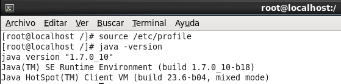


## 2. CREACIÓN DE UN SERVLET

Los servlets son pequeños programas escritos en Java que se ejecutan en el contexto de un navegador web. Como uno de los objetivos del análisis comparativo de Tomcat, Jboss y Glassfish es realizar una medición que nos pueda ayudar a cualquier de los 3 programas da un mayor rendimiento en principio, vamos a crear un servlet para poder usarlo en las pruebas.

Como hemos dicho, los servlets suelen ser pequeños programas, en este caso haremos que realice una simple función como es mostrar un par de mensajes por pantalla, porque queremos sobretodo conocer cuál de los programas es que el responderá mejor ante un número elevado de peticiones. Para que un servlet pueda funcionar como tal, la clase del programa debe extender a la clase “HttpServlet” e implementar el método “doGet”, que será el encargado de gestionar las solicitudes y las respuestas. El código del servlet sería el siguiente:

```
import java.io.IOException;
import java.io.PrintWriter;
import javax.servlet.ServletException;
import javax.servlet.http.HttpServlet;
import javax.servlet.http.HttpServletRequest;
import javax.servlet.http.HttpServletResponse;

public class Prueba extends HttpServlet {

  /**
   * Servlet de prueba
   * @param request
   * @param response
   * @throws ServletException
   * @throws IOException
   */
  @Override
  public void doGet(HttpServletRequest request, HttpServletResponse response) throws ServletException, IOException {
    PrintWriter out = response.getWriter();
    out.println("<!DOCTYPE HTML PUBLIC \"-//W3C//DTD HTML 4.0 Transitional//EN\">");
    out.println("<html>");
    out.println("<head><title>Hola Mundo</title></head>");
    out.println("<body>");
    out.println("<h1>¡Hola Mundo!</h1>");
    out.println("<h2>Ingeniería de Servidores</h2>");
    out.println("<h3>3o Grado Ingeniería Informática</h3>");
    out.println("<h4>Jesús Gómez Obregón</h4>");
    out.println("<h4>Germán Martínez Maldonado</h4>");
    out.println("</body></html>");
  }
}
```

Como para llamar a los métodos necesarios para implementar el servlet, son necesarias las clases “javax.servlet.*”, que no se encuentran entre las librerías estándar del JDK instalado, cuando vayamos a compilar el servlet deberemos indicar donde se encuentran dichas librerías. Tanto Tomcat, como JBoss como Glassfish nos proporcionan está librería, así que podríamos usar cualquier de las tres simplemente pasándole el compilador su ruta:

```
javac -cp /usr/tomcat/tomcat7/lib/servlet-api.jar Prueba.java
javac -cp /usr/jboss/jboss7/bundles/javax/servlet/api/v25/jbosgi-http-api-1.0.5.jar Prueba.java
javac -cp /usr/glassfish/glassfish3/glassfish/lib/javaee.jar Prueba.java
```

Además del servlet creado, todo servlet debe estar asociado a un archivo con el que se responderá cuando un usuario realice una petición de la dirección del servlet, este es el archivo “web.xml”. Dentro de la etiqueta <servlet> indicaremos el nombre de la clase y el archivo del ejecutable del servlet, dentro de la etiqueta <servlet-mapping” indicaremos la dirección desde la que se responderá con el servlet. Para el servlet anterior el archivo “web.xml” asociado tendría el siguiente contenido:

```
<?xml version="1.0" encoding="ISO-8859-1"?>
<web-app version="3.0"
  xmlns="http://java.sun.com/xml/ns/javaee"
  xmlns:xsi="http://www.w3.org/2001/XMLSchema-instance"
  xsi:schemaLocation="http://java.sun.com/xml/ns/javaee
  http://java.sun.com/xml/ns/javaee/web-app_3_0.xsd">

  <servlet>
    <servlet-name>Prueba</servlet-name>
    <servlet-class>Prueba</servlet-class>
  </servlet>

  <servlet-mapping>
    <servlet-name>Prueba</servlet-name>
    <url-pattern>/prueba</url-pattern>
  </servlet-mapping>
</web-app>
```

Esto haría que cuando se introdujera en el navegador la dirección ([http://localhost:8080/prueba/prueba](http://localhost:8080/prueba/prueba)) se respondiera con el servlet. Ahora deberemos crear el archivo “.war” que será el que despleguemos desde los programas para instalar la aplicación. Lo primero que deberemos hacer para esto, es crear una estructura de carpetas como la siguiente, no importa donde la creemos inicialmente:

```
mkdir -p prueba /WEB-INF/classes
```

Copiamos en la carpeta “prueba /WEB-INF/classes” el archivo compilado “.class”  del servlet que creamos antes y compilamos indicando la biblioteca necesaria. También copiamos el archivo “web.xml”en “prueba/ WEB-INF”. Ahora con todos los archivos en sus lugares correspondientes, ha llegado el momento de crear el archivo “.war”, para ello situados en el directorio “prueba” de nuestra estructura:

```
jar -cvf prueba.war *
```


## 3. INSTALACIÓN DE TOMCAT

Vamos a realizar el proceso de instalación de la que a fecha actual es la última versión, 7.0.34. Lo primero será descargar el archivo que contiene Tomcat, lo podemos descargar de ([http://apache.rediris.es/tomcat/tomcat-7/v7.0.34/bin/apache-tomcat-7.0.34.tar.gz](http://apache.rediris.es/tomcat/tomcat-7/v7.0.34/bin/apache-tomcat-7.0.34.tar.gz)).

Una vez descargado lo descomprimimos.

```
tar -xvzf apache-tomcat-7.0.34.tar.gz
```

Tenemos que crear el usuario “tomcat” perteneciente al grupo “tomcat” para que Tomcat pueda funcionar correctamente, además le haremos propietario de la carpeta en la que hemos copiado los archivos de Tomcat:

```
groupadd tomcat
useradd -g tomcat -d /usr/tomcat tomcat
mv tomcat7 /usr/tomcat
chown -R tomcat.tomcat /usr/tomcat
```

Ahora crearemos un script para poder automatizar las acciones de iniciar, parar y reiniciar el programa, dicho archivo lo crearemos en la ruta “/etc/init.d/” con el nombre “tomcat7d”. E

```
#!/bin/bash
#
# tomcat7d Start up the Tomcat7 server daemon
#
# chkconfig: 2345 55 25
# description: Tomcat7 is servlet container. \
# This service starts up the Tomcat7 server daemon.
# processname: tomcat7

source /etc/profile
RUN_AS_USER=tomcat
CATALINA_HOME=/usr/tomcat/tomcat7

case $1 in
start)
su - $RUN_AS_USER -c "sh $CATALINA_HOME/bin/startup.sh"
;;

stop)
su - $RUN_AS_USER -c "sh $CATALINA_HOME/bin/shutdown.sh"
;;

restart)
su - $RUN_AS_USER -c "sh $CATALINA_HOME/bin/shutdown.sh"
su - $RUN_AS_USER -c "sh $CATALINA_HOME/bin/startup.sh"
;;
esac
exit 0
```

Para que el script pueda ser usado deberemos darle permisos de ejecución con “chmod”, agregarlo como servicio con “chkconfig” e iniciarlo:

```
chmod +x /etc/init.d/tomcat7d
chkconfig --add tomcat7d
chkconfig tomcat7d on
service tomcat7d start
```

Tomcat ya está listo para funcionar, simplemente deberemos iniciar el servicio y después desde un navegador web, acceder a la dirección ([http://localhost:8080/](http://localhost:8080/)).

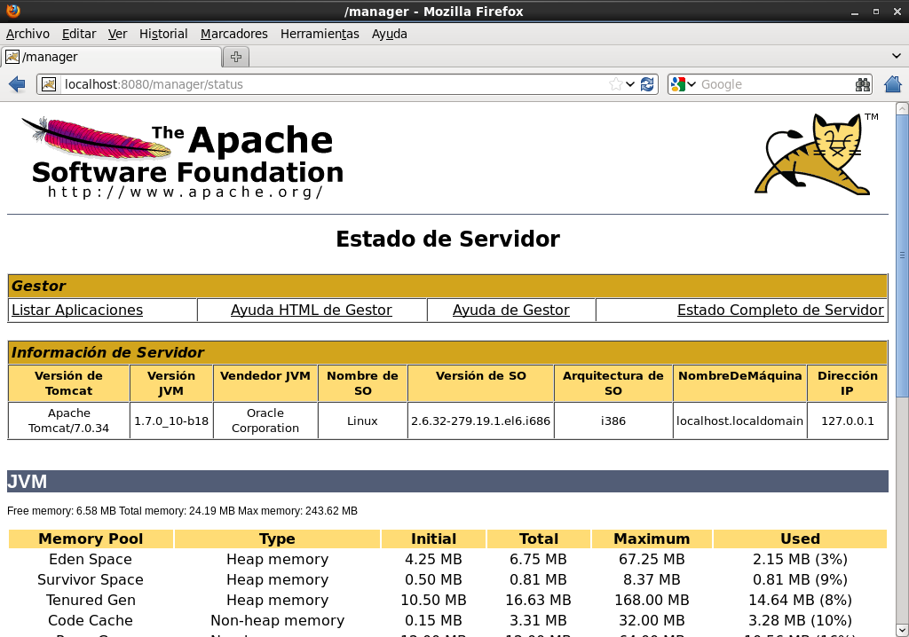


## 2. INSTALACIÓN DE UN SERVLET EN TOMCAT

Ahora queremos instalar el servlet en Tomcat, para ello accedemos a la interfaz web del “Gestor de Aplicaciones Web de Tomcat” ([http://localhost:8080/manager/html](http://localhost:8080/manager/html)). Descenderemos por la página, hasta que lleguemos a la tabla “Desplegar”, nos fijaremos en la sección “Archivo WAR a desplegar” e introducimos en “Seleccione archivo WAR a cargar” la ruta de nuestro archivo “prueba.war”, después de esto, pulsamos  el botón “Desplegar” y la aplicación ya estará disponible a través de la dirección ([http://localhost:8080/prueba/prueba](http://localhost:8080/prueba/prueba)).

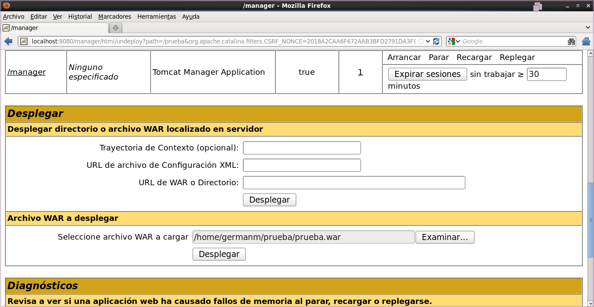
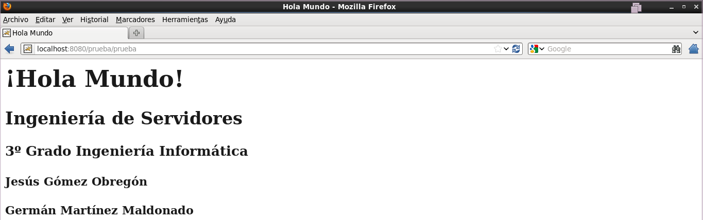


## 5. INSTALACIÓN DE JBOSS

Vamos a instalar la última versión disponible de JBoss, 7.1.1. Para que JBoss pueda funcionar, necesitaremos crear un usuario “jboss” y un grupo “jboss”, al que le pertenecerá el directorio “/usr/jboss”, que será en el que instalemos JBoss.

```
groupadd jboss
useradd -g jboss -d /usr/jboss jboss
```

Deberemos descargar el archivo que contiene JBoss, lo podemos descargar de ([http://download.jboss.org/jbossas/7.1/jboss-as-7.1.1.Final/jboss-as-7.1.1.Final.tar.gz](http://download.jboss.org/jbossas/7.1/jboss-as-7.1.1.Final/jboss-as-7.1.1.Final.tar.gz)). Una vez descargado lo descomprimimos, y como hacíamos en la instalación anterior, renombramos el nombre de la carpeta para evitar problemas:

```
tar -xvzf jboss-as-7.1.1.Final.tar.gz
mv jboss-as-7.1.1.Final/ jboss7
```

Y para realizar la instalación, moveremos el directorio que contiene los archivos de JBoss a la carpeta que hemos creado para el usuario “jboss”:

```
mv jboss7 /usr/jboss
chown -R jboss.jboss /usr/jboss
```

Para JBoss no es necesario que creemos totalmente el script para iniciar, parar y reiniciar el programa, podremos usar el script que incluye entre sus archivos de instalación en la carpeta “bin/init.d/jboss-as-standalone.sh” que lo copiaremos a “/etc/init.d/” dándole el nuevo nombre de “jboss7”. Además también copiaremos el archivo de configuración “bin/init.d/jboss-as.conf” también a “/etc/init.d”:

```
cp /usr/jboss/jboss7/bin/init.d/jboss-as-standalone.sh /etc/init.d/jboss7
cp /usr/jboss/jboss7/bin/init.d/jboss-as.conf /etc/init.d/
```

Editamos el archivo “/etc/init.d/jboss-as.conf” para incluir dos líneas, una que indique el usuario que usará JBoss y otra que indique su ruta de instalación:

```
JBOSS_USER=jboss
JBOSS_HOME=/usr/jboss/jboss7
```

Tenemos que modificar en “/etc/init.d/jboss7” la sección donde indica la ruta del archivo de configuración para que el propio programa sepa encontrarlo:

```
# Load JBoss AS init.d configuration.
if [ -z "$JBOSS_CONF" ]; then
  JBOSS_CONF="/etc/init.d/jboss-as.conf"
fi
```

Ahora agregamos JBoss como servicio y lo habilitamos:

```
chkconfig --add jboss7
chkconfig jboss7 on
```

El último paso que deberemos hacer de configuración es agregar un usuario con privilegios de administrador para  la consola gráfica, para ello ejecutamos el siguiente  comando, seleccionando la opción “Managemente User” y luego, en nuestro caso, introduciendo como usuario “admin” y como contraseña “administrador”:

```
sh /usr/jboss/jboss7/bin/add-user.sh
```

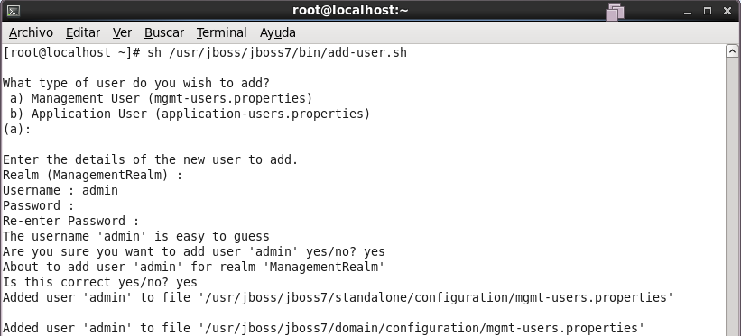

Finalmente, solo nos falta iniciar el servicio y acceder a la dirección ([http://localhost:9990](http://localhost:9990)) para comprobar que JBoss funciona correctamente.

```
service jboss7 start
```

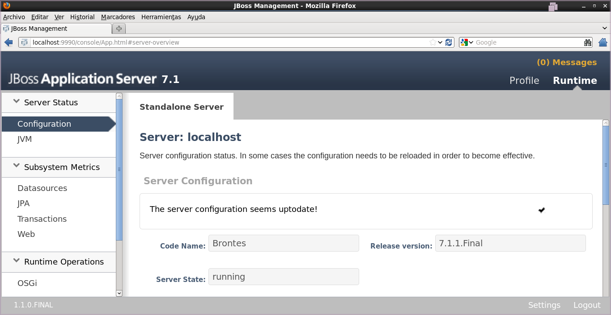


## 6. INSTALACIÓN DE UN SERVLET EN JBOSS

Para desplegar la aplicación en el caso de JBoss, la mejor opción es usar el propio gestor que JBoss provee desde su interfaz web. Para ello en el menú de la izquierda dentro de la sección “Deployments”, seleccionamos “Manage Deployments”. Ahora deberemos pulsar el botón “Add Content” y seleccionar el archivo “prueba.war” que creamos anteriormente. Con esto la aplicación ya estará disponible desde la dirección ([http://localhost:8080/prueba/prueba](http://localhost:8080/prueba/prueba)).

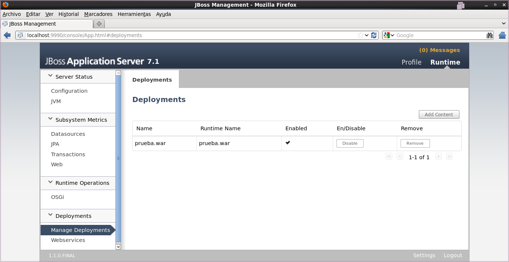

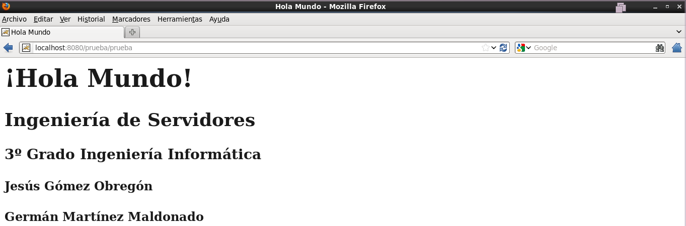


## 7. INSTALACIÓN DE GLASSFISH


Vamos a instalar la última versión disponible de Glassfish, 7.1.1. Para instalarlo, vamos a descargar el archivo que contiene la aplicación, en enlace para descargarlo es ([http://download.java.net/glassfish/3.1.2.2/release/glassfish-3.1.2.2-ml.zip](http://download.java.net/glassfish/3.1.2.2/release/glassfish-3.1.2.2-ml.zip)). Una vez descargado lo descomprimimos:

```
unzip glassfish-3.1.2.zip
```

Creamos el usuario “glassfish” y el grupo “glassfish”, estos usuarios como en los casos anteriores, son necesarios para ejecutar el servidor. La carpeta de dicho usuario será “/usr/glassfish”:

```
groupadd glassfish
useradd -g glassfish -d /usr/glassfish glassfish
```

Ahora movemos la carpeta descomprimida “glassfish3” a la carpeta del usuario “glassfish”, asignándole la propiedad de esa carpeta y todo su contenido descendiente:

```
mv glassfish3 /usr/glassfish
chown -R glassfish.glassfish /usr/glassfish/glassfish3
```

Creamos el script para iniciar, parar o reiniciar el programa de forma automática, este archivo lo crearemos en “/etc/init.d/” con el nombre “glassfishd”. El contenido del script será el siguiente:

```
#!/bin/bash
#
# glassfish Start up the Glassfish server daemon
# chkconfig: 2345 55 25
# description: Glassfish is an application server. \
# This service starts up the Glassfish3 server daemon.
# processname: glassfish

source /etc/profile
GLASSFISH_HOME=/usr/glassfish/glassfish3
RUN_AS_USER=glassfish
case $1 in
start)
su - $RUN_AS_USER -c "sh $GLASSFISH_HOME/bin/asadmin start-domain domain1"
;;
stop)
su - $RUN_AS_USER -c "sh $GLASSFISH_HOME/bin/asadmin stop-domain domain1"
;;
restart)
su - $RUN_AS_USER -c "sh $GLASSFISH_HOME/bin/asadmin stop-domain domain1"
su - $RUN_AS_USER -c "sh $GLASSFISH_HOME/bin/asadmin start-domain domain1"
;;
esac
exit 0
```

Solo nos quedan un par de cosas por hacer: darle permiso de ejecución al script, agregarlo como servicio y habilitarlo, y por último, arrancar el servidor para comprobar que funciona correctamente. Accederemos al servidor introduciendo la dirección “[http://localhost:4848](http://localhost:4848)”:

```
chmod +x /etc/init.d/glassfishd
chkconfig --add glassfishd
chkconfig glassfishd on
service glassfishd start
```

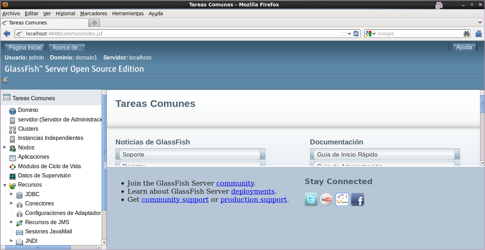


## 8. INSTALACIÓN DE UN SERVLET EN GLASSFISH

Para instalar el servlet en Glassfish, desde la interfaz web, en el menú de la izquierda desplegamos la opción “Aplicaciones”, pulsamos el botón “Desplegar” que aparecerá en la zona de la derecha y, en “Archivo Empaquetado que Cargar en el Servidor” indicamos la ruta de nuestro archivo “prueba.war”. Añadimos al final una descripción de la aplicación y pulsamos el botón “Aceptar”. Volveremos al menú anterior, comprobando que nuestra aplicación aparece ya como desplegada, ahora sólo nos queda comprobar que funciona accediendo a la dirección ([http://localhost:8080/prueba/prueba](http://localhost:8080/prueba/prueba)).

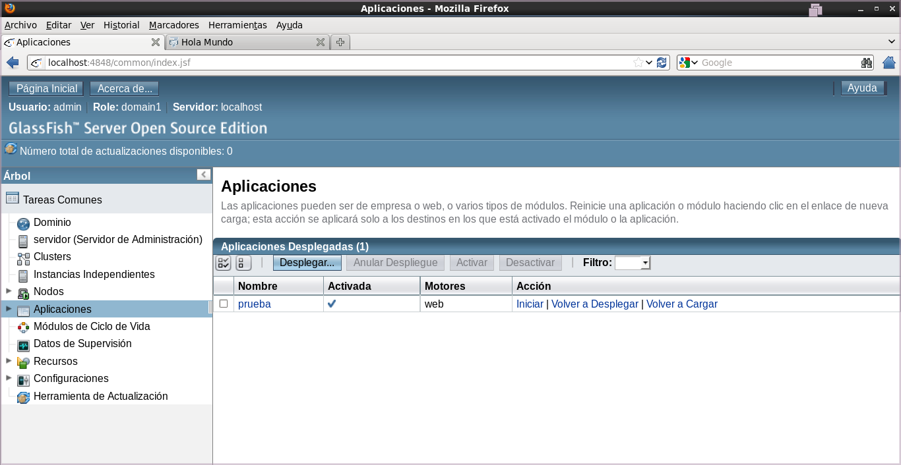

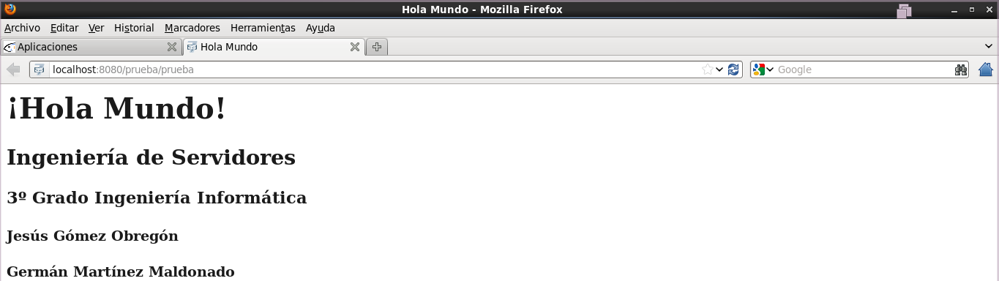


## 9. BIBLIOGRAFÍA

[http://programandoenlausac.blogspot.com.es/2012/01/instalacion-jdk-en-centos-62.html](http://programandoenlausac.blogspot.com.es/2012/01/instalacion-jdk-en-centos-62.html)

[http://es.wikipedia.org/wiki/Java_Servlet](http://es.wikipedia.org/wiki/Java_Servlet)

[http://programandoenlausac.blogspot.com.es/2012/02/instalacion-de-tomcat-6-en-centos-62.html](http://programandoenlausac.blogspot.com.es/2012/02/instalacion-de-tomcat-6-en-centos-62.html)

[http://programandoenlausac.blogspot.com.es/2012/06/instalacion-de-jboss-71-en-centos-62.html](http://programandoenlausac.blogspot.com.es/2012/06/instalacion-de-jboss-71-en-centos-62.html)

[http://programandoenlausac.blogspot.com.es/2012/01/instalacion-glassfish-31-en-centos-62.html](http://programandoenlausac.blogspot.com.es/2012/01/instalacion-glassfish-31-en-centos-62.html)

[http://www3.ntu.edu.sg/home/ehchua/programming/howto/tomcat_howto.html](http://www3.ntu.edu.sg/home/ehchua/programming/howto/tomcat_howto.html)

[http://content.hccfl.edu/pollock/ajava/war/myservletwar.htm](http://content.hccfl.edu/pollock/ajava/war/myservletwar.htm)
