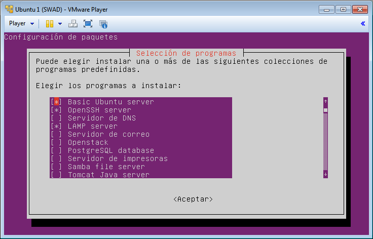
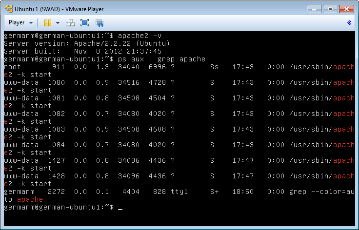
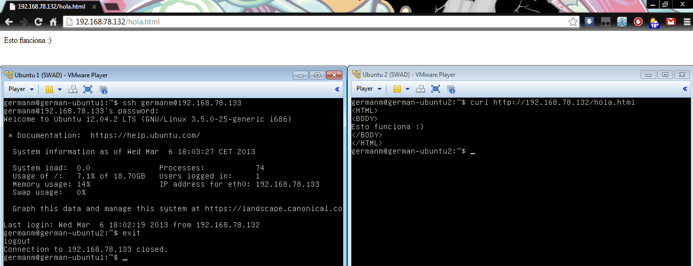

Servidores Web de Altas Prestaciones
====================================
3º Grado en Ingeniería Informática 2012/2013
--------------------------------------------

# PRÁCTICA 1: Preparación de las herramientas
### Germán Martínez Maldonado

El objetivo de esta práctica es dejar las máquinas virtuales preparadas para su uso en las posteriores prácticas. Dichas máquinas tendrán instaladas Ubuntu Server 12.04.2 LTS, además una vez instalado el sistema, procederemos con la instalación de Apache + PHP + MySQL.

Como bien se indica en los enlaces incluidos en el guión de prácticas, hay varias formas de instalar Apache + PHP + MySQL, como una instalación habitual desde línea de comandos usando `sudo apt-get install apache2 mysql-server php5 libapache2-mod-php5 php5-mysql`, o la forma más fácil, durante la instalación de Ubuntu, cuando nos da la opción de instalar programas adicionales, seleccionamos instalar **“LAMP server”**. También deberemos instalar **“OpenSSH server”**, para poder realizar conexiones seguras entre ambos servidores. Indicar que no es necesario seleccionar la instalación de estos programas obligatoriamente durante la instalación, lo podremos hacer en cualquier  momento si  introducimos el comando `sudo tasksel`.

Comprobamos que se ha instalado correctamente el servidor Apache, primero solicitamos al propio servidor que nos dé la información sobre la versión instalada (usando `apache2 –v`) y también, buscando entre los procesos en el sistema y filtrando los que tengan como nombre **“apache”** (usando `ps aux | grep apache`).

Una vez que estamos seguros que todo funciona, vamos a realizar conexiones de prueba entre ambos servidores y con el sistema operativo anfitrión para comprobar que todo funciona correctamente. Para ello, primero necesitaremos conocer las direcciones IP de ambos servidores, usando `ifconfig` para averiguarlas:

* german-ubuntu1 tiene la dirección 192.168.78.132.
* german-ubuntu2 tiene la dirección 192.168.78.13.

Ahora solo nos queda hacer la prueba, nos conectaremos desde el servidor 1 mediante SSH al servidor 2 (`ssh germanm@192.168.78.133`), y usando el navegador curl nos conectaremos al servidor 1 desde el servidor 2 (`curl http://192.168.78.132/hola.html`). Además desde el navegador del sistema anfitrión, probaremos también la conexión con el servidor 2, simplemente tendremos que introducir la ruta “[http://192.168.78.132/hola.html](http://192.168.78.132/hola.html)” en cualquier navegador. Como podemos observar, todo funciona correctamente:

