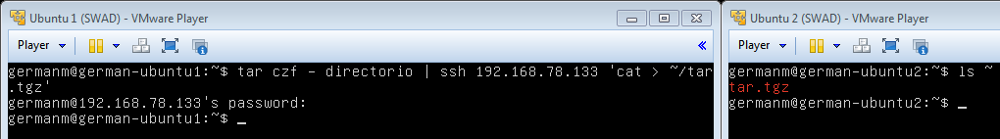
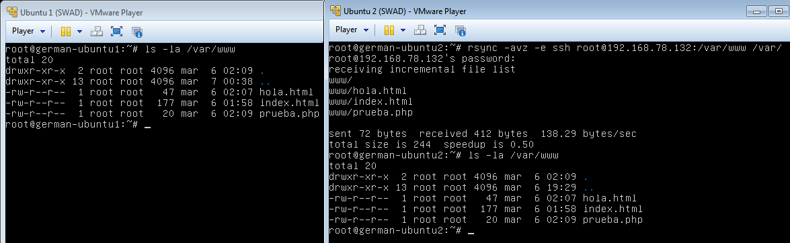
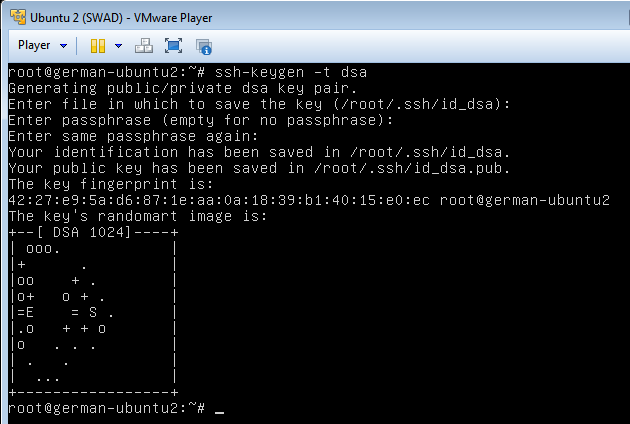
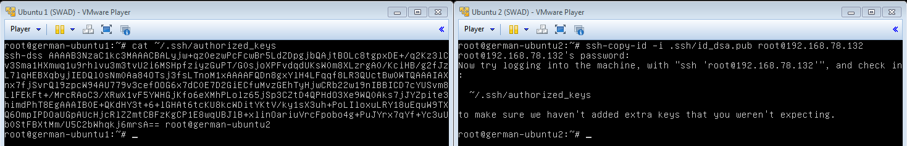
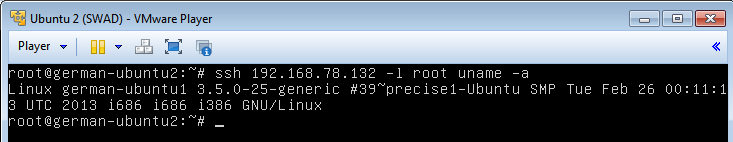
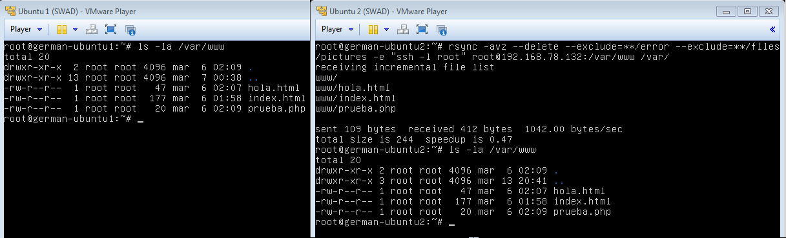
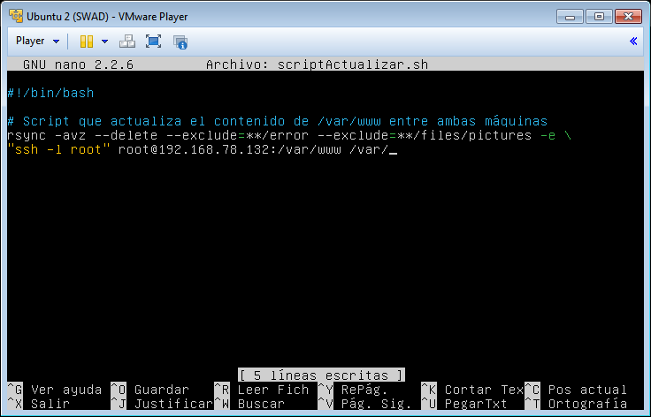
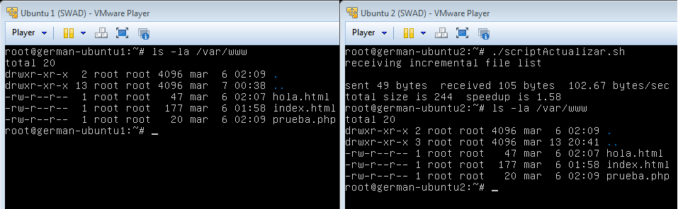
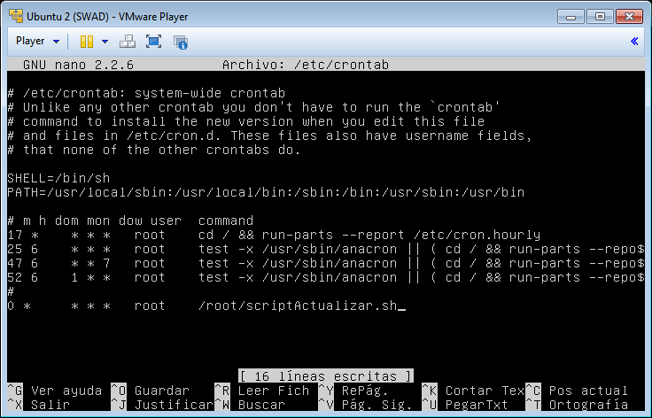

Servidores Web de Altas Prestaciones
====================================
3º Grado en Ingeniería Informática 2012/2013
--------------------------------------------


# PRÁCTICA 2: Clonar la información de un sitio web
### Germán Martínez Maldonado

Los objetivos de esta práctica son:
* Aprender a copiar archivos mediante `ssh`.
* Clonar contenido entre máquinas.
* Configurar `ssh` para acceder a máquinas remotas sin contraseña.
* Establecer tareas en `cron`.

Para conseguir dichos objetivos vamos a usar los citados `ssh` y `cron`, además de `rsync`, una aplicación que nos permite hacer copias incrementales que usaremos para la clonación del contenido.

Lo primero que vamos a probar es copiar archivos mediante `ssh` de una máquina a otra. Como prueba vamos a copiar un directorio, para ello primero lo comprimiremos con `tar` pasándole los argumentos `czf -` (**c**: crear un archivo nuevo, **z**: comprimir con gzip, **f -**: indica que la salida se producirá en la salida estándar), y lo pasamos mediante **“ssh”** al otro ordenador, redirigiendo además la salida a un archivo que en este caso vamos a llamar **“tar.tgz”**. Vemos como el archivo se ha creado en la segunda máquina.



Ya hemos visto como copiar un archivo desde un ordenador a otro, pero cuando la dimensión de los archivos es considerable en tamaño o número, es mejor usar otras herramientas como `rsync`, que nos permitirá copiar una estructura de directorios completa, además controlando que la información que contiene la copia siempre es idéntica a la original. Para evitar contratiempos, activaremos las cuentas de usuario **“root”** en ambos sistemas para realizar esta operación, esto se hace dándolo una contraseña a dicho usuario, por lo que introduciremos `sudo passwd root` para realizar dicha acción. Una vez hecho esto, ejecutamos `rsync` pasándole como argumentos `-avz -e` (**a**: para que los archivos copiados conserven sus permisos y propiedades originales, **v**: para que se muestren por pantalla todas las operaciones que están siendo realizadas, **z**: para usar compresión, **e**: para indicar que vamos realizar la copia en otro ordenador, usando en este caso `ssh`), y `ssh root@192.168.78.132:/var/www /var/` (conectarse mediante ssh a la máquina indicada y usando el usuario root, copiar la carpeta **“/var/www/”** y todo su contenido en la carpeta remota **“/var/”**). Introducido esto, nos pedirá la contraseña del usuario **“root”** y nos mostrará por pantalla las acciones realizadas. Finalmente comprobamos que los archivos copiados son exactos a los originales.



Para no tener que introducir la contraseña del usuario cada vez que queramos hacer una copia de seguridad usaremos autentificación mediante par de claves pública-privada. Primero generamos la clave en el ordenador desde el que realizaremos la conexión, para generar dicha clave usamos `ssh-keygen –t dsa`, que nos generará una clave DSA. No introducimos ninguna contraseña cuando nos la solicite ya que ese es el objetivo, no tener que introducir contraseña.



Si no hemos cambiado la ruta en la que generar el fichero con la clave, este debería encontrarse en **“/root/.ssh/id_dsa.pub”**, este será el archivo que deberemos copiar al ordenador del que queremos copiar la información sin tener que introducir la contraseña. Para ello, desde la máquina en la que copiar, usando la orden `ssh-copy-id –i .ssh/id_da.pub root@192.168.78.132`, con esto estaremos copiando en el ordenador principal la clave que nos permitirá copiar en nuestro ordenador los archivos con `rsync` mediante `ssh` sin tener que introducir la contraseña en cada ocasión. Como vemos, en el archivo de las claves del ordenador principal (**/root/.ssh/authorized_keys**), hay al final una entrada que indica que está permitido la conexión mediante `ssh` al usuario **“root”** desde el equipo **“german-ubuntu2”**.



Podremos comprobar el funcionamiento de lo que acabamos de hacer si nos conectamos mediante `ssh` al ordenador principal desde el ordenador secundario y ejecutamos una orden cualquiera, como puede ser `uname –a` en este caso.



Vamos ahora a volver a realizar la copia del directorio **“/var/www/”** con `rsync`, pero esta vez pasándole nuevos argumentos `--delete` (los archivos que hayan sido eliminados en la máquina origen, también serán eliminados en la máquina de copias en caso de existir), `-- exclude` (para que no se copien los archivos indicados), y ahora en `ssh` también indicamos que nos vamos a conectar como el usuario **“root”** (-e `ssh –l root`). Si realizamos correctamente la creación y copiado de las claves, la ejecución de `rsync` en esta ocasión se haría sin pedirnos que introduzcamos contraseña alguna.



Como el objetivo final era automatizar la copia con `rsync` mediante `cron`, vamos a crear un script que realice la operación de copiado que acabamos de ver con `rsync`.



Una vez creado el script, le damos permisos de ejecución y demás para solo nuestro usuario (`chmod 744 scriptActualizar.sh`). Ahora solo nos queda probarlo.



Para finalizar, lo único que nos falta es añadir una nueva tarea al **“crontab”** (fichero de configuración de `cron` situado en **“/etc/crontab”**), para que cada hora se realice la copia de seguridad en nuestra máquina replicante, así que en este caso deberemos añadir:

```
0 *      * * *  root    /root/scriptActualizar.sh
```

Con esta línea indicamos que en el minuto **“0”** de cada hora, de cada día del mes, de cada mes, de cada día de la semana, el usuario **“root”** ejecute el script **“/root/scriptActualizar.sh”**, que es el script que acabamos de crear para que realice la copia del contenido actualizado del directorio **“/var/www/”** de la máquina principal a la máquina replicante.


