Servidores Web de Altas Prestaciones
====================================
3º Grado en Ingeniería Informática 2012/2013
--------------------------------------------

# PRÁCTICA 3: Balanceo de carga
### Germán Martínez Maldonado

El objetivo de esta práctica es el de configurar una red entre varias máquinas para que una máquina que funcione como balanceador reparta la carga entre varios servidores. Como máquinas balanceadoras usaremos dos configuraciones diferentes, una basada en NginX y otra basada en HAProxy.

Para comenzar que vamos a comprobar es que tenemos nuestros dos servidores funcionando y conectados a la misma red, asi que comprobamos que Apache está arrancado, obtenemos la dirección IP de ambos servidores, y vemos que uno y otro sean visibles entre sí.

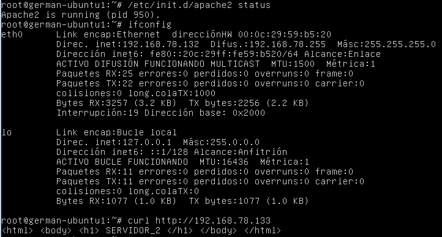

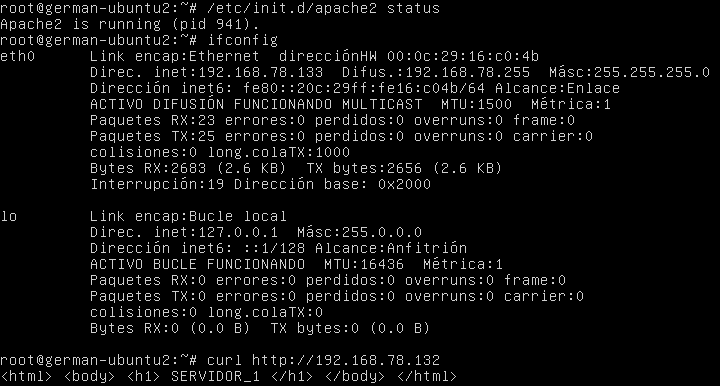

Para instalar NginX, lo primero que necesitamos es importar la clave del repositorio de software:

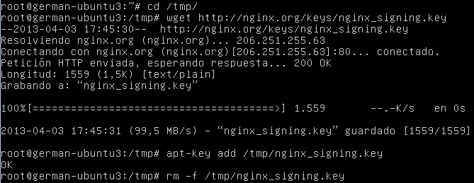

Seguidamente añadimos el repositorio a **“/etc/apt/sources.list”**:

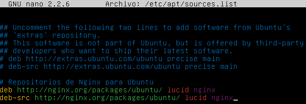

Y así, finalmente podremos instalarlo:

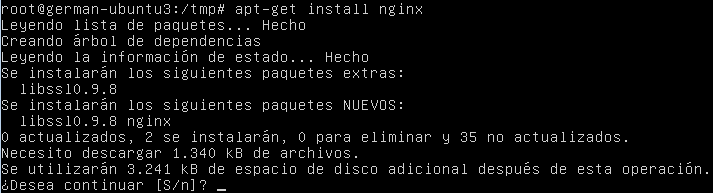

La configuración de NginX se realiza en el archivo **“/etc/nginx/conf.d/default.conf”**, la configuración realizada nos permitirá redirigir el tráfico a un grupo de servidores que hemos llamado `apaches` (usando la directiva `upstream`), en dicho grupo de servidores hemos configurado que el primer servidor (`server 192.168.78.132 weight=2`) reciba el doble de carga que el servidor segundo (`server 192.168.78.133 weight=1`), el algoritmo para repartir la carga no es necesario que lo indiquemos porque se toma **“round robin”** por defecto al usar la directiva `upstream`. Dentro de la directiva `location`, deberemos indicar con la directiva `proxy_pass` hacia donde vamos a redirigir el tráfico entrante, en nuestro caso la dirección de acceso a nuestro grupo de servidores ([http://apaches](http://apaches)). Por último, debemos indicar que en los backends la versión de HTTP es 1.1 (`proxy_http_version 1.1`), y que se elimine la cabecera `Connection` (`proxy_set_header Connextion “”`).

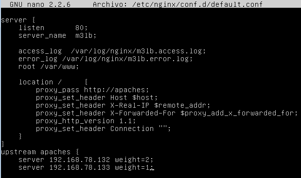

Una vez completada la configuración, vamos a comprobar que las peticiones al servidor están sindiendo balanceadas según el criterio indicado, para ello mediante el navegador `curl` accederemos al balanceador mediante su dirección IP.

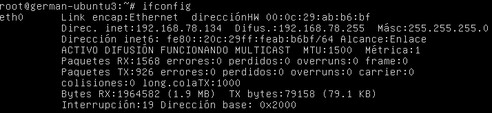

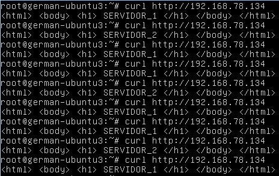

Instalamos HAProxy sin ninguna complicación usando `apt-get`. Y procedemos a realizar su configuración en el archivo **“/etc/haproxy/haproxy.cfg”**. Para indicar que vamos a realizar el reparto de carga mediante un algoritmo **“round robin”**, dentro de la directiva `defaults` añadimos la directiva `balance roundrobin`, así conseguiremos que se aplique a todos los servidores. En la directiva `frontend http-in`, indicamos que se debe escuchar el tráfico del puerto 80 (`bind *:80`) y redirigirlo hacia los servidores finales (`default_backend servers`). El grupo de servidores `servers` al que redirigimos el tráfico necesitaremos especificarlo con la directiva `backend servers` añadiéndole las líneas que representan cada uno de los servidores el primer servidor con el doble de carga (`server m1 192.168.78.132:80 maxconn 32 weight 64`) y el segundo servidor con la mitad de carga (`server m2 192.168.78.133:80 maxconn 32 weight 34`). Para establecer la ponderación indicaremos con `weight` un valor proporcional en base a 100 sobre la carga que recibirá dicho servidor.

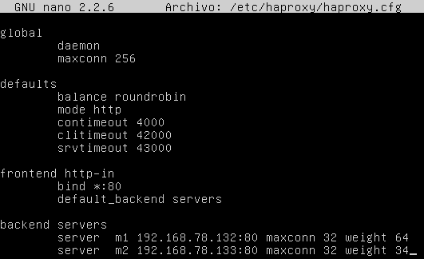

Ya simplemente nos falta comprobar la dirección IP de nuestra máquina, para así poder realizar la misma prueba que realizábamos con NginX. Una vez conozcamos la IP, simplemente deberemos lanzar el servicio con el comando `/usr/sbin/haproxy –f /etc/haproxy/haproxy.cfg`, y ya podremos comprobar el funcionamiento con `curl`.

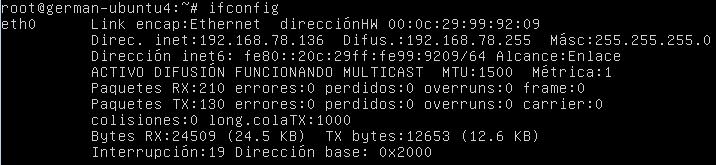

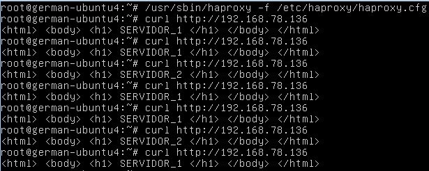
