Servidores Web de Altas Prestaciones
====================================
3º Grado en Ingeniería Informática 2012/2013
--------------------------------------------


# PRÁCTICA 4: Comprobar el rendimiento de servidores web
### Germán Martínez Maldonado

El objetivo de esta práctica es realizar mediciones de rendimiento de servidores web, para ello usaremos diferentes herramientas: Apache Benchmark, httperf y OpenWebLoad. Antes de nada, debemos tener en cuenta que aunque las pruebas a las que serán sometidos los servidores por parte de las herramientas son similares, cada herramienta la realizará mediante un procedimiento propio que no tiene que ser igual al que usa otra herramienta, es por eso que, por ejemplo, la tasa de solicitudes por segundo obtenida con Apache Benchmark sea diferente a la obtenido con httperf, por lo que no debemos compararlos entre sí, solo debemos comparar los datos obtenidos con una misma herramienta.

La batería de pruebas será la misma con cada una de las herramientas, realizar 10 mediciones de rendimiento con cada una de las herramientas e introducir los diferentes datos obtenidos en una tabla, para después obtener la media y desviación estándar de dichos datos. Para realizar las pruebas, se solicitará un pequeño archivo HTML llamado **“prueba.html”** que tendrá el contenido que podemos ver a continuación:

* **prueba.html**:

```
<html>
    <head>
        <title> pruebas </title>
    </head>
    <body>
        Archivo para realizar la prueba
    </body>
</html>
```

Las pruebas se realizarán contra una máquina con un servidor Apache en funcionamiento (con dirección IP 192.168.78.132), una máquina con nginx configurado para hacer balanceo de carga hacia 2 máquinas con servidores Apache (IP nginx: 192.168.78.134) y, una máquina con HAProxy configurado también para hacer balanceo de carga hacia 2 máquina con servidores Apache (IP HAProxy: 192.168.78.136).


## PRUEBAS CON APACHE BENCHMARK

Las pruebas que vamos a hacer con la herramienta Apache Benchmark van a consistir en solicitar el archivo HTML antes descrito un número de 100.000 veces haciendo las peticiones con una concurrencia de 100 peticiones simultáneas. El número de peticiones se indica con el parámetro **“-n 100000”** y el número de concurrencia se indica con **“-c 100”**, por lo que las línea de comando a introducir para cada servidor sería:

* `ab -n 100000 -c 100 http://192.168.78.132/prueba.html`
* `ab -n 100000 -c 100 http://192.168.78.134/prueba.html`
* `ab -n 100000 -c 100 http://192.168.78.136/prueba.html`

Los datos que nos va a interesar introducir en la tabla son el tiempo necesario para completar dichas pruebas (medido en segundos), el número de solicitudes fallidas y el número promedio de solicitudes por segundo. Como podremos ver con mayor claridad en los gráficos que en la tabla, cuando las pruebas son lanzadas contra el servidor único, el rendimiento obtenido es mayor, ya que como promedio, tarde casi un tercio menos de tiempo en completar las pruebas y es capaz de atender casi un tercio más de solicitudes por segundo.

Sin embargo, si nos fijamos en los valores obtenidos en la desviación, vemos que se disparan tanto para el promedio de tiempos de ejecución y de solicitudes por segundo, mientras que en los promedios obtenidos en las pruebas a las granjas web las desviaciones son mucho más similares, por lo que si hiciéramos las pruebas con unos valores mayores tanto de número de conexiones como de concurrencia, cabe la posibilidad de que el servidor no obtuviera unos resultados tan buenos en comparación a los obtenidos por la granja web.

|                     |                  Servidor                  |       Servidor       |         Servidor        |                    nginx                   |         nginx        |          nginx          |                   HAProxy                  |        HAProxy       |         HAProxy         |
|:-------------------:|:------------------------------------------:|:--------------------:|:-----------------------:|:------------------------------------------:|:--------------------:|:-----------------------:|:------------------------------------------:|:--------------------:|:-----------------------:|
|                     | Tiempo necesario para la prueba (segundos) | Solicitudes fallidas | Solicitudes por segundo | Tiempo necesario para la prueba (segundos) | Solicitudes fallidas | Solicitudes por segundo | Tiempo necesario para la prueba (segundos) | Solicitudes fallidas | Solicitudes por segundo |
|       Prueba 1      |                   98,458                   |           0          |         1015,67         |                   127,824                  |           0          |          782,32         |                   133,312                  |           0          |          750,12         |
|       Prueba 2      |                   87,655                   |           0          |         1140,84         |                   126,211                  |           0          |          792,32         |                   129,533                  |           0          |           772           |
|       Prueba 3      |                    80,22                   |           0          |         1246,58         |                   126,283                  |           0          |          791,87         |                   131,482                  |           0          |          760,56         |
|       Prueba 4      |                   80,694                   |           0          |         1239,26         |                   128,456                  |           0          |          778,47         |                   125,795                  |           0          |          794,94         |
|       Prueba 5      |                   82,079                   |           0          |         1218,34         |                   125,192                  |           0          |          798,77         |                   128,552                  |           0          |          777,89         |
|       Prueba 6      |                   85,651                   |           0          |         1167,53         |                   122,922                  |           0          |          813,52         |                   133,356                  |           0          |          749,87         |
|       Prueba 7      |                   92,357                   |           0          |         1082,75         |                   127,048                  |           0          |          787,1          |                   130,987                  |           0          |          763,43         |
|       Prueba 8      |                   87,456                   |           0          |         1143,43         |                   124,885                  |           0          |          800,74         |                    132,9                   |           0          |          752,44         |
|       Prueba 9      |                   86,869                   |           0          |         1151,16         |                   123,184                  |           0          |          811,79         |                   129,98                   |           0          |          769,35         |
|      Prueba 10      |                    85,8                    |           0          |          1165,5         |                   130,558                  |           0          |          765,94         |                   129,334                  |           0          |          773,19         |
|                     |                                            |                      |                         |                                            |                      |                         |                                            |                      |                         |
|        Media        |                   86,724                   |           0          |         1157,106        |                   126,256                  |           0          |         792,284         |                   130,523                  |           0          |         766,379         |
| Desviación estándar |                    5,508                   |         0,000        |          70,477         |                    2,357                   |         0,000        |          14,743         |                    2,393                   |         0,000        |          14,177         |

* Media: Tiempo necesario para la prueba (segundos)

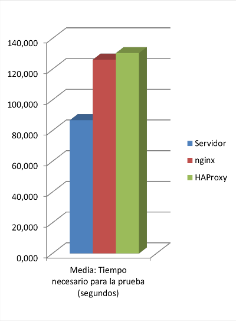

* Desviación estándar: Tiempo necesario para la prueba (segundos)

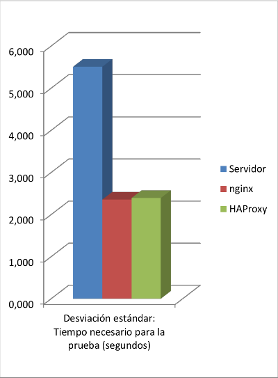

* Media: Solicitudes por segundo

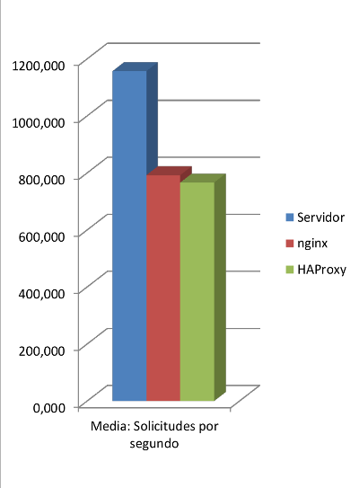

* Desviación estándar: Solicitudes por segundo

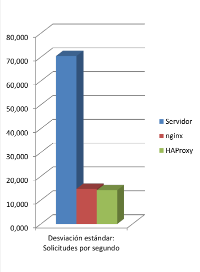


## PRUEBAS CON HTTPERF

Las pruebas que vamos a realizar con httperf consisten en abrir 10.000 conexiones TCP, para con cada una de ella realizar peticiones HTTP del archivo HTML que también hemos usado con las pruebas realizadas con Apache Benchmark. Se harán 10 peticiones por conexión y el tiempo de espera para la respuesta será de 5 segundos. El número de conexiones se indica con el parámetro **“--num-conn 10000”**, el número de peticiones por conexión con **“--num-call 10”** y el tiempo de espera con **“--timeout 5”**. Dichos parámetros los pasaremos en una línea de comandos como la siguiente:

* `httperf --server 192.168.78.132 --uri /prueb.html --port 80  --num-conn 10000 --num-call 10 --timeout 5`
* `httperf --server 192.168.78.134 --uri /prueb.html --port 80  --num-conn 10000 --num-call 10 --timeout 5`
* `httperf --server 192.168.78.136 --uri /prueb.html --port 80  --num-conn 10000 --num-call 10 --timeout 5`

Los datos que nos interesan son la duración de la prueba (medido en segundos), la tasa de solicitudes (medido en solicitudes por segundo) y, en caso de que se produjeran errores, el número total de errores. En esta ocasión vemos que los mejores resultados los obtenemos a un nivel similar tanto en el servidor único como en la granja web con HAProxy, tardando alrededor de un cuarto menos de tiempo en completar las pruebas, y teniendo a la vez un tasa de solicitud en torno a un cuarto mayor.

En este caso nos volvemos a encontrar con una alta desviación en los promedios del servidor único, mucho mayores que los de ambas granjas web, por lo que visto este último detalle, según la prueba de httperf el sistema más confiable sería el de la granja web montada con HAProxy.

|                     |             Servidor             |                 Servidor                |    Servidor   |               nginx              |                  nginx                  |     nginx     |              HAProxy             |                 HAProxy                 |    HAProxy    |
|:-------------------:|:--------------------------------:|:---------------------------------------:|:-------------:|:--------------------------------:|:---------------------------------------:|:-------------:|:--------------------------------:|:---------------------------------------:|:-------------:|
|                     | Duración de la prueba (segundos) | Tasa de solicitud (solicitudes/segundo) | Total errores | Duración de la prueba (segundos) | Tasa de solicitud (solicitudes/segundo) | Total errores | Duración de la prueba (segundos) | Tasa de solicitud (solicitudes/segundo) | Total errores |
|       Prueba 1      |              201,067             |                  497,3                  |       0       |              252,422             |                  396,2                  |       0       |              198,439             |                  503,9                  |       0       |
|       Prueba 2      |              199,292             |                  501,8                  |       0       |              253,533             |                  394,4                  |       0       |              197,822             |                  505,5                  |       0       |
|       Prueba 3      |              196,55              |                  508,08                 |       0       |              254,959             |                  392,2                  |       0       |              196,61              |                  508,6                  |       0       |
|       Prueba 4      |              195,938             |                  510,4                  |       0       |              254,423             |                   393                   |       0       |              197,836             |                  505,5                  |       0       |
|       Prueba 5      |              195,808             |                  510,7                  |       0       |              255,13              |                   392                   |       0       |              197,061             |                  507,5                  |       0       |
|       Prueba 6      |              196,728             |                  508,3                  |       0       |              252,824             |                  395,5                  |       0       |              196,403             |                  509,2                  |       0       |
|       Prueba 7      |              196,202             |                  509,7                  |       0       |              254,44              |                   393                   |       0       |              196,585             |                  508,7                  |       0       |
|       Prueba 8      |              195,964             |                  510,3                  |       0       |              254,401             |                  393,1                  |       0       |              196,668             |                  508,5                  |       0       |
|       Prueba 9      |              197,463             |                  506,4                  |       0       |              255,272             |                  391,7                  |       0       |              196,978             |                  507,7                  |       0       |
|      Prueba 10      |              195,208             |                  512,3                  |       0       |              254,372             |                  393,1                  |       0       |              196,247             |                  509,6                  |       0       |
|                     |                                  |                                         |               |                                  |                                         |               |                                  |                                         |               |
|        Media        |              197,022             |                 507,528                 |       0       |              254,178             |                  393,42                 |       0       |              197,065             |                  507,47                 |       0       |
| Desviación estandar |               1,818              |                  4,632                  |     0,000     |               0,958              |                  1,492                  |     0,000     |               0,728              |                  1,884                  |     0,000     |

* Media: Duración de la prueba (segundos)

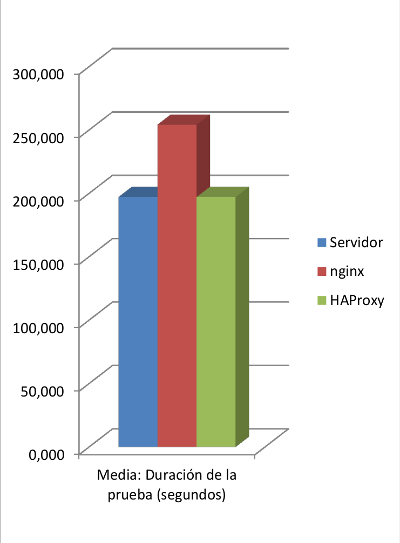

* Desviación estándar: Duración de la prueba (segundos)

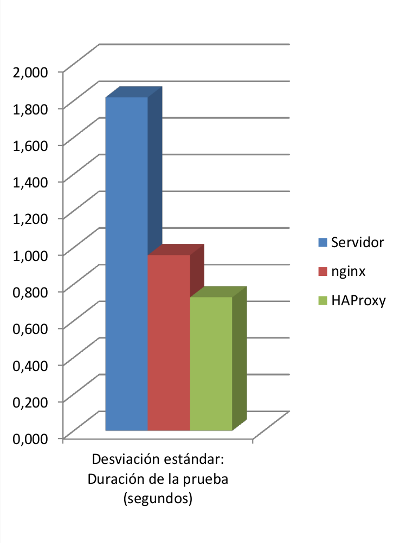

* Media: Tasa de solicitud (solicitudes/segundo)

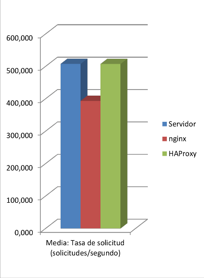

* Desviación estándar: Tasa de solicitud (solicitudes/segundo)

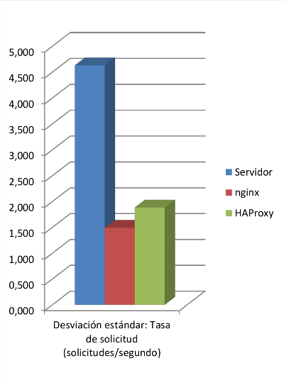


## PRUEBAS CON OPENWEBLOAD

Para la prueba que vamos a realizar con  OpenWebLoad  vamos realizar una  simulación de 10 clientes simultáneos, esperaremos a que nos muestre 10 líneas de resultados actuales por pantalla y entonces interrumpiremos la ejecución pulsando **“Enter”**, para así obtener los resultados finales. Esto lo haremos 10 veces como hemos hecho con las pruebas de las demás herramientas. Los parámetros son indicados directamente como se muestra en las líneas a continuación, primero la dirección IP del servidor seguido del número de clientes simultáneos simulados:

* `openload 192.168.78.132 10`
* `openload 192.168.78.134 10`
* `openload 192.168.78.136 10`

Los datos que nos van a interesar son los promedios de las solicitudes completadas en el tiempo total transcurrido de ejecución y los tiempos de respuesta medios (medidos en segundos). En este caso vuelve al ser el servidor único el que ofrece aparentemente los mejores resultados, teniendo un promedio de solicitudes completas sobre un tercio mayor de media y un promedio de tiempo de respuesta medio también sobre un tercio menor.

En esta ocasión las desviaciones típicas de ambos sistemas están más igualadas en el promedio de solicitudes, aunque siendo más alto el del servidor único como ha venido pasando en todas las pruebas, mientras que en el caso de la desviación del promedio de tiempos de respuesta, el valor de desviación que se dispara es el de nginx.

|                     |                            Servidor                            |               Servidor               |                              nginx                             |                 nginx                |                             HAProxy                            |                HAProxy               |
|:-------------------:|:--------------------------------------------------------------:|:------------------------------------:|:--------------------------------------------------------------:|:------------------------------------:|:--------------------------------------------------------------:|:------------------------------------:|
|                     | Promedios solicitudes completadas en tiempo total transcurrido | Tiempo de respuesta medio (segundos) | Promedios solicitudes completadas en tiempo total transcurrido | Tiempo de respuesta medio (segundos) | Promedios solicitudes completadas en tiempo total transcurrido | Tiempo de respuesta medio (segundos) |
|       Prueba 1      |                             787,06                             |                 0,012                |                             486,94                             |                 0,02                 |                             500,98                             |                 0,019                |
|       Prueba 2      |                             716,61                             |                 0,014                |                             502,63                             |                 0,019                |                              472,6                             |                 0,02                 |
|       Prueba 3      |                             763,36                             |                 0,013                |                             437,16                             |                 0,022                |                             495,45                             |                 0,019                |
|       Prueba 4      |                             743,31                             |                 0,013                |                             503,75                             |                 0,019                |                             531,12                             |                 0,018                |
|       Prueba 5      |                             689,04                             |                 0,013                |                             493,41                             |                 0,019                |                             530,47                             |                 0,018                |
|       Prueba 6      |                             761,79                             |                 0,013                |                              504,6                             |                 0,019                |                             497,25                             |                 0,019                |
|       Prueba 7      |                             744,08                             |                 0,013                |                             505,11                             |                 0,019                |                              531,5                             |                 0,018                |
|       Prueba 8      |                             772,78                             |                 0,012                |                             509,89                             |                 0,019                |                             539,66                             |                 0,018                |
|       Prueba 9      |                             739,56                             |                 0,013                |                             507,47                             |                 0,019                |                             530,95                             |                 0,018                |
|      Prueba 10      |                              785,1                             |                 0,012                |                             533,13                             |                 0,018                |                             516,31                             |                 0,018                |
|                     |                                                                |                                      |                                                                |                                      |                                                                |                                      |
|        Media        |                             750,269                            |                0,0128                |                             498,409                            |                0,0193                |                             514,629                            |                0,0185                |
| Desviación estandar |                             30,661                             |                0,00063               |                             24,624                             |                0,00106               |                             21,924                             |                0,00071               |

* Media: Promedios solicitudes completadas en tiempo total transcurrido


* Desviación estándar: Promedios solicitudes completadas en tiempo total transcurrido

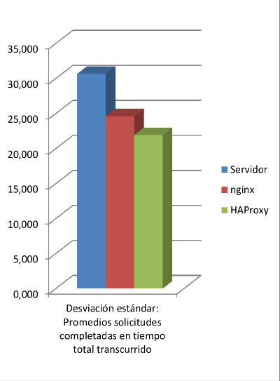

* Media: Tiempo de respuesta medio (segundos)

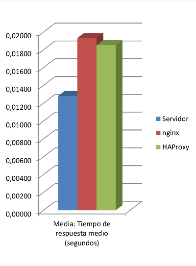

* Desviación estándar: Tiempo de respuesta medio (segundos)

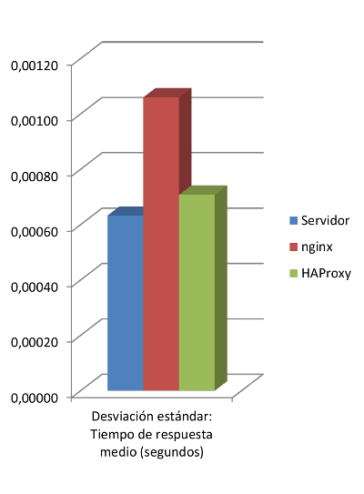


## PRUEBAS CON APACHE JMETER

Además de las herramientas que había que utilizar obligatoriamente, también he realizado pruebas con el programa Apache JMeter. Para realizar las pruebas hemos realizado una configuración básica como indican en su propia página ([http://jmeter.apache.org/usermanual/jmeter_proxy_step_by_step.pdf](http://jmeter.apache.org/usermanual/jmeter_proxy_step_by_step.pdf)). Lo primero es añadir un grupo de hilos, pulsamos sobre nuestro plan de prueba **“PRACTICA 4: SWAP”** con el botón derecho y **“Add -> Threads (Users) -> Thread Groups”**, aquí vamos a indicar que el número de usuarios será 10 (**Number of Threads (users)**) y que se harán 500 solicitudes por usuario (**Loop Count**):

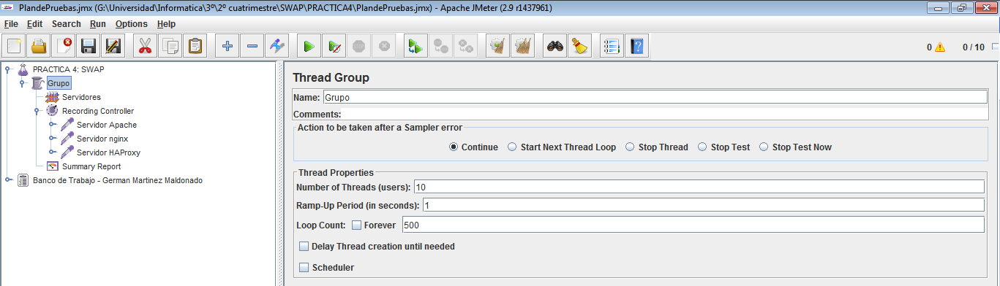

Añadimos también al grupo de hilos un **“Add -> Config Element -> HTTP Request Defaults”** y **“Add -> Logic Controller -> Recording Controller”**. Al **“Recording Controller”** le añadimos **“Add -> Sampler -> HTTP Request”** y a su vez a este le añadimos **“Add -> Config Element -> HTTP Header Manager”**, de estos dos últimos elementos deberemos añadir un par por cada servidor que vayamos a probar, 4 en nuestro caso, configurando cada uno con sus direcciones IP, ruta del archivo a solicitar e información de cabecera correspondiente:

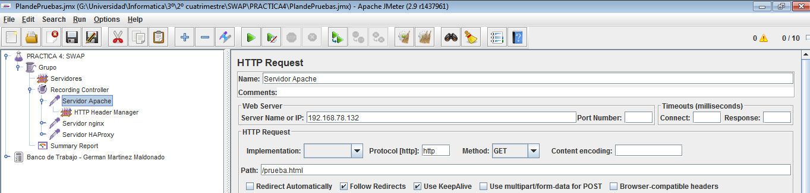

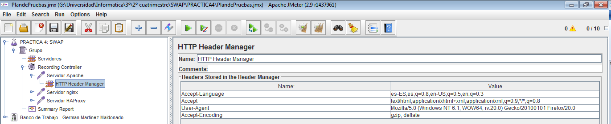

Finalmente solo nos queda añadir, al grupo de servidores un **“Add -> Listener -> Summary Report”** para que nuestro el resultado de cada una de las ejecuciones de las pruebas. Para que las pruebas se vayan realizando de forma individual solo vamos a tener activa una sonda simultáneamente, así que desactivamos las otras con pulsando el botón derecho sobre ella y seleccionando **“Disable”**. Ya solo nos queda iniciar la prueba pulsando el menú **“Run -> Start”**.

Si observamos los resultados, vemos que las son muy similares, e incluso las desviaciones estándares dan un valores muy bajos, por lo que podemos suponer que la concurrencia bajo este tipo de pruebas se maneja de forma distinta a como se hacía en los otros programas. Ninguno de los sistemas ofrecer suficiente diferencia como para poder afirmar que tiene mayor rendimiento que los demás, Apache tiene mejores valores en el tiempo promedio de respuesta, pero HAProxy promedia un mayor número de peticiones por segundo.

|                     |            Servidor            |             Servidor             |              nginx             |               nginx              |             HAProxy            |              HAProxy             |
|:-------------------:|:------------------------------:|:--------------------------------:|:------------------------------:|:--------------------------------:|:------------------------------:|:--------------------------------:|
|                     | Tiempo promedio respuesta (ms) | Número de peticiones por segundo | Tiempo promedio respuesta (ms) | Número de peticiones por segundo | Tiempo promedio respuesta (ms) | Número de peticiones por segundo |
|       Prueba 1      |               17               |               123,8              |               23               |               120,8              |               17               |               123,3              |
|       Prueba 2      |               16               |               123,3              |               23               |               126,5              |               17               |               128,7              |
|       Prueba 3      |               17               |               120,7              |               24               |               123,8              |               18               |               123,3              |
|       Prueba 4      |               17               |               123,3              |               22               |               125,7              |               17               |               121,1              |
|       Prueba 5      |               17               |                121               |               24               |               123,3              |               18               |               123,8              |
|       Prueba 6      |               16               |               125,7              |               23               |               123,3              |               16               |               125,8              |
|       Prueba 7      |               16               |               126,5              |               21               |               121,1              |               17               |               126,5              |
|       Prueba 8      |               16               |               128,7              |               22               |               127,1              |               16               |               126,5              |
|       Prueba 9      |               16               |               127,1              |               22               |               126,5              |               17               |               120,8              |
|      Prueba 10      |               15               |               126,5              |               22               |               128,7              |               16               |               127,2              |
|                     |                                |                                  |                                |                                  |                                |                                  |
|        Media        |              16,3              |              124,66              |              22,6              |              124,68              |              16,9              |               124,7              |
| Desviación estandar |              0,675             |               2,659              |              0,966             |               2,628              |              0,738             |               2,642              |

* Media: Tiempo promedio de respusta (ms)

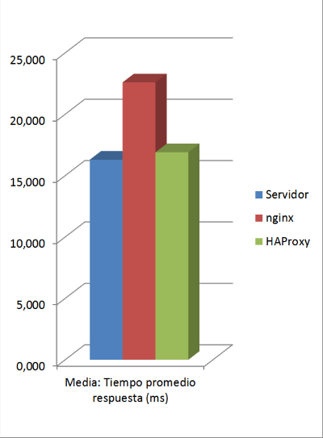

* Desviación estándar: Tiempo promedio de respusta (ms)

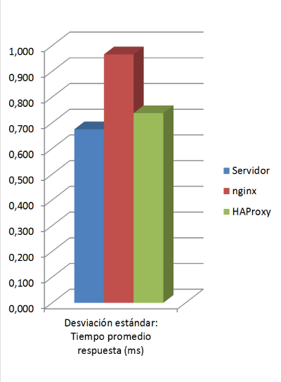

* Media: Número de peticiones por segundo

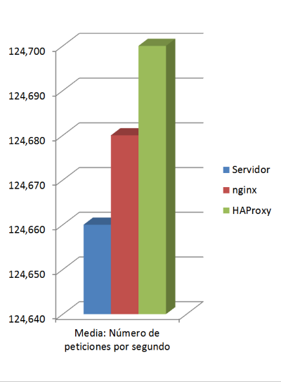

* Desviación estándar: Número de peticiones por segundo

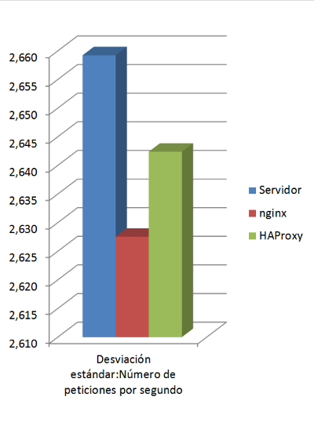
