Servidores Web de Altas Prestaciones
====================================
3º Grado en Ingeniería Informática 2012/2013
--------------------------------------------


# PRÁCTICA 5: Replicación de bases de datos de MySQL
### Germán Martínez Maldonado

El objetivo de esta práctica es configurar las máquinas virtuales para que la información contenida en sus bases de datos siempre esté actualizada, tendremos una máquina virtual con la base de datos principales y otra que tendrá la misma base de datos principal replicada completamente.

Para poder realizar sin problemas las tareas de replicación, necesitaremos acceder a la base de datos con el usuario **“root”**, por lo que necesitaremos la contraseña para acceder con dicha cuenta. Podemos cambiar esta contraseña fácilmente, lo primero es parar MySQL (`# service mysql stop`) y lo volvemos a iniciar en modo seguro sin que cargue la tabla de privilegios (`# mysqld_safe –skip-grant-tables`).

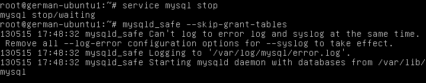

Ahora abrimos otro terminal, y podremos acceder como usuario **“root”** sin ser necesario introducir contraseña (`# mysql –u  root`), seleccionamos la base de datos que contiene los datos de los usuarios y ya podemos cambiar el la contraseña del usuario **“root”**. Solo nos queda actualizar los cambios realizados (`flush privileges`) y salir.

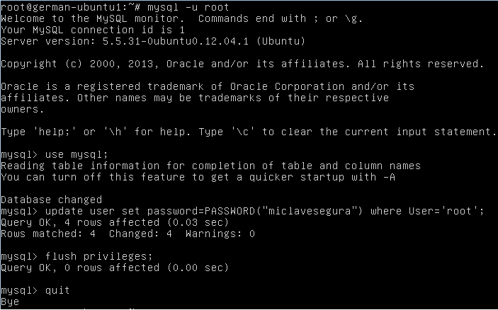

Para evitar posibles problemas, paramos e iniciamos MySQL y acto seguido buscamos su PID (`# ps aux | grep mysql`) y lo matamos (`# kill -9 PID`). Ya estamos seguros de que MySQL no está en ejecución, así que no tendremos problemas para acceder con la nueva contraseña actualizada de **“root”**.

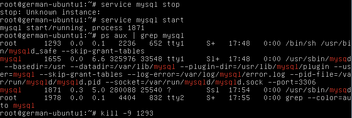

Como ahora el usuario **“root”** tiene contraseña, deberemos acceder con el comando `mysql –u root –p` y acto seguido introducimos la contraseña.

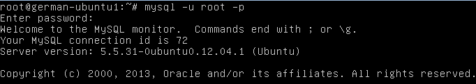

Lo siguiente es crear la base de datos, la seleccionamos y empezamos creando una tabla en su interior (la tabla **“datos”**). Ahora podemos insertar registros en su interior y, si queremos conocer la descripción de la tabla podemos usar `describe table`.

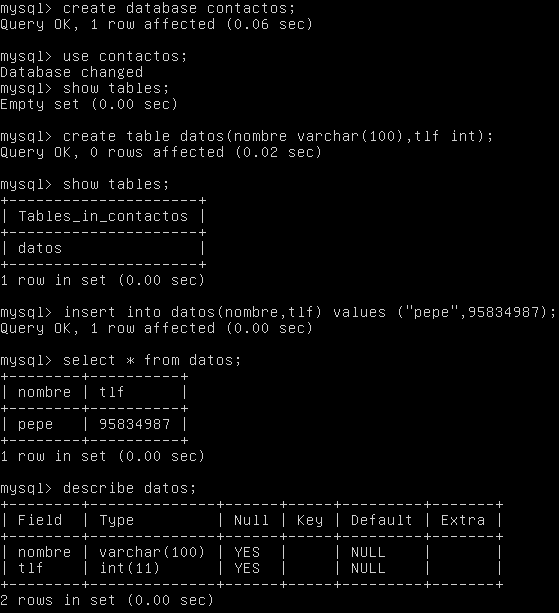

Llegamos a la parte de replicar la base de datos en un segundo servidor, lo primero es bloquear la base de datos principal para que se pueda cambiar nada.

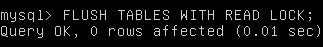

Para hacer una copia de la base de datos usamos la herramienta `mysqldump` introduciendo la siguiente línea de comando, teniendo en cuenta que debemos indicar la ruta del archivo donde se realizará la copia (un archivo .SQL) y se nos pedirá la contraseña de **“root”**.

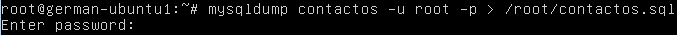

Ya podemos desbloquear la base de datos principal para que se pueda volver a trabajar con ella normalmente.

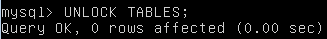

Ahora transferimos el archivo con la copia de seguridad a la máquina secundaria de la forma que prefiramos, en este caso hemos usado la herramienta `scp`:.

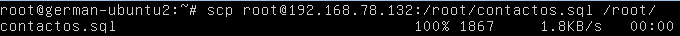

También en la máquina secundaria, accedemos a la base de datos con el usuario **“root”** y creamos una base de datos con el mismo nombre a la que creamos en la base de datos principal, ya que será en la que se copiaron los datos de la copia de seguridad.

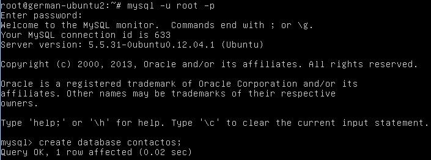

Nos salimos de MySQL y volvemos acceder, pero esta vez indicando que vamos a cargar un archivo .SQL con las sentencias para replicar la información de la base de datos de la máquina principal en la base de datos que acabamos de crear en la máquina secundaria.

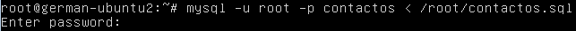

Si introducimos sentencias de selección o descripción de tabla, vemos que la base de datos de la máquina secundaria tiene la misma información que la base de datos de  la máquina principal.


## Replicación automática de la base de datos mediante una configuración maestro-esclavo

Para no tener que replicar manualmente siempre que se produzcan cambios en la base de datos, vamos a configurar el servidor de respaldo para que funcione como servidor esclavo que se actualice siempre que se produzca un cambio en el servidor principal, que será el que funciona como maestro. Lo primero que tenemos que hacer es editar el archivo de configuración **“/etc/mysql/my.cnf”** en el servidor maestro, los parámetros más importantes son `server-id` para indicar el identificador de nuestro servidor maestro, que le daremos el valor `1` y también `log_bin`, necesario para indicar el archivo binario donde se almacenarán las transacciones a realizar para mantener siempre el servidor esclavo actualizado, le daremos el valor `mysql-bin`. Para que estemos siempre seguros de que los datos están siendo constantemente actualizados, indicamos en `sync_binlog=1` que el registro binario se sincronice con el disco tras cada escritura que se produzca en él. El resto de parámetros que se muestran son para aspectos de los archivos de registro que también podemos incluir.

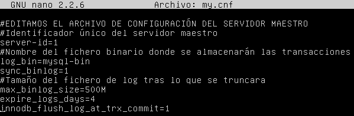

También en el mismo archivo de configuración, debemos comentar la línea `bind-address=127.0.0.1` para que el sistema escuche el resto de equipos de la red que no sean el propio host. Para que la configuración se haga efectiva, reiniciamos **“mysql”**.

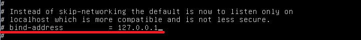

Ahora tenemos que crear el usuario que va a usar el servidor esclavo para conectarse al servidor maestro y actualizarse, para esto en el servidor maestro, vamos a crear el usuario con permisos de replicación (replication slave) `replislave` que se podrá conectar desde la dirección  IP  192.168.78.133  (la  dirección  IP  del  servidor  esclavo),  identificándose  con  la contraseña `pass`. Lo hacemos efectivo recargando la tabla de permisos con `flush privileges`.

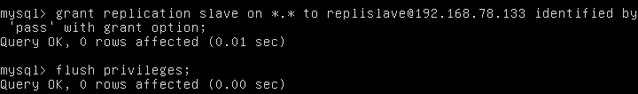

Necesitaremos una copia actual de la base de datos en el servidor maestro para aplicar en el servidor esclavo, así que la hacemos como vimos en la copia manual: primero bloqueamos las tablas de la base de datos (`flush tables with read lock;`), salimos de MySQL, creamos la copia (`mysqldump contactos –u root –p > /root/contactos.sql`), volvemos a entrar en MySQL para desbloquear las tablas (`unlock tables;`), salimos para transferir la copia al servidor esclavo (`scp contactos.sql root@192.168.78.133:~`); ahora en el servidor esclavo, accedemos a MySQL para crear la base de datos que vamos a importar (`create database contactos`), y aplicamos la copia sobre dicha base de datos (`mysql –u root –p contactos < contactos.sql`).

A continuación editamos el archivo de configuración de MySQL en el servidor esclavo, básicamente lo que tenemos que hacer es especificar un identificador único para este servidor, como el servidor maestro tiene el identificador `1`, a este servidor esclavo le vamos a dar `server-id=2`.

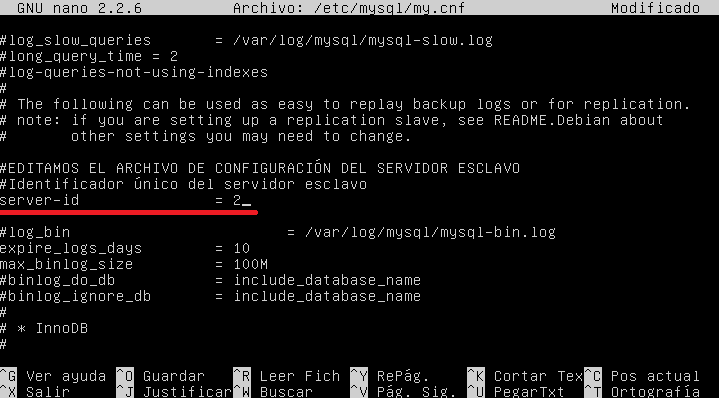

Comprobamos si la configuración hecha hasta el momento funciona, reiniciamos primero MySQL en el servidor esclavo, y desde él intentamos conectarnos remotamente al servidor maestro accediendo con el usuario que creamos antes (nombre de usuario `replislave` y contraseña `pass`); para ello usaremos la opción `-h` de MySQL al iniciar la conexión como se ve en la siguiente imagen:

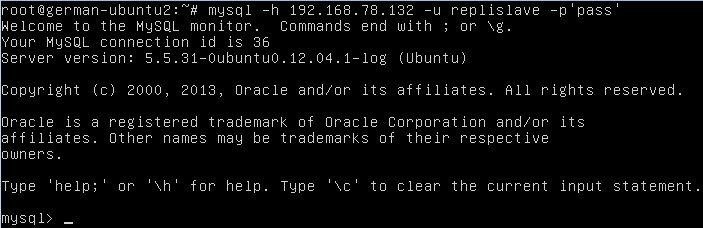

Para poder empezar con la sincronización, volvemos al servidor maestro, bloqueamos de nuevo las tablas (`flush tables with read lock;`) y buscamos la información sobre el archivo binario que almacena las transacciones al que hacíamos referencia en la configuración del servidor maestro (`show master status;`), nos interesa conocer el nombre de dicho archivo y la posición, para que a partir de ahí sea la información que utiliza nuestro servidor maestro para actualizarse.

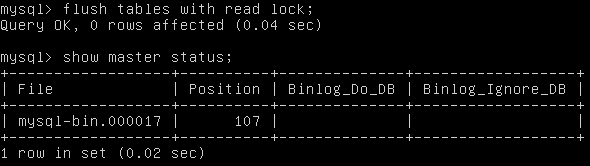

Volvemos al servidor esclavo, y le introducimos la información necesaria para que se pueda conectar al maestro con la consulta:

```
change master to 
master_host=’192.168.78.132’, 
master_user=’replislave’, 
master_password=’pass’, 
master_log_file=’mysql-bin.000017’, 
master_log_pos=107;
```

Siendo estos dos últimos valores los que hemos obtenido del estado del servidor maestro. Desbloqueamos las tablas en el servidor maestro (`unlock tables;`) e iniciamos el servidor esclavo para que funcione como esclavo (`start slave;`).

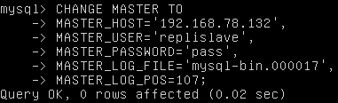

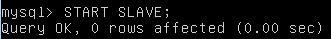

Comprobamos ahora que el **“esclavo”** está funcionando, para ello deberemos mostrar su estado, como la salida generada no puede ser mostrada en una sola pantalla, vamos a redirigir su salida a un archivo para visualizarla más fácilmente.

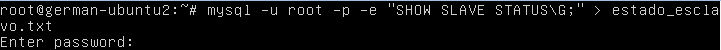

Siendo esta la salida obtenida con todos los valores actuales  de configuración del servidor esclavo, entre otros vemos la dirección del servidor maestro (**192.168.78.132**) o el usuario que usa para acceder al servidor maestro (**replislave**):

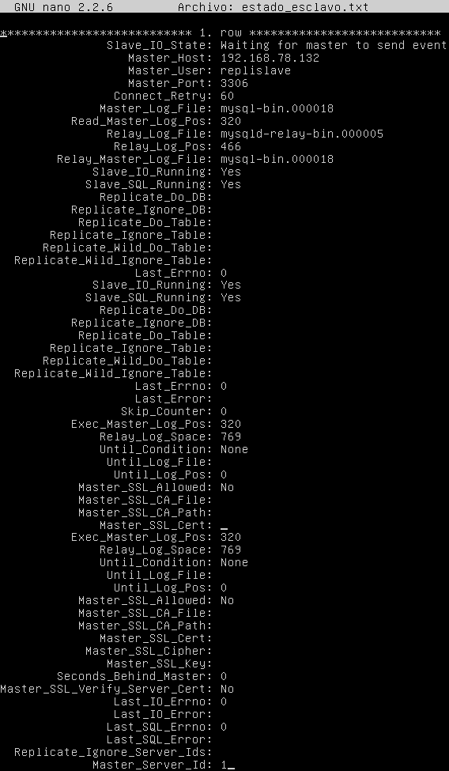

Ya con toda la configuración realizada, solo nos queda probar que la sincronización automática funciona correctamente, para esto, en el servidor maestro realizamos una consulta de selección de todos los datos en la tabla existente (`select * from datos`); en el maestro, mediante una consulta de inserción introducimos un nuevo valor en la base de datos; volvemos al esclavo y realizamos la misma consulta de selección, si se muestra el nuevo de registro que hemos introducido desde el servidor maestro, la sincronización automática estará funcionando, por lo que podemos dar por finalizada la configuración.

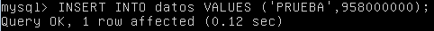

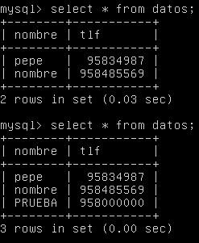
