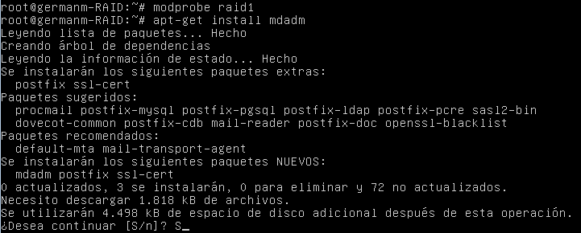
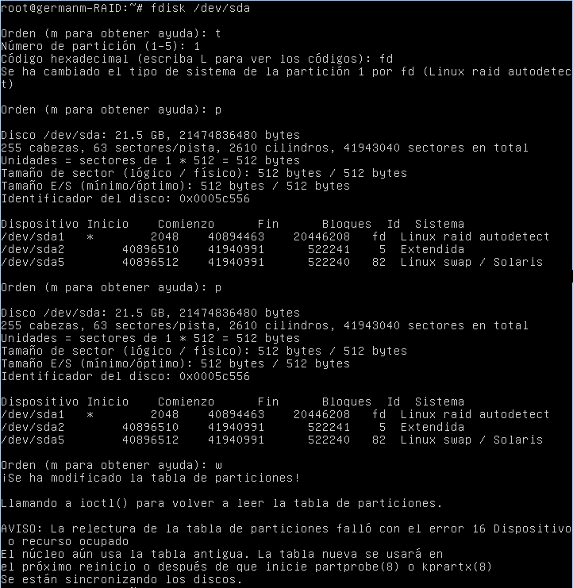
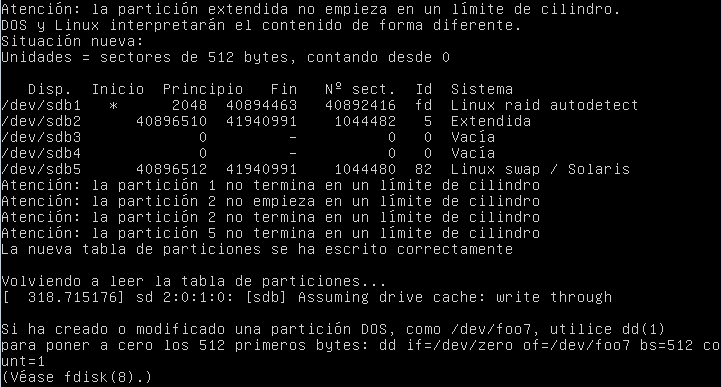
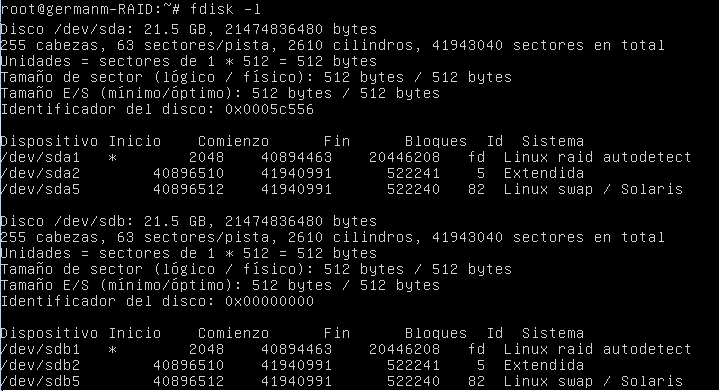
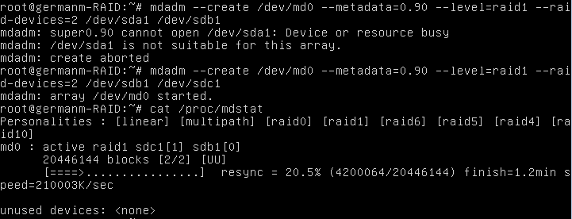
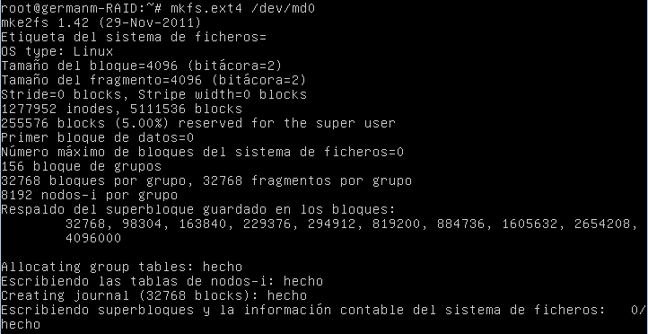
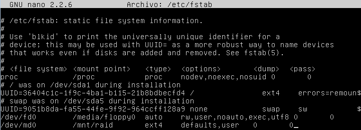
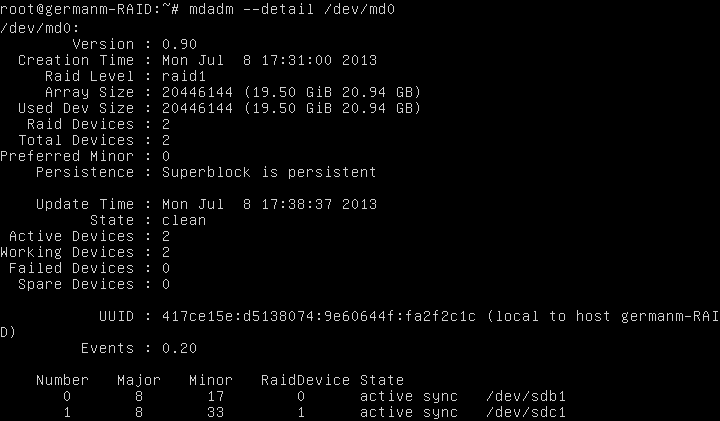

Servidores Web de Altas Prestaciones
====================================
3º Grado en Ingeniería Informática 2012/2013
--------------------------------------------


# Configurar RAID en Ubuntu Server
### Germán Martínez Maldonado

El objetivo de este trabajo es realizar la configuración de un sistema RAID1 en un sistema Ubuntu Server 12.04, para ello partiremos de una máquina virtual que contiene 2 discos duros, encontrándose el sistema operativo instalado en uno de ellos, el otro disco duro no tiene formato ni tabla de particiones definida. Para  evitar posibles problemas, lo primero que hacemos es cargar el módulo de RAID1 **“raid1”** en el kernel con `# modprobe raid1`. Lo siguiente será instalar **"mdadm"**, la utilidad de Linux utilizada para administrador dispositivos RAID software.



A continuación comprobamos la tabla de particiones de ambos discos duros con `fdisk -1`, la partición que nos va a interesar es **“sda1”**, que es la que contiene todos los datos, la otra es únicamente una partición swap. También vemos que **“sdb”** está completamente vacío.


Para poder montar el sistema RAID, la partición a formar parte del sistema debe estar en formato reconocible por RAID, así que vamos a cambiar el tipo de partición **“sda1”** de **“ext4”** a **“Linux raid autodetect”**. Lo hacemos con `fdisk /dev/sda`, opción `t`, número de partición `1` y código hexadecimal `fd`. Antes de aplicar los cambios, con la opción `p`, comprobamos lo que acabamos de hacer; finalmente, aplicamos los cambios con la opción `w`.



Ya tenemos el primer disco duro con la partición **“sda1”** en formato RAID, ahora tenemos que darle formato  y una tabla de partición el segundo disco  duro, para facilitarnos el trabajo vamos a copiar la misma tabla de particiones del primer disco duro en el segundo con `sfdisk -d /dev/sda | sfdisk /dev/sdb`, que es lo que muestra la siguiente imagen.



Volvemos a comprobar la tabla de particiones de ambos discos, y vemos que ambos tienen la misma tabla de particiones, siendo la primera partición de ambos una partición RAID.



Así que ya sin más pasamos a crear el RAID mediante `mdadm --create /dev/md0 -- metadata=0.90 --level=raid1 --raid-devices=2 /dev/sda1 /dev/sdb1`,  donde `/dev/md0` el RAID software que vamos a crear, `--metadata=0.90` para usar metadatos compatibles con gestores de arranque, `--level=raid1` el tipo de RAID que vamos a usar, `--raid-devices=2` el número de dispositivos que van a componer el sistema RAID, y `dev/sda1 /dev/sdb1` las particiones que van a componer dicho sistema RAID. Aquí nos vamos a encontrar un problema, es que por algún motivo el disco duro en el que se instala el sistema operativo queda **“bloqueado”** de forma que no se pueda añadir al RAID, obteniendo siempre el mensaje de **“dispositivo o recurso ocupado”**.

En varias páginas web dan diferentes soluciones como editar los parámetros de arranque en el kernel para iniciar el modo único usuario (single) o que no se cargue el descubridor de bloques y dispositivos RAID software `dmraid` (nodmraid). Otra solución que se da es buscar el dispositivo correspondiente con `dmsetup table` y eliminarlo del mapeador de dispositivos con `dmsetup remove <drive id>` para dejar de obtener este error. Por más que he probado ambas soluciones, ninguna ha funcionado, así que he añadido un tercer disco duro a la máquina virtual, le dado también la misma tabla de particiones como hice con el segundo disco duro, y ya si he podido crear el RAID sin problemas. Podemos comprobar que el RAID está en funcionamiento si observamos el contenido del archivo **“/proc/mdstat”**, en nuestro caso, como acabamos de crear el RAID, vemos que ponen que se está sincronizando (`resync`).



Una vez con el RAID creado, vamos a darle formato, como las particiones sobre las que montamos el RAID tenían originalmente un formato **“ext4”**, usaremos `mkfs.ext4` para darle este formato a nuestro RAID **“/dev/md0”**.



Para poder montar nuestro RAID vamos a añadirlo al archivo **“/etc/fstab”**, previamente habremos creado el directorio en el que vamos a montarlo (/mnt/raid), así que solo nos queda añadir la línea siguiente a dicho archivo:

```
/dev/md0     /mnt/raid     ext4     defaults,user   0     0
```

Acto seguido ya podremos montar nuestro RAID con `mount /mnt/raid`.



Con nuestra RAID ya configurado y funcionando, podremos ver el estado actual mediante `mdadm --detail /dev/md0`. Vemos que está funcionando y la sincronización está activa en todos los dispositivos que  componen el RAID (`State: active sync`)


