Servidores Web de Altas Prestaciones
====================================
3º Grado en Ingeniería Informática 2012/2013
--------------------------------------------


# Seguridad en Apache
### Germán Martínez Maldonado
### Pablo Sánchez Robles

## [ENLACE A LA PRESENTACIÓN](presentacion.md)

## Elementos básicos de configuración

Vamos a tratar sobre la seguridad en servidores Apache, todo lo referente al tema de seguridad deberemos especificarlo en los archivos de configuración, dependiendo de la distribución de Linux que usemos, el archivo de configuración principal se llamará **“httpd.conf”** o **“apache2.conf”**. Dentro de los muchos aspectos a destacar en la configuración de Apache deberíamos destacar:

Los parámetros globales: son los que se establecen para todo el servidor en general, por eso cada uno de estos debe ser especificado de forma independiente, sin estar asociado a ningún otro elemento de la configuración. Entre los elementos más importantes de esta categoría podemos encontrar:

* **Listen**: indica el puerto del que escuchará Apache para iniciar el servicio.
* **PidFile**: indica la  ubicación  donde  se  creará el  fichero  con el PID  del proceso  del servidor.
* **ServerRoot**: indica la ubicación de la instalación del servidor web en el sistema.
* **Timeout**: indica el tiempo que esperará el servidor en procesar las peticiones de los clientes, si una petición tardase más, el servidor responderá dicha petición con un error **“Timeout”**.

Las directivas Apache: son parámetros que también se establecen a todo el servidor, pero a diferencia de estas, no son obligatorias por tratar opciones de configuración, que no son de una importancia tan grande para el funcionamiento del servidor como son los parámetros globales. Algunas directivas a destacar:

* **ServerName**: indica el nombre que tendrá el servidor web.
* **ServerAdmin**: indica la dirección de correo electrónico del administrador del servidor web.
* **DocumentRoot**: indica la ruta donde se encuentran los directorios y ficheros que están almacenados en el servidor web.
* **DirectoryIndex**: indica el archivo  de la página que será cargado por defecto si se introduce la dirección raíz del servidor web.

Las directivas de sección: son directivas que suelen estar relacionadas con el control de acceso a ficheros (directorios, archivos, sitios…) y permiten establecer diferentes niveles de configuración, que son:

* **Allow**: para especificar direcciones, dominios o variables que pueden tener acceso a un determinado recurso.
* **Deny**: para  indicar  justo  lo  contrario  que  Allow,  elementos  que  no  pueden tener acceso a un determinado recurso
* **Order**: para indicar si se permite el acceso por defecto y se deniega solo a los elementos indicados (Order allow, deny) o, si se deniega el acceso por defecto y solo se permite a los elementos indicados (Order deny, allow).

También deberemos tener en cuenta que en una máquina puede haber más de un servidor web, estos son conocidos como servidores virtuales, y están basados en la posibilidad de que los sitios web, pueden estar basados en direcciones IP diferentes (por lo que cada servidor virtual debería tener su propia dirección IP) o estén basados en nombres diferentes, por lo que varios sitios web pueden estar funcionando bajo una misma dirección, siendo esta última opción la más interesante, por las posibilidades que ofrece. En lo que respecta a la configuración, también usaran las directivas indicadas anteriormente como **“DocumentRoot”** o **“ServerName”**.


## Ficheros .htaccess

A parte del fichero de configuración principal, tenga el nombre que tenga en función del sistema operativo o distribución utilizada, en todos podemos usar además unos archivos de configuración externos, estos son los ficheros **“.htaccess”**. Dichos ficheros nos  permitirán definir diferentes directivas de configuración para un directorio específico, esto sin tener que cambiar la configuración principal de Apache, con lo que conseguiremos tener una configuración de Apache más modular  lo que en grandes entornos en los que queremos configuraciones muy específicas para diferentes secciones puede ser interesante.

La contrapartida la podemos encontrar en que precisamente si el entorno es grande, el servidor deberá buscar el fichero .htacess correspondiente en todos los ficheros que haya hasta llegar al fichero o directorio solicitado para aplicar su configuración correspondiente, por lo que esto puede tener un repercusión negativa en el rendimiento del servidor. La acción recomendada es activarlo solo en las configuraciones a nivel de directorio específico.

Para activar el uso de los ficheros .htaccess deberemos incluir la directiva **“AllowOverride”**, pero además dicha directiva puede tener diferentes valores que indicaran que directivas podremos incluir a su vez en los archivos .htacess:

```
AllowOverride [All/None] | [AuthConfig] [FileInfo] [Indexes] [Limit] [Options]
```

* **All**: indica que todas las directivas son permitidas.
* **None**: indica que no está permitida la configuración desde estos archivos externos.
* **AuthConfig**: indica que se permite el uso de directivas de autorización (*AuthDBMGroupFile, AuthDBMUserFile, AuthGroupFile, AuthName, * AuthType, AuthUserFile, Require,* etc...)
* **FileInfo**: indica que ser permite el uso de directivas de control de tipo de documentos (*DefaultType, ErrorDocument, ForceType, LanguagePriority, SetHandler, SetInputFilter, SetOutputFilter,* etc…)
* **Indexes**: indica que ser permite el uso de directivas de control de índices de directorios (*AddDescription, AddIcon, AddIconByEncoding, AddIconByType, DefaultIcon, DirectoryIndex, FancyIndexing, HeaderName, IndexIgnore, IndexOptions, ReadmeName,* etc…)
* **Limit**: indica que ser permite el uso de directivas de acceso a hosts (*Allow, Deny y Order*).
* **Options**: indica que se permite el uso de la directiva Options.


## Recomendaciones de seguridad

Como podremos imaginarnos la configuración de un servidor puede abarcar muchos aspectos, nuestro objetivo es centrarnos es la seguridad, por eso vamos a dividir las recomendaciones sobre seguridad en diferentes subsecciones cada una con un objetivo más concreto.

### Seguridad en la instalación y configuración inicial

Cuando nos planteamos mejorar la seguridad de un servidor, lo primero que deberíamos plantearnos, es conocer la configuración actual de nuestro servidor, ya que no en todos los sistemas las rutas o los nombres de archivos son iguales como ya también hemos indicado antes. Usando el archivo el comando **“apache2ctl –V”** obtendremos información sobre la instalación y los diferentes archivos de configuración. En este caso podemos comprobar que la carpeta raíz de Apache es **“/etc/apache2”** y el archivo de configuración **“apache2.conf”**:

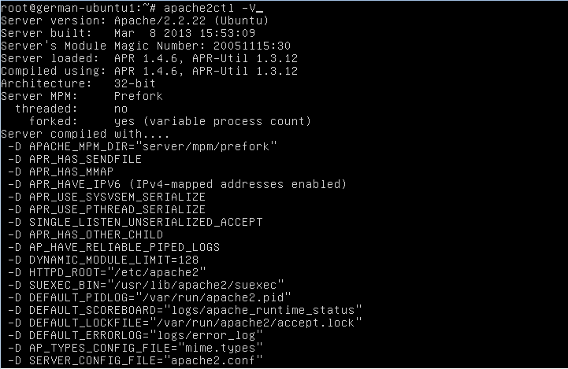

En cuanto pongamos el servidor en funcionamiento, también deberíamos desactivar los módulos que no vayamos a utilizar, porque así obtendremos como beneficio directo la mejora del rendimiento del servidor, pero además como beneficio indirecto en seguridad, porque así el número de posibles vulnerabilidades que pudieran aparecer contra nuestro sistema será menor.

### Seguridad en el acceso al contenido disponible

Antes hemos hablado de como podíamos establecer diferentes niveles de configuración usando directivas de sección, generalmente un acceso más restrictivo, es un acceso  más seguro, por lo que deberíamos denegar por defecto (**Order Deny, Allow**) el acceso a todos los elementos, e ir configurando uno a uno a los que queremos que cada usuario tenga acceso, aquí entrará mucho en juego la directiva **“<Directory>”**, ya que nos permitirán aplicar unas directivas de acceso a un directorio y a todos sus subdirectorios, pudiendo también incluir otras directivas **“<Directory>”** más específicas para sus subdirectorios.

Otro aspecto con el que deberíamos tener cuidado es con el uso de enlaces simbólicos. El peligro de los enlaces simbólicos es que se puede producir el caso de que Apache reciba una petición que el sistema operativo reconozca como enlace simbólico, y en la resolución devuelva un archivo al que apunta que esta fuera del **“DocumentRoot”**, por lo que no debería estar accesible desde el servidor, pudiendo crear una grave brecha de seguridad en la confidencialidad de nuestro servidor. Podemos o bien desactivar completamente los enlaces símbolicos con **“Options –FollowSymLinks”** ó, solo permitirlos si el archivo destino permanece al mismo que usuario que el enlace simbólico **“Options –FollowSymLinks +SymLinksIfOwnerMatch”**.

### Seguridad en la visibilidad de la información

Debemos tener en cuenta que cuanta más información demos de nuestro servidor, más fácil será encontrar vulnerabilidades con las que atacarnos, es por eso que tenemos que hacer solo visible la información totalmente necesaria. En este aspecto, una de las primeras consideraciones que podemos tener es deshabilitar el listado de ficheros, que permite que cuando se accede a un directorio se muestre todo el contenido de dicho directorio, es por eso que se recomienda que a través del uso de la directiva **“Options”** se desactive que se pueda visualizar el contenido del directorio raíz y todos sus subdirectorios. Esto lo podemos hacer introduciendo la siguiente directiva de sección al directorio raíz:

```
<Directory />
    Order Deny, Allow
    Deny from all
    Options None
    AllowOverride None
</Directory>
```

Pero además, podemos querer que nuestro servidor se comporte de manera determinada en función de un tipo de archivo específico, ya que por ejemplo tenemos ficheros de configuración **“.httaccess”** de los que hemos hablado antes o los archivos **“.htpasswd”**, que es un archivo que contiene una lista de nombres de usuario y contraseñas, por  lo que nos querremos que se pueda acceder externamente a ellos. Para esto podríamos usar las directivas **“Files”** y **“FilesMatch”**. Ambas directivas funcionan igual, si introducimos el ejemplo siguiente, no permitiríamos el acceso a los archivos con un nombre que comenzase con **“.ht”**. Si lo que quisiéramos filtrar fueran directorios, deberíamos usar la directiva **“DirectoryMatch”**, por ejemplo para evitar que se acceda a los directorios CVS:

```
<Files ~ ”**^\.ht”**>
    Order Allow, Deny
    Deny from all
</Files>
```

```
<FilesMatch ~ ”**^\.ht”**>
    Order Allow, Deny
    Deny from all
</FilesMatch>
```

```
<DirectoryMatch /CVS/>
    Order Allow, Deny
    Deny from all
</DirectoryMatch>
```

Además de ocultar la información de archivos y los propios archivos, deberíamos ocultar lo máximo posible la información sobre nuestro servidor, el problema es que las cabeceras de respuesta HTTP dan información que posiblemente nosotros no quisiéramos que se conociera, como es la versión de Apache instalada y bajo qué sistema operativo para prevenir posibles ataques provenientes de esta información. Para eso usaremos la directiva **“ServerTokens Prod”**, que nos permitirá la información, sólo indicando que es un servidor Apache.

* Cabecera con información del servidor;
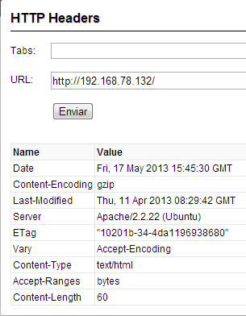

* Cabecera sin información del servidor;
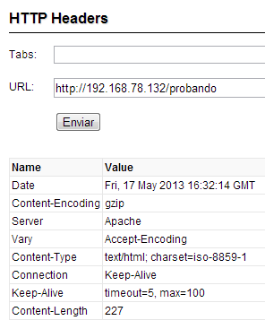
	
Como último punto de la seguridad en la visibilidad de la información de nuestro servidor vamos a revisar las páginas generadas automáticamente. La directiva **“ServerSignature”** es la que establece si mostraremos la versión del servidor, el correo del administrador y el nombre del servidor virtual en las páginas generadas. Pudiendo tomar los valores **“On”** (mostrar todo), **“Off”** (no mostrar nada) y **“Email”** (mostrar sólo la dirección del administrador). Y mediante la directiva **“ErrorDocument numError texto|documento”** podemos modificar el texto que se mostrará en caso de que se produzca un error determinado para no dar pistas sobre posibles errores en nuestro servidor. Podemos ver un ejemplo de ventana generada por defecto y otra personalizada sin información sobre el servidor.

* Página de error por defecto:
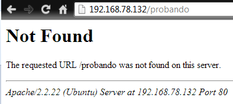

* Página de error personalizada:
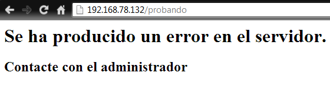

### Seguridad en la autenticación

Si queremos también podemos establecer un mecanismo clásico de acceso a ciertos directorios mediante la introducción de un usuario y contraseña. En Apache podemos usar dos métodos: **“Basic”**, el nombre de usuario y la contraseña van sin cifrar hasta el servidor o **“Digest”**, el nombre de usuario y la contraseña van cifrados del cliente al servidor. Nos basaremos en la directiva **“Directory”** y deberemos tener en cuenta los siguientes parámetros:

* **Directory**: el propio directorio que vamos a asegurar con identificación mediante contraseña.
* **AuthName**: el nombre del dominio de autenticación.
* **AuthUserFile/AuthDigestFile**: el fichero con los nombres de usuarios y sus correspondiente contraseñas. En función del tipo de seguridad, usaremos uno u otro, porque el formato de los mismos es diferente.
* **Require**: indicamos los usuarios que tienen acceso. Puede tomar 3 valores: **“valid- user”**, cualquier usuario que este en el fichero anterior; **“user <listaUsuarios>”**, lista de usuarios separados por comas que pueden acceder; **“group <listaUsuarios>”**, lista de grupos, separados por comas que pueden acceder. Requiere que incluyamos la directiva **“AuthGroupFile”** con el fichero que contiene los grupos.

Ejemplo de uso con **“Basic”** y con **“Digest”**, también podemos indicar que vamos a usar **SSL** incluyendo la directiva **“SSLRequireSSL”**:

```
<Directory "/var/www/private"> 
    SSLRequireSSL
    AuthName "privado" 
    AuthType Basic 
    AuthUserFile
    /etc/apache2/conf.d/passwd_basic 
    Require valid-user
</Directory>
```

```
<Directory "/var/www/private">
    SSLRequireSSL
    AuthName "privado"
    AuthType Digest
    AuthDigestFile
    /var/www/conf/passwd_digest
    Require valid-user
</Directory>
```

Para crear los usuarios del método **Basic**, usaremos `htpasswd`, si el archivo de usuarios no existe, usaremos el argumento `-c` para crearlo, y usaremos `-b` para añadir la contraseña:

```
# htpasswd [-c] [-b] /etc/apache2/conf.d/passwd_basic usuario [contraseña]
```

Para crear los usuarios del método Digest, usaremos `htdigest`, como con el anterior, usaremos el argumento `-c` para crear el archivo en caso de que no exista. Digest no permite introducir la contraseña desde línea de comandos:

```
# htdigest [-c] /etc/apache2/conf.d/passwd_basic usuario
```

### Seguridad en la autenticación mediante protocolos seguros

Acabamos de explicar cómo configurar una autenticación básica, pero que además de simple, está orientada a un entorno más concreto como un directorio, sin embargo, para dar seguridad en una web en una web es más recomendable usar protocolos destinados a dicho fin como HTTPS y SSL, ya que esto nos permite que todos los datos que se transfieran entre el cliente y el servidor vayan cifrados.

Para  comenzar  con  la  configuración,  deberemos  instalar  antes  que  nada  el  paquete
**“openssl”**. Para poder realizar la autenticación necesitamos varios elementos:

**“Certificación de Autoridad” (Certification Authority, CA)**, este certificado será el que hará que cualquier cliente se conecte a nuestro servidor con confianza. Normalmente, se paga a terceras entidades que son las que firman nuestro certificado para establecer que somos de confianza, en nuestro caso, vamos a autofirmarnos el certificado para la prueba.
**“Clave Privada RSA” (RSA Private Key)**, es el archivo para descifrar los mensajes que se reciban, cuya clave pública permite a cualquiera cifrar los mensajes que nos manden, esos mensajes solo podrán ser descifrados con la clave privada que solo nosotros conocemos.

**“Solicitud de Firma de Certificado” (Certificate Signing Requets, CSR)**, que será el archivo que contiene la clave pública y nuestro nombre.

**“Certificado” (Certificate, CRT)**, con el CSR firmado por el CA, obtenemos el CRT. Este fichero contiene nuestra clave pública, nuestro nombre, el nombre del CA y la firma digital del CA. Si el certificado está firmado por un CA reconocido, ninguna entidad tendrá inconveniente alguno en establecer una conexión segura con nuestro servido.

Podemos generar todos los archivos necesarios de una vez, para ello introducimos la orden siguiente, en la que estamos indicando que vamos a crear un fichero de clave privada (usando RSA para una clave de 2048 bits) y un certificado que vamos a autofirmar, siendo válido por 365 días:

```
# openssl req –x509 –nodes –days 365 –newkey rsa:2048 –keyout /etc/apache2/ssl/apache.key –out /etc/apache2/ssl/apache.crt
```

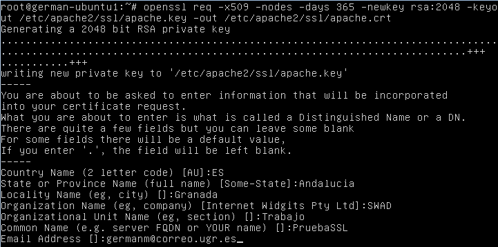

Nos queda pasar a configurar Apache, lo primero será activar el módulo SSL de Apache con el comando `a2enmod ssl`, y agregamos al fichero de configuración **“/etc/apache2/ports.conf”** la línea `NameVirtualHost *:443`, para que así podamos configurar host virtuales con SSL.

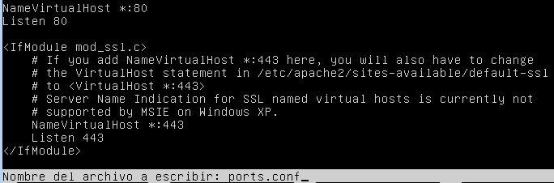

Para comprobar que todo funciona, tenemos que crear un host virtual SSL, para ello lo primero es crear el archivo del sitio, que para nuestro ejemplo va a ser **“/etc/apache2/sites-availables/PruebaSSL”**, una vez creado dicho archivo, introducimos en él las siguientes líneas:

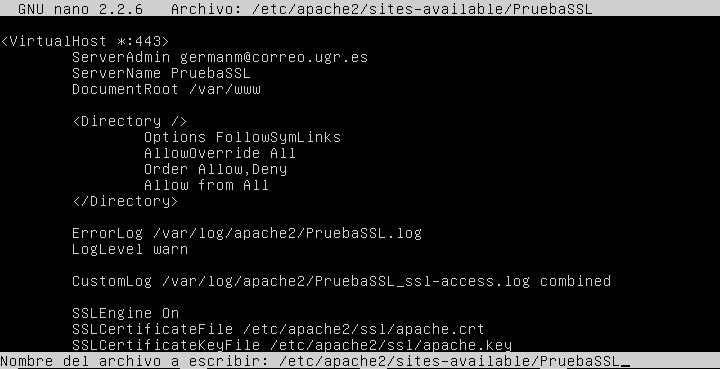

Ya solo nos queda habilitar el sitio de nuestra prueba SSL, debemos tener en cuenta que como hemos indicado que nuestro **“DocumentRoot”** es **“/var/www”**, en esta ruta debe existir una carpeta **“PruebaSSL”** que será la que contendrá nuestro sitio web seguro. Habilitamos el sitio con **“a2ensite PruebaSSL”** y reiniciamos Apache.

Ahora solo nos queda comprobar que nuestro sitio es accesible mediante un conexión SSL, para ello introducimos en un navegador la dirección de acceso a nuestra página de prueba segura pero mediante HTTPS, como el certificado ha sido firmado por nosotros mismos, el navegador no va a reconocernos como sitio de confianza, pero si nos permitirá establecer la conexión segura:

* Aviso de no confianza por el navegador:
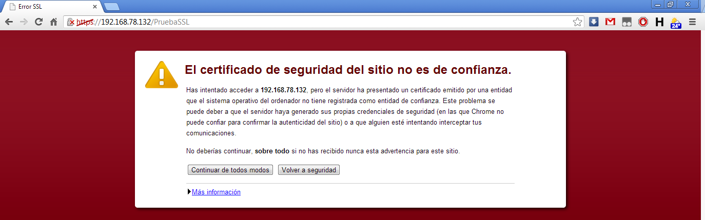

* Información general sobre nuestro certificado:
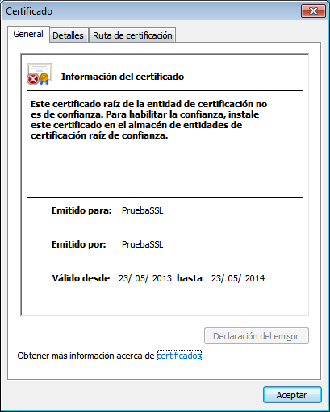

* Información detallada sobre nuestro certificado:
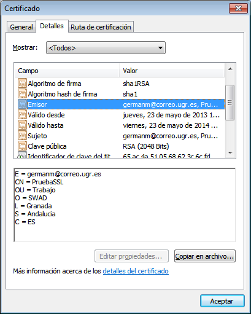

### Seguridad en la ejecución de aplicaciones

Apache permite dos formas de servir páginas web dinámicas, por un lado tenemos el mecanismo de **módulos**, el intérprete o máquina virtual que se encuentran integrados en el proceso Apache, y por otro lado **CGI** que son funcionalidades provenientes de procesos externos. La ejecución de módulos es más eficiente, pero tiene el problema de que todas las ejecuciones se harán bajo el mismo usuario del servidor Apache, por lo que todos los usuarios podrían ver los scripts del resto de usuarios lo que sería un problema. La ventaja de usar CGI es que si podemos establecer diferentes permisos y al ser un proceso externo, si se cuelga, no afecta al servidor, como si afectaría el cuelgue de un módulo.

La gestión de los módulos la podremos hacer usando archivos **“.htacess”**, para el control de CGI, mediante la directiva **“ScriptAlias”** podremos indicar la ruta de acceso a los scripts y el directorio donde se encuentran en el servidor, para que los scripts contenidos en ese directorio puedan ser contenidos. Ej: **“ScriptAlias /cgi-bin/ /usr/lib/cgi-bin/”**.

Por seguridad, la carpeta que contenga los scripts debe estar fuera del **“DocumentRoot”**, pero para asegurarnos que no se ejecutan scripts en el **“DocumentRoot”** podemos usar la directiva **“Options –ExecCGI”**. Pero no sólo podemos encontrarnos scripts CGI, también es muy posible que se ejecute código PHP, por lo que usando la directiva **“FilesMatch”**, nos aseguraremos que todo archivo con extensión PHP sea servido por la librería dinámica **“libphp.so”**, para así asegurarnos que no se pueda acceder al código fuente:

```
Action application/x-httpd-php modules/libphp.so
<FilesMatch **“\.php$”**>
    SetHandler application/x-httpd-php
</FilesMatch>
```

Otro elemento con el que deberemos tener cuidado es con las inyecciones de código SQL, ya que es posible que podamos ser atacados mediante la inyección de fragmentos de código SQL en las variables que se almacenen en nuestra memoria. Para protegernos ante esto, lo primero que deberemos es activar el módulo `mod_rewrite`, que nos reescribir la URL’s al vuelo, algo que nos será particular útil en este caso. Para activar este módulo desde un terminal introducimos el comando `a2enmod rewrite`. Ahora simplemente introduciendo en la configuración el siguiente conjunto de reglas conseguiremos filtrar un gran número de ataques de este tipo:

```
RewriteCond %{QUERY_STRING} (;|<|>|’|”**|\)|%0A|%0D|%22|%27|%3C|%3E|%00).*(/\*|union|select|insert|cast|set|decl are|drop|update|md5|benchmark) [NC,OR]
RewriteCond %{QUERY_STRING} \.\./\.\. [OR]
RewriteCond %{QUERY_STRING} (localhost|loopback|127\.0\.0\.1) [NC,OR] RewriteCond %{QUERY_STRING} \.[a-z0-9] [NC,OR]
RewriteCond %{QUERY_STRING} (<|>|’|%0A|%0D|%27|%3C|%3E|%00) [NC]
RewriteRule .* - [F]
```

Además también es posible que queramos que nuestro servidor no respondan a los agentes de herramientas de búsqueda y explotación de vulnerabilidades o de gestores de descarga, por lo que podríamos filtrar estas respuestas usando el siguiente conjunto de reglas también basadas en `RewriteCond` y `RewriteRule`:

```
RewriteCond %{HTTP_USER_AGENT} ^$ [OR]
RewriteCond %{HTTP_USER_AGENT} ^(java|curl|wget) [NC,OR] RewriteCond %{HTTP_USER_AGENT}
(winhttp|HTTrack|clshttp|archiver|loader|email|harvest|extract|grab|miner) [NC,OR] RewriteCond %{HTTP_USER_AGENT} (libwww-perl|curl|wget|python|nikto|scan) [NC,OR]
RewriteCond %{HTTP_USER_AGENT} (<|>|’|%0A|%0D|%27|%3C|%3E|%00) [NC]
RewriteRule .* - [F]
```

### Seguridad en ataques de denegación de servicios

Los ataques de denegación de servicios es aquel cuyo objetivo es saturar los recursos del servidor de peticiones para que los usuarios legítimos nos puedan acceder a los recursos del mismo, independientemente de la cantidad de recursos de los que disponga. Hay varios tipos de ataques como:

* **Ataques por fuerza bruta**: se basan en generar un gran número de peticiones **HTTP** hasta que el servidor no pueda responder a todas y se sature.
* **SYN Flood**: funcionan como el anterior, por saturación, pero en vez de peticiones **HTTP**, se comunica mediante **TCP/IP**, cuando se establece la conexión envía el SYN inicial, el servidor le responde con **SYN-ACK**, pero el atacante no responde con **ACK**,
bien porque la dirección de origen sea falsa o porque la dirección IP real no solicitó dicha conexión, por lo que el servidor se acabara saturando por tanto intento de conexión. En Linux esto se puede solucionar usando **“SYN cookies”**, que solo reserva espacio para la conexión si recibe el mensaje de confirmación final. Se activa con el comando: 

```
# echo 1 > /proc/sys/net/ipv4/tcp_syncookies
```

* **Hot-linking**: consiste en enlazar en webs archivos de la web atacada con el objetivo que cuando se visite una de estas webs atacantes se realice un gran uso de ancho de banda de la web atacada. La web atacada puede que no sepa que sus recursos están siendo usados sin su permiso además de que su servidor puede terminar saturado. Se puede solucionar usando un conjunto de reglas de `mod_rewrite` para que se prohíban todas las peticiones a archivos cuya cabecera `HTTP_REFERER` (el sitio que ha realizado la petición) no sea el propio sitio web:

```
RewriteCond %{HTTP_REFERER} !^$
RewriteCond %{HTTP_REFERER} !^http://mipaginaweb\.es [nocase] 
RewriteRule (\.gif|\.jpg|.\png|\.swf)$ $0 [forbidden]
```

Pero que el servidor caiga saturado no tiene  que venir  únicamente motivado por  un ataque, también es muy posible que termine así  si  no le configuramos correctamente la cantidad de peticiones concurrentes que va a procesar en función de los recursos del sistema. Lo primero a tener en cuenta es el modelo de gestión de peticiones que esté utilizando Apache, los **“multiprocessing modules”** o MPMs. Podemos encontrar:

* **prefork**: usa múltiples procesos, cada proceso responde a una petición. Por defecto en Linux.
* **winnt**: un proceso con muchos hilos de ejecución. Se usa en Windows.
* **worker**: varios procesos con varios hilos.

Para configurar la concurrencia las directivas que vemos incluir son:

* **MaxRequestWorkers** (MaxClients en versiones anteriores a las 2.3.13): para establecer el número máximo de peticiones que se atenderán concurrentemente.
* **ServerLimit**: para indicar el valor máximo que le podemos asignar a la directiva anterior.
* **ListenBacklog**: para indicar el tamaño máximo de la cola de las peticiones concurrentes que queden en espera.
* **MaxSpareServers**: para indicar el número máximo de procesos inactivos, si el número de procesos inactivos es mayor que el indica, el proceso padre los elimina.
* **LimitRequestBody**: para indicar en bytes (desde 0 que es ilimitado, hasta 2147483647 como máximo que son 2GB), el tamaño máximo de los archivos que se pueden subir al servidor.

Para finalizar, el último consejo que tenemos, es que es recomendable en cualquier situación es monitorizar el uso de los recursos en nuestro servidor, para ello podemos usar el módulo **“mod_status”**. La información que nos dará dicho módulo es:

* El número de trabajadores para atender solicitudes.
* El número de trabajadores inactivos.
* El estado de cada trabajador, el número de peticiones que ha atendido y el número total de bytes que ha servido. (*)
* El total de número de accesos y número de bytes servidos. (*)
* Cuando se inició/reinicio el servidor y cuando tiempo lleva funcionando.
* Promedio de solicitudes por segundo, bytes servidos por segundo y promedio de bytes servidor por solicitud. (*)
* El porcentaje de uso de CPU por cada trabajador y el total de uso de la CPU. (*)
* Los hosts y las peticiones que están siendo procesados. (*)

Las características marcadas con (*) requieren que la directiva **“ExtendenStatus”** tenga el valor **“On”**. Para activar la monitorización deberemos incluir en la configuración la siguiente directiva:

```
ExtendedStatus On
<Location /server-status> 
    SetHandler server-status 
    Order deny,allow
    Deny from all
    Allow from 192.0.2.0/24
</Location>
```

Accederemos a la información de estado introduciendo la dirección del host seguido de **“/server-status”**, pudiendo además pasarle por URL los parámetros **“refresh=N”** para que el resultado se actualice cada N segundos y, **“auto”** para que el resultado se muestren en modo texto y puedan ser más fácilmente procesados.


## Vulnerabilidades Apache

Para comenzar a explicar las posibles vulnerabilidades que tiene o ha tenido Apache convendría tener claro el concepto de Exploit puesto que los vamos a utilizar para aprovechar las mismas vulnerabilidades y hay que saber que significa. La definición propuesta en wikipedia es la siguiente:

*“**Exploit** (del inglés to exploit, explotar o aprovechar) es una pieza de software, fragmento de datos o secuencia de comandos y/o acciones, utilizada con el fin de aprovechar una vulnerabilidad de seguridad de un sistema de información para conseguir un comportamiento no deseado del mismo. Ejemplos de comportamiento erróneo: Acceso de forma no autorizada, toma de control de un sistema de cómputo, consecución privilegios no concedidos lícitamente, consecución de ataques de denegación de servicio. Hay que observar que el término no se circunscribe a piezas de software, por ejemplo cuando lanzamos un ataque de ingeniería social, el ardit o discurso que preparamos para  convencer a  la  víctima también se considera un exploit.”*

Para facilitar el uso y creación de nuevos exploit se han creado paquetes de software o frameworks como **“Metasploit Framework”** que voy a utilizar para mostrar las posibles vulnerabilidades o fallas que puede contener nuestro servidor.

Para utilizar este framework lo voy a hacer desde el S.O Backtrack 5 puesto que ya tiene todos los paquetes necesarios instalados pero se podría instalar en cualquier otra distribución de Linux.

Una vez logueados en el sistema abrimos un terminal si estamos en interfaz gráfica y escribimos:

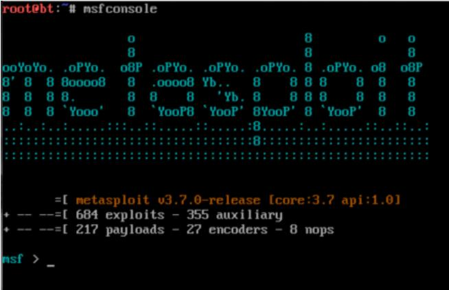

Como vemos en la figura se nos ha iniciado la interfaz de Metasploit, este framwork es muy potente y tiene infinidad de exploit para muchos sistemas diferentes, tanto para sistemas operativos como servidores de muchos tipos, pero para lo que nos ocupa en este caso vamos a mostrar los posibles exploit que contiene para Apache, para ello hacemos lo siguiente:

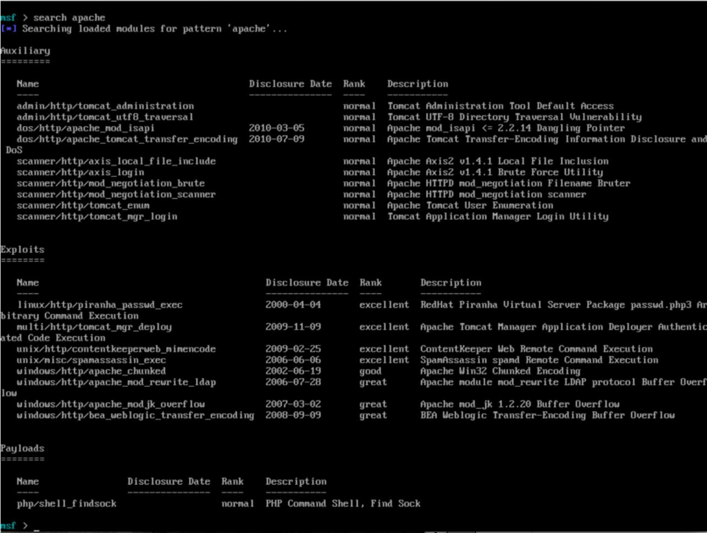

Como vemos ahora se muestran muchos posibles ataques diferentes, pero vemos que Metasploit los divide en 3 secciones, la primera sección se llama **“auxiliary”** y todo lo que hay en ella son módulos para realizar escaneos, **“fuzzing”** (búsqueda de vulnerabilidades en forma de excepción software), **“sniffing”** (capturadores de paquetes), etc. No son exploit pero son herramientas que ayuda a la penetración en un sistema determinado, en este  caso apache.

En la segunda sección vemos los exploit propiamente dichos que son los programas que se usan para provocar que el sistema produzca un fallo y por últimos los payload que son los encargados de aprovechar el fallo provocado por un exploit para brindarnos algún tipo de función intrusiva en el sistema.

Resumiendo los **“auxiliary”** encuentran el fallo, los exploits provocan el error en el sistema y los payload aprovechan ese error para sacar partido. Ahora vamos a describir brevemente cada una de las vulnerabilidades encontradas:

### Auxiliary:

* **admin/http/tomcat_administration**: Detecta la interfaz de administración de Tomcat.
* **admin/http/tomcat_utf8_traversal**: Escanea vulnerabilidades para el acceso al directorio, buscando fallas en la forma en la que se manejan las peticiones. Explotando este error se podría acceder de forma remota a archivos del servidor.
* **dos/http/apache_mod_isapi**: Busca fallos en servidores con mod_isapi instalado para poder realizar inyecciones de código en el servidor.
* **dos/http/apache_tomcat_transfer_encodig**: Escanea en busca de paquetes desprotegidos para obtener información sensible e incluso da la posibilidad de hacer DoS.
* **scanner/http/axis_local_file_include**: Este módulo aprovecha vulnerabilidades en axis2 v1.4.1 en la inclusión de archivos en el servidor, pudiendo acceder a los xml locales que contienen los nombres de usuario y contraseñas.
* **scanner/http/axis_login**: Este  módulo  prueba combinaciones de  usuarios  y contraseñas por fuerza bruta para poder acceder al servidor.
* **scanner/http/mod_negotiation_brute**: Realiza ataques por fuerza bruta para descubrir los archivos que contiene el servidor.
* **scanner/http/mod_negotiation_scanner**: Escanea el servidor para ver si tiene activo el mod_negotiation.
* **scanner/http/tomcat_enum**: Busca servidores apache anteriores a las versiones 6.0.20, 5.5.28 y 4.1.40:
* **scanner/http/tomcat_mgr_login**: Éste módulo intenta acceder a una instancia de Application manager del Tomcat usando un usuario y una contraseña específicas.

### Exploit:

* **linux/http/piranha_passwd_exec**: explota la vulnerabilidad que permite a un atacante logueado ejecutar código en apache como si fuera la cuenta **“nobody”** dentro del script piranha/secure/passwd.php3. Este paquete de apache se instala con esa cuenta por defecto y es con la que se intenta acceder.
* **multi/http/tomcat_mgr_deploy**: Se utiliza para ejecutar carga en los servidores que tiene una aplicación de administración ejecutándose.
* **unix/http/contentkeeperweb_mimencode**: Con éste módulo se intenta explotar la Web Appliance ContentKeeper y se aprovecha de una serie de fallas para permitir ejecutar comandos de forma remota con la cuenta de usuario apache.
* **unix/misc/spamassasin_exec**:  Se  aprovecha  de  una  vulnerabilidad  en  el  servicio SpamAssasin.
* **windows/http/apache_chunked**: Éste módulo explota vulnerabilidades en la transferencia en servidores Win32.
* **windows/http/apache_mod_rewrite_ldap**: Explotación del protocolo LDAP produciendo un desbordamiento. Son vulnerables a este ataque sólo los servidores Windows puesto que se aprovecha un fallo en un módulo que solo se instala en dicho sistema operativo.
* **windows/http/apache_modjk_overflow**:Vulnerabilidad en el desbordamiento de buffer de pila del mod_jk 1.2.20. Funciona sobre todo en Windows.
* **windows/http/bea_weblogic_transfer_encoding**: Vulnerabilidad en el desbordamiento de buffer de pila en el plugin de apache BEA Weblogic. Usualmente en Windows.

## Payloads:

* **php/shell_findsock**: Abre un terminal en la conexión establecida con el servidor. Deja un rastro fácilmente rastreable en los logs de errores de apache para evitar esto se puede utilizar una shell inversa o una BindShell.


## Ejemplo de ataque a apache Tomcat

Para comenzar una vez que conocemos la IP del servidor a atacar utilizamos la herramienta nmap, que sirve para ver que puertos están a la escucha en la máquina servidora, esto lo hacemos de la siguiente manera:

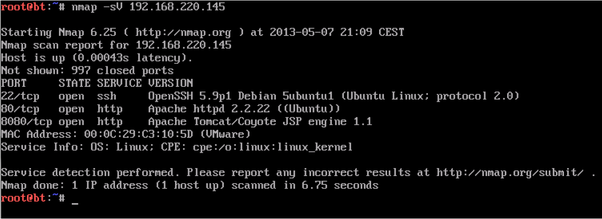

Como podemos observar en la captura el servicio apache Tomcat/Coyote está escuchando por el puerto 8080, una vez conocido el puerto y el servicio pasamos a Metasploit para ver cuál es el ataque que más nos interesa, esto lo haríamos con el comando visto anteriormente **“search apache”** una vez estemos en la interface de Metasploit.

En este caso vamos a intentar explotar la vulnerabilidad de **“Tomcat Application Manager Login Utility”**, para ello escribimos **“use scanner/http/tomcat_mgr_login”** y cuando haya cambiado el prompt escribimos **“show options”** para ver los parámetros que utiliza este escáner:

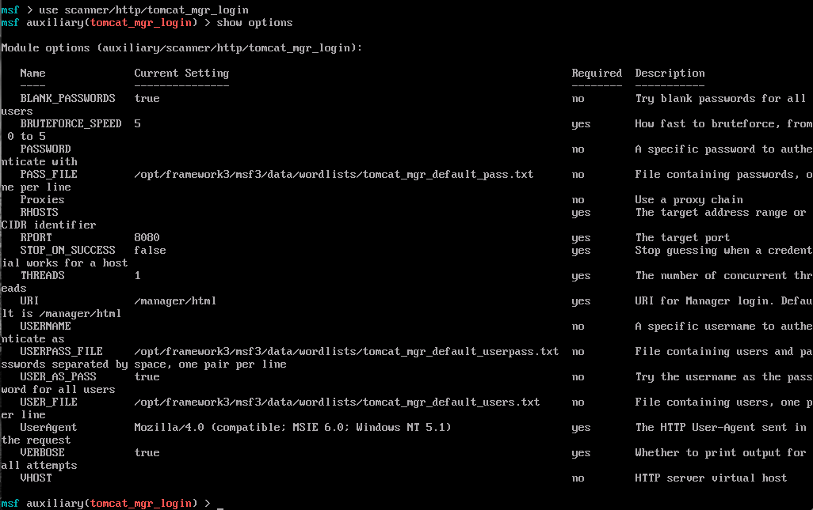

En la figura anterior podemos ver los distintos parámetros, el valor de la columna **“required”** nos dice si es necesario poner ese campo y en **“current setting”** nos dice el valor actual que tiene cada parámetro. En nuestro caso vamos a especificar 3 parámetros, el primero será el RHOSTS y le ponemos el valor de la ip del servidor 192.168.220.145, el puerto se especifica con RPORT y tendrá el valor 8080 y para que no tarde demasiado el ataque por fuerza bruta y por diccionario le pondremos que utilice 75 THREADS, para que compruebe 75 combinaciones de forma concurrente. También le podemos especificar otros valores interesantes como podrían ser diccionarios específicos posibles direcciones de archivos de contraseñas en el servidor, etc., pero en este caso vamos a probar con las opciones que tiene por defecto. Para asignar los valores lo hacemos de la siguiente forma:

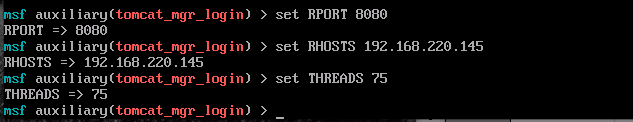

Llegados a este punto sólo quedaría ejecutar el escáner, esto lo hacemos con la orden **“run”**, esto genera muchas líneas de texto con comprobaciones de contraseñas y usuarios diferentes, yo solo voy a poner un fragmento:


A simple vista distinguimos 3 colores, el azul indica que se está realizando una comprobación con los valores de login y password que se indican en la línea, el rojo indica que la comprobación azul anterior ha fallado, y el verde indica que la comprobación ha sido exitosa y que hay coincidencias en el usuario y en la contraseña de la comprobación inmediatamente anterior.

En nuestro caso ha habido dos coincidencias que son:

* Usuario: root. Contraseña: admin.
* Usuario: both. Contraseña: tomcat.

Teniendo ya  estas  cuentas  de  usuario  solo  tenemos  que  acceder  al  administrador  de Tomcat, podríamos hacerlo de varias formas:

* Utilizando una shell inversa o una bind shell, lo cual implicaría comprobar si es posible hacer esto en el servidor puesto que el firewall puede tener bloqueados estos tipos de acceso.
* Utilizando algún tipo de conexión remota directa como SSH o telnet hacia el puerto 8080 en este caso, lo cual implicaría que el servidor ofreciera servicio de ese tipo y que los usuarios y contraseñas fueran los mismos que tiene Tomcat.
* Y por último la opción más sencilla que es entrar desde un navegador cualquiera a la dirección 192.168.220.145:8080.

Vamos a probar con la última de las opciones:

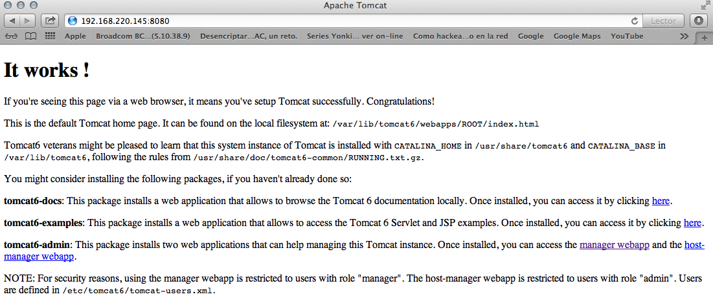

Hacemos clic en el hipervínculo Manager Webapp:

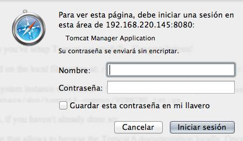

Ahora introducimos cualquiera de las contraseñas que hemos sacado con Metasploit, en este caso voy a probar con el usuario root porque puede que tenga más privilegios que el usuario both:

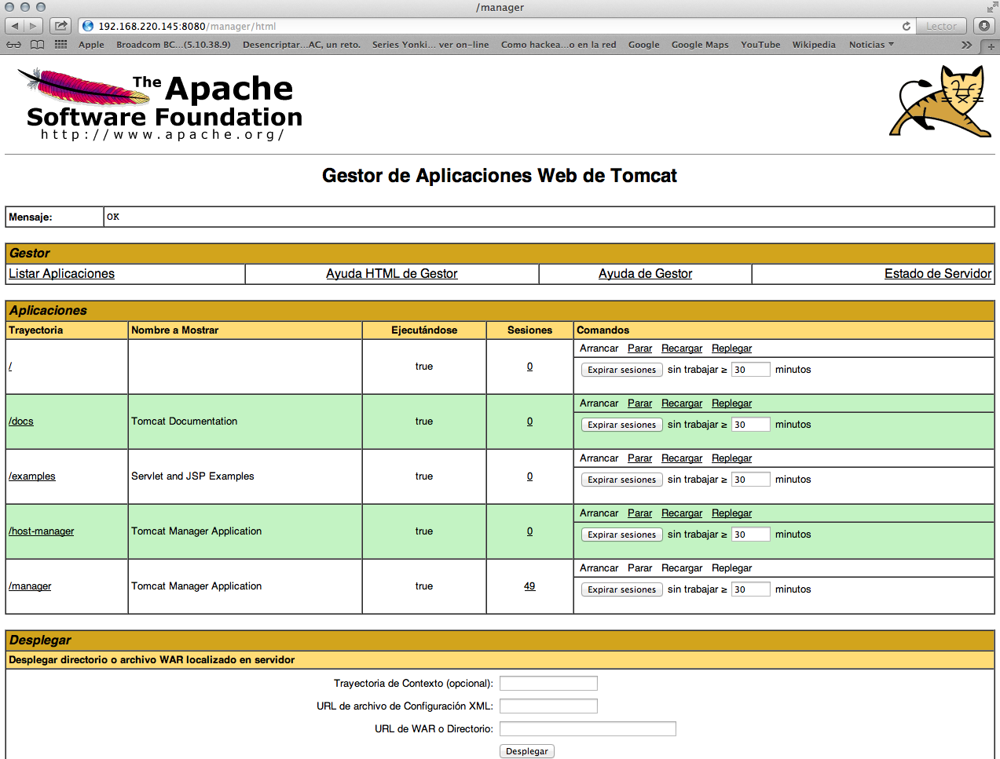

Ya dentro del interfaz de administración de Apache Tomcat podríamos modificar cualquier configuración, parámetro, o fichero del servidor.


## Bibliografía

* [http://cert.inteco.es/cert/Notas_Actualidad/seguridad_apache_configuracion_instalacion_20120509](http://cert.inteco.es/cert/Notas_Actualidad/seguridad_apache_configuracion_instalacion_20120509)
* [http://cert.inteco.es/cert/Notas_Actualidad/seguridad_apache_ii_control_archivos_publicados_20120516](http://cert.inteco.es/cert/Notas_Actualidad/seguridad_apache_ii_control_archivos_publicados_20120516)
* [http://cert.inteco.es/cert/Notas_Actualidad/seguridad_apache_iv_cgi_modulos_20120529](http://cert.inteco.es/cert/Notas_Actualidad/seguridad_apache_iv_cgi_modulos_20120529)
* [http://cert.inteco.es/cert/Notas_Actualidad/seguridad_apache_vii_ataques_denegacion_servicio_20120625](http://cert.inteco.es/cert/Notas_Actualidad/seguridad_apache_vii_ataques_denegacion_servicio_20120625)
* [http://emilio.aesinformatica.com/2009/02/17/fortificar-apache-para-aumentar-laseguridad](http://emilio.aesinformatica.com/2009/02/17/fortificar-apache-para-aumentar-laseguridad)
* [http://en.wikipedia.org/wiki/Fuzz_testing](http://en.wikipedia.org/wiki/Fuzz_testing)
* [http://es.wikipedia.org/wiki/Analizador_de_paquetes](http://es.wikipedia.org/wiki/Analizador_de_paquetes)
* [http://es.wikipedia.org/wiki/Ataque_de_denegaci%C3%B3n_de_servicio](http://es.wikipedia.org/wiki/Ataque_de_denegaci%C3%B3n_de_servicio)
* [http://es.wikipedia.org/wiki/Exploit](http://es.wikipedia.org/wiki/Exploit)
* [http://es.wikipedia.org/wiki/Htaccess](http://es.wikipedia.org/wiki/Htaccess)
* [http://httpd.apache.org/docs/2.0/es/vhosts/](http://httpd.apache.org/docs/2.0/es/vhosts/)
* [http://httpd.apache.org/docs/2.0/mod/mod_rewrite.html](http://httpd.apache.org/docs/2.0/mod/mod_rewrite.html)
* [http://httpd.apache.org/docs/2.4/misc/security_tips.html](http://httpd.apache.org/docs/2.4/misc/security_tips.html)
* [http://httpd.apache.org/docs/current/mod/core.html](http://httpd.apache.org/docs/current/mod/core.html)
* [http://httpd.apache.org/docs/current/mod/mod_status.html](http://httpd.apache.org/docs/current/mod/mod_status.html)
* [http://httpd.apache.org/docs/current/mod/mpm_common.html](http://httpd.apache.org/docs/current/mod/mpm_common.html)
* [http://httpd.apache.org/docs/current/mod/prefork.html](http://httpd.apache.org/docs/current/mod/prefork.html)
* [http://thehackerway.com/2012/07/12/web-hacking-medidas-de-seguridad-en-servidores-web-apache-instalacion-configuracion-y-conceptos-basicos-parte-iv/](http://thehackerway.com/2012/07/12/web-hacking-medidas-de-seguridad-en-servidores-web-apache-instalacion-configuracion-y-conceptos-basicos-parte-iv/)
* [http://www.adictosaltrabajo.com/tutoriales/tutoriales.php?pagina=apache_secure_debian](http://www.adictosaltrabajo.com/tutoriales/tutoriales.php?pagina=apache_secure_debian)
* [http://www.bdat.net/documentos/apache/x367.html](http://www.bdat.net/documentos/apache/x367.html)
* [https://www.digitalocean.com/community/articles/how-to-create-a-ssl-certificate-on-apache-for-ubuntu-12-04](https://www.digitalocean.com/community/articles/how-to-create-a-ssl-certificate-on-apache-for-ubuntu-12-04)
* [http://www.flu-project.com/flu-a-lo-jabali-que-es-un-payload.html](http://www.flu-project.com/flu-a-lo-jabali-que-es-un-payload.html)
* [http://www.jpereira.net/web/un-poco-de-seguridad-con-htaccess](http://www.jpereira.net/web/un-poco-de-seguridad-con-htaccess)
* [http://www.juanfelipe.net/node/23](http://www.juanfelipe.net/node/23)
* [http://www.kb.cert.org/vuls/id/343355](http://www.kb.cert.org/vuls/id/343355)
* [http://www.metasploit.com/modules/auxiliary/admin/http/tomcat_administration](http://www.metasploit.com/modules/auxiliary/admin/http/tomcat_administration)
* [http://www.metasploit.com/modules/auxiliary/dos/http/apache_mod_isapi](http://www.metasploit.com/modules/auxiliary/dos/http/apache_mod_isapi)
* [http://www.metasploit.com/modules/auxiliary/dos/http/apache_tomcat_transfer_encoding](http://www.metasploit.com/modules/auxiliary/dos/http/apache_tomcat_transfer_encoding)
* [http://www.metasploit.com/modules/auxiliary/scanner/http/axis_local_file_include](http://www.metasploit.com/modules/auxiliary/scanner/http/axis_local_file_include)
* [http://www.metasploit.com/modules/auxiliary/scanner/http/axis_login](http://www.metasploit.com/modules/auxiliary/scanner/http/axis_login)
* [http://www.metasploit.com/modules/auxiliary/scanner/http/mod_negotiation_brute](http://www.metasploit.com/modules/auxiliary/scanner/http/mod_negotiation_brute)
* [http://www.metasploit.com/modules/auxiliary/scanner/http/tomcat_enum](http://www.metasploit.com/modules/auxiliary/scanner/http/tomcat_enum)
* [http://www.metasploit.com/modules/auxiliary/scanner/http/mod_negotiation_scanner](http://www.metasploit.com/modules/auxiliary/scanner/http/mod_negotiation_scanner)
* [http://www.metasploit.com/modules/auxiliary/scanner/http/tomcat_mgr_login](http://www.metasploit.com/modules/auxiliary/scanner/http/tomcat_mgr_login)
* [http://www.metasploit.com/modules/exploit/linux/http/piranha_passwd_exec](http://www.metasploit.com/modules/exploit/linux/http/piranha_passwd_exec)
* [http://www.metasploit.com/modules/exploit/multi/http/tomcat_mgr_deploy](http://www.metasploit.com/modules/exploit/multi/http/tomcat_mgr_deploy)
* [http://www.metasploit.com/modules/exploit/unix/http/contentkeeperweb_mimencode](http://www.metasploit.com/modules/exploit/unix/http/contentkeeperweb_mimencode)
* [http://www.metasploit.com/modules/exploit/unix/misc/spamassassin_exec](http://www.metasploit.com/modules/exploit/unix/misc/spamassassin_exec)
* [http://www.metasploit.com/modules/exploit/windows/http/apache_chunked](http://www.metasploit.com/modules/exploit/windows/http/apache_chunked)
* [http://www.metasploit.com/modules/exploit/windows/http/apache_mod_rewrite_ldap](http://www.metasploit.com/modules/exploit/windows/http/apache_mod_rewrite_ldap)
* [http://www.metasploit.com/modules/exploit/windows/http/apache_modjk_overflow](http://www.metasploit.com/modules/exploit/windows/http/apache_modjk_overflow)
* [http://www.metasploit.com/modules/exploit/windows/http/bea_weblogic_transfer_encoding](http://www.metasploit.com/modules/exploit/windows/http/bea_weblogic_transfer_encoding)
* [http://www.metasploit.com/modules/payload/php/shell_findsock](http://www.metasploit.com/modules/payload/php/shell_findsock)
* [http://www.offensive-security.com/metasploit-unleashed/Auxiliary_Module_Reference](http://www.offensive-security.com/metasploit-unleashed/Auxiliary_Module_Reference)
* [http://www.openssl.org/docs/apps/req.html](http://www.openssl.org/docs/apps/req.html)
* [http://www.tufuncion.com/configuracion_apache](http://www.tufuncion.com/configuracion_apache)
* [http://ubuntuchoco.wordpress.com/2012/08/31/configurar-ssl-en-ubuntu-10-04-en-apache-2/](http://ubuntuchoco.wordpress.com/2012/08/31/configurar-ssl-en-ubuntu-10-04-en-apache-2/)
