Transmisión de Datos y Redes de Computadores
============================================
3º Grado en Ingeniería Informática 2012/2013
--------------------------------------------

# PRÁCTICA 2: Conexión a Internet de redes LAN y corporativas
### José Manuel Castillo Pérez
### Germán Martínez Maldonado

**1. Configure el protocolo RIP en los routers mikrotik RX_m y RX_n, donde m=(i+1)/2 y n=3+(i+1)/2. Configúrelos para que reenvié solo la información de encaminamiento de las rutas pertenecientes a la red de datos, y no las de gestión. Recuerde configurar la pasarela por defecto en los equipos PCX_(i) y PCX_(i+1) con la dirección IP de la red de datos del router RX_m.**

Los equipos donde hemos realizado la práctica han sido los equipos PC2_1 y PC2_2. Las direcciones IP de cada una de las interfaces de cada uno de los ordenadores son las siguientes:

* PC2_1:

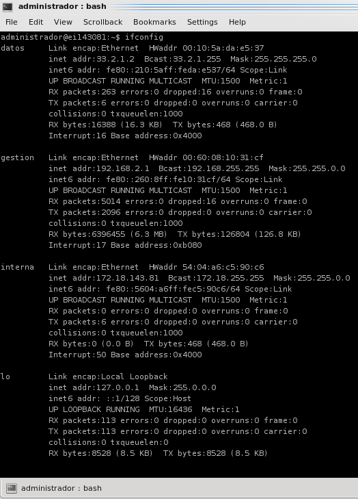

* PC2_2:

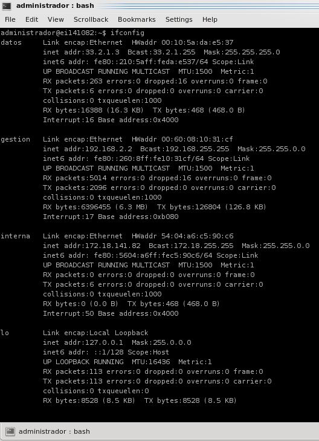	

Ahora vamos a configurar la pasarela por defecto en los equipos PC2_1 y PC2_2 con la dirección IP de la red de datos del router R2_1. Esto se muestra en las siguientes capturas de pantalla:

* En el PC2_1:

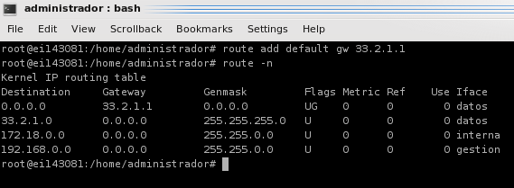	

* En el PC2_2:

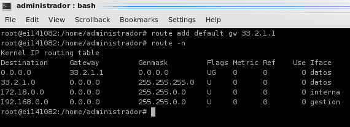	
	
Los routers en donde tenemos que configurar el protocolo RIP son los routers R2_1 y R2_4. Empecemos configurando el router R2_1, para ello abrimos WinBox y nos conectamos a la IP de gestión del router R2_1:

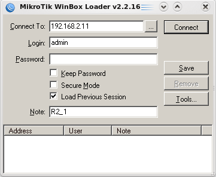

Una vez que hemos accedido a WinBox en el menú accedemos a la opción Routing y elegimos la opción RIP para empezar a configurar el protocolo. En la pestaña Interfaces pulsamos sobre el botón RIP Settings y dejamos las opciones por defecto que vienen.

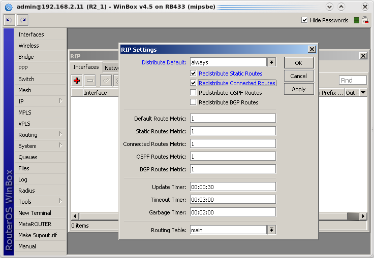

A continuación nos vamos a la pestaña Networks y aquí añadimos las IP de las redes que van a utilizar el protocolo RIP, estas redes se encuentra una por encima y otra por debajo de nuestro router.

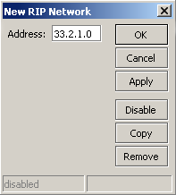

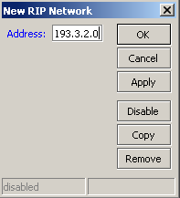

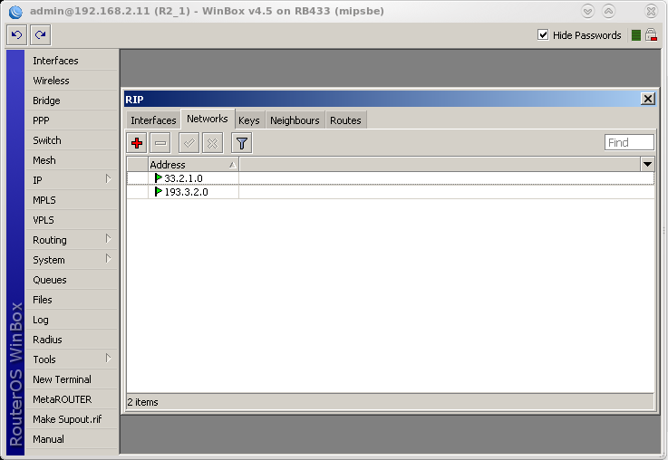

El siguiente paso es añadir las IP de los routers vecinos para ello nos desplazamos a la pestaña Neighbours y añadimos tantas IP como vecinos tenga nuestro router. En el caso del router R2_1 solo tiene un vecino.

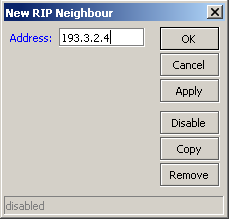

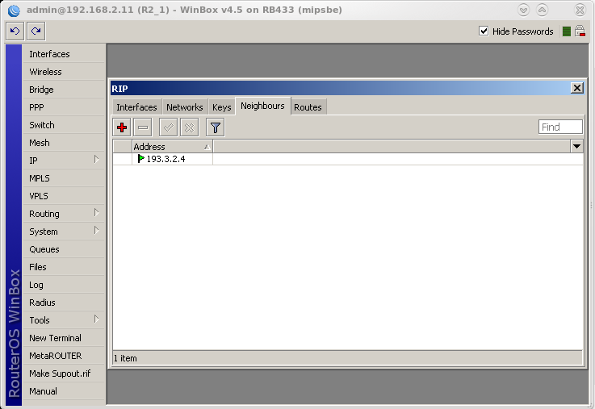

Por último en la pestaña Routes nos sale las propiedades de las distintas IP del router que acabamos de configurar con el protocolo RIP.

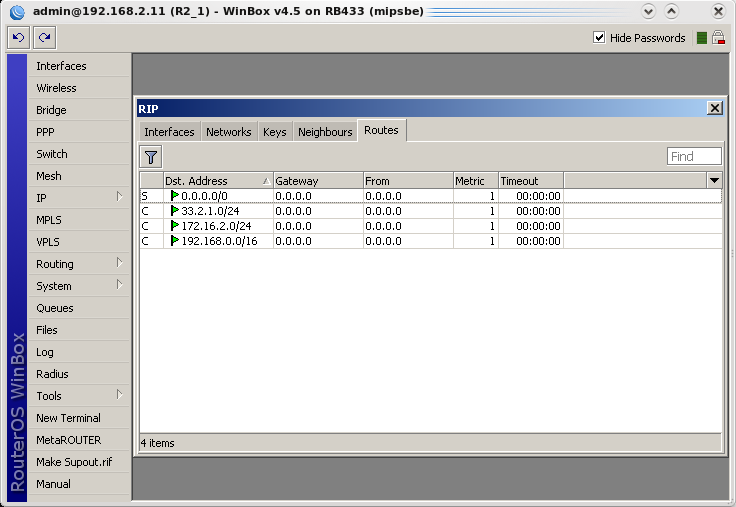

Ya hemos terminado de configurar el protocolo RIP en el router R2_1, ahora vamos a seguir los mismos pasos y configurar el protocolo RIP en el router R2_4. Empezamos conectándonos a WinBox con la IP de gestión del router R2_4.

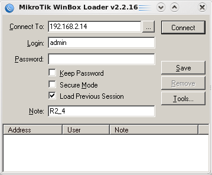

Accedemos a WinBox, del menú elegimos la opción Routing y elegimos RIP. En la pestaña Interfaces, botón RIP Settings dejamos las opciones por defecto que vienen.

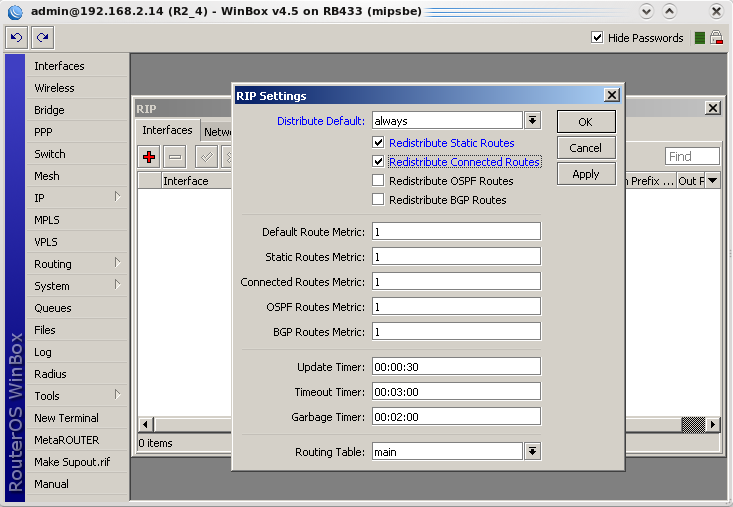

Ahora nos vamos a la pestaña Networks y añadimos las IP de las redes que van a utilizar el protocolo RIP.

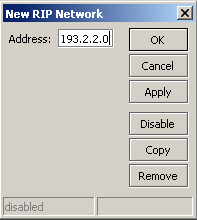

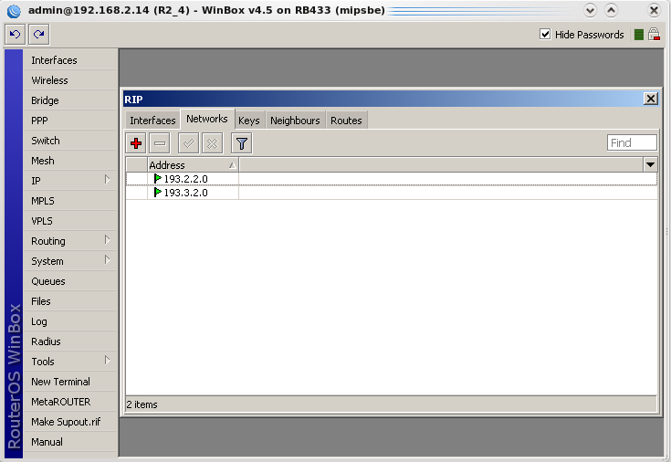	

A continuación añadimos las IP de los routers vecinos en la pestaña Neighbours. Ahora el router R2_4 tiene dos vecinos, el router R2_1 y el router R2_6.

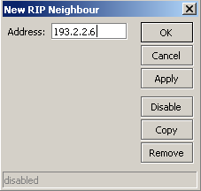

	

Por último en la pestaña Routes nos sale las propiedades de las distintas IP del router que acabamos de configurar con el protocolo RIP.

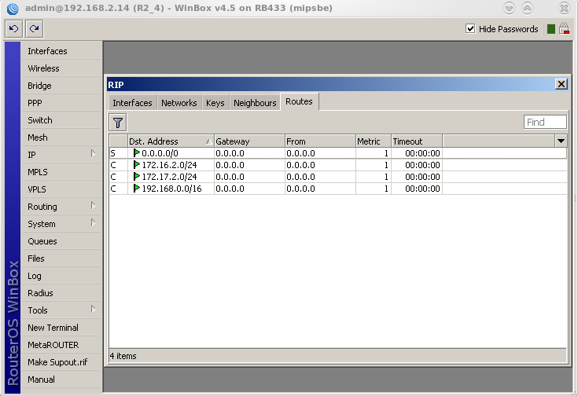

**Pregunta: ¿dónde puede configurar el periodo entre intercambio de información RIP?**

En la  pestaña Interfaces en  el botón RIP Settings cambiando  las opciones que  nos ofrece esta pestaña.

**2. Configure el router RX_m para que cuando se conecten mediante SSH (Secure SHell) los equipos PCX_(i) y PCX_(i+1) a otro dispositivo de la red de datos, dicho dispositivo vea como la dirección de origen de la conexión la dirección de RX_m. Utilice srcnat (asignando la dirección IP de origen manualmente) y masquerading (la dirección IP de origen se asigna automáticamente).**

El router que tenemos que configurar es el router R2_1. Para ello una vez que estamos en WinBox accedemos a la opción del menú IP y elegimos Firewall. Primero vamos a utilizar srcnat. Para ello elegimos la pestaña NAT y creamos una nueva regla. Accedemos a la pestaña Action y la rellenamos como se muestra en la siguiente captura de pantalla:

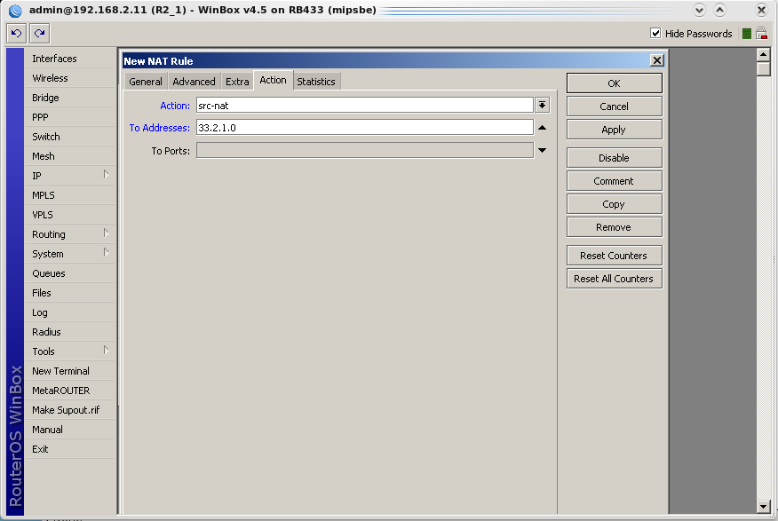

Luego nos desplazamos a la pestaña General y la rellenamos tal y como se muestra en la siguiente captura de pantalla:

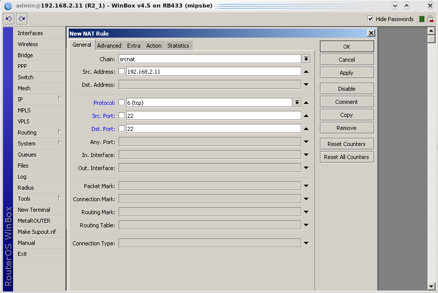

Aceptamos y ya hemos creado la nueva regla NAT que utiliza srcnat.

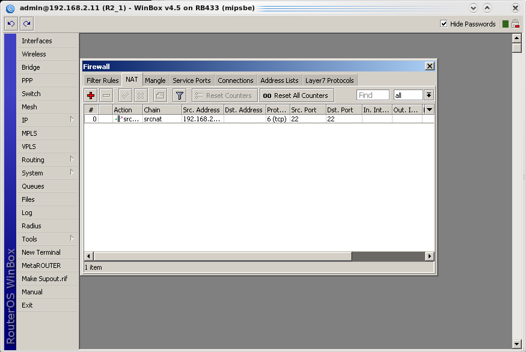

Ahora vamos a seguir los mismos pasos pero esta vez en vez de utilizar srcnat vamos a utilizar masquerading. Creamos una nueva regla NAT y en la pestaña de Action ponemos la action a masquerade.

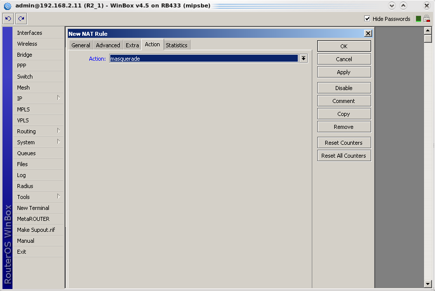

La pestaña General la rellenamos tal y como se muestra la siguiente captura de pantalla:

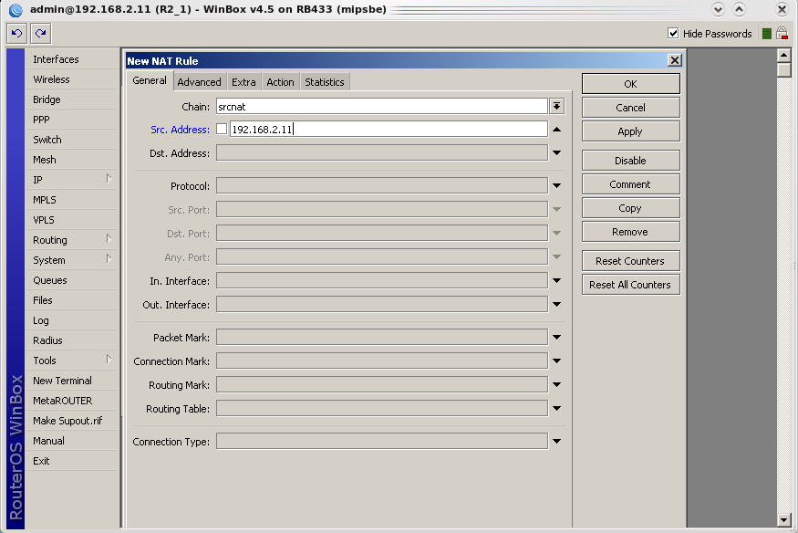

Y ya hemos creado la nueva regla de masquerading.

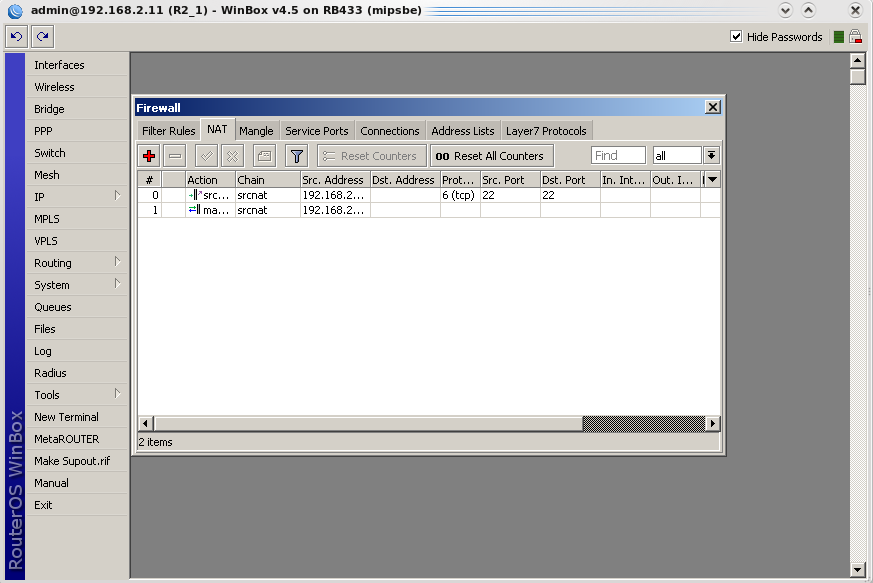

**3. Configure el router RX_m para que cuando otros equipos se conecten a dicho dispositivo mediante SSH, las conexiones se redirijan a la maquina PCX_(i). Utilice dstnat. Para realizar la prueba, puede instalar en el equipo el servicio de ssh (# apt-get install ssh-server; service ssh-server restart).**

Partiendo  del ejercicio  anterior  vamos  a  añadir  una  nueva  regla  que  utilice dstnat.  La  pestaña General la rellenamos tal y como se muestra en la siguiente captura de pantalla:

A continuación nos desplazamos a la pestaña Action y la rellenamos tal y como se muestra en la siguiente captura de pantalla:

Aceptamos y ya hemos creado la nueva regla que utiliza dstnat.

Para demostrar que hemos creado las reglas correctamente vamos a establecer una conexión ssh a la IP del router R2_1 que acabamos de configurar para ver que nos redirige el trafico al ordenador PC2_1. Para ello desde WinBox lanzamos una conexión ssh al router R2_1.

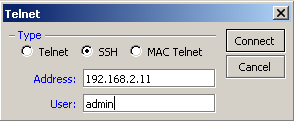

Esperamos un poco y vemos que ya hemos realizado la conexión.

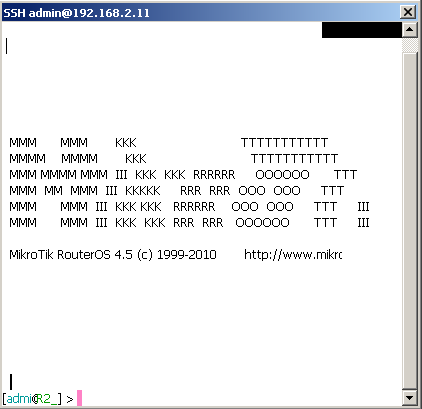

Ahora nos desplazamos a la terminal y a través del comando netstat, para que nos muestre el listado de las conexiones activas que hay actualmente en la computadora, vemos que la conexión que hemos realizado al router R2_1 nos la ha redirigido al ordenador PC2_1, tal y como nos pedía el ejercicio.

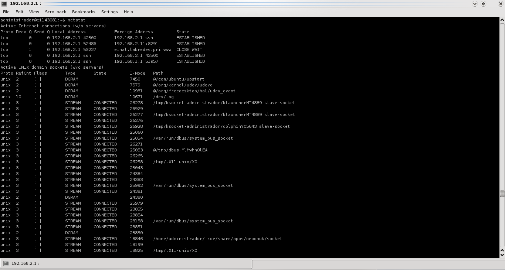

**Pregunta: ¿Cómo podría repartir las solicitudes entre PCX_(i) y PC_W(i+1)?**

A la hora de crear la nueva regla de dstnat en la pestaña General, en el apartado donde hay que indicar las direcciones de destino, añadir las direcciones de todos los ordenadores a los que queramos repartir las solicitudes.

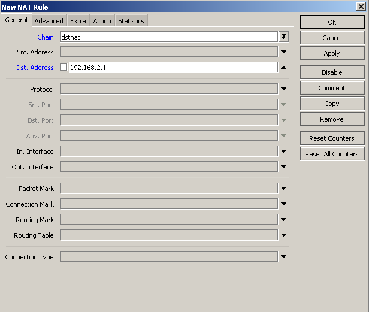

**4. Configure en PCX_(i) el servidor de OpenVPN, y en PCX_(i+1) el cliente de OpenVPN.**

Para   configurar   el   servidor,   creamos   en   el   PC   que   va   a   hacer   de   servidor   el   archivo **“/etc/openvpn/server.conf”** con el contenido:

* `dev tun`: para indicar que el dispositivo virtual por el que se accede la vpn será encaminado.
* `ifconfig 11.11.11.1 11.11.11.2`: para indicar la dirección las direcciones IP de los extremos del túnel, siendo 11.11.11.1 la dirección vpn del equipo local y 11.11.11.2 la dirección vpn del equipo remoto.
* `secret clave_secreta.key`: para indicar el nombre del fichero con la clave secreta.

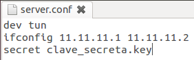

Lo siguiente a hacer es generar el fichero con la clave secreta al que acabamos de hacer referencia.
Para ello usamos el comando `openvpn --genkey –secret clave_secreta.key`, podemos comprobar el contenido generado para el archivo de llave:

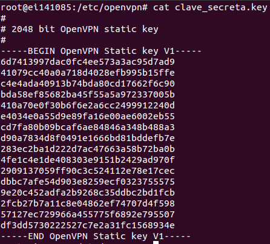

Reiniciamos el servicio para que la configuración se haga efectiva con `# service openvpn restart`. Comprobamos con el comando `ifconfig` que el túnel ha sido creado, es el nuevo interfaz que aparece con el nombre de `tun0`:

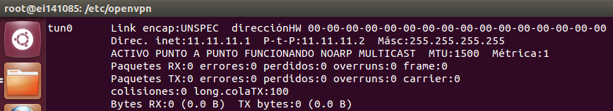

Como configuración en la parte del servidor sólo nos queda activar el reenvío de datagramas IP, que lo haremos con una de los dos siguientes líneas de comando: `# echo “1” > /proc/sys/net/ipv4/ip_forward` o `# sysctl –w net.ipv4.ip_forward=1`.

Ahora tenemos que configurar el lado del cliente, para ello debemos crear el archivo **“/etc/openvpn/client.conf”**, añadiéndole las siguientes líneas:

* `remote 192.168.2.3`: para indicar la dirección IP del servidor.
* `dev tun`: para indicar que el dispositivo virtual por el que se accede a la vpn será encaminado.
* `ifconfig 11.11.11.2 11.11.11.1`: para indicar la dirección las direcciones IP de los extremos del túnel, siendo 11.11.11.2 la dirección vpn del equipo local y 11.11.11.1 la dirección vpn del equipo remoto.
* `secret clave_secreta.key`: para indicar el nombre del fichero con la clave secreta.

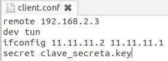

En este caso el archivo de clave secreta será el mismo que generamos en el servidor, por lo que simplemente deberemos copiarlo desde este. Reiniciamos con `# service openvpn restart` y comprobamos con el comando `ifconfig”` que se ha creado un nuevo interfaz llamado `tun0`.

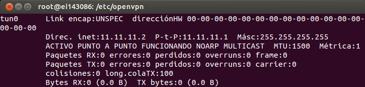

Lo único que nos falta es comprobar que haya comunicación entre ambos equipos:

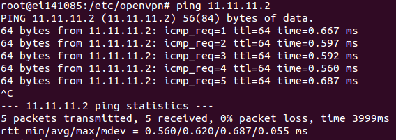

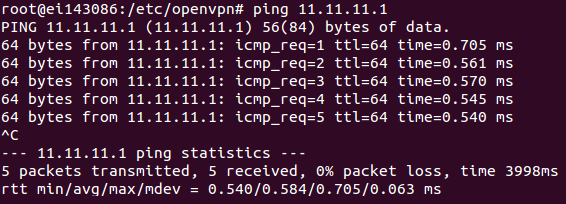

**5. (Opcional) Configure en PCX_(i) el servidor de  PPTP, y en PCX_(i+1) el cliente de PPTP.**

Para configurar el servidor modificamos el archivo **“/etc/pptpd.conf”** e introducimos `localip 192.168.2.3` (la dirección del servidor) y `remoteip 12.12.12.2-100`  (el rango  de direcciones disponibles para los clientes que se conecten).

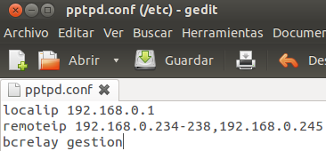

Creamos el archivo **“/etc/ppp/options-pptpd”** con las opciones de configuración.

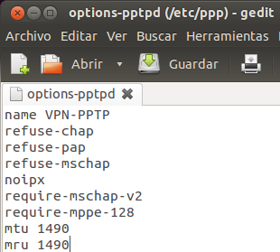

Creamos el archivo **“/etc/ppp/chap-secrets”** con la configuración de acceso.

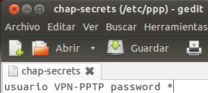

Reiniciamos el servicio `pptpd`.

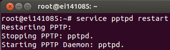

Ahora tenemos que configurar la parte del cliente, lo que tenemos que indicar es la pasarela, donde deberemos indicar la dirección IP de nuestro servidor y el nombre de usuario y contraseña que hayamos definido en la configuración de acceso.

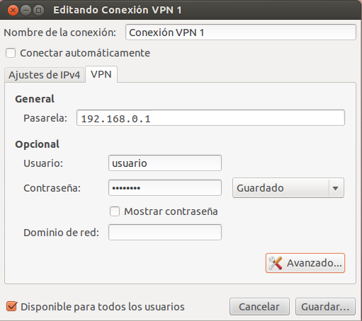

Y en las opciones **“Avanzado”** debemos seleccionar las opciones **“MSCHAPv2”** y **“Usar cifrado punto a punto (MPPE)”**.

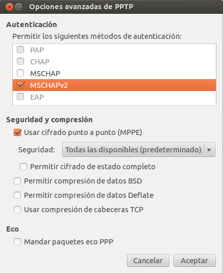

## SEMINARIO 2: Taller de configuración para la conexión a Internet de redes LAN y corporativas: RIP, NAT y VPN.

**1. ¿Ventajas/inconvenientes entre CHAP y PAP?**

Con PAP el nombre de usuario y contraseña son enviados al sistema de autenticación, pero sin ser cifrados, por lo que pueden ser capturados fácilmente. Con CHAP el nombre de usuario y la contraseña son cifrados, y se usa el algoritmo MD5 para calcular un valor que solo conocen el sistema de autenticación y el dispositivo remoto, si el sistema de autenticación recibe un valor que no es el generado, no permite la conexión. Por lo que CHAP es más seguro que PAP.

**2. ¿Ventajas/inconvenientes de OpenVPN con clave secreta frente a SSL/TLS?**

Usando OpenVPN con clave secreta cualquiera que tenga la clave, puede descifrar la información transferida, mientras que SSL/TLS utiliza una clave pública para la encriptación y una clave privada para la desencriptación, como la clave privada es única y no distribuida, hace la seguridad en SSL/TLS sea mayor.

**3. ¿Ventajas/inconvenientes de OpenVPN frente a PPTP?**

OpenVPN usa un método de cifrado muy seguro, por lo que aunque la información transmitida fuera interceptada, no podría hacerse nada para interpretarla, en cambio, PPTP usa una contraseña con clave y su flujo de datos tiene un contraseña recuperable, por lo que si se intercepta el tráfico y se descifra la clave, se podría descifrar la contraseña enviada. La ventaja de PPTP es que su configuración es mucho más simple y además, es compatible con casi todo tipo de sistemas operativos y muchos sistemas móviles.
