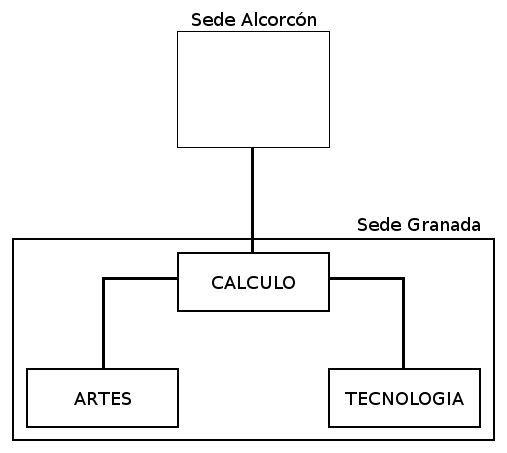
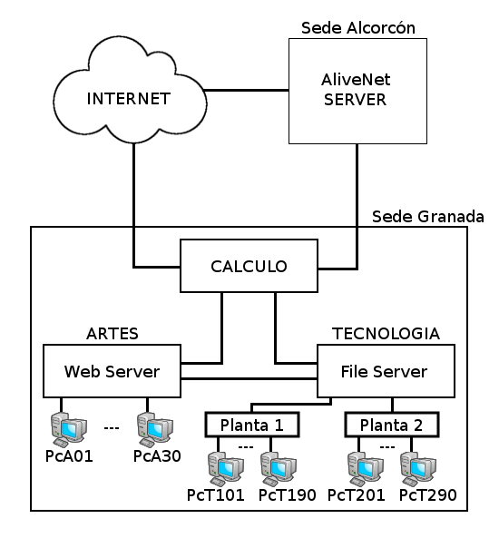
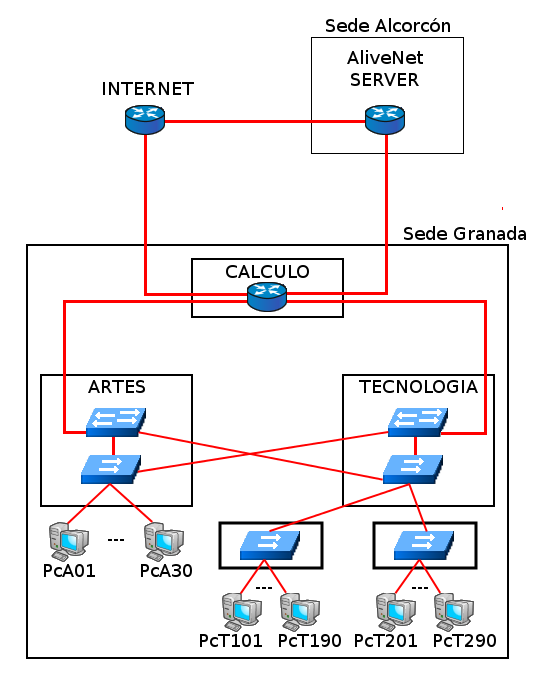
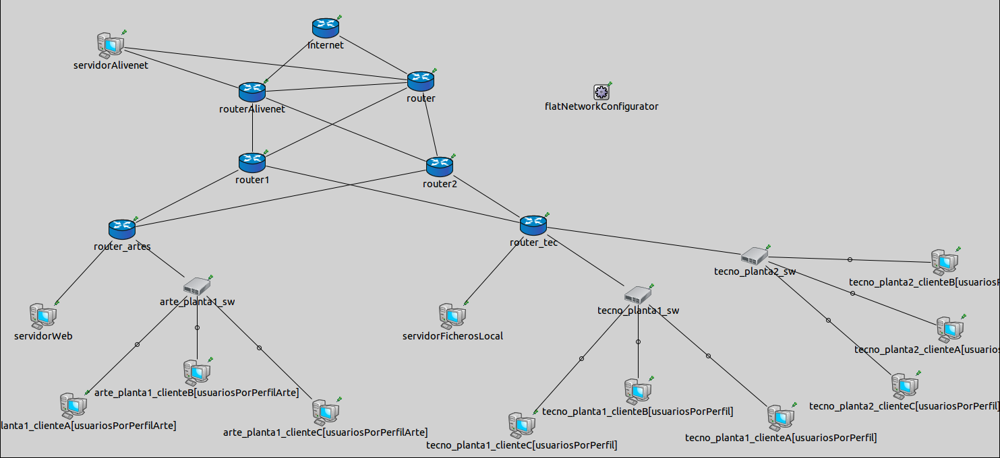

Transmisión de Datos y Redes de Computadores
============================================
3º Grado en Ingeniería Informática 2012/2013
--------------------------------------------

# PRÁCTICA 3: Conexión a Internet de redes LAN y corporativas
### Germán Martínez Maldonado
### Pablo Sánchez Robles

**1. Elabora  un  mapa  de  la  red  en  la  que  destaquen  las  sedes/edificios  y  su  forma  de interconexión.**

**2. Elabore un mapa de servicios, indicando su localización y los usuarios de dichos servicios con su localización.**

**3. Elabore un mapa de los elementos de la red (router, switches, enlaces…).**

**4. Caracterice el tráfico generado por los servicios/servidores. Para ello, realice una simulación de un día, y compruebe las estadísticas de “setPk:vector(packetBytes)” y “*sent*” correspondientes a las interfaces de los servidores (“*.mac”) y a las aplicaciones (“*.tcpApp[0]”).**

Los datos obtenidos con la simulación nos muestran que el grueso de bit/sec enviados proceden del servidor de ficheros local, de los switches y por último del servidor web, después estarían los usuarios de tecnologías y artes y por último se quedan sin carga de envío los router que van desde Cálculo hacia el servidor de **AliveNet**, esto puede ser debido a que no dejamos terminar de hacer la simulación del día entero, solo llegamos a T = 42300.1236944, y quizás después puede que se manden paquetes hacia fuera de nuestra red pero hasta ese momento el tráfico es solo interno entre los usuarios, el servidor de ficheros y el servidor web.

En paquetes enviados vemos como se mantiene lo dicho en el párrafo anterior y tiene sentido ya que si el mayor número de bit/sec se ha dado en una zona de la red es lógico pensar que el mayor número de paquetes enviados se ha dado en el mismo segmento de la red, y es así, los mayores emisores de paquetes son los servidores, en primer lugar está el servidor de ficheros local situado en tecnologías, en segundo lugar el servidor web situado en artes y luego ya vienen los usuarios primero los usuarios que más envían son los de tecnologías y después los de arte.

**5. Analice  las  estadísticas  escalares  “*.collisions”,  “.BitError”,  “rx  utilization  (%)”  de  las interfaces de red “*.mac” para comprobar si hay algún problema en las redes y enlaces. ¿Qué problemas identifica?**

* **droppedPkBitError**: Analizando las estadísticas de la red se puede observar que la mayoría de los paquetes perdidos se dan en el edificio de tecnología, tanto en la primera planta como en la segunda, y también algunos en los switches de tecnología y arte, aunque en proporción son los menos. Esto se debe a que la interconexión de los host finales en el edificio de tecnologías se hace mediante un hub que uno otros dos hubs, uno por planta, y cada uno de estos últimos interconecta 90 host, lo cual implica que el hub que une estos dos hubs está interconectando 180 dispositivos, lo cual es mucho más de lo que un hub puede soportar.

* **Collision**: Las colisiones se dan en los switches, y como podemos ver en las estadísticas más de la mitad de ellas se dan en la interfaz 2 de cada switch lo cual significa que las colisiones se producen en mayor cantidad en el lado de tecnologías puesto que las interfaces 2 de cada switch son las que van hacia este edificio, lo cual tiene sentido porque es en ese edificio donde se pierden la mayoría de los paquetes por culpa del hub sobre-saturado de trabajo.

* **Rx utilización(%)**: Como se puede observar en las estadísticas de utilización del canal es también en tecnologías donde se produce el mayor porcentaje, lo cual tiene sentido ya que es ahí donde se encuentran la mayoría de los usuarios de la red, y como también es ahí donde se producen la mayoría de los paquetes perdidos y de las colisiones tiene toda la lógica que sea ahí donde hay más saturación, lo cual implica el reenvío de más paquetes para suplir los paquetes perdidos, por lo tanto el cuello de botella de nuestra **AliveNet** se produce en el edificio de tecnologías.

**6. Indique qué cambiaría en la red para mejorar su rendimiento.**

Teniendo en cuenta que la mayoría de la cantidad de tráfico proviene del servidor de ficheros local que se encuentra en el edificio Tecnológico, y que también en esa zona es donde se producen más colisiones, si observamos cómo están hechas las interconexiones de los dispositivos en esa zona, podremos apreciar que las conexiones se realizan a través de concentradores, debido a la gran cantidad de usuarios y tráfico, por la forma de funcionar los concentradores no es recomendado usarlo en un escenario como este, porque generará una
gran cantidad de tráfico redundante lo que explica el gran número de colisiones que se producen. Visto esto, deberíamos cambiar los concentradores por conmutadores, para que así el tráfico de la red sea menos saturado, ya que los datos solo se enviaran a los equipos de destino, teniendo en cuenta que hay 90 usuarios por planta, el cambio será considerable.

En el edificio de Artes, aunque la cantidad de tráfico sea mucho menor, también es recomendable cambiar los concentradores por conmutadores para que haya mayor fluidez en la red.

En resumen, el edificio de Artes, el concentrador **arte_planta1_hub** pasaría a ser el conmutador **arte_planta1_sw** y, en el edificio Tecnológico, el concentrador **tecno_dist_hub** pasaría a ser el conmutador **tecno_dist_sw**, **tecno_planta1_hub** a **tecno_planta1_sw** y **tecno_planta2_hub** a **tecno_planta2_sw**.

**7. Indique qué cambiaría en la red para mejorar el diseño para permitir mejor escalabilidad y facilidad de mantenimiento.**

El cambio en el diseño de la red sería básicamente adoptar un modelo jerárquico que nos permitirá tener una mejor escalabilidad al ser más fácil ampliar la red con nuevas sedes, y mayor facilidad de mantenimiento porque si hay que reparar un dispositivo, esto no interfiere en las otras capas.

Para aplicar este tipo de diseño en nuestra red corporativa, lo primero sería dividir nuestra red actual en 3 capas: **núcleo, capa de distribución y capa de acceso**. El núcleo estaría formado por los 3 routers que tenemos en nuestro esquema de red: **routerAlivenet**, **router** e **Internet**, estando servidorAlivenet conectado a routerAlivenet para que sigan pudiendo acceder fácilmente a él los usuarios de las distintas sedes. Para la capa de distribución, sustituiríamos los conmutadores **sw1** y **sw2** por 2 routers  (**router1** y **router2**) para seguir asegurándonos un acceso redundante y poder gestionar cada sede como una subred diferente (para cumplir el objetivo de mejor escalabilidad y facilidad de mantenimiento). Para configurar la capa de acceso, en lo que refiere al edificio de Artes, primero pondríamos un router (**router_artes**) al que por un lado se conectaría servidorWeb y el conmutador **arte_planta1_sw** (al que están conectados todos los usuarios de Artes) ,y por el otro se conectaría a los routers **router1** y **router2**; y referente al edificio Tecnológico, cambiaríamos el conmutador **tecno_dist_sw** por un router (**router_tec**), al que conectaríamos por un lado **servidorFicherosLocal** y los conmutadores **tecno_planta1_sw** y **tecno_planta2_sw**, y por el otro lado los routers **router1** y **router2**. Para finalizar conectamos los routers **router1** y **router2** ambos con **routerAlivenet** y router, además **servidorAlivenet** se conectará a **routerAlivenet** y a **router**, para completar la redundancia e evitar los posibles problemas de conectividad.

Con esto ya tendríamos nuestra red organizada según modelo jerárquico, el esquema quedaría como se muestra en la siguiente imagen:

