Transmisión de Datos y Redes de Computadores
============================================
3º Grado en Ingeniería Informática 2012/2013
--------------------------------------------

# PRÁCTICA 4: Gestión de redes corporativas vía Web
### Germán Martínez Maldonado
### Pablo Sánchez Robles

**1. Instale la herramienta The Dude en una maquina Windows. Active la opción de interfaz web, y abra la interfaz web de The Dude desde el navegador web de otro equipo. Para ello, utilice la dirección de la red de Datos del equipo que ejecuta la herramienta (33.x.y.z).**

Una vez instalado **“The Dude”** activamos la interfaz web mediante la opción correspondiente, que se encuentra en **Configuraciones -> Servidor -> Acceso Web**. Especificamos la dirección de la red de Datos del equipo que tiene el software instalado y el puerto por el que se ofrece el servicio. Podemos dejar el puerto que viene por defecto (80), pero como es el puerto que suelen usar los servidores, vamos a usar el puerto 8080 para evitar inconvenientes. Tras esto podremos conectarnos desde cualquier equipo de la red mediante un navegador al programa de gestión y realizar la mayoría de las tareas que pueden hacerse con The Dude. En el ejercicio 5 se muestra una captura del interfaz web.

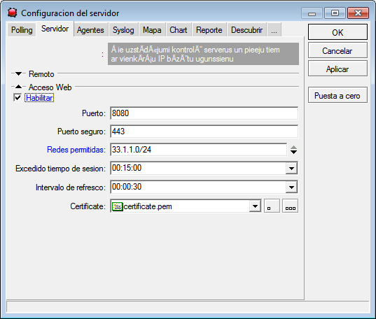

**2. Descubra mediante la herramienta The Dude que  dispositivos IP hay en  su  red. Con WinBox configure como pasarela por defecto del router Mikrotik la dirección 192.168.33.21. ¿Qué elementos aparecen? ¿Por qué no aparecen el resto de los dispositivos IP del laboratorio?**

Con WinBox añadimos una ruta por defecto para el router que pase por la dirección **192.168.33.21**, desde el menú **IP -> Routes**, y hacemos clic en el botón de añadir nueva ruta.

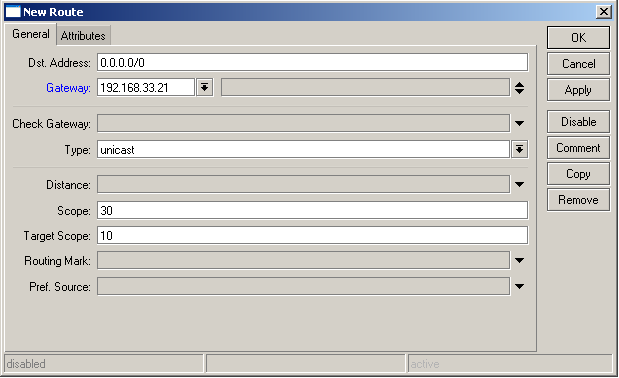

Para iniciar el descubrimiento de los dispositivos, pulsamos el botón **“Descubrir”** que aparece en la parte superior de la interfaz principal, indicamos que escanee en cada red conectada a mi máquina con profundidad 0, es decir, que sólo mire las redes conectadas directamente a mi máquina y no las conectadas a estas.

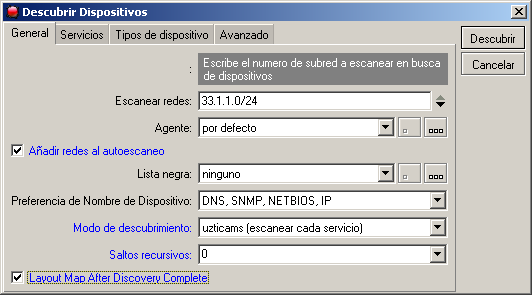

Este proceso puede durar mucho pero en principio transcurridos unos 20 minutos muestra los nodos que se ven en la siguiente imagen, como hemos indicado que solo descubra los nodos directamente conectados a nuestro nodo origen, vemos que solo aparecen la interfaz de datos de los nodos de la subisla del router R1_1, todos los demás elementos que aparecen son debido a la configuración del laboratorio que conecta todos los equipos a través de la interfaz de gestión. No aparecen el resto de interfaces de datos del resto de nodos del laboratorio, porque al no estar directamente conectados, deberíamos indicar un número de saltos mayor para que The Dude los descubra.

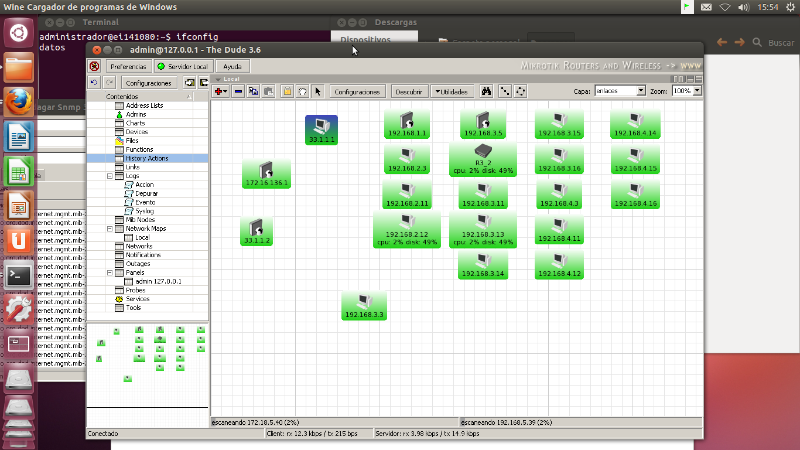

**3. Cree un gráfico en The Dude con el valor de la tasa de transferencia medida en la interfaz ether3 del router al que está directamente conectado. (Para ello, no olvide activar SNMP en dicho router).**

Lo primero que hacemos es activar SNMP en el router desde el menú **IP -> SNMP de WinBox**:

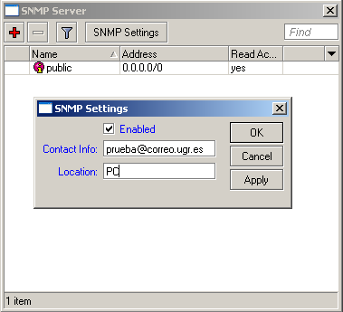

Para iniciar el proceso pulsamos en el interfaz principal con el **botón derecho -> Utilidades -> Indagar Snmp**. En la nueva ventana buscamos los OIDs **“ifInOctets”** e **“ifOutOctets”** (para conocer tanto los flujos de entrada como de salida) y seleccionamos los que terminen en un 3, que son los correspondientes a la interfaz ether3. 

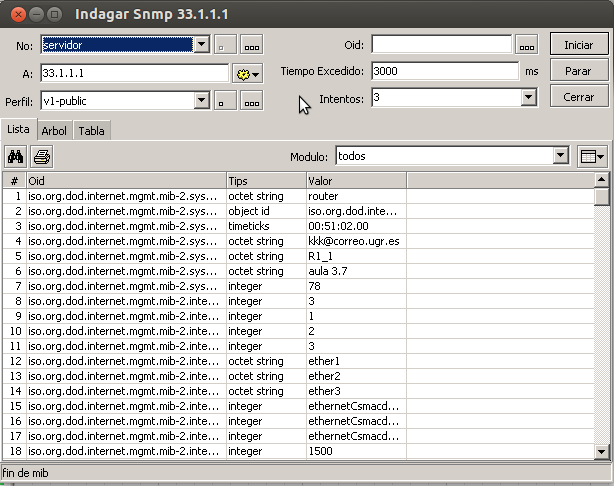

Ahora creamos una fuente de datos con cada uno, pulsando sobre el OID correspondiente el botón derecho y haciendo clic sobre **“Crear fuente de datos”**, las vamos a crear con nombres que nos resulten fáciles de ver, como puede ser **“In Octets”** y **“Out Octets”**.
	
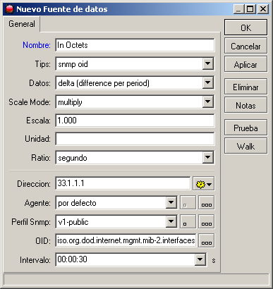

Para crear el gráfico, desde el menú de izquierda en Chart, creamos el gráfico pasándole las dos fuentes de datos anteriores y esperamos a que el gráfico se realice. 

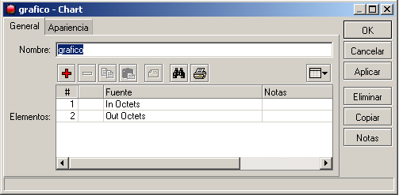

Para realizar un gráfico que pueda ser relevante para analizar datos sería necesario dejar al software durante unas horas, pero como no tenemos ese tiempo para esperar, mostramos el gráfico generado tras casi 20 minutos.

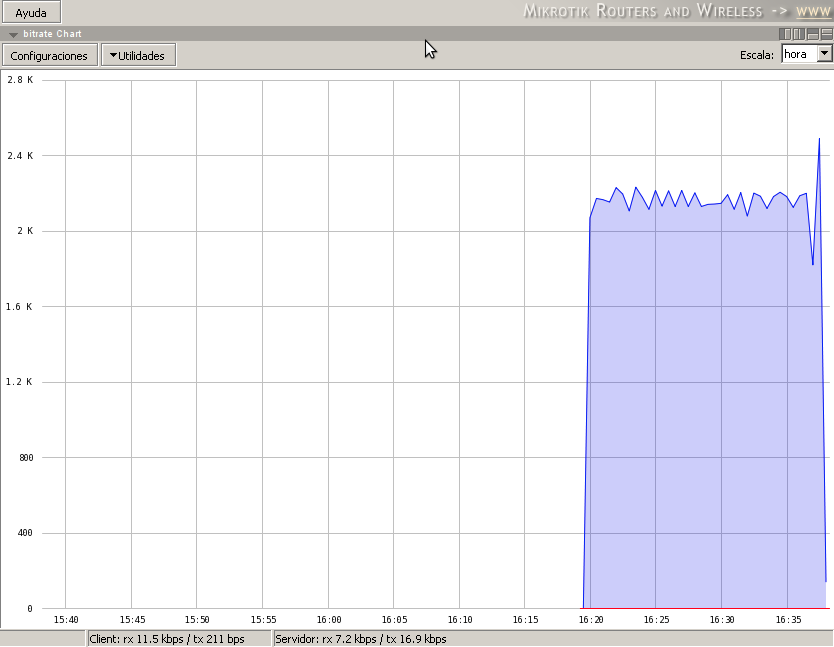

**4. Cree desde The Dude una sonda para comprobar si la ruta por defecto del router Mikrotik deja de estar presente. Para  comprobar su funcionamiento, asígnesela como  servicio  al router y, tras varios minutos de prueba, desactive en el router la entrada por defecto mediante WinBox.**

Para crear una nueva sonda nos vamos al dispositivo que queremos hacer la prueba, volvemos a acceder a **“Indagar Snmp”** y buscamos el OID correspondiente a la ruta por defecto. Ahora desde el menú de la izquierda pulsamos en **“Probes”** y pulsamos el botón para añadir una nueva prueba. En el interfaz que aparece, ponemos que el método de comparación sea **“== (igual)”** y el valor sea 1, lo que nos indica que la ruta está activa, dándonos una alarma si se desactiva.

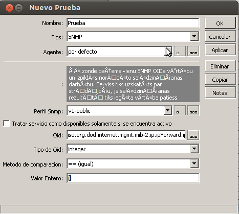

Como veremos, cuando desactivamos en el router la entrada por defecto y la sonda lo detecta, la sonda envía una trap diciendo que algo falla:

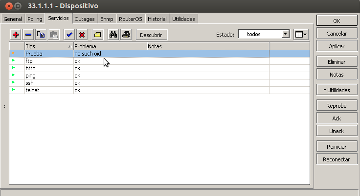

**5. Cree desde la interfaz web una sonda para comprobar si el servicio IPP (puerto 631 de TCP) del equipo del compañero está activo.**

Para crear una nueva sonda desde el interfaz web seleccionamos de las opciones de la izquierda el apartado **“Pruebas”**. 

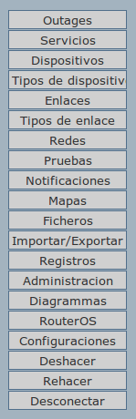

Haciendo clic en ese apartado nos aparecerá la interfaz de **“Añadir nueva prueba”**, una vez con los datos introducimos ya sólo quedaría darle a añadir para crear una nueva sonda.

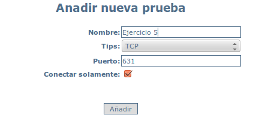
