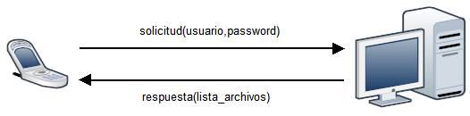
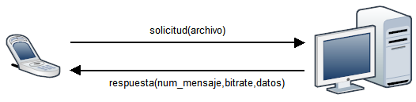
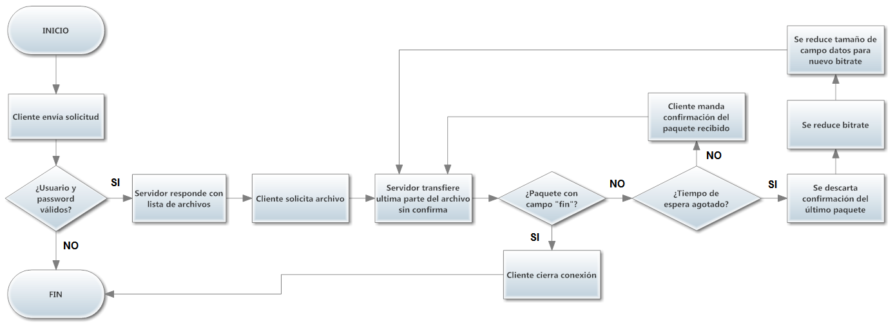
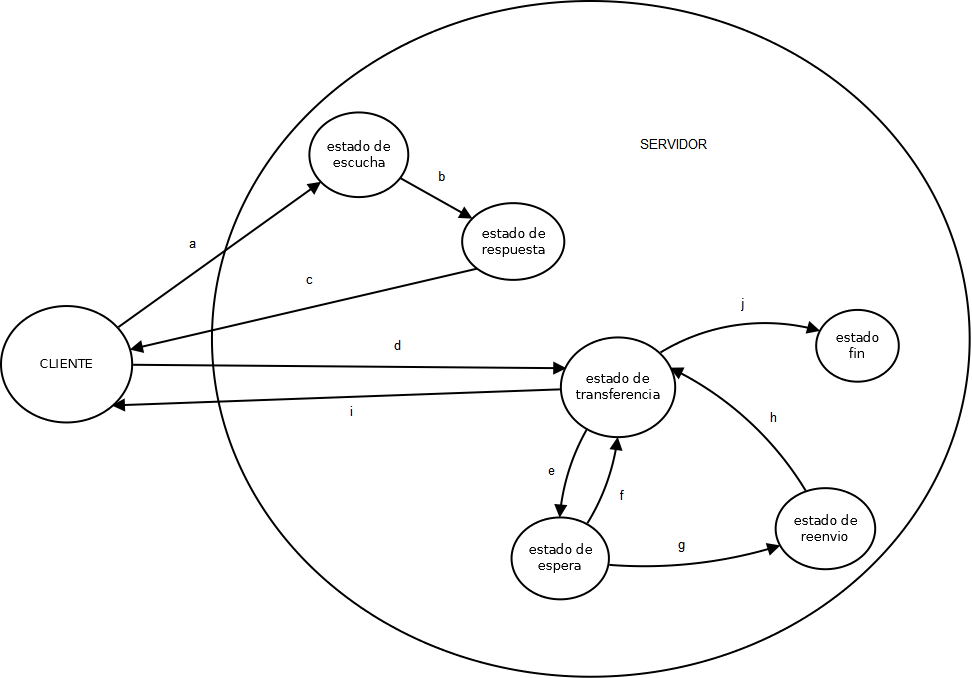

Transmisión de Datos y Redes de Computadores
============================================
3º Grado en Ingeniería Informática 2012/2013
--------------------------------------------

# Trabajo Tema 2: Protocolos y Servicios de Red
### Germán Martínez Maldonado

## Descripción del servicio, su finalidad y su funcionamiento.

Queremos desarrollar un servicio que nos permita reproducir en streaming archivos multimedia, siendo el proveedor del contenido nuestro ordenador que tengamos en casa y que dispone de una conexión a internet, y el cliente que solicita la reproducción cualquier dispositivo portátil (pensado sobre todo smartphones, tablets y videoconsolas portátiles). Así tendríamos un servicio cuya finalidad sería poder acceder en cualquier momento a nuestros archivos multimedia contenidos en un ordenador doméstico desde cualquier dispositivo móvil que tenga una conexión a internet, sin tener que copiar los archivos en dichos dispositivos. Un aspecto a tener en cuenta sería el bitrate, el flujo de datos correspondiente a la cantidad de información que se procesa del archivo multimedia en cada segundo, obteniendo  mejor calidad a mayor bitrate, ya que será un factor que deberemos tener en cuenta durante la transmisión.

El funcionamiento sería que el cliente manda una solicitud de conexión al servidor doméstico, indicando su nombre de usuario y contraseña, si estos datos de acceso son válidos, el servidor le responde con  los archivos tanto de audio como video disponibles para  ser transmitidos en streaming al dispositivo. Cuando el cliente solicita uno de los archivos, el servidor comienza la **“emisión”** del archivo hacia el cliente. Durante la transferencia, el cliente responderá al servidor cuando vaya reproduciendo el contenido de los paquetes que va recibiendo, si mediante los tiempos de espera establecidos el servidor comprueba que debido a la velocidad de la red de datos del cliente la reproducción no está siendo constante, disminuirá dinámicamente el bitrate de los archivos, bajando la calidad, pero asegurándose un flujo constante de datos entre cliente y servidor.

## Diseño del protocolo de comunicación.

El protocolo de comunicación define mensajes que usan un paquete con los siguientes campos: **“ip_origen”**, **“puerto_origen”**, **“ip_destino”**, **“puerto_destino”**, **“usuario”**, **“password”**, **“numero_mensaje”**, **“acuse_recibo”**, **“lista_archivos”**, **“id_archivo”**, **“bitrate”**, **“fin”** y **“datos”**. Los nombres de los de los campos son bastante descriptivos, habría que destacar los campos **“lista_archivos”** con todos los archivos disponibles, **“id_archivo”** que tendrá el identificador del archivo en el servidor, **“códec”** que contiene el códec de compresión de dicho archivo, **“bitrate”** que indica el bitrate original de transmisión y, los campos **“usuario”** y **“password”** que contendrían codificados dichos valores necesarios para verificarse en el servidor. **“datos”** sería el contenido a reproducir.

La comunicación se realizaría en los siguientes pasos:

1. Solicitud de servicio y respuesta del servidor:

2. Solicitud de archivo y comienzo de transferencia:

3. Desarrollo de la transferencia

Los campos que no se han indicado en los procesos de comunicación son los campos que tendrán un valor predeterminado en todos los paquetes por ser necesarios para cualquier comunicación. Los campos indicados son los que tomaran un valor determinado según el punto del proceso de comunicación. Si pasado un tiempo de espera de 30  segundos,  el servidor no recibe el acuse de recibo del cliente, disminuirá el bitrate, que indicará que el tamaño de datos a transferir se ha reducido, y se procede a volver a enviar el último paquete sin confirmar. Cuando el servidor envía una respuesta con el campo **“fin”**, el cliente cierra la comunicación con el servidor.

## Diagrama del flujo de comunicación entre usuarios/agentes del servicio

Aquí podemos ver las diferentes acciones que llevaría a cabo nuestro protocolo durante su funcionamiento, desde una situación de inicio hasta una situación de fin. Dependiendo también de las diferentes respuestas en las situaciones de decisión como son las especialmente importantes, si el paquete tiene el campo **“fin”** (lo que significaría que la transmisión ha finalizado) o si el tiempo de espera se ha agotado (lo que haría que se disminuyera el bitrate y el tamaño del paquete para que la transmisión puede ser constante).

## Diagrama de estados.

Aquí vemos los diferentes estados por los que puede pasar el servidor, las transiciones **“a”**, **“b”** y **“c”** se corresponden con la secuencia de intercambio de mensajes entre el cliente y el servidor que primero está escuchando inactivo y cuando recibe una petición pasa a estado operativo para emitir una respuesta a dicha solicitud; las transiciones **“d”**, **“e”**, **“f”**, **“g”**, **“h”**, **“i”**, **“j”** representan las diferentes acciones que harán que el servidor pase de estar transfiriendo, en espera de la confirmación por parte del cliente, reduciendo el tamaño del paquete para reenviarlo o finalizando la transferencia. En conjunto con el diagrama de flujo nos permitirá hacernos a la idea de cómo funciona nuestro protocolo.

## Directivas del protocolo de comunicación y su breve descripción.

Las diferentes directivas de nuestro protocolo son:

* **solic_conexion**: será usada por el cliente para iniciar el servicio.
* **respo_solicitud**: será usada por el servidor para responder con el contenido disponible.
* **selec_archivo**: será usada por el cliente para indicar el archivo seleccionado.
* **trans_paquete**: será usada por el servidor para transferir paquete a paquete el archivo.
* **confi_paquete**: será usada por el cliente para confirmar el paquete recibido.
* **cambi_bitrate**: será usada por el servidor para cambiar el bitrate cuando se exceda el tiempo de espera en la confirmación de un paquete enviado.
* **reduc_paquete**: será usada por el servidor para adecuar el tamaño del paquete al nuevo bitrate.
* **reenv_paquete**: será usada por el servidor para reenviar un paquete sin confirmar.
fin_transmision: será usada por el servidor para indicar que la transmisión ha finalizado.
