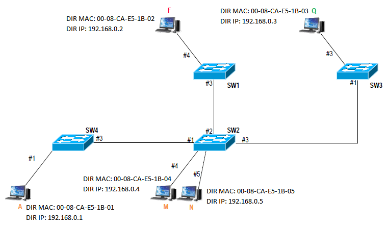

Transmisión de Datos y Redes de Computadores
============================================
3º Grado en Ingeniería Informática 2012/2013
--------------------------------------------

# Trabajo Tema 3: Arquitecturas y Servicios de Redes Corporativos
### Germán Martínez Maldonado

## Apartado 1

Basándonos en el esquema de red dado, le hemos asignado a cada una de las estaciones una dirección MAC y una dirección IP. Como se indica que los conmutadores y las estaciones acaban de encenderse y, por lo tanto, las tablas de las direcciones MAC de los conmutadores y las cachés ARP de las estaciones están vacías, cuando una estación quiera comunicarse con otra, como en este caso mediante un paquete ICMP disparado por el comando ping (conociendo únicamente la dirección IP), para que el paquete llegue  a  su destino pasando por los conmutadores, es necesario conocer la dirección MAC asociada a su dirección IP. Supongamos que vamos a hacer los siguientes 4 intercambios de paquetes ICMP:

| Estación Origen | Estación Origen | Estación Destino | Estación Destino |
|:---------------:|:---------------:|:----------------:|:----------------:|
|      Nombre     |   Dirección IP  |      Nombre      |   Dirección IP   |
|        A        |   192.168.0.1   |         Q        |    192.168.0.3   |
|        F        |   192.168.0.2   |         M        |    192.168.0.4   |
|        Q        |   192.168.0.3   |         N        |    192.168.0.5   |
|        N        |   192.168.0.5   |         A        |    192.168.0.1   |

Como ya hemos dicho que las estaciones tienen sus tablas de caché ARP vacías, la estación al no saber por dónde enviar el paquete ICMP, lo primero que hará es enviar un paquete **“ARP request”** a la dirección de difusión de la red, este paquete se transferirá por toda la red hasta que la máquina con la dirección IP correspondiente responda con un paquete **“ARP reply”**, quedando así la dirección IP asociada a la dirección MAC correspondiente tanto en la estación origen como en la estación destino. Los conmutadores de nuestra red irán aprendiendo las direcciones MAC de las diferentes estaciones según estas vayan enviando o recibiendo el tráfico generado, es por eso que como veremos, el aprendizaje de estos será escalonado en función de su necesidad.

**1. Origen: Estación A (192.168.0.1). Destino: Estación Q (192.168.0.3).**

* Camino seguido por las tramas: A -> SW4; SW4 -> SW2; SW2 -> SW3; SW3 -> Q; Q -> SW3; SW3 -> SW2; SW2 -> SW4; SW4 -> A.

* Tablas de direcciones MAC de los conmutadores:

|   SW1  |                   |
|:------:|:-----------------:|
| Puerto |   Dirección MAC   |
|   #3   | 00-08-CA-E5-1B-01 |

|   SW2  |                   |
|:------:|:-----------------:|
| Puerto |   Dirección MAC   |
|   #1   | 00-08-CA-E5-1B-01 |
|   #3   | 00-08-CA-E5-1B-03 |

|   SW3  |                   |
|:------:|:-----------------:|
| Puerto |   Dirección MAC   |
|   #1   | 00-08-CA-E5-1B-01 |
|   #3   | 00-08-CA-E5-1B-03 |

|   SW4  |                   |
|:------:|:-----------------:|
| Puerto |   Dirección MAC   |
|   #1   | 00-08-CA-E5-1B-01 |
|   #3   | 00-08-CA-E5-1B-03 |

* Tablas de cachés ARP en las estaciones:

|       A      |                   |
|:------------:|:-----------------:|
| Dirección IP |   Dirección MAC   |
|  192.168.0.3 | 00-08-CA-E5-1B-03 |

|       F      |                   |
|:------------:|:-----------------:|
| Dirección IP |   Dirección MAC   |
|  192.168.0.1 | 00-08-CA-E5-1B-01 |

|       Q      |                   |
|:------------:|:-----------------:|
| Dirección IP |   Dirección MAC   |
|  192.168.0.1 | 00-08-CA-E5-1B-01 |

|       M      |                   |
|:------------:|:-----------------:|
| Dirección IP |   Dirección MAC   |
|  192.168.0.1 | 00-08-CA-E5-1B-01 |

|       N      |                   |
|:------------:|:-----------------:|
| Dirección IP |   Dirección MAC   |
|  192.168.0.1 | 00-08-CA-E5-1B-01 |

**2. Origen: Estación F (192.168.0.2). Destino: Estación M (192.168.0.4).**

* Camino seguido por las tramas: F -> SW1; SW1 -> SW2; SW2 -> M; M -> SW2; SW2 -> SW1; SW1 -> F.

* Tablas de direcciones MAC de los conmutadores:

|   SW1  |                   |
|:------:|:-----------------:|
| Puerto |   Dirección MAC   |
|   #3   | 00-08-CA-E5-1B-01 |
|   #4   | 00-08-CA-E5-1B-02 |
|   #3   | 00-08-CA-E5-1B-04 |

|   SW2  |                   |
|:------:|:-----------------:|
| Puerto |   Dirección MAC   |
|   #1   | 00-08-CA-E5-1B-01 |
|   #3   | 00-08-CA-E5-1B-03 |
|   #2   | 00-08-CA-E5-1B-02 |
|   #4   | 00-08-CA-E5-1B-04 |

|   SW3  |                   |
|:------:|:-----------------:|
| Puerto |   Dirección MAC   |
|   #1   | 00-08-CA-E5-1B-01 |
|   #3   | 00-08-CA-E5-1B-03 |
|   #1   | 00-08-CA-E5-1B-02 |

|   SW4  |                   |
|:------:|:-----------------:|
| Puerto |   Dirección MAC   |
|   #1   | 00-08-CA-E5-1B-01 |
|   #3   | 00-08-CA-E5-1B-03 |
|   #3   | 00-08-CA-E5-1B-02 |

* Tablas de cachés ARP en las estaciones:

|       A      |                   |
|:------------:|:-----------------:|
| Dirección IP |   Dirección MAC   |
|  192.168.0.3 | 00-08-CA-E5-1B-03 |
|  192.168.0.2 | 00-08-CA-E5-1B-02 |

|       F      |                   |
|:------------:|:-----------------:|
| Dirección IP |   Dirección MAC   |
|  192.168.0.1 | 00-08-CA-E5-1B-01 |
|  192.168.0.4 | 00-08-CA-E5-1B-04 |

|       Q      |                   |
|:------------:|:-----------------:|
| Dirección IP |   Dirección MAC   |
|  192.168.0.1 | 00-08-CA-E5-1B-01 |
|  192.168.0.2 | 00-08-CA-E5-1B-02 |

|       M      |                   |
|:------------:|:-----------------:|
| Dirección IP |   Dirección MAC   |
|  192.168.0.1 | 00-08-CA-E5-1B-01 |
|  192.168.0.2 | 00-08-CA-E5-1B-02 |

|       N      |                   |
|:------------:|:-----------------:|
| Dirección IP |   Dirección MAC   |
|  192.168.0.1 | 00-08-CA-E5-1B-01 |
|  192.168.0.2 | 00-08-CA-E5-1B-02 |

**3. Origen: Estación Q (192.168.0.3). Destino: Estación N (192.168.0.5).**

* Camino seguido por las tramas: Q -> SW3; SW3 -> SW2; SW2 -> N; N -> SW2; SW2 -> SW3; SW3 -> Q.

* Tablas de direcciones MAC de los conmutadores:

|   SW1  |                   |
|:------:|:-----------------:|
| Puerto |   Dirección MAC   |
|   #3   | 00-08-CA-E5-1B-01 |
|   #4   | 00-08-CA-E5-1B-02 |
|   #3   | 00-08-CA-E5-1B-04 |
|   #3   | 00-08-CA-E5-1B-03 |

|   SW2  |                   |
|:------:|:-----------------:|
| Puerto |   Dirección MAC   |
|   #1   | 00-08-CA-E5-1B-01 |
|   #3   | 00-08-CA-E5-1B-03 |
|   #2   | 00-08-CA-E5-1B-02 |
|   #4   | 00-08-CA-E5-1B-04 |
|   #5   | 00-08-CA-E5-1B-05 |

|   SW3  |                   |
|:------:|:-----------------:|
| Puerto |   Dirección MAC   |
|   #1   | 00-08-CA-E5-1B-01 |
|   #3   | 00-08-CA-E5-1B-03 |
|   #1   | 00-08-CA-E5-1B-02 |
|   #1   | 00-08-CA-E5-1B-05 |

|   SW4  |                   |
|:------:|:-----------------:|
| Puerto |   Dirección MAC   |
|   #1   | 00-08-CA-E5-1B-01 |
|   #3   | 00-08-CA-E5-1B-03 |
|   #3   | 00-08-CA-E5-1B-02 |

* Tablas de cachés ARP en las estaciones:

|       A      |                   |
|:------------:|:-----------------:|
| Dirección IP |   Dirección MAC   |
|  192.168.0.3 | 00-08-CA-E5-1B-03 |
|  192.168.0.2 | 00-08-CA-E5-1B-02 |

|       F      |                   |
|:------------:|:-----------------:|
| Dirección IP |   Dirección MAC   |
|  192.168.0.1 | 00-08-CA-E5-1B-01 |
|  192.168.0.4 | 00-08-CA-E5-1B-04 |
|  192.168.0.3 | 00-08-CA-E5-1B-03 |

|       Q      |                   |
|:------------:|:-----------------:|
| Dirección IP |   Dirección MAC   |
|  192.168.0.1 | 00-08-CA-E5-1B-01 |
|  192.168.0.2 | 00-08-CA-E5-1B-02 |
|  192.168.0.5 | 00-08-CA-E5-1B-05 |

|       M      |                   |
|:------------:|:-----------------:|
| Dirección IP |   Dirección MAC   |
|  192.168.0.1 | 00-08-CA-E5-1B-01 |
|  192.168.0.2 | 00-08-CA-E5-1B-02 |
|  192.168.0.3 | 00-08-CA-E5-1B-03 |

|       N      |                   |
|:------------:|:-----------------:|
| Dirección IP |   Dirección MAC   |
|  192.168.0.1 | 00-08-CA-E5-1B-01 |
|  192.168.0.2 | 00-08-CA-E5-1B-02 |
|  192.168.0.3 | 00-08-CA-E5-1B-03 |

**4. Origen: Estación N (192.168.0.5). Destino: Estación A (192.168.0.1).**

* Camino seguido por las tramas: N -> SW2; SW2 -> SW4; SW4 -> A; A -> SW4; SW4 -> SW2; SW2 -> N;

* Tablas de direcciones MAC de los conmutadores:

|   SW1  |                   |
|:------:|:-----------------:|
| Puerto |   Dirección MAC   |
|   #3   | 00-08-CA-E5-1B-01 |
|   #4   | 00-08-CA-E5-1B-02 |
|   #3   | 00-08-CA-E5-1B-04 |
|   #3   | 00-08-CA-E5-1B-03 |

|   SW2  |                   |
|:------:|:-----------------:|
| Puerto |   Dirección MAC   |
|   #1   | 00-08-CA-E5-1B-01 |
|   #3   | 00-08-CA-E5-1B-03 |
|   #2   | 00-08-CA-E5-1B-02 |
|   #4   | 00-08-CA-E5-1B-04 |
|   #5   | 00-08-CA-E5-1B-05 |

|   SW3  |                   |
|:------:|:-----------------:|
| Puerto |   Dirección MAC   |
|   #1   | 00-08-CA-E5-1B-01 |
|   #3   | 00-08-CA-E5-1B-03 |
|   #1   | 00-08-CA-E5-1B-02 |
|   #1   | 00-08-CA-E5-1B-05 |

|   SW4  |                   |
|:------:|:-----------------:|
| Puerto |   Dirección MAC   |
|   #1   | 00-08-CA-E5-1B-01 |
|   #3   | 00-08-CA-E5-1B-03 |
|   #3   | 00-08-CA-E5-1B-02 |
|   #3   | 00-08-CA-E5-1B-05 |

* Tablas de cachés ARP en las estaciones:

|       A      |                   |
|:------------:|:-----------------:|
| Dirección IP |   Dirección MAC   |
|  192.168.0.3 | 00-08-CA-E5-1B-03 |
|  192.168.0.2 | 00-08-CA-E5-1B-02 |
|  192.168.0.5 | 00-08-CA-E5-1B-05 |

|       F      |                   |
|:------------:|:-----------------:|
| Dirección IP |   Dirección MAC   |
|  192.168.0.1 | 00-08-CA-E5-1B-01 |
|  192.168.0.4 | 00-08-CA-E5-1B-04 |
|  192.168.0.3 | 00-08-CA-E5-1B-03 |

|       Q      |                   |
|:------------:|:-----------------:|
| Dirección IP |   Dirección MAC   |
|  192.168.0.1 | 00-08-CA-E5-1B-01 |
|  192.168.0.2 | 00-08-CA-E5-1B-02 |
|  192.168.0.5 | 00-08-CA-E5-1B-05 |

|       M      |                   |
|:------------:|:-----------------:|
| Dirección IP |   Dirección MAC   |
|  192.168.0.1 | 00-08-CA-E5-1B-01 |
|  192.168.0.2 | 00-08-CA-E5-1B-02 |
|  192.168.0.3 | 00-08-CA-E5-1B-03 |

|       M      |                   |
|:------------:|:-----------------:|
| Dirección IP |   Dirección MAC   |
|  192.168.0.1 | 00-08-CA-E5-1B-01 |
|  192.168.0.2 | 00-08-CA-E5-1B-02 |
|  192.168.0.3 | 00-08-CA-E5-1B-03 |

En este último caso, como la estación N ya tenía almacenado en su tabla ARP la dirección MAC de la estación A (se almacenó cuando A mando el mensaje de difusión en busca de Q), no es necesario un nuevo mensaje de difusión para el descubrimiento de su dirección física, además el conmutador SW2 (al que está conectado N) también conoce por donde tiene que enviar los paquetes destinados a la dirección MAC de A. Será en la tabla de direcciones MAC de SW4 y en la tabla de caché ARP de A donde se almacene la dirección física de N ya que era desconocida hasta ahora.

## Apartado 2

El funcionamiento del protocolo de encaminamiento dinámico RIP es simple:

* Cuando se inicia en un dispositivo, este envía un mensaje de solicitud (comando 1: request) a todos sus vecinos para que le envíen sus tablas de enrutamiento.
* Cuando los vecinos reciben la solicitud, devuelven como respuesta (comando 2: response) su tabla de enrutamiento.
* Cuando el router recibe las tablas de enrutamiento de sus vecinos, comprueba si hay alguna entrada de ruta nueva y, en caso de ser así, la añade a la suya propia.
* Si la ruta no es nueva, pero tiene un menor número de saltos, esa ruta remplaza a la existente en nuestra tabla de enrutamiento.
* Si en la tabla de enrutamiento no existe una ruta para llegar a un router determinado, el número de saltos de esa ruta se pone a 16, es una ruta inalcanzable.
* Por defecto, cada router envía una actualización de su tabla de enrutamiento cada 30 segundos. Cuando una ruta no se vuelve a difundir en 180, se declara enlace muerto.

El proceso hasta que las rutas se mantuviesen estables transcurriría de la siguiente manera:

* En el instante de tiempo t0, se produce la activación de RIP en router A: 
 * A: A(0/A), B(1/B), F(1/F)
* En el instante de tiempo t0+5, se produce la activación de RIP en router B: 
 * B: A(1/A), B(0/B), C(1/C)
* En el instante de tiempo t0+10, se produce la activación de RIP en router C: 
 * C: B(1/B), C(0/C), D(1/D)
* En el instante de tiempo t0+15, se produce la activación de RIP en router D: 
 * D: C(1/C), D(0/D), E(1/E)
* En el instante de tiempo t0+20, se produce la activación de RIP en router E: 
 * E: D(1/D), E(0/E), F(1/F)
* En el instante de tiempo t0+25, se produce la activación de RIP en router F: 
 * F: A(1/A), E(1/E), F(0/F)
* En el instante de tiempo t0+30, se produce la actualización de RIP en router A: 
 * B -> A: A(0/A), B(1/B), C(2/B)
 * F -> A: A(0/A), E(2/F), F(1/F)
 * A: A(0/A), B(1/B), C(2/B), E(2/F), F(1/F)
* En el instante de tiempo t0+35, se produce la actualización de RIP en router B: 
 * C -> B: B(0/B), C(1/C), D(2/C)
 * A -> B: A(1/A), B(0/B), C(1/C), E(3/A), F(2/A)
 * B: A(1/A), B(0/B), C(1/C), D(2/C), E(3/A), F(2/A)
* En el instante de tiempo t0+40, se produce la actualización de RIP en router C: 
 * D -> C: C(0/C), D(1/D), E(2/D)
 * B -> C: A(2/B), B(1/B), C(0/C), D(1/D), E(4/B), F(3/B)
 * C: A(2/B), B(1/B), C(0/C), D(1/D), E(2/D), F(3/B)
* En el instante de tiempo t0+45, se produce la actualización de RIP en router D: 
 * E -> D: D(0/D), E(1/E), F(2/E)
 * C -> D: A(3/C), B(2/C), C(1/C), D(0/D), E(1/E), F(4/C)
 * D: A(3/C), B(2/C), C(1/C), D(0/D), E(1/E), F(2/E)
* En el instante de tiempo t0+50, se produce la actualización de RIP en router E: 
 * F -> E: A(2/F), E(0/E), F(1/F)
 * D -> E: A(4/D), B(3/D), C(2/D), D(1/D), E(0/E), F(1/F)
 * E: A(2/F), B(3/D), C(2/D), D(1/D), E(0/E), F(1/F)
* En el instante de tiempo t0+55, se produce la actualización de RIP en router F: 
 * A -> F: A(1/A), B(2/A), C(3/A), E(1/E), F(0/F)
 * E -> F: A(1/A), B(4/E), C(3/E), D(2/E), E(1/E), F(0/F)
 * F: A(1/A), B(2/A), C(3/A), D(2/E), E(1/E), F(0/F)
* En el instante de tiempo t0+60, se produce la actualización de RIP en router A: 
 * B -> A: A(0/A), B(1/B), C(2/B), D(3/B), E(2/F), F(1/F)
 * F -> A: A(0/A), B(1/B), C(2/B), D(3/F), E(2/F), F(1/F)
 * A: A(0/A), B(1/B), C(2/B), D(3/B), E(2/F), F(1/F)

Una vez que se produce la segunda actualización de RIP en router A en el instante de tiempo t0+60, conseguimos obtener la ruta desde el router A hasta el router D, que era la única ruta que faltó en la primera actualización. En el resto de router como solo podemos encontrar rutas, que en el mejor de los casos, igualan el coste de las rutas actuales, estas no variarán mientras que sigan activas.
