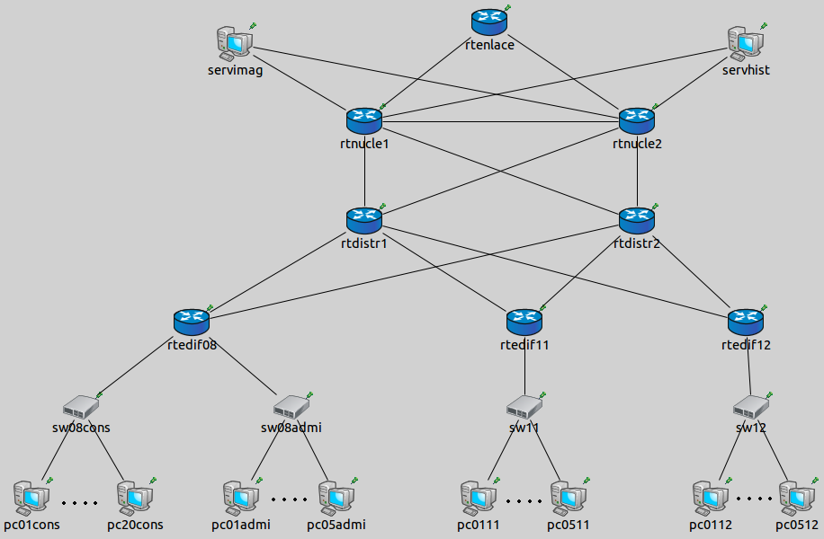

Transmisión de Datos y Redes de Computadores
============================================
3º Grado en Ingeniería Informática 2012/2013
--------------------------------------------

# Trabajo Tema 4: Diseño, Planificación y Despliegue de Redes
### Germán Martínez Maldonado

El diseño mediante un modelo jerárquico de la red que cubra el edificio  Emergency (edificio 8), Advanced Imaging (edificio 10), Montana Cancer Specialists at CMC (edificio 11) y Ronald McDonald House (edificio 12) quedaría como se ve en la siguiente imagen:

Empezamos la descripción por el núcleo, en nuestro caso se situaría en el edificio de Advanced Imaging ya que es donde se encuentra el router que interconecta este campus con el resto de campus sanitarios y es parte del troncal de la red, básicamente está compuesto por 3 routers y 2 servidores.

Uno de los servidores será el que contenga la base de datos de imágenes y otro servidor será el que contenga la base de datos de los historiales médicos; en cuanto a los routers, debemos tener en cuenta que la carga generada por el servidor de imágenes es de 50 Mbps, como no conocemos la carga del servidor de historiales la supones despreciable. Si bien se indica que en los próximos años el número de puestos crecerá escasamente, como solo se indica uso por parte del edificio de urgencias del servidor que genera una mayor carga, será suficiente con que los routers que instalemos trabajen a esa misma velocidad de transferencia (50 Mbps), porque al instalarlos por duplicado, aparte de funcionar como ruta de respaldo, también servirá para balancear la carga del tráfico. Así que instalaremos el router que interconecta los campus y 2 routers más, para conectar el router de interconexión con los router que a su vez están conectados a los router de la capa de distribución y a los servidores.

La capa distribución, que nos dará acceso a la red externa y a los servidores a través de los router del núcleo, estará compuesta por 2 router de las mismas características que los anteriores. El motivo de instalar 2 vuelve a ser por tener una ruta de respaldo mediante la redundancia y la compartición de la carga del tráfico generado en la red.

Finalmente en la capa de acceso los elementos a usar se dividen en 3 grupos, los pertenecientes al edificio Emergency, los del edificio 11 y los del edificio 12. Por parte del edificio Emergency, tenemos 20 puestos de urgencias conectados a 1 un conmutador y 5 puestos de administración conectados a otro conmutador, para así tener una separación física de los puestos en función de su ocupación, ambos conmutadores irán conectados al router del edificio. Tanto el edificio 11 como para el edificio 12 tendrán el mismo diseño de red, 5 puestos conectados a un conmutador que a su vez está conectado al router del edificio. Por otro lado, para que los conmutadores no formen un cuello de botella en ninguna de las conexiones de los edificios, deben soportar una velocidad de transferencia igual a la de los routers (50 Mbps), además de tener puertos libres suficientes para cumplir con la previsión de crecimiento (5 puestos de urgencias y 2 en puestos de administración y en puestos de los edificios 11 y 12). Para terminar, cada router de cada uno de los 3 edificios estará conectado a cada router de la capa de la capa de distribución, así entre otras cosas, cumplimos el requisito de que el edificio de urgencias esté siempre conectado a la red gracias a las rutas de respaldo que esto genera.

Solo queda diseñar el esquema de nombres a utilizar, todo nombre de un  elemento comenzará haciendo referencia al tipo de elemento que es: **“rt”** -> router, **“sw”** -> conmutador, **“pc”** -> puesto de trabajo, **“serv”** -> servidor de base de datos. Los routers se nombrarán según la capa a la que pertenezcan: en el núcleo el router que da acceso al exterior será **“rtenlace”** y los otros **“rtnucle1”** y **“rtnucle2”**, en la capa de distribución será **“rtdistr1”** y **“rtdistr2”**, y en la capa de acceso será **“rtedifXX”**, donde **“XX”** es el número del edificio (08, 11 y 12 en nuestro caso). Para los conmutadores se nombrarán en función de si el edificio al que pertenecen tiene más de un conmutador, si hay más de uno se nombrarán **“swXXYYYY”**, donde **“XX”** es el número del edificio e **“YYYY”** indica el tipo de trabajo de los puestos a interconectar (**“sw08cons”** es el conmutador de los puestos de consultas y **“sw08admi”** es el conmutador de los puestos de administración), si solo hay un conmutador este será **“swXX”**, siendo **“XX”** el número del edificio (**“sw11”** y **“sw12)”**. Los puestos de trabajos también se nombrarán en función del número de conmutadores, siendo en **“pcXXYYYY”** el **“XX”** el número de puesto e **“YYYY”** el tipo de trabajo (en el edificio de urgencias tenemos desde **“pc01cons”** hasta **“pc20cons”** para los puestos de consulta y desde **“pc01admi”** hasta **“pc05admi”** para los puestos de administración); si el edificio solo tiene un conmutador, los puestos recibirán el nombre de **“pcXXYY”**, **“XX”** el número del puesto de trabajo e **“YY”** el número el edificio (**“pc0111”** a **“pc0511”** para el edificio 11 y **“pc0112”** a **“pc0512”** para el edificio 12). Por último, los servidores recibirán el nombre de **“servXXXX”**, indicando **“XXXX”** su contenido, **“servimag”** el servidor con la base de datos de imágenes y **“servhist”** el servidor de base de datos de historiales médicos.

Para finalizar solo nos queda asignar las direcciones IP de las redes y los dispositivos, para ello vamos a dividir el diseño hecho en 4 niveles que contienen un total de 8 subredes:

* Nivel A: máximo 35 direcciones -> 2^6 = 64 direcciones -> Máscara: /26
 * Subred  1  (Edificio  8):  dirección  de  red,  router  rtedif08,  20  hosts  consulta,  5  hosts administración, 7 hosts reserva ampliación, dirección de broadcast.
 * Subred 2 (Edificio 11): dirección de red, router rtedif11, 5 hosts trabajo, 2 hosts reserva ampliación, dirección de broadcast.
 * Subred 3 (Edificio 12): dirección de red, router rtedif12, 5 hosts trabajo, 2 hosts reserva ampliación, dirección de broadcast.
* Nivel B: 6 direcciones -> 2^3 = 8 direcciones -> Máscara: /23
 * Subred 4: red, rtdistr1, rtedit08, rtedif11, rtedif12, broadcast.
 * Subred 5: red, rtdistr2, rtedit08, rtedif11, rtedif12, broadcast.
* Nivel C: 7 direcciones -> 2^3 = 8 direcciones -> Máscara: /20
 * Subred 6: red, rtnucle1, rtdistr1, rtdistr2, servimag, servihist, broadcast.
 * Subred 7: red, rtnucle2, rtdistr1, rtdistr2, servimag, servihist, broadcast.
* Nivel D: 5 direcciones -> 2^3 = 8 direcciones -> Máscara: /17
 * Subred 8: red, rtenlace, rtnucle1, rtnucle2, broadcast.

Teniendo esto en cuenta, la asignación de direcciones IP sería la siguiente: Subred 1-> Red: 173.19.0.0/26,	Broadcast: 173.19.0.63/26

* Subred 2-> Red: 173.19.0.64/26,     Broadcast: 173.19.0.127/26
* Subred 3-> Red: 173.19.0.128/26,    Broadcast: 173.19.0.191/26 
* Subred 4-> Red: 173.19.0.0/23,      Broadcast: 173.19.1.255/23 
* Subred 5-> Red: 173.19.2.0/23,      Broadcast: 173.19.3.255/23 
* Subred 6-> Red: 173.19.0.0/20,      Broadcast: 173.19.15.255/20 
* Subred 7-> Red: 173.19.16.0/20,     Broadcast: 173.19.31.255/20 
* Subred 8-> Red: 173.19.0.0/17,      Broadcast: 173.19.127.255/17

* rtedif08: 173.19.0.1/26,    173.19.0.2/23,  173.19.2.2/23
* rtedif11: 173.19.0.65/26,   173.19.0.3/23,  173.19.2.3/23
* rtedif12: 173.19.0.129/26,  173.19.0.4/23,  173.19.2.4/23
* rtdistr1: 173.19.0.1/23,    173.19.0.2/20,  173.19.16.2/20
* rtdistr2: 173.19.2.1/23,    173.19.0.3/20,  173.19.16.3/20
* rtnucle1: 173.19.0.1/20,    173.19.0.2/17
* rtnucle2: 173.19.16.1/20,   173.19.0.3/17
* rtenlace: 173.19.0.1/17,    puerta de acceso

* pcXXcons: 173.19.0.[2-21]/26 
* pcXXadmi: 173.19.0.[22-26]/26 
* pcXX11:   173.19.0.[66-70]/26 
* pcXX12:   173.19.0.[130-134]/26

* servimag: 173.19.0.4/20,    173.19.16.4/20
* servhist: 173.19.0.5/20,    173.19.16.5/20
