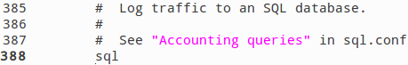
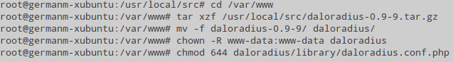
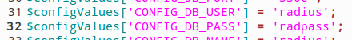
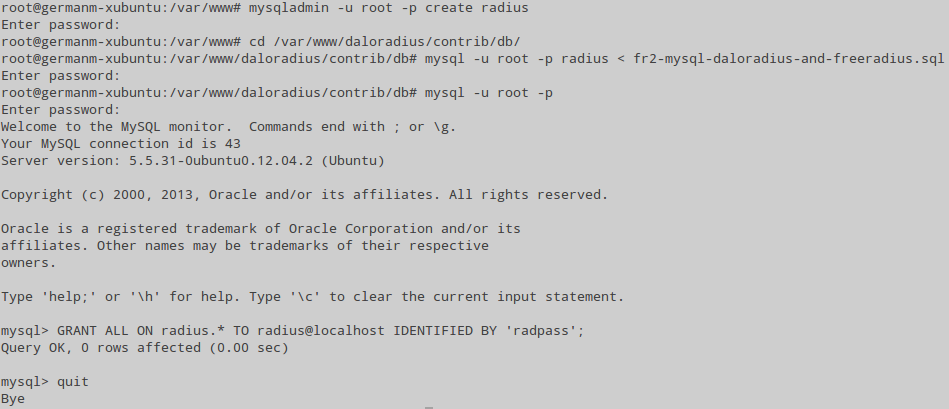
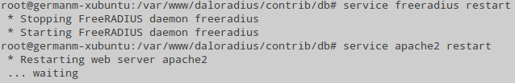
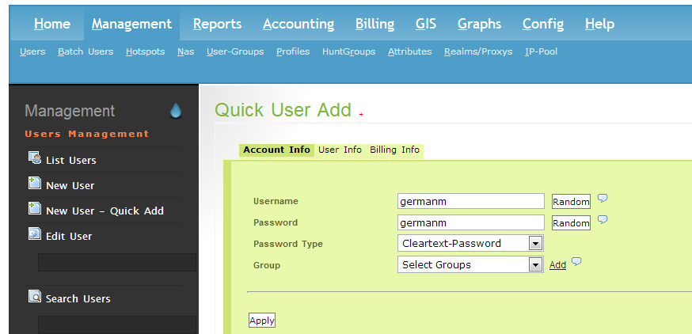
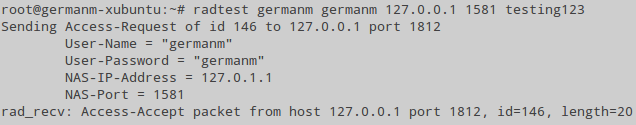
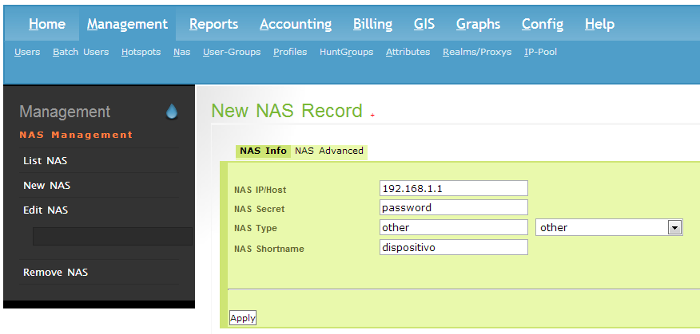

Transmisión de Datos y Redes de Computadores
============================================
3º Grado en Ingeniería Informática 2012/2013
--------------------------------------------


# Trabajo Tema 6: Seguridad en Redes
### Germán Martínez Maldonado

## Protocolo RADIUS

**RADIUS (Remote Authentication Dial-In User Server)** es un protocolo **AAA (Autenticación, Autorización y Administración)** para aplicaciones de acceso a redes o movilidad IP. Un ejemplo típico de uso del protocolo RADIUS lo podemos encontrar en las conexiones a internet a través de ISP, estos requieren un nombre de usuario y contraseña para conectarse a la red. Para obtener acceso, estos datos son mandados a un dispositivo **NAS (Network Acess Server)** sobre un protocolo de capa de enlace, como es **PPP (Point to Point Protocol)** que se usa en conexiones telefónica y DSL, el dispositivo NAS será el que usando el protocolo RADIUS reenviará esta petición a un servidor RADIUS. El servidor RADIUS comprobará que la información que ha recibido es correcta usando para ello protocolos de autenticación como **PAP (Password Authentication Protocol), CHAP (Challenge Handshake Authentication Protocol) o EAP (Extensible Authentication Protocol)**. Si la información es correcta, el servidor responderá autorizando a que se acceda al sistema del ISP para tener acceso a su red.

RADIUS también es usado habitualmente por los dispositivos NAS para notificar eventos como el inicio o cierre de sesión de un usuario y el total de paquetes y volumen de datos transferidos durante la sesión. Por su capacidad de manejar sesiones se pueden usar para gestionar los usuarios en los archivos de texto, servidores de acceso a directorio, bases de datos, etc., usando habitualmente SNMP para monitorear remotamente el servicio. Hoy en día podemos encontrar una gran variedad tanto de servidores comerciales como de código abierto, precisamente vamos a mostrar cómo se realizaría la instalación de un servidor RADIUS de código abierto, **FreeRADIUS**, con una aplicación para gestionar servidores RADIUS a través de la web, **daloRADIUS**.

Lo primero que hacemos es instalar FreeRADIUS desde línea de comandos (`# apt-get install freeradius freeradius-mysql freeradius-utils`). Una vez instalados los paquetes, para poder tratar con bases de datos, en el archivo **“/etc/freeradius/sites-enabled/locations”** descomentando las líneas **“sql”** en la secciones **“authorize”** y **“accouting”**, y en el archivo **“/etc/freeradius/radius.conf”** descomentamos la línea **“$INCLUDE sql.conf”**:



Ahora tenemos que descargar daloRADIUS, podemos hacerlo directamente desde este enlace, pero antes tenemos que instalar todos los paquetes necesarios para que daloRADIUS funcione, entre los que encontramos el servidor web Apache, el sistemas de gestión de base de datos MySQL y el lenguaje de programación PHP. La línea de comandos con todos los paquetes a instalar es `# apt-get install apache2 php5 php5-gd php-pear php-db libapache2- mod-php5 php-mail php5-mysql mysql-server`. Descomprimimos el archivo comprimido que contiene daloRADIUS en la carpeta **“/var/www”** para que sea accesible desde nuestro servidor Apache, lo descomprimimos `tar xzf`, le cambiamos su nombre al directorio para que sea más fácilmente accesible `mv –f`, le cambiamos el propietario al usuario/grupo que se usa específicamente para los servidores webs `chown www-data`, y le cambiamos los permisos al archivo de configuración **“daloradius/library/daloradius.conf.php”** para que el propietario tenga acceso de lectura y escritura, mientras que los otros solo pueden leerlo `chmod 644`.



Seguidamente, editamos el archivo de configuración de daloRADIUS al que le acabamos de cambiar los permisos, para indicar el nombre de usuario y la contraseña con el que accederá a la base de datos, deberemos buscar las líneas con **“CONFIG_DB_USER”** al que le daremos el valor **“radius”** y **“CONFIG_DB_PASS”** al que le daremos el valor **“radpass”**.



Creamos ahora la base de datos **“radius”** accediendo a mysqladmin como root (`mysqladmin –u root –p create radius`), e importamos la base de datos de un archivo SQL que se encuentra en el directorio **“/var/www/dalodarius/contrib/db”** y que contiene todas las tablas preparadas para poder comenzar directamente con la configuración de daloRADIUS y freeRADIUS (`mysql –u root –p radius < fr2-mysql-daloradius-and-freeradius.sql`). Para terminar con la configuración de la base de datos, nos falta añadir el usuario **“radius”** con contraseña **“radpass”**, que será el que usará la aplicación para acceder a la base de datos (`GRANT ALL ON radius.* TO radius@localhost IDENTIFIED BY ‘radpass’;`).



Para que todas las nuevas configuraciones sean cargadas, reiniciamos el servidor FreeRadius (`# service freeradius restart`) y el servidor Apache (`# service apache2 restart`).



Para acceder a la interfaz web de daloRADIUS, introducimos en un navegador la dirección IP de nuestra máquina servidor seguido del nombre de la carpeta que pusiéramos a la carpeta de daloRADIUS (en nuestro caso es **“http://192.168.78.148/dalodarius”**). Introducimos como nombre de usuario **“administrator”** y como password **“radius”**.


Una vez dentro, accedemos al menú **“Management -> Users”** para añadir un  nuevo usuario con la opción de la izquierda **“New User – Quick Add”**, simplemente tenemos que introducir un nombre de usuario y contraseña para ese usuario y pulsar el botón **“Apply”**.



Para probar que funciona, desde la máquina donde hemos instalado FreeRADIUS usamos el comando `radtest`, indicando el nombre de usuario y contraseña del usuario que acabamos de crear, la dirección local, el puerto usado generalmente para las conexiones RADIUS y la contraseña para acceder al cliente: `radtest germanm germanm 127.0.0.1 1581 testing123`. Si la prueba ha sido correcta, obtendremos como respuesta **“Acess-Accept”**.



Para hacer esta prueba  hemos usado un cliente que viene  definido por  defecto para acceder al servidor RADIUS  localmente, si  queremos acceder desde  dispositivos externos, debemos añadirlos primero en el archivo **“/etc/freeradius/clients.conf”**, donde veremos todos los clientes definidos, deberemos indicar como mínimo la dirección IP del dispositivo (ipaddr), una clave para acceder (secret), un nombre corto que sirva para identificarlo (shortname) y el tipo de dispositivo NAS que se está usando para que sepa que método de conexión usar (nastype):

```
client cliente_externo {
    ipaddr       = 192.168.1.1
    secret       = password
    shortname    = dispositivo
    nastype      = other
}
```

Esto que acabamos de hacer, también podemos realizarlo desde daloRADIUS en el menú **“Management -> Nas”**, en la opción de la izquierda **“New NAS”**, que nos mostrará un formulario que nos pedirá la misma información indicada en el párrafo anterior.


